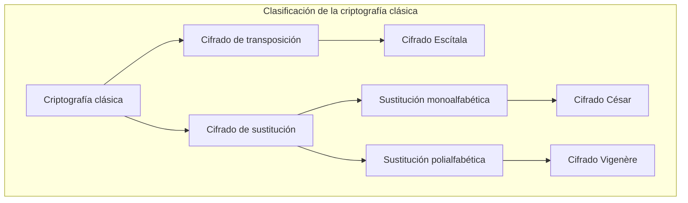
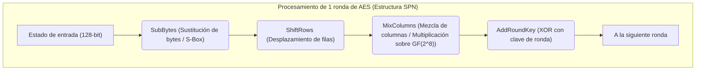
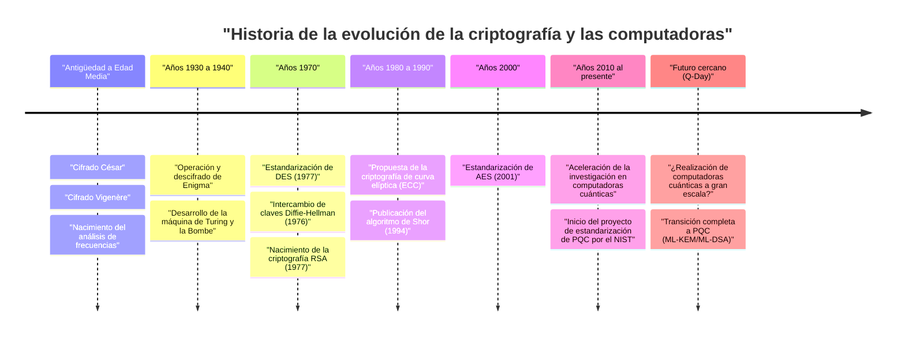

# 1. Introducción: ¿Qué es la criptografía?

La criptografía (Cryptography) es la tecnología utilizada para mantener el secreto de la información y ha evolucionado junto con la historia de la humanidad. Desde la transmisión de órdenes secretas en las guerras antiguas hasta la protección de la información de tarjetas de crédito en el internet moderno, el propósito de la criptografía ha sido constante. Es "garantizar que solo el destinatario previsto pueda entender la información y que no pueda ser descifrada por terceros".

En la seguridad de la información moderna, la criptografía no se limita simplemente al "secreto de la información (Confidencialidad: Confidentiality)", sino que desempeña roles cruciales como la "Integridad (Integrity)", la "Autenticación (Authentication)" y el "No repudio (Non-repudiation)" de los datos.

En este artículo, desentrañaremos en detalle la historia de la evolución de la criptografía desde una perspectiva técnica y matemática, comenzando desde los simples cifrados de sustitución de la antigüedad, pasando por los cifrados mecánicos, la criptografía moderna de clave simétrica y pública, hasta llegar a la era de la "criptografía poscuántica (PQC)", que llegará con la implementación práctica de las computadoras cuánticas.

---

# 2. La era de la criptografía clásica: sustitución y transposición de caracteres

Los orígenes de la criptografía se remontan a antes de Cristo. Los primeros cifrados consistían principalmente en dos enfoques: "transposición (reordenamiento)" y "sustitución (reemplazo)".

## Cifrado Escítala (Cifrado de transposición)
La "Escítala (Scytale)", utilizada en la antigua Esparta de Grecia en el siglo V a.C., es uno de los dispositivos criptográficos más antiguos. Se enrollaba una tira de pergamino larga y estrecha alrededor de un bastón de madera de un grosor específico, y el mensaje se escribía transversalmente en él. Al desenrollar el pergamino, las letras aparecían en un orden sin sentido, pero el destinatario, al tener un bastón del mismo grosor y volver a enrollar el pergamino, podía leer el mensaje original.

## Cifrado César (Cifrado de sustitución monoalfabética)
Se dice que en el siglo I a.C., el héroe de la antigua Roma, Julio César, utilizó el "cifrado César". Este es un cifrado de sustitución monoalfabética (Monoalphabetic substitution) que desplaza el alfabeto un número fijo de posiciones (generalmente 3 letras).

Matemáticamente, tratando las letras como valores numéricos del $0$ al $25$ y dejando que el número de desplazamientos sea $K$, la conversión de texto plano $P$ a texto cifrado $C$ se expresa mediante la siguiente congruencia:

$$C \equiv P + K \pmod{26}$$

El descifrado realiza la operación inversa:

$$P \equiv C - K \pmod{26}$$

```python
# Ejemplo simple de implementación del cifrado César en Python
def caesar_cipher(text, shift, mode="encrypt"):
    result = ""
    if mode == "decrypt":
        shift = -shift
    
    for char in text:
        if char.isalpha():
            base = ord('A') if char.isupper() else ord('a')
            # Cálculo del desplazamiento
            result += chr((ord(char) - base + shift) % 26 + base)
        else:
            result += char
    return result

# Ejemplo de ejecución
plaintext = "HELLO WORLD"
ciphertext = caesar_cipher(plaintext, 3, "encrypt")
print(f"Texto cifrado: {ciphertext}") # KHOOR ZRUOG
```

## Análisis de frecuencias y el cifrado Vigenère
Los cifrados de sustitución monoalfabética se volvieron fáciles de descifrar mediante el "análisis de frecuencias (Frequency Analysis)", ideado por el erudito árabe Al-Kindi en el siglo IX. Aprovecha las propiedades estadísticas del idioma, como la alta frecuencia de aparición de las letras "E" y "T" en inglés.

Para contrarrestar esto, en el siglo XVI se ideó el "cifrado Vigenère (Vigenère cipher)". Este es un cifrado de sustitución polialfabética (Polyalphabetic substitution) que utiliza múltiples desplazamientos (claves) cambiando periódicamente, y fue llamado "El cifrado indescifrable (Le Chiffre Indéchiffrable)" durante unos 300 años.

Matemáticamente, se cifra utilizando la $i$-ésima letra del texto plano $P_i$ y la $i$-ésima letra de la clave repetida $K_i$ de la siguiente manera:

$$C_i \equiv P_i + K_i \pmod{26}$$

Sin embargo, este cifrado también fue descifrado en el siglo XIX, cuando Charles Babbage y Friedrich Kasiski descubrieron el "examen Kasiski (Kasiski examination)", que deduce la longitud de la clave a partir de patrones repetidos en el texto cifrado.



---

# 3. Criptografía mecánica y guerras mundiales: Enigma y su descifrado

En el siglo XX, a medida que los medios de comunicación pasaron de las cartas al telégrafo y la radio, se requería mayor velocidad y complejidad en el cifrado. Fue aquí donde apareció la "criptografía mecánica", que combinaba rotores (discos giratorios).

## La amenaza de Enigma
Durante la Segunda Guerra Mundial, la Alemania nazi utilizó "Enigma", la máquina de cifrado más famosa en la historia de la criptografía. Enigma constaba de múltiples rotores (generalmente de 3 a 4), un panel de conexiones (Steckerbrett) que intercambiaba el cableado de las letras, y un reflector (rotor de inversión).

Dado que los rotores giraban cada vez que se escribía una letra en el teclado, incluso si se escribía la misma letra consecutivamente, se emitían diferentes letras cifradas (el pináculo de la criptografía polialfabética). Su espacio de claves (combinaciones de configuraciones) era de aproximadamente $1.58 \times 10^{19}$ (unos 15,8 trillones), y se consideraba imposible de descifrar por fuerza bruta con la tecnología de la época.

## Alan Turing y la "Bombe"
El equipo de descifrado británico de Bletchley Park, basándose en los logros iniciales de matemáticos polacos como Marian Rejewski, desafió a la inexpugnable Enigma.

En particular, Alan Turing (Alan Turing) utilizó conjeturas de texto plano que correspondían a partes del texto cifrado (Crib) para desarrollar la "Bombe (Bombe)", una máquina de descifrado electromecánica. La Bombe detectaba rápidamente contradicciones lógicas, descartando rápidamente configuraciones imposibles de los rotores y teniendo éxito en descifrar Enigma. Se dice que este logro adelantó la victoria de los Aliados en varios años.

---

# 4. El amanecer de la criptografía moderna: criptografía de clave simétrica (DES y AES)

Después de la guerra, con la llegada de las computadoras, la criptografía experimentó un cambio de paradigma drástico, pasando de la manipulación de "caracteres" a la manipulación de "bits (0 y 1)".

## Claude Shannon y la teoría de la información
En 1949, Claude Shannon publicó el artículo "Teoría de la comunicación de los sistemas secretos", sentando las bases matemáticas de la criptografía moderna. Propuso la "confusión (Confusion)" y la "difusión (Diffusion)" como principios para un diseño criptográfico seguro.
- **Confusión (Confusion)**: Hacer que la relación entre la clave y el texto cifrado sea lo más compleja posible. (Logrado mediante sustitución/cajas S)
- **Difusión (Diffusion)**: Hacer que un cambio de 1 bit en el texto plano afecte a muchos bits en el texto cifrado. (Logrado mediante transposición/permutación)

## DES (Data Encryption Standard)
En 1977, el Instituto Nacional de Estándares y Tecnología de EE. UU. (NIST, entonces NBS) estableció "DES", basado en un diseño de IBM, como estándar criptográfico.
DES adoptó una arquitectura llamada "Red de Feistel (Feistel Network)" y tenía un tamaño de bloque de 64 bits y una longitud de clave de 56 bits. Tenía la ventaja de implementación de que los algoritmos de cifrado y descifrado tenían estructuras casi idénticas.

Sin embargo, a medida que aumentaba el poder de cálculo de las computadoras, se hizo evidente que una longitud de clave de 56 bits (aproximadamente $7.2 \times 10^{16}$ combinaciones) era insuficiente. En 1998, la Electronic Frontier Foundation (EFF) desarrolló una máquina dedicada llamada "Deep Crack" y demostró que podía descifrar DES en unos pocos días.

## AES (Advanced Encryption Standard)
Como nuevo estándar para reemplazar a DES, en 2001 se estableció "AES". Se adoptó el algoritmo "Rijndael", creado por criptógrafos belgas y elegido a través de un concurso público.

AES adoptó la "Red de Sustitución-Permutación (SPN: Substitution-Permutation Network)" en lugar de la red de Feistel y utiliza operaciones matemáticas sobre el cuerpo de Galois (cuerpo finito) $GF(2^8)$. La longitud de la clave se puede elegir entre 128, 192 y 256 bits, y todavía se utiliza ampliamente en todo el mundo como la criptografía de clave simétrica estándar.



---

# 5. La revolución de la criptografía de clave pública: de Diffie-Hellman a RSA

La criptografía de clave simétrica tenía una debilidad fatal. Ese era el "Problema de distribución de claves (Key Distribution Problem)". Este es el problema de cómo compartir de forma segura una "clave común" con una parte lejana antes de iniciar una comunicación cifrada. La "criptografía de clave pública", nacida en la década de 1970, resolvió este problema.

## Intercambio de claves Diffie-Hellman
En 1976, Whitfield Diffie y Martin Hellman publicaron el artículo pionero "New Directions in Cryptography". Propusieron un método para compartir claves de forma segura incluso en un canal de comunicación interceptado, explotando la dificultad matemática del "Problema del logaritmo discreto (Discrete Logarithm Problem)".

1. Se publican un número primo grande $p$ y un generador $g$.
2. Alice elige un valor secreto $a$ y envía $A = g^a \pmod{p}$ a Bob.
3. Bob elige un valor secreto $b$ y envía $B = g^b \pmod{p}$ a Alice.
4. Alice calcula $K = B^a \pmod{p}$ y Bob calcula $K = A^b \pmod{p}$.
5. Por las leyes de los exponentes, $K = (g^b)^a = (g^a)^b = g^{ab} \pmod{p}$, y comparten con éxito la misma clave $K$.

## Criptografía RSA
Al año siguiente, en 1977, Ron Rivest, Adi Shamir y Leonard Adleman idearon la "Criptografía RSA". Se basa en la propiedad de que "la factorización de números primos de números compuestos enormes es difícil".

**Mecanismo matemático de RSA:**
1. Se eligen dos números primos enormes $p$ y $q$, y se calcula $n = p \times q$.
2. Se calcula la función totiente de Euler $\phi(n) = (p-1)(q-1)$.
3. Se elige un entero $e$ (clave pública) que sea coprimo con $\phi(n)$.
4. Se calcula un entero $d$ (clave privada) de modo que $e \times d \equiv 1 \pmod{\phi(n)}$.

Cifrado: Para un texto plano $M$, $C \equiv M^e \pmod{n}$
Descifrado: Para un texto cifrado $C$, $M \equiv C^d \pmod{n}$

```python
# Código Python que muestra el concepto de la criptografía RSA (no para uso práctico)
def ext_euclid(a, b):
    # Cálculo del inverso modular mediante el algoritmo de Euclides extendido
    if b == 0: return 1, 0, a
    x, y, g = ext_euclid(b, a % b)
    return y, x - (a // b) * y, g

def rsa_example():
    # Ejemplo utilizando números primos pequeños
    p, q = 61, 53
    n = p * q
    phi = (p - 1) * (q - 1)
    
    e = 17 # Valor coprimo con phi
    d, _, _ = ext_euclid(e, phi)
    if d < 0: d += phi
        
    print(f"Clave pública: (e={e}, n={n})")
    print(f"Clave privada: (d={d}, n={n})")
    
    # Cifrado y descifrado de mensajes
    message = 65
    ciphertext = pow(message, e, n)
    decrypted = pow(ciphertext, d, n)
    
    print(f"Texto plano: {message} -> Texto cifrado: {ciphertext} -> Descifrado: {decrypted}")

rsa_example()
```

---

# 6. El auge de la criptografía de curva elíptica (ECC)

Aunque la criptografía RSA es poderosa, a medida que el rendimiento de las computadoras ha mejorado, se ha vuelto necesario utilizar longitudes de clave más largas (actualmente 2048 o 3072 bits) para mantener la seguridad, lo que aumenta los costos de cálculo.

Por lo tanto, en 1985 se propuso la "Criptografía de curva elíptica (Elliptic Curve Cryptography: ECC)". Esto utiliza la suma de puntos en curvas elípticas (generalmente en la forma $y^2 = x^3 + ax + b$) sobre cuerpos finitos.

Se sabe que el problema del logaritmo discreto de curva elíptica (ECDLP) es aún más difícil de resolver que el problema de factorización de enteros, y **la misma seguridad que RSA de 3072 bits se puede lograr con ECC utilizando una longitud de clave de solo 256 bits**. Esto ha permitido una comunicación cifrada rápida y segura (como ECDSA y ECDH) incluso en entornos con recursos informáticos limitados, como teléfonos inteligentes y dispositivos IoT.

---

# 7. La amenaza de las computadoras cuánticas y la criptografía poscuántica (PQC)

Aunque la tecnología criptográfica parecía sólida como una roca, el "algoritmo de Shor" publicado por Peter Shor en 1994 causó un gran impacto.

Las computadoras cuánticas utilizan las propiedades de la mecánica cuántica como la "superposición" y el "entrelazamiento cuántico" para realizar cálculos. Se demostró matemáticamente que ejecutar el algoritmo de Shor en una computadora cuántica suficientemente potente puede resolver el problema de factorización de enteros y el problema del logaritmo discreto en "tiempo polinomial". En otras palabras, el día en que se perfeccionen las computadoras cuánticas prácticas (Q-Day), las criptografías de clave pública que se utilizan actualmente, como RSA y ECC, se romperán instantáneamente.

## La llegada de PQC (Post-Quantum Cryptography)
En preparación para esta amenaza sin precedentes, se está acelerando la investigación sobre la "criptografía poscuántica (PQC: Post-Quantum Cryptography)", basada en nuevos problemas matemáticos que son difíciles de resolver incluso para las computadoras cuánticas. El NIST (Instituto Nacional de Estándares y Tecnología de EE. UU.) ha estado avanzando en el proceso de estandarización de PQC durante muchos años, y los siguientes enfoques matemáticos se consideran los más prometedores:

### 1. Criptografía basada en retículos (Lattice-based Cryptography)
Actualmente es el enfoque más prometedor y también se adopta en los algoritmos de estandarización del NIST (ML-KEM / Kyber, ML-DSA / Dilithium). Se basa en la dificultad de problemas como encontrar puntos específicos en un "retículo (Lattice)" de un espacio multidimensional (Problema del vector más corto: SVP, etc.) o el problema LWE (Learning With Errors: Aprendizaje con errores).

El concepto del problema LWE aprovecha la propiedad de que si se añade intencionalmente un "pequeño ruido (error)" a un sistema de ecuaciones lineales, de repente se vuelve difícil encontrar la solución.
Sistema de ecuaciones: $\mathbf{A}\mathbf{s} + \mathbf{e} \equiv \mathbf{b} \pmod{q}$
($\mathbf{A}$ y $\mathbf{b}$ son públicos, $\mathbf{s}$ es la clave privada, $\mathbf{e}$ es el pequeño ruido)

```python
# Pseudocódigo conceptual del problema LWE (con fines de aprendizaje)
import numpy as np

n = 256  # Dimensión
q = 3329 # Módulo
m = 512  # Número de ecuaciones

# Clave secreta s y pequeño error e
s = np.random.randint(0, 5, size=n)
e = np.random.randint(-1, 2, size=m)

# Matriz pública A y vector público b
A = np.random.randint(0, q, size=(m, n))
b = (np.dot(A, s) + e) % q

# Se considera extremadamente difícil restaurar s a partir de A y b incluso usando una computadora cuántica
```

### 2. Criptografía basada en hash (Hash-based Cryptography)
Es un esquema de firma digital que basa su seguridad únicamente en la resistencia a colisiones de las funciones hash. Dado que no tiene una estructura matemática, es resistente a los ataques cuánticos, pero los tamaños de firma tienden a ser grandes (como SPHINCS+).

### 3. Criptografía basada en códigos (Code-based Cryptography)
Es un esquema criptográfico basado en la teoría de códigos de corrección de errores. El cifrado McEliece propuesto en 1978 es famoso, tiene una larga historia y una seguridad bien establecida, pero tiene el problema de que el tamaño de la clave pública es muy grande (a veces alcanza varios megabytes).



---

# 8. Conclusión: La batalla interminable del escudo y la espada

La historia de la criptografía es la historia de una batalla interminable entre la invención de nuevos métodos de cifrado (escudos) y nuevas técnicas de descifrado (espadas) para romperlos.

El cifrado César fue derrotado por el análisis de frecuencias, y la invencible Enigma fue derrotada por el genio de Turing y el poder de las máquinas. Y ahora, las poderosas criptografías como RSA y ECC, que sustentan la sociedad de Internet moderna, también están amenazadas por una nueva "espada", las computadoras cuánticas.

Sin embargo, la humanidad ya está mirando hacia el futuro y preparando un nuevo "escudo", la criptografía poscuántica (PQC). Actualmente, prepararse para la transición de la criptografía de clave pública existente a PQC (garantizar la agilidad criptográfica: Crypto Agility) es una tarea urgente para la infraestructura de TI en todo el mundo.

La tecnología criptográfica no es solo un complejo rompecabezas matemático, sino el baluarte más fuerte para proteger nuestra privacidad, propiedad y la infraestructura social misma.
