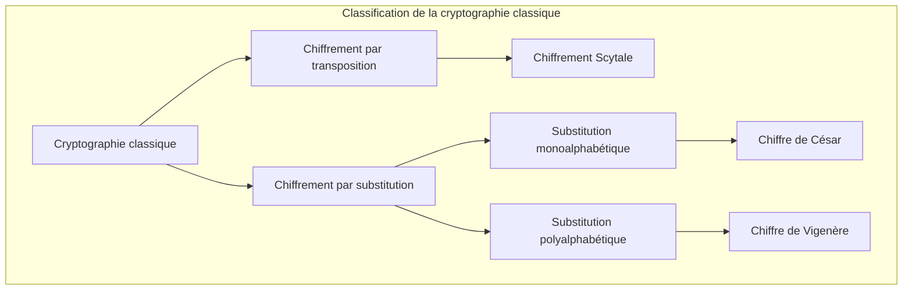
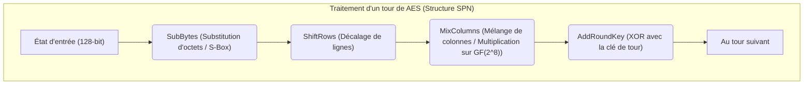
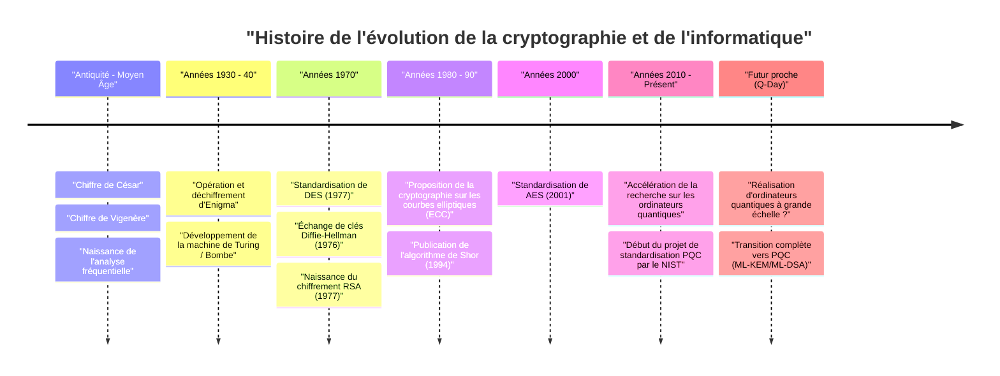

# 1. Introduction : Qu'est-ce que la cryptographie ?

La cryptographie (Cryptography) est la technologie permettant de préserver la confidentialité des informations, et a évolué avec l'histoire de l'humanité. De la transmission d'ordres secrets lors des guerres antiques à la protection des informations de cartes de crédit sur l'Internet moderne, le but de la cryptographie est resté le même. Il s'agit de « s'assurer que seul le destinataire prévu peut comprendre l'information, et qu'elle ne peut pas être déchiffrée par des tiers ».

Dans la sécurité de l'information moderne, la cryptographie ne se limite pas à la simple « dissimulation de l'information (Confidentialité) », mais joue également un rôle important dans l'« Intégrité (Integrity) » des données, l'« Authentification (Authentication) », et la « Non-répudiation (Non-repudiation) ».

Cet article retrace en détail l'histoire de l'évolution de la cryptographie d'un point de vue technologique et mathématique, en commençant par les simples chiffrements par substitution de l'Antiquité, en passant par les chiffrements mécaniques, la cryptographie moderne à clé symétrique et publique, jusqu'à l'ère de la « Cryptographie Post-Quantique (PQC) » provoquée par l'utilisation pratique des ordinateurs quantiques.

---

# 2. L'ère de la cryptographie classique : Substitution et transposition de caractères

Les origines de la cryptographie remontent avant notre ère. Les premiers chiffrements étaient principalement composés de deux approches : « transposition (réarrangement) » et « substitution (remplacement) ».

## Le chiffre de la scytale (Chiffrement par transposition)
Utilisée à Sparte, dans la Grèce antique, au Ve siècle av. J.-C., la « Scytale » est l'un des plus anciens dispositifs cryptographiques. Une longue et étroite bande de parchemin est enroulée autour d'un bâton de bois d'une épaisseur spécifique, et un message y est écrit horizontalement. Lorsque le parchemin est déroulé, les caractères apparaissent dans un ordre dénué de sens, mais un destinataire ayant un bâton de la même épaisseur peut enrouler le parchemin à nouveau pour lire le message original.

## Le chiffre de César (Chiffrement par substitution monoalphabétique)
Au 1er siècle av. J.-C., le héros de la Rome antique Jules César aurait utilisé le « chiffre de César ». Il s'agit d'un chiffrement par substitution monoalphabétique (Monoalphabetic substitution) qui décale l'alphabet d'un certain nombre (généralement 3 caractères).

Mathématiquement, en traitant les lettres comme des nombres de $0$ à $25$ et le nombre de décalages comme $K$, la conversion du texte clair $P$ en texte chiffré $C$ est exprimée par la congruence suivante :

$$C \equiv P + K \pmod{26}$$

Le déchiffrement effectue l'opération inverse :

$$P \equiv C - K \pmod{26}$$

```python
# Exemple simple d'implémentation du chiffre de César en Python
def caesar_cipher(text, shift, mode="encrypt"):
    result = ""
    if mode == "decrypt":
        shift = -shift
    
    for char in text:
        if char.isalpha():
            base = ord('A') if char.isupper() else ord('a')
            # Calcul du décalage
            result += chr((ord(char) - base + shift) % 26 + base)
        else:
            result += char
    return result

# Exemple d'exécution
plaintext = "HELLO WORLD"
ciphertext = caesar_cipher(plaintext, 3, "encrypt")
print(f"Texte chiffré : {ciphertext}") # KHOOR ZRUOG
```

## Analyse fréquentielle et le chiffre de Vigenère
Les chiffrements par substitution monoalphabétique ont été facilement déchiffrés grâce à l'« Analyse Fréquentielle (Frequency Analysis) » conçue par le savant arabe du 9ème siècle Al-Kindi. Elle utilise les propriétés statistiques de la langue, comme le fait que « E » et « T » apparaissent fréquemment en anglais.

Pour contrer cela, le « chiffre de Vigenère (Vigenère cipher) » a été inventé au 16ème siècle. Il s'agit d'un chiffrement par substitution polyalphabétique (Polyalphabetic substitution) qui utilise plusieurs décalages (clés) de manière périodique, et a été appelé « Le Chiffre Indéchiffrable » pendant environ 300 ans.

Mathématiquement, le $i$-ème caractère $P_i$ du texte clair et le $i$-ème caractère $K_i$ de la clé répétée sont utilisés pour chiffrer comme suit :

$$C_i \equiv P_i + K_i \pmod{26}$$

Ce chiffrement a également été déchiffré au 19ème siècle par Charles Babbage et Friedrich Kasiski, qui ont découvert la « méthode de Kasiski (Kasiski examination) », permettant de déduire la longueur de la clé à partir de motifs répétitifs dans le texte chiffré.



---

# 3. Cryptographie mécanique et guerres mondiales : Enigma et son déchiffrement

Au 20ème siècle, alors que les moyens de communication passaient des lettres au télégraphe et à la radio, la vitesse et la complexité du chiffrement sont devenues nécessaires. C'est là que la « cryptographie mécanique », combinant des rotors (disques rotatifs), est apparue.

## La menace d'Enigma
Pendant la Seconde Guerre mondiale, l'« Enigma », utilisée par l'Allemagne nazie, est la machine de chiffrement la plus célèbre de l'histoire de la cryptographie. Enigma était composée de plusieurs rotors (généralement 3 à 4), d'un tableau de connexions (Steckerbrett) qui échangeait le câblage des lettres, et d'un réflecteur (rotor d'inversion).

Le rotor tournant chaque fois qu'une lettre était tapée sur le clavier, taper la même lettre de suite produirait des caractères chiffrés différents (le summum du chiffrement polyalphabétique). Son espace de clés (combinaisons de paramètres) atteignait environ $1.58 \times 10^{19}$ (environ 15,8 quintillions), ce qui rendait le déchiffrement par force brute impossible avec la technologie de l'époque.

## Alan Turing et la « Bombe »
L'équipe de cryptanalyse de Bletchley Park en Grande-Bretagne a relevé le défi de cette imprenable Enigma, en s'appuyant sur les travaux initiaux de mathématiciens polonais comme Marian Rejewski.

En particulier, Alan Turing a développé la « Bombe », une machine de déchiffrement électromécanique, en utilisant des suppositions de texte clair (Cribs) correspondant à des parties du texte chiffré. La Bombe détectait rapidement les contradictions logiques et éliminait un par un les paramètres de rotor impossibles, réussissant ainsi à déchiffrer Enigma. On dit que cet exploit a avancé la victoire des Alliés de plusieurs années.

---

# 4. L'aube de la cryptographie moderne : Cryptographie à clé symétrique (DES et AES)

Après la guerre, avec l'avènement des ordinateurs, la cryptographie a subi un changement de paradigme radical, passant de la manipulation de « caractères » à la manipulation de « bits (0 et 1) ».

## Claude Shannon et la théorie de l'information
En 1949, Claude Shannon a publié l'article « Communication Theory of Secrecy Systems », jetant les bases mathématiques de la cryptographie moderne. Il a proposé la « Confusion (Confusion) » et la « Diffusion (Diffusion) » comme principes pour la conception de chiffrements sécurisés.
- **Confusion** : Rendre la relation entre la clé et le texte chiffré aussi complexe que possible. (Réalisé par substitution / boîtes S)
- **Diffusion** : S'assurer que la modification d'un seul bit du texte clair affecte de nombreux bits du texte chiffré. (Réalisé par transposition / permutation)

## DES (Data Encryption Standard)
En 1977, le National Institute of Standards and Technology américain (NIST, alors NBS) a établi « DES », basé sur un design d'IBM, comme chiffrement standard.
DES utilise une architecture appelée « Réseau de Feistel (Feistel Network) » et a une taille de bloc de 64 bits et une longueur de clé de 56 bits. Il avait l'avantage d'implémentation que les algorithmes de chiffrement et de déchiffrement avaient presque la même structure.

Cependant, à mesure que la puissance de calcul des ordinateurs augmentait, il est devenu évident qu'une longueur de clé de 56 bits (environ $7.2 \times 10^{16}$ combinaisons) était insuffisante. En 1998, l'Electronic Frontier Foundation (EFF) a développé une machine dédiée « Deep Crack » et a déchiffré DES en quelques jours.

## AES (Advanced Encryption Standard)
Comme nouveau standard pour remplacer DES, « AES » a été établi en 2001. L'algorithme « Rijndael », conçu par des cryptographes belges et sélectionné par appel d'offres public, a été adopté.

AES adopte une « structure SPN (Substitution-Permutation Network) » au lieu d'une structure de Feistel, et utilise des opérations mathématiques sur le corps de Galois (corps fini) $GF(2^8)$. La longueur de la clé peut être choisie parmi 128, 192 ou 256 bits, et il est encore largement utilisé dans le monde aujourd'hui comme cryptographie à clé symétrique standard.



---

# 5. La révolution de la cryptographie à clé publique : de Diffie-Hellman à RSA

La cryptographie à clé symétrique avait une faiblesse fatale. C'était le « Problème de distribution de clés (Key Distribution Problem) ». C'est la question de savoir comment partager en toute sécurité une « clé commune » avec une partie distante avant de commencer la communication chiffrée. Ce problème a été résolu par la « cryptographie à clé publique », née dans les années 1970.

## L'échange de clés Diffie-Hellman
En 1976, Whitfield Diffie et Martin Hellman ont publié l'article révolutionnaire « New Directions in Cryptography ». Ils ont proposé une méthode permettant de partager des clés en toute sécurité, même sur un canal de communication écouté, en utilisant la difficulté mathématique du « Problème du logarithme discret (Discrete Logarithm Problem) ».

1. Un grand nombre premier $p$ et un générateur $g$ sont rendus publics.
2. Alice choisit une valeur secrète $a$ et envoie $A = g^a \pmod{p}$ à Bob.
3. Bob choisit une valeur secrète $b$ et envoie $B = g^b \pmod{p}$ à Alice.
4. Alice calcule $K = B^a \pmod{p}$, et Bob calcule $K = A^b \pmod{p}$.
5. Par les lois des exposants, $K = (g^b)^a = (g^a)^b = g^{ab} \pmod{p}$, réussissant ainsi à partager la même clé $K$.

## Le chiffrement RSA
L'année suivante, en 1977, le « chiffrement RSA » a été conçu par Ron Rivest, Adi Shamir et Leonard Adleman. Il est basé sur la propriété qu'« il est difficile de factoriser en nombres premiers d'énormes nombres composés ».

**Mécanisme mathématique de RSA :**
1. Choisissez deux énormes nombres premiers $p$ et $q$, et calculez $n = p \times q$.
2. Calculez l'indicatrice d'Euler $\phi(n) = (p-1)(q-1)$.
3. Choisissez un entier $e$ (clé publique) premier avec $\phi(n)$.
4. Calculez un entier $d$ (clé privée) tel que $e \times d \equiv 1 \pmod{\phi(n)}$.

Chiffrement : Pour le texte clair $M$, $C \equiv M^e \pmod{n}$
Déchiffrement : Pour le texte chiffré $C$, $M \equiv C^d \pmod{n}$

```python
# Code Python illustrant le concept du chiffrement RSA (pas pour une utilisation pratique)
def ext_euclid(a, b):
    # Calcul de l'inverse modulaire par l'algorithme d'Euclide étendu
    if b == 0: return 1, 0, a
    x, y, g = ext_euclid(b, a % b)
    return y, x - (a // b) * y, g

def rsa_example():
    # Exemple utilisant de petits nombres premiers
    p, q = 61, 53
    n = p * q
    phi = (p - 1) * (q - 1)
    
    e = 17 # Valeur première avec phi
    d, _, _ = ext_euclid(e, phi)
    if d < 0: d += phi
        
    print(f"Clé publique : (e={e}, n={n})")
    print(f"Clé privée : (d={d}, n={n})")
    
    # Chiffrement et déchiffrement d'un message
    message = 65
    ciphertext = pow(message, e, n)
    decrypted = pow(ciphertext, d, n)
    
    print(f"Texte clair : {message} -> Texte chiffré : {ciphertext} -> Après déchiffrement : {decrypted}")

rsa_example()
```

---

# 6. L'essor de la cryptographie sur les courbes elliptiques (ECC)

Le chiffrement RSA est puissant, mais à mesure que les performances des ordinateurs s'améliorent, il est devenu nécessaire d'augmenter la longueur de la clé (actuellement 2048 bits ou 3072 bits) pour maintenir la sécurité, ce qui a entraîné le problème de l'augmentation des coûts de calcul.

Ainsi, la « Cryptographie sur les courbes elliptiques (Elliptic Curve Cryptography : ECC) » a été proposée en 1985. Elle utilise l'addition de points sur une courbe elliptique (généralement de la forme $y^2 = x^3 + ax + b$) sur un corps fini.

Le problème du logarithme discret sur courbe elliptique (ECDLP) est connu pour être encore plus difficile à résoudre que le problème de factorisation en nombres premiers, et **la sécurité équivalente à 3072 bits pour RSA peut être atteinte avec une longueur de clé de seulement 256 bits pour ECC**. Cela a rendu possible une communication chiffrée rapide et sécurisée (comme ECDSA et ECDH) même dans des environnements avec des ressources de calcul limitées, comme les smartphones et les appareils IoT.

---

# 7. La menace des ordinateurs quantiques et la cryptographie post-quantique (PQC)

La technologie cryptographique semblait solide comme un roc, mais l'algorithme de Shor (« Shor's algorithm ») publié par Peter Shor en 1994 a provoqué une onde de choc.

Les ordinateurs quantiques effectuent des calculs en utilisant les propriétés de la mécanique quantique que sont la « superposition » et l'« intrication quantique ». Il a été mathématiquement prouvé que l'exécution de l'algorithme de Shor sur un ordinateur quantique suffisamment performant pourrait résoudre le problème de factorisation en nombres premiers et le problème du logarithme discret en « temps polynomial ». En d'autres termes, le jour où un ordinateur quantique pratique sera achevé (Q-Day), toute la cryptographie à clé publique actuellement utilisée, comme RSA et ECC, s'effondrera instantanément.

## L'émergence de la PQC (Post-Quantum Cryptography)
Pour se préparer à cette menace sans précédent, la recherche sur la « Cryptographie Post-Quantique (PQC) », basée sur de nouveaux problèmes mathématiques difficiles à déchiffrer même pour les ordinateurs quantiques, progresse rapidement. Le NIST (National Institute of Standards and Technology des États-Unis) mène un processus de normalisation de la PQC depuis de nombreuses années, et les approches mathématiques suivantes sont considérées comme les plus prometteuses :

### 1. Cryptographie basée sur les réseaux euclidiens (Lattice-based Cryptography)
C'est actuellement l'approche la plus prometteuse et elle a été adoptée pour les algorithmes de normalisation du NIST (ML-KEM / Kyber, ML-DSA / Dilithium). Elle est basée sur la difficulté de trouver un point spécifique sur un « réseau (Lattice) » dans un espace multidimensionnel (comme le problème du plus court vecteur : SVP) et sur le problème LWE (Learning With Errors).

Le concept du problème LWE utilise la propriété que si un « petit bruit (erreur) » est intentionnellement ajouté à un système d'équations linéaires, il devient soudainement très difficile de trouver la solution.
Système d'équations : $\mathbf{A}\mathbf{s} + \mathbf{e} \equiv \mathbf{b} \pmod{q}$
($\mathbf{A}$ et $\mathbf{b}$ sont publics, $\mathbf{s}$ est la clé privée, $\mathbf{e}$ est le petit bruit)

```python
# Pseudo-code conceptuel du problème LWE (à des fins d'apprentissage)
import numpy as np

n = 256  # Dimension
q = 3329 # Modulo
m = 512  # Nombre d'équations

# Clé secrète s et petite erreur e
s = np.random.randint(0, 5, size=n)
e = np.random.randint(-1, 2, size=m)

# Matrice publique A et vecteur public b
A = np.random.randint(0, q, size=(m, n))
b = (np.dot(A, s) + e) % q

# Même en utilisant un ordinateur quantique, il est considéré comme très difficile de récupérer s à partir de A et b
```

### 2. Cryptographie basée sur le hachage (Hash-based Cryptography)
Il s'agit d'un système de signature numérique qui fonde sa sécurité uniquement sur la résistance aux collisions des fonctions de hachage. Comme il n'a pas de structure mathématique, il résiste aux attaques quantiques, mais la taille de la signature a tendance à être importante (comme SPHINCS+).

### 3. Cryptographie basée sur les codes (Code-based Cryptography)
Il s'agit d'un système de chiffrement basé sur la théorie des codes correcteurs d'erreurs. Le chiffrement de McEliece, proposé en 1978, est célèbre, a une longue histoire et une réputation de sécurité établie, mais son défi est que la taille de la clé publique est extrêmement grande (parfois de plusieurs mégaoctets).



---

# 8. Conclusion : Une bataille sans fin entre le bouclier et la lance

L'histoire de la technologie cryptographique est l'histoire d'une bataille sans fin entre l'invention de nouvelles méthodes de chiffrement (le bouclier) et de nouvelles méthodes de déchiffrement (la lance) pour les percer.

Le chiffre de César a été vaincu par l'analyse fréquentielle, et l'Enigma prétendument invincible a été vaincue par le génie de Turing et la puissance de la machine. Et aujourd'hui, les chiffrements puissants comme RSA et ECC qui soutiennent les fondements de la société Internet moderne sont menacés par une nouvelle « lance », l'ordinateur quantique.

Cependant, l'humanité regarde déjà vers l'avenir, et se prépare à un nouveau « bouclier » appelé cryptographie post-quantique (PQC). Actuellement, dans les infrastructures informatiques du monde entier, la préparation à la transition de la cryptographie à clé publique existante vers la PQC (garantir la crypto-agilité) est une question urgente.

La cryptographie n'est pas seulement un puzzle mathématique difficile, mais la barrière la plus solide pour protéger notre vie privée, nos biens, et l'infrastructure sociale elle-même.
