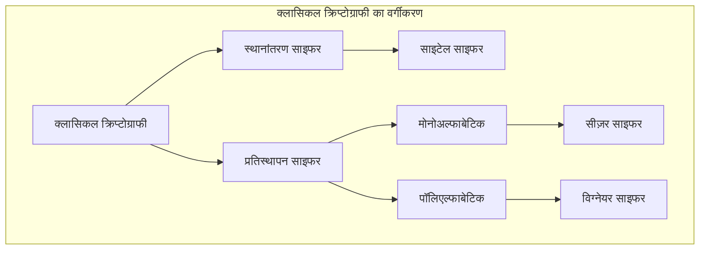
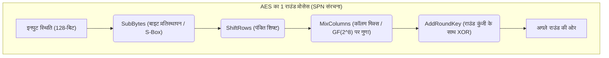
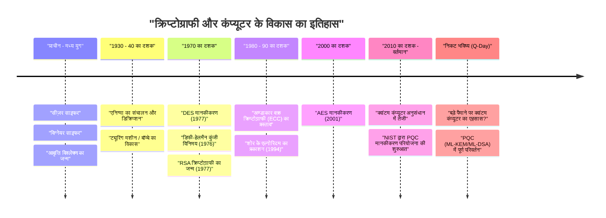

# 1. परिचय: क्रिप्टोग्राफी (Cryptography) क्या है?

क्रिप्टोग्राफी (Cryptography) जानकारी को गोपनीय रखने की एक तकनीक है, जिसका विकास मानव इतिहास के साथ हुआ है। प्राचीन युद्धों में गुप्त आदेशों के प्रसारण से लेकर आधुनिक इंटरनेट पर क्रेडिट कार्ड की जानकारी की सुरक्षा तक, क्रिप्टोग्राफी का उद्देश्य एक समान रहा है। वह है: "यह सुनिश्चित करना कि केवल इच्छित प्राप्तकर्ता ही जानकारी को समझ सके और कोई तीसरा व्यक्ति इसे डिक्रिप्ट (decrypt) न कर सके।"

आधुनिक सूचना सुरक्षा (information security) में, क्रिप्टोग्राफी केवल "सूचना की गोपनीयता (Confidentiality)" तक सीमित नहीं है, बल्कि यह डेटा की "अखंडता (Integrity)", "प्रमाणीकरण (Authentication)", और "गैर-अस्वीकरण (Non-repudiation)" जैसी महत्वपूर्ण भूमिकाएँ भी निभाती है।

इस लेख में, हम प्राचीन सरल प्रतिस्थापन साइफर (substitution cipher) से शुरू करके, मैकेनिकल साइफर, आधुनिक सिमेट्रिक (symmetric) और पब्लिक-की (public-key) क्रिप्टोग्राफी, और अंततः क्वांटम कंप्यूटर के व्यावहारिक उपयोग के साथ आने वाले "पोस्ट-क्वांटम क्रिप्टोग्राफी (PQC)" युग तक, तकनीकी और गणितीय दृष्टिकोण से क्रिप्टोग्राफी के विकास के इतिहास की विस्तार से पड़ताल करेंगे।

---

# 2. क्लासिकल क्रिप्टोग्राफी का युग: अक्षरों का प्रतिस्थापन और पुनर्व्यवस्था

क्रिप्टोग्राफी की उत्पत्ति ईसा पूर्व युग की है। प्रारंभिक साइफर मुख्य रूप से दो दृष्टिकोणों से बने थे: "स्थानांतरण (Transposition - पुनर्व्यवस्था)" और "प्रतिस्थापन (Substitution - बदलना)"।

## साइटेल (Scytale) साइफर (स्थानांतरण साइफर)
5वीं शताब्दी ईसा पूर्व में प्राचीन ग्रीस के स्पार्टा में इस्तेमाल किया गया "साइटेल (Scytale)" सबसे पुराने क्रिप्टोग्राफिक उपकरणों में से एक है। इसमें एक विशिष्ट मोटाई की लकड़ी की छड़ी के चारों ओर चर्मपत्र (parchment) की एक लंबी पट्टी लपेटी जाती थी, और उस पर क्षैतिज रूप से संदेश लिखा जाता था। जब कागज को खोला जाता था, तो अक्षर एक निरर्थक क्रम में व्यवस्थित हो जाते थे, लेकिन जब समान मोटाई की छड़ी वाला प्राप्तकर्ता कागज को फिर से लपेटता था, तो मूल संदेश पढ़ा जा सकता था।

## सीज़र साइफर (मोनोअल्फाबेटिक प्रतिस्थापन साइफर)
प्रथम शताब्दी ईसा पूर्व में, प्राचीन रोमन नायक जूलियस सीज़र द्वारा "सीज़र साइफर" का उपयोग किया गया था। यह एक मोनोअल्फाबेटिक प्रतिस्थापन (Monoalphabetic substitution) साइफर है जो वर्णमाला के अक्षरों को एक निश्चित संख्या (आमतौर पर 3 अक्षर) से स्थानांतरित (shift) करता है।

गणितीय रूप से, यदि अक्षरों को $0$ से $25$ तक की संख्याओं के रूप में माना जाता है और शिफ्ट की संख्या $K$ है, तो प्लेनटेक्स्ट $P$ से सिफरटेक्स्ट $C$ में रूपांतरण को निम्नलिखित सर्वांगसमता (congruence) समीकरण द्वारा व्यक्त किया जाता है:

$$C \equiv P + K \pmod{26}$$

डिक्रिप्शन में इसके विपरीत प्रक्रिया की जाती है:

$$P \equiv C - K \pmod{26}$$

```python
# सीज़र साइफर का एक सरल Python कार्यान्वयन (Implementation)
def caesar_cipher(text, shift, mode="encrypt"):
    result = ""
    if mode == "decrypt":
        shift = -shift
    
    for char in text:
        if char.isalpha():
            base = ord('A') if char.isupper() else ord('a')
            # शिफ्ट गणना
            result += chr((ord(char) - base + shift) % 26 + base)
        else:
            result += char
    return result

# निष्पादन उदाहरण (Execution Example)
plaintext = "HELLO WORLD"
ciphertext = caesar_cipher(plaintext, 3, "encrypt")
print(f"सिफरटेक्स्ट: {ciphertext}") # KHOOR ZRUOG
```

## फ्रीक्वेंसी एनालिसिस (आवृत्ति विश्लेषण) और विग्नेयर (Vigenère) साइफर
मोनोअल्फाबेटिक प्रतिस्थापन साइफर को 9वीं शताब्दी के अरब विद्वान अल-किंडी द्वारा आविष्कार किए गए "आवृत्ति विश्लेषण (Frequency Analysis)" द्वारा आसानी से डिक्रिप्ट किया जाने लगा। यह भाषा की सांख्यिकीय विशेषताओं का उपयोग करता है, जैसे कि अंग्रेजी में "E" और "T" का बार-बार आना।

इसका मुकाबला करने के लिए, 16वीं शताब्दी में "विग्नेयर साइफर (Vigenère cipher)" का आविष्कार किया गया था। यह एक पॉलिएल्फाबेटिक प्रतिस्थापन (Polyalphabetic substitution) साइफर है जो समय-समय पर कई शिफ्ट्स (कुंजियों) का उपयोग करता है, और इसे लगभग 300 वर्षों तक "अभेद्य साइफर (Le Chiffre Indéchiffrable)" कहा जाता था।

गणितीय रूप से, इसे प्लेनटेक्स्ट के $i$-वें अक्षर $P_i$ और दोहराई जाने वाली कुंजी के $i$-वें अक्षर $K_i$ का उपयोग करके इस प्रकार एन्क्रिप्ट किया जाता है:

$$C_i \equiv P_i + K_i \pmod{26}$$

19वीं शताब्दी में, इस साइफर को चार्ल्स बैबेज और फ्रेडरिक कासिस्की द्वारा भी तोड़ दिया गया था, जिन्होंने "कासिस्की परीक्षण (Kasiski examination)" की खोज की थी, जो सिफरटेक्स्ट में दोहराए जाने वाले पैटर्न से कुंजी की लंबाई निर्धारित करता है।



---

# 3. मैकेनिकल क्रिप्टोग्राफी और विश्व युद्ध: एनिग्मा (Enigma) और इसका डिक्रिप्शन

20वीं सदी की शुरुआत में, संचार के साधन पत्रों से टेलीग्राफ और रेडियो में बदल गए, जिससे एन्क्रिप्शन की गति और जटिलता की मांग बढ़ गई। यहीं पर रोटर्स (घुमावदार डिस्क) को जोड़ने वाली "मैकेनिकल क्रिप्टोग्राफी" सामने आई।

## एनिग्मा (Enigma) का खतरा
द्वितीय विश्व युद्ध के दौरान नाजी जर्मनी द्वारा इस्तेमाल की जाने वाली "एनिग्मा" क्रिप्टोग्राफी के इतिहास की सबसे प्रसिद्ध सिफर मशीन है। एनिग्मा में कई रोटर (आमतौर पर 3 से 4), अक्षरों की वायरिंग को बदलने के लिए एक प्लगबोर्ड (Steckerbrett), और एक रिफ्लेक्टर (रिवर्सिंग रोटर) शामिल थे।

हर बार जब कीबोर्ड पर कोई अक्षर टाइप किया जाता था, तो रोटर घूम जाता था, इसलिए एक ही अक्षर को लगातार टाइप करने पर भी अलग-अलग सिफर अक्षर आउटपुट होते थे (पॉलिएल्फाबेटिक साइफर का चरम रूप)। इसका कुंजी स्थान (सेटिंग्स के संयोजन) लगभग $1.58 \times 10^{19}$ था, जिसे उस समय की तकनीक के साथ ब्रूट-फोर्स (brute-force) हमले से क्रैक करना असंभव माना जाता था।

## एलन ट्यूरिंग (Alan Turing) और "बॉम्बे (Bombe)"
पोलिश गणितज्ञ मैरियन रेजेव्स्की और अन्य लोगों की शुरुआती उपलब्धियों को आगे बढ़ाते हुए, ब्रिटेन के बैलेचली पार्क (Bletchley Park) की कोडब्रेकिंग टीम ने इस अभेद्य एनिग्मा को चुनौती दी।

विशेष रूप से एलन ट्यूरिंग (Alan Turing) ने सिफरटेक्स्ट के एक हिस्से (जिसे क्रिब या Crib कहा जाता है) के अनुरूप प्लेनटेक्स्ट के अनुमान का उपयोग करते हुए, "बॉम्बे (Bombe)" नामक एक इलेक्ट्रोमैकेनिकल डिकोडिंग मशीन विकसित की। बॉम्बे ने उच्च गति पर तार्किक विरोधाभासों का पता लगाया, और एक के बाद एक असंभव रोटर सेटिंग्स को समाप्त करके, सफलतापूर्वक एनिग्मा को डिक्रिप्ट किया। कहा जाता है कि इस उपलब्धि ने मित्र राष्ट्रों (Allies) की जीत को कई साल पहले ला दिया था।

---

# 4. आधुनिक क्रिप्टोग्राफी की शुरुआत: सिमेट्रिक-की क्रिप्टोग्राफी (DES और AES)

युद्ध के बाद, कंप्यूटर के आगमन के साथ, क्रिप्टोग्राफी ने "अक्षरों" के हेरफेर से "बिट्स (0 और 1)" के हेरफेर में एक नाटकीय बदलाव (paradigm shift) का अनुभव किया।

## क्लाउड शैनन (Claude Shannon) और सूचना सिद्धांत (Information Theory)
1949 में, क्लाउड शैनन ने "गोपनीय प्रणालियों का संचार सिद्धांत (Communication Theory of Secrecy Systems)" नामक एक पेपर प्रकाशित किया, जिसने आधुनिक क्रिप्टोग्राफी की गणितीय नींव रखी। उन्होंने सुरक्षित साइफर डिजाइन के सिद्धांतों के रूप में "भ्रम (Confusion)" और "प्रसार (Diffusion)" का प्रस्ताव रखा।
- **भ्रम (Confusion)**: कुंजी और सिफरटेक्स्ट के बीच के संबंध को यथासंभव जटिल बनाना। (प्रतिस्थापन / S-box के माध्यम से महसूस किया गया)
- **प्रसार (Diffusion)**: यह सुनिश्चित करना कि प्लेनटेक्स्ट के 1 बिट में परिवर्तन सिफरटेक्स्ट के कई बिट्स को प्रभावित करता है। (स्थानांतरण / पुनर्व्यवस्था के माध्यम से महसूस किया गया)

## DES (डेटा एन्क्रिप्शन स्टैंडर्ड / Data Encryption Standard)
1977 में, अमेरिकी राष्ट्रीय मानक और प्रौद्योगिकी संस्थान (NIST, जिसे तब NBS कहा जाता था) ने IBM के डिज़ाइन पर आधारित "DES" को एक मानक साइफर के रूप में स्थापित किया।
DES एक वास्तुकला (architecture) का उपयोग करता है जिसे "फीस्टेल नेटवर्क (Feistel Network)" कहा जाता है, जिसमें 64-बिट ब्लॉक लंबाई और 56-बिट कुंजी लंबाई होती है। इसका एक कार्यान्वयन (implementation) लाभ यह था कि एन्क्रिप्शन और डिक्रिप्शन एल्गोरिदम की संरचना लगभग समान थी।

हालाँकि, जैसे-जैसे कंप्यूटर की कम्प्यूटेशनल शक्ति में सुधार हुआ, यह स्पष्ट हो गया कि 56-बिट कुंजी लंबाई (लगभग $7.2 \times 10^{16}$ संयोजन) अपर्याप्त थी। 1998 में, इलेक्ट्रॉनिक फ्रंटियर फाउंडेशन (EFF) ने "डीप क्रैक (Deep Crack)" नामक एक समर्पित मशीन विकसित की, जिसने कुछ ही दिनों में DES को क्रैक कर दिया।

## AES (एडवांस्ड एन्क्रिप्शन स्टैंडर्ड / Advanced Encryption Standard)
2001 में, DES को बदलने के लिए "AES" को एक नए मानक के रूप में स्थापित किया गया था। सार्वजनिक प्रतियोगिता के माध्यम से बेल्जियम के क्रिप्टोग्राफर्स द्वारा डिज़ाइन किए गए "रिजनडेल (Rijndael)" एल्गोरिदम को अपनाया गया था।

AES फीस्टेल नेटवर्क के बजाय "SPN संरचना (Substitution-Permutation Network)" का उपयोग करता है, और गैल्वा क्षेत्र (परिमित क्षेत्र / finite field) $GF(2^8)$ पर गणितीय संचालन (mathematical operations) का उपयोग करता है। कुंजी की लंबाई 128, 192 या 256 बिट्स के रूप में चुनी जा सकती है, और यह आज भी दुनिया भर में मानक सिमेट्रिक-की क्रिप्टोग्राफी (symmetric-key cryptography) के रूप में व्यापक रूप से उपयोग की जाती है।



---

# 5. पब्लिक-की (Public-Key) क्रिप्टोग्राफी की क्रांति: डिफी-हेलमैन (Diffie-Hellman) से RSA तक

सिमेट्रिक-की (Symmetric-key) क्रिप्टोग्राफी में एक महत्वपूर्ण कमजोरी थी: "कुंजी वितरण समस्या (Key Distribution Problem)"। समस्या यह है कि एन्क्रिप्टेड संचार शुरू करने से पहले आप दूर के पक्ष के साथ "साझा कुंजी" को सुरक्षित रूप से कैसे साझा करते हैं। इस समस्या को 1970 के दशक में "पब्लिक-की क्रिप्टोग्राफी (Public-Key Cryptography)" के जन्म के साथ हल किया गया था।

## डिफी-हेलमैन (Diffie-Hellman) कुंजी विनिमय (Key Exchange)
1976 में, व्हिटफील्ड डिफी (Whitfield Diffie) और मार्टिन हेलमैन (Martin Hellman) ने "क्रिप्टोग्राफी में नई दिशाएं (New Directions in Cryptography)" नामक एक अभूतपूर्व शोध पत्र प्रकाशित किया। उन्होंने एक ऐसी विधि का प्रस्ताव दिया जो "असतत लघुगणक समस्या (Discrete Logarithm Problem)" की गणितीय कठिनाई का उपयोग करके, वायरटैप (wiretapped) संचार पथ पर भी सुरक्षित रूप से कुंजी साझा कर सकती है।

1. एक बड़ी अभाज्य संख्या (prime number) $p$ और जनरेटर (generator) $g$ को सार्वजनिक करें।
2. एलिस (Alice) एक गुप्त मान $a$ चुनती है, और बॉब को $A = g^a \pmod{p}$ भेजती है।
3. बॉब (Bob) एक गुप्त मान $b$ चुनता है, और एलिस को $B = g^b \pmod{p}$ भेजता है।
4. एलिस $K = B^a \pmod{p}$ की गणना करती है, और बॉब $K = A^b \pmod{p}$ की गणना करता है।
5. घातांक के नियमों (laws of exponents) के अनुसार, $K = (g^b)^a = (g^a)^b = g^{ab} \pmod{p}$, जिससे वे दोनों सफलतापूर्वक एक ही कुंजी $K$ साझा कर लेते हैं।

## RSA क्रिप्टोग्राफी
अगले वर्ष, 1977 में, रॉन रिवेस्ट (Ron Rivest), आदि शमीर (Adi Shamir) और लियोनार्ड एडलमैन (Leonard Adleman) द्वारा "RSA क्रिप्टोग्राफी" का आविष्कार किया गया। यह इस गुण पर आधारित है कि "बहुत बड़ी भाज्य संख्याओं (composite numbers) का अभाज्य गुणनखंडन (prime factorization) करना बहुत कठिन है।"

**RSA का गणितीय तंत्र:**
1. दो विशाल अभाज्य संख्याएँ $p$ और $q$ चुनें, और $n = p \times q$ की गणना करें।
2. यूलर के टॉटिएंट फ़ंक्शन (Euler's totient function) $\phi(n) = (p-1)(q-1)$ की गणना करें।
3. एक ऐसा पूर्णांक $e$ (सार्वजनिक कुंजी / public key) चुनें जो $\phi(n)$ का सह-अभाज्य (coprime) हो।
4. एक ऐसा पूर्णांक $d$ (निजी कुंजी / private key) की गणना करें जिससे $e \times d \equiv 1 \pmod{\phi(n)}$ हो।

एन्क्रिप्शन: प्लेनटेक्स्ट $M$ के लिए, $C \equiv M^e \pmod{n}$
डिक्रिप्शन: सिफरटेक्स्ट $C$ के लिए, $M \equiv C^d \pmod{n}$

```python
# RSA क्रिप्टोग्राफी की अवधारणा को दर्शाने वाला Python कोड (व्यावहारिक उपयोग के लिए नहीं)
def ext_euclid(a, b):
    # विस्तारित यूक्लिडियन एल्गोरिदम का उपयोग करके मॉड्यूलर व्युत्क्रम (modular inverse) की गणना
    if b == 0: return 1, 0, a
    x, y, g = ext_euclid(b, a % b)
    return y, x - (a // b) * y, g

def rsa_example():
    # छोटी अभाज्य संख्याओं का उपयोग करते हुए उदाहरण
    p, q = 61, 53
    n = p * q
    phi = (p - 1) * (q - 1)
    
    e = 17 # phi का सह-अभाज्य (coprime) मान
    d, _, _ = ext_euclid(e, phi)
    if d < 0: d += phi
        
    print(f"सार्वजनिक कुंजी (Public Key): (e={e}, n={n})")
    print(f"निजी कुंजी (Private Key): (d={d}, n={n})")
    
    # संदेश का एन्क्रिप्शन और डिक्रिप्शन
    message = 65
    ciphertext = pow(message, e, n)
    decrypted = pow(ciphertext, d, n)
    
    print(f"प्लेनटेक्स्ट: {message} -> सिफरटेक्स्ट: {ciphertext} -> डिक्रिप्टेड: {decrypted}")

rsa_example()
```

---

# 6. अण्डाकार वक्र क्रिप्टोग्राफी (Elliptic Curve Cryptography: ECC) का उदय

हालांकि RSA क्रिप्टोग्राफी शक्तिशाली है, लेकिन जैसे-जैसे कंप्यूटर के प्रदर्शन में सुधार हुआ, सुरक्षा बनाए रखने के लिए कुंजी की लंबाई (वर्तमान में 2048 बिट या 3072 बिट) को बढ़ाना आवश्यक हो गया, जिससे कम्प्यूटेशनल लागत में वृद्धि की समस्या उत्पन्न हुई।

इसलिए 1985 में, "अण्डाकार वक्र क्रिप्टोग्राफी (Elliptic Curve Cryptography: ECC)" का प्रस्ताव रखा गया था। यह परिमित क्षेत्र (finite field) पर अण्डाकार वक्र (आमतौर पर $y^2 = x^3 + ax + b$ के रूप में) पर बिंदुओं के जोड़ (point addition) का उपयोग करता है।

अण्डाकार वक्र पर असतत लघुगणक समस्या (Elliptic Curve Discrete Logarithm Problem: ECDLP) को अभाज्य गुणनखंडन समस्या की तुलना में हल करना और भी कठिन माना जाता है, और **RSA के 3072 बिट्स के बराबर सुरक्षा ECC के साथ केवल 256 बिट्स की कुंजी लंबाई के साथ प्राप्त की जा सकती है**। इसने सीमित कम्प्यूटेशनल संसाधनों वाले वातावरण में भी उच्च गति और सुरक्षित एन्क्रिप्टेड संचार (जैसे ECDSA और ECDH) को संभव बना दिया है, जैसे कि स्मार्टफोन और IoT डिवाइस।

---

# 7. क्वांटम कंप्यूटर का खतरा और पोस्ट-क्वांटम क्रिप्टोग्राफी (PQC)

क्रिप्टोग्राफी अभेद्य (solid) प्रतीत होती थी, लेकिन 1994 में पीटर शोर (Peter Shor) द्वारा प्रकाशित "शोर का एल्गोरिदम (Shor's Algorithm)" से एक बड़ा झटका लगा।

क्वांटम कंप्यूटर गणना करने के लिए "सुपरपोजिशन (Superposition)" और "क्वांटम एंटैंगलमेंट (Quantum Entanglement)" जैसे क्वांटम यांत्रिकी (quantum mechanics) के गुणों का उपयोग करते हैं। गणितीय रूप से यह सिद्ध हो चुका है कि यदि शोर के एल्गोरिदम को पर्याप्त रूप से शक्तिशाली क्वांटम कंप्यूटर पर चलाया जाता है, तो अभाज्य गुणनखंडन (prime factorization) और असतत लघुगणक (discrete logarithm) समस्याओं को "बहुपद समय (polynomial time)" में हल किया जा सकता है। दूसरे शब्दों में, जिस दिन एक व्यावहारिक क्वांटम कंप्यूटर पूरा हो जाएगा (Q-Day), वर्तमान में उपयोग किए जाने वाले RSA और ECC जैसी सभी पब्लिक-की क्रिप्टोग्राफी तुरंत टूट जाएगी।

## PQC (पोस्ट-क्वांटम क्रिप्टोग्राफी) का आगमन
इस अभूतपूर्व खतरे की तैयारी में, नई गणितीय समस्याओं पर आधारित "पोस्ट-क्वांटम क्रिप्टोग्राफी (PQC)" पर शोध तेज गति से चल रहा है, जिसे क्वांटम कंप्यूटर के लिए भी डिक्रिप्ट करना मुश्किल है। NIST (यूएस नेशनल इंस्टीट्यूट ऑफ स्टैंडर्ड एंड टेक्नोलॉजी) कई वर्षों से PQC मानकीकरण प्रक्रिया को आगे बढ़ा रहा है, और मुख्य रूप से निम्नलिखित गणितीय दृष्टिकोणों को सबसे आशाजनक माना जाता है।

### 1. लैटीस-बेस्ड (Lattice-based) क्रिप्टोग्राफी
वर्तमान में यह सबसे आशाजनक दृष्टिकोण है, और इसे NIST के मानकीकरण एल्गोरिदम (ML-KEM / Kyber, ML-DSA / Dilithium) में भी अपनाया गया है। यह बहुआयामी अंतरिक्ष में "लैटीस (Lattice)" पर एक विशिष्ट बिंदु खोजने की समस्या (सबसे छोटा वेक्टर समस्या: SVP आदि) या LWE (लर्निंग विद एरर्स: Learning With Errors) समस्या की कठिनाई पर आधारित है।

LWE समस्या की अवधारणा इस विशेषता का उपयोग करती है कि यदि आप जानबूझकर एक साथ रैखिक समीकरणों की प्रणाली (system of linear equations) में "छोटा शोर (त्रुटि)" जोड़ते हैं, तो इसके लिए समाधान खोजना बहुत कठिन हो जाता है।
समीकरण प्रणाली: $\mathbf{A}\mathbf{s} + \mathbf{e} \equiv \mathbf{b} \pmod{q}$
($\mathbf{A}$ और $\mathbf{b}$ सार्वजनिक हैं, $\mathbf{s}$ निजी कुंजी है, $\mathbf{e}$ एक छोटा शोर है)

```python
# LWE समस्या का वैचारिक छद्म-कोड (Pseudocode) (सीखने के उद्देश्य से)
import numpy as np

n = 256  # आयाम (Dimension)
q = 3329 # मोडुलो (Modulo)
m = 512  # समीकरणों की संख्या

# निजी कुंजी s और छोटी त्रुटि e
s = np.random.randint(0, 5, size=n)
e = np.random.randint(-1, 2, size=m)

# सार्वजनिक मैट्रिक्स A और सार्वजनिक वेक्टर b
A = np.random.randint(0, q, size=(m, n))
b = (np.dot(A, s) + e) % q

# यहां तक कि क्वांटम कंप्यूटर का उपयोग करके भी, A और b से s को पुनर्प्राप्त करना अत्यंत कठिन माना जाता है
```

### 2. हैश-बेस्ड (Hash-based) क्रिप्टोग्राफी
यह एक डिजिटल हस्ताक्षर योजना है जो अपनी सुरक्षा को केवल हैश फ़ंक्शन के टकराव प्रतिरोध (collision resistance) पर आधारित करती है। चूँकि इसमें कोई गणितीय संरचना नहीं होती है, इसलिए यह क्वांटम हमलों के प्रति प्रतिरोधी है, लेकिन इसके हस्ताक्षर का आकार (signature size) बड़ा होता है (जैसे SPHINCS+)।

### 3. कोड-बेस्ड (Code-based) क्रिप्टोग्राफी
यह त्रुटि-सुधार कोड (error-correcting codes) के सिद्धांत पर आधारित एन्क्रिप्शन योजना है। 1978 में प्रस्तावित McEliece क्रिप्टोग्राफी प्रसिद्ध है, और इसका लंबा इतिहास और एक स्थापित सुरक्षा प्रतिष्ठा है, लेकिन इसमें एक समस्या यह है कि सार्वजनिक कुंजी का आकार बहुत बड़ा (कभी-कभी कई मेगाबाइट तक) होता है।



---

# 8. निष्कर्ष: ढाल और भाले की कभी न खत्म होने वाली लड़ाई

क्रिप्टोग्राफी का इतिहास नई एन्क्रिप्शन विधियों (ढाल) के आविष्कार और उन्हें तोड़ने के लिए नई डिक्रिप्शन तकनीकों (भाले) के बीच एक कभी न खत्म होने वाली लड़ाई का इतिहास है।

सीज़र साइफर आवृत्ति विश्लेषण से हार गया, और अजेय मानी जाने वाली एनिग्मा ट्यूरिंग की प्रतिभाशाली बुद्धि और मशीनों की शक्ति से हार गई। और अब, आधुनिक इंटरनेट समाज की नींव रखने वाली RSA और ECC जैसी शक्तिशाली क्रिप्टोग्राफी को भी क्वांटम कंप्यूटर नामक नए "भाले" के खतरे का सामना करना पड़ रहा है।

हालाँकि, मानवता पहले ही भविष्य की ओर देख रही है और "पोस्ट-क्वांटम क्रिप्टोग्राफी (PQC)" के रूप में एक नई "ढाल" तैयार कर रही है। वर्तमान में, दुनिया भर के आईटी बुनियादी ढांचे में, मौजूदा पब्लिक-की क्रिप्टोग्राफी से PQC में संक्रमण (Crypto Agility सुरक्षित करना) की तैयारी एक तत्काल आवश्यकता बन गई है।

क्रिप्टोग्राफी केवल एक गूढ़ गणितीय पहेली नहीं है, बल्कि हमारी निजता, संपत्ति और स्वयं सामाजिक बुनियादी ढांचे की रक्षा के लिए सबसे मजबूत बाधा है।
