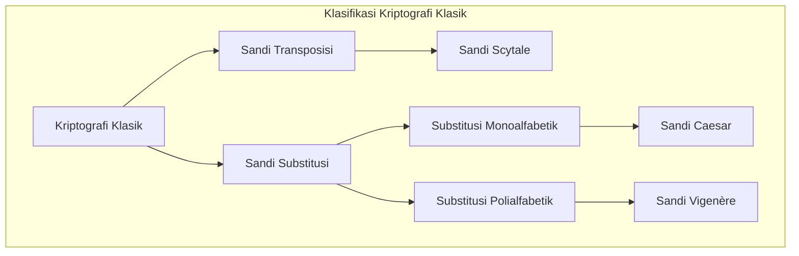
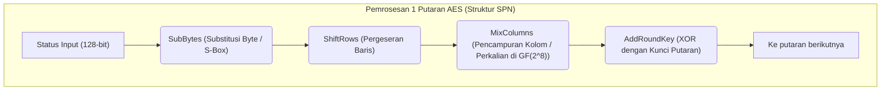
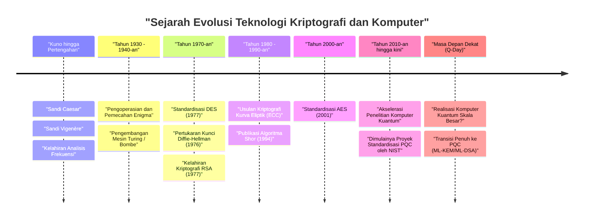

# 1. Pendahuluan: Apa itu Kriptografi?

Kriptografi (Cryptography) adalah teknologi untuk menjaga kerahasiaan informasi, dan telah berevolusi bersamaan dengan sejarah umat manusia. Dari transmisi perintah rahasia dalam perang kuno hingga perlindungan informasi kartu kredit di internet modern, tujuan kriptografi tetap konsisten. Tujuannya adalah "memastikan bahwa hanya penerima yang dituju yang dapat memahami informasi tersebut, dan tidak dapat diuraikan oleh pihak ketiga".

Dalam keamanan informasi modern, kriptografi tidak hanya terbatas pada "kerahasiaan informasi (Kerahasiaan: Confidentiality)", tetapi juga memainkan peran penting dalam "Integritas (Integrity)", "Otentikasi (Authentication)", dan "Nirsangkal (Non-repudiation)" dari data.

Dalam artikel ini, kita akan mengungkap sejarah evolusi kriptografi dari perspektif teknis dan matematis, dimulai dari sandi substitusi sederhana kuno, mesin sandi mekanis, kriptografi kunci simetris dan kunci publik modern, hingga era "Kriptografi Pasca-Kuantum (PQC)" yang tiba dengan komersialisasi komputer kuantum.

---

# 2. Era Kriptografi Klasik: Substitusi dan Transposisi Karakter

Asal-usul kriptografi berawal sejak sebelum masehi. Kriptografi awal terutama terdiri dari dua pendekatan: "Transposisi (penyusunan ulang)" dan "Substitusi (penggantian)".

## Sandi Scytale (Sandi Transposisi)
"Scytale", yang digunakan di Sparta, Yunani Kuno pada abad ke-5 SM, adalah salah satu perangkat kriptografi tertua. Sepotong perkamen tipis dililitkan pada tongkat kayu dengan ketebalan tertentu, dan pesan ditulis secara horizontal di atasnya. Ketika perkamen dibuka, huruf-huruf tersusun dalam urutan yang tidak dapat dipahami, tetapi penerima yang memiliki tongkat dengan ketebalan yang sama dapat membaca pesan asli dengan melilitkan kembali perkamen tersebut.

## Sandi Caesar (Sandi Substitusi Monoalfabetik)
"Sandi Caesar", yang konon digunakan oleh pahlawan Romawi Kuno Julius Caesar pada abad ke-1 SM, adalah sandi substitusi monoalfabetik (Monoalphabetic substitution) yang menggeser alfabet sejumlah tertentu (biasanya 3 huruf).

Secara matematis, dengan menganggap huruf sebagai angka dari $0$ hingga $25$, dan jumlah pergeseran adalah $K$, transformasi dari plainteks $P$ menjadi cipherteks $C$ direpresentasikan oleh kongruensi berikut:

$$C \equiv P + K \pmod{26}$$

Dekripsi dilakukan dengan operasi kebalikannya:

$$P \equiv C - K \pmod{26}$$

```python
# Contoh implementasi sederhana Sandi Caesar dengan Python
def caesar_cipher(text, shift, mode="encrypt"):
    result = ""
    if mode == "decrypt":
        shift = -shift
    
    for char in text:
        if char.isalpha():
            base = ord('A') if char.isupper() else ord('a')
            # Perhitungan pergeseran
            result += chr((ord(char) - base + shift) % 26 + base)
        else:
            result += char
    return result

# Contoh eksekusi
plaintext = "HELLO WORLD"
ciphertext = caesar_cipher(plaintext, 3, "encrypt")
print(f"Cipherteks: {ciphertext}") # KHOOR ZRUOG
```

## Analisis Frekuensi dan Sandi Vigenère
Sandi substitusi monoalfabetik dengan mudah dipecahkan oleh "Analisis Frekuensi (Frequency Analysis)" yang diciptakan oleh cendekiawan Arab abad ke-9, Al-Kindi. Ini memanfaatkan karakteristik statistik bahasa, seperti fakta bahwa "E" dan "T" sering muncul dalam bahasa Inggris.

Untuk melawan hal ini, "Sandi Vigenère (Vigenère cipher)" diciptakan pada abad ke-16. Ini adalah sandi substitusi polialfabetik (Polyalphabetic substitution) yang secara periodik mengganti beberapa pergeseran (kunci), dan selama sekitar 300 tahun disebut "Sandi yang tidak dapat dipecahkan (Le Chiffre Indéchiffrable)".

Secara matematis, huruf ke-$i$ dari plainteks $P_i$ dan huruf ke-$i$ dari kunci yang berulang $K_i$ dienkripsi sebagai berikut:

$$C_i \equiv P_i + K_i \pmod{26}$$

Sandi ini juga akhirnya dipecahkan pada abad ke-19 ketika Charles Babbage dan Friedrich Kasiski menemukan "Ujian Kasiski (Kasiski examination)", yang menentukan panjang kunci dari pola yang berulang dalam cipherteks.



---

# 3. Kriptografi Mekanis dan Perang Dunia: Enigma dan Pemecahannya

Memasuki abad ke-20, alat komunikasi beralih dari surat ke telegraf dan radio, menuntut kecepatan dan kompleksitas dalam enkripsi. Di sinilah muncul "Sandi Mekanis" yang menggabungkan rotor (piringan berputar).

## Ancaman Enigma
Selama Perang Dunia II, "Enigma" yang digunakan oleh Nazi Jerman adalah mesin sandi paling terkenal dalam sejarah kriptografi. Enigma terdiri dari beberapa rotor (biasanya 3-4), sebuah plugboard (Steckerbrett) yang menukar koneksi huruf, dan sebuah reflektor (rotor pembalik).

Setiap kali sebuah huruf diketik pada keyboard, rotor berputar, sehingga meskipun huruf yang sama diketik berturut-turut, huruf sandi yang berbeda akan dihasilkan (puncak dari sandi polialfabetik). Ruang kunci (kombinasi pengaturan) mencapai sekitar $1.58 \times 10^{19}$ (sekitar 15,8 kuintiliun), dan dengan teknologi saat itu dianggap tidak mungkin untuk dipecahkan dengan serangan brute force.

## Alan Turing dan "Bombe"
Tim pemecah kode Bletchley Park di Inggris, yang melanjutkan pencapaian awal ahli matematika Polandia seperti Marian Rejewski, menantang Enigma yang tampaknya tidak dapat ditembus ini.

Secara khusus, Alan Turing mengembangkan mesin pemecah sandi elektromekanis yang disebut "Bombe", yang memanfaatkan tebakan plainteks (Crib) yang sesuai dengan bagian dari cipherteks. Bombe mendeteksi kontradiksi logis pada kecepatan tinggi, berhasil memecahkan Enigma dengan terus menerus menghilangkan pengaturan rotor yang tidak mungkin. Pencapaian ini konon telah mempercepat kemenangan pihak Sekutu selama beberapa tahun.

---

# 4. Awal Kriptografi Modern: Kriptografi Kunci Simetris (DES dan AES)

Setelah perang, dengan munculnya komputer, kriptografi mengalami pergeseran paradigma yang dramatis dari manipulasi "karakter" menjadi manipulasi "bit (0 dan 1)".

## Claude Shannon dan Teori Informasi
Pada tahun 1949, Claude Shannon menerbitkan makalah "Teori Komunikasi Sistem Kerahasiaan (Communication Theory of Secrecy Systems)", yang meletakkan dasar matematika untuk kriptografi modern. Dia mengusulkan "Konfusi (Confusion)" dan "Difusi (Diffusion)" sebagai prinsip desain kriptografi yang aman.
- **Konfusi (Confusion)**: Membuat hubungan antara kunci dan cipherteks serumit mungkin. (Dicapai melalui substitusi / S-box)
- **Difusi (Diffusion)**: Memastikan bahwa perubahan 1 bit dari plainteks mempengaruhi banyak bit dari cipherteks. (Dicapai melalui transposisi / permutasi)

## DES (Data Encryption Standard)
Pada tahun 1977, Institut Nasional Standar dan Teknologi AS (NIST, saat itu NBS) menetapkan "DES", yang berdasarkan desain IBM, sebagai standar kriptografi.
DES mengadopsi arsitektur yang disebut "Jaringan Feistel (Feistel Network)", dengan panjang blok 64 bit dan panjang kunci 56 bit. Ia memiliki keuntungan implementasi di mana algoritma enkripsi dan dekripsi memiliki struktur yang hampir sama.

Namun, seiring dengan peningkatan daya komputasi komputer, menjadi jelas bahwa panjang kunci 56 bit (sekitar $7.2 \times 10^{16}$ kemungkinan) tidak mencukupi. Pada tahun 1998, Electronic Frontier Foundation (EFF) mengembangkan mesin khusus "Deep Crack" dan mendemonstrasikan pemecahan DES dalam hitungan hari.

## AES (Advanced Encryption Standard)
Sebagai standar baru untuk menggantikan DES, "AES" ditetapkan pada tahun 2001. Algoritma "Rijndael" yang diciptakan oleh kriptografer Belgia, yang dipilih melalui kompetisi publik, diadopsi.

AES tidak menggunakan struktur Feistel melainkan "Jaringan Substitusi-Permutasi (SPN: Substitution-Permutation Network)" dan memanfaatkan operasi matematika di atas medan Galois (medan berhingga) $GF(2^8)$. Panjang kunci dapat dipilih dari 128, 192, atau 256 bit, dan hingga saat ini digunakan secara luas sebagai kriptografi kunci simetris standar di seluruh dunia.



---

# 5. Revolusi Kriptografi Kunci Publik: Dari Diffie-Hellman ke RSA

Kriptografi kunci simetris memiliki kelemahan fatal: "Masalah Distribusi Kunci (Key Distribution Problem)". Masalahnya adalah bagaimana berbagi "kunci bersama" dengan aman dengan pihak yang berada jauh sebelum memulai komunikasi terenkripsi. "Kriptografi Kunci Publik" yang lahir pada tahun 1970-an memecahkan masalah ini.

## Pertukaran Kunci Diffie-Hellman
Pada tahun 1976, Whitfield Diffie dan Martin Hellman menerbitkan makalah terobosan "Arah Baru dalam Kriptografi (New Directions in Cryptography)". Mereka mengusulkan metode untuk berbagi kunci dengan aman bahkan melalui saluran komunikasi yang disadap, menggunakan kesulitan matematis yang disebut "Masalah Logaritma Diskrit (Discrete Logarithm Problem)".

1. Publikasikan bilangan prima besar $p$ dan generator $g$.
2. Alice memilih nilai rahasia $a$, menghitung $A = g^a \pmod{p}$, dan mengirimkannya ke Bob.
3. Bob memilih nilai rahasia $b$, menghitung $B = g^b \pmod{p}$, dan mengirimkannya ke Alice.
4. Alice menghitung $K = B^a \pmod{p}$, dan Bob menghitung $K = A^b \pmod{p}$.
5. Melalui hukum eksponen, $K = (g^b)^a = (g^a)^b = g^{ab} \pmod{p}$, memungkinkan mereka untuk dengan sukses berbagi kunci yang sama $K$.

## Kriptografi RSA
Tahun berikutnya, pada tahun 1977, "Kriptografi RSA" diciptakan oleh tiga orang: Ron Rivest, Adi Shamir, dan Leonard Adleman. Ini didasarkan pada properti bahwa "memfaktorkan bilangan komposit besar menjadi bilangan prima adalah sulit".

**Mekanisme Matematis RSA:**
1. Pilih dua bilangan prima besar $p$ dan $q$, hitung $n = p \times q$.
2. Hitung fungsi totient Euler $\phi(n) = (p-1)(q-1)$.
3. Pilih bilangan bulat $e$ (kunci publik) yang relatif prima terhadap $\phi(n)$.
4. Hitung bilangan bulat $d$ (kunci privat) sehingga $e \times d \equiv 1 \pmod{\phi(n)}$.

Enkripsi: Untuk plainteks $M$, $C \equiv M^e \pmod{n}$
Dekripsi: Untuk cipherteks $C$, $M \equiv C^d \pmod{n}$

```python
# Kode Python menunjukkan konsep kriptografi RSA (bukan untuk penggunaan praktis)
def ext_euclid(a, b):
    # Perhitungan invers modular menggunakan algoritma Euclidean yang diperluas
    if b == 0: return 1, 0, a
    x, y, g = ext_euclid(b, a % b)
    return y, x - (a // b) * y, g

def rsa_example():
    # Contoh menggunakan bilangan prima kecil
    p, q = 61, 53
    n = p * q
    phi = (p - 1) * (q - 1)
    
    e = 17 # nilai yang relatif prima dengan phi
    d, _, _ = ext_euclid(e, phi)
    if d < 0: d += phi
        
    print(f"Kunci Publik: (e={e}, n={n})")
    print(f"Kunci Privat: (d={d}, n={n})")
    
    # Enkripsi dan dekripsi pesan
    message = 65
    ciphertext = pow(message, e, n)
    decrypted = pow(ciphertext, d, n)
    
    print(f"Plainteks: {message} -> Cipherteks: {ciphertext} -> Setelah dekripsi: {decrypted}")

rsa_example()
```

---

# 6. Bangkitnya Kriptografi Kurva Eliptik (ECC)

Meskipun kriptografi RSA kuat, dengan peningkatan kinerja komputer, menjadi perlu untuk memperpanjang kunci (saat ini 2048 atau 3072 bit) untuk menjaga keamanan, yang mengakibatkan masalah peningkatan biaya komputasi.

Sebagai solusinya, "Kriptografi Kurva Eliptik (ECC: Elliptic Curve Cryptography)" diusulkan pada tahun 1985. Ini menggunakan penambahan titik pada kurva eliptik di atas medan berhingga (umumnya dalam bentuk $y^2 = x^3 + ax + b$).

Masalah logaritma diskrit pada kurva eliptik (ECDLP) diketahui lebih sulit dipecahkan daripada masalah faktorisasi prima, sehingga **ECC dapat mencapai tingkat keamanan yang setara dengan RSA 3072-bit hanya dengan panjang kunci 256-bit**. Hal ini memungkinkan komunikasi terenkripsi yang cepat dan aman (seperti ECDSA dan ECDH) bahkan di lingkungan dengan sumber daya komputasi terbatas seperti smartphone dan perangkat IoT.

---

# 7. Ancaman Komputer Kuantum dan Kriptografi Pasca-Kuantum (PQC)

Teknologi kriptografi tampaknya sangat solid, tetapi algoritma Shor yang diterbitkan oleh Peter Shor pada tahun 1994 memberikan kejutan besar.

Komputer kuantum melakukan komputasi menggunakan sifat mekanika kuantum dari "superposisi" dan "keterikatan kuantum (quantum entanglement)". Telah terbukti secara matematis bahwa ketika algoritma Shor dieksekusi pada komputer kuantum dengan kinerja yang memadai, masalah faktorisasi prima dan masalah logaritma diskrit dapat diselesaikan dalam "waktu polinomial". Ini berarti bahwa pada hari ketika komputer kuantum yang praktis selesai (Q-Day), semua kriptografi kunci publik yang digunakan saat ini seperti RSA dan ECC akan hancur seketika.

## Kemunculan PQC (Post-Quantum Cryptography)
Untuk mempersiapkan diri terhadap ancaman yang belum pernah terjadi sebelumnya ini, penelitian mengenai "Kriptografi Pasca-Kuantum (PQC)" dengan cepat dimajukan. PQC didasarkan pada masalah matematika baru yang sulit dipecahkan bahkan oleh komputer kuantum. NIST (Institut Nasional Standar dan Teknologi AS) telah memajukan proses standardisasi PQC selama bertahun-tahun, dan pendekatan matematika berikut ini sebagian besar dianggap paling menjanjikan:

### 1. Kriptografi Berbasis Kisi (Lattice-based Cryptography)
Ini adalah pendekatan paling menjanjikan saat ini, dan telah diadopsi dalam algoritma standardisasi NIST (ML-KEM / Kyber, ML-DSA / Dilithium). Hal ini didasarkan pada kesulitan menemukan titik tertentu pada "kisi (Lattice)" dalam ruang multidimensi (seperti Shortest Vector Problem: SVP) dan kesulitan masalah LWE (Learning With Errors).

Konsep masalah LWE memanfaatkan sifat bahwa jika "derau kecil (kesalahan)" secara sengaja ditambahkan ke sistem persamaan linear, maka secara tiba-tiba akan menjadi sangat sulit untuk menemukan solusinya.
Sistem Persamaan: $\mathbf{A}\mathbf{s} + \mathbf{e} \equiv \mathbf{b} \pmod{q}$
($\mathbf{A}$ dan $\mathbf{b}$ adalah publik, $\mathbf{s}$ adalah kunci rahasia, $\mathbf{e}$ adalah derau mikroskopis)

```python
# Kode pseudo konseptual dari masalah LWE (untuk tujuan pembelajaran)
import numpy as np

n = 256  # Dimensi
q = 3329 # Modulus
m = 512  # Jumlah persamaan

# Kunci rahasia s dan kesalahan kecil e
s = np.random.randint(0, 5, size=n)
e = np.random.randint(-1, 2, size=m)

# Matriks publik A dan vektor publik b
A = np.random.randint(0, q, size=(m, n))
b = (np.dot(A, s) + e) % q

# Bahkan dengan menggunakan komputer kuantum, sangat sulit untuk memulihkan s dari A dan b
```

### 2. Kriptografi Berbasis Hash (Hash-based Cryptography)
Ini adalah skema tanda tangan digital yang mendasarkan keamanannya semata-mata pada ketahanan bentrokan (collision resistance) dari fungsi hash. Ia kuat terhadap serangan kuantum karena tidak memiliki struktur matematis, tetapi cenderung menghasilkan ukuran tanda tangan yang besar (seperti SPHINCS+).

### 3. Kriptografi Berbasis Kode (Code-based Cryptography)
Ini adalah skema kriptografi berdasarkan teori kode koreksi kesalahan (error-correcting codes). Kriptografi McEliece yang diusulkan pada tahun 1978 terkenal dan memiliki sejarah panjang serta reputasi keamanan yang baik, tetapi memiliki kelemahan yaitu ukuran kunci publik yang sangat besar (terkadang mencapai beberapa megabyte).



---

# 8. Kesimpulan: Pertarungan Tanpa Akhir antara Perisai dan Tombak

Sejarah teknologi kriptografi adalah sejarah pertarungan tanpa akhir antara penemuan metode kriptografi baru (perisai) dan metode dekripsi baru (tombak) yang memecahkannya.

Sandi Caesar dikalahkan oleh analisis frekuensi, dan Enigma yang konon tak terkalahkan dihancurkan oleh otak jenius Turing dan kekuatan mesin. Dan kini, kriptografi kuat seperti RSA dan ECC yang mendukung fondasi masyarakat internet modern, dihadapkan pada ancaman dari "tombak" baru yang disebut komputer kuantum.

Namun, umat manusia telah melihat masa depan dan sedang bersiap dengan "perisai" baru yang disebut Kriptografi Pasca-Kuantum (PQC). Saat ini, mempersiapkan transisi dari kriptografi kunci publik yang ada menuju PQC (memastikan Crypto Agility) adalah tugas mendesak di infrastruktur TI di seluruh dunia.

Kriptografi bukan sekadar teka-teki matematika yang sulit, melainkan benteng pertahanan terkuat untuk melindungi privasi, properti, dan infrastruktur sosial kita.
