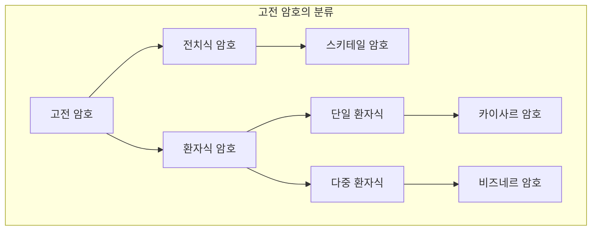
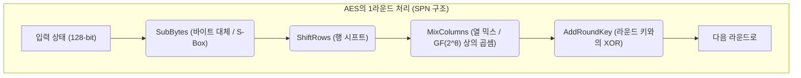
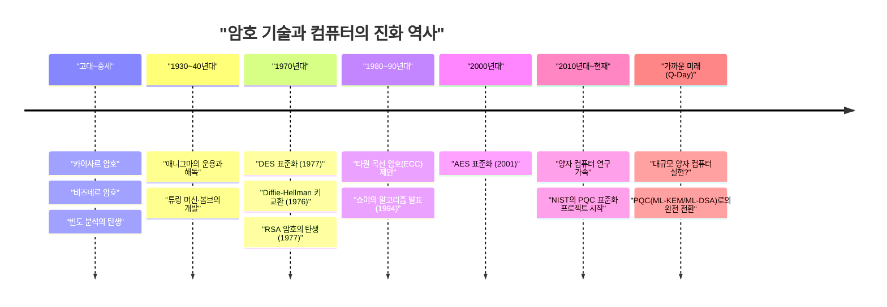

# 1. 서론: 암호 기술이란 무엇인가?

암호 기술(Cryptography)은 정보의 기밀성을 유지하기 위한 기술로, 인류의 역사와 함께 진화해 왔습니다. 고대 전쟁에서의 비밀 지령 전달부터 현대 인터넷의 신용카드 정보 보호에 이르기까지 암호의 목적은 일관됩니다. 그것은 "의도된 수신자만이 정보를 이해할 수 있게 하고, 제3자는 해독할 수 없도록 하는 것"입니다.

현대의 정보 보안에서 암호 기술은 단순한 '정보의 은닉(기밀성: Confidentiality)'에 그치지 않고, 데이터의 '무결성(Integrity)', '인증(Authentication)', '부인 방지(Non-repudiation)'와 같은 중요한 역할을 담당하고 있습니다.

본 기사에서는 고대의 단순한 환자식 암호에서 시작하여, 기계식 암호, 현대의 대칭키·공개키 암호, 그리고 양자 컴퓨터의 실용화로 도래할 '양자 내성 암호(PQC)' 시대까지, 암호 기술의 진화 역사를 기술적·수학적 관점에서 상세히 풀어보겠습니다.

---

# 2. 고전 암호의 시대: 문자의 치환과 전치

암호의 기원은 기원전으로 거슬러 올라갑니다. 초기의 암호는 주로 '전치(자리 바꿈)'와 '환자(치환)'의 두 가지 접근 방식으로 구성되어 있었습니다.

## 스키테일 암호 (전치식 암호)
기원전 5세기 고대 그리스 스파르타에서 사용된 '스키테일(Scytale)'은 가장 오래된 암호 도구 중 하나입니다. 특정 굵기의 나무 막대에 가늘고 긴 양피지를 감고, 그 위에 가로쓰기로 메시지를 적습니다. 종이를 풀면 글자가 의미 없는 순서로 나열되지만, 같은 굵기의 막대를 가진 수신자가 다시 종이를 감으면 원래의 메시지를 읽을 수 있는 방식이었습니다.

## 카이사르 암호 (단일 환자식 암호)
기원전 1세기, 고대 로마의 영웅 율리우스 카이사르(시저)가 사용했다고 전해지는 것이 '카이사르 암호'입니다. 이는 알파벳을 일정 수(보통 3글자)만큼 시프트시키는 단일 환자식 암호(Monoalphabetic substitution)입니다.

수학적으로는 문자를 $0$부터 $25$까지의 수치로 취급하고, 시프트 수를 $K$라고 할 때, 평문 $P$에서 암호문 $C$로의 변환은 다음 합동식으로 나타낼 수 있습니다.

$$C \equiv P + K \pmod{26}$$

복호화는 역연산을 수행합니다.

$$P \equiv C - K \pmod{26}$$

```python
# 카이사르 암호의 간단한 Python 구현 예
def caesar_cipher(text, shift, mode="encrypt"):
    result = ""
    if mode == "decrypt":
        shift = -shift
    
    for char in text:
        if char.isalpha():
            base = ord('A') if char.isupper() else ord('a')
            # 시프트 계산
            result += chr((ord(char) - base + shift) % 26 + base)
        else:
            result += char
    return result

# 실행 예
plaintext = "HELLO WORLD"
ciphertext = caesar_cipher(plaintext, 3, "encrypt")
print(f"암호문: {ciphertext}") # KHOOR ZRUOG
```

## 빈도 분석과 비즈네르 암호
단일 환자식 암호는 9세기 아랍의 학자 알 킨디가 고안한 '빈도 분석(Frequency Analysis)'에 의해 쉽게 해독되기 시작했습니다. 영어라면 'E'나 'T'가 자주 등장한다는 언어의 통계적 특성을 이용한 것입니다.

이에 대항하기 위해 16세기에 고안된 것이 '비즈네르 암호(Vigenère cipher)'입니다. 이는 여러 개의 시프트(키)를 주기적으로 전환하여 사용하는 다중 환자식 암호(Polyalphabetic substitution)로, 약 300년 동안 '해독 불가능한 암호(Le Chiffre Indéchiffrable)'라 불렸습니다.

수학적으로는 평문의 $i$번째 문자 $P_i$와 반복되는 키의 $i$번째 문자 $K_i$를 사용하여 다음과 같이 암호화합니다.

$$C_i \equiv P_i + K_i \pmod{26}$$

이 암호도 19세기에 들어 찰스 배비지와 프리드리히 카시스키에 의해 암호문 속 반복 패턴에서 키의 길이를 알아내는 '카시스키 검사(Kasiski examination)'가 발견되면서 해독되게 됩니다.



---

# 3. 기계식 암호와 세계 대전: 애니그마와 그 해독

20세기에 들어 통신 수단이 편지에서 전신이나 무선으로 전환되면서 암호화의 속도와 복잡성이 요구되었습니다. 이때 등장한 것이 로터(회전판)를 조합한 '기계식 암호'입니다.

## 애니그마(Enigma)의 위협
제2차 세계 대전 중 나치 독일이 사용한 '애니그마'는 암호 기술 역사상 가장 유명한 암호기입니다. 애니그마는 여러 개의 로터(보통 3~4개)와 문자의 배선을 바꾸는 플러그보드(Steckerbrett), 그리고 리플렉터(반사 로터)로 구성되어 있었습니다.

키보드로 한 글자를 입력할 때마다 로터가 회전하기 때문에, 같은 글자를 연속해서 입력해도 다른 암호 문자가 출력됩니다(다중 환자식 암호의 극치). 그 키 공간(설정의 조합)은 약 $1.58 \times 10^{19}$ 가지(약 1,580경)에 달해, 당시 기술로는 무차별 대입을 통한 해독이 불가능하다고 여겨졌습니다.

## 앨런 튜링과 '봄브(Bombe)'
이 난공불락의 애니그마에 도전한 것이 폴란드의 수학자 마리안 레예프스키 등의 초기 성과를 이어받은 영국의 블레츨리 파크 암호 해독 팀입니다.

특히 앨런 튜링(Alan Turing)은 암호문 일부에 대응하는 평문의 추측(크립: Crib)을 이용하여 전기 기계식 해독기인 '봄브(Bombe)'를 개발했습니다. 봄브는 논리적인 모순을 고속으로 검출하고 불가능한 로터 설정을 차례로 배제함으로써 애니그마 해독에 성공했습니다. 이 위업은 연합군의 승리를 몇 년 앞당겼다고 평가받습니다.

---

# 4. 현대 암호의 서막: 대칭키 암호 (DES와 AES)

전후 컴퓨터의 등장으로 암호는 '문자'의 조작에서 '비트(0과 1)'의 조작으로 극적인 패러다임 전환을 이룹니다.

## 클로드 섀넌과 정보 이론
1949년, 클로드 섀넌은 논문 '비밀 통신의 통신 이론'을 발표하며 현대 암호의 수학적 기초를 다졌습니다. 그는 안전한 암호 설계의 원칙으로 '혼돈(Confusion)'과 '확산(Diffusion)'을 제창했습니다.
- **혼돈(Confusion)**: 키와 암호문의 관계를 가능한 한 복잡하게 만드는 것. (환자/치환, S-box를 통해 구현)
- **확산(Diffusion)**: 평문의 1비트 변경이 암호문의 많은 비트에 영향을 미치도록 하는 것. (전치, 자리 바꿈을 통해 구현)

## DES (Data Encryption Standard)
1977년, 미국 국립표준기술연구소(NIST, 당시 NBS)는 IBM의 설계를 바탕으로 한 'DES'를 표준 암호로 제정했습니다.
DES는 '파이스텔 구조(Feistel Network)'라 불리는 아키텍처를 채택했으며, 64비트의 블록 길이와 56비트의 키 길이를 가집니다. 암호화와 복호화 알고리즘이 거의 같은 구조가 된다는 구현상의 이점이 있었습니다.

하지만 컴퓨터의 계산 능력이 향상됨에 따라 56비트의 키 길이(약 $7.2 \times 10^{16}$ 가지)로는 불충분하다는 것이 명백해졌습니다. 1998년에는 전자 프론티어 재단(EFF)이 전용 머신 'Deep Crack'을 개발하여 단 며칠 만에 DES를 해독해 보였습니다.

## AES (Advanced Encryption Standard)
DES를 대체할 새로운 표준으로 2001년에 제정된 것이 'AES'입니다. 공모를 통해 선정된 벨기에의 암호학자가 개발한 '레인달(Rijndael)' 알고리즘이 채택되었습니다.

AES는 파이스텔 구조가 아닌 'SPN 구조(Substitution-Permutation Network)'를 채택하였고, 갈루아 체(유한체) $GF(2^8)$ 상의 수학적 연산을 이용합니다. 키 길이는 128, 192, 256비트 중에서 선택할 수 있으며, 현재도 전 세계적으로 표준 대칭키 암호로 널리 사용되고 있습니다.



---

# 5. 공개키 암호의 혁명: Diffie-Hellman에서 RSA로

대칭키 암호에는 결정적인 약점이 있었습니다. 바로 '키 분배 문제(Key Distribution Problem)'입니다. 암호 통신을 시작하기 전에 멀리 떨어진 상대와 어떻게 안전하게 '공통의 키'를 공유할 것인가 하는 문제입니다. 이 문제를 해결한 것이 1970년대에 탄생한 '공개키 암호'입니다.

## Diffie-Hellman 키 교환
1976년, 휫필드 디피와 마틴 헬먼은 획기적인 논문 '암호학의 새로운 방향(New Directions in Cryptography)'을 발표했습니다. 이들은 '이산 로그 문제(Discrete Logarithm Problem)'라는 수학적 어려움을 이용하여 도청당하고 있는 통신 경로 상에서도 안전하게 키를 공유할 수 있는 기법을 제안했습니다.

1. 큰 소수 $p$와 생성원 $g$를 공개합니다.
2. Alice는 비밀 값 $a$를 선택하고, $A = g^a \pmod{p}$를 Bob에게 전송합니다.
3. Bob은 비밀 값 $b$를 선택하고, $B = g^b \pmod{p}$를 Alice에게 전송합니다.
4. Alice는 $K = B^a \pmod{p}$를 계산하고, Bob은 $K = A^b \pmod{p}$를 계산합니다.
5. 지수 법칙에 의해 $K = (g^b)^a = (g^a)^b = g^{ab} \pmod{p}$가 되어, 훌륭하게 같은 키 $K$를 공유할 수 있습니다.

## RSA 암호
이듬해인 1977년, 론 리베스트, 아디 샤미르, 레너드 애들먼의 세 사람에 의해 고안된 것이 'RSA 암호'입니다. 이는 "거대한 합성수의 소인수분해는 어렵다"는 성질에 기반하고 있습니다.

**RSA의 수학적 원리:**
1. 2개의 거대한 소수 $p$와 $q$를 선택하고, $n = p \times q$를 계산합니다.
2. 오일러의 피 함수 $\phi(n) = (p-1)(q-1)$을 계산합니다.
3. $\phi(n)$과 서로소인 정수 $e$(공개키)를 선택합니다.
4. $e \times d \equiv 1 \pmod{\phi(n)}$이 되는 정수 $d$(비밀키)를 계산합니다.

암호화: 평문 $M$에 대해 $C \equiv M^e \pmod{n}$
복호화: 암호문 $C$에 대해 $M \equiv C^d \pmod{n}$

```python
# RSA 암호의 개념을 보여주는 Python 코드 (실무용은 아닙니다)
def ext_euclid(a, b):
    # 확장 유클리드 호제법을 이용한 모듈러 역원 계산
    if b == 0: return 1, 0, a
    x, y, g = ext_euclid(b, a % b)
    return y, x - (a // b) * y, g

def rsa_example():
    # 작은 소수를 사용한 예
    p, q = 61, 53
    n = p * q
    phi = (p - 1) * (q - 1)
    
    e = 17 # phi와 서로소인 값
    d, _, _ = ext_euclid(e, phi)
    if d < 0: d += phi
        
    print(f"공개키: (e={e}, n={n})")
    print(f"비밀키: (d={d}, n={n})")
    
    # 메시지의 암호화와 복호화
    message = 65
    ciphertext = pow(message, e, n)
    decrypted = pow(ciphertext, d, n)
    
    print(f"평문: {message} -> 암호문: {ciphertext} -> 복호화 후: {decrypted}")

rsa_example()
```

---

# 6. 타원 곡선 암호(ECC)의 대두

RSA 암호는 강력하지만 컴퓨터의 성능 향상에 따라 안전성을 유지하기 위해 키 길이를 늘려야 했고(현재는 2048비트나 3072비트), 계산 비용이 증가한다는 문제가 발생했습니다.

그래서 1985년에 제안된 것이 '타원 곡선 암호(Elliptic Curve Cryptography: ECC)'입니다. 이는 유한체 상의 타원 곡선(일반적으로 $y^2 = x^3 + ax + b$ 형태)에서의 점 덧셈을 이용한 것입니다.

타원 곡선 상의 이산 로그 문제(ECDLP)는 소인수분해 문제보다 푸는 것이 더 어렵다고 알려져 있으며, **RSA의 3072비트와 동등한 안전성을 ECC라면 불과 256비트의 키 길이로 구현**할 수 있습니다. 이를 통해 스마트폰이나 IoT 기기 등 계산 자원이 제한된 환경에서도 빠르고 안전한 암호 통신(ECDSA나 ECDH 등)이 가능해졌습니다.

---

# 7. 양자 컴퓨터의 위협과 양자 내성 암호(PQC)

암호 기술은 반석처럼 보였으나, 1994년 피터 쇼어(Peter Shor)가 발표한 '쇼어의 알고리즘'으로 인해 큰 충격이 가해졌습니다.

양자 컴퓨터는 '중첩'과 '양자 얽힘'이라는 양자 역학의 성질을 이용하여 계산을 수행합니다. 쇼어의 알고리즘을 충분한 성능의 양자 컴퓨터에서 실행하면, 소인수분해 문제나 이산 로그 문제가 '다항식 시간' 내에 풀린다는 것이 수학적으로 증명된 것입니다. 즉, 실용적인 양자 컴퓨터가 완성되는 날(Q-Day), 현재 사용되고 있는 RSA나 ECC 같은 공개키 암호는 모두 순식간에 붕괴됩니다.

## PQC(Post-Quantum Cryptography)의 등장
이 전대미문의 위협에 대비해, 양자 컴퓨터로도 해독이 어려운 새로운 수학적 문제에 기반한 '양자 내성 암호(PQC)' 연구가 빠른 속도로 진행되고 있습니다. NIST(미국 국립표준기술연구소)는 수년간 PQC의 표준화 과정을 진행해 왔으며, 주로 다음의 수학적 접근 방식이 유력하게 꼽히고 있습니다.

### 1. 격자 기반 암호 (Lattice-based Cryptography)
현재 가장 유력한 접근법으로, NIST의 표준화 알고리즘(ML-KEM / Kyber, ML-DSA / Dilithium)에도 채택되었습니다. 다차원 공간의 '격자(Lattice)' 위에서 특정 점을 찾는 문제(최단 벡터 문제: SVP 등)나, LWE(Learning With Errors: 오차가 있는 학습) 문제의 어려움에 기반하고 있습니다.

LWE 문제의 개념은 연립 일차 방정식에 의도적으로 '작은 노이즈(오차)'를 더하면 순간적으로 해를 구하기가 매우 어려워진다는 성질을 이용한 것입니다.
방정식계: $\mathbf{A}\mathbf{s} + \mathbf{e} \equiv \mathbf{b} \pmod{q}$
($\mathbf{A}$와 $\mathbf{b}$는 공개, $\mathbf{s}$는 비밀키, $\mathbf{e}$는 미세한 노이즈)

```python
# LWE 문제의 개념적 의사 코드 (학습 목적)
import numpy as np

n = 256  # 차원
q = 3329 # 법(modulus)
m = 512  # 방정식의 수

# 비밀키 s와 작은 에러 e
s = np.random.randint(0, 5, size=n)
e = np.random.randint(-1, 2, size=m)

# 공개 행렬 A와 공개 벡터 b
A = np.random.randint(0, q, size=(m, n))
b = (np.dot(A, s) + e) % q

# 양자 컴퓨터를 사용해도 A와 b로부터 s를 복원하는 것은 매우 어렵다고 여겨짐
```

### 2. 해시 기반 암호 (Hash-based Cryptography)
해시 함수의 충돌 저항성에만 안전성의 근거를 두는 전자 서명 방식입니다. 수학적인 구조를 가지지 않기 때문에 양자 공격에 강하지만, 서명 크기가 커지는 경향이 있습니다(SPHINCS+ 등).

### 3. 코드 기반 암호 (Code-based Cryptography)
오류 정정 코드 이론에 기반한 암호 방식입니다. 1978년에 제안된 McEliece 암호 등이 유명하며, 역사가 길고 안전성이 입증되었으나 공개키의 크기가 매우 크다(수 메가바이트에 달하기도 함)는 과제가 있습니다.



---

# 8. 결론: 끝없는 방패와 창의 싸움

암호 기술의 역사는 새로운 암호 방식(방패)의 발명과 그것을 깨는 새로운 해독 기법(창)의 끝없는 싸움의 역사입니다.

카이사르 암호는 빈도 분석에 패배했고, 무적을 자랑하던 애니그마는 튜링의 천재적인 두뇌와 기계의 힘에 패배했습니다. 그리고 지금, 현대 인터넷 사회의 근간을 지탱하는 RSA나 ECC 같은 강력한 암호도 양자 컴퓨터라는 새로운 '창' 앞에 위협을 받고 있습니다.

하지만 인류는 이미 그 너머의 미래를 바라보며 양자 내성 암호(PQC)라는 새로운 '방패'를 준비하고 있습니다. 현재 전 세계의 IT 인프라에서 기존의 공개키 암호로부터 PQC로의 전환 준비(Crypto Agility 확보)가 시급한 과제가 되었습니다.

암호 기술은 단순하고 난해한 수학 퍼즐이 아니라, 우리의 프라이버시, 재산, 그리고 사회 인프라 자체를 지키기 위한 최강의 방벽인 것입니다.
