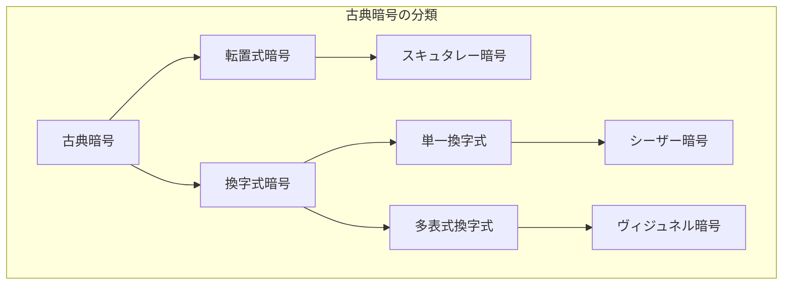
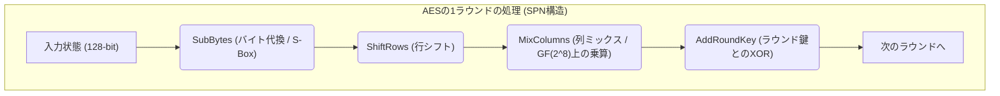
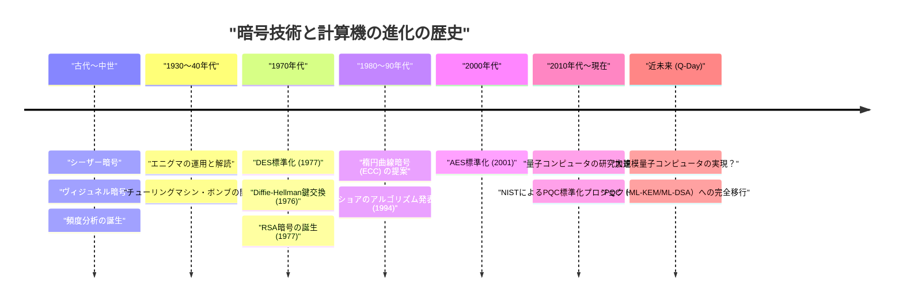

# 1. はじめに：暗号技術とは何か？

暗号技術（Cryptography）は、情報の秘匿性を保つための技術であり、人類の歴史とともに進化してきました。古代の戦争における秘密司令の伝達から、現代のインターネットにおけるクレジットカード情報の保護に至るまで、暗号の目的は一貫しています。それは「意図された受信者だけが情報を理解でき、第三者には解読できないようにする」ことです。

現代の情報セキュリティにおいて、暗号技術は単なる「情報の秘匿（機密性: Confidentiality）」にとどまらず、データの「完全性（Integrity）」、「認証（Authentication）」、「否認防止（Non-repudiation）」といった重要な役割を担っています。

本記事では、古代の単純な換字式暗号から始まり、機械式暗号、現代の共通鍵・公開鍵暗号、そして量子コンピュータの実用化によって到来する「耐量子暗号（PQC）」の時代まで、暗号技術の進化の歴史を技術的・数学的な観点から詳細に紐解いていきます。

---

# 2. 古典暗号の時代：文字の置き換えと並べ替え

暗号の起源は紀元前にまで遡ります。初期の暗号は主に「転置（並べ替え）」と「換字（置き換え）」の2つのアプローチで構成されていました。

## スキュタレー暗号（転置式暗号）
紀元前5世紀の古代ギリシャ・スパルタで使用された「スキュタレー（Scytale）」は、最古の暗号器具の一つです。特定の太さの木の棒に細長い羊皮紙を巻き付け、そこに横書きでメッセージを記します。紙を解くと文字が意味不明な順序に並びますが、同じ太さの棒を持つ受信者が再び紙を巻き付けることで、元のメッセージが読めるという仕組みでした。

## シーザー暗号（単一換字式暗号）
紀元前1世紀、古代ローマの英雄ユリウス・カエサル（シーザー）が使用したとされるのが「シーザー暗号」です。これはアルファベットを一定数（通常は3文字）シフトさせる単一換字式暗号（Monoalphabetic substitution）です。

数学的には、文字を $0$ から $25$ までの数値として扱い、シフト数を $K$ とすると、平文 $P$ から暗号文 $C$ への変換は以下の合同式で表されます。

$$C \equiv P + K \pmod{26}$$

復号は逆の操作を行います。

$$P \equiv C - K \pmod{26}$$

```python
# シーザー暗号のシンプルなPython実装例
def caesar_cipher(text, shift, mode="encrypt"):
    result = ""
    if mode == "decrypt":
        shift = -shift
    
    for char in text:
        if char.isalpha():
            base = ord('A') if char.isupper() else ord('a')
            # シフト計算
            result += chr((ord(char) - base + shift) % 26 + base)
        else:
            result += char
    return result

# 実行例
plaintext = "HELLO WORLD"
ciphertext = caesar_cipher(plaintext, 3, "encrypt")
print(f"暗号文: {ciphertext}") # KHOOR ZRUOG
```

## 頻度分析とヴィジュネル暗号
単一換字式暗号は、9世紀のアラブの学者アル・キンディーによって考案された「頻度分析（Frequency Analysis）」によって容易に解読されるようになりました。英語であれば「E」や「T」が頻出するという言語の統計的特性を利用したものです。

これに対抗するため、16世紀に考案されたのが「ヴィジュネル暗号（Vigenère cipher）」です。これは複数のシフト（鍵）を周期的に切り替えて使用する多表式換字暗号（Polyalphabetic substitution）であり、約300年もの間「解読不能な暗号（Le Chiffre Indéchiffrable）」と呼ばれていました。

数学的には、平文の $i$ 番目の文字 $P_i$ と、繰り返される鍵の $i$ 番目の文字 $K_i$ を用いて次のように暗号化します。

$$C_i \equiv P_i + K_i \pmod{26}$$

この暗号も、19世紀に入りチャールズ・バベッジやフリードリヒ・カシスキーによって、暗号文中の繰り返しのパターンから鍵の長さを割り出す「カシスキー触媒（Kasiski examination）」が発見され、解読されることになります。



---

# 3. 機械式暗号と世界大戦：エニグマとその解読

20世紀に入ると、通信手段は手紙から電信や無線へと移行し、暗号化の速度と複雑さが求められるようになりました。ここで登場したのが、ローター（回転盤）を組み合わせた「機械式暗号」です。

## エニグマ（Enigma）の脅威
第二次世界大戦中、ナチス・ドイツが使用した「エニグマ」は、暗号技術史において最も有名な暗号機です。エニグマは複数のローター（通常3〜4個）と、文字の配線を入れ替えるプラグボード（Steckerbrett）、そしてリフレクター（反転ローター）で構成されていました。

キーボードで1文字打ち込むたびにローターが回転するため、同じ文字を連続して打っても異なる暗号文字が出力されます（多表式暗号の極地）。その鍵空間（設定の組み合わせ）は約 $1.58 \times 10^{19}$ 通り（約1580京）にも及び、当時の技術では総当たりによる解読は不可能とされていました。

## アラン・チューリングと「ボンブ（Bombe）」
この難攻不落のエニグマに挑んだのが、ポーランドの数学者マリアン・レイェフスキらの初期の成果を引き継いだ、イギリスのブレッチリー・パークの暗号解読チームです。

特にアラン・チューリング（Alan Turing）は、暗号文の一部に対応する平文の推測（クリブ: Crib）を利用し、電気機械式の解読機「ボンブ（Bombe）」を開発しました。ボンブは論理的な矛盾を高速に検出し、あり得ないローター設定を次々と排除することで、エニグマの解読に成功しました。この偉業は、連合国側の勝利を数年早めたと言われています。

---

# 4. 現代暗号の幕開け：共通鍵暗号（DESとAES）

戦後、コンピュータの登場により、暗号は「文字」の操作から「ビット（0と1）」の操作へと劇的なパラダイムシフトを遂げます。

## クロード・シャノンと情報理論
1949年、クロード・シャノンは論文「秘話系の通信理論」を発表し、現代暗号の数学的基礎を築きました。彼は安全な暗号設計の原則として「混乱（Confusion）」と「拡散（Diffusion）」を提唱しました。
- **混乱（Confusion）**: 鍵と暗号文の関係を可能な限り複雑にすること。（換字・Sボックスによる実現）
- **拡散（Diffusion）**: 平文の1ビットの変更が、暗号文の多くのビットに影響を与えるようにすること。（転置・並べ替えによる実現）

## DES (Data Encryption Standard)
1977年、アメリカ国立標準技術研究所（NIST、当時はNBS）は、IBMの設計をベースとした「DES」を標準暗号として制定しました。
DESは「ファイステル構造（Feistel Network）」と呼ばれるアーキテクチャを採用しており、64ビットのブロック長と56ビットの鍵長を持ちます。暗号化と復号のアルゴリズムがほぼ同じ構造になるという実装上の利点がありました。

しかし、コンピュータの計算能力が向上するにつれ、56ビットの鍵長（約 $7.2 \times 10^{16}$ 通り）では不十分であることが明らかになります。1998年には電子フロンティア財団（EFF）が専用マシン「Deep Crack」を開発し、数日でDESを解読してみせました。

## AES (Advanced Encryption Standard)
DESに代わる新たな標準として、2001年に制定されたのが「AES」です。公募によって選ばれたベルギーの暗号学者による「Rijndael（ラインダール）」アルゴリズムが採用されました。

AESはファイステル構造ではなく「SPN構造（Substitution-Permutation Network）」を採用し、ガロア体（有限体） $GF(2^8)$ 上の数学的演算を利用しています。鍵長は128、192、256ビットから選択でき、現在でも世界中で標準的な共通鍵暗号として広く利用されています。



---

# 5. 公開鍵暗号の革命：Diffie-HellmanからRSAへ

共通鍵暗号には決定的な弱点がありました。それは「鍵配送問題（Key Distribution Problem）」です。暗号通信を始める前に、遠く離れた相手とどうやって安全に「共通の鍵」を共有するのかという問題です。この問題を解決したのが1970年代に誕生した「公開鍵暗号」です。

## Diffie-Hellman鍵交換
1976年、ホイットフィールド・ディフィーとマーティン・ヘルマンは、画期的な論文「New Directions in Cryptography」を発表しました。彼らは「離散対数問題（Discrete Logarithm Problem）」という数学的困難性を利用し、盗聴されている通信経路上でも安全に鍵を共有できる手法を提案しました。

1. 大きな素数 $p$ と生成元 $g$ を公開します。
2. Aliceは秘密の値 $a$ を選び、$A = g^a \pmod{p}$ をBobに送信します。
3. Bobは秘密の値 $b$ を選び、$B = g^b \pmod{p}$ をAliceに送信します。
4. Aliceは $K = B^a \pmod{p}$ を計算し、Bobは $K = A^b \pmod{p}$ を計算します。
5. 指数法則により $K = (g^b)^a = (g^a)^b = g^{ab} \pmod{p}$ となり、見事に同じ鍵 $K$ を共有できます。

## RSA暗号
翌1977年、ロン・リベスト、アディ・シャミア、レオナルド・エーデルマンの3人によって考案されたのが「RSA暗号」です。これは「巨大な合成数の素因数分解は困難である」という性質に基づいています。

**RSAの数学的仕組み:**
1. 2つの巨大な素数 $p$ と $q$ を選び、$n = p \times q$ を計算します。
2. オイラーのトーティエント関数 $\phi(n) = (p-1)(q-1)$ を計算します。
3. $\phi(n)$ と互いに素な整数 $e$（公開鍵）を選びます。
4. $e \times d \equiv 1 \pmod{\phi(n)}$ となる整数 $d$（秘密鍵）を計算します。

暗号化: 平文 $M$ に対して $C \equiv M^e \pmod{n}$
復号: 暗号文 $C$ に対して $M \equiv C^d \pmod{n}$

```python
# RSA暗号の概念を示すPythonコード（実用向けではありません）
def ext_euclid(a, b):
    # 拡張ユークリッドの互除法によるモジュラ逆数の計算
    if b == 0: return 1, 0, a
    x, y, g = ext_euclid(b, a % b)
    return y, x - (a // b) * y, g

def rsa_example():
    # 小さな素数を用いた例
    p, q = 61, 53
    n = p * q
    phi = (p - 1) * (q - 1)
    
    e = 17 # phiと互いに素な値
    d, _, _ = ext_euclid(e, phi)
    if d < 0: d += phi
        
    print(f"公開鍵: (e={e}, n={n})")
    print(f"秘密鍵: (d={d}, n={n})")
    
    # メッセージの暗号化と復号
    message = 65
    ciphertext = pow(message, e, n)
    decrypted = pow(ciphertext, d, n)
    
    print(f"平文: {message} -> 暗号文: {ciphertext} -> 復号後: {decrypted}")

rsa_example()
```

---

# 6. 楕円曲線暗号（ECC）の台頭

RSA暗号は強力ですが、コンピュータの性能向上に伴い、安全性を保つために鍵長を長くする（現在では2048ビットや3072ビット）必要があり、計算コストが増大するという問題が生じました。

そこで1985年に提案されたのが「楕円曲線暗号（Elliptic Curve Cryptography: ECC）」です。これは有限体上の楕円曲線（一般に $y^2 = x^3 + ax + b$ の形）における点の加算を利用したものです。

楕円曲線上の離散対数問題（ECDLP）は、素因数分解問題よりもさらに解くのが困難であることが知られており、**RSAの3072ビットと同等の安全性を、ECCならわずか256ビットの鍵長で実現**できます。これにより、スマートフォンやIoTデバイスなど、計算リソースが限られた環境でも高速かつ安全な暗号通信（ECDSAやECDHなど）が可能になりました。

---

# 7. 量子コンピュータの脅威と耐量子暗号（PQC）

暗号技術は盤石に思えましたが、1994年にピーター・ショア（Peter Shor）が発表した「ショアのアルゴリズム」によって大きな衝撃が走ります。

量子コンピュータは「重ね合わせ」と「量子もつれ」という量子力学の性質を利用して計算を行います。ショアのアルゴリズムを十分な性能の量子コンピュータ上で実行すると、素因数分解問題や離散対数問題が「多項式時間」で解けてしまうことが数学的に証明されたのです。つまり、実用的な量子コンピュータが完成した日（Q-Day）、現在使われているRSAやECCなどの公開鍵暗号はすべて瞬時に破綻します。

## PQC（Post-Quantum Cryptography）の登場
この未曾有の脅威に備え、量子コンピュータでも解読が困難な新しい数学的問題に基づく「耐量子計算機暗号（PQC）」の研究が急ピッチで進められています。NIST（米国国立標準技術研究所）は長年にわたりPQCの標準化プロセスを進めており、主に以下の数学的アプローチが有力視されています。

### 1. 格子暗号（Lattice-based Cryptography）
現在最も有力なアプローチであり、NISTの標準化アルゴリズム（ML-KEM / Kyber、ML-DSA / Dilithium）にも採用されています。多次元空間の「格子（Lattice）」上で特定の点を見つける問題（最短ベクトル問題: SVPなど）や、LWE（Learning With Errors: 誤差付き学習）問題の困難性に基づいています。

LWE問題の概念は、連立一次方程式に意図的に「小さなノイズ（誤差）」を加えると、途端に解を求めるのが困難になるという性質を利用しています。
方程式系: $\mathbf{A}\mathbf{s} + \mathbf{e} \equiv \mathbf{b} \pmod{q}$
（$\mathbf{A}$ と $\mathbf{b}$ は公開、$\mathbf{s}$ は秘密鍵、$\mathbf{e}$ は微小なノイズ）

```python
# LWE問題の概念的疑似コード（学習目的）
import numpy as np

n = 256  # 次元
q = 3329 # 法
m = 512  # 方程式の数

# 秘密鍵 s と小さなエラー e
s = np.random.randint(0, 5, size=n)
e = np.random.randint(-1, 2, size=m)

# 公開行列 A と公開ベクトル b
A = np.random.randint(0, q, size=(m, n))
b = (np.dot(A, s) + e) % q

# 量子コンピュータを使っても、Aとbからsを復元するのは非常に困難とされる
```

### 2. ハッシュベース暗号（Hash-based Cryptography）
ハッシュ関数の衝突耐性のみに安全性の根拠を置くデジタル署名方式です。数学的な構造を持たないため量子攻撃に強いですが、署名サイズが大きくなる傾向があります（SPHINCS+など）。

### 3. 符号ベース暗号（Code-based Cryptography）
誤り訂正符号の理論に基づく暗号方式です。1978年に提案されたMcEliece暗号などが有名で、歴史が古く安全性に定評がありますが、公開鍵のサイズが非常に大きい（数メガバイトに及ぶこともある）という課題があります。



---

# 8. 結論：終わりのない盾と矛の戦い

暗号技術の歴史は、新しい暗号方式（盾）の発明と、それを破る新しい解読手法（矛）の終わりのない戦いの歴史です。

シーザー暗号は頻度分析に敗れ、無敵を誇ったエニグマはチューリングの天才的頭脳と機械の力に敗れました。そして今、現代インターネット社会の根幹を支えるRSAやECCといった強力な暗号も、量子コンピュータという新たな「矛」の前に脅威に晒されています。

しかし、人類は既にその先の未来を見据え、耐量子暗号（PQC）という新たな「盾」を準備しつつあります。現在、世界中のITインフラにおいて、既存の公開鍵暗号からPQCへの移行準備（Crypto Agilityの確保）が急務となっています。

暗号技術は、単なる難解な数学のパズルではなく、私たちのプライバシー、財産、そして社会インフラそのものを守るための最強の防壁なのです。
