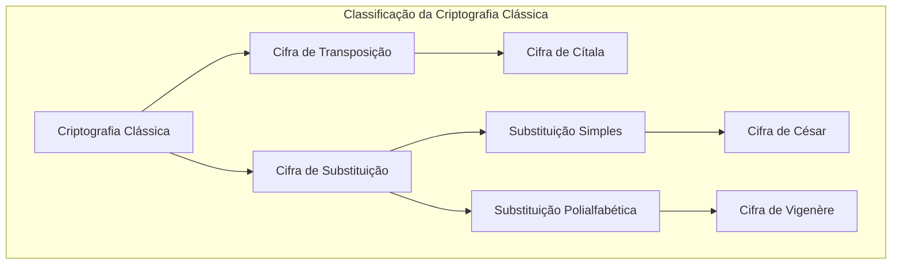
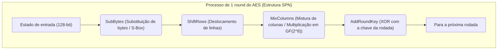
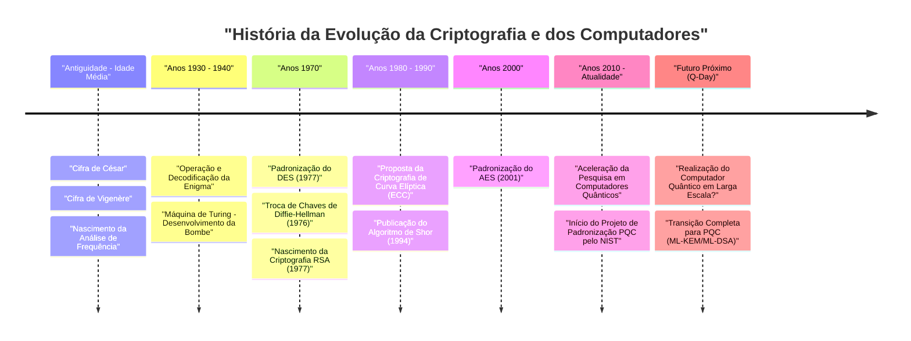

# 1. Introdução: O que é Criptografia?

A criptografia (Cryptography) é uma tecnologia para preservar o sigilo das informações e tem evoluído junto com a história da humanidade. Desde a transmissão de comandos secretos em guerras antigas até a proteção de informações de cartão de crédito na internet moderna, o propósito da criptografia tem sido consistente. Consiste em "garantir que apenas os destinatários pretendidos possam entender as informações e que terceiros não consigam decifrá-las".

Na segurança da informação moderna, a tecnologia criptográfica não se limita apenas ao "sigilo da informação (Confidencialidade: Confidentiality)", mas desempenha papéis cruciais como a "Integridade (Integrity)" dos dados, a "Autenticação (Authentication)" e o "Não-repúdio (Non-repudiation)".

Neste artigo, desvendaremos detalhadamente a história da evolução da tecnologia criptográfica a partir de uma perspectiva técnica e matemática, começando pelas simples cifras de substituição antigas, passando pelas cifras mecânicas, as modernas criptografias de chave simétrica e chave pública, e chegando à era da "Criptografia Pós-Quântica (PQC)" que surge com o uso prático dos computadores quânticos.

---

# 2. A Era da Criptografia Clássica: Substituição e Transposição de Letras

As origens da criptografia remontam antes de Cristo. As primeiras cifras consistiam principalmente em duas abordagens: "Transposição (reordenação)" e "Substituição (troca)".

## Cifra de Cítala (Cifra de Transposição)
O "Cítala (Scytale)", usado em Esparta na Grécia Antiga no século V a.C., é um dos mais antigos instrumentos de criptografia. Uma tira longa e estreita de pergaminho era enrolada em um bastão de madeira de uma espessura específica, e a mensagem era escrita horizontalmente. Ao desenrolar a tira, as letras ficavam ordenadas de forma sem sentido, mas um destinatário com um bastão da mesma espessura poderia enrolar a tira novamente e ler a mensagem original.

## Cifra de César (Cifra de Substituição Simples)
Diz-se que o herói romano antigo Júlio César usou a "Cifra de César" no século I a.C. Esta é uma cifra de substituição simples (Monoalphabetic substitution) onde o alfabeto é deslocado por um número fixo (geralmente 3 letras).

Matematicamente, tratando as letras como números de $0$ a $25$ e o número de deslocamentos como $K$, a conversão do texto claro $P$ para o texto cifrado $C$ é expressa pela seguinte equação de congruência:

$$C \equiv P + K \pmod{26}$$

A decodificação realiza a operação inversa.

$$P \equiv C - K \pmod{26}$$

```python
# Exemplo simples de implementação da Cifra de César em Python
def caesar_cipher(text, shift, mode="encrypt"):
    result = ""
    if mode == "decrypt":
        shift = -shift
    
    for char in text:
        if char.isalpha():
            base = ord('A') if char.isupper() else ord('a')
            # Cálculo do deslocamento
            result += chr((ord(char) - base + shift) % 26 + base)
        else:
            result += char
    return result

# Exemplo de execução
plaintext = "HELLO WORLD"
ciphertext = caesar_cipher(plaintext, 3, "encrypt")
print(f"Texto cifrado: {ciphertext}") # KHOOR ZRUOG
```

## Análise de Frequência e Cifra de Vigenère
As cifras de substituição simples tornaram-se facilmente decifráveis através da "Análise de Frequência (Frequency Analysis)", inventada pelo estudioso árabe Al-Kindi no século IX. Ela se aproveita das propriedades estatísticas da linguagem, onde letras como "E" ou "T" aparecem com frequência, no caso do inglês.

Para combater isso, a "Cifra de Vigenère (Vigenère cipher)" foi concebida no século XVI. Esta é uma cifra de substituição polialfabética (Polyalphabetic substitution) que usa múltiplos deslocamentos (chaves) alternados periodicamente e foi chamada de "cifra indecifrável (Le Chiffre Indéchiffrable)" por cerca de 300 anos.

Matematicamente, a $i$-ésima letra do texto claro $P_i$ e a $i$-ésima letra da chave repetida $K_i$ são usadas para criptografar da seguinte forma:

$$C_i \equiv P_i + K_i \pmod{26}$$

Essa cifra também veio a ser decifrada no século XIX por Charles Babbage e Friedrich Kasiski, através da descoberta do "Exame de Kasiski (Kasiski examination)", que determina o tamanho da chave a partir de padrões repetitivos no texto cifrado.



---

# 3. Criptografia Mecânica e as Guerras Mundiais: Enigma e sua Decodificação

Ao entrarmos no século XX, os meios de comunicação mudaram das cartas para o telégrafo e o rádio, passando a exigir velocidade e complexidade na criptografia. Foi aqui que surgiu a "criptografia mecânica", combinando rotores (discos rotativos).

## A Ameaça da Enigma (Enigma)
A "Enigma", usada pela Alemanha Nazista durante a Segunda Guerra Mundial, é a máquina de criptografia mais famosa na história da tecnologia criptográfica. A Enigma consistia em múltiplos rotores (geralmente de 3 a 4), um painel de conexões (Steckerbrett) para trocar o cabeamento das letras, e um refletor (rotor reverso).

Como o rotor girava a cada vez que uma letra era digitada no teclado, mesmo que a mesma letra fosse digitada consecutivamente, um caractere cifrado diferente era produzido (o auge da criptografia polialfabética). O seu espaço de chaves (combinações de configurações) chegava a cerca de $1.58 \times 10^{19}$ (aproximadamente 15,8 quintilhões), e com a tecnologia da época, a decodificação por força bruta era considerada impossível.

## Alan Turing e a "Bombe (Bombe)"
A equipe de decodificação de códigos de Bletchley Park, no Reino Unido, que se baseou nos resultados iniciais do matemático polonês Marian Rejewski e outros, desafiou essa Enigma inexpugnável.

Particularmente, Alan Turing usou a suposição de texto claro (Crib) correspondente a parte do texto cifrado e desenvolveu a máquina de decodificação eletromecânica "Bombe". A Bombe detectava rapidamente contradições lógicas e eliminava configurações impossíveis de rotores uma após a outra, obtendo sucesso na decodificação da Enigma. Diz-se que essa grande conquista adiantou a vitória dos Aliados em vários anos.

---

# 4. O Início da Criptografia Moderna: Criptografia de Chave Simétrica (DES e AES)

No pós-guerra, com o advento dos computadores, a criptografia passou por uma mudança drástica de paradigma, da manipulação de "letras" para a manipulação de "bits (0 e 1)".

## Claude Shannon e a Teoria da Informação
Em 1949, Claude Shannon publicou o artigo "Teoria da Comunicação de Sistemas Secretos", estabelecendo os fundamentos matemáticos da criptografia moderna. Ele propôs a "Confusão (Confusion)" e a "Difusão (Diffusion)" como princípios para um design criptográfico seguro.
- **Confusão (Confusion)**: Tornar a relação entre a chave e o texto cifrado o mais complexa possível. (Realizado por substituição / S-boxes)
- **Difusão (Diffusion)**: Fazer com que a alteração de 1 bit do texto claro afete muitos bits do texto cifrado. (Realizado por transposição / permutação)

## DES (Data Encryption Standard)
Em 1977, o Instituto Nacional de Padrões e Tecnologia dos EUA (NIST, então NBS) estabeleceu o "DES", baseado no design da IBM, como o padrão de criptografia.
O DES adota uma arquitetura chamada "Rede de Feistel (Feistel Network)", possuindo um tamanho de bloco de 64 bits e um tamanho de chave de 56 bits. Havia uma vantagem na implementação onde o algoritmo de criptografia e decodificação possuíam quase a mesma estrutura.

No entanto, à medida que o poder de computação melhorava, tornou-se claro que um tamanho de chave de 56 bits (cerca de $7.2 \times 10^{16}$ possibilidades) era insuficiente. Em 1998, a Electronic Frontier Foundation (EFF) desenvolveu uma máquina dedicada, a "Deep Crack", e demonstrou a quebra do DES em poucos dias.

## AES (Advanced Encryption Standard)
Como um novo padrão para substituir o DES, o "AES" foi estabelecido em 2001. O algoritmo "Rijndael", criado por criptógrafos belgas selecionado através de um concurso público, foi adotado.

O AES não utiliza a Rede de Feistel, mas sim a "Estrutura SPN (Substitution-Permutation Network)", e utiliza operações matemáticas sobre o Campo de Galois (campo finito) $GF(2^8)$. O tamanho da chave pode ser selecionado entre 128, 192 e 256 bits, e ainda hoje é amplamente utilizado como o padrão de criptografia de chave simétrica em todo o mundo.



---

# 5. A Revolução da Criptografia de Chave Pública: De Diffie-Hellman a RSA

A criptografia de chave simétrica possuía uma fraqueza decisiva. Trata-se do "Problema de Distribuição de Chaves (Key Distribution Problem)". É o problema de como compartilhar de forma segura uma "chave comum" com uma parte distante antes de iniciar a comunicação criptografada. Este problema foi resolvido pela "Criptografia de Chave Pública", nascida na década de 1970.

## Troca de Chaves de Diffie-Hellman
Em 1976, Whitfield Diffie e Martin Hellman publicaram o artigo revolucionário "New Directions in Cryptography". Eles utilizaram a dificuldade matemática chamada "Problema do Logaritmo Discreto (Discrete Logarithm Problem)" e propuseram um método para compartilhar chaves de forma segura, mesmo em canais de comunicação interceptados.

1. Um número primo grande $p$ e um gerador $g$ são tornados públicos.
2. Alice escolhe um valor secreto $a$ e envia $A = g^a \pmod{p}$ para Bob.
3. Bob escolhe um valor secreto $b$ e envia $B = g^b \pmod{p}$ para Alice.
4. Alice calcula $K = B^a \pmod{p}$, e Bob calcula $K = A^b \pmod{p}$.
5. Pelas leis dos expoentes, $K = (g^b)^a = (g^a)^b = g^{ab} \pmod{p}$, e assim, de forma brilhante, eles podem compartilhar a mesma chave $K$.

## Criptografia RSA
No ano seguinte, em 1977, a "Criptografia RSA" foi concebida por Ron Rivest, Adi Shamir e Leonard Adleman. Ela baseia-se na propriedade de que "a fatoração de números compostos gigantes é difícil".

**Mecanismo matemático do RSA:**
1. Escolhem-se 2 números primos gigantes $p$ e $q$, e calcula-se $n = p \times q$.
2. Calcula-se a função totiente de Euler $\phi(n) = (p-1)(q-1)$.
3. Escolhe-se um número inteiro $e$ (chave pública) que seja coprimo de $\phi(n)$.
4. Calcula-se um número inteiro $d$ (chave privada) tal que $e \times d \equiv 1 \pmod{\phi(n)}$.

Criptografia: Para o texto claro $M$, $C \equiv M^e \pmod{n}$
Decodificação: Para o texto cifrado $C$, $M \equiv C^d \pmod{n}$

```python
# Código Python demonstrando o conceito da criptografia RSA (não para uso prático)
def ext_euclid(a, b):
    # Cálculo do inverso modular pelo algoritmo de Euclides estendido
    if b == 0: return 1, 0, a
    x, y, g = ext_euclid(b, a % b)
    return y, x - (a // b) * y, g

def rsa_example():
    # Exemplo usando números primos pequenos
    p, q = 61, 53
    n = p * q
    phi = (p - 1) * (q - 1)
    
    e = 17 # Valor coprimo de phi
    d, _, _ = ext_euclid(e, phi)
    if d < 0: d += phi
        
    print(f"Chave pública: (e={e}, n={n})")
    print(f"Chave privada: (d={d}, n={n})")
    
    # Criptografia e decodificação de uma mensagem
    message = 65
    ciphertext = pow(message, e, n)
    decrypted = pow(ciphertext, d, n)
    
    print(f"Texto claro: {message} -> Texto cifrado: {ciphertext} -> Após decodificação: {decrypted}")

rsa_example()
```

---

# 6. A Ascensão da Criptografia de Curva Elíptica (ECC)

A criptografia RSA é forte, mas com a melhoria no desempenho dos computadores, tornou-se necessário aumentar o tamanho da chave para manter a segurança (atualmente 2048 bits ou 3072 bits), o que gerou o problema do aumento do custo computacional.

Portanto, em 1985 foi proposta a "Criptografia de Curva Elíptica (Elliptic Curve Cryptography: ECC)". Isso utiliza a adição de pontos em uma curva elíptica sobre um campo finito (geralmente na forma de $y^2 = x^3 + ax + b$).

Sabe-se que o Problema do Logaritmo Discreto em Curvas Elípticas (ECDLP) é ainda mais difícil de resolver do que o problema da fatoração de primos, e **o ECC pode alcançar a mesma segurança que o RSA de 3072 bits com um tamanho de chave de apenas 256 bits**. Isso possibilitou uma comunicação criptografada de alta velocidade e segurança (como ECDSA e ECDH) até mesmo em ambientes com recursos computacionais limitados, como smartphones e dispositivos IoT.

---

# 7. A Ameaça dos Computadores Quânticos e a Criptografia Pós-Quântica (PQC)

A tecnologia criptográfica parecia sólida, mas em 1994, o "Algoritmo de Shor" publicado por Peter Shor causou um grande impacto.

Os computadores quânticos realizam cálculos utilizando as propriedades da mecânica quântica de "superposição" e "emaranhamento quântico". Foi matematicamente provado que a execução do algoritmo de Shor em um computador quântico de desempenho suficiente pode resolver o problema de fatoração de primos e o problema do logaritmo discreto em "tempo polinomial". Ou seja, no dia em que um computador quântico prático for concluído (Q-Day), as criptografias de chave pública usadas atualmente, como RSA e ECC, serão corrompidas instantaneamente.

## O Surgimento da PQC (Post-Quantum Cryptography)
Em preparação para esta ameaça sem precedentes, pesquisas em "Criptografia Pós-Quântica (PQC)", baseada em novos problemas matemáticos difíceis de resolver mesmo para computadores quânticos, estão avançando a passos largos. O NIST (Instituto Nacional de Padrões e Tecnologia dos EUA) tem conduzido um processo de padronização da PQC ao longo de muitos anos, e as seguintes abordagens matemáticas são consideradas as mais promissoras.

### 1. Criptografia Baseada em Reticulados (Lattice-based Cryptography)
Atualmente é a abordagem mais promissora, sendo também adotada nos algoritmos de padronização do NIST (ML-KEM / Kyber, ML-DSA / Dilithium). Ela baseia-se na dificuldade de encontrar pontos específicos (como o Problema do Vetor Mais Curto: SVP) em "reticulados (Lattice)" no espaço multidimensional e no problema LWE (Learning With Errors: Aprendizado Com Erros).

O conceito do problema LWE aproveita a propriedade de que se um "pequeno ruído (erro)" for adicionado intencionalmente a um sistema de equações lineares simultâneas, de repente torna-se difícil encontrar a solução.
Sistema de equações: $\mathbf{A}\mathbf{s} + \mathbf{e} \equiv \mathbf{b} \pmod{q}$
($\mathbf{A}$ e $\mathbf{b}$ são públicos, $\mathbf{s}$ é a chave privada, $\mathbf{e}$ é o ruído minúsculo)

```python
# Pseudo-código conceitual do problema LWE (Para fins educacionais)
import numpy as np

n = 256  # Dimensão
q = 3329 # Módulo
m = 512  # Número de equações

# Chave privada s e pequeno erro e
s = np.random.randint(0, 5, size=n)
e = np.random.randint(-1, 2, size=m)

# Matriz pública A e vetor público b
A = np.random.randint(0, q, size=(m, n))
b = (np.dot(A, s) + e) % q

# Mesmo utilizando um computador quântico, é considerado extremamente difícil recuperar s a partir de A e b
```

### 2. Criptografia Baseada em Hash (Hash-based Cryptography)
É um esquema de assinatura digital que baseia a sua segurança unicamente na resistência a colisões de funções hash. Por não possuir uma estrutura matemática, é forte contra ataques quânticos, mas tende a ter tamanhos de assinatura grandes (como SPHINCS+).

### 3. Criptografia Baseada em Código (Code-based Cryptography)
É um sistema criptográfico baseado na teoria de códigos de correção de erros. A Criptografia de McEliece, proposta em 1978, é famosa; possui uma longa história e uma segurança estabelecida, mas tem o desafio de que o tamanho da chave pública é extremamente grande (podendo chegar a vários megabytes).



---

# 8. Conclusão: Uma Batalha Interminável de Escudos e Lanças

A história da tecnologia criptográfica é a história de uma batalha interminável entre a invenção de novos esquemas de criptografia (escudos) e os novos métodos de decodificação que os quebram (lanças).

A Cifra de César foi derrotada pela análise de frequência, e a outrora invencível Enigma foi derrotada pelo gênio de Turing e o poder das máquinas. E agora, as fortes criptografias como RSA e ECC, que sustentam as bases da sociedade moderna da internet, estão sob a ameaça da nova "lança", que é o computador quântico.

No entanto, a humanidade já vislumbra o futuro e está se preparando para o novo "escudo", a Criptografia Pós-Quântica (PQC). Atualmente, as preparações para a transição (Garantia de Agilidade Criptográfica - Crypto Agility) das criptografias de chave pública existentes para a PQC em infraestruturas de TI ao redor do mundo são uma questão de urgência.

A tecnologia criptográfica não é apenas um quebra-cabeça matemático obscuro, mas sim a barreira mais forte para proteger nossa privacidade, nossas propriedades e as próprias infraestruturas da sociedade.
