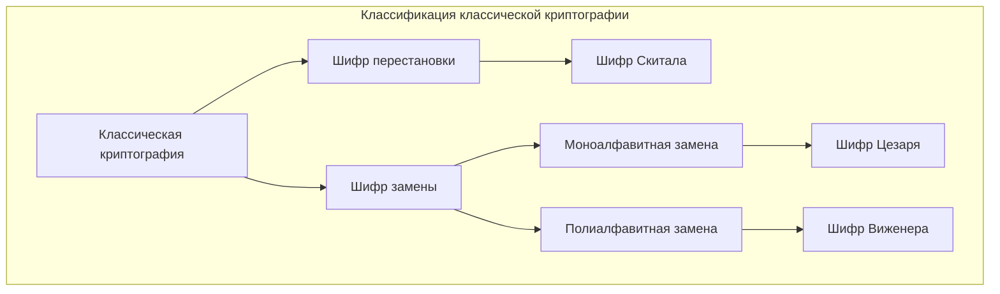
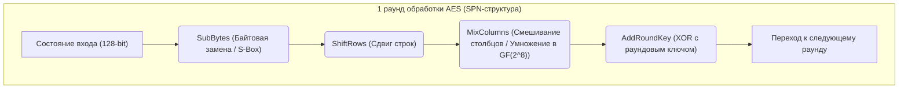
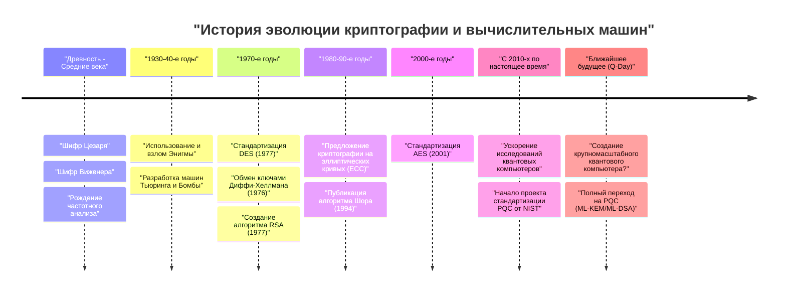

# 1. Введение: Что такое криптография?

Криптография (Cryptography) — это технология сохранения конфиденциальности информации, которая развивалась вместе с историей человечества. От передачи секретных приказов на древних войнах до защиты данных кредитных карт в современном интернете, цель криптографии остается неизменной: "Сделать так, чтобы только предполагаемый получатель мог понять информацию, и чтобы третья сторона не смогла ее расшифровать".

В современной информационной безопасности криптография играет важную роль, не ограничиваясь простой "секретностью информации (Конфиденциальность: Confidentiality)", но и обеспечивая "целостность (Integrity)", "аутентификацию (Authentication)" и "неотрекаемость (Non-repudiation)" данных.

В этой статье мы подробно рассмотрим историю развития криптографии с технологической и математической точек зрения, начиная с простых древних шифров замены, переходя к механическим шифрам, современной криптографии с симметричным и открытым ключом, и заканчивая эрой "постквантовой криптографии (PQC)", которая наступит с практическим применением квантовых компьютеров.

---

# 2. Эпоха классической криптографии: Замена и перестановка символов

Происхождение криптографии восходит к временам до нашей эры. Ранние шифры в основном состояли из двух подходов: "перестановка" и "замена".

## Шифр Скитала (Шифр перестановки)
"Скитала" (Scytale), использовавшаяся в древней Греции в Спарте в 5 веке до н.э., является одним из старейших криптографических устройств. Длинная полоска пергамента наматывалась на деревянную палочку определенной толщины, и на ней писалось сообщение поперек. Когда пергамент разматывался, буквы оказывались в бессмысленном порядке, но получатель с палочкой такой же толщины мог снова намотать пергамент и прочитать исходное сообщение.

## Шифр Цезаря (Шифр простой замены)
Шифр Цезаря — это шифр, который, как считается, использовал Юлий Цезарь, герой Древнего Рима в 1 веке до н.э. Это шифр моноалфавитной подстановки (Monoalphabetic substitution), который сдвигает алфавит на фиксированное количество позиций (обычно на 3 буквы).

Математически, если рассматривать буквы как числа от $0$ до $25$, а величину сдвига как $K$, преобразование исходного текста $P$ в зашифрованный текст $C$ выражается следующим уравнением по модулю:

$$C \equiv P + K \pmod{26}$$

Расшифровка выполняется обратной операцией:

$$P \equiv C - K \pmod{26}$$

```python
# Пример простой реализации шифра Цезаря на Python
def caesar_cipher(text, shift, mode="encrypt"):
    result = ""
    if mode == "decrypt":
        shift = -shift
    
    for char in text:
        if char.isalpha():
            base = ord('A') if char.isupper() else ord('a')
            # Вычисление сдвига
            result += chr((ord(char) - base + shift) % 26 + base)
        else:
            result += char
    return result

# Пример выполнения
plaintext = "HELLO WORLD"
ciphertext = caesar_cipher(plaintext, 3, "encrypt")
print(f"Зашифрованный текст: {ciphertext}") # KHOOR ZRUOG
```

## Частотный анализ и шифр Виженера
Шифры моноалфавитной подстановки стали легко взламываться с помощью "частотного анализа" (Frequency Analysis), изобретенного арабским ученым Аль-Кинди в 9 веке. Он использует статистические особенности языка, например, то, что в английском языке буквы "E" и "T" встречаются чаще всего.

Чтобы противостоять этому, в 16 веке был изобретен "шифр Виженера" (Vigenère cipher). Это полиалфавитный шифр замены (Polyalphabetic substitution), который циклически переключает несколько сдвигов (ключей), и около 300 лет его называли "неразрешимым шифром" (Le Chiffre Indéchiffrable).

Математически $i$-я буква исходного текста $P_i$ и $i$-я буква повторяющегося ключа $K_i$ шифруются следующим образом:

$$C_i \equiv P_i + K_i \pmod{26}$$

Однако в 19 веке Чарльз Бэббидж и Фридрих Касиски открыли "метод Касиски" (Kasiski examination), который позволял определить длину ключа по повторяющимся паттернам в зашифрованном тексте, и шифр был взломан.



---

# 3. Механическая криптография и мировые войны: Энигма и ее расшифровка

В начале 20 века средства связи перешли от писем к телеграфу и радио, что потребовало увеличения скорости и сложности шифрования. В это время появилась "механическая криптография", использующая комбинацию роторов (вращающихся дисков).

## Угроза Энигмы (Enigma)
"Энигма", использовавшаяся нацистской Германией во время Второй мировой войны, является самой известной шифровальной машиной в истории криптографии. Энигма состояла из нескольких роторов (обычно 3-4), коммутационной панели (Steckerbrett), меняющей проводку букв, и рефлектора (отражающего ротора).

Каждый раз при вводе буквы с клавиатуры ротор вращался, поэтому даже при последовательном вводе одной и той же буквы выводились разные зашифрованные символы (высшая форма полиалфавитного шифра). Пространство ключей (комбинаций настроек) составляло около $1.58 \times 10^{19}$ вариантов (около 15,8 квинтиллионов), и считалось, что взломать ее полным перебором при технологиях того времени было невозможно.

## Алан Тьюринг и "Бомба" (Bombe)
Вызов этой неприступной Энигме бросила команда криптоаналитиков из Блетчли-парка в Великобритании, опираясь на ранние результаты польского математика Мариана Реевского и его коллег.

В частности, Алан Тьюринг (Alan Turing) использовал предположения об исходном тексте, соответствующем части зашифрованного текста (криб: Crib), и разработал электромеханическую машину для расшифровки, названную "Бомба" (Bombe). "Бомба" быстро обнаруживала логические противоречия и последовательно исключала невозможные настройки роторов, что позволило успешно расшифровать Энигму. Считается, что это великое достижение приблизило победу союзников на несколько лет.

---

# 4. Начало современной криптографии: Криптография с симметричным ключом (DES и AES)

После войны с появлением компьютеров шифрование претерпело радикальную смену парадигмы: от манипуляций с "символами" к операциям с "битами (0 и 1)".

## Клод Шеннон и теория информации
В 1949 году Клод Шеннон опубликовал работу "Теория связи в секретных системах", заложив математические основы современной криптографии. Он предложил "запутывание" (Confusion) и "рассеивание" (Diffusion) в качестве принципов безопасного проектирования шифров.
- **Запутывание (Confusion)**: Сделать взаимосвязь между ключом и зашифрованным текстом как можно более сложной. (Реализуется через замену / S-блоки)
- **Рассеивание (Diffusion)**: Сделать так, чтобы изменение одного бита исходного текста влияло на множество битов зашифрованного текста. (Реализуется через перестановку / перемешивание)

## DES (Data Encryption Standard)
В 1977 году Национальный институт стандартов и технологий США (NIST, тогда NBS) принял "DES", основанный на дизайне IBM, в качестве стандартного шифра.
DES использует архитектуру, называемую "Сеть Фейстеля" (Feistel Network), имеет размер блока 64 бита и длину ключа 56 бит. Это имело преимущество в реализации, так как алгоритмы шифрования и дешифрования имели почти одинаковую структуру.

Однако по мере роста вычислительных мощностей компьютеров стало ясно, что длины ключа в 56 бит (около $7.2 \times 10^{16}$ вариантов) недостаточно. В 1998 году Electronic Frontier Foundation (EFF) разработал специальную машину "Deep Crack", которая смогла взломать DES за несколько дней.

## AES (Advanced Encryption Standard)
В качестве нового стандарта, пришедшего на смену DES, в 2001 году был принят "AES". Был выбран алгоритм "Rijndael", разработанный бельгийскими криптографами по итогам открытого конкурса.

AES использует не Сеть Фейстеля, а "SPN-структуру" (Substitution-Permutation Network) и применяет математические операции в поле Галуа (конечном поле) $GF(2^8)$. Длину ключа можно выбрать из 128, 192 и 256 бит, и сегодня он широко используется по всему миру как стандартный симметричный алгоритм шифрования.



---

# 5. Революция криптографии с открытым ключом: От Диффи-Хеллмана к RSA

Криптография с симметричным ключом имела существенный недостаток. Это "проблема распределения ключей" (Key Distribution Problem). Проблема заключалась в том, как безопасно разделить "общий ключ" с удаленным абонентом до начала зашифрованного общения. Эта проблема была решена в 1970-х годах с появлением "криптографии с открытым ключом".

## Обмен ключами Диффи-Хеллмана
В 1976 году Уитфилд Диффи и Мартин Хеллман опубликовали прорывную статью "Новые направления в криптографии". Они предложили метод безопасного совместного использования ключа даже по прослушиваемому каналу связи, используя математическую сложность "задачи дискретного логарифмирования" (Discrete Logarithm Problem).

1. Публикуются большое простое число $p$ и генератор $g$.
2. Алиса выбирает секретное значение $a$ и отправляет Бобу $A = g^a \pmod{p}$.
3. Боб выбирает секретное значение $b$ и отправляет Алисе $B = g^b \pmod{p}$.
4. Алиса вычисляет $K = B^a \pmod{p}$, а Боб вычисляет $K = A^b \pmod{p}$.
5. По закону степеней $K = (g^b)^a = (g^a)^b = g^{ab} \pmod{p}$, и они успешно разделяют один и тот же ключ $K$.

## Алгоритм RSA
В следующем 1977 году Рон Ривест, Ади Шамир и Леонард Адлеман изобрели "алгоритм RSA". Он основан на том свойстве, что "разложение огромного составного числа на простые множители является сложным".

**Математический механизм RSA:**
1. Выбираются два огромных простых числа $p$ и $q$, и вычисляется $n = p \times q$.
2. Вычисляется функция Эйлера $\phi(n) = (p-1)(q-1)$.
3. Выбирается целое число $e$ (открытый ключ), взаимно простое с $\phi(n)$.
4. Вычисляется целое число $d$ (закрытый ключ), такое что $e \times d \equiv 1 \pmod{\phi(n)}$.

Шифрование: Для исходного текста $M$ вычисляется $C \equiv M^e \pmod{n}$
Дешифрование: Для зашифрованного текста $C$ вычисляется $M \equiv C^d \pmod{n}$

```python
# Концептуальный код RSA на Python (не для практического использования)
def ext_euclid(a, b):
    # Вычисление модульного обратного с помощью расширенного алгоритма Евклида
    if b == 0: return 1, 0, a
    x, y, g = ext_euclid(b, a % b)
    return y, x - (a // b) * y, g

def rsa_example():
    # Пример с небольшими простыми числами
    p, q = 61, 53
    n = p * q
    phi = (p - 1) * (q - 1)
    
    e = 17 # Значение, взаимно простое с phi
    d, _, _ = ext_euclid(e, phi)
    if d < 0: d += phi
        
    print(f"Открытый ключ: (e={e}, n={n})")
    print(f"Закрытый ключ: (d={d}, n={n})")
    
    # Шифрование и расшифровка сообщения
    message = 65
    ciphertext = pow(message, e, n)
    decrypted = pow(ciphertext, d, n)
    
    print(f"Исходный текст: {message} -> Зашифрованный текст: {ciphertext} -> После расшифровки: {decrypted}")

rsa_example()
```

---

# 6. Расцвет криптографии на эллиптических кривых (ECC)

RSA — мощный алгоритм, но по мере роста производительности компьютеров возникла проблема увеличения вычислительных затрат из-за необходимости увеличивать длину ключа для поддержания безопасности (в настоящее время 2048 или 3072 бита).

Поэтому в 1985 году была предложена "криптография на эллиптических кривых" (Elliptic Curve Cryptography: ECC). Она использует сложение точек на эллиптической кривой (обычно вида $y^2 = x^3 + ax + b$) над конечным полем.

Известно, что задачу дискретного логарифмирования на эллиптической кривой (ECDLP) решить еще сложнее, чем задачу факторизации, и **ECC может обеспечить уровень безопасности, эквивалентный 3072 битам RSA, при длине ключа всего 256 бит**. Это позволило использовать быструю и безопасную зашифрованную связь (например, ECDSA и ECDH) даже в средах с ограниченными вычислительными ресурсами, таких как смартфоны и устройства IoT.

---

# 7. Угроза квантовых компьютеров и постквантовая криптография (PQC)

Казалось, что криптографические технологии непоколебимы, но алгоритм Шора (Shor's algorithm), опубликованный Питером Шором в 1994 году, вызвал огромный шок.

Квантовые компьютеры выполняют вычисления, используя такие свойства квантовой механики, как "суперпозиция" и "квантовая запутанность". Было математически доказано, что если выполнить алгоритм Шора на квантовом компьютере достаточной мощности, то задача факторизации и задача дискретного логарифмирования могут быть решены за "полиномиальное время". Это означает, что в день появления практичного квантового компьютера (Q-Day) вся используемая сегодня криптография с открытым ключом, такая как RSA и ECC, мгновенно будет сломана.

## Появление PQC (Post-Quantum Cryptography)
В ответ на эту беспрецедентную угрозу быстрыми темпами ведутся исследования в области "постквантовой криптографии" (PQC), основанной на новых математических задачах, которые трудно решить даже на квантовых компьютерах. NIST (Национальный институт стандартов и технологий США) в течение многих лет ведет процесс стандартизации PQC, и в основном рассматриваются следующие математические подходы.

### 1. Криптография на решетках (Lattice-based Cryptography)
В настоящее время это наиболее перспективный подход, который был принят в стандартах алгоритмов NIST (ML-KEM / Kyber, ML-DSA / Dilithium). Он основан на сложности задачи поиска определенной точки в многомерной "решетке" (Lattice) (например, задача поиска кратчайшего вектора: SVP) и задачи обучения с ошибками (Learning With Errors: LWE).

Концепция задачи LWE использует то свойство, что если намеренно добавить "небольшой шум (ошибку)" в систему линейных уравнений, найти решение становится чрезвычайно сложно.
Система уравнений: $\mathbf{A}\mathbf{s} + \mathbf{e} \equiv \mathbf{b} \pmod{q}$
($\mathbf{A}$ и $\mathbf{b}$ публичны, $\mathbf{s}$ — секретный ключ, $\mathbf{e}$ — небольшой шум)

```python
# Концептуальный псевдокод задачи LWE (для обучения)
import numpy as np

n = 256  # Размерность
q = 3329 # Модуль
m = 512  # Количество уравнений

# Секретный ключ s и небольшая ошибка e
s = np.random.randint(0, 5, size=n)
e = np.random.randint(-1, 2, size=m)

# Публичная матрица A и публичный вектор b
A = np.random.randint(0, q, size=(m, n))
b = (np.dot(A, s) + e) % q

# Считается, что восстановить s из A и b очень сложно даже с использованием квантовых компьютеров
```

### 2. Криптография на основе хешей (Hash-based Cryptography)
Это схема цифровой подписи, безопасность которой основывается исключительно на стойкости хеш-функций к коллизиям. Поскольку она не имеет математической структуры, она устойчива к квантовым атакам, но размер подписи, как правило, получается большим (например, SPHINCS+).

### 3. Криптография на основе кодов (Code-based Cryptography)
Метод шифрования, основанный на теории кодов, исправляющих ошибки. Известным примером является криптосистема Мак-Элиса, предложенная в 1978 году. Она имеет долгую историю и признанную надежность, но ее недостатком является очень большой размер открытого ключа (который может достигать нескольких мегабайт).



---

# 8. Заключение: Бесконечная битва щита и меча

История криптографии — это история бесконечной борьбы между изобретением новых методов шифрования (щит) и новых методов взлома (меч).

Шифр Цезаря пал от частотного анализа, а непобедимая Энигма пала перед гениальным умом Тьюринга и силой машин. И теперь даже мощные криптосистемы, такие как RSA и ECC, которые поддерживают основу современного интернет-общества, находятся под угрозой нового "меча" — квантового компьютера.

Однако человечество уже смотрит в будущее и готовит новый "щит" — постквантовую криптографию (PQC). Сегодня обеспечение перехода от существующей криптографии с открытым ключом к PQC (обеспечение криптографической гибкости - Crypto Agility) является насущной задачей для IT-инфраструктуры во всем мире.

Криптография — это не просто сложная математическая головоломка, это сильнейший барьер для защиты нашей конфиденциальности, нашего имущества и самой социальной инфраструктуры.
