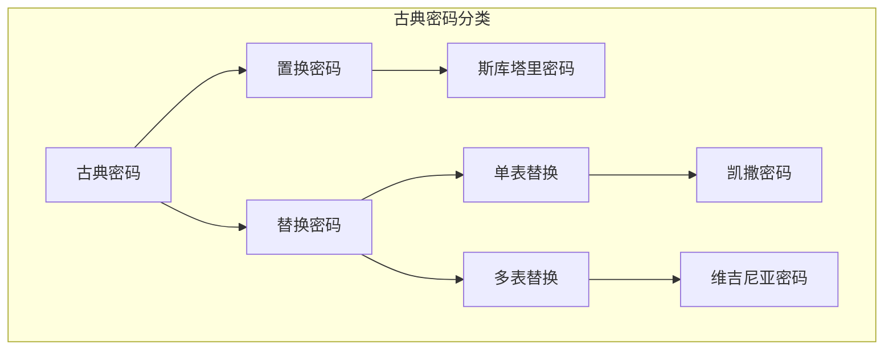
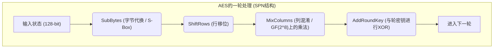
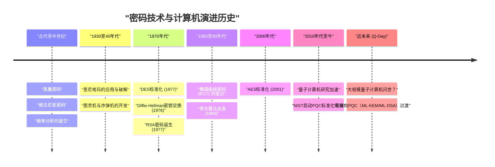

# 1. 引言：什么是密码技术？

密码技术（Cryptography）是保持信息机密性的技术，伴随着人类历史不断演进。从古代战争中秘密指令的传递，到现代互联网中信用卡信息的保护，密码的目的始终如一，即“让预期的接收者能够理解信息，而让第三方无法解读”。

在现代信息安全中，密码技术不仅仅局限于“信息的隐藏（机密性：Confidentiality）”，还承担着保障数据“完整性（Integrity）”、“认证（Authentication）”和“不可否认性（Non-repudiation）”等重要作用。

本文将从古代简单的替换密码开始，涵盖机械密码、现代对称密钥与公钥密码，直到因量子计算机实用化而到来的“抗量子密码（PQC）”时代，从技术和数学的角度，为您详细梳理密码技术演进的历史。

---

# 2. 古典密码时代：字符的替换与重排

密码的起源可以追溯到公元前。早期的密码主要由“置换（重排）”和“替换（代换）”两种方法构成。

## 斯库塔里密码（置换密码）
公元前5世纪，古希腊斯巴达使用的“斯库塔里（Scytale）”是最古老的密码工具之一。它将一条细长的羊皮纸缠绕在特定粗细的木棒上，然后横向写下信息。解下羊皮纸后，字符的排列顺序会变得毫无意义，但拥有相同粗细木棒的接收者重新缠上羊皮纸，就能读出原始信息。

## 凯撒密码（单表替换密码）
公元前1世纪，相传古罗马英雄朱利叶斯·凯撒使用的是“凯撒密码”。这是一种将字母表平移特定位数（通常为3个字符）的单表替换密码（Monoalphabetic substitution）。

从数学角度来看，若将字符视为 $0$ 到 $25$ 的数值，平移位数为 $K$，则从明文 $P$ 到密文 $C$ 的转换可以用以下同余式表示：

$$C \equiv P + K \pmod{26}$$

解密则进行逆操作：

$$P \equiv C - K \pmod{26}$$

```python
# 凯撒密码的简单Python实现示例
def caesar_cipher(text, shift, mode="encrypt"):
    result = ""
    if mode == "decrypt":
        shift = -shift
    
    for char in text:
        if char.isalpha():
            base = ord('A') if char.isupper() else ord('a')
            # 偏移计算
            result += chr((ord(char) - base + shift) % 26 + base)
        else:
            result += char
    return result

# 运行示例
plaintext = "HELLO WORLD"
ciphertext = caesar_cipher(plaintext, 3, "encrypt")
print(f"暗号文: {ciphertext}") # KHOOR ZRUOG
```

## 频率分析与维吉尼亚密码
单表替换密码很快就被9世纪阿拉伯学者阿尔·金迪提出的“频率分析（Frequency Analysis）”轻易破解。这是利用了语言的统计特征，例如在英语中“E”和“T”出现频率极高。

为了对抗这种破解方法，16世纪诞生了“维吉尼亚密码（Vigenère cipher）”。这是一种周期性切换使用多个偏移量（密钥）的多表替换密码（Polyalphabetic substitution），在长达约300年的时间里被称为“不可破译的密码（Le Chiffre Indéchiffrable）”。

在数学上，利用明文的第 $i$ 个字符 $P_i$ 和循环密钥的第 $i$ 个字符 $K_i$，按如下方式进行加密：

$$C_i \equiv P_i + K_i \pmod{26}$$

进入19世纪，查尔斯·巴贝奇和弗里德里希·卡西斯基发现了“卡西斯基测试（Kasiski examination）”，通过密文中重复出现的模式来推算密钥长度，从而使得该密码也被破解。



---

# 3. 机械密码与世界大战：恩尼格玛及其破解

进入20世纪，通信手段从信件演变为电报和无线电，对加密的速度和复杂性提出了更高要求。此时，由多个转子（旋转盘）组合而成的“机械密码”应运而生。

## 恩尼格玛（Enigma）的威胁
二战期间，纳粹德国使用的“恩尼格玛（Enigma）”是密码史上最著名的密码机。恩尼格玛由多个转子（通常为3到4个）、用于互换字符接线的接线板（Steckerbrett）以及反射器（反转转子）组成。

每次在键盘上敲击一个字符，转子都会旋转，因此即使连续输入相同的字符，也会输出不同的密码字符（多表替换密码的极致）。其密钥空间（设置组合）高达约 $1.58 \times 10^{19}$ 种，以当时的技术水平，暴力破解被认为是不可能的。

## 艾伦·图灵与“炸弹机（Bombe）”
向这台坚不可摧的恩尼格玛发起挑战的，是继承了波兰数学家马里安·雷耶夫斯基等人早期成果的英国布莱切利园密码破译团队。

特别是艾伦·图灵（Alan Turing），他利用对应于部分密文的明文推测（Crib），开发出了机电式破译机“炸弹机（Bombe）”。炸弹机能够高速检测逻辑矛盾，接连排除不可能的转子设置，最终成功破解了恩尼格玛。据称，这一伟业使盟军的胜利提前了数年。

---

# 4. 现代密码的开端：对称密钥密码（DES与AES）

战后，随着计算机的出现，密码实现了从“字符”操作到“比特（0和1）”操作的剧烈范式转变。

## 克劳德·香农与信息论
1949年，克劳德·香农发表了论文《保密系统的通信理论》，奠定了现代密码学的数学基础。他提出了安全密码设计的两大原则：“混淆（Confusion）”与“扩散（Diffusion）”。
- **混淆（Confusion）**: 尽可能使密钥与密文之间的关系复杂化。（通过替换或S盒实现）
- **扩散（Diffusion）**: 使明文的1比特变化能够影响密文中的多个比特。（通过置换或重排实现）

## DES (数据加密标准)
1977年，美国国家标准技术研究所（NIST，当时称为NBS）将基于IBM设计的“DES”制定为标准密码。
DES采用了被称为“费斯妥网络（Feistel Network）”的架构，具有64比特的分组长度和56比特的密钥长度。其在实现上的一大优势是，加密和解密算法的结构几乎完全相同。

然而，随着计算机计算能力的提升，56比特的密钥长度（约 $7.2 \times 10^{16}$ 种组合）已明显不足。1998年，电子前哨基金会（EFF）开发了专用机器“Deep Crack”，仅用数天时间便成功破解了DES。

## AES (高级加密标准)
作为替代DES的新标准，2001年“AES”应运而生。它采用了通过公开征集选拔出的，由比利时密码学家设计的“Rijndael”算法。

AES没有采用费斯妥网络，而是采用了“SPN结构（Substitution-Permutation Network）”，并利用了伽罗瓦域（有限域） $GF(2^8)$ 上的数学运算。其密钥长度可选择128、192或256比特，至今仍在全球范围内被广泛用作标准的对称密钥密码。



---

# 5. 公钥密码的革命：从Diffie-Hellman到RSA

对称密钥密码存在一个致命的弱点，那就是“密钥分配问题（Key Distribution Problem）”。即在开始加密通信之前，如何与远方的通信对象安全地共享“对称密钥”。解决这一问题的，正是诞生于20世纪70年代的“公钥密码”。

## Diffie-Hellman密钥交换
1976年，惠特菲尔德·迪菲和马丁·赫尔曼发表了具有划时代意义的论文《密码学的新方向》。他们利用“离散对数问题（Discrete Logarithm Problem）”的数学难题，提出了一种即使在通信链路被窃听的情况下也能安全共享密钥的方法。

1. 公开一个大素数 $p$ 和生成元 $g$。
2. Alice选择一个秘密值 $a$，计算 $A = g^a \pmod{p}$ 并发送给Bob。
3. Bob选择一个秘密值 $b$，计算 $B = g^b \pmod{p}$ 并发送给Alice。
4. Alice计算 $K = B^a \pmod{p}$，Bob计算 $K = A^b \pmod{p}$。
5. 根据指数法则，$K = (g^b)^a = (g^a)^b = g^{ab} \pmod{p}$，两人完美地共享了相同的密钥 $K$。

## RSA密码
次年即1977年，罗纳德·李维斯特、阿迪·萨莫尔和伦纳德·阿德曼三人共同发明了“RSA密码”。它是基于“对巨大的合数进行素数分解极其困难”这一性质。

**RSA的数学机制：**
1. 选择两个巨大的素数 $p$ 和 $q$，并计算 $n = p \times q$。
2. 计算欧拉函数 $\phi(n) = (p-1)(q-1)$。
3. 选择一个与 $\phi(n)$ 互素的整数 $e$（公钥）。
4. 计算满足 $e \times d \equiv 1 \pmod{\phi(n)}$ 的整数 $d$（私钥）。

加密：对于明文 $M$，计算 $C \equiv M^e \pmod{n}$
解密：对于密文 $C$，计算 $M \equiv C^d \pmod{n}$

```python
# 演示RSA密码概念的Python代码（不可用于实际应用）
def ext_euclid(a, b):
    # 使用扩展欧几里得算法计算模逆元
    if b == 0: return 1, 0, a
    x, y, g = ext_euclid(b, a % b)
    return y, x - (a // b) * y, g

def rsa_example():
    # 使用小素数的示例
    p, q = 61, 53
    n = p * q
    phi = (p - 1) * (q - 1)
    
    e = 17 # 与phi互素的值
    d, _, _ = ext_euclid(e, phi)
    if d < 0: d += phi
        
    print(f"公开密钥 (公钥): (e={e}, n={n})")
    print(f"秘密密钥 (私钥): (d={d}, n={n})")
    
    # 消息的加密与解密
    message = 65
    ciphertext = pow(message, e, n)
    decrypted = pow(ciphertext, d, n)
    
    print(f"明文: {message} -> 密文: {ciphertext} -> 解密后: {decrypted}")

rsa_example()
```

---

# 6. 椭圆曲线密码（ECC）的崛起

RSA密码虽然强大，但随着计算机性能的提高，为了保持安全性，必须增加密钥长度（目前通常为2048或3072比特），这就导致了计算成本激增的问题。

因此，1985年有人提出了“椭圆曲线密码（Elliptic Curve Cryptography: ECC）”。它利用了有限域上椭圆曲线（通常形式为 $y^2 = x^3 + ax + b$）上点的加法运算。

众所周知，椭圆曲线上的离散对数问题（ECDLP）比素数分解问题更难求解。**利用ECC，仅需256比特的密钥长度就能实现与3072比特RSA相当的安全性**。这也使得在智能手机或物联网（IoT）设备等计算资源有限的环境下，仍能实现高速且安全的加密通信（如ECDSA或ECDH等）。

---

# 7. 量子计算机的威胁与抗量子密码（PQC）

密码技术曾经显得坚不可摧，但1994年彼得·秀尔（Peter Shor）发表的“秀尔算法”却带来了巨大冲击。

量子计算机利用量子力学中“叠加态”与“量子纠缠”的特性进行计算。数学上已经证明，若在性能足够强大的量子计算机上运行秀尔算法，就能在“多项式时间”内解决素数分解问题和离散对数问题。这意味着，在实用的量子计算机问世之日（Q-Day），目前广泛使用的RSA、ECC等公钥密码将会在瞬间被攻破。

## PQC（后量子密码/抗量子密码）的登场
为了应对这一前所未有的威胁，基于量子计算机也难以破解的新数学难题的“抗量子密码（PQC）”研究正在紧锣密鼓地进行。NIST（美国国家标准技术研究所）多年来一直在推进PQC的标准化进程，目前主要有以下几种被寄予厚望的数学方法：

### 1. 基于格的密码（Lattice-based Cryptography）
这是目前最有希望的方法，并已被NIST的标准化算法（ML-KEM / Kyber, ML-DSA / Dilithium）所采用。其基于在多维空间的“格（Lattice）”中寻找特定点的问题（如最短向量问题：SVP）以及LWE（Learning With Errors：容错学习）问题的困难性。

LWE问题的概念是，在联立一次方程组中故意加入“微小的噪声（误差）”，利用这会立刻导致难以求解的性质。
方程组: $\mathbf{A}\mathbf{s} + \mathbf{e} \equiv \mathbf{b} \pmod{q}$
（$\mathbf{A}$ 和 $\mathbf{b}$ 为公开信息，$\mathbf{s}$ 为私钥，$\mathbf{e}$ 为微小的噪声）

```python
# LWE问题的概念性伪代码（仅供学习参考）
import numpy as np

n = 256  # 维度
q = 3329 # 模数
m = 512  # 方程数量

# 私钥 s 和微小误差 e
s = np.random.randint(0, 5, size=n)
e = np.random.randint(-1, 2, size=m)

# 公开矩阵 A 和公开向量 b
A = np.random.randint(0, q, size=(m, n))
b = (np.dot(A, s) + e) % q

# 即使使用量子计算机，从 A 和 b 还原 s 也被认为极其困难
```

### 2. 基于哈希的密码（Hash-based Cryptography）
这是一种仅将安全性建立在哈希函数抗碰撞性之上的数字签名方案。由于不具备数学结构，因此能有效抵御量子攻击，但其签名尺寸通常偏大（如SPHINCS+等）。

### 3. 基于编码的密码（Code-based Cryptography）
这是基于纠错码理论的加密方法。例如1978年提出的McEliece密码就颇为著名，其历史悠久且安全性备受肯定，但也存在公钥体积过大（甚至可达数兆字节）的问题。



---

# 8. 结论：永无止境的矛与盾之争

密码技术的历史，就是一部发明新加密方式（盾）与破解它的新解密手段（矛）之间永无止境的斗争史。

凯撒密码败给了频率分析，曾号称无敌的恩尼格玛则败给了图灵的天才头脑与机器的力量。而如今，支撑现代互联网社会根基的RSA和ECC等强力密码，也面临着量子计算机这一全新“矛”的威胁。

然而，人类已经着眼于更遥远的未来，正在准备抗量子密码（PQC）这一面崭新的“盾”。目前，对于全球的IT基础设施而言，从现有的公钥密码向PQC过渡的准备工作（确保密码敏捷性，Crypto Agility）已成为当务之急。

密码技术不仅仅是深奥晦涩的数学难题，它更是保护我们的隐私、财产乃至整个社会基础设施的最强防线。
