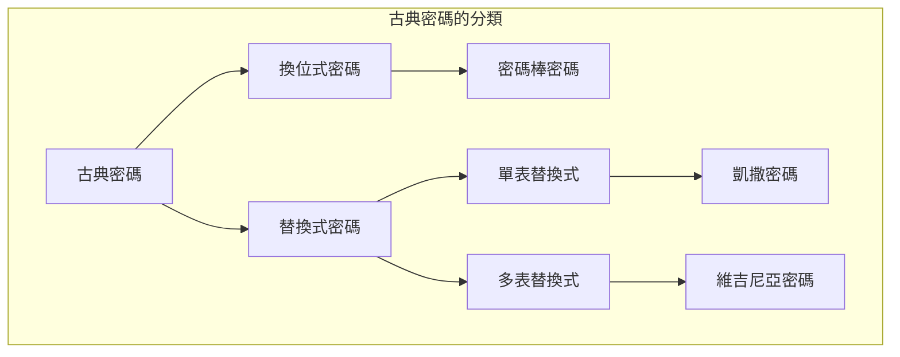
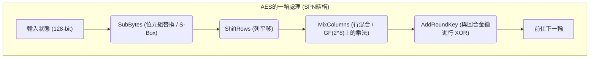
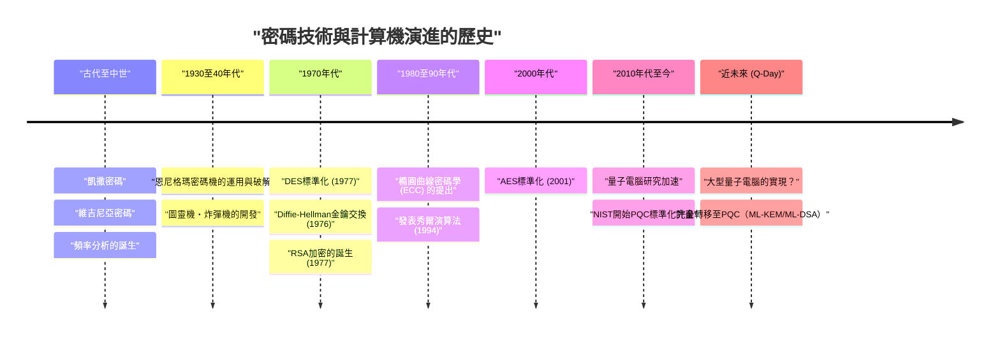

# 1. 簡介：什麼是密碼學？

密碼學（Cryptography）是為了保持資訊機密性的一門技術，它伴隨著人類歷史不斷演進。從古代戰爭中傳遞秘密指令，到現代網際網路保護信用卡資訊，密碼學的目的始終如一：即「確保只有預期的接收者能理解資訊，而第三方無法解密」。

在現代資訊安全中，密碼學不僅僅是「隱藏資訊（機密性: Confidentiality）」，它還擔負著確保資料「完整性（Integrity）」、「身分鑑別（Authentication）」與「不可否認性（Non-repudiation）」等重要角色。

本文將從古代簡單的替換式密碼開始，歷經機械式密碼、現代的對稱金鑰與公開金鑰加密，一直到量子電腦實用化所帶來的「後量子密碼學（PQC）」時代，從技術與數學的角度詳細剖析密碼技術演進的歷史。

---

# 2. 古典密碼時代：文字的替換與重排

密碼學的起源可追溯至西元前。早期的密碼主要由「換位（重排）」與「替換（代換）」兩種方法構成。

## 密碼棒密碼（換位式密碼）
西元前 5 世紀古希臘斯巴達所使用的「密碼棒（Scytale）」是最古老的密碼工具之一。將細長的羊皮紙纏繞在特定粗細的木棒上，並在上面橫向寫下訊息。解開羊皮紙後，文字會排列成毫無意義的順序，但擁有相同粗細木棒的接收者只需再次纏繞羊皮紙，便能讀出原始訊息。

## 凱撒密碼（單表替換式密碼）
西元前 1 世紀，相傳古羅馬英雄朱利葉斯・凱撒所使用的便是「凱撒密碼」。這是一種將字母平移固定數量（通常為 3 個字母）的單表替換式密碼（Monoalphabetic substitution）。

在數學上，若將字母視為 $0$ 到 $25$ 的數字，並將平移數量設為 $K$，則從明文 $P$ 轉換為密文 $C$ 的過程可由以下同餘式表示：

$$C \equiv P + K \pmod{26}$$

解密則是進行反向操作：

$$P \equiv C - K \pmod{26}$$

```python
# 凱撒密碼的簡單 Python 實作範例
def caesar_cipher(text, shift, mode="encrypt"):
    result = ""
    if mode == "decrypt":
        shift = -shift
    
    for char in text:
        if char.isalpha():
            base = ord('A') if char.isupper() else ord('a')
            # 計算平移
            result += chr((ord(char) - base + shift) % 26 + base)
        else:
            result += char
    return result

# 執行範例
plaintext = "HELLO WORLD"
ciphertext = caesar_cipher(plaintext, 3, "encrypt")
print(f"密文: {ciphertext}") # KHOOR ZRUOG
```

## 頻率分析與維吉尼亞密碼
單表替換式密碼後來被 9 世紀阿拉伯學者阿爾・金迪發明的「頻率分析（Frequency Analysis）」輕易破解。這是利用了語言的統計特性，例如在英文中「E」和「T」出現頻率極高。

為了對抗頻率分析，16 世紀誕生了「維吉尼亞密碼（Vigenère cipher）」。這是一種週期性切換多個平移（金鑰）的多表替換式密碼（Polyalphabetic substitution），大約有 300 年的時間被稱為「無法破解的密碼（Le Chiffre Indéchiffrable）」。

在數學上，使用明文的第 $i$ 個字母 $P_i$ 以及重複金鑰的第 $i$ 個字母 $K_i$，以如下方式進行加密：

$$C_i \equiv P_i + K_i \pmod{26}$$

然而進入 19 世紀，查爾斯・巴貝奇與弗里德里希・卡西斯基發明了「卡西斯基試驗（Kasiski examination）」，藉由尋找密文中重複出現的模式來推算出金鑰長度，維吉尼亞密碼也因此被破解。



---

# 3. 機械式密碼與世界大戰：恩尼格瑪密碼機與其破解

進入 20 世紀後，通訊手段從書信轉變為電報與無線電，對加密的速度與複雜度也產生了更高的需求。這時結合了轉子（旋轉盤）的「機械式密碼」便應運而生。

## 恩尼格瑪密碼機（Enigma）的威脅
第二次世界大戰期間，納粹德國使用的「恩尼格瑪密碼機（Enigma）」是密碼學史上最著名的密碼機。恩尼格瑪密碼機由多個轉子（通常為 3 到 4 個）、用來交換字母線路的接線板（Steckerbrett），以及反射器（反轉轉子）所構成。

由於在鍵盤上每敲擊一個字母，轉子就會旋轉，因此即使連續敲擊相同的字母，也會輸出不同的密碼字母（多表替換式密碼的極致）。其金鑰空間（設定組合）高達約 $1.58 \times 10^{19}$ 種（約 1580 京），以當時的技術被認為不可能透過暴力破解法解密。

## 艾倫・圖靈與「炸彈機（Bombe）」
挑戰這台堅不可摧的恩尼格瑪密碼機的，是繼承了波蘭數學家馬里安・雷耶夫斯基等人初期成果的英國布萊切利園密碼破解團隊。

尤其是艾倫・圖靈（Alan Turing），他利用對應部分密文的明文猜測（Crib），開發出了機電式的破解機「炸彈機（Bombe）」。炸彈機藉由高速檢測邏輯矛盾，不斷排除不可能的轉子設定，成功破解了恩尼格瑪密碼機。這項偉大的成就據說讓同盟國的勝利提早了幾年。

---

# 4. 現代密碼學的開端：對稱金鑰加密（DES 與 AES）

戰後，隨著電腦的出現，密碼學從「文字」的操作經歷了戲劇性的典範轉移，變成了「位元（0 與 1）」的操作。

## 克勞德・夏農與資訊理論
1949 年，克勞德・夏農發表了論文《保密系統的通訊理論》，奠定了現代密碼學的數學基礎。他提出了安全密碼設計的兩大原則：「混淆（Confusion）」與「擴散（Diffusion）」。
- **混淆（Confusion）**: 讓金鑰與密文之間的關係盡可能變得複雜。（透過替換、S盒來實現）
- **擴散（Diffusion）**: 讓明文的 1 個位元的改變能夠影響密文中的許多位元。（透過換位、重排來實現）

## DES (Data Encryption Standard)
1977 年，美國國家標準暨技術研究院（NIST，當時稱 NBS）制定了以 IBM 設計為基礎的「DES」作為標準密碼。
DES 採用了稱為「費斯妥網路（Feistel Network）」的架構，具備 64 位元的區塊長度與 56 位元的金鑰長度。它在實作上的優勢在於加密與解密的演算法結構幾乎完全相同。

然而，隨著電腦運算能力的提升，56 位元的金鑰長度（約 $7.2 \times 10^{16}$ 種組合）被證實是不夠的。1998 年，電子前哨基金會（EFF）開發了專用機器「Deep Crack」，僅在幾天內就成功破解了 DES。

## AES (Advanced Encryption Standard)
為了取代 DES 成為新的標準，2001 年制定了「AES」。它採用了透過公開徵選選出的比利時密碼學家設計的「Rijndael」演算法。

AES 並非採用費斯妥結構，而是採用了「SPN 結構（Substitution-Permutation Network）」，並利用了伽羅瓦體（有限體） $GF(2^8)$ 上的數學運算。金鑰長度可選擇 128、192、256 位元，至今仍是全世界廣泛使用的標準對稱金鑰加密演算法。



---

# 5. 公開金鑰加密的革命：從 Diffie-Hellman 到 RSA

對稱金鑰加密存在一個致命的弱點，那就是「金鑰配送問題（Key Distribution Problem）」。也就是在開始加密通訊之前，如何與遠方的對象安全地共享「對稱金鑰」的問題。解決這個問題的正是 1970 年代誕生的「公開金鑰加密」。

## Diffie-Hellman 金鑰交換
1976 年，惠特菲爾德・迪菲與馬丁・赫爾曼發表了劃時代的論文《密碼學的新方向》。他們利用了「離散對數問題（Discrete Logarithm Problem）」的數學困難性，提出了一種即使在被竊聽的通訊路徑上，也能安全共享金鑰的方法。

1. 公開一個大質數 $p$ 與生成元 $g$。
2. Alice 選擇一個秘密值 $a$，並將 $A = g^a \pmod{p}$ 傳送給 Bob。
3. Bob 選擇一個秘密值 $b$，並將 $B = g^b \pmod{p}$ 傳送給 Alice。
4. Alice 計算 $K = B^a \pmod{p}$，Bob 計算 $K = A^b \pmod{p}$。
5. 根據指數定律 $K = (g^b)^a = (g^a)^b = g^{ab} \pmod{p}$，兩人完美地共享了相同的金鑰 $K$。

## RSA 加密
隔年 1977 年，由羅納德・李維斯特、阿迪・薩莫爾和倫納德・阿德曼三人發明了「RSA 加密」。這是基於「巨大的合成數的質因數分解十分困難」的特性。

**RSA 的數學原理:**
1. 選擇兩個巨大的質數 $p$ 與 $q$，並計算 $n = p \times q$。
2. 計算尤拉商數函數 $\phi(n) = (p-1)(q-1)$。
3. 選擇與 $\phi(n)$ 互質的整數 $e$（公開金鑰）。
4. 計算能滿足 $e \times d \equiv 1 \pmod{\phi(n)}$ 的整數 $d$（私有金鑰）。

加密: 對於明文 $M$，計算 $C \equiv M^e \pmod{n}$
解密: 對於密文 $C$，計算 $M \equiv C^d \pmod{n}$

```python
# 示範 RSA 加密概念的 Python 程式碼（不適用於實際用途）
def ext_euclid(a, b):
    # 使用擴展歐幾里得演算法計算模反元素
    if b == 0: return 1, 0, a
    x, y, g = ext_euclid(b, a % b)
    return y, x - (a // b) * y, g

def rsa_example():
    # 使用小質數的範例
    p, q = 61, 53
    n = p * q
    phi = (p - 1) * (q - 1)
    
    e = 17 # 與 phi 互質的值
    d, _, _ = ext_euclid(e, phi)
    if d < 0: d += phi
        
    print(f"公開金鑰: (e={e}, n={n})")
    print(f"私有金鑰: (d={d}, n={n})")
    
    # 訊息的加密與解密
    message = 65
    ciphertext = pow(message, e, n)
    decrypted = pow(ciphertext, d, n)
    
    print(f"明文: {message} -> 密文: {ciphertext} -> 解密後: {decrypted}")

rsa_example()
```

---

# 6. 橢圓曲線密碼學（ECC）的崛起

RSA 加密雖然強大，但隨著電腦效能的提升，為了維持安全性必須加長金鑰長度（目前為 2048 位元或 3072 位元），這導致了運算成本增加的問題。

因此在 1985 年提出了「橢圓曲線密碼學（Elliptic Curve Cryptography: ECC）」。這利用了有限體上橢圓曲線（通常為 $y^2 = x^3 + ax + b$ 形式）的點加法。

橢圓曲線上的離散對數問題（ECDLP）已知比質因數分解問題更難求解，**ECC 只要 256 位元的金鑰長度，就能實現與 RSA 3072 位元同等的安全性**。這使得在智慧型手機或 IoT 裝置等運算資源有限的環境中，也能進行高速且安全的加密通訊（如 ECDSA 或 ECDH 等）。

---

# 7. 量子電腦的威脅與後量子密碼學（PQC）

密碼技術看似堅若磐石，但 1994 年由彼得・秀爾（Peter Shor）發表的「秀爾演算法」卻帶來了巨大的衝擊。

量子電腦利用量子力學的「疊加」與「量子纏結」特性來進行運算。在數學上已經證明，如果在效能足夠的量子電腦上執行秀爾演算法，質因數分解問題與離散對數問題就能在「多項式時間」內被解開。也就是說，在實用的量子電腦問世的那一天（Q-Day），現在所使用的 RSA 或 ECC 等公開金鑰加密都將在瞬間崩潰。

## PQC（後量子密碼學）的登場
為防範這個前所未有的威脅，基於連量子電腦也難以破解的新數學問題的「後量子密碼學（PQC）」研究正快馬加鞭地進行著。NIST（美國國家標準暨技術研究院）長年來持續推動 PQC 的標準化流程，主要以下列數學方法最具潛力。

### 1. 晶格密碼學（Lattice-based Cryptography）
這是目前最有潛力的方法，也被 NIST 的標準化演算法（ML-KEM / Kyber、ML-DSA / Dilithium）所採用。它基於在多維空間的「晶格（Lattice）」上尋找特定點的問題（如最短向量問題: SVP 等），以及 LWE（Learning With Errors: 錯誤學習）問題的困難性。

LWE 問題的概念利用了當我們在聯立一次方程式中刻意加入「小雜訊（誤差）」時，求解會瞬間變得極為困難的特性。
方程式系統: $\mathbf{A}\mathbf{s} + \mathbf{e} \equiv \mathbf{b} \pmod{q}$
（$\mathbf{A}$ 與 $\mathbf{b}$ 為公開，$\mathbf{s}$ 為私有金鑰，$\mathbf{e}$ 為極小的雜訊）

```python
# LWE 問題的概念性虛擬碼（學習用途）
import numpy as np

n = 256  # 維度
q = 3329 # 模數
m = 512  # 方程式的數量

# 私有金鑰 s 與小誤差 e
s = np.random.randint(0, 5, size=n)
e = np.random.randint(-1, 2, size=m)

# 公開矩陣 A 與公開向量 b
A = np.random.randint(0, q, size=(m, n))
b = (np.dot(A, s) + e) % q

# 即使使用量子電腦，要從 A 和 b 還原 s 也被認為是非常困難的
```

### 2. 雜湊基礎密碼學（Hash-based Cryptography）
這是一種僅以雜湊函數的抗碰撞性作為安全性基礎的數位簽章方案。由於不具備數學結構，因此能有效抵抗量子攻擊，但簽章大小往往較大（如 SPHINCS+ 等）。

### 3. 編碼基礎密碼學（Code-based Cryptography）
這是一種基於錯誤更正碼理論的加密方式。1978 年提出的 McEliece 加密等較為著名，歷史悠久且安全性備受肯定，但存在公開金鑰尺寸極大（有時高達數 MB）的課題。



---

# 8. 結論：無止盡的矛盾之爭

密碼技術的歷史，就是發明新加密方式（盾）與破解它的新解密手法（矛）之間無止盡的戰鬥歷史。

凱撒密碼敗給了頻率分析，號稱無敵的恩尼格瑪密碼機則敗給了圖靈的天才頭腦與機器的力量。而現在，支撐現代網際網路社會根基的 RSA 與 ECC 等強大密碼，也正暴露在量子電腦這個全新的「矛」的威脅之下。

然而，人類已經放眼未來的下一步，正在準備名為後量子密碼學（PQC）的全新「盾」。目前，在全世界的 IT 基礎設施中，確保從現有公開金鑰加密轉移至 PQC 的準備（確保密碼靈活性，Crypto Agility）已成為當務之急。

密碼技術不僅僅是艱澀難懂的數學謎題，它是為了保護我們的隱私、財產，乃至社會基礎設施本身的最強防壁。
