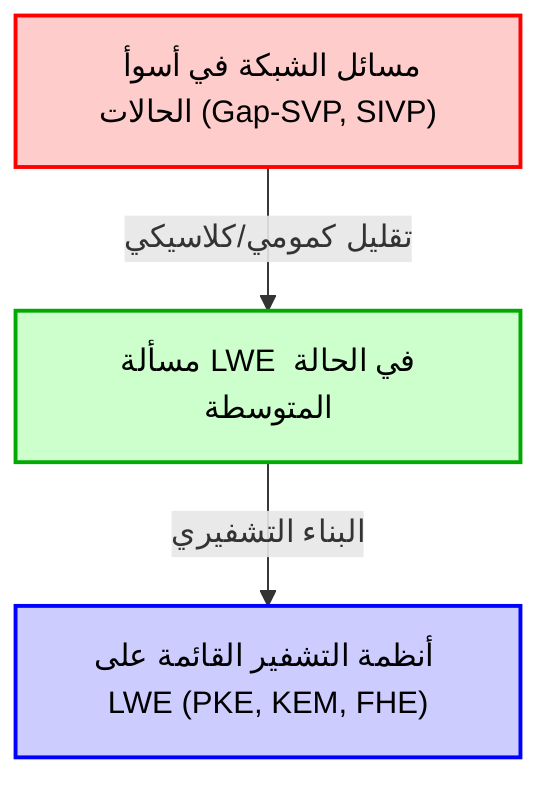
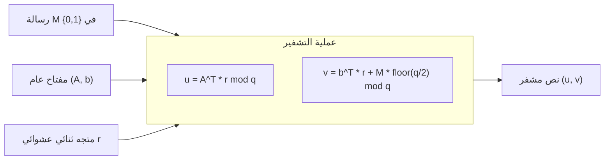
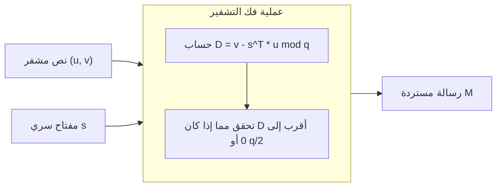

# 1. مقدمة: فجر التشفير ما بعد الكوانتوم (PQC) وصعود التشفير القائم على الشبكة

يتم دعم البنية التحتية الرقمية لمجتمعنا الحديث من خلال تقنيات تشفير المفتاح العام مثل تشفير RSA وتشفير المنحنى الإهليلجي (ECC). تعتمد هذه الأساليب التشفيرية في أمانها على صعوبة مسائل رياضية مثل "مسألة التحليل إلى عوامل أولية" و"مسألة اللوغاريتم المنفصل"، والتي يُعتقد أنه لا يمكن حلها بكفاءة (تتطلب وقتاً أسياً) بواسطة أجهزة الكمبيوتر الكلاسيكية التقليدية.

ومع ذلك، أحدثت "خوارزمية شور" (Shor's Algorithm) التي نشرها بيتر شور (Peter Shor) في عام 1994 صدمة في عالم التشفير. أثبتت هذه الخوارزمية رياضياً أنه عند تحقيق أجهزة كمبيوتر كمومية واسعة النطاق، سيكون من الممكن حل مسألة التحليل إلى عوامل أولية ومسألة اللوغاريتم المنفصل في وقت كثير الحدود. وهذا يعني أن تشفير المفتاح العام المستخدم على نطاق واسع حالياً سيصبح قابلاً لفك التشفير بالكامل في المستقبل.

لمواجهة "التهديد الكمومي" (Quantum Threat)، أصبح من الملح إجراء أبحاث حول طرق تشفير جديدة يصعب فك تشفيرها حتى باستخدام أجهزة الكمبيوتر الكمومية. يُطلق على هذا المجال اسم "التشفير ما بعد الكوانتوم" (Post-Quantum Cryptography: PQC) أو "التشفير المقاوم للحوسبة الكمومية".

هناك عدة مرشحين أقوياء في PQC. تشمل هذه التشفير القائم على التجزئة، والتشفير القائم على الكود، وتشفير متعدد الحدود متعدد المتغيرات، وتشفير التماثل الفائق. ومع ذلك، فإن التشفير الذي يحظى بأكبر قدر من الاهتمام حالياً ويحتل مركز الصدارة في عملية توحيد معايير PQC من قبل المعهد الوطني للمعايير والتكنولوجيا (NIST) هو "التشفير القائم على الشبكة" (Lattice-based cryptography). يتميز التشفير القائم على الشبكة بسرعات معالجة سريعة جداً للتشفير وفك التشفير مقارنة بالطرق الأخرى، كما يتميز بامتلاكه دليلاً أمنياً قوياً للغاية في نظرية التشفير، وهو تقليل "التعقيد في أسوأ الحالات" (Worst-case complexity) إلى "التعقيد في الحالة المتوسطة" (Average-case complexity).

في هذا المقال، سننطلق من التعريف الرياضي لـ "الشبكة" (Lattice) الذي يشكل أساس التشفير القائم على الشبكة، وسنشرح بتعمق المشاكل الصعبة على الشبكة مثل SVP (مسألة المتجه الأقصر) و CVP (مسألة المتجه الأقرب)، بالإضافة إلى "مسألة LWE" (التعلم مع الأخطاء - Learning With Errors) التي تعد قلب التشفير القائم على الشبكة الحديث، باستخدام المعادلات الرياضية والحدس الهندسي والأمثلة العددية المحددة.

# 2. التعريف الرياضي والحدس الهندسي للشبكة (Lattice)

## 2.1 الفضاء المتجهي والشبكة
في الرياضيات، تشير "الشبكة" (Lattice) إلى مجموعة من النقاط المنفصلة المرتبة بانتظام داخل فضاء متجهي حقيقي ذو $n$ بُعد $\mathbb{R}^n$. إنها تشبه الفضاء المتجهي (Vector Space) الذي ندرسه في الجبر الخطي، ولكن هناك فرق حاسم. في حين أن الفضاء المتجهي هو فضاء مستمر يتم التعبير عنه بتركيبة خطية ذات "معاملات حقيقية" لمتجهات الأساس، فإن الشبكة هي فضاء منفصل يتم التعبير عنه بتركيبة خطية ذات "معاملات صحيحة" لمتجهات الأساس.

دعونا نقدم تعريفاً رياضياً دقيقاً. نعتبر $n$ ($n \le m$) من المتجهات المستقلة خطياً $\mathbf{b}_1, \mathbf{b}_2, \dots, \mathbf{b}_n$ في فضاء متجهي حقيقي ذو $m$ بُعد $\mathbb{R}^m$. نضع المصفوفة التي تحتوي على هذه المتجهات كمتجهات عمودية كـ $B = [\mathbf{b}_1, \mathbf{b}_2, \dots, \mathbf{b}_n] \in \mathbb{R}^{m \times n}$. تُسمى هذه $B$ "أساس" (Basis) الشبكة.

الشبكة $\mathcal{L}(B)$ الناتجة عن هذا الأساس $B$ تُعرّف على النحو التالي:

$$
\mathcal{L}(B) = \left\{ \sum_{i=1}^{n} x_i \mathbf{b}_i \mathrel{\bigg|} x_i \in \mathbb{Z} \right\} = \{ B \mathbf{x} \mid \mathbf{x} \in \mathbb{Z}^n \}
$$

النقطة المهمة هنا هي أن المعاملات $x_i$ تقتصر على الأعداد الصحيحة $\mathbb{Z}$ بدلاً من الأعداد الحقيقية $\mathbb{R}$. ونتيجة لذلك، تتشكل "مجموعة من النقاط المنفصلة" مثل نقاط التقاطع المتباعدة بمسافات متساوية، بدلاً من النقاط المستمرة التي توجد بأعداد لا حصر لها في الفضاء.

## 2.2 الصورة الهندسية
دعونا نفكر في مثال على المستوى ثنائي الأبعاد $\mathbb{R}^2$. إذا اخترنا متجهات الأساس $\mathbf{b}_1 = \begin{pmatrix} 1 \\ 0 \end{pmatrix}$ و $\mathbf{b}_2 = \begin{pmatrix} 0 \\ 1 \end{pmatrix}$، فإن الشبكة الناتجة عنها ستكون مجموعة من جميع الإحداثيات الصحيحة $(x, y) \in \mathbb{Z}^2$ على مستوى الإحداثيات. هذه هي أبسط "شبكة مربعة".

ومع ذلك، لا تكون الشبكات متعامدة دائماً. على سبيل المثال، إذا أخذنا الأساس $\mathbf{b}_1 = \begin{pmatrix} 2 \\ 1 \end{pmatrix}$ و $\mathbf{b}_2 = \begin{pmatrix} 1 \\ 3 \end{pmatrix}$، فستكون النقاط الناتجة أشبه بنقاط تقاطع شبكة مائلة ومائلة.

## 2.3 عدم تفرد الأساس والتحويل الأحادي المعيار (Unimodular)
هناك خاصية مهمة تتعلق بأساس أمان التشفير القائم على الشبكة. وهي "وجود عدد لا حصر له من الأسس التي تولد نفس الشبكة".

على سبيل المثال، الشبكة $\mathbb{Z}^2$ الناتجة عن الأساس المذكور أعلاه $\mathbf{b}_1 = (1, 0)^T, \mathbf{b}_2 = (0, 1)^T$، يمكن إنتاجها أيضاً بشكل مطابق للشبكة $\mathbb{Z}^2$ باستخدام الأساس $\mathbf{b}'_1 = (1, 1)^T, \mathbf{b}'_2 = (2, 3)^T$.

الشرط الضروري والكافي لأساس معين $B$ وأساس آخر $B'$ لتوليد نفس الشبكة هو وجود مصفوفة ذات عناصر صحيحة $U \in \mathbb{Z}^{n \times n}$، بحيث تكون المحددات $\det(U) = \pm 1$، ويُعبَّر عنها بـ:
$$ B' = B U $$
تُسمى مثل هذه المصفوفة $U$ بـ "مصفوفة أحادية المعيار" (Unimodular matrix).

الفكرة الأساسية في تطبيقات التشفير هي استخدام "أساس جيد" (أساس قريب من التعامد ومكون من متجهات قصيرة) كمفتاح سري، واستخدام "أساس سيء" (أساس مائل بشكل متبادل للغاية ومكون من متجهات طويلة جداً) كمفتاح عام. يصبح حساب الأساس الجيد من الأساس السيء أمراً صعباً للغاية عندما يزداد البعد. هذا هو الحدس الأساسي للتشفير القائم على الشبكة.

# 3. مسائل صعبة الحساب في الشبكة

يعتمد أمان التشفير القائم على الشبكة على صعوبة حل مسائل رياضية معينة على الشبكة. هنا نقدم اثنتين من المسائل الأساسية والأكثر شهرة.

## 3.1 مسألة المتجه الأقصر (Shortest Vector Problem: SVP)
تعد مسألة SVP هي المسألة الأكثر كلاسيكية وشهرة في نظرية الشبكة.

**التعريف (SVP):**
بالنظر إلى أي أساس شبكة $B$، ابحث عن المتجه $\mathbf{v}$ الذي له أصغر معيار إقليدي (طول) من بين المتجهات غير الصفرية التي تنتمي إلى تلك الشبكة $\mathcal{L}(B)$.

مُعبّراً عنها رياضياً، إنها مسألة إيجاد المتجه $\mathbf{v}$ الذي يحقق $\min_{\mathbf{v} \in \mathcal{L}(B) \setminus \{\mathbf{0}\}} \| \mathbf{v} \|$. يُكتب هذا الطول الأدنى $\lambda_1(\mathcal{L})$ ويُسمى "الحد الأدنى المتتالي الأول للشبكة" (First successive minimum).

في الأبعاد المنخفضة مثل الأبعاد الثنائية أو الثلاثية، يمكن العثور على أقصر متجه بصرياً عن طريق رسم شكل. أو يمكن حله بكفاءة باستخدام خوارزميات مثل خوارزمية تقليل شبكة غاوس. ومع ذلك، عندما تصبح الأبعاد $n$ عالية في نطاق مئات إلى آلاف، فمن المعروف أن حل مسألة SVP بدقة هي مسألة NP-صعبة (NP-hard).

في التشفير الحقيقي، بدلاً من المتجه الأقصر الدقيق، يتم استخدام مسألة SVP التقريبية ($\gamma$-SVP) التي تعثر على "متجه قصير تقريباً". عندما يكون معامل التقريب $\gamma$ بحجم كثير الحدود، لا تزال هذه المسألة تعتبر صعبة للغاية.

## 3.2 مسألة المتجه الأقرب (Closest Vector Problem: CVP)
مسألة CVP هي أيضاً مسألة بالغة الأهمية في التشفير القائم على الشبكة.

**التعريف (CVP):**
بالنظر إلى أي أساس شبكة $B$ وأي متجه مستهدف $\mathbf{t} \in \mathbb{R}^m$ في الفضاء (ليس بالضرورة نقطة شبكة)، ابحث عن نقطة الشبكة $\mathbf{v} \in \mathcal{L}(B)$ الأقرب إلى $\mathbf{t}$ من بين نقاط الشبكة.

رياضياً، هي مسألة البحث عن نقطة الشبكة $\mathbf{v}$ التي تحقق $\min_{\mathbf{v} \in \mathcal{L}(B)} \| \mathbf{v} - \mathbf{t} \|$.

على غرار مسألة SVP، فإن CVP هي مسألة NP-صعبة في الأبعاد العالية. من وجهة نظر التطبيق التشفيري، فإن مسألة LWE، التي سيتم وصفها لاحقاً، مرتبطة ارتباطاً وثيقاً بمتغير خاص من CVP يُعرف باسم "فك التشفير ذي المسافة المحدودة" (Bounded Distance Decoding: BDD).

## 3.3 لماذا لا يمكن حلها عندما تصبح الأبعاد عالية؟ (حدود LLL و BKZ)
خوارزمية LLL (خوارزمية Lenstra-Lenstra-Lovász) هي خوارزمية مشهورة لحل مسائل الشبكة ذات الأبعاد العالية. تعمل خوارزمية LLL في وقت كثير الحدود ويمكنها تقليل (Reduction) أساس الشبكة إلى "أساس جيد" إلى حد ما. ومع ذلك، فإن أقصر متجه يمكن أن تجده خوارزمية LLL له معامل تقريب أسي ($2^{\mathcal{O}(n)}$) بالنسبة لطول المتجه الأقصر الحقيقي، وبالتالي لا يصل إلى مستوى كسر أمان التشفير.

باستخدام خوارزميات تقليل الأساس الأقوى مثل خوارزمية BKZ (Block Korkine-Zolotarev)، وهي تحسين لـ LLL، يمكن العثور على متجهات أقصر، ولكن كمية الحسابات تزداد بشكل أسي مع حجم الكتلة. في التشفير القائم على الشبكة، يتم تحديد البارامترات الآمنة (مثل حجم البعد $n$) عن طريق تقدير وقت تنفيذ خوارزمية BKZ. في المعايير القياسية الحالية لـ PQC، يتم اختيار قيم للبعد $n$ تتراوح من 500 إلى أكثر من 1000، ويقال إن فك التشفير سيستغرق وقتاً أطول من عمر الكون، حتى باستخدام أجهزة الكمبيوتر العملاقة أو الحواسيب الكمومية المستقبلية.

# 4. الصياغة الرياضية لمسألة LWE (التعلم مع الأخطاء - Learning With Errors)

تعتمد معظم التشفيرات الحديثة القائمة على الشبكة على "مسألة LWE" (التعلم مع الأخطاء) التي اقترحها عوديد ريغيف (Oded Regev) في عام 2005. يكمن جمال مسألة LWE في بساطة صياغتها، وحقيقة أنها تمتلك دليلاً رياضياً قوياً يسمى "التقليل من التعقيد في أسوأ الحالات إلى التعقيد في الحالة المتوسطة".

## 4.1 نظام المعادلات الخطية بدون ضوضاء
لفهم مسألة LWE، دعونا نفكر أولاً في نظام بسيط من المعادلات الخطية المتزامنة بدون ضوضاء.
لنفترض أن هناك متجهاً سرياً غير معروف $\mathbf{s} \in \mathbb{Z}_q^n$ (كل مكون هو عدد صحيح من $0$ إلى $q-1$). حيث $q$ هو عدد أولي.

نختار متجهات معاملات عشوائية $\mathbf{a}_1, \mathbf{a}_2, \dots \in \mathbb{Z}_q^n$، ونحسب الضرب النقطي (الجداء الداخلي) مع المتجه السري $\mathbf{s}$ في المعيار $q$ (mod $q$).
$b_1 = \langle \mathbf{a}_1, \mathbf{s} \rangle \pmod q$
$b_2 = \langle \mathbf{a}_2, \mathbf{s} \rangle \pmod q$
$\vdots$

إذا أُعطينا عدداً كافياً (أكثر من $n$) من أزواج $(\mathbf{a}_i, b_i)$، يمكننا بسهولة استعادة المتجه السري $\mathbf{s}$ باستخدام "الحذف الغاوسي" (Gaussian elimination) في الجبر الخطي. هذه مسألة يمكن حلها بسهولة في وقت كثير الحدود.

## 4.2 تعريف مسألة LWE: إضافة الضوضاء
الآن، ماذا سيحدث إذا أضفنا "ضوضاء" (خطأ) طفيفة إلى هذه المسألة؟
هذا هو جوهر مسألة LWE.

بالنسبة للمتجه السري غير المعروف $\mathbf{s} \in \mathbb{Z}_q^n$، نضيف خطأً صغيراً $e_i \in \mathbb{Z}_q$ إلى نتيجة كل معادلة.
$b_i = \langle \mathbf{a}_i, \mathbf{s} \rangle + e_i \pmod q$

هنا، $e_i$ هو قيمة صحيحة صغيرة بمتوسط 0 وانحراف معياري صغير نسبياً (على سبيل المثال، يتم اختياره من توزيع غاوسي منفصل يشبه التوزيع الطبيعي).
المعلومات المعطاة هي قائمة بأزواج من المتجهات العشوائية $\mathbf{a}_i$ والقيمة المحسوبة $b_i$ مع الخطأ المضاف إليها.
$( \mathbf{a}_1, b_1 ), ( \mathbf{a}_2, b_2 ), \dots, ( \mathbf{a}_m, b_m )$

التعبير عن هذا كمصفوفة يجعله أنيقاً جداً.
باستخدام مصفوفة عشوائية $A \in \mathbb{Z}_q^{m \times n}$، والمتجه السري $\mathbf{s} \in \mathbb{Z}_q^n$، ومتجه الخطأ $\mathbf{e} \in \mathbb{Z}_q^m$، يمكن كتابته كـ:
$$ \mathbf{b} = A \mathbf{s} + \mathbf{e} \pmod q $$
يُعطى فقط $A$ و $\mathbf{b}$. إيجاد $\mathbf{s}$ من هذه المعلومات هو "مسألة LWE البحثية" (Search LWE problem).

نظراً لوجود الخطأ $e_i$، إذا حاولت استخدام الحذف الغاوسي، فسوف يتضخم الخطأ بشكل أسي أثناء عملية جمع وطرح المعادلات، ولن تتمكن من الوصول إلى الإجابة الصحيحة. على الرغم من أنها تبدو للوهلة الأولى وكأنها معادلات خطية متزامنة بسيطة، إلا أن إضافة هذه الضوضاء الصغيرة ترفع مستوى صعوبة المسألة إلى مستوى NP-صعب.

## 4.3 مسألة LWE التقريرية (Decision LWE)
غالباً ما يُستخدم في إثباتات نظرية التشفير متغير من مسألة LWE البحثية يسمى "مسألة LWE التقريرية" (Decision LWE problem).

مسألة LWE التقريرية هي مسألة تحديد من أي التوزيعين التاليين تم أخذ قائمة معينة من العينات:
1. **توزيع LWE**: $(A, \mathbf{b} = A\mathbf{s} + \mathbf{e} \pmod q)$ المحسوب عمداً.
2. **توزيع عشوائي منتظم**: $(A, \mathbf{u})$ يتكون من مصفوفة مختارة عشوائياً بالكامل $A$ ومتجه $\mathbf{u}$.

المدهش هو أنه إذا تم اختيار بارامترات مسألة LWE بشكل مناسب، فإن الأزواج التي يتم الحصول عليها من توزيع LWE تصبح "غير قابلة للتمييز حسابياً" (Computationally Indistinguishable) عن أزواج البيانات العشوائية تماماً. تُشكل هذه الخاصية الأساس الذي يجعل التشفير القائم على LWE قادراً على توليد "نصوص مشفرة لا يمكن تمييزها عن الأرقام العشوائية".

## 4.4 التقليل من التعقيد في أسوأ الحالات إلى التعقيد في الحالة المتوسطة (مبرهنة Regev)
الإنجاز الأكبر لعوديد ريغيف كان الربط الرياضي لصعوبة مسألة LWE هذه بصعوبة مسائل الشبكة المذكورة أعلاه (SVP و CVP).

لقد استخدم التقليل الكمومي (Quantum reduction) لإثبات أنه "إذا كانت هناك خوارزمية ذات وقت كثير الحدود يمكنها حل مسألة LWE في المتوسط (لـ $A$ و $\mathbf{e}$ المختارة عشوائياً)، فهناك خوارزمية كمومية ذات وقت كثير الحدود يمكنها حل مسألة Gap-SVP في الحالة الأسوأ (أصعب حالة) لأي شبكة." (في وقت لاحق، أوضح Peikert وآخرون تقليلاً كلاسيكياً أيضاً).

هذه خاصية حالمة في نظرية التشفير. وذلك لأنها تبدد المخاوف القائلة بأن "التشفير قد يُكسر لأننا ربما اخترنا بالصدفة مفتاحاً ضعيفاً (جزء من الحالة المتوسطة)"، وتوفر ضماناً قوياً بأنه "إذا كان من الممكن حل LWE المتوسط، فسيتم حل جميع المسائل الصعبة للشبكة (لذلك فإن LWE صعب بالتأكيد)".

# 5. بناء نظام تشفير المفتاح العام باستخدام LWE (تشفير Regev)

الآن وقد فهمنا صعوبة مسألة LWE، دعونا نرى كيف يتم استخدامها للتشفير وفك التشفير في نظام تشفير المفتاح العام الأساسي الذي اقترحه عوديد ريغيف. سنشرح هنا الآلية الأساسية لتشفير رسالة من بت واحد $M \in \{0, 1\}$.

## 5.1 توليد المفتاح (Key Generation)
1. كمعلمات للنظام، نحدد العدد الأولي الأساسي $q$، والبعد $n$، وعدد المعادلات $m$ ($m > n \log q$).
2. كمفتاح سري، نختار بشكل عشوائي متجهاً $\mathbf{s} \in \mathbb{Z}_q^n$.
3. نقوم بتوليد مصفوفة عشوائية $A \in \mathbb{Z}_q^{m \times n}$.
4. نختار متجه خطأ صغيراً $\mathbf{e} \in \mathbb{Z}_q^m$ من توزيع أخطاء مثل التوزيع الغاوسي المنفصل.
5. نحسب المتجه $\mathbf{b} = A \mathbf{s} + \mathbf{e} \pmod q$.
6. المفتاح العام (Public Key) هو $(A, \mathbf{b})$.
7. المفتاح السري (Secret Key) هو $\mathbf{s}$.

المفتاح العام هو بالضبط "مثيل لمسألة LWE" بحد ذاتها. إيجاد المفتاح السري $\mathbf{s}$ من المفتاح العام $(A, \mathbf{b})$ يعادل حل مسألة LWE البحثية، مما يضمن الأمان.

## 5.2 التشفير (Encryption)
تقوم أليس بتشفير رسالة من بت واحد $M \in \{0, 1\}$ باستخدام المفتاح العام لبوب $(A, \mathbf{b})$.

1. تختار متجهاً ثنائياً عشوائياً (مكوناته 0 أو 1) $\mathbf{r} \in \{0, 1\}^m$.
2. كجزء أول من النص المشفر، تحسب المتجه $\mathbf{u} = A^T \mathbf{r} \pmod q$. ($A^T$ هي المصفوفة المنقولة لـ $A$. بعبارة أخرى، تقوم بجمع صفوف $A$ التي يكون فيها المكون المقابل في $\mathbf{r}$ يساوي 1).
3. كجزء ثانٍ من النص المشفر، تحسب العدد القياسي (scalar) $v = \mathbf{b}^T \mathbf{r} + M \cdot \lfloor \frac{q}{2} \rfloor \pmod q$.
   (إذا كانت الرسالة $M$ هي 0 فلا تجمع شيئاً، وإذا كانت $1$ تجمع قيمة نصف $q$ تماماً $\lfloor \frac{q}{2} \rfloor$).
4. النص المشفر (Ciphertext) هو $(\mathbf{u}, v)$.

المعنى الحدسي للتشفير هو أخذ "مجموع مجموعة فرعية عشوائية" لمتجه المفتاح العام المصفوفة $A$ والمتجه $\mathbf{b}$. نظراً لصعوبة مسألة LWE التقريرية، يبدو هذا النص المشفر $(\mathbf{u}, v)$ غير قابل للتمييز عن متجه عشوائي تماماً وعدد عشوائي منتظم (الأمان الدلالي: Semantic Security).

## 5.3 فك التشفير (Decryption)
يقوم بوب بفك تشفير النص المشفر $(\mathbf{u}, v)$ باستخدام مفتاحه السري $\mathbf{s}$.

1. يحسب القيمة التالية: $D = v - \mathbf{s}^T \mathbf{u} \pmod q$
2. إذا كانت النتيجة المحسوبة قريبة من $0$، فإنه يُخرج $M=0$. وإذا كانت قريبة من $\lfloor \frac{q}{2} \rfloor$، فإنه يُخرج $M=1$.

لماذا يمكن فك التشفير بهذه الطريقة؟ دعونا نوسع ذلك رياضياً.
تذكر أن $\mathbf{b} = A \mathbf{s} + \mathbf{e}$.

$$
\begin{aligned}
v - \mathbf{s}^T \mathbf{u} &= (\mathbf{b}^T \mathbf{r} + M \cdot \lfloor \frac{q}{2} \rfloor) - \mathbf{s}^T (A^T \mathbf{r}) \\
&= ((A \mathbf{s} + \mathbf{e})^T \mathbf{r} + M \cdot \lfloor \frac{q}{2} \rfloor) - \mathbf{s}^T A^T \mathbf{r} \\
&= (\mathbf{s}^T A^T \mathbf{r} + \mathbf{e}^T \mathbf{r} + M \cdot \lfloor \frac{q}{2} \rfloor) - \mathbf{s}^T A^T \mathbf{r} \\
&= \mathbf{e}^T \mathbf{r} + M \cdot \lfloor \frac{q}{2} \rfloor \pmod q
\end{aligned}
$$

هنا، تم إلغاء $\mathbf{s}^T A^T \mathbf{r}$ بشكل جميل من المعادلة!
ما تبقى هو $\mathbf{e}^T \mathbf{r} + M \cdot \lfloor \frac{q}{2} \rfloor$.

$\mathbf{e}$ هو متجه ضوضاء بمكونات صغيرة جداً، و $\mathbf{r}$ هو متجه ثنائي بمكونات 0 أو 1. لذلك، فإن حاصل الضرب النقطي $\mathbf{e}^T \mathbf{r}$ يظل أيضاً قيمة صغيرة نسبياً (إذا تم اختيار المعلمات بشكل مناسب).

- إذا كان $M=0$، فإن النتيجة تكون $\mathbf{e}^T \mathbf{r}$، وهي قيمة صغيرة قريبة من $0$.
- إذا كان $M=1$، فإن النتيجة تكون $\mathbf{e}^T \mathbf{r} + \lfloor \frac{q}{2} \rfloor$، وستقع حول قيمة نصف $q$ وهي $\lfloor \frac{q}{2} \rfloor$.

إذا تم تصميم المعلمات بحيث تظل القيمة المطلقة للخطأ $\mathbf{e}^T \mathbf{r}$ أقل من $\frac{q}{4}$، فيمكن لبوب تحديد (فك تشفير) الرسالة $M$ بدقة بمجرد النظر إلى ما إذا كانت نتيجة الحساب أقرب إلى $0$ أو $\lfloor \frac{q}{2} \rfloor$. هذه هي الآلية الجميلة التي يعمل بها التشفير القائم على LWE.

# 6. مثال لعبة (Toy Example) لتشفير LWE باستخدام قيم عددية محددة

نظراً لأن سلسلة المعادلات وحدها قد تجعل من الصعب استيعاب المفهوم، دعونا نتبع الحساب من التشفير إلى فك التشفير عن طريق تعيين قيم عددية صغيرة جداً بالفعل.
(※ في أنظمة التشفير الحقيقية، لضمان الأمان، يتم استخدام $n$ بقيمة 500 أو أكثر، و $q$ بقيمة آلاف أو أكثر).

**【إعداد البارامترات】**
- المعيار $q = 17$ (عدد أولي. وبالتالي تأخذ القيم النطاق من $0$ إلى $16$)
- البعد $n = 2$
- عدد المعادلات $m = 4$
- لنفترض أننا نريد تشفير الرسالة $M = 1$.
- مقدار إزاحة الرسالة: $\lfloor \frac{q}{2} \rfloor = \lfloor \frac{17}{2} \rfloor = 8$

**【1. مرحلة توليد المفتاح】**
يختار بوب المفتاح السري $\mathbf{s}$ والمصفوفة $A$ ومتجه الخطأ $\mathbf{e}$ عشوائياً.
$$ \mathbf{s} = \begin{pmatrix} 3 \\ 4 \end{pmatrix} \in \mathbb{Z}_{17}^2 $$
$$ A = \begin{pmatrix} 2 & 15 \\ 1 & 8 \\ 14 & 5 \\ 9 & 10 \end{pmatrix} \in \mathbb{Z}_{17}^{4 \times 2} $$
$$ \mathbf{e} = \begin{pmatrix} 1 \\ -1 \\ 0 \\ 2 \end{pmatrix} \equiv \begin{pmatrix} 1 \\ 16 \\ 0 \\ 2 \end{pmatrix} \pmod{17} $$

ثم يحسب المفتاح العام $\mathbf{b}$.
$$ A \mathbf{s} = \begin{pmatrix} 2 & 15 \\ 1 & 8 \\ 14 & 5 \\ 9 & 10 \end{pmatrix} \begin{pmatrix} 3 \\ 4 \end{pmatrix} = \begin{pmatrix} 2\times 3 + 15\times 4 \\ 1\times 3 + 8\times 4 \\ 14\times 3 + 5\times 4 \\ 9\times 3 + 10\times 4 \end{pmatrix} = \begin{pmatrix} 6 + 60 \\ 3 + 32 \\ 42 + 20 \\ 27 + 40 \end{pmatrix} = \begin{pmatrix} 66 \\ 35 \\ 62 \\ 67 \end{pmatrix} $$
نحسب هذا بالنسبة للمعيار 17. (على سبيل المثال $66 = 17 \times 3 + 15$)
$$ A \mathbf{s} \pmod{17} = \begin{pmatrix} 15 \\ 1 \\ 11 \\ 16 \end{pmatrix} $$
نضيف متجه الخطأ $\mathbf{e}$.
$$ \mathbf{b} = A \mathbf{s} + \mathbf{e} = \begin{pmatrix} 15 \\ 1 \\ 11 \\ 16 \end{pmatrix} + \begin{pmatrix} 1 \\ 16 \\ 0 \\ 2 \end{pmatrix} = \begin{pmatrix} 16 \\ 17 \\ 11 \\ 18 \end{pmatrix} \equiv \begin{pmatrix} 16 \\ 0 \\ 11 \\ 1 \end{pmatrix} \pmod{17} $$

المفتاح العام هو $A$ و $\mathbf{b} = (16, 0, 11, 1)^T$.

**【2. مرحلة التشفير】**
تقوم أليس بتشفير الرسالة $M = 1$.
تختار متجهاً عشوائياً $\mathbf{r}$. هنا نفترض $\mathbf{r} = (1, 0, 1, 0)^T$.

تحسب $\mathbf{u}$.
$$ \mathbf{u} = A^T \mathbf{r} = \begin{pmatrix} 2 & 1 & 14 & 9 \\ 15 & 8 & 5 & 10 \end{pmatrix} \begin{pmatrix} 1 \\ 0 \\ 1 \\ 0 \end{pmatrix} = \begin{pmatrix} 2 \times 1 + 14 \times 1 \\ 15 \times 1 + 5 \times 1 \end{pmatrix} = \begin{pmatrix} 16 \\ 20 \end{pmatrix} \equiv \begin{pmatrix} 16 \\ 3 \end{pmatrix} \pmod{17} $$

تحسب $v$.
$$ \mathbf{b}^T \mathbf{r} = (16, 0, 11, 1) \begin{pmatrix} 1 \\ 0 \\ 1 \\ 0 \end{pmatrix} = 16 \times 1 + 11 \times 1 = 27 \equiv 10 \pmod{17} $$
تضيف القيمة $\lfloor 17/2 \rfloor = 8$ المطابقة للرسالة $M=1$.
$$ v = \mathbf{b}^T \mathbf{r} + M \cdot 8 = 10 + 1 \times 8 = 18 \equiv 1 \pmod{17} $$

ترسل أليس النص المشفر $(\mathbf{u}, v) = \left( \begin{pmatrix} 16 \\ 3 \end{pmatrix}, 1 \right)$ إلى بوب.

**【3. مرحلة فك التشفير】**
يقوم بوب، الذي استلم النص المشفر، بفك التشفير باستخدام المفتاح السري $\mathbf{s} = (3, 4)^T$.
معادلة فك التشفير: يحسب $D = v - \mathbf{s}^T \mathbf{u} \pmod{17}$.

$$ \mathbf{s}^T \mathbf{u} = (3, 4) \begin{pmatrix} 16 \\ 3 \end{pmatrix} = 3 \times 16 + 4 \times 3 = 48 + 12 = 60 \equiv 9 \pmod{17} $$
$$ D = v - \mathbf{s}^T \mathbf{u} = 1 - 9 = -8 \pmod{17} $$

هنا، في عالم المعيار 17، $-8$ تساوي $9$ (لأن $-8 + 17 = 9$).
يحدد بوب ما إذا كانت القيمة الناتجة $D = 9$ أقرب إلى $0$ أو $8$ ($\lfloor 17/2 \rfloor$).
نظراً لأن $9$ هي بالتأكيد أقرب إلى $8$ من $0$، فقد تمكن بوب من استعادة $M = 1$ بنجاح!

لماذا أصبحت $9$؟ لنتذكر الإثبات السابق.
جزء الخطأ هو $\mathbf{e}^T \mathbf{r} = (1, -1, 0, 2) (1, 0, 1, 0)^T = 1 \times 1 + 0 \times 1 = 1$.
لذلك، فإن نتيجة الحساب هي $\mathbf{e}^T \mathbf{r} + M \cdot 8 = 1 + 8 = 9$، وتم تأكيد حساب القيمة كما هو متوقع نظرياً.

# 7. التطور نحو التطبيق العملي: Ring-LWE و Module-LWE

في حين أن مسألة LWE القياسية (Standard LWE) التي تم شرحها حتى الآن تحتوي على إثبات أمان قوي للغاية، إلا أن لها عيوباً قاتلة في التطبيق العملي. هذه العيوب هي "حجم المفتاح يصبح ضخماً" و "تكلفة الحساب عالية".

في LWE القياسية، يتضمن المفتاح العام مصفوفة ضخمة $A \in \mathbb{Z}_q^{m \times n}$. عندما تصل المعلمة $n$ إلى المئات أو الآلاف، يصل حجم هذه المصفوفة إلى عدة ميغابايت، مما يجعلها ثقيلة جداً بحيث لا يمكن إرسالها واستقبالها في كل مرة على بروتوكولات الاتصال عبر الإنترنت (مثل TLS). بالإضافة إلى ذلك، يتطلب ضرب المصفوفات والمتجهات تعقيداً حسابياً قدره $\mathcal{O}(n^2)$.

لحل هذه المشكلة، تم تقديم "Ring-LWE (RLWE)" و "Module-LWE (MLWE)"، والتي تدمج بنية جبرية تسمى حلقات متعددات الحدود (Polynomial rings) في الشبكة.

## 7.1 حدس Ring-LWE
في Ring-LWE، يتم استبدال المتجهات والمصفوفات بعناصر (متعددات حدود) في حلقة متعددة الحدود $\mathcal{R}_q = \mathbb{Z}_q[X]/(X^n + 1)$. (حيث يتم اختيار $n$ كقوة للعدد 2).

في حين كان المفتاح العام في LWE القياسية هو المصفوفة $A$، فإن Ring-LWE يستخدم متعددة حدود واحدة $a(x)$. كما يصبح المفتاح السري $s(x)$ والخطأ $e(x)$ أيضاً متعددات حدود.
تصبح المعادلة كما يلي:
$$ b(x) = a(x) \cdot s(x) + e(x) \pmod q $$

نظراً لأن هذا ضرب متعددات الحدود، باستخدام "تحويل العدد النظري" (Number Theoretic Transform: NTT) المشابه لتحويل فورييه السريع (FFT)، يمكن تقليل التعقيد الحسابي بشكل كبير إلى $\mathcal{O}(n \log n)$. علاوة على ذلك، نظراً لأن حجم المفتاح العام يتضاءل من مصفوفة إلى متعددة حدود مفردة، يتم تقليل حجم البيانات إلى $\mathcal{O}(n)$. يوفر هذا ميزة ساحقة في النطاق الترددي للاتصالات.

من الناحية الرياضية، لا تنتمي Ring-LWE إلى شبكة عامة، بل يتم إرجاعها إلى مسألة على شبكة ذات تماثل خاص تسمى "الشبكة المثالية" (Ideal Lattice).

## 7.2 Module-LWE ومعايير NIST (Kyber / ML-KEM)
في حين أن Ring-LWE فعالة، كان هناك قلق بسيط من أن البنية الجبرية الخاصة للشبكة المثالية قد تصبح نقطة انطلاق لهجمات مستقبلية. لذلك، فإن "Module-LWE (MLWE)" هو الذي أخذ "أفضل ما في العالمين": الأمان المحافظ لـ LWE القياسية وكفاءة Ring-LWE.

في Module-LWE، نأخذ في الاعتبار مصفوفات ومتجهات صغيرة حيث تكون عناصرها متعددات حدود. بعبارة أخرى، نتعامل مع وحدات (Modules) فوق حلقات.
حالياً، تعتمد "CRYSTALS-Kyber" (الاسم الموحد: ML-KEM)، التي اختارها NIST كمعيار لخوارزمية تبادل المفاتيح (KEM) لـ PQC، بالضبط على صعوبة مسألة Module-LWE هذه.

# 8. لماذا يعتبر آمناً ضد أجهزة الكمبيوتر الكمومية؟

أخيراً، سنتطرق إلى النقطة الأساسية: "لماذا يُعتقد أن التشفير القائم على الشبكة لا يمكن فك تشفيره حتى باستخدام جهاز كمبيوتر كمومي؟".

إن خوارزمية شور، التي يستخدمها الكمبيوتر الكمومي لكسر تشفير RSA وتشفير المنحنى الإهليلجي، هي في جوهرها خوارزمية تحل "مسألة المجموعة الفرعية المخفية" (Hidden Subgroup Problem: HSP). تتمتع البنية الرياضية (المجموعات الأبيلية المحدودة - Finite abelian groups) وراء RSA و ECC بدورية (Periodicity)، ومن خلال استخدام عملية كمومية خاصة تسمى تحويل فورييه الكمومي (QFT)، يمكن استخراج هذه الفترة (المجموعة الفرعية المخفية) دفعة واحدة.

ومع ذلك، فإن مسائل الشبكة تختلف بشكل أساسي. في حين أن للشبكات أيضاً دورية، فإن المطلوب في SVP و CVP هو خصائص هندسية غير خطية مثل "أقصر مسافة" و "إزالة الضوضاء". حتى لو تم تطبيق "تحويل فورييه الكمومي على مجموعة أبيلية" كما هو الحال في خوارزمية شور مباشرة، لا يمكن استخراج المعلومات المفيدة التي يمكن أن تشكل حلاً لمسألة الشبكة بكفاءة. حتى يومنا هذا، لم يتم اكتشاف أي خوارزمية كمومية يمكنها حل SVP أو LWE في وقت كثير الحدود، ويُعتقد على نطاق واسع أنه حتى مع قوة الحوسبة المتوازية لأجهزة الكمبيوتر الكمومية، فإن الاستكشاف الذي يقترب من القوة الغاشمة (فقط تحسين الجذر التربيعي بواسطة خوارزمية غروفر - Grover's algorithm) هو الطريقة الوحيدة الفعالة.

# 9. الخلاصة

في هذا المقال، شرحنا بالتفصيل الحدس الرياضي للتشفير القائم على الشبكة، بدءاً من التعريف الهندسي للشبكة، وصياغة مسألة LWE، ووصولاً إلى بناء تشفير المفتاح العام.

1. **الشبكة (Lattice)** هي فضاء منفصل يتم التعبير عنه بتركيبة خطية ذات معاملات صحيحة لمتجهات الأساس، وفي الأبعاد العالية، يصبح من الصعب العثور على "أساس جيد" قريب من التعامد (SVP).
2. **مسألة LWE (التعلم مع الأخطاء)** هي مسألة حل نظام من المعادلات الخطية المتزامنة مع الضوضاء، ونظراً لأن هذه المسألة مرتبطة بصعوبة أسوأ حالة لمسائل الشبكة، فإنها توفر أساساً قوياً للأمان.
3. باستخدام مسألة LWE، يتم تحقيق التشفير وفك التشفير (**تشفير Regev**) من خلال آلية بارعة لإضافة وإزالة الضوضاء عمداً.
4. في البروتوكولات الحقيقية، لزيادة كفاءة الاتصال وسرعة الحساب، يتم اعتماد **Ring-LWE** و **Module-LWE** باستخدام حلقات متعددة الحدود، وهي تُشكل أساس **ML-KEM** القياسي لـ NIST.

في خضم اقتراب نقلة نموذجية حسابية غير مسبوقة متمثلة في أجهزة الكمبيوتر الكمومية، من الرومانسي للغاية أن نرى "التشفير القائم على الشبكة"، الذي نشأ من أعماق الجبر الخطي الكلاسيكي ونظرية الأعداد، يتولى دور الأساس لأمن الإنترنت في المستقبل. الرياضيات التي تكمن وراء التشفير القائم على الشبكة ليست غامضة للغاية بأي حال من الأحوال، ومع المعرفة الأساسية بالجبر الخطي والاحتمالات، يمكن فهم بنيتها الجميلة بالكامل. نأمل أن يكون هذا المقال قد ساعدك على فهم التشفير القائم على الشبكة، الذي يشكل نواة PQC.
