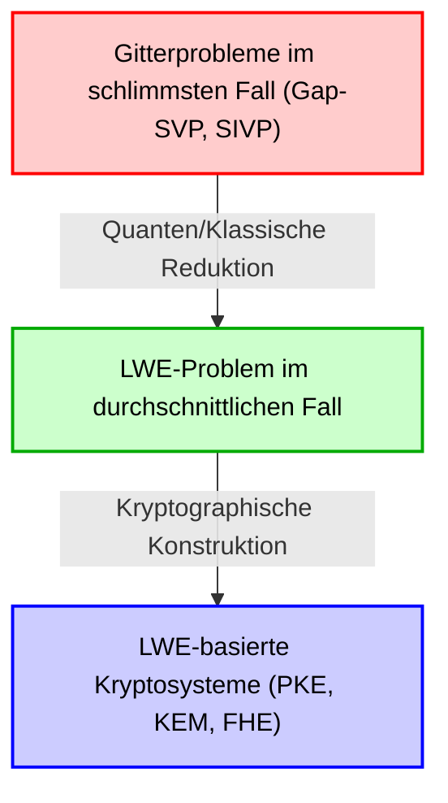
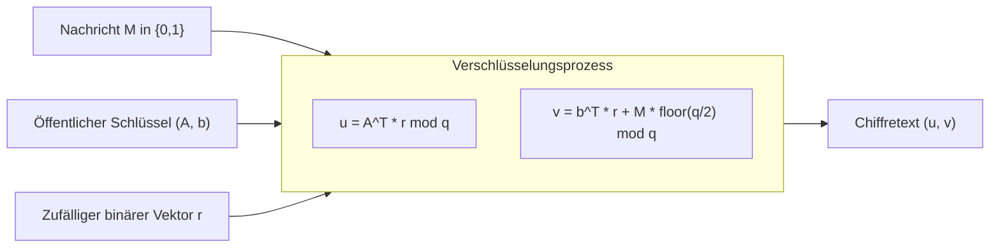
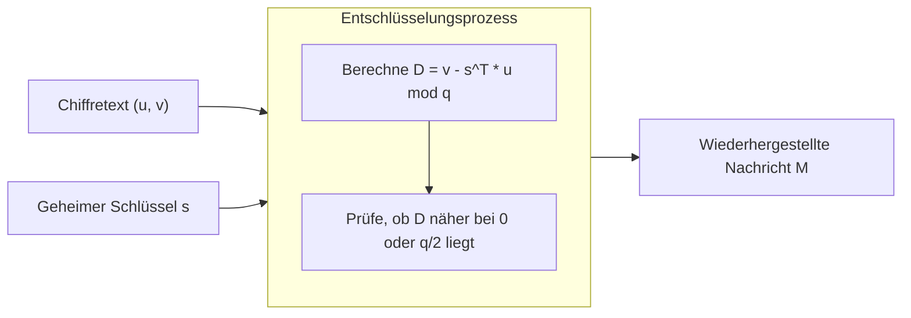

# 1. Einführung: Anbruch der Post-Quanten-Kryptographie (PQC) und der Aufstieg der gitterbasierten Kryptographie

Die digitale Infrastruktur unserer modernen Gesellschaft stützt sich auf Public-Key-Kryptographie-Technologien wie RSA und elliptische Kurvenkryptographie (ECC). Diese Verschlüsselungsmethoden basieren ihre Sicherheit auf mathematischen Schwierigkeiten wie dem "Faktorisierungsproblem" und dem "diskreten Logarithmusproblem", von denen angenommen wird, dass sie von herkömmlichen klassischen Computern nicht effizient (sie benötigen exponentielle Zeit) gelöst werden können.

Allerdings erschütterte der 1994 von Peter Shor veröffentlichte "Shor-Algorithmus" die Welt der Kryptographie. Dieser Algorithmus bewies mathematisch, dass, sobald großangelegte Quantencomputer realisiert sind, das Faktorisierungsproblem und das diskrete Logarithmusproblem in polynomieller Zeit gelöst werden könnten. Das bedeutet, dass die heute weit verbreitete Public-Key-Kryptographie in Zukunft vollständig entschlüsselbar sein wird.

Um dieser "Quantenbedrohung (Quantum Threat)" entgegenzuwirken, wurde die Erforschung neuer kryptographischer Methoden, die selbst für Quantencomputer schwer zu knacken sind, zu einer dringenden Aufgabe. Dieses Feld wird "Post-Quanten-Kryptographie (Post-Quantum Cryptography: PQC)" oder "quantensichere Kryptographie" genannt.

Es gibt mehrere vielversprechende Kandidaten für PQC, wie Hash-basierte Kryptographie, Code-basierte Kryptographie, multivariate Polynom-Kryptographie und isogenie-basierte Kryptographie. Die derzeit meiste Aufmerksamkeit, die das Zentrum des PQC-Standardisierungsprozesses des NIST (National Institute of Standards and Technology) bildet, erhält jedoch die "gitterbasierte Kryptographie (Lattice-based cryptography)". Im Vergleich zu anderen Methoden bietet die gitterbasierte Kryptographie extrem schnelle Ver- und Entschlüsselungsgeschwindigkeiten. Zudem zeichnet sie sich durch einen in der kryptographischen Theorie äußerst starken Sicherheitsbeweis aus, nämlich die Reduktion von der "Komplexität im schlimmsten Fall (Worst-case complexity)" zur "Komplexität im durchschnittlichen Fall (Average-case complexity)".

In diesem Artikel werden wir ausgehend von der mathematischen Definition des "Gitters (Lattice)", das die Grundlage dieser Kryptographie bildet, die harten Probleme auf Gittern wie SVP (Kürzestes-Vektor-Problem) und CVP (Nächstgelegener-Vektor-Problem) sowie das "LWE-Problem (Learning With Errors)", das als Herzstück der modernen gitterbasierten Kryptographie gilt, tiefgehend erklären. Dies geschieht anhand von mathematischen Formeln, geometrischer Intuition und konkreten numerischen Beispielen.

# 2. Mathematische Definition und geometrische Intuition von Gittern (Lattice)

## 2.1 Vektorräume und Gitter
In der Mathematik ist ein "Gitter (Lattice)" eine Menge diskreter Punkte, die regelmäßig in einem $n$-dimensionalen reellen Vektorraum $\mathbb{R}^n$ angeordnet sind. Es ähnelt dem aus der linearen Algebra bekannten Vektorraum (Vector Space), weist jedoch einen entscheidenden Unterschied auf. Während ein Vektorraum ein kontinuierlicher Raum ist, der durch Linearkombinationen von Basisvektoren mit "reellen Koeffizienten" ausgedrückt wird, ist ein Gitter ein diskreter Raum, der durch Linearkombinationen von Basisvektoren mit "ganzzahligen Koeffizienten" dargestellt wird.

Lassen Sie uns eine strenge mathematische Definition geben. Betrachten wir $n$ ($n \le m$) linear unabhängige Vektoren $\mathbf{b}_1, \mathbf{b}_2, \dots, \mathbf{b}_n$ in einem $m$-dimensionalen reellen Vektorraum $\mathbb{R}^m$. Die Matrix, die diese Vektoren als Spaltenvektoren enthält, sei $B = [\mathbf{b}_1, \mathbf{b}_2, \dots, \mathbf{b}_n] \in \mathbb{R}^{m \times n}$. Wir nennen dieses $B$ die "Basis (Basis)" des Gitters.

Das durch diese Basis $B$ erzeugte Gitter $\mathcal{L}(B)$ ist wie folgt definiert:

$$
\mathcal{L}(B) = \left\{ \sum_{i=1}^{n} x_i \mathbf{b}_i \mathrel{\bigg|} x_i \in \mathbb{Z} \right\} = \{ B \mathbf{x} \mid \mathbf{x} \in \mathbb{Z}^n \}
$$

Wichtig hierbei ist, dass die Koeffizienten $x_i$ auf ganze Zahlen $\mathbb{Z}$ und nicht auf reelle Zahlen $\mathbb{R}$ beschränkt sind. Dadurch entsteht keine kontinuierliche Raumfüllung aus unzähligen Punkten, sondern eine "Menge diskreter Punkte", ähnlich wie gleichmäßig verteilte Kreuzungen in einem Netz.

## 2.2 Geometrische Vorstellung
Betrachten wir ein Beispiel in der zweidimensionalen Ebene $\mathbb{R}^2$. Wenn wir als Basisvektoren $\mathbf{b}_1 = \begin{pmatrix} 1 \\ 0 \end{pmatrix}$ und $\mathbf{b}_2 = \begin{pmatrix} 0 \\ 1 \end{pmatrix}$ wählen, ist das von diesen erzeugte Gitter die Menge aller ganzzahligen Koordinaten $(x, y) \in \mathbb{Z}^2$ auf der Koordinatenebene. Dies ist das einfachste "quadratische Gitter".

Ein Gitter ist jedoch nicht immer orthogonal. Wenn wir beispielsweise die Basis $\mathbf{b}_1 = \begin{pmatrix} 2 \\ 1 \end{pmatrix}$ und $\mathbf{b}_2 = \begin{pmatrix} 1 \\ 3 \end{pmatrix}$ betrachten, sehen die erzeugten Punkte wie Kreuzungspunkte eines schräg verzerrten Netzes aus.

## 2.3 Nichteindeutigkeit der Basis und unimodulare Transformation
Es gibt eine wichtige Eigenschaft, die für die Sicherheit der gitterbasierten Kryptographie von grundlegender Bedeutung ist: "Es gibt unendlich viele Basen, die dasselbe Gitter erzeugen."

Zum Beispiel erzeugt die Basis $\mathbf{b}_1 = (1, 0)^T, \mathbf{b}_2 = (0, 1)^T$ das Gitter $\mathbb{Z}^2$. Genau dasselbe Gitter $\mathbb{Z}^2$ wird aber auch durch die Basis $\mathbf{b}'_1 = (1, 1)^T, \mathbf{b}'_2 = (2, 3)^T$ erzeugt.

Die notwendige und hinreichende Bedingung dafür, dass eine Basis $B$ und eine andere Basis $B'$ dasselbe Gitter erzeugen, ist die Existenz einer Matrix mit ganzzahligen Elementen $U \in \mathbb{Z}^{n \times n}$, deren Determinante $\det(U) = \pm 1$ ist, sodass gilt:
$$ B' = B U $$
Eine solche Matrix $U$ wird "unimodulare Matrix (Unimodular matrix)" genannt.

Die grundlegende Idee bei kryptographischen Anwendungen ist es, eine "gute Basis" (nahezu orthogonal und aus kurzen Vektoren bestehend) als geheimen Schlüssel und eine "schlechte Basis" (extrem schiefwinklig zueinander und aus sehr langen Vektoren bestehend) als öffentlichen Schlüssel zu verwenden. Es wird extrem schwierig, bei hohen Dimensionen rechnerisch eine gute Basis aus einer schlechten Basis abzuleiten. Dies ist die grundlegende Intuition der gitterbasierten Kryptographie.

# 3. Harte Rechenprobleme in Gittern

Die Sicherheit der gitterbasierten Kryptographie beruht auf der Schwierigkeit, bestimmte mathematische Probleme auf Gittern zu lösen. Hier stellen wir die zwei grundlegendsten und bekanntesten Probleme vor.

## 3.1 Kürzestes-Vektor-Problem (Shortest Vector Problem: SVP)
SVP ist das klassischste und berühmteste Problem in der Gittertheorie.

**Definition (SVP):**
Gegeben sei eine beliebige Gitterbasis $B$. Finde in dem Gitter $\mathcal{L}(B)$ unter allen Vektoren ungleich null den Vektor $\mathbf{v}$, dessen euklidische Norm (Länge) minimal ist.

Mathematisch ausgedrückt sucht man das $\mathbf{v}$, für das $\min_{\mathbf{v} \in \mathcal{L}(B) \setminus \{\mathbf{0}\}} \| \mathbf{v} \|$ gilt. Diese minimale Länge wird als $\lambda_1(\mathcal{L})$ bezeichnet und "erstes sukzessives Minimum (First successive minimum) des Gitters" genannt.

In niedrigen Dimensionen wie 2D oder 3D kann man das Problem visuell lösen, indem man ein Diagramm zeichnet und den kürzesten Vektor mit bloßem Auge findet. Alternativ kann man es mit dem Gaußschen Gitterreduktionsalgorithmus effizient lösen. Es ist jedoch bekannt, dass es NP-schwer ist, SVP exakt zu lösen, wenn die Dimension $n$ hoch wird, beispielsweise Hunderte oder Tausende von Dimensionen.

In der realen Kryptographie wird das approximative SVP ($\gamma$-SVP) verwendet, bei dem nicht der exakte kürzeste Vektor, sondern ein "annähernd kurzer Vektor" gefunden werden soll. Wenn der Approximationsfaktor $\gamma$ polynomielle Größe hat, gilt dieses Problem immer noch als äußerst schwierig.

## 3.2 Nächstgelegener-Vektor-Problem (Closest Vector Problem: CVP)
CVP ist ebenfalls ein extrem wichtiges Problem in der gitterbasierten Kryptographie.

**Definition (CVP):**
Gegeben sei eine beliebige Gitterbasis $B$ und ein beliebiger Zielvektor $\mathbf{t} \in \mathbb{R}^m$ im Raum (der nicht unbedingt ein Gitterpunkt sein muss). Finde den Gitterpunkt $\mathbf{v} \in \mathcal{L}(B)$, der $\mathbf{t}$ am nächsten liegt.

Mathematisch ausgedrückt sucht man den Gitterpunkt $\mathbf{v}$, für den $\min_{\mathbf{v} \in \mathcal{L}(B)} \| \mathbf{v} - \mathbf{t} \|$ gilt.

Wie SVP ist auch CVP in hohen Dimensionen NP-schwer. Im Hinblick auf kryptographische Anwendungen steht das weiter unten besprochene LWE-Problem in enger Beziehung zu einer speziellen Variante dieses CVP (Bounded Distance Decoding: BDD).

## 3.3 Warum ist es in hohen Dimensionen unlösbar? (Grenzen von LLL und BKZ)
Ein bekannter Algorithmus zur Lösung hochdimensionaler Gitterprobleme ist der LLL-Algorithmus (Lenstra-Lenstra-Lovász Algorithmus). Der LLL-Algorithmus läuft in polynomieller Zeit und kann eine Gitterbasis bis zu einem gewissen Grad auf eine "gute Basis" reduzieren (Reduction). Der kürzeste Vektor, den der LLL-Algorithmus finden kann, hat jedoch einen exponentiellen Approximationsfaktor ($2^{\mathcal{O}(n)}$) relativ zur wahren Länge des kürzesten Vektors, was nicht ausreicht, um die Sicherheit der Kryptographie zu brechen.

Verwendet man leistungsfähigere Basisreduktionsalgorithmen wie den BKZ-Algorithmus (Block Korkine-Zolotarev), eine Verbesserung des LLL, können kürzere Vektoren gefunden werden, aber der Rechenaufwand wächst exponentiell mit der Blockgröße. Bei der gitterbasierten Kryptographie werden sichere Parameter (wie die Größe der Dimension $n$) durch Abschätzung der Ausführungszeit dieses BKZ-Algorithmus bestimmt. Bei den aktuellen PQC-Standardparametern werden Werte von 500 bis über 1000 für die Dimension $n$ gewählt. Man geht davon aus, dass selbst die Entschlüsselung mit Supercomputern oder zukünftigen Quantencomputern länger dauern würde als das Alter des Universums.

# 4. Mathematische Formulierung des LWE-Problems (Learning With Errors)

Der Großteil der modernen gitterbasierten Kryptographie basiert auf dem 2005 von Oded Regev vorgeschlagenen "LWE-Problem (Learning With Errors)". Die Schönheit des LWE-Problems liegt in der Einfachheit seiner Formulierung und seinem extrem starken mathematischen Beweis der "Reduktion vom schlimmsten Fall auf den durchschnittlichen Fall".

## 4.1 Lineares Gleichungssystem ohne Rauschen
Um das LWE-Problem zu verstehen, betrachten wir zunächst ein einfaches lineares Gleichungssystem ohne Rauschen.
Angenommen, es gibt einen unbekannten geheimen Vektor $\mathbf{s} \in \mathbb{Z}_q^n$ (wobei jedes Element eine ganze Zahl von $0$ bis $q-1$ ist). Hierbei sei $q$ eine Primzahl.

Wir wählen zufällige Koeffizientenvektoren $\mathbf{a}_1, \mathbf{a}_2, \dots \in \mathbb{Z}_q^n$ und berechnen das Skalarprodukt mit dem geheimen Vektor $\mathbf{s}$ modulo $q$.
$b_1 = \langle \mathbf{a}_1, \mathbf{s} \rangle \pmod q$
$b_2 = \langle \mathbf{a}_2, \mathbf{s} \rangle \pmod q$
$\vdots$

Wenn wir eine ausreichende Anzahl (mehr als $n$) von $(\mathbf{a}_i, b_i)$-Paaren gegeben haben, können wir den geheimen Vektor $\mathbf{s}$ mithilfe der "Gaußschen Elimination (Gaussian elimination)" der linearen Algebra leicht wiederherstellen. Dies ist ein Problem, das in polynomieller Zeit leicht zu lösen ist.

## 4.2 Definition des LWE-Problems: Hinzufügen von Rauschen
Was passiert nun, wenn wir diesem Problem ein kleines "Rauschen (Fehler)" hinzufügen?
Das ist die Essenz des LWE-Problems.

Für den unbekannten geheimen Vektor $\mathbf{s} \in \mathbb{Z}_q^n$ fügen wir dem Ergebnis jeder Gleichung einen kleinen Fehler $e_i \in \mathbb{Z}_q$ hinzu.
$b_i = \langle \mathbf{a}_i, \mathbf{s} \rangle + e_i \pmod q$

Hierbei ist $e_i$ ein kleiner ganzzahliger Wert mit dem Mittelwert 0 und einer relativ kleinen Standardabweichung (z. B. ausgewählt aus einer diskreten Gaußverteilung, ähnlich einer Normalverteilung).
Die bereitgestellten Informationen sind eine Liste von Paaren des zufälligen Vektors $\mathbf{a}_i$ und dem unter Hinzufügung eines Fehlers berechneten $b_i$.
$( \mathbf{a}_1, b_1 ), ( \mathbf{a}_2, b_2 ), \dots, ( \mathbf{a}_m, b_m )$

Dies lässt sich sehr elegant als Matrix ausdrücken.
Mit einer zufälligen Matrix $A \in \mathbb{Z}_q^{m \times n}$, einem geheimen Vektor $\mathbf{s} \in \mathbb{Z}_q^n$ und einem Fehlervektor $\mathbf{e} \in \mathbb{Z}_q^m$ können wir schreiben:
$$ \mathbf{b} = A \mathbf{s} + \mathbf{e} \pmod q $$
Gegeben sind nur $A$ und $\mathbf{b}$. Daraus $\mathbf{s}$ zu ermitteln, ist das "Such-LWE-Problem (Search LWE problem)".

Da der Fehler $e_i$ enthalten ist, wird bei dem Versuch, die Gaußsche Elimination anzuwenden, der Fehler durch das Addieren und Subtrahieren von Gleichungen exponentiell verstärkt, wodurch es unmöglich wird, zur richtigen Antwort zu gelangen. Obwohl es auf den ersten Blick wie ein einfaches lineares Gleichungssystem aussieht, springt der Schwierigkeitsgrad durch das Hinzufügen dieses kleinen Rauschens auf ein NP-schweres Niveau.

## 4.3 Entscheidungs-LWE-Problem (Decision LWE)
In kryptographischen Beweisen wird häufig eine Variante des Such-LWE-Problems verwendet, das "Entscheidungs-LWE-Problem (Decision LWE problem)".

Beim Entscheidungs-LWE-Problem geht es darum, zu bestimmen, aus welcher von zwei Verteilungen eine gegebene Liste von Beispielen stammt:
1. **LWE-Verteilung**: Bewusst berechnetes $(A, \mathbf{b} = A\mathbf{s} + \mathbf{e} \pmod q)$
2. **Gleichmäßige Zufallsverteilung**: $(A, \mathbf{u})$, bestehend aus einer völlig zufällig gewählten Matrix $A$ und einem Vektor $\mathbf{u}$

Überraschenderweise werden aus der LWE-Verteilung stammende Paare "rechnerisch ununterscheidbar (Computationally Indistinguishable)" von völlig zufälligen Datenpaaren, wenn man die Parameter des LWE-Problems entsprechend wählt. Diese Eigenschaft ist die Grundlage dafür, dass LWE-basierte Kryptographie Chiffretexte generieren kann, die nicht von Zufallszahlen zu unterscheiden sind.

## 4.4 Reduktion von Worst-case auf Average-case (Regevs Theorem)
Der größte Verdienst von Oded Regev war es, die Schwierigkeit dieses LWE-Problems mathematisch mit der Schwierigkeit der oben erwähnten Gitterprobleme (SVP und CVP) zu verknüpfen.

Er nutzte die Quantenreduktion (Quantum reduction), um zu beweisen, dass "wenn ein Polynomialzeitalgorithmus existiert, der das LWE-Problem im Durchschnitt (für zufällig gewählte $A$ und $\mathbf{e}$) lösen kann, dann existiert ein Quantenalgorithmus in polynomieller Zeit, der Gap-SVP im schlimmsten Fall (dem schwierigsten Fall) für ein beliebiges Gitter lösen kann." (Später wurde von Peikert und anderen auch eine klassische Reduktion gezeigt).

Dies ist eine traumhafte Eigenschaft in der Kryptographietheorie. Es räumt die Sorge aus, dass "die Verschlüsselung vielleicht geknackt wird, weil wir zufällig einen schwachen Schlüssel (einen Teil des Durchschnittsfalls) gewählt haben", und liefert eine starke Garantie: "Wenn LWE im Durchschnittsfall gelöst werden kann, können alle schwierigen Probleme auf Gittern gelöst werden (deshalb ist LWE definitiv schwierig)."

# 5. Konstruktion eines Public-Key-Kryptosystems mit LWE (Regev-Kryptographie)

Da wir nun die Schwierigkeit des LWE-Problems verstehen, wollen wir uns ansehen, wie das von Oded Regev vorgeschlagene grundlegende Public-Key-Kryptosystem dieses nutzt, um Ver- und Entschlüsselung durchzuführen. Hier erklären wir den grundlegendsten Mechanismus zur Verschlüsselung einer 1-Bit-Nachricht $M \in \{0, 1\}$.

## 5.1 Schlüsselerzeugung (Key Generation)
1. Bestimme als Systemparameter den Modulus, die Primzahl $q$, die Dimension $n$ und die Anzahl der Gleichungen $m$ ($m > n \log q$).
2. Wähle zufällig den Vektor $\mathbf{s} \in \mathbb{Z}_q^n$ als geheimen Schlüssel.
3. Generiere eine zufällige Matrix $A \in \mathbb{Z}_q^{m \times n}$.
4. Wähle einen kleinen Fehlervektor $\mathbf{e} \in \mathbb{Z}_q^m$ aus einer Fehlerverteilung wie der diskreten Gaußverteilung.
5. Berechne den Vektor $\mathbf{b} = A \mathbf{s} + \mathbf{e} \pmod q$.
6. Der öffentliche Schlüssel (Public Key) ist $(A, \mathbf{b})$.
7. Der geheime Schlüssel (Secret Key) ist $\mathbf{s}$.

Der öffentliche Schlüssel ist buchstäblich eine "Instanz des LWE-Problems" selbst. Die Sicherheit ist garantiert, weil die Berechnung des geheimen Schlüssels $\mathbf{s}$ aus dem öffentlichen Schlüssel $(A, \mathbf{b})$ der Lösung des Such-LWE-Problems entspricht.

## 5.2 Verschlüsselung (Encryption)
Alice verwendet Bobs öffentlichen Schlüssel $(A, \mathbf{b})$, um eine 1-Bit-Nachricht $M \in \{0, 1\}$ zu verschlüsseln.

1. Wähle einen zufälligen Binärvektor (Komponenten sind 0 oder 1) $\mathbf{r} \in \{0, 1\}^m$.
2. Als erste Hälfte des Chiffretextes berechne den Vektor $\mathbf{u} = A^T \mathbf{r} \pmod q$. ($A^T$ ist die transponierte Matrix von $A$. Das heißt, die Zeilen von $A$, für die die Komponente von $\mathbf{r}$ gleich 1 ist, werden addiert).
3. Als zweite Hälfte des Chiffretextes berechne den Skalar $v = \mathbf{b}^T \mathbf{r} + M \cdot \lfloor \frac{q}{2} \rfloor \pmod q$.
   (Wenn die Nachricht $M$ den Wert 0 hat, wird nichts addiert; ist sie $1$, wird genau die Hälfte von $q$, also $\lfloor \frac{q}{2} \rfloor$, addiert).
4. Der Chiffretext (Ciphertext) ist $(\mathbf{u}, v)$.

Die intuitive Bedeutung der Verschlüsselung besteht darin, eine "Summe einer zufälligen Teilmenge" der Matrix $A$ und des Vektors $\mathbf{b}$ des öffentlichen Schlüssels zu bilden. Aufgrund der Härte des Entscheidungs-LWE-Problems erscheint dieser Chiffretext $(\mathbf{u}, v)$ ununterscheidbar von einem völlig zufälligen Vektor und einer gleichmäßigen Zufallszahl (Semantische Sicherheit: Semantic Security).

## 5.3 Entschlüsselung (Decryption)
Bob entschlüsselt den Chiffretext $(\mathbf{u}, v)$ mithilfe des geheimen Schlüssels $\mathbf{s}$.

1. Berechne den folgenden Wert: $D = v - \mathbf{s}^T \mathbf{u} \pmod q$
2. Liegt das berechnete Ergebnis nahe bei $0$, wird $M=0$ ausgegeben, liegt es nahe bei $\lfloor \frac{q}{2} \rfloor$, wird $M=1$ ausgegeben.

Warum funktioniert diese Entschlüsselung? Lassen Sie uns die Mathematik dahinter entfalten.
Erinnern Sie sich, dass $\mathbf{b} = A \mathbf{s} + \mathbf{e}$ war.

$$
\begin{aligned}
v - \mathbf{s}^T \mathbf{u} &= (\mathbf{b}^T \mathbf{r} + M \cdot \lfloor \frac{q}{2} \rfloor) - \mathbf{s}^T (A^T \mathbf{r}) \\
&= ((A \mathbf{s} + \mathbf{e})^T \mathbf{r} + M \cdot \lfloor \frac{q}{2} \rfloor) - \mathbf{s}^T A^T \mathbf{r} \\
&= (\mathbf{s}^T A^T \mathbf{r} + \mathbf{e}^T \mathbf{r} + M \cdot \lfloor \frac{q}{2} \rfloor) - \mathbf{s}^T A^T \mathbf{r} \\
&= \mathbf{e}^T \mathbf{r} + M \cdot \lfloor \frac{q}{2} \rfloor \pmod q
\end{aligned}
$$

Hier hebt sich $\mathbf{s}^T A^T \mathbf{r}$ sauber aus der Gleichung auf und verschwindet!
Was übrig bleibt, ist $\mathbf{e}^T \mathbf{r} + M \cdot \lfloor \frac{q}{2} \rfloor$.

$\mathbf{e}$ ist ein Rauschvektor mit sehr kleinen Komponenten, und $\mathbf{r}$ ist ein Binärvektor, dessen Komponenten 0 oder 1 sind. Daher bleibt ihr Skalarprodukt $\mathbf{e}^T \mathbf{r}$ (wenn die Parameter richtig gewählt sind) auf einem relativ kleinen Wert.

- Wenn $M=0$, ist das Ergebnis $\mathbf{e}^T \mathbf{r}$, was ein kleiner Wert nahe $0$ ist.
- Wenn $M=1$, ist das Ergebnis $\mathbf{e}^T \mathbf{r} + \lfloor \frac{q}{2} \rfloor$, was sich um den halben Wert von $q$, also $\lfloor \frac{q}{2} \rfloor$, bewegt.

Wenn die Parameter so ausgelegt sind, dass der absolute Wert des Fehlers $\mathbf{e}^T \mathbf{r}$ unter $\frac{q}{4}$ bleibt, kann Bob die Nachricht $M$ genau bestimmen (entschlüsseln), indem er einfach prüft, ob das berechnete Ergebnis näher an $0$ oder an $\lfloor \frac{q}{2} \rfloor$ liegt. Dies ist der wunderbare Mechanismus, der LWE-basierte Kryptographie funktionieren lässt.

# 6. Ein Spielzeugbeispiel der LWE-Kryptographie mit konkreten Zahlen

Es ist oft schwer, ein Gefühl dafür zu bekommen, wenn man nur eine Reihe von Formeln betrachtet. Lassen Sie uns also extrem kleine numerische Parameter einstellen und die Berechnungen von der Verschlüsselung bis zur Entschlüsselung nachvollziehen.
(※ In realen kryptographischen Systemen werden zur Gewährleistung der Sicherheit Werte von über 500 für $n$ und über mehrere Tausend für $q$ verwendet.)

**【Parametereinstellungen】**
- Modulus $q = 17$ (Eine Primzahl, sodass die Werte im Bereich von $0$ bis $16$ liegen)
- Dimension $n = 2$
- Anzahl der Gleichungen $m = 4$
- Wir verschlüsseln die Nachricht $M = 1$.
- Verschiebungsbetrag für die Nachricht: $\lfloor \frac{q}{2} \rfloor = \lfloor \frac{17}{2} \rfloor = 8$

**【1. Schlüsselerzeugungsphase】**
Bob wählt den geheimen Schlüssel $\mathbf{s}$, die Matrix $A$ und den Fehlervektor $\mathbf{e}$ zufällig aus.
$$ \mathbf{s} = \begin{pmatrix} 3 \\ 4 \end{pmatrix} \in \mathbb{Z}_{17}^2 $$
$$ A = \begin{pmatrix} 2 & 15 \\ 1 & 8 \\ 14 & 5 \\ 9 & 10 \end{pmatrix} \in \mathbb{Z}_{17}^{4 \times 2} $$
$$ \mathbf{e} = \begin{pmatrix} 1 \\ -1 \\ 0 \\ 2 \end{pmatrix} \equiv \begin{pmatrix} 1 \\ 16 \\ 0 \\ 2 \end{pmatrix} \pmod{17} $$

Als nächstes berechnet er den öffentlichen Schlüssel $\mathbf{b}$.
$$ A \mathbf{s} = \begin{pmatrix} 2 & 15 \\ 1 & 8 \\ 14 & 5 \\ 9 & 10 \end{pmatrix} \begin{pmatrix} 3 \\ 4 \end{pmatrix} = \begin{pmatrix} 2\times 3 + 15\times 4 \\ 1\times 3 + 8\times 4 \\ 14\times 3 + 5\times 4 \\ 9\times 3 + 10\times 4 \end{pmatrix} = \begin{pmatrix} 6 + 60 \\ 3 + 32 \\ 42 + 20 \\ 27 + 40 \end{pmatrix} = \begin{pmatrix} 66 \\ 35 \\ 62 \\ 67 \end{pmatrix} $$
Dies wird modulo 17 berechnet. ($66 = 17 \times 3 + 15$ usw.)
$$ A \mathbf{s} \pmod{17} = \begin{pmatrix} 15 \\ 1 \\ 11 \\ 16 \end{pmatrix} $$
Der Fehlervektor $\mathbf{e}$ wird addiert.
$$ \mathbf{b} = A \mathbf{s} + \mathbf{e} = \begin{pmatrix} 15 \\ 1 \\ 11 \\ 16 \end{pmatrix} + \begin{pmatrix} 1 \\ 16 \\ 0 \\ 2 \end{pmatrix} = \begin{pmatrix} 16 \\ 17 \\ 11 \\ 18 \end{pmatrix} \equiv \begin{pmatrix} 16 \\ 0 \\ 11 \\ 1 \end{pmatrix} \pmod{17} $$

Der öffentliche Schlüssel besteht aus $A$ und $\mathbf{b} = (16, 0, 11, 1)^T$.

**【2. Verschlüsselungsphase】**
Alice verschlüsselt die Nachricht $M = 1$.
Sie wählt einen zufälligen Vektor $\mathbf{r}$. Hier verwenden wir $\mathbf{r} = (1, 0, 1, 0)^T$.

$\mathbf{u}$ wird berechnet.
$$ \mathbf{u} = A^T \mathbf{r} = \begin{pmatrix} 2 & 1 & 14 & 9 \\ 15 & 8 & 5 & 10 \end{pmatrix} \begin{pmatrix} 1 \\ 0 \\ 1 \\ 0 \end{pmatrix} = \begin{pmatrix} 2 \times 1 + 14 \times 1 \\ 15 \times 1 + 5 \times 1 \end{pmatrix} = \begin{pmatrix} 16 \\ 20 \end{pmatrix} \equiv \begin{pmatrix} 16 \\ 3 \end{pmatrix} \pmod{17} $$

$v$ wird berechnet.
$$ \mathbf{b}^T \mathbf{r} = (16, 0, 11, 1) \begin{pmatrix} 1 \\ 0 \\ 1 \\ 0 \end{pmatrix} = 16 \times 1 + 11 \times 1 = 27 \equiv 10 \pmod{17} $$
Der der Nachricht $M=1$ entsprechende Wert $\lfloor 17/2 \rfloor = 8$ wird addiert.
$$ v = \mathbf{b}^T \mathbf{r} + M \cdot 8 = 10 + 1 \times 8 = 18 \equiv 1 \pmod{17} $$

Alice sendet $(\mathbf{u}, v) = \left( \begin{pmatrix} 16 \\ 3 \end{pmatrix}, 1 \right)$ als Chiffretext an Bob.

**【3. Entschlüsselungsphase】**
Nachdem Bob den Chiffretext erhalten hat, entschlüsselt er ihn mithilfe des geheimen Schlüssels $\mathbf{s} = (3, 4)^T$.
Entschlüsselungsformel: $D = v - \mathbf{s}^T \mathbf{u} \pmod{17}$ wird berechnet.

$$ \mathbf{s}^T \mathbf{u} = (3, 4) \begin{pmatrix} 16 \\ 3 \end{pmatrix} = 3 \times 16 + 4 \times 3 = 48 + 12 = 60 \equiv 9 \pmod{17} $$
$$ D = v - \mathbf{s}^T \mathbf{u} = 1 - 9 = -8 \pmod{17} $$

In der Modulo-17-Welt ist $-8$ gleich $9$ ($-8 + 17 = 9$).
Bob prüft, ob der ermittelte Wert $D = 9$ näher an $0$ oder an $8$ ($\lfloor 17/2 \rfloor$) liegt.
Da $9$ offensichtlich viel näher an $8$ als an $0$ liegt, konnte Bob korrekt $M = 1$ wiederherstellen!

Warum ist es $9$ geworden? Erinnern wir uns an den vorherigen Beweis.
Der Fehleranteil ist $\mathbf{e}^T \mathbf{r} = (1, -1, 0, 2) (1, 0, 1, 0)^T = 1 \times 1 + 0 \times 1 = 1$.
Daher ist das berechnete Ergebnis $\mathbf{e}^T \mathbf{r} + M \cdot 8 = 1 + 8 = 9$. Wir haben bestätigt, dass exakt der theoretische Wert berechnet wurde.

# 7. Entwicklung in Richtung Praxisnähe: Ring-LWE und Module-LWE

Das bisher erklärte Standard-LWE-Problem (Standard LWE) verfügt über einen extrem starken Sicherheitsbeweis, hat jedoch in der praktischen Anwendung fatale Schwächen: Die "Größe des Schlüssels wird enorm" und die "Rechenkosten sind hoch".

Beim Standard-LWE enthält der öffentliche Schlüssel eine riesige Matrix $A \in \mathbb{Z}_q^{m \times n}$. Wenn der Parameter $n$ Hunderte oder Tausende erreicht, wächst die Größe dieser Matrix auf mehrere Megabyte an, was sie für die wiederholte Übertragung über Internet-Kommunikationsprotokolle (wie TLS) viel zu groß macht. Darüber hinaus erfordert die Multiplikation von Matrizen und Vektoren eine Rechenkomplexität von $\mathcal{O}(n^2)$.

Um dieses Problem zu lösen, wurden "Ring-LWE (RLWE)" und "Module-LWE (MLWE)" eingeführt, die eine algebraische Struktur namens Polynomringe (Polynomial rings) in das Gitter integrieren.

## 7.1 Intuition von Ring-LWE
Beim Ring-LWE werden Vektoren und Matrizen durch Elemente (Polynome) auf einem Polynomring $\mathcal{R}_q = \mathbb{Z}_q[X]/(X^n + 1)$ ersetzt. (Hierbei wird $n$ als eine Zweierpotenz gewählt).

Während der öffentliche Schlüssel beim Standard-LWE eine Matrix $A$ war, wird beim Ring-LWE ein einziges Polynom $a(x)$ verwendet. Der geheime Schlüssel $s(x)$ und der Fehler $e(x)$ werden ebenfalls zu Polynomen.
Die Gleichung lautet wie folgt:
$$ b(x) = a(x) \cdot s(x) + e(x) \pmod q $$

Da dies eine Multiplikation von Polynomen ist, kann die Rechenkomplexität durch die Verwendung der "zahlentheoretischen Transformation (Number Theoretic Transform: NTT)", die der schnellen Fourier-Transformation (FFT) ähnelt, drastisch auf $\mathcal{O}(n \log n)$ reduziert werden. Darüber hinaus wird die Datengröße auf $\mathcal{O}(n)$ reduziert, da die Größe des öffentlichen Schlüssels von einer Matrix auf ein einziges Polynom verkleinert wird. Dies bringt einen überwältigenden Vorteil bei der Kommunikationsbandbreite.

Mathematisch betrachtet wird Ring-LWE nicht auf allgemeine Gitter, sondern auf Probleme auf einem Gitter mit einer speziellen Symmetrie, genannt "Ideales Gitter (Ideal Lattice)", zurückgeführt.

## 7.2 Module-LWE und NIST-Standardisierung (Kyber / ML-KEM)
Ring-LWE ist zwar effizient, es gab jedoch gewisse Bedenken, dass die spezielle algebraische Struktur idealer Gitter in Zukunft als Ansatzpunkt für Angriffe dienen könnte. Daher wurde "Module-LWE (MLWE)" eingeführt, das "das Beste aus beiden Welten" kombiniert: die konservative Sicherheit von Standard-LWE und die Effizienz von Ring-LWE.

Bei Module-LWE betrachten wir kleine Matrizen und Vektoren, deren Elemente Polynome sind. Mit anderen Worten: Wir befassen uns mit Moduln über Ringen.
Der derzeit vom NIST als Standard für einen PQC-Schlüsselaustauschalgorithmus (KEM) ausgewählte "CRYSTALS-Kyber" (Standardisierungsname: ML-KEM) basiert exakt auf der Härte dieses Module-LWE-Problems.

# 8. Warum ist es sicher gegenüber Quantencomputern?

Zum Schluss wollen wir auf den Kernpunkt eingehen: "Warum geht man davon aus, dass gitterbasierte Kryptographie selbst mit einem Quantencomputer nicht entschlüsselt werden kann?"

Der Shor-Algorithmus, mit dem Quantencomputer RSA-Kryptographie und elliptische Kurvenkryptographie brechen können, ist im Wesentlichen ein Algorithmus zur Lösung des "Problems der versteckten Untergruppe (Hidden Subgroup Problem: HSP)". Die mathematischen Strukturen (endliche abelsche Gruppen), die hinter RSA und ECC stehen, weisen eine Periodizität auf. Durch die Anwendung einer quantenalgorithmus-spezifischen Operation, der Quanten-Fourier-Transformation (QFT), kann diese Periode (die versteckte Untergruppe) auf einen Schlag extrahiert werden.

Gitterprobleme sind jedoch grundlegend anders. Gitter weisen ebenfalls eine Periodizität auf, aber das, was bei SVP oder CVP verlangt wird, sind geometrische und nichtlineare Eigenschaften wie der "kürzeste Abstand" oder die "Beseitigung von Rauschen". Selbst wenn man eine "Quanten-Fourier-Transformation über abelschen Gruppen" wie bei Shors Algorithmus direkt anwendet, kann man die nützlichen Informationen, die als Lösung für das Gitterproblem dienen, nicht effizient extrahieren. Bis heute wurde kein Quantenalgorithmus entdeckt, der SVP oder LWE in polynomieller Zeit lösen kann. Es wird weithin angenommen, dass selbst die parallele Rechenleistung von Quantencomputern nur Brute-Force-ähnliche Suchen (etwa im Umfang der Quadratwurzel-Beschleunigung durch den Grover-Algorithmus) als wirksames Mittel zur Verfügung hat.

# 9. Zusammenfassung

In diesem Artikel haben wir die mathematische Intuition der gitterbasierten Kryptographie detailliert erklärt, angefangen bei der geometrischen Definition von Gittern über die Formulierung des LWE-Problems bis hin zur Konstruktion der Public-Key-Kryptographie.

1. Ein **Gitter (Lattice)** ist ein diskreter Raum, der als Linearkombination von Basisvektoren mit ganzzahligen Koeffizienten dargestellt wird. In hohen Dimensionen wird es sehr schwierig, eine "gute Basis" zu finden, die nahezu orthogonal ist (SVP).
2. Das **LWE-Problem (Learning With Errors)** ist das Problem, lineare Gleichungssysteme mit Rauschen zu lösen. Da dies mit der Härte von Worst-Case-Gitterproblemen zusammenhängt, bietet es eine starke Sicherheitsgrundlage.
3. Durch die Nutzung des LWE-Problems werden Ver- und Entschlüsselung (**Regev-Kryptographie**) durch clevere Mechanismen realisiert, die absichtlich Rauschen hinzufügen und entfernen.
4. In realen Protokollen werden **Ring-LWE** und **Module-LWE** unter Verwendung von Polynomringen eingesetzt, um die Kommunikationseffizienz und Rechengeschwindigkeit zu verbessern, und bilden die Grundlage des NIST-Standards **ML-KEM**.

Inmitten des bevorstehenden beispiellosen Rechenparadigmenwechsels durch Quantencomputer ist es eine äußerst faszinierende Geschichte, dass die "gitterbasierte Kryptographie", die aus den Tiefen der klassischen linearen Algebra und der Zahlentheorie hervorgegangen ist, das Fundament der zukünftigen Internetsicherheit bilden wird. Die der gitterbasierten Kryptographie zugrunde liegende Mathematik ist nicht übermäßig komplex, und mit Grundkenntnissen in linearer Algebra und Wahrscheinlichkeitsrechnung kann man ihre schöne Struktur gut verstehen. Wir hoffen, dass dieser Artikel Ihnen hilft, die gitterbasierte Kryptographie, den Kern von PQC, besser zu verstehen.
