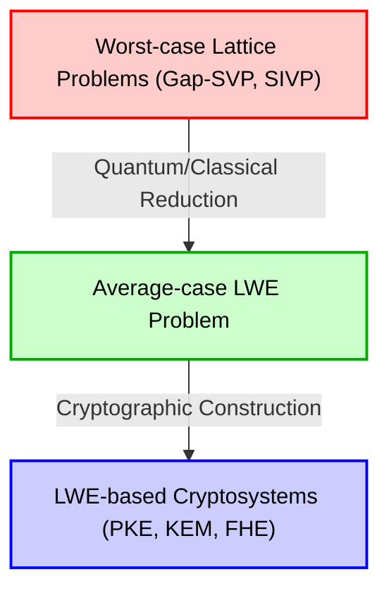
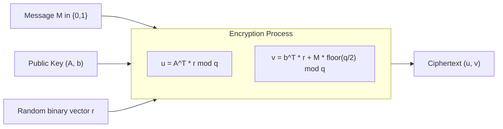
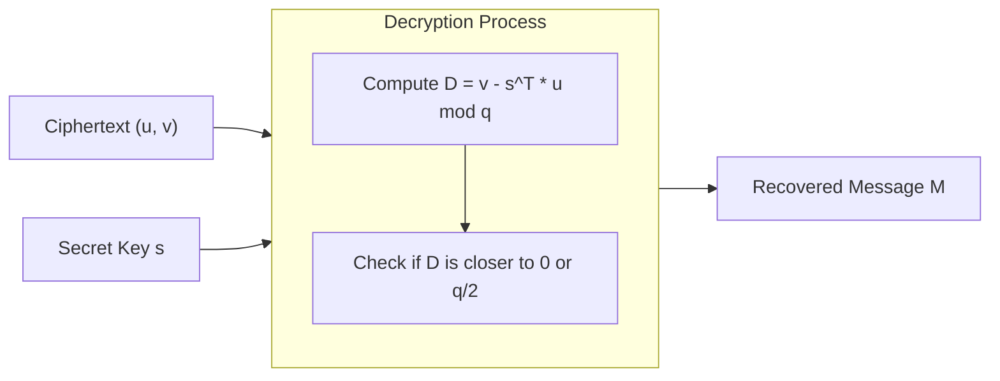

# 1. Introduction: The Dawn of Post-Quantum Cryptography (PQC) and the Rise of Lattice-based Cryptography

The digital infrastructure of modern society is supported by public-key cryptography technologies such as RSA cryptography and Elliptic Curve Cryptography (ECC). These cryptographic schemes base their security on the mathematical difficulty of problems like the "prime factorization problem" and the "discrete logarithm problem," which are believed to be inefficient (requiring exponential time) to solve with conventional classical computers.

However, "Shor's algorithm," published by Peter Shor in 1994, sent shockwaves through the cryptographic world. This algorithm mathematically proved that once a large-scale quantum computer is realized, it would be able to solve the prime factorization problem and the discrete logarithm problem in polynomial time. This means that the widely used public-key cryptography of today will become completely decipherable in the future.

To counter such a "Quantum Threat," research into new cryptographic schemes that are difficult to break even with quantum computers became an urgent task. This field is called "Post-Quantum Cryptography (PQC)" or "quantum-resistant cryptography."

There are several strong candidates for PQC. Examples include hash-based cryptography, code-based cryptography, multivariate polynomial cryptography, and isogeny-based cryptography. Among them, "Lattice-based cryptography" is currently attracting the most attention and is at the center of the PQC standardization process by NIST (National Institute of Standards and Technology). Compared to other methods, lattice-based cryptography has extremely fast encryption and decryption processing speeds, and it has the outstanding feature of an extremely strong security proof in cryptographic theory: a reduction from "worst-case complexity" to "average-case complexity."

In this article, starting from the mathematical definition of a "Lattice," which is the foundation of lattice-based cryptography, we will thoroughly and deeply explain difficult problems on lattices such as SVP (Shortest Vector Problem) and CVP (Closest Vector Problem), and the "LWE (Learning With Errors) problem," which can be said to be the heart of modern lattice-based cryptography, using mathematical formulas, geometric intuition, and specific numerical examples.

# 2. Mathematical Definition and Geometric Intuition of a Lattice

## 2.1 Vector Spaces and Lattices
In mathematics, a "Lattice" is a set of discrete points arranged regularly in an $n$-dimensional real vector space $\mathbb{R}^n$. It is similar to a Vector Space learned in linear algebra, but there is a crucial difference. While a vector space is a continuous space represented by a linear combination of basis vectors with "real coefficients," a lattice is a discrete space represented by a linear combination of basis vectors with "integer coefficients."

Let's give a strict mathematical definition. Consider $n$ ($n \le m$) linearly independent vectors $\mathbf{b}_1, \mathbf{b}_2, \dots, \mathbf{b}_n$ in an $m$-dimensional real vector space $\mathbb{R}^m$. Let a matrix having these vectors as column vectors be $B = [\mathbf{b}_1, \mathbf{b}_2, \dots, \mathbf{b}_n] \in \mathbb{R}^{m \times n}$. This $B$ is called the "Basis" of the lattice.

The lattice $\mathcal{L}(B)$ generated by this basis $B$ is defined as follows:

$$
\mathcal{L}(B) = \left\{ \sum_{i=1}^{n} x_i \mathbf{b}_i \mathrel{\bigg|} x_i \in \mathbb{Z} \right\} = \{ B \mathbf{x} \mid \mathbf{x} \in \mathbb{Z}^n \}
$$

What is important here is that the coefficients $x_i$ are limited to integers $\mathbb{Z}$, not real numbers $\mathbb{R}$. As a result, rather than a continuous space with infinitely many points, a "set of discrete points" like equally spaced intersections is formed.

## 2.2 Geometric Image
Let's consider an example of a 2-dimensional plane $\mathbb{R}^2$. When $\mathbf{b}_1 = \begin{pmatrix} 1 \\ 0 \end{pmatrix}$ and $\mathbf{b}_2 = \begin{pmatrix} 0 \\ 1 \end{pmatrix}$ are chosen as basis vectors, the lattice generated by them is the set of all integer coordinates $(x, y) \in \mathbb{Z}^2$ on the coordinate plane. This is the simplest "square lattice."

However, lattices are not always orthogonal. For example, considering the basis $\mathbf{b}_1 = \begin{pmatrix} 2 \\ 1 \end{pmatrix}$ and $\mathbf{b}_2 = \begin{pmatrix} 1 \\ 3 \end{pmatrix}$, the generated points become like the intersections of an obliquely skewed mesh.

## 2.3 Non-uniqueness of the Basis and Unimodular Transformations
There is an important property related to the foundation of the security of lattice-based cryptography. That is, "there are infinitely many bases that generate the same lattice."

For example, the $\mathbb{Z}^2$ lattice generated by the previous basis $\mathbf{b}_1 = (1, 0)^T, \mathbf{b}_2 = (0, 1)^T$ can be generated as exactly the same lattice $\mathbb{Z}^2$ using the basis $\mathbf{b}'_1 = (1, 1)^T, \mathbf{b}'_2 = (2, 3)^T$.

The necessary and sufficient condition for a basis $B$ and another basis $B'$ to generate the same lattice is that there exists a matrix with integer components $U \in \mathbb{Z}^{n \times n}$ whose determinant is $\det(U) = \pm 1$, and it can be expressed as:
$$ B' = B U $$
Such a matrix $U$ is called a "Unimodular matrix."

The basic idea in its application to cryptography is to use a "good basis" (a basis that is close to orthogonal and consists of short vectors) as a secret key, and a "bad basis" (a basis that is extremely skewed relative to each other and consists of very long vectors) as a public key. It becomes very difficult to calculate a good basis from a bad basis as the dimension increases. This is the basic intuition behind lattice-based cryptography.

# 3. Computationally Hard Problems in Lattices

The security of lattice-based cryptography depends on the difficulty of solving specific mathematical problems on lattices. Here, we introduce the two most fundamental and famous problems.

## 3.1 Shortest Vector Problem (SVP)
SVP is the most classical and famous problem in lattice theory.

**Definition (SVP):**
Given an arbitrary lattice basis $B$, find the vector $\mathbf{v}$ with the minimum Euclidean norm (length) among the non-zero vectors belonging to that lattice $\mathcal{L}(B)$.

Expressed mathematically, it is the problem of finding $\mathbf{v}$ such that $\min_{\mathbf{v} \in \mathcal{L}(B) \setminus \{\mathbf{0}\}} \| \mathbf{v} \|$. This minimum length is written as $\lambda_1(\mathcal{L})$ and is called the "first successive minimum" of the lattice.

In lower dimensions such as 2D or 3D, you can draw a figure and visually find the shortest vector. Alternatively, it can be efficiently solved using algorithms like Gauss's lattice reduction algorithm. However, when the dimension $n$ becomes a high dimension such as hundreds to thousands, it is known that strictly solving SVP is NP-hard.

In actual cryptography, instead of the strict shortest vector, an approximate SVP ($\gamma$-SVP) is used, which finds an "approximately short vector." When the approximation factor $\gamma$ is of polynomial size, this problem is still considered very difficult.

## 3.2 Closest Vector Problem (CVP)
CVP is also an extremely important problem in lattice-based cryptography.

**Definition (CVP):**
Given an arbitrary lattice basis $B$ and an arbitrary target vector $\mathbf{t} \in \mathbb{R}^m$ in space (which is not necessarily a lattice point), find the lattice point $\mathbf{v} \in \mathcal{L}(B)$ that is closest to $\mathbf{t}$ among the lattice points.

Expressed mathematically, it is the problem of searching for a lattice point $\mathbf{v}$ such that $\min_{\mathbf{v} \in \mathcal{L}(B)} \| \mathbf{v} - \mathbf{t} \|$.

Like SVP, CVP is also NP-hard in high dimensions. From the perspective of application to cryptography, the LWE problem described later is closely related to a special variant of this CVP (Bounded Distance Decoding: BDD).

## 3.3 Why Are They Unsolvable in High Dimensions? (Limits of LLL and BKZ)
A famous algorithm for solving high-dimensional lattice problems is the LLL algorithm (Lenstra-Lenstra-Lovász algorithm). The LLL algorithm operates in polynomial time and can reduce a lattice basis to a "good basis" to some extent. However, since the shortest vector found by the LLL algorithm has an exponential approximation factor ($2^{\mathcal{O}(n)}$) relative to the length of the true shortest vector, it is not enough to break the security of the cryptography.

By using a more powerful basis reduction algorithm such as the BKZ (Block Korkine-Zolotarev) algorithm, which is an improvement over LLL, a shorter vector can be found, but its computational complexity increases exponentially with respect to the block size. In lattice-based cryptography, secure parameters (such as the size of the dimension $n$) are determined by estimating the execution time of this BKZ algorithm. In current PQC standard parameters, values of dimension $n$ from 500 to over 1000 are chosen, and it is said that it would take more than the age of the universe to decrypt even if supercomputers or future quantum computers were used.

# 4. Mathematical Formulation of the LWE (Learning With Errors) Problem

Most of modern lattice-based cryptography is based on the "LWE (Learning With Errors) problem" proposed by Oded Regev in 2005. The beauty of the LWE problem lies in the simplicity of its formulation and the fact that it has a powerful mathematical proof of "reduction from worst-case to average-case complexity."

## 4.1 Systems of Linear Equations Without Noise
To understand the LWE problem, let's first consider a simple system of linear equations without noise.
Suppose there is an unknown secret vector $\mathbf{s} \in \mathbb{Z}_q^n$ (each component is an integer from $0$ to $q-1$). Here, $q$ is assumed to be a prime number.

Choose random coefficient vectors $\mathbf{a}_1, \mathbf{a}_2, \dots \in \mathbb{Z}_q^n$, and calculate their inner product with the secret vector $\mathbf{s}$ modulo $q$.
$b_1 = \langle \mathbf{a}_1, \mathbf{s} \rangle \pmod q$
$b_2 = \langle \mathbf{a}_2, \mathbf{s} \rangle \pmod q$
$\vdots$

Given a sufficient number (at least $n$) of pairs $(\mathbf{a}_i, b_i)$, we can easily recover the secret vector $\mathbf{s}$ by using "Gaussian elimination" in linear algebra. This is a problem that can be easily solved in polynomial time.

## 4.2 Definition of the LWE Problem: Adding Noise
So, what happens if we add a slight "noise (error)" to this problem?
This is the essence of the LWE problem.

For an unknown secret vector $\mathbf{s} \in \mathbb{Z}_q^n$, we add a small error $e_i \in \mathbb{Z}_q$ to the result of each equation.
$b_i = \langle \mathbf{a}_i, \mathbf{s} \rangle + e_i \pmod q$

Here, $e_i$ is a small integer value with a mean of 0 and a relatively small standard deviation (for example, chosen from a discrete Gaussian distribution, like a normal distribution).
The given information is a list of pairs of a random vector $\mathbf{a}_i$ and $b_i$ calculated by adding an error to it.
$( \mathbf{a}_1, b_1 ), ( \mathbf{a}_2, b_2 ), \dots, ( \mathbf{a}_m, b_m )$

This becomes very neat when expressed as a matrix.
Using a random matrix $A \in \mathbb{Z}_q^{m \times n}$, a secret vector $\mathbf{s} \in \mathbb{Z}_q^n$, and an error vector $\mathbf{e} \in \mathbb{Z}_q^m$, it can be written as:
$$ \mathbf{b} = A \mathbf{s} + \mathbf{e} \pmod q $$
Only $A$ and $\mathbf{b}$ are given. The problem of finding $\mathbf{s}$ from this is the "Search LWE problem."

Because the error $e_i$ is included, if one tries to use Gaussian elimination, the errors amplify exponentially during the process of adding and subtracting equations, making it impossible to reach the correct answer. At first glance, it looks like a simple system of linear equations, but just by adding this small noise, the difficulty of the problem jumps to an NP-hard level.

## 4.3 Decision LWE Problem
What is frequently used in cryptographic theory proofs is the "Decision LWE problem," a variation of the Search LWE problem.

The Decision LWE problem is the problem of determining which of the following two distributions a given list of samples came from:
1. **LWE Distribution**: Intentionally calculated $(A, \mathbf{b} = A\mathbf{s} + \mathbf{e} \pmod q)$
2. **Uniform Random Distribution**: $(A, \mathbf{u})$ consisting of a completely randomly chosen matrix $A$ and vector $\mathbf{u}$

Surprisingly, if the parameters of the LWE problem are chosen appropriately, the pairs obtained from the LWE distribution become "Computationally Indistinguishable" from pairs of completely random data. This property provides the foundation for LWE-based cryptography to generate "ciphertexts indistinguishable from random numbers."

## 4.4 Reduction from Worst-Case to Average-Case Complexity (Regev's Theorem)
Oded Regev's greatest achievement is mathematically linking the difficulty of this LWE problem to the difficulty of the aforementioned lattice problems (SVP and CVP).

Using a quantum reduction, he proved that "if there is a polynomial-time algorithm that can solve the LWE problem on average (for randomly chosen $A$ and $\mathbf{e}$), then there is a polynomial-time quantum algorithm that can solve the Gap-SVP for the worst case (the most difficult case) of any lattice." (Later, a classical reduction was also demonstrated by Peikert et al.)

This is a dream-like property in cryptographic theory. This is because it dispels the concern that "the cipher might be broken because we happened to choose a weak key (a part of the average case)," and gives a strong guarantee that "if average-case LWE can be solved, all hard problems on lattices can be solved (therefore LWE is absolutely hard)."

# 5. Construction of a Public-Key Cryptosystem (Regev's Cryptosystem) using LWE

Now that we understand the difficulty of the LWE problem, let's look at the basic public-key cryptosystem proposed by Oded Regev to see how it is used for encryption and decryption. Here, we will explain the most basic mechanism for encrypting a 1-bit message $M \in \{0, 1\}$.

## 5.1 Key Generation
1. Determine the system parameters: the modulus prime number $q$, the dimension $n$, and the number of equations $m$ ($m > n \log q$).
2. As a secret key, choose a vector $\mathbf{s} \in \mathbb{Z}_q^n$ at random.
3. Generate a random matrix $A \in \mathbb{Z}_q^{m \times n}$.
4. Choose a small error vector $\mathbf{e} \in \mathbb{Z}_q^m$ from an error distribution such as a discrete Gaussian distribution.
5. Calculate the vector $\mathbf{b} = A \mathbf{s} + \mathbf{e} \pmod q$.
6. The Public Key will be $(A, \mathbf{b})$.
7. The Secret Key will be $\mathbf{s}$.

The public key is exactly an "instance of the LWE problem." Finding the secret key $\mathbf{s}$ from the public key $(A, \mathbf{b})$ is equivalent to solving the Search LWE problem, thereby ensuring security.

## 5.2 Encryption
Alice encrypts a 1-bit message $M \in \{0, 1\}$ using Bob's public key $(A, \mathbf{b})$.

1. Choose a random binary vector (components are 0 or 1) $\mathbf{r} \in \{0, 1\}^m$.
2. As the first half of the ciphertext, compute the vector $\mathbf{u} = A^T \mathbf{r} \pmod q$. ($A^T$ is the transpose of $A$. That is, we are adding up the rows of $A$ where the component of $\mathbf{r}$ is 1).
3. As the second half of the ciphertext, compute the scalar $v = \mathbf{b}^T \mathbf{r} + M \cdot \lfloor \frac{q}{2} \rfloor \pmod q$.
   (If the message $M$ is 0, add nothing; if $1$, add exactly half the value of $q$, $\lfloor \frac{q}{2} \rfloor$).
4. The Ciphertext will be $(\mathbf{u}, v)$.

The intuitive meaning of encryption is to take the "sum of a random subset" for the public key matrix $A$ and vector $\mathbf{b}$. Due to the difficulty of the Decision LWE problem, this ciphertext $(\mathbf{u}, v)$ appears indistinguishable from a completely random vector and uniform random number (Semantic Security).

## 5.3 Decryption
Bob decrypts the ciphertext $(\mathbf{u}, v)$ using the secret key $\mathbf{s}$.

1. Compute the following value: $D = v - \mathbf{s}^T \mathbf{u} \pmod q$
2. If the computed result is closer to $0$, output $M=0$; if it is closer to $\lfloor \frac{q}{2} \rfloor$, output $M=1$.

Let's expand this mathematically to see why this can decrypt the message.
Recall that $\mathbf{b} = A \mathbf{s} + \mathbf{e}$.

$$
\begin{aligned}
v - \mathbf{s}^T \mathbf{u} &= (\mathbf{b}^T \mathbf{r} + M \cdot \lfloor \frac{q}{2} \rfloor) - \mathbf{s}^T (A^T \mathbf{r}) \\
&= ((A \mathbf{s} + \mathbf{e})^T \mathbf{r} + M \cdot \lfloor \frac{q}{2} \rfloor) - \mathbf{s}^T A^T \mathbf{r} \\
&= (\mathbf{s}^T A^T \mathbf{r} + \mathbf{e}^T \mathbf{r} + M \cdot \lfloor \frac{q}{2} \rfloor) - \mathbf{s}^T A^T \mathbf{r} \\
&= \mathbf{e}^T \mathbf{r} + M \cdot \lfloor \frac{q}{2} \rfloor \pmod q
\end{aligned}
$$

Here, $\mathbf{s}^T A^T \mathbf{r}$ perfectly cancelled out from the equation!
What remains is $\mathbf{e}^T \mathbf{r} + M \cdot \lfloor \frac{q}{2} \rfloor$.

$\mathbf{e}$ is a noise vector with very small components, and $\mathbf{r}$ is a binary vector whose components are 0 or 1. Therefore, their inner product $\mathbf{e}^T \mathbf{r}$ also remains a relatively small value (if parameters are chosen properly).

- If $M=0$, the result is $\mathbf{e}^T \mathbf{r}$, which is a small value close to $0$.
- If $M=1$, the result is $\mathbf{e}^T \mathbf{r} + \lfloor \frac{q}{2} \rfloor$, which will be located around half the value of $q$, $\lfloor \frac{q}{2} \rfloor$.

If the parameters are designed so that the absolute value of the error $\mathbf{e}^T \mathbf{r}$ stays under $\frac{q}{4}$, Bob can accurately determine (decrypt) the message $M$ just by seeing whether the computed result is closer to $0$ or $\lfloor \frac{q}{2} \rfloor$. This is the beautiful mechanism by which LWE-based cryptography functions.

# 6. Toy Example of LWE Cryptography Using Specific Numerical Values

Since simply listing formulas might make it hard to get a real sense of it, let's actually set very small numerical parameters and follow the calculations from encryption to decryption.
(* In actual cryptographic systems, values of $n$ of 500 or more and $q$ of several thousands or more are used to ensure security)

**[Parameter Settings]**
- Modulus $q = 17$ (A prime number. Therefore, values take the range from $0$ to $16$)
- Dimension $n = 2$
- Number of equations $m = 4$
- Suppose we want to encrypt the message $M = 1$.
- Message shift amount: $\lfloor \frac{q}{2} \rfloor = \lfloor \frac{17}{2} \rfloor = 8$

**[1. Key Generation Phase]**
Bob randomly chooses the secret key $\mathbf{s}$, matrix $A$, and error vector $\mathbf{e}$.
$$ \mathbf{s} = \begin{pmatrix} 3 \\ 4 \end{pmatrix} \in \mathbb{Z}_{17}^2 $$
$$ A = \begin{pmatrix} 2 & 15 \\ 1 & 8 \\ 14 & 5 \\ 9 & 10 \end{pmatrix} \in \mathbb{Z}_{17}^{4 \times 2} $$
$$ \mathbf{e} = \begin{pmatrix} 1 \\ -1 \\ 0 \\ 2 \end{pmatrix} \equiv \begin{pmatrix} 1 \\ 16 \\ 0 \\ 2 \end{pmatrix} \pmod{17} $$

Next, calculate the public key $\mathbf{b}$.
$$ A \mathbf{s} = \begin{pmatrix} 2 & 15 \\ 1 & 8 \\ 14 & 5 \\ 9 & 10 \end{pmatrix} \begin{pmatrix} 3 \\ 4 \end{pmatrix} = \begin{pmatrix} 2\times 3 + 15\times 4 \\ 1\times 3 + 8\times 4 \\ 14\times 3 + 5\times 4 \\ 9\times 3 + 10\times 4 \end{pmatrix} = \begin{pmatrix} 6 + 60 \\ 3 + 32 \\ 42 + 20 \\ 27 + 40 \end{pmatrix} = \begin{pmatrix} 66 \\ 35 \\ 62 \\ 67 \end{pmatrix} $$
Calculate this modulo 17. (e.g., $66 = 17 \times 3 + 15$)
$$ A \mathbf{s} \pmod{17} = \begin{pmatrix} 15 \\ 1 \\ 11 \\ 16 \end{pmatrix} $$
Add the error vector $\mathbf{e}$.
$$ \mathbf{b} = A \mathbf{s} + \mathbf{e} = \begin{pmatrix} 15 \\ 1 \\ 11 \\ 16 \end{pmatrix} + \begin{pmatrix} 1 \\ 16 \\ 0 \\ 2 \end{pmatrix} = \begin{pmatrix} 16 \\ 17 \\ 11 \\ 18 \end{pmatrix} \equiv \begin{pmatrix} 16 \\ 0 \\ 11 \\ 1 \end{pmatrix} \pmod{17} $$

The public key is $A$ and $\mathbf{b} = (16, 0, 11, 1)^T$.

**[2. Encryption Phase]**
Alice encrypts the message $M = 1$.
Choose a random vector $\mathbf{r}$. Here, let $\mathbf{r} = (1, 0, 1, 0)^T$.

Calculate $\mathbf{u}$.
$$ \mathbf{u} = A^T \mathbf{r} = \begin{pmatrix} 2 & 1 & 14 & 9 \\ 15 & 8 & 5 & 10 \end{pmatrix} \begin{pmatrix} 1 \\ 0 \\ 1 \\ 0 \end{pmatrix} = \begin{pmatrix} 2 \times 1 + 14 \times 1 \\ 15 \times 1 + 5 \times 1 \end{pmatrix} = \begin{pmatrix} 16 \\ 20 \end{pmatrix} \equiv \begin{pmatrix} 16 \\ 3 \end{pmatrix} \pmod{17} $$

Calculate $v$.
$$ \mathbf{b}^T \mathbf{r} = (16, 0, 11, 1) \begin{pmatrix} 1 \\ 0 \\ 1 \\ 0 \end{pmatrix} = 16 \times 1 + 11 \times 1 = 27 \equiv 10 \pmod{17} $$
Add the value $\lfloor 17/2 \rfloor = 8$ corresponding to the message $M=1$.
$$ v = \mathbf{b}^T \mathbf{r} + M \cdot 8 = 10 + 1 \times 8 = 18 \equiv 1 \pmod{17} $$

Alice sends the ciphertext $(\mathbf{u}, v) = \left( \begin{pmatrix} 16 \\ 3 \end{pmatrix}, 1 \right)$ to Bob.

**[3. Decryption Phase]**
Bob, upon receiving the ciphertext, decrypts it using the secret key $\mathbf{s} = (3, 4)^T$.
Calculate the decryption formula: $D = v - \mathbf{s}^T \mathbf{u} \pmod{17}$.

$$ \mathbf{s}^T \mathbf{u} = (3, 4) \begin{pmatrix} 16 \\ 3 \end{pmatrix} = 3 \times 16 + 4 \times 3 = 48 + 12 = 60 \equiv 9 \pmod{17} $$
$$ D = v - \mathbf{s}^T \mathbf{u} = 1 - 9 = -8 \pmod{17} $$

Here, in the modulo 17 world, $-8$ is equal to $9$ ($-8 + 17 = 9$).
Determine whether the obtained value $D = 9$ is closer to $0$ or $8$ ($\lfloor 17/2 \rfloor$).
Since $9$ is clearly closer to $8$ than to $0$, Bob correctly restored $M = 1$!

Why did it become $9$? Let's recall the previous proof.
The error part is $\mathbf{e}^T \mathbf{r} = (1, -1, 0, 2) (1, 0, 1, 0)^T = 1 \times 1 + 0 \times 1 = 1$.
Therefore, the calculation result is $\mathbf{e}^T \mathbf{r} + M \cdot 8 = 1 + 8 = 9$, confirming that the theoretically expected value was calculated.

# 7. Evolution Towards Practical Application: Ring-LWE and Module-LWE

The Standard LWE problem explained so far has an extremely strong security proof, but it has a fatal flaw in practical use. That is, "the size of the keys becomes huge" and "the computational cost is high."

In Standard LWE, the public key includes a huge matrix $A \in \mathbb{Z}_q^{m \times n}$. When the parameter $n$ goes up to hundreds or thousands, the size of this matrix reaches several megabytes, making it too heavy to transmit and receive every time over Internet communication protocols (such as TLS). Also, multiplying a matrix and a vector requires a computational complexity of $\mathcal{O}(n^2)$.

To solve this problem, "Ring-LWE (RLWE)" and "Module-LWE (MLWE)" were introduced, incorporating an algebraic structure called polynomial rings into the lattice.

## 7.1 Intuition of Ring-LWE
In Ring-LWE, vectors and matrices are replaced with elements (polynomials) over a polynomial ring $\mathcal{R}_q = \mathbb{Z}_q[X]/(X^n + 1)$. (Here, $n$ is chosen as a power of 2).

Whereas the public key of Standard LWE was a matrix $A$, Ring-LWE uses a single polynomial $a(x)$. The secret key $s(x)$ and the error $e(x)$ also become polynomials.
The equation looks like this:
$$ b(x) = a(x) \cdot s(x) + e(x) \pmod q $$

Since this is polynomial multiplication, by using the "Number Theoretic Transform (NTT)," which is similar to the Fast Fourier Transform (FFT), the computational complexity can be dramatically reduced to $\mathcal{O}(n \log n)$. Furthermore, because the size of the public key shrinks from a matrix to a single polynomial, the data size is reduced to $\mathcal{O}(n)$. This brings an overwhelming advantage in communication bandwidth.

Mathematically speaking, Ring-LWE reduces to a problem on a lattice with a special symmetry called an "Ideal Lattice" rather than a general lattice.

## 7.2 Module-LWE and NIST Standardization (Kyber / ML-KEM)
While Ring-LWE is efficient, there was some concern that the special algebraic structure of ideal lattices might become a clue for future attacks. Therefore, "Module-LWE (MLWE)" was created to take the "best of both worlds": the conservative security of Standard LWE and the efficiency of Ring-LWE.

Module-LWE considers small matrices and vectors whose elements are polynomials. In other words, it handles modules over a ring.
Currently, "CRYSTALS-Kyber" (standardized name: ML-KEM), which NIST selected as the standard for PQC key encapsulation mechanisms (KEM), is built precisely on the difficulty of this Module-LWE problem.

# 8. Why is it Secure Against Quantum Computers?

Finally, let's touch upon the core issue: "Why is lattice-based cryptography considered unbreakable even when using quantum computers?"

Shor's algorithm, which allows quantum computers to break RSA cryptography and Elliptic Curve Cryptography, is essentially an algorithm that solves the "Hidden Subgroup Problem (HSP)." The mathematical structure (finite abelian groups) behind RSA and ECC has periodicity, and by using a specific operation of quantum algorithms called the Quantum Fourier Transform (QFT), this period (hidden subgroup) can be extracted all at once.

However, lattice problems are fundamentally different. Although lattices also have periodicity, what is required in SVP and CVP is a geometric, non-linear property such as "shortest distance" or "removal of noise." Even if a "Quantum Fourier Transform over an abelian group" like Shor's algorithm is applied directly, useful information that would be the answer to the lattice problem cannot be efficiently extracted. To date, no quantum algorithm that can solve SVP or LWE in polynomial time has been discovered, and it is widely believed that even with the parallel computing power of quantum computers, the only effective means is near-brute-force search (about the level of square root speedup by Grover's algorithm).

# 9. Conclusion

In this article, we explained the mathematical intuition of lattice-based cryptography in detail, starting from the geometric definition of a lattice, to the formulation of the LWE problem, and the construction of a public-key cryptosystem.

1. A **Lattice** is a discrete space represented by integer-coefficient linear combinations of basis vectors, and finding a "good basis" close to orthogonal (SVP) becomes difficult in high dimensions.
2. The **LWE (Learning With Errors) problem** is the problem of solving a system of linear equations with noise, and since it is tied to the difficulty of worst-case problems on lattices, it provides a powerful security foundation.
3. By using the LWE problem, encryption and decryption (**Regev's Cryptosystem**) are realized through an ingenious mechanism of intentionally adding and removing noise.
4. In real-world protocols, **Ring-LWE** and **Module-LWE** using polynomial rings are adopted to improve communication efficiency and computation speed, serving as the foundation for the NIST-standard **ML-KEM**.

As the unprecedented computational paradigm shift of quantum computers approaches, it is quite romantic that "lattice-based cryptography," born from the depths of classical linear algebra and number theory, will bear the foundation of future internet security. The math that forms the foundation of lattice-based cryptography is by no means too esoteric, and anyone with a basic knowledge of linear algebra and probability can fully understand its beautiful structure. We hope this article has helped you understand lattice-based cryptography, the core of PQC.
