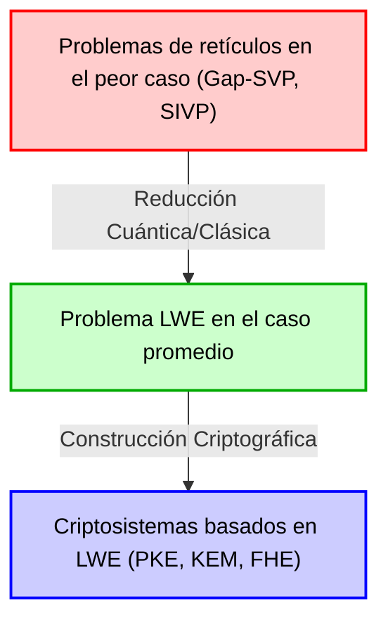
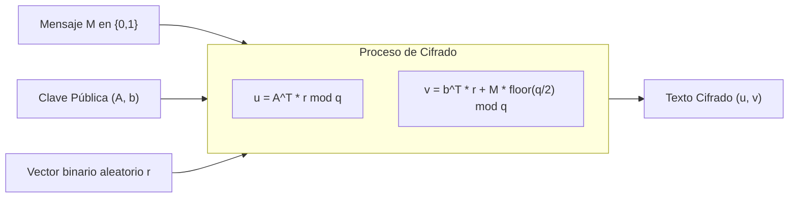
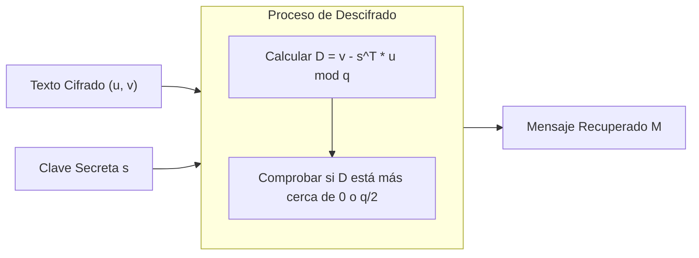

# 1. Introducción: El amanecer de la criptografía poscuántica (PQC) y el auge de la criptografía basada en retículos

La infraestructura digital de la sociedad moderna se basa en tecnologías de criptografía de clave pública, como el cifrado RSA y la criptografía de curva elíptica (ECC). Estos métodos basan su seguridad en la dificultad matemática de problemas como la "factorización de enteros" o el "logaritmo discreto", los cuales se cree que no pueden resolverse eficientemente (requieren tiempo exponencial) con computadoras clásicas convencionales.

Sin embargo, el "Algoritmo de Shor", publicado por Peter Shor en 1994, sacudió el mundo de la criptografía. Este algoritmo demostró matemáticamente que una vez que se construyan computadoras cuánticas a gran escala, estas podrán resolver los problemas de factorización de enteros y de logaritmo discreto en tiempo polinomial. Esto significa que la criptografía de clave pública ampliamente utilizada en la actualidad se volverá completamente descifrable en el futuro.

Para contrarrestar esta "Amenaza Cuántica (Quantum Threat)", se hizo imperativo investigar nuevos métodos de cifrado que sean difíciles de descifrar incluso utilizando computadoras cuánticas. Este es el campo conocido como "Criptografía Poscuántica (Post-Quantum Cryptography: PQC)" o "Criptografía resistente a la computación cuántica".

Existen varios candidatos prometedores para la PQC, como la criptografía basada en hashes, la criptografía basada en códigos, la criptografía multivariable y la criptografía basada en isogenias. Sin embargo, el método que actualmente atrae más la atención y que está en el centro del proceso de estandarización de PQC por parte del NIST (Instituto Nacional de Estándares y Tecnología de EE. UU.) es la "Criptografía basada en retículos (Lattice-based cryptography)". En comparación con otros métodos, la criptografía de retículos ofrece velocidades de cifrado y descifrado muy rápidas, y cuenta con una característica destacada: una prueba de seguridad extremadamente sólida en la teoría criptográfica basada en la reducción de la "complejidad en el peor de los casos (Worst-case complexity)" a la "complejidad en el caso promedio (Average-case complexity)".

En este artículo, partiremos de la definición matemática de "Retículo (Lattice)", que es la base de esta criptografía, y explicaremos profundamente mediante fórmulas, intuición geométrica y ejemplos numéricos específicos los problemas difíciles sobre retículos como SVP (Problema del vector más corto) y CVP (Problema del vector más cercano), y el corazón de la criptografía de retículos moderna, el "Problema LWE (Learning With Errors)".

# 2. Definición matemática e intuición geométrica de un Retículo (Lattice)

## 2.1 Espacio vectorial y retículos
En matemáticas, un "Retículo (Lattice)" es un conjunto discreto de puntos dispuestos regularmente en un espacio vectorial real de $n$ dimensiones $\mathbb{R}^n$. Es similar al espacio vectorial (Vector Space) que se estudia en álgebra lineal, pero existe una diferencia crucial. Mientras que un espacio vectorial es un espacio continuo representado por combinaciones lineales de vectores base con "coeficientes reales", un retículo es un espacio discreto representado por combinaciones lineales de vectores base con "coeficientes enteros".

Demos una definición matemática rigurosa. Consideremos $n$ vectores linealmente independientes $\mathbf{b}_1, \mathbf{b}_2, \dots, \mathbf{b}_n$ (donde $n \le m$) en un espacio vectorial real de $m$ dimensiones $\mathbb{R}^m$. Sea $B = [\mathbf{b}_1, \mathbf{b}_2, \dots, \mathbf{b}_n] \in \mathbb{R}^{m \times n}$ una matriz que tiene estos vectores como columnas. Llamamos a esta $B$ la "Base (Basis)" del retículo.

El retículo $\mathcal{L}(B)$ generado por esta base $B$ se define de la siguiente manera:

$$
\mathcal{L}(B) = \left\{ \sum_{i=1}^{n} x_i \mathbf{b}_i \mathrel{\bigg|} x_i \in \mathbb{Z} \right\} = \{ B \mathbf{x} \mid \mathbf{x} \in \mathbb{Z}^n \}
$$

Lo importante aquí es que los coeficientes $x_i$ están limitados a números enteros $\mathbb{Z}$, en lugar de números reales $\mathbb{R}$. Como resultado, en lugar de puntos continuos que existen en un número infinito en el espacio, se forma un "conjunto discreto de puntos" similar a las intersecciones espaciadas uniformemente en una cuadrícula.

## 2.2 Imagen geométrica
Consideremos un ejemplo en el plano bidimensional $\mathbb{R}^2$. Si elegimos los vectores base $\mathbf{b}_1 = \begin{pmatrix} 1 \\ 0 \end{pmatrix}$ y $\mathbf{b}_2 = \begin{pmatrix} 0 \\ 1 \end{pmatrix}$, el retículo generado por ellos será el conjunto de todas las coordenadas enteras $(x, y) \in \mathbb{Z}^2$ en el plano cartesiano. Este es el "retículo cuadrado" más simple.

Sin embargo, los retículos no siempre son ortogonales. Por ejemplo, considerando una base como $\mathbf{b}_1 = \begin{pmatrix} 2 \\ 1 \end{pmatrix}$ y $\mathbf{b}_2 = \begin{pmatrix} 1 \\ 3 \end{pmatrix}$, los puntos generados se parecerán a las intersecciones de una malla sesgada diagonalmente.

## 2.3 No unicidad de la base y transformación unimodular
Existe una propiedad importante relacionada con la base de la seguridad de la criptografía de retículos: "existen infinitas bases que generan el mismo retículo".

Por ejemplo, el retículo $\mathbb{Z}^2$ generado por la base $\mathbf{b}_1 = (1, 0)^T, \mathbf{b}_2 = (0, 1)^T$ mencionada anteriormente es exactamente el mismo retículo $\mathbb{Z}^2$ que el generado por la base $\mathbf{b}'_1 = (1, 1)^T, \mathbf{b}'_2 = (2, 3)^T$.

La condición necesaria y suficiente para que una base $B$ y otra base $B'$ generen el mismo retículo es que exista una matriz con componentes enteros $U \in \mathbb{Z}^{n \times n}$ cuyo determinante sea $\det(U) = \pm 1$, tal que:
$$ B' = B U $$
A una matriz $U$ de este tipo se le llama "Matriz unimodular (Unimodular matrix)".

La idea básica en la aplicación a la criptografía es utilizar una "buena base" (una base casi ortogonal formada por vectores cortos) como clave privada, y una "mala base" (una base con vectores extremadamente oblicuos entre sí y muy largos) como clave pública. Calcular una buena base a partir de una mala base se vuelve muy difícil a medida que aumentan las dimensiones. Esta es la intuición básica de la criptografía basada en retículos.

# 3. Problemas computacionalmente difíciles en retículos

La seguridad de la criptografía basada en retículos depende de la dificultad de resolver problemas matemáticos específicos en los retículos. Aquí presentaremos dos de los problemas más fundamentales y conocidos.

## 3.1 Problema del vector más corto (Shortest Vector Problem: SVP)
SVP es el problema más clásico y famoso de la teoría de retículos.

**Definición (SVP):**
Dada una base de retículo arbitraria $B$, encontrar el vector $\mathbf{v}$ distinto de cero que pertenece al retículo $\mathcal{L}(B)$ y tiene la norma euclidiana (longitud) mínima.

Expresado en fórmula matemática, es el problema de encontrar $\mathbf{v}$ tal que $\min_{\mathbf{v} \in \mathcal{L}(B) \setminus \{\mathbf{0}\}} \| \mathbf{v} \|$. A esta longitud mínima se le denota como $\lambda_1(\mathcal{L})$ y se le llama "Primer mínimo sucesivo (First successive minimum) del retículo".

En dimensiones bajas como 2 o 3, podemos encontrar el vector más corto visualmente dibujando un gráfico, o podemos resolverlo eficientemente usando algoritmos como el algoritmo de reducción de bases de Gauss. Sin embargo, cuando la dimensión $n$ alcanza valores altos como cientos o miles, se sabe que resolver estrictamente SVP es NP-difícil.

En criptografía real, no se busca el vector más corto estricto, sino que se utiliza un SVP aproximado ($\gamma$-SVP) para encontrar un "vector aproximadamente corto". Si el factor de aproximación $\gamma$ es de tamaño polinomial, este problema se sigue considerando extremadamente difícil.

## 3.2 Problema del vector más cercano (Closest Vector Problem: CVP)
CVP es también un problema de extrema importancia en la criptografía basada en retículos.

**Definición (CVP):**
Dada una base de retículo arbitraria $B$ y un vector objetivo arbitrario $\mathbf{t} \in \mathbb{R}^m$ en el espacio (que no necesariamente es un punto del retículo), encontrar el punto del retículo $\mathbf{v} \in \mathcal{L}(B)$ más cercano a $\mathbf{t}$.

Expresado matemáticamente, es el problema de buscar un punto de retículo $\mathbf{v}$ tal que $\min_{\mathbf{v} \in \mathcal{L}(B)} \| \mathbf{v} - \mathbf{t} \|$.

Al igual que SVP, CVP también es NP-difícil en altas dimensiones. Desde la perspectiva de la aplicación criptográfica, el problema LWE que discutiremos más adelante está estrechamente relacionado con una variante especial de este CVP (Decodificación de distancia acotada o Bounded Distance Decoding: BDD).

## 3.3 ¿Por qué es insoluble en altas dimensiones? (Los límites de LLL y BKZ)
Un algoritmo famoso para resolver problemas de retículos de altas dimensiones es el algoritmo LLL (Lenstra-Lenstra-Lovász algorithm). El algoritmo LLL se ejecuta en tiempo polinomial y puede reducir en cierta medida la base del retículo a una "buena base". Sin embargo, el vector más corto que el algoritmo LLL puede encontrar tiene un factor de aproximación exponencial ($2^{\mathcal{O}(n)}$) en relación con la longitud del vector más corto verdadero, por lo que no es suficiente para romper la seguridad criptográfica.

Si se utiliza un algoritmo de reducción de bases más potente como el algoritmo BKZ (Block Korkine-Zolotarev), que es una mejora de LLL, se pueden encontrar vectores más cortos, pero su complejidad computacional aumenta exponencialmente con respecto al tamaño del bloque. En la criptografía de retículos, los parámetros seguros (como el tamaño de la dimensión $n$) se determinan estimando el tiempo de ejecución de este algoritmo BKZ. Con los parámetros estándar actuales de PQC, se eligen dimensiones $n$ de 500 a 1000 o más, y se considera que descifrarlos tomaría más tiempo que la edad del universo, incluso utilizando supercomputadoras o futuras computadoras cuánticas.

# 4. Formulación matemática del problema LWE (Learning With Errors)

La mayor parte de la criptografía de retículos moderna se basa en el "Problema LWE (Learning With Errors)" propuesto por Oded Regev en 2005. La belleza del problema LWE radica en la simplicidad de su formulación y en el hecho de que cuenta con una poderosa prueba matemática de "reducción de la complejidad en el peor caso a la complejidad en el caso promedio".

## 4.1 Sistema de ecuaciones lineales sin ruido
Para entender el problema LWE, primero consideremos un simple sistema de ecuaciones lineales sin ruido.
Supongamos que hay un vector secreto desconocido $\mathbf{s} \in \mathbb{Z}_q^n$ (donde cada componente es un número entero de $0$ a $q-1$). Aquí $q$ es un número primo.

Elegimos vectores de coeficientes aleatorios $\mathbf{a}_1, \mathbf{a}_2, \dots \in \mathbb{Z}_q^n$ y calculamos su producto interno con el vector secreto $\mathbf{s}$ módulo $q$.
$b_1 = \langle \mathbf{a}_1, \mathbf{s} \rangle \pmod q$
$b_2 = \langle \mathbf{a}_2, \mathbf{s} \rangle \pmod q$
$\vdots$

Si se nos da un número suficiente (al menos $n$) de pares $(\mathbf{a}_i, b_i)$, podemos recuperar fácilmente el vector secreto $\mathbf{s}$ usando la "Eliminación de Gauss (Gaussian elimination)" de álgebra lineal. Este es un problema que puede resolverse fácilmente en tiempo polinomial.

## 4.2 Definición del problema LWE: Agregando ruido
Entonces, ¿qué sucedería si añadimos un ligero "ruido (error)" a este problema?
Esta es la esencia del problema LWE.

Para el vector secreto desconocido $\mathbf{s} \in \mathbb{Z}_q^n$, añadimos un pequeño error $e_i \in \mathbb{Z}_q$ al resultado de cada ecuación.
$b_i = \langle \mathbf{a}_i, \mathbf{s} \rangle + e_i \pmod q$

Aquí, $e_i$ es un pequeño valor entero con media 0 y una desviación estándar relativamente pequeña (por ejemplo, elegido de una distribución gaussiana discreta, similar a una distribución normal).
La información proporcionada es una lista de pares de un vector aleatorio $\mathbf{a}_i$ y $b_i$ calculado añadiendo un error.
$( \mathbf{a}_1, b_1 ), ( \mathbf{a}_2, b_2 ), \dots, ( \mathbf{a}_m, b_m )$

Representar esto en forma matricial lo hace muy claro.
Usando una matriz aleatoria $A \in \mathbb{Z}_q^{m \times n}$, un vector secreto $\mathbf{s} \in \mathbb{Z}_q^n$ y un vector de error $\mathbf{e} \in \mathbb{Z}_q^m$:
$$ \mathbf{b} = A \mathbf{s} + \mathbf{e} \pmod q $$
Solo se nos proporciona $A$ y $\mathbf{b}$. Encontrar $\mathbf{s}$ a partir de aquí es el "Problema de búsqueda LWE (Search LWE problem)".

Debido a que el error $e_i$ está presente, intentar usar la eliminación de Gauss amplificaría el error de forma exponencial durante el proceso de sumar y restar ecuaciones, haciendo imposible llegar a la respuesta correcta. A primera vista, parece un simple sistema de ecuaciones lineales, pero al agregar este pequeño ruido, la dificultad del problema se eleva al nivel de NP-difícil.

## 4.3 Problema LWE de decisión (Decision LWE)
En las pruebas de la teoría criptográfica, la variante frecuentemente utilizada es el "Problema LWE de decisión (Decision LWE problem)", que es una variante del problema de búsqueda LWE.

El problema LWE de decisión es el problema de determinar de cuál de las siguientes dos distribuciones proviene una lista de muestras dada:
1. **Distribución LWE**: $(A, \mathbf{b} = A\mathbf{s} + \mathbf{e} \pmod q)$ calculada intencionadamente.
2. **Distribución aleatoria uniforme**: $(A, \mathbf{u})$ formada por una matriz $A$ y un vector $\mathbf{u}$ elegidos de forma completamente aleatoria.

Sorprendentemente, si se eligen adecuadamente los parámetros del problema LWE, los pares obtenidos de la distribución LWE se vuelven "computacionalmente indistinguibles (Computationally Indistinguishable)" de los pares de datos completamente aleatorios. Esta propiedad es la base que permite a la criptografía basada en LWE generar "textos cifrados indistinguibles de números aleatorios".

## 4.4 Reducción de la complejidad en el peor caso a la del caso promedio (Teorema de Regev)
El mayor logro de Oded Regev fue vincular matemáticamente la dificultad de este problema LWE con la dificultad de los problemas de retículos mencionados anteriormente (SVP y CVP).

Utilizó la reducción cuántica (Quantum reduction) para demostrar que "si existe un algoritmo de tiempo polinomial capaz de resolver el problema LWE en el caso promedio (para $A$ y $\mathbf{e}$ elegidos al azar), entonces existe un algoritmo cuántico de tiempo polinomial capaz de resolver el Gap-SVP en el peor caso (el caso más difícil) para cualquier retículo". (Posteriormente, Peikert y otros también demostraron una reducción clásica).

Esta es una propiedad soñada en la teoría criptográfica. Esto se debe a que disipa la preocupación de que "la criptografía podría romperse si por casualidad elegimos una clave débil (una parte del caso promedio)" y ofrece una fuerte garantía de que "si se puede resolver el LWE promedio, entonces se pueden resolver todos los problemas difíciles del retículo (por lo tanto, el LWE es absolutamente difícil)".

# 5. Construcción de un sistema de criptografía de clave pública utilizando LWE (Criptografía de Regev)

Habiendo entendido la dificultad del problema LWE, veamos cómo funciona el cifrado y descifrado usándolo en el sistema de criptografía de clave pública básico propuesto por Oded Regev. Aquí explicaremos el mecanismo más básico para cifrar un mensaje de 1 bit $M \in \{0, 1\}$.

## 5.1 Generación de claves (Key Generation)
1. Como parámetros del sistema, se determinan el módulo primo $q$, la dimensión $n$ y el número de ecuaciones $m$ ($m > n \log q$).
2. Se elige al azar el vector secreto $\mathbf{s} \in \mathbb{Z}_q^n$ como clave privada.
3. Se genera una matriz aleatoria $A \in \mathbb{Z}_q^{m \times n}$.
4. Se selecciona un pequeño vector de error $\mathbf{e} \in \mathbb{Z}_q^m$ a partir de una distribución de errores como la distribución gaussiana discreta.
5. Se calcula el vector $\mathbf{b} = A \mathbf{s} + \mathbf{e} \pmod q$.
6. La clave pública (Public Key) será $(A, \mathbf{b})$.
7. La clave secreta o privada (Secret Key) será $\mathbf{s}$.

La clave pública es precisamente una "instancia del problema LWE". Dado que derivar la clave secreta $\mathbf{s}$ a partir de la clave pública $(A, \mathbf{b})$ equivale a resolver el problema de búsqueda LWE, la seguridad está garantizada.

## 5.2 Cifrado (Encryption)
Alice cifra un mensaje de 1 bit $M \in \{0, 1\}$ utilizando la clave pública de Bob $(A, \mathbf{b})$.

1. Elige un vector binario aleatorio (con componentes 0 o 1) $\mathbf{r} \in \{0, 1\}^m$.
2. Como primera parte del texto cifrado, calcula el vector $\mathbf{u} = A^T \mathbf{r} \pmod q$. ($A^T$ es la matriz transpuesta de $A$. Es decir, suma las filas de $A$ donde el componente de $\mathbf{r}$ es 1).
3. Como segunda parte del texto cifrado, calcula el escalar $v = \mathbf{b}^T \mathbf{r} + M \cdot \lfloor \frac{q}{2} \rfloor \pmod q$.
   (Si el mensaje $M$ es 0, no suma nada; si es $1$, suma exactamente la mitad del valor de $q$, $\lfloor \frac{q}{2} \rfloor$).
4. El texto cifrado (Ciphertext) será $(\mathbf{u}, v)$.

La implicación intuitiva del cifrado es tomar la "suma de un subconjunto aleatorio" de la matriz de la clave pública $A$ y del vector $\mathbf{b}$. Debido a la dificultad del problema LWE de decisión, este texto cifrado $(\mathbf{u}, v)$ parece indistinguible de un vector completamente aleatorio y de un número aleatorio uniforme (Seguridad semántica: Semantic Security).

## 5.3 Descifrado (Decryption)
Bob descifra el texto cifrado $(\mathbf{u}, v)$ usando su clave secreta $\mathbf{s}$.

1. Calcula el siguiente valor: $D = v - \mathbf{s}^T \mathbf{u} \pmod q$
2. Si el resultado calculado está cerca de $0$, la salida es $M=0$; si está cerca de $\lfloor \frac{q}{2} \rfloor$, la salida es $M=1$.

Desarrollemos matemáticamente por qué se puede descifrar con esto.
Recuerde que $\mathbf{b} = A \mathbf{s} + \mathbf{e}$.

$$
\begin{aligned}
v - \mathbf{s}^T \mathbf{u} &= (\mathbf{b}^T \mathbf{r} + M \cdot \lfloor \frac{q}{2} \rfloor) - \mathbf{s}^T (A^T \mathbf{r}) \\
&= ((A \mathbf{s} + \mathbf{e})^T \mathbf{r} + M \cdot \lfloor \frac{q}{2} \rfloor) - \mathbf{s}^T A^T \mathbf{r} \\
&= (\mathbf{s}^T A^T \mathbf{r} + \mathbf{e}^T \mathbf{r} + M \cdot \lfloor \frac{q}{2} \rfloor) - \mathbf{s}^T A^T \mathbf{r} \\
&= \mathbf{e}^T \mathbf{r} + M \cdot \lfloor \frac{q}{2} \rfloor \pmod q
\end{aligned}
$$

Aquí, $\mathbf{s}^T A^T \mathbf{r}$ se cancela claramente y desaparece de la ecuación.
Lo que queda es $\mathbf{e}^T \mathbf{r} + M \cdot \lfloor \frac{q}{2} \rfloor$.

$\mathbf{e}$ es un vector de ruido con componentes muy pequeños, y $\mathbf{r}$ es un vector binario con componentes de 0 o 1. Por lo tanto, su producto interno $\mathbf{e}^T \mathbf{r}$ también permanece como un valor relativamente pequeño (si los parámetros se eligen adecuadamente).

- Si $M=0$, el resultado es $\mathbf{e}^T \mathbf{r}$, que será un valor pequeño cerca de $0$.
- Si $M=1$, el resultado es $\mathbf{e}^T \mathbf{r} + \lfloor \frac{q}{2} \rfloor$, que se situará alrededor de la mitad del valor de $q$, $\lfloor \frac{q}{2} \rfloor$.

Si los parámetros están diseñados para que el valor absoluto del error $\mathbf{e}^T \mathbf{r}$ sea menor a $\frac{q}{4}$, Bob puede determinar (descifrar) con precisión el mensaje $M$ simplemente verificando si el resultado del cálculo está más cerca de $0$ o de $\lfloor \frac{q}{2} \rfloor$. Este es el hermoso mecanismo por el cual funciona la criptografía basada en LWE.

# 6. Ejemplo ilustrativo de criptografía LWE usando valores numéricos específicos

Es posible que resulte difícil comprender solo con una lista de fórmulas matemáticas, así que intentemos establecer parámetros numéricos muy pequeños y seguir los cálculos desde el cifrado hasta el descifrado.
(* En un sistema de criptografía real, se utilizan valores para $n$ mayores de 500 y para $q$ valores de miles o más para garantizar la seguridad).

**[Configuración de parámetros]**
- Módulo $q = 17$ (Un número primo. Por tanto, los valores están en el rango de $0$ a $16$).
- Dimensión $n = 2$
- Número de ecuaciones $m = 4$
- Supondremos que se cifrará el mensaje $M = 1$.
- Cantidad de desplazamiento del mensaje: $\lfloor \frac{q}{2} \rfloor = \lfloor \frac{17}{2} \rfloor = 8$

**[1. Fase de generación de claves]**
Bob elige su clave secreta $\mathbf{s}$, la matriz $A$ y el vector de error $\mathbf{e}$ al azar.
$$ \mathbf{s} = \begin{pmatrix} 3 \\ 4 \end{pmatrix} \in \mathbb{Z}_{17}^2 $$
$$ A = \begin{pmatrix} 2 & 15 \\ 1 & 8 \\ 14 & 5 \\ 9 & 10 \end{pmatrix} \in \mathbb{Z}_{17}^{4 \times 2} $$
$$ \mathbf{e} = \begin{pmatrix} 1 \\ -1 \\ 0 \\ 2 \end{pmatrix} \equiv \begin{pmatrix} 1 \\ 16 \\ 0 \\ 2 \end{pmatrix} \pmod{17} $$

Luego calcula la clave pública $\mathbf{b}$.
$$ A \mathbf{s} = \begin{pmatrix} 2 & 15 \\ 1 & 8 \\ 14 & 5 \\ 9 & 10 \end{pmatrix} \begin{pmatrix} 3 \\ 4 \end{pmatrix} = \begin{pmatrix} 2\times 3 + 15\times 4 \\ 1\times 3 + 8\times 4 \\ 14\times 3 + 5\times 4 \\ 9\times 3 + 10\times 4 \end{pmatrix} = \begin{pmatrix} 6 + 60 \\ 3 + 32 \\ 42 + 20 \\ 27 + 40 \end{pmatrix} = \begin{pmatrix} 66 \\ 35 \\ 62 \\ 67 \end{pmatrix} $$
Calculando esto módulo 17 (como $66 = 17 \times 3 + 15$ etc.):
$$ A \mathbf{s} \pmod{17} = \begin{pmatrix} 15 \\ 1 \\ 11 \\ 16 \end{pmatrix} $$
Sumando el vector de error $\mathbf{e}$:
$$ \mathbf{b} = A \mathbf{s} + \mathbf{e} = \begin{pmatrix} 15 \\ 1 \\ 11 \\ 16 \end{pmatrix} + \begin{pmatrix} 1 \\ 16 \\ 0 \\ 2 \end{pmatrix} = \begin{pmatrix} 16 \\ 17 \\ 11 \\ 18 \end{pmatrix} \equiv \begin{pmatrix} 16 \\ 0 \\ 11 \\ 1 \end{pmatrix} \pmod{17} $$

La clave pública es $A$ y $\mathbf{b} = (16, 0, 11, 1)^T$.

**[2. Fase de cifrado]**
Alice cifra el mensaje $M = 1$.
Elige un vector aleatorio $\mathbf{r}$. Aquí usaremos $\mathbf{r} = (1, 0, 1, 0)^T$.

Calcula $\mathbf{u}$:
$$ \mathbf{u} = A^T \mathbf{r} = \begin{pmatrix} 2 & 1 & 14 & 9 \\ 15 & 8 & 5 & 10 \end{pmatrix} \begin{pmatrix} 1 \\ 0 \\ 1 \\ 0 \end{pmatrix} = \begin{pmatrix} 2 \times 1 + 14 \times 1 \\ 15 \times 1 + 5 \times 1 \end{pmatrix} = \begin{pmatrix} 16 \\ 20 \end{pmatrix} \equiv \begin{pmatrix} 16 \\ 3 \end{pmatrix} \pmod{17} $$

Calcula $v$:
$$ \mathbf{b}^T \mathbf{r} = (16, 0, 11, 1) \begin{pmatrix} 1 \\ 0 \\ 1 \\ 0 \end{pmatrix} = 16 \times 1 + 11 \times 1 = 27 \equiv 10 \pmod{17} $$
Suma el valor correspondiente al mensaje $M=1$, $\lfloor 17/2 \rfloor = 8$:
$$ v = \mathbf{b}^T \mathbf{r} + M \cdot 8 = 10 + 1 \times 8 = 18 \equiv 1 \pmod{17} $$

Alice envía el texto cifrado $(\mathbf{u}, v) = \left( \begin{pmatrix} 16 \\ 3 \end{pmatrix}, 1 \right)$ a Bob.

**[3. Fase de descifrado]**
Bob, al recibir el texto cifrado, lo descifra usando su clave secreta $\mathbf{s} = (3, 4)^T$.
Fórmula de descifrado: Calcula $D = v - \mathbf{s}^T \mathbf{u} \pmod{17}$.

$$ \mathbf{s}^T \mathbf{u} = (3, 4) \begin{pmatrix} 16 \\ 3 \end{pmatrix} = 3 \times 16 + 4 \times 3 = 48 + 12 = 60 \equiv 9 \pmod{17} $$
$$ D = v - \mathbf{s}^T \mathbf{u} = 1 - 9 = -8 \pmod{17} $$

Aquí, en el mundo del módulo 17, $-8$ es igual a $9$ ($-8 + 17 = 9$).
Determina si el valor obtenido $D = 9$ está más cerca de $0$ o de $8$ ($\lfloor 17/2 \rfloor$).
Dado que $9$ está claramente más cerca de $8$ que de $0$, ¡Bob logra restaurar correctamente $M = 1$!

¿Por qué resultó 9? Recordemos la prueba anterior.
La parte de error es $\mathbf{e}^T \mathbf{r} = (1, -1, 0, 2) (1, 0, 1, 0)^T = 1 \times 1 + 0 \times 1 = 1$.
Por lo tanto, el resultado del cálculo es $\mathbf{e}^T \mathbf{r} + M \cdot 8 = 1 + 8 = 9$, confirmando que se ha calculado el valor tal como en la teoría.

# 7. Evolución hacia la aplicación práctica: Ring-LWE y Module-LWE

El problema LWE estándar (Standard LWE) explicado hasta ahora tiene pruebas de seguridad muy sólidas, pero en la práctica tiene defectos fatales. Estos son el "tamaño gigante de las claves" y el "alto costo computacional".

En Standard LWE, la clave pública incluye una matriz gigante $A \in \mathbb{Z}_q^{m \times n}$. Cuando el parámetro $n$ alcanza cifras entre cientos y miles, el tamaño de esta matriz llega a varios megabytes, lo que la hace demasiado pesada para enviar y recibir cada vez a través de protocolos de comunicación en internet (como TLS). Además, la multiplicación de matrices y vectores requiere una complejidad computacional de $\mathcal{O}(n^2)$.

Para resolver estos problemas se introdujeron el "Ring-LWE (RLWE)" y el "Module-LWE (MLWE)", que incorporan estructuras algebraicas llamadas anillos de polinomios (Polynomial rings) en los retículos.

## 7.1 Intuición de Ring-LWE
En Ring-LWE, los vectores y matrices se sustituyen por elementos (polinomios) de un anillo de polinomios $\mathcal{R}_q = \mathbb{Z}_q[X]/(X^n + 1)$. (Donde $n$ se elige como una potencia de 2).

Mientras que la clave pública en Standard LWE era una matriz $A$, en Ring-LWE se utiliza un solo polinomio $a(x)$. La clave secreta $s(x)$ y el error $e(x)$ también se convierten en polinomios.
La ecuación queda de la siguiente manera:
$$ b(x) = a(x) \cdot s(x) + e(x) \pmod q $$

Al tratarse de multiplicación de polinomios, utilizando la "Transformada Teórica de Números (Number Theoretic Transform: NTT)", que es similar a la Transformada Rápida de Fourier (FFT), la complejidad computacional se puede reducir drásticamente a $\mathcal{O}(n \log n)$. Además, debido a que el tamaño de la clave pública se reduce de una matriz a un solo polinomio, el tamaño de los datos se reduce a $\mathcal{O}(n)$. Esto proporciona una ventaja abrumadora en términos de ancho de banda de comunicación.

Matemáticamente, Ring-LWE se reduce a problemas en retículos con una simetría especial conocidos como "Retículos Ideales (Ideal Lattices)" en lugar de retículos generales.

## 7.2 Module-LWE y Estandarización del NIST (Kyber / ML-KEM)
Aunque Ring-LWE es eficiente, había una ligera preocupación de que la estructura algebraica especial del retículo ideal pudiera ser la base para futuros ataques. Por lo tanto, el "Module-LWE (MLWE)" tomó "lo mejor de ambos mundos": la seguridad conservadora de Standard LWE y la eficiencia de Ring-LWE.

En Module-LWE, consideramos matrices y vectores pequeños cuyos elementos son polinomios. Es decir, manejamos módulos sobre anillos.
Actualmente, "CRYSTALS-Kyber" (Nombre estandarizado: ML-KEM), que ha sido seleccionado por el NIST como estándar para el algoritmo de intercambio de claves PQC (KEM), está construido precisamente en base a la dificultad de este problema Module-LWE.

# 8. ¿Por qué es seguro contra las computadoras cuánticas?

Finalmente, tocaremos el núcleo de la pregunta: "¿Por qué se cree que la criptografía basada en retículos no se puede descifrar ni siquiera usando computadoras cuánticas?"

El algoritmo de Shor, que hace que las computadoras cuánticas rompan RSA y ECC, es esencialmente un algoritmo para resolver el "Problema del Subgrupo Oculto (Hidden Subgroup Problem: HSP)". La estructura matemática (grupos abelianos finitos) detrás de RSA y ECC tiene periodicidad, y al usar una operación cuántica específica llamada Transformada Cuántica de Fourier (QFT), este período (el subgrupo oculto) se puede extraer de una vez.

Sin embargo, los problemas de retículos son fundamentalmente diferentes. Aunque los retículos también tienen periodicidad, lo que se busca en SVP y CVP son propiedades geométricas no lineales, como la "distancia más corta" o la "eliminación del ruido". Incluso aplicando directamente la "Transformada Cuántica de Fourier sobre un grupo abeliano" como en el algoritmo de Shor, no se puede extraer eficientemente información útil que resuelva el problema del retículo. Hasta la fecha, no se han descubierto algoritmos cuánticos capaces de resolver SVP o LWE en tiempo polinomial, y se cree ampliamente que, a pesar del poder de cálculo paralelo de las computadoras cuánticas, el único método efectivo es una búsqueda casi exhaustiva (aproximadamente una aceleración de la raíz cuadrada mediante el algoritmo de Grover).

# 9. Conclusión

En este artículo, explicamos detalladamente la intuición matemática de la criptografía de retículos, comenzando con la definición geométrica de los retículos, seguido de la formulación del problema LWE, hasta la construcción de la criptografía de clave pública.

1. Un **Retículo (Lattice)** es un espacio discreto representado por combinaciones lineales con coeficientes enteros de vectores base, y en altas dimensiones resulta difícil encontrar una "buena base" casi ortogonal (SVP).
2. El **Problema LWE (Learning With Errors)** es un problema de resolver sistemas de ecuaciones lineales con ruido, y dado que esto está ligado a la dificultad del problema del retículo en el peor de los casos, proporciona una base sólida para la seguridad.
3. Utilizando el problema LWE, el cifrado y descifrado (**Criptografía de Regev**) se logran mediante un ingenioso mecanismo que intencionalmente añade y elimina el ruido.
4. En los protocolos reales, se emplean **Ring-LWE** o **Module-LWE** usando anillos de polinomios para aumentar la eficiencia de comunicación y la velocidad de cálculo, sirviendo como la base del estándar **ML-KEM** del NIST.

Con el cambio de paradigma computacional sin precedentes que representan las computadoras cuánticas acercándose, es muy fascinante que la "criptografía de retículos", nacida del abismo del álgebra lineal clásica y la teoría de números, se convierta en la base de la seguridad del internet del futuro. Las matemáticas subyacentes a la criptografía de retículos no son excesivamente complejas, y con conocimientos básicos de álgebra lineal y probabilidades, es perfectamente posible comprender su hermosa estructura. Esperamos que este artículo sirva de ayuda para comprender la criptografía de retículos, el núcleo de la PQC.
