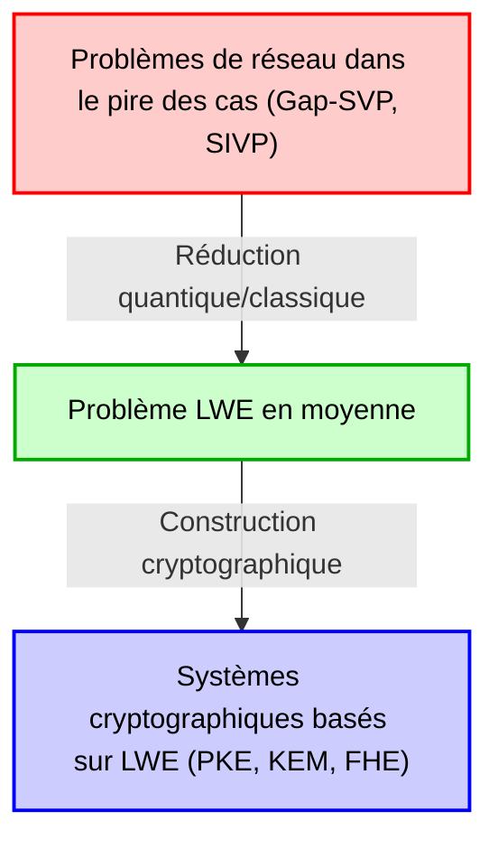
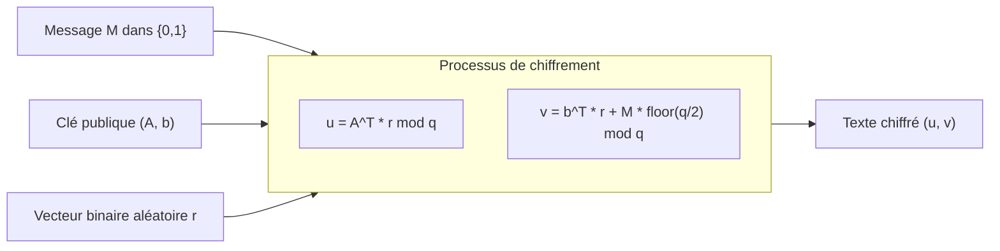
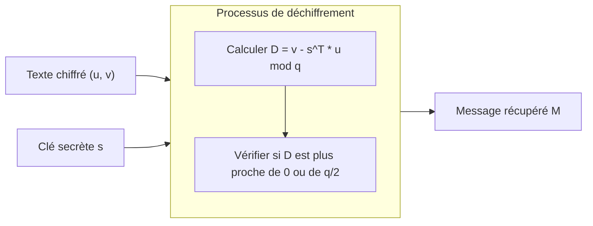

# 1. Introduction : L'aube de la cryptographie post-quantique (PQC) et l'essor de la cryptographie basée sur les réseaux

L'infrastructure numérique de la société moderne repose sur des technologies de cryptographie à clé publique telles que le chiffrement RSA et la cryptographie sur les courbes elliptiques (ECC). Ces méthodes cryptographiques basent leur sécurité sur la difficulté mathématique de problèmes tels que le "problème de la factorisation en nombres premiers" ou le "problème du logarithme discret", qui sont considérés comme impossibles à résoudre efficacement (nécessitant un temps exponentiel) par les ordinateurs classiques conventionnels.

Cependant, en 1994, l'algorithme de Shor, publié par Peter Shor, a provoqué une onde de choc dans le monde de la cryptographie. Cet algorithme a prouvé mathématiquement qu'une fois qu'un ordinateur quantique à grande échelle sera réalisé, il pourra résoudre les problèmes de factorisation en nombres premiers et de logarithme discret en un temps polynomial. Cela signifie que la cryptographie à clé publique largement utilisée aujourd'hui deviendra complètement décryptable à l'avenir.

Pour contrer cette "menace quantique (Quantum Threat)", il est devenu urgent de rechercher de nouvelles méthodes cryptographiques difficiles à décrypter, même avec un ordinateur quantique. C'est le domaine appelé "Cryptographie Post-Quantique (Post-Quantum Cryptography : PQC)" ou "Cryptographie résistante aux ordinateurs quantiques".

Il existe plusieurs candidats prometteurs pour la PQC, tels que la cryptographie basée sur les fonctions de hachage, sur les codes, sur des polynômes multivariés et sur les isogénies. Parmi eux, celle qui attire actuellement le plus l'attention et qui est au cœur du processus de standardisation PQC par le NIST (Institut national des normes et de la technologie des États-Unis) est la "cryptographie basée sur les réseaux (Lattice-based cryptography)". Comparée à d'autres méthodes, la cryptographie basée sur les réseaux se distingue par une vitesse de traitement très élevée pour le chiffrement et le déchiffrement. De plus, elle possède une caractéristique remarquable en théorie cryptographique : une preuve de sécurité extrêmement solide basée sur la réduction de la "complexité dans le pire des cas (Worst-case complexity)" à la "complexité en moyenne (Average-case complexity)".

Dans cet article, nous partirons de la définition mathématique du "réseau (Lattice)" qui est à la base de cette cryptographie, pour expliquer en profondeur les problèmes difficiles sur les réseaux tels que le SVP (Problème du vecteur le plus court) et le CVP (Problème du vecteur le plus proche), ainsi que le problème LWE (Learning With Errors) qui est le cœur de la cryptographie moderne sur les réseaux. Nous utiliserons des formules mathématiques, des intuitions géométriques et des exemples numériques concrets.

# 2. Définition mathématique et intuition géométrique du réseau (Lattice)

## 2.1 Espace vectoriel et réseau
En mathématiques, un "réseau (Lattice)" est un ensemble de points discrets disposés de manière régulière dans un espace vectoriel réel à $n$ dimensions $\mathbb{R}^n$. Il ressemble à un espace vectoriel (Vector Space) étudié en algèbre linéaire, mais il présente une différence cruciale. Alors qu'un espace vectoriel est un espace continu représenté par des combinaisons linéaires de vecteurs de base avec des "coefficients réels", un réseau est un espace discret représenté par des combinaisons linéaires de vecteurs de base avec des "coefficients entiers".

Donnons une définition mathématique rigoureuse. Considérons $n$ vecteurs linéairement indépendants ($n \le m$) $\mathbf{b}_1, \mathbf{b}_2, \dots, \mathbf{b}_n$ dans un espace vectoriel réel à $m$ dimensions $\mathbb{R}^m$. La matrice dont les colonnes sont ces vecteurs est notée $B = [\mathbf{b}_1, \mathbf{b}_2, \dots, \mathbf{b}_n] \in \mathbb{R}^{m \times n}$. On appelle $B$ la "base (Basis)" du réseau.

Le réseau $\mathcal{L}(B)$ généré par cette base $B$ est défini comme suit :

$$
\mathcal{L}(B) = \left\{ \sum_{i=1}^{n} x_i \mathbf{b}_i \mathrel{\bigg|} x_i \in \mathbb{Z} \right\} = \{ B \mathbf{x} \mid \mathbf{x} \in \mathbb{Z}^n \}
$$

Ce qui est important ici, c'est que les coefficients $x_i$ sont restreints aux entiers $\mathbb{Z}$ et non aux nombres réels $\mathbb{R}$. Par conséquent, au lieu de former un nombre infini de points continus dans l'espace, cela forme un "ensemble de points discrets" semblables à des intersections espacées uniformément.

## 2.2 Image géométrique
Considérons l'exemple du plan bidimensionnel $\mathbb{R}^2$. Si nous choisissons les vecteurs de base $\mathbf{b}_1 = \begin{pmatrix} 1 \\ 0 \end{pmatrix}$ et $\mathbf{b}_2 = \begin{pmatrix} 0 \\ 1 \end{pmatrix}$, le réseau généré par ceux-ci est l'ensemble de toutes les coordonnées entières $(x, y) \in \mathbb{Z}^2$ sur le plan cartésien. C'est le "réseau carré" le plus simple.

Cependant, les réseaux ne sont pas toujours orthogonaux. Par exemple, si nous considérons la base $\mathbf{b}_1 = \begin{pmatrix} 2 \\ 1 \end{pmatrix}$ et $\mathbf{b}_2 = \begin{pmatrix} 1 \\ 3 \end{pmatrix}$, les points générés ressembleront aux intersections d'une maille déformée en biais.

## 2.3 Non-unicité de la base et transformation unimodulaire
Il existe une propriété importante liée au fondement de la sécurité de la cryptographie sur les réseaux : "Il existe une infinité de bases qui génèrent le même réseau".

Par exemple, la base $\mathbf{b}_1 = (1, 0)^T, \mathbf{b}_2 = (0, 1)^T$ qui génère le réseau $\mathbb{Z}^2$, génère exactement le même réseau $\mathbb{Z}^2$ si nous utilisons la base $\mathbf{b}'_1 = (1, 1)^T, \mathbf{b}'_2 = (2, 3)^T$.

Une condition nécessaire et suffisante pour qu'une base $B$ et une autre base $B'$ génèrent le même réseau est l'existence d'une matrice à coefficients entiers $U \in \mathbb{Z}^{n \times n}$ avec un déterminant $\det(U) = \pm 1$, telle que
$$ B' = B U $$
Une telle matrice $U$ est appelée "matrice unimodulaire (Unimodular matrix)".

L'idée fondamentale dans son application à la cryptographie est d'utiliser une "bonne base (une base proche de l'orthogonalité, composée de vecteurs courts)" comme clé privée, et une "mauvaise base (une base avec des vecteurs extrêmement obliques les uns par rapport aux autres et très longs)" comme clé publique. Calculer une bonne base à partir d'une mauvaise base devient extrêmement difficile à mesure que la dimension augmente. C'est l'intuition fondamentale de la cryptographie basée sur les réseaux.

# 3. Problèmes mathématiquement difficiles dans les réseaux

La sécurité de la cryptographie basée sur les réseaux repose sur la difficulté de résoudre certains problèmes mathématiques sur les réseaux. Nous présentons ici les deux problèmes les plus fondamentaux et célèbres.

## 3.1 Problème du vecteur le plus court (Shortest Vector Problem: SVP)
Le SVP est le problème le plus classique et célèbre de la théorie des réseaux.

**Définition (SVP) :**
Étant donné une base de réseau arbitraire $B$, trouver le vecteur $\mathbf{v}$ non nul appartenant à ce réseau $\mathcal{L}(B)$ qui a la norme euclidienne (longueur) minimale.

Mathématiquement, c'est le problème de trouver $\mathbf{v}$ tel que $\min_{\mathbf{v} \in \mathcal{L}(B) \setminus \{\mathbf{0}\}} \| \mathbf{v} \|$. Cette longueur minimale est notée $\lambda_1(\mathcal{L})$ et est appelée le "premier minimum successif (First successive minimum) du réseau".

En basse dimension, comme en 2 ou 3 dimensions, vous pouvez trouver le vecteur le plus court à l'œil nu en dessinant un graphique, ou bien le résoudre efficacement en utilisant l'algorithme de réduction de base de Gauss. Cependant, lorsque la dimension $n$ atteint des centaines ou des milliers de dimensions, il est connu que résoudre strictement le SVP est un problème NP-difficile.

Dans les systèmes cryptographiques réels, on utilise le SVP approché ($\gamma$-SVP), qui consiste à trouver un "vecteur approximativement court" au lieu du vecteur strictement le plus court. Lorsque le facteur d'approximation $\gamma$ est de taille polynomiale, ce problème est toujours considéré comme extrêmement difficile.

## 3.2 Problème du vecteur le plus proche (Closest Vector Problem: CVP)
Le CVP est également un problème extrêmement important dans la cryptographie sur les réseaux.

**Définition (CVP) :**
Étant donné une base de réseau arbitraire $B$ et un vecteur cible arbitraire $\mathbf{t} \in \mathbb{R}^m$ dans l'espace (qui n'est pas nécessairement un point du réseau), trouver le point du réseau $\mathbf{v} \in \mathcal{L}(B)$ qui est le plus proche de $\mathbf{t}$.

Mathématiquement, c'est le problème de trouver un point du réseau $\mathbf{v}$ tel que $\min_{\mathbf{v} \in \mathcal{L}(B)} \| \mathbf{v} - \mathbf{t} \|$.

Le CVP, tout comme le SVP, est NP-difficile en haute dimension. Du point de vue des applications cryptographiques, le problème LWE décrit ci-dessous est étroitement lié à une variante spéciale de ce CVP (Bounded Distance Decoding: BDD).

## 3.3 Pourquoi est-il impossible de les résoudre en haute dimension ? (Limites de LLL et BKZ)
L'algorithme LLL (algorithme de Lenstra-Lenstra-Lovász) est un algorithme célèbre pour résoudre les problèmes de réseau en haute dimension. L'algorithme LLL fonctionne en temps polynomial et peut réduire (Reduction) la base du réseau en une "bonne base" dans une certaine mesure. Cependant, le vecteur le plus court que l'algorithme LLL peut trouver a un facteur d'approximation exponentiel ($2^{\mathcal{O}(n)}$) par rapport à la longueur du vrai vecteur le plus court, ce qui ne suffit pas pour briser la sécurité de la cryptographie.

En utilisant des algorithmes de réduction de base plus puissants comme l'algorithme BKZ (Block Korkine-Zolotarev), qui est une amélioration de LLL, il est possible de trouver des vecteurs plus courts, mais la complexité de calcul augmente de manière exponentielle par rapport à la taille du bloc. Dans la cryptographie sur les réseaux, des paramètres de sécurité (comme la taille de la dimension $n$) sont déterminés en estimant le temps d'exécution de cet algorithme BKZ. Avec les paramètres standard actuels de la PQC, la dimension $n$ est choisie avec des valeurs de 500 à plus de 1000, et on estime qu'il faudrait un temps supérieur à l'âge de l'univers pour la déchiffrer, même avec des superordinateurs ou de futurs ordinateurs quantiques.

# 4. Formulation mathématique du problème LWE (Learning With Errors)

La majeure partie de la cryptographie moderne sur les réseaux est basée sur le "problème LWE (Learning With Errors)" proposé par Oded Regev en 2005. La beauté du problème LWE réside dans la simplicité de sa formulation et dans sa solide preuve mathématique basée sur "la réduction de la complexité dans le pire des cas à la complexité en moyenne".

## 4.1 Système d'équations linéaires sans bruit
Pour comprendre le problème LWE, considérons d'abord un simple système d'équations linéaires sans bruit.
Supposons qu'il existe un vecteur secret inconnu $\mathbf{s} \in \mathbb{Z}_q^n$ (chaque composante est un entier de $0$ à $q-1$). Ici, $q$ est un nombre premier.

Nous choisissons des vecteurs de coefficients aléatoires $\mathbf{a}_1, \mathbf{a}_2, \dots \in \mathbb{Z}_q^n$ et calculons le produit scalaire avec le vecteur secret $\mathbf{s}$ modulo $q$.
$b_1 = \langle \mathbf{a}_1, \mathbf{s} \rangle \pmod q$
$b_2 = \langle \mathbf{a}_2, \mathbf{s} \rangle \pmod q$
$\vdots$

Si l'on nous donne un nombre suffisant (plus de $n$) de paires $(\mathbf{a}_i, b_i)$, nous pouvons facilement restaurer le vecteur secret $\mathbf{s}$ en utilisant l'"élimination de Gauss (Gaussian elimination)" en algèbre linéaire. C'est un problème qui peut être facilement résolu en temps polynomial.

## 4.2 Définition du problème LWE : Ajout de bruit
Alors, que se passe-t-il si nous ajoutons un léger "bruit (erreur)" à ce problème ?
C'est là l'essence du problème LWE.

Pour un vecteur secret inconnu $\mathbf{s} \in \mathbb{Z}_q^n$, nous ajoutons une petite erreur $e_i \in \mathbb{Z}_q$ au résultat de chaque équation.
$b_i = \langle \mathbf{a}_i, \mathbf{s} \rangle + e_i \pmod q$

Ici, $e_i$ est une petite valeur entière dont la moyenne est 0 et l'écart-type est relativement faible (par exemple, choisie à partir d'une distribution gaussienne discrète, similaire à une distribution normale).
L'information fournie est une liste de paires de vecteurs aléatoires $\mathbf{a}_i$ et de $b_i$ calculés en ajoutant l'erreur.
$( \mathbf{a}_1, b_1 ), ( \mathbf{a}_2, b_2 ), \dots, ( \mathbf{a}_m, b_m )$

C'est beaucoup plus clair lorsqu'on l'exprime sous forme de matrice.
En utilisant une matrice aléatoire $A \in \mathbb{Z}_q^{m \times n}$, un vecteur secret $\mathbf{s} \in \mathbb{Z}_q^n$, et un vecteur d'erreur $\mathbf{e} \in \mathbb{Z}_q^m$, on peut écrire :
$$ \mathbf{b} = A \mathbf{s} + \mathbf{e} \pmod q $$
Seuls $A$ et $\mathbf{b}$ sont fournis. Le "problème de recherche LWE (Search LWE problem)" consiste à trouver $\mathbf{s}$ à partir de cela.

Puisque l'erreur $e_i$ est introduite, si l'on essaie d'utiliser l'élimination de Gauss, l'erreur s'amplifiera de manière exponentielle lors de l'addition et de la soustraction d'équations, et il deviendra impossible d'arriver à la bonne réponse. À première vue, cela ressemble à un simple système d'équations linéaires, mais l'ajout de ce petit bruit fait bondir le niveau de difficulté au stade NP-difficile.

## 4.3 Problème de décision LWE (Decision LWE)
Une variante du problème de recherche LWE, appelée "problème de décision LWE (Decision LWE problem)", est fréquemment utilisée dans les preuves en théorie cryptographique.

Le problème de décision LWE est le problème de déterminer, étant donné une liste d'échantillons obtenus à partir des deux distributions suivantes, de quelle distribution elle provient.
1. **Distribution LWE** : $(A, \mathbf{b} = A\mathbf{s} + \mathbf{e} \pmod q)$ calculé intentionnellement.
2. **Distribution aléatoire uniforme** : $(A, \mathbf{u})$ constitué d'une matrice $A$ et d'un vecteur $\mathbf{u}$ choisis de manière totalement aléatoire.

Étonnamment, si les paramètres du problème LWE sont choisis de manière appropriée, les paires obtenues à partir de la distribution LWE deviennent "informatiquement indiscernables (Computationally Indistinguishable)" des paires de données totalement aléatoires. Cette propriété est la raison pour laquelle la cryptographie basée sur LWE peut générer "un texte chiffré indiscernable de nombres aléatoires".

## 4.4 Réduction de la complexité du pire des cas à la complexité en moyenne (Théorème de Regev)
La plus grande réalisation d'Oded Regev a été de lier mathématiquement la difficulté de ce problème LWE à la difficulté des problèmes de réseaux susmentionnés (SVP et CVP).

En utilisant la réduction quantique (Quantum reduction), il a prouvé que "s'il existe un algorithme en temps polynomial capable de résoudre le problème LWE en moyenne (pour des $A$ et $\mathbf{e}$ choisis aléatoirement), alors il existe un algorithme quantique en temps polynomial capable de résoudre le Gap-SVP pour le pire des cas (le cas le plus difficile) de n'importe quel réseau." (Plus tard, une réduction classique a également été démontrée par Peikert et al.).

C'est une propriété de rêve en théorie cryptographique. En effet, elle dissipe la crainte que "la cryptographie puisse être brisée parce que nous avons peut-être choisi par hasard une clé faible (une partie du cas moyen)", et fournit la puissante garantie que "si le LWE moyen peut être résolu, alors tous les problèmes difficiles des réseaux peuvent être résolus (donc LWE est absolument difficile)".

# 5. Construction du cryptosystème à clé publique basé sur LWE (Cryptosystème de Regev)

Maintenant que nous avons compris la difficulté du problème LWE, examinons le cryptosystème à clé publique de base proposé par Oded Regev pour voir comment il est utilisé pour le chiffrement et le déchiffrement. Nous expliquerons ici le mécanisme le plus fondamental de chiffrement d'un message d'un bit $M \in \{0, 1\}$.

## 5.1 Génération de clé (Key Generation)
1. En tant que paramètres du système, déterminez le module premier $q$, la dimension $n$, et le nombre d'équations $m$ ($m > n \log q$).
2. En tant que clé privée, choisissez aléatoirement un vecteur $\mathbf{s} \in \mathbb{Z}_q^n$.
3. Générez une matrice aléatoire $A \in \mathbb{Z}_q^{m \times n}$.
4. Choisissez un petit vecteur d'erreur $\mathbf{e} \in \mathbb{Z}_q^m$ à partir d'une distribution d'erreur telle que la distribution gaussienne discrète.
5. Calculez le vecteur $\mathbf{b} = A \mathbf{s} + \mathbf{e} \pmod q$.
6. La clé publique (Public Key) sera $(A, \mathbf{b})$.
7. La clé secrète (Secret Key) sera $\mathbf{s}$.

La clé publique est littéralement une "instance du problème LWE". Puisque trouver la clé secrète $\mathbf{s}$ à partir de la clé publique $(A, \mathbf{b})$ équivaut à résoudre le problème de recherche LWE, la sécurité est garantie.

## 5.2 Chiffrement (Encryption)
Alice utilise la clé publique de Bob $(A, \mathbf{b})$ pour chiffrer un message d'un bit $M \in \{0, 1\}$.

1. Choisissez un vecteur binaire aléatoire (dont les composantes sont 0 ou 1) $\mathbf{r} \in \{0, 1\}^m$.
2. Comme première partie du texte chiffré, calculez le vecteur $\mathbf{u} = A^T \mathbf{r} \pmod q$. ($A^T$ est la matrice transposée de $A$. C'est-à-dire que nous additionnons les lignes de $A$ dont la composante correspondante de $\mathbf{r}$ est 1).
3. Comme deuxième partie du texte chiffré, calculez le scalaire $v = \mathbf{b}^T \mathbf{r} + M \cdot \lfloor \frac{q}{2} \rfloor \pmod q$.
   (Si le message $M$ est 0, n'ajoutez rien ; s'il est $1$, ajoutez exactement la moitié de $q$, soit $\lfloor \frac{q}{2} \rfloor$).
4. Le texte chiffré (Ciphertext) sera $(\mathbf{u}, v)$.

L'intuition derrière le chiffrement est de prendre la "somme d'un sous-ensemble aléatoire" par rapport à la matrice $A$ et au vecteur $\mathbf{b}$ de la clé publique. En raison de la difficulté du problème de décision LWE, ce texte chiffré $(\mathbf{u}, v)$ semble indiscernable de vecteurs totalement aléatoires et de nombres uniformément aléatoires (Sécurité sémantique : Semantic Security).

## 5.3 Déchiffrement (Decryption)
Bob déchiffre le texte chiffré $(\mathbf{u}, v)$ en utilisant sa clé secrète $\mathbf{s}$.

1. Calculez la valeur suivante : $D = v - \mathbf{s}^T \mathbf{u} \pmod q$
2. Si le résultat calculé est proche de $0$, le message est de $M=0$, s'il est proche de $\lfloor \frac{q}{2} \rfloor$, le message est de $M=1$.

Montrons mathématiquement pourquoi cela permet le déchiffrement.
Rappelez-vous que $\mathbf{b} = A \mathbf{s} + \mathbf{e}$.

$$
\begin{aligned}
v - \mathbf{s}^T \mathbf{u} &= (\mathbf{b}^T \mathbf{r} + M \cdot \lfloor \frac{q}{2} \rfloor) - \mathbf{s}^T (A^T \mathbf{r}) \\
&= ((A \mathbf{s} + \mathbf{e})^T \mathbf{r} + M \cdot \lfloor \frac{q}{2} \rfloor) - \mathbf{s}^T A^T \mathbf{r} \\
&= (\mathbf{s}^T A^T \mathbf{r} + \mathbf{e}^T \mathbf{r} + M \cdot \lfloor \frac{q}{2} \rfloor) - \mathbf{s}^T A^T \mathbf{r} \\
&= \mathbf{e}^T \mathbf{r} + M \cdot \lfloor \frac{q}{2} \rfloor \pmod q
\end{aligned}
$$

Ici, le terme $\mathbf{s}^T A^T \mathbf{r}$ s'est parfaitement annulé et a disparu de l'équation !
Ce qui reste, c'est $\mathbf{e}^T \mathbf{r} + M \cdot \lfloor \frac{q}{2} \rfloor$.

$\mathbf{e}$ est un vecteur de bruit dont les composantes sont très petites, et $\mathbf{r}$ est un vecteur binaire dont les composantes sont 0 ou 1. Par conséquent, leur produit scalaire $\mathbf{e}^T \mathbf{r}$ restera également une valeur relativement faible (si les paramètres sont choisis de manière appropriée).

- Si $M=0$, le résultat sera $\mathbf{e}^T \mathbf{r}$, qui est une petite valeur proche de $0$.
- Si $M=1$, le résultat sera $\mathbf{e}^T \mathbf{r} + \lfloor \frac{q}{2} \rfloor$, qui sera situé autour de la moitié de $q$, soit $\lfloor \frac{q}{2} \rfloor$.

Si les paramètres sont conçus de sorte que la valeur absolue de l'erreur $\mathbf{e}^T \mathbf{r}$ soit inférieure à $\frac{q}{4}$, Bob peut déterminer (déchiffrer) avec précision le message $M$ en regardant simplement si le résultat du calcul est plus proche de $0$ ou de $\lfloor \frac{q}{2} \rfloor$. C'est le mécanisme élégant par lequel la cryptographie basée sur LWE fonctionne.

# 6. Exemple jouet (Toy Example) de chiffrement LWE avec des valeurs numériques spécifiques

Il est difficile de comprendre seulement avec une liste de formules mathématiques, alors établissons des paramètres numériques très petits et suivons les calculs du chiffrement au déchiffrement.
(* Dans un système cryptographique réel, pour assurer la sécurité, $n$ est de 500 ou plus et $q$ est de plusieurs milliers).

**【Paramétrage】**
- Module $q = 17$ (Un nombre premier. Les valeurs seront donc de $0$ à $16$).
- Dimension $n = 2$
- Nombre d'équations $m = 4$
- Supposons que nous chiffrons le message $M = 1$.
- Montant du décalage du message : $\lfloor \frac{q}{2} \rfloor = \lfloor \frac{17}{2} \rfloor = 8$

**【1. Phase de génération de clé】**
Bob choisit aléatoirement une clé secrète $\mathbf{s}$, une matrice $A$, et un vecteur d'erreur $\mathbf{e}$.
$$ \mathbf{s} = \begin{pmatrix} 3 \\ 4 \end{pmatrix} \in \mathbb{Z}_{17}^2 $$
$$ A = \begin{pmatrix} 2 & 15 \\ 1 & 8 \\ 14 & 5 \\ 9 & 10 \end{pmatrix} \in \mathbb{Z}_{17}^{4 \times 2} $$
$$ \mathbf{e} = \begin{pmatrix} 1 \\ -1 \\ 0 \\ 2 \end{pmatrix} \equiv \begin{pmatrix} 1 \\ 16 \\ 0 \\ 2 \end{pmatrix} \pmod{17} $$

Ensuite, calculez la clé publique $\mathbf{b}$.
$$ A \mathbf{s} = \begin{pmatrix} 2 & 15 \\ 1 & 8 \\ 14 & 5 \\ 9 & 10 \end{pmatrix} \begin{pmatrix} 3 \\ 4 \end{pmatrix} = \begin{pmatrix} 2\times 3 + 15\times 4 \\ 1\times 3 + 8\times 4 \\ 14\times 3 + 5\times 4 \\ 9\times 3 + 10\times 4 \end{pmatrix} = \begin{pmatrix} 6 + 60 \\ 3 + 32 \\ 42 + 20 \\ 27 + 40 \end{pmatrix} = \begin{pmatrix} 66 \\ 35 \\ 62 \\ 67 \end{pmatrix} $$
Nous calculons cela modulo 17. (par exemple, $66 = 17 \times 3 + 15$)
$$ A \mathbf{s} \pmod{17} = \begin{pmatrix} 15 \\ 1 \\ 11 \\ 16 \end{pmatrix} $$
Ajoutez le vecteur d'erreur $\mathbf{e}$.
$$ \mathbf{b} = A \mathbf{s} + \mathbf{e} = \begin{pmatrix} 15 \\ 1 \\ 11 \\ 16 \end{pmatrix} + \begin{pmatrix} 1 \\ 16 \\ 0 \\ 2 \end{pmatrix} = \begin{pmatrix} 16 \\ 17 \\ 11 \\ 18 \end{pmatrix} \equiv \begin{pmatrix} 16 \\ 0 \\ 11 \\ 1 \end{pmatrix} \pmod{17} $$

La clé publique est $A$ et $\mathbf{b} = (16, 0, 11, 1)^T$.

**【2. Phase de chiffrement】**
Alice chiffre le message $M = 1$.
Choisissez un vecteur aléatoire $\mathbf{r}$. Ici, supposons $\mathbf{r} = (1, 0, 1, 0)^T$.

Calculez $\mathbf{u}$.
$$ \mathbf{u} = A^T \mathbf{r} = \begin{pmatrix} 2 & 1 & 14 & 9 \\ 15 & 8 & 5 & 10 \end{pmatrix} \begin{pmatrix} 1 \\ 0 \\ 1 \\ 0 \end{pmatrix} = \begin{pmatrix} 2 \times 1 + 14 \times 1 \\ 15 \times 1 + 5 \times 1 \end{pmatrix} = \begin{pmatrix} 16 \\ 20 \end{pmatrix} \equiv \begin{pmatrix} 16 \\ 3 \end{pmatrix} \pmod{17} $$

Calculez $v$.
$$ \mathbf{b}^T \mathbf{r} = (16, 0, 11, 1) \begin{pmatrix} 1 \\ 0 \\ 1 \\ 0 \end{pmatrix} = 16 \times 1 + 11 \times 1 = 27 \equiv 10 \pmod{17} $$
Ajoutez la valeur $\lfloor 17/2 \rfloor = 8$ correspondant au message $M=1$.
$$ v = \mathbf{b}^T \mathbf{r} + M \cdot 8 = 10 + 1 \times 8 = 18 \equiv 1 \pmod{17} $$

Alice envoie le texte chiffré $(\mathbf{u}, v) = \left( \begin{pmatrix} 16 \\ 3 \end{pmatrix}, 1 \right)$ à Bob.

**【3. Phase de déchiffrement】**
Après avoir reçu le texte chiffré, Bob le déchiffre en utilisant la clé secrète $\mathbf{s} = (3, 4)^T$.
Formule de déchiffrement : calculez $D = v - \mathbf{s}^T \mathbf{u} \pmod{17}$.

$$ \mathbf{s}^T \mathbf{u} = (3, 4) \begin{pmatrix} 16 \\ 3 \end{pmatrix} = 3 \times 16 + 4 \times 3 = 48 + 12 = 60 \equiv 9 \pmod{17} $$
$$ D = v - \mathbf{s}^T \mathbf{u} = 1 - 9 = -8 \pmod{17} $$

Ici, dans le monde modulo 17, $-8$ est égal à $9$ ($-8 + 17 = 9$).
Déterminez si la valeur obtenue $D = 9$ est plus proche de $0$ ou de $8$ ($\lfloor 17/2 \rfloor$).
Étant donné que $9$ est clairement plus proche de $8$ que de $0$, Bob a pu restaurer correctement $M = 1$ !

Pourquoi est-ce devenu $9$ ? Rappelons la preuve précédente.
La partie d'erreur est $\mathbf{e}^T \mathbf{r} = (1, -1, 0, 2) (1, 0, 1, 0)^T = 1 \times 1 + 0 \times 1 = 1$.
Par conséquent, le résultat du calcul est $\mathbf{e}^T \mathbf{r} + M \cdot 8 = 1 + 8 = 9$, et il est confirmé que la valeur théorique a été calculée.

# 7. Évolution vers une application pratique : Ring-LWE et Module-LWE

Le problème LWE standard (Standard LWE) expliqué jusqu'à présent possède une preuve de sécurité très solide, mais présente un défaut fatal dans la pratique. C'est "la taille énorme de la clé" et le "coût de calcul élevé".

Dans le Standard LWE, la clé publique contient une énorme matrice $A \in \mathbb{Z}_q^{m \times n}$. Lorsque le paramètre $n$ atteint des centaines ou des milliers, la taille de cette matrice atteint plusieurs mégaoctets, ce qui est trop lourd pour être envoyé et reçu à chaque fois dans les protocoles de communication Internet (tels que TLS). De plus, la multiplication d'une matrice et d'un vecteur nécessite une complexité de calcul de $\mathcal{O}(n^2)$.

Pour résoudre ce problème, on a introduit "Ring-LWE (RLWE)" et "Module-LWE (MLWE)", qui intègrent une structure algébrique appelée anneaux de polynômes (Polynomial rings) dans le réseau.

## 7.1 Intuition de Ring-LWE
Dans Ring-LWE, les vecteurs et les matrices sont remplacés par des éléments (polynômes) sur l'anneau de polynômes $\mathcal{R}_q = \mathbb{Z}_q[X]/(X^n + 1)$. (Ici, $n$ est choisi comme une puissance de 2).

Alors que la clé publique de Standard LWE était la matrice $A$, Ring-LWE utilise un seul polynôme $a(x)$. La clé secrète $s(x)$ et l'erreur $e(x)$ deviennent également des polynômes.
L'équation est la suivante :
$$ b(x) = a(x) \cdot s(x) + e(x) \pmod q $$

Comme il s'agit d'une multiplication de polynômes, la complexité de calcul peut être considérablement réduite à $\mathcal{O}(n \log n)$ en utilisant la "Transformation Numérique Théorique (Number Theoretic Transform: NTT)", qui est similaire à la Transformation de Fourier Rapide (FFT). De plus, puisque la taille de la clé publique est également réduite d'une matrice à un seul polynôme, la taille des données est réduite à $\mathcal{O}(n)$. Cela apporte un avantage écrasant en termes de bande passante de communication.

D'un point de vue mathématique, Ring-LWE ne repose pas sur un réseau général, mais se réduit à un problème sur un réseau doté d'une symétrie spéciale appelé "réseau idéal (Ideal Lattice)".

## 7.2 Module-LWE et normalisation du NIST (Kyber / ML-KEM)
Ring-LWE est efficace, mais il y avait quelques inquiétudes quant au fait que la structure algébrique spéciale du réseau idéal puisse devenir un indice pour de futures attaques. Ainsi, le "Module-LWE (MLWE)" a été créé en prenant le meilleur des deux mondes : la sécurité conservatrice de Standard LWE et l'efficacité de Ring-LWE.

Dans Module-LWE, nous considérons de petites matrices et des vecteurs dont les éléments sont des polynômes. En d'autres termes, nous traitons des modules sur l'anneau.
Actuellement, "CRYSTALS-Kyber" (nom standardisé : ML-KEM), qui a été sélectionné par le NIST comme norme pour l'algorithme d'échange de clés PQC (KEM), est construit précisément sur la difficulté de ce problème Module-LWE.

# 8. Pourquoi est-ce sûr face aux ordinateurs quantiques ?

Enfin, abordons le point essentiel : "Pourquoi considère-t-on que la cryptographie basée sur les réseaux ne sera pas brisée même avec des ordinateurs quantiques ?"

L'algorithme de Shor, grâce auquel les ordinateurs quantiques brisent le chiffrement RSA et la cryptographie sur les courbes elliptiques, est essentiellement un algorithme qui résout le "problème du sous-groupe caché (Hidden Subgroup Problem: HSP)". La structure mathématique derrière RSA et ECC (groupes abéliens finis) présente une périodicité, et en utilisant une opération spécifique à l'algorithme quantique appelée Transformée de Fourier Quantique (QFT), cette période (le sous-groupe caché) peut être extraite en une seule fois.

Cependant, les problèmes de réseaux sont fondamentalement différents. Bien que les réseaux aient également une périodicité, ce qui est requis dans SVP et CVP sont des propriétés géométriques non linéaires telles que "la distance la plus courte" ou "la suppression du bruit". Même si nous appliquons la "Transformée de Fourier quantique sur un groupe abélien" comme l'algorithme de Shor tel quel, nous ne pouvons pas extraire efficacement les informations utiles qui seraient la solution au problème du réseau. Jusqu'à présent, aucun algorithme quantique capable de résoudre SVP ou LWE en temps polynomial n'a été découvert, et on croit largement que même avec la capacité de calcul parallèle des ordinateurs quantiques, seuls des moyens de résolution proches d'une recherche par force brute (une accélération de l'ordre de la racine carrée grâce à l'algorithme de Grover) sont valables.

# 9. Conclusion

Dans cet article, nous avons expliqué en détail l'intuition mathématique de la cryptographie sur les réseaux, en commençant par la définition géométrique du réseau, la formulation du problème LWE, et jusqu'à la construction d'une cryptographie à clé publique.

1. **Le réseau (Lattice)** est un espace discret représenté par des combinaisons linéaires à coefficients entiers de vecteurs de base, et il devient difficile de trouver une "bonne base" proche de l'orthogonalité dans les dimensions élevées (SVP).
2. **Le problème LWE (Learning With Errors)** est le problème de la résolution d'équations linéaires simultanées avec du bruit, ce qui est lié à la difficulté du problème du pire cas du réseau, fournissant ainsi une base solide de sécurité.
3. En utilisant le problème LWE, le chiffrement et le déchiffrement (**Cryptosystème de Regev**) sont réalisés grâce à un mécanisme ingénieux d'ajout et de suppression intentionnelle de bruit.
4. Dans les protocoles réels, **Ring-LWE** et **Module-LWE** utilisant des anneaux de polynômes sont adoptés pour améliorer l'efficacité de la communication et la vitesse de calcul, et servent de base au **ML-KEM** standard du NIST.

À l'approche du changement de paradigme informatique sans précédent que représentent les ordinateurs quantiques, il est très romantique de penser que la "cryptographie sur les réseaux", née des profondeurs de l'algèbre linéaire classique et de la théorie des nombres, soutiendra la fondation de la sécurité Internet de demain. Les mathématiques qui sous-tendent la cryptographie sur les réseaux ne sont en aucun cas trop complexes, et avec des connaissances de base en algèbre linéaire et en probabilités, vous pouvez parfaitement comprendre sa belle structure. Nous espérons que cet article vous aidera à comprendre la cryptographie basée sur les réseaux, qui est au cœur de la PQC.
