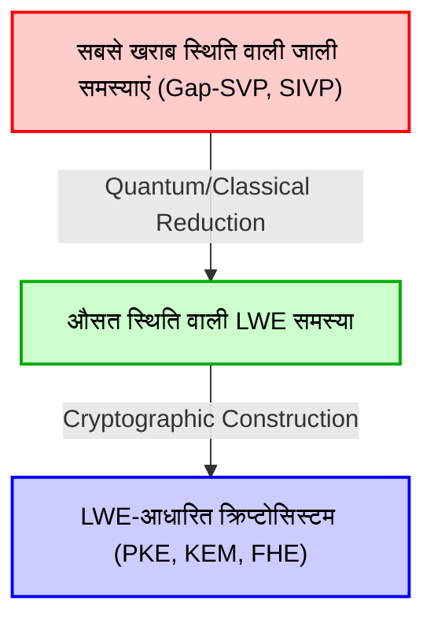
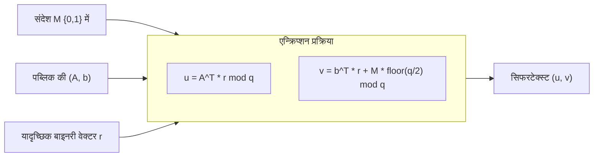
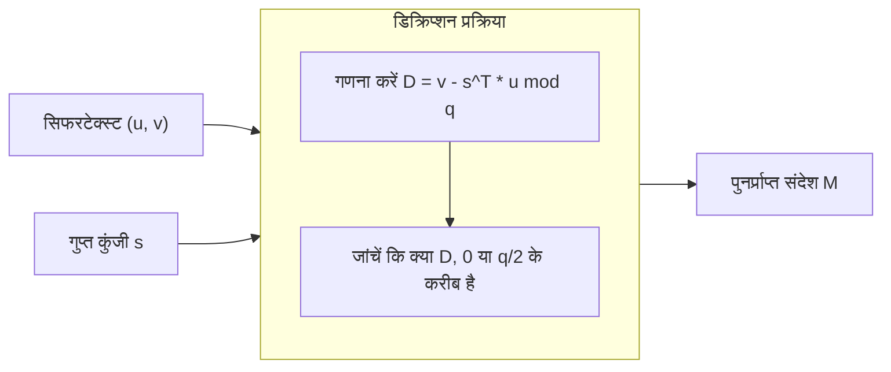

# 1. परिचय: पोस्ट-क्वांटम क्रिप्टोग्राफी (PQC) की शुरुआत और जाली-आधारित क्रिप्टोग्राफी (Lattice-based cryptography) का उदय

आधुनिक समाज के डिजिटल बुनियादी ढांचे का आधार RSA और एलिप्टिक कर्व क्रिप्टोग्राफी (ECC) जैसी पब्लिक-की क्रिप्टोग्राफी (Public-key cryptography) तकनीकें हैं। इन क्रिप्टोग्राफी विधियों की सुरक्षा "प्राइम फैक्टराइजेशन प्रॉब्लम (Prime Factorization Problem)" और "डिस्क्रीट लॉगरिथम प्रॉब्लम (Discrete Logarithm Problem)" जैसी गणितीय कठिनाइयों पर निर्भर करती है, जिनके बारे में माना जाता है कि पारंपरिक क्लासिकल कंप्यूटरों द्वारा उन्हें कुशलतापूर्वक हल नहीं किया जा सकता है (इसमें एक्सपोनेंशियल समय लगता है)।

हालाँकि, 1994 में पीटर शोर (Peter Shor) द्वारा प्रस्तुत "शोर का एल्गोरिदम (Shor's Algorithm)" ने क्रिप्टोग्राफी की दुनिया में तहलका मचा दिया। इस एल्गोरिदम ने गणितीय रूप से यह साबित कर दिया कि जब बड़े पैमाने पर क्वांटम कंप्यूटर वास्तविकता बन जाएंगे, तो वे प्राइम फैक्टराइजेशन और डिस्क्रीट लॉगरिथम समस्याओं को पॉलीनोमियल समय (Polynomial time) में हल कर देंगे। इसका अर्थ है कि वर्तमान में व्यापक रूप से उपयोग की जाने वाली पब्लिक-की क्रिप्टोग्राफी भविष्य में पूरी तरह से डिक्रिप्ट (decrypt) की जा सकेगी।

इस तरह के "क्वांटम खतरे (Quantum Threat)" का मुकाबला करने के लिए, नई क्रिप्टोग्राफिक विधियों पर शोध करना एक तत्काल आवश्यकता बन गई, जिन्हें क्वांटम कंप्यूटरों का उपयोग करके भी तोड़ना मुश्किल हो। इस क्षेत्र को "पोस्ट-क्वांटम क्रिप्टोग्राफी (Post-Quantum Cryptography: PQC)" या "क्वांटम-प्रतिरोधी क्रिप्टोग्राफी" कहा जाता है।

PQC के लिए कई मजबूत उम्मीदवार मौजूद हैं। इनमें हैश-आधारित क्रिप्टोग्राफी, कोड-आधारित क्रिप्टोग्राफी, मल्टीवेरिएट पॉलीनोमियल क्रिप्टोग्राफी, और आइसोजेनी-आधारित क्रिप्टोग्राफी शामिल हैं। लेकिन इनमें से जिसने वर्तमान में सबसे अधिक ध्यान आकर्षित किया है और जो NIST (नेशनल इंस्टीट्यूट ऑफ स्टैंडर्ड्स एंड टेक्नोलॉजी, USA) की PQC मानकीकरण प्रक्रिया के केंद्र में है, वह "जाली-आधारित क्रिप्टोग्राफी (Lattice-based cryptography)" है। अन्य विधियों की तुलना में, जाली-आधारित क्रिप्टोग्राफी में एन्क्रिप्शन और डिक्रिप्शन की गति बहुत तेज है। इसके अलावा, इसकी एक उत्कृष्ट विशेषता यह है कि इसमें "सबसे खराब स्थिति की जटिलता (Worst-case complexity)" से "औसत स्थिति की जटिलता (Average-case complexity)" में कमी (reduction) का गुण है, जो क्रिप्टोग्राफिक सिद्धांत में सुरक्षा का एक अत्यंत शक्तिशाली प्रमाण प्रदान करता है।

इस लेख में, हम जाली-आधारित क्रिप्टोग्राफी की नींव, "जाली (Lattice)" की गणितीय परिभाषा से शुरू करेंगे, और फिर जाली पर कठिन समस्याओं जैसे कि SVP (सबसे छोटा वेक्टर समस्या / Shortest Vector Problem) और CVP (सबसे करीबी वेक्टर समस्या / Closest Vector Problem) पर चर्चा करेंगे। अंत में, हम "LWE समस्या (Learning With Errors)" के बारे में विस्तार से जानेंगे, जिसे आधुनिक जाली-आधारित क्रिप्टोग्राफी का हृदय कहा जा सकता है। हम गणितीय सूत्रों, ज्यामितीय अंतर्ज्ञान और ठोस संख्यात्मक उदाहरणों के साथ इसका गहराई से विश्लेषण करेंगे।

# 2. जाली (Lattice) की गणितीय परिभाषा और ज्यामितीय अंतर्ज्ञान

## 2.1 वेक्टर स्पेस और जाली
गणित में, "जाली (Lattice)" $n$-आयामी वास्तविक वेक्टर स्पेस $\mathbb{R}^n$ के भीतर नियमित रूप से व्यवस्थित असतत (discrete) बिंदुओं का एक सेट है। यह लीनियर अलजेब्रा में सीखे गए वेक्टर स्पेस (Vector Space) के समान है, लेकिन इनमें एक महत्वपूर्ण अंतर है। जबकि एक वेक्टर स्पेस एक सतत (continuous) स्थान है जिसे बेसिस (आधार) वेक्टरों के "वास्तविक संख्या (real number) गुणांक" वाले रैखिक संयोजन (linear combination) द्वारा दर्शाया जाता है, एक जाली एक असतत स्थान है जिसे बेसिस वेक्टरों के "पूर्णांक (integer) गुणांक" वाले रैखिक संयोजन द्वारा दर्शाया जाता है।

आइए एक सख्त गणितीय परिभाषा दें। $m$-आयामी वास्तविक वेक्टर स्पेस $\mathbb{R}^m$ में $n$ ($n \le m$) रैखिक रूप से स्वतंत्र (linearly independent) वेक्टरों $\mathbf{b}_1, \mathbf{b}_2, \dots, \mathbf{b}_n$ पर विचार करें। मान लें कि एक मैट्रिक्स $B = [\mathbf{b}_1, \mathbf{b}_2, \dots, \mathbf{b}_n] \in \mathbb{R}^{m \times n}$ है, जिसके कॉलम में ये वेक्टर हैं। इस $B$ को जाली का "बेसिस (Basis)" कहा जाता है।

इस बेसिस $B$ द्वारा उत्पन्न जाली $\mathcal{L}(B)$ को इस प्रकार परिभाषित किया गया है:

$$
\mathcal{L}(B) = \left\{ \sum_{i=1}^{n} x_i \mathbf{b}_i \mathrel{\bigg|} x_i \in \mathbb{Z} \right\} = \{ B \mathbf{x} \mid \mathbf{x} \in \mathbb{Z}^n \}
$$

यहाँ महत्वपूर्ण बात यह है कि गुणांक $x_i$ वास्तविक संख्याओं $\mathbb{R}$ तक सीमित नहीं हैं, बल्कि पूर्णांकों $\mathbb{Z}$ तक सीमित हैं। इसके परिणामस्वरूप, अंतरिक्ष में मौजूद अनगिनत सतत बिंदुओं के बजाय, समान दूरी पर स्थित चौराहों की तरह "असतत बिंदुओं का एक सेट" बनता है।

## 2.2 ज्यामितीय छवि
आइए 2-आयामी तल $\mathbb{R}^2$ के एक उदाहरण पर विचार करें। यदि हम बेसिस वेक्टर के रूप में $\mathbf{b}_1 = \begin{pmatrix} 1 \\ 0 \end{pmatrix}$ और $\mathbf{b}_2 = \begin{pmatrix} 0 \\ 1 \end{pmatrix}$ चुनते हैं, तो उनके द्वारा उत्पन्न जाली, निर्देशांक तल पर सभी पूर्णांक निर्देशांकों $(x, y) \in \mathbb{Z}^2$ का सेट होगी। यह सबसे सरल "वर्गाकार जाली (square lattice)" है।

हालाँकि, जालियाँ हमेशा ऑर्थोगोनल (समकोण पर) नहीं होती हैं। उदाहरण के लिए, यदि हम बेसिस $\mathbf{b}_1 = \begin{pmatrix} 2 \\ 1 \end{pmatrix}$ और $\mathbf{b}_2 = \begin{pmatrix} 1 \\ 3 \end{pmatrix}$ पर विचार करें, तो उत्पन्न बिंदु एक तिरछे (skewed) जाल के चौराहों की तरह दिखेंगे।

## 2.3 बेसिस की गैर-अद्वितीयता (Non-uniqueness) और यूनिमॉड्युलर ट्रांसफॉर्मेशन
जाली-आधारित क्रिप्टोग्राफी की सुरक्षा के मूल में एक महत्वपूर्ण गुण निहित है: "एक ही जाली उत्पन्न करने वाले अनगिनत बेसिस मौजूद होते हैं।"

उदाहरण के लिए, ऊपर बताई गई बेसिस $\mathbf{b}_1 = (1, 0)^T, \mathbf{b}_2 = (0, 1)^T$ द्वारा उत्पन्न $\mathbb{Z}^2$ जाली, बिल्कुल उसी $\mathbb{Z}^2$ जाली को उत्पन्न करती है जिसे बेसिस $\mathbf{b}'_1 = (1, 1)^T, \mathbf{b}'_2 = (2, 3)^T$ का उपयोग करके भी उत्पन्न किया जा सकता है।

एक बेसिस $B$ और दूसरे बेसिस $B'$ द्वारा समान जाली उत्पन्न करने के लिए आवश्यक और पर्याप्त शर्त (necessary and sufficient condition) यह है कि एक पूर्णांक घटकों वाला मैट्रिक्स $U \in \mathbb{Z}^{n \times n}$ मौजूद हो, जिसका डिटरमिनेंट $\det(U) = \pm 1$ हो, और जिसे इस प्रकार व्यक्त किया जा सके:
$$ B' = B U $$
इस प्रकार के मैट्रिक्स $U$ को "यूनिमॉड्युलर मैट्रिक्स (Unimodular matrix)" कहा जाता है।

क्रिप्टोग्राफी में इसके अनुप्रयोग का मूल विचार एक "अच्छे बेसिस" (जो लगभग ऑर्थोगोनल हो और छोटे वेक्टरों से बना हो) को सीक्रेट की (गुप्त कुंजी) के रूप में उपयोग करना है, और एक "बुरे बेसिस" (जो अत्यधिक तिरछा हो और बहुत लंबे वेक्टरों से बना हो) को पब्लिक की (सार्वजनिक कुंजी) के रूप में उपयोग करना है। उच्च आयामों में एक बुरे बेसिस से एक अच्छे बेसिस की गणना करना बहुत मुश्किल हो जाता है। यही जाली-आधारित क्रिप्टोग्राफी का मूलभूत अंतर्ज्ञान है।

# 3. जाली में गणना संबंधी कठिन समस्याएं

जाली-आधारित क्रिप्टोग्राफी की सुरक्षा जाली पर कुछ गणितीय समस्याओं को हल करने की कठिनाई पर निर्भर करती है। यहाँ हम दो सबसे बुनियादी और प्रसिद्ध समस्याओं का परिचय देंगे।

## 3.1 सबसे छोटा वेक्टर समस्या (Shortest Vector Problem: SVP)
SVP जाली सिद्धांत में सबसे शास्त्रीय और प्रसिद्ध समस्या है।

**परिभाषा (SVP):**
मान लें कि कोई भी जाली बेसिस $B$ दिया गया है, तो उस जाली $\mathcal{L}(B)$ से संबंधित सभी गैर-शून्य वेक्टरों में से, उस वेक्टर $\mathbf{v}$ का पता लगाएं जिसका यूक्लिडियन नॉर्म (लंबाई) सबसे कम हो।

सूत्र रूप में, यह वह $\mathbf{v}$ खोजने की समस्या है जो $\min_{\mathbf{v} \in \mathcal{L}(B) \setminus \{\mathbf{0}\}} \| \mathbf{v} \|$ को संतुष्ट करता हो। इस न्यूनतम लंबाई को $\lambda_1(\mathcal{L})$ के रूप में लिखा जाता है और इसे "जाली का पहला क्रमिक न्यूनतम मान (First successive minimum)" कहा जाता है।

2D या 3D जैसे निचले आयामों में, आप एक चित्र बनाकर सबसे छोटे वेक्टर को अपनी आँखों से देख सकते हैं। या आप इसे गॉस (Gauss) के जाली रिडक्शन एल्गोरिदम का उपयोग करके कुशलतापूर्वक हल कर सकते हैं। हालाँकि, जब आयाम $n$ सैकड़ों से हजारों जैसे उच्च आयामों तक पहुँचता है, तो SVP को सटीक रूप से हल करना NP-हार्ड माना जाता है।

वास्तविक क्रिप्टोग्राफी में, सटीक सबसे छोटे वेक्टर के बजाय, "लगभग सबसे छोटे वेक्टर" को खोजने वाली समस्या, एप्रोक्सिमेट SVP ($\gamma$-SVP) का उपयोग किया जाता है। यदि एप्रोक्सिमेशन फैक्टर (सन्निकटन कारक) $\gamma$ पॉलीनोमियल आकार का है, तो इस समस्या को अभी भी बहुत कठिन माना जाता है।

## 3.2 सबसे करीबी वेक्टर समस्या (Closest Vector Problem: CVP)
CVP भी जाली-आधारित क्रिप्टोग्राफी में एक अत्यंत महत्वपूर्ण समस्या है।

**परिभाषा (CVP):**
मान लें कि कोई भी जाली बेसिस $B$ और अंतरिक्ष में कोई लक्ष्य वेक्टर $\mathbf{t} \in \mathbb{R}^m$ (जो जरूरी नहीं कि जाली बिंदु हो) दिया गया है, तो जाली के बिंदुओं में से वह जाली बिंदु $\mathbf{v} \in \mathcal{L}(B)$ खोजें जो $\mathbf{t}$ के सबसे करीब हो।

सूत्र रूप में, यह वह जाली बिंदु $\mathbf{v}$ खोजने की समस्या है जो $\min_{\mathbf{v} \in \mathcal{L}(B)} \| \mathbf{v} - \mathbf{t} \|$ को संतुष्ट करता हो।

SVP की तरह, उच्च आयामों में CVP भी NP-हार्ड है। क्रिप्टोग्राफिक अनुप्रयोगों के दृष्टिकोण से, LWE समस्या (जिसकी चर्चा बाद में की जाएगी) CVP के एक विशेष संस्करण (Bounded Distance Decoding: BDD) से निकटता से संबंधित है।

## 3.3 उच्च आयामों में इन्हें हल करना असंभव क्यों है? (LLL और BKZ की सीमाएँ)
उच्च-आयामी जाली समस्याओं को हल करने के लिए एक प्रसिद्ध एल्गोरिदम LLL एल्गोरिदम (Lenstra-Lenstra-Lovász algorithm) है। LLL एल्गोरिदम पॉलीनोमियल समय में काम करता है और जाली बेसिस को कुछ हद तक "अच्छे बेसिस" में घटा (रिड्यूस) सकता है। हालाँकि, LLL एल्गोरिदम द्वारा खोजा जाने वाला सबसे छोटा वेक्टर, वास्तविक सबसे छोटे वेक्टर की लंबाई के सापेक्ष एक एक्सपोनेंशियल ($2^{\mathcal{O}(n)}$) एप्रोक्सिमेशन फैक्टर (सन्निकटन कारक) रखता है, इसलिए यह क्रिप्टोग्राफी की सुरक्षा को तोड़ने के लिए पर्याप्त नहीं है।

यदि LLL का उन्नत संस्करण BKZ (Block Korkine-Zolotarev) एल्गोरिदम जैसे अधिक शक्तिशाली बेसिस रिडक्शन एल्गोरिदम का उपयोग किया जाए, तो छोटे वेक्टर पाए जा सकते हैं, लेकिन इसकी कम्प्यूटेशनल जटिलता (computational complexity) ब्लॉक आकार के संबंध में एक्सपोनेंशियल रूप से बढ़ जाती है। जाली-आधारित क्रिप्टोग्राफी में, सुरक्षित पैरामीटर (जैसे आयाम $n$ का आकार) इस BKZ एल्गोरिदम के निष्पादन समय का अनुमान लगाकर निर्धारित किए जाते हैं। वर्तमान PQC मानक मापदंडों में, आयाम $n$ को 500 से 1000 या उससे अधिक के मानों के लिए चुना जाता है, और यह माना जाता है कि भविष्य के सुपर कंप्यूटरों या क्वांटम कंप्यूटरों का उपयोग करके भी इसे डिक्रिप्ट करने में ब्रह्मांड की आयु से अधिक समय लगेगा।

# 4. LWE समस्या (Learning With Errors) का गणितीय निरूपण

आधुनिक जाली-आधारित क्रिप्टोग्राफी का अधिकांश हिस्सा "LWE समस्या (Learning With Errors)" पर आधारित है, जिसे 2005 में ओडेड रेगेव (Oded Regev) द्वारा प्रस्तावित किया गया था। LWE समस्या की सुंदरता इसके निर्माण की सरलता और इसके शक्तिशाली गणितीय प्रमाण में निहित है, जिसे "सबसे खराब स्थिति की जटिलता से औसत स्थिति की जटिलता में कमी" कहा जाता है।

## 4.1 बिना शोर के रेखीय समीकरणों की प्रणाली
LWE समस्या को समझने के लिए, आइए पहले बिना शोर वाले रेखीय समीकरणों की एक सरल प्रणाली पर विचार करें।
मान लें कि हमारे पास एक अज्ञात गुप्त वेक्टर $\mathbf{s} \in \mathbb{Z}_q^n$ (प्रत्येक घटक $0$ से $q-1$ तक का एक पूर्णांक है) है। यहाँ, मान लें कि $q$ एक अभाज्य संख्या है।

हम यादृच्छिक (random) गुणांक वेक्टर $\mathbf{a}_1, \mathbf{a}_2, \dots \in \mathbb{Z}_q^n$ चुनते हैं, और गुप्त वेक्टर $\mathbf{s}$ के साथ इसके डॉट प्रोडक्ट की गणना मॉड्युलो $q$ पर करते हैं।
$b_1 = \langle \mathbf{a}_1, \mathbf{s} \rangle \pmod q$
$b_2 = \langle \mathbf{a}_2, \mathbf{s} \rangle \pmod q$
$\vdots$

यदि हमें पर्याप्त संख्या में (कम से कम $n$) $(\mathbf{a}_i, b_i)$ के जोड़े दिए जाते हैं, तो हम लीनियर अलजेब्रा में "गौसियन एलिमिनेशन (Gaussian elimination)" का उपयोग करके गुप्त वेक्टर $\mathbf{s}$ को आसानी से पुनर्प्राप्त कर सकते हैं। यह एक ऐसी समस्या है जिसे पॉलीनोमियल समय में आसानी से हल किया जा सकता है।

## 4.2 LWE समस्या की परिभाषा: शोर जोड़ना
तो, यदि हम इस समस्या में थोड़ा सा "शोर (त्रुटि / error)" जोड़ दें तो क्या होगा?
यही LWE समस्या का सार है।

अज्ञात गुप्त वेक्टर $\mathbf{s} \in \mathbb{Z}_q^n$ के लिए, हम प्रत्येक समीकरण के परिणाम में एक छोटी सी त्रुटि $e_i \in \mathbb{Z}_q$ जोड़ते हैं।
$b_i = \langle \mathbf{a}_i, \mathbf{s} \rangle + e_i \pmod q$

यहाँ, $e_i$ एक छोटा पूर्णांक मान है जिसका औसत 0 है और जिसका मानक विचलन (standard deviation) अपेक्षाकृत छोटा है (उदाहरण के लिए, सामान्य वितरण की तरह एक डिस्क्रीट गॉसियन वितरण (discrete Gaussian distribution) से चुना गया)।
प्रदान की गई जानकारी यादृच्छिक वेक्टर $\mathbf{a}_i$ और त्रुटि जोड़ने के बाद गणना किए गए $b_i$ के जोड़े की एक सूची है।
$( \mathbf{a}_1, b_1 ), ( \mathbf{a}_2, b_2 ), \dots, ( \mathbf{a}_m, b_m )$

इसे मैट्रिक्स का उपयोग करके बहुत स्पष्ट रूप से दर्शाया जा सकता है।
यादृच्छिक मैट्रिक्स $A \in \mathbb{Z}_q^{m \times n}$, गुप्त वेक्टर $\mathbf{s} \in \mathbb{Z}_q^n$, और त्रुटि वेक्टर $\mathbf{e} \in \mathbb{Z}_q^m$ का उपयोग करके, हम इसे इस प्रकार लिख सकते हैं:
$$ \mathbf{b} = A \mathbf{s} + \mathbf{e} \pmod q $$
हमें केवल $A$ और $\mathbf{b}$ दिए जाते हैं। यहाँ से $\mathbf{s}$ ज्ञात करना "सर्च LWE समस्या (Search LWE problem)" कहलाता है।

चूंकि इसमें त्रुटि $e_i$ शामिल है, इसलिए यदि हम गौसियन एलिमिनेशन का उपयोग करने का प्रयास करते हैं, तो समीकरणों को जोड़ने और घटाने की प्रक्रिया में त्रुटि एक्सपोनेंशियल रूप से बढ़ जाती है, जिससे सही उत्तर तक पहुँचना असंभव हो जाता है। पहली नज़र में, यह रेखीय समीकरणों की एक सरल प्रणाली की तरह लगता है, लेकिन इस छोटे से शोर के जुड़ने से ही समस्या की कठिनाई NP-हार्ड स्तर तक पहुँच जाती है।

## 4.3 डिसीजन LWE समस्या (Decision LWE)
क्रिप्टोग्राफिक सिद्धांत के प्रमाणों में अक्सर जिसका उपयोग किया जाता है, वह सर्च LWE समस्या का एक संस्करण है, जिसे "डिसीजन LWE समस्या (Decision LWE problem)" कहा जाता है।

डिसीजन LWE समस्या यह निर्धारित करने की समस्या है कि नीचे दिए गए दो वितरणों (distributions) में से प्राप्त नमूनों की सूची किस वितरण से आई है:
1. **LWE वितरण**: जानबूझकर गणना की गई $(A, \mathbf{b} = A\mathbf{s} + \mathbf{e} \pmod q)$
2. **यूनिफ़ॉर्म रैंडम वितरण**: पूरी तरह से यादृच्छिक रूप से चुने गए मैट्रिक्स $A$ और वेक्टर $\mathbf{u}$ से मिलकर बना $(A, \mathbf{u})$

आश्चर्यजनक रूप से, यदि LWE समस्या के मापदंडों को ठीक से चुना जाता है, तो LWE वितरण से प्राप्त जोड़े पूरी तरह से यादृच्छिक डेटा के जोड़े से "कम्प्यूटेशनल रूप से अप्रभेद्य (Computationally Indistinguishable)" हो जाते हैं। यही गुण LWE-आधारित क्रिप्टोग्राफी का आधार है, जो ऐसे "सिफरटेक्स्ट (ciphertext) उत्पन्न करता है जिन्हें यादृच्छिक संख्याओं (random numbers) से अलग नहीं किया जा सकता है।"

## 4.4 सबसे खराब स्थिति से औसत स्थिति की जटिलता में कमी (Regev's Theorem)
ओडेड रेगेव (Oded Regev) की सबसे बड़ी उपलब्धि इस LWE समस्या की कठिनाई को ऊपर बताई गई जाली समस्याओं (SVP और CVP) की कठिनाई से गणितीय रूप से जोड़ना था।

क्वांटम रिडक्शन (Quantum reduction) का उपयोग करते हुए, उन्होंने साबित किया कि "यदि कोई पॉलीनोमियल-टाइम एल्गोरिदम मौजूद है जो औसत रूप से LWE समस्या को हल कर सकता है (यादृच्छिक रूप से चुने गए $A$ और $\mathbf{e}$ के लिए), तो एक पॉलीनोमियल-टाइम क्वांटम एल्गोरिदम भी मौजूद होगा जो किसी भी जाली के सबसे खराब स्थिति (सबसे कठिन मामले) में Gap-SVP को हल कर सकता है।" (बाद में, Peikert और अन्य लोगों द्वारा क्लासिकल रिडक्शन भी दिखाया गया है)।

यह क्रिप्टोग्राफिक सिद्धांत में एक सपने जैसी विशेषता है। ऐसा इसलिए है क्योंकि यह इस चिंता को दूर करता है कि "हो सकता है कि क्रिप्टोग्राफी टूट गई हो क्योंकि हमने संयोग से एक कमजोर कुंजी (औसत मामलों में से एक) चुन ली हो," और यह एक शक्तिशाली गारंटी प्रदान करता है कि "यदि औसत LWE को हल किया जा सकता है, तो जाली की सभी कठिन समस्याओं को हल किया जा सकता है (इसलिए LWE निश्चित रूप से कठिन है)।"

# 5. LWE का उपयोग करके पब्लिक-की क्रिप्टोग्राफी (रेगेव क्रिप्टोग्राफी - Regev Cryptosystem) का निर्माण

अब जब हम LWE समस्या की कठिनाई को समझ चुके हैं, तो आइए ओडेड रेगेव द्वारा प्रस्तावित बुनियादी पब्लिक-की क्रिप्टोग्राफी प्रणाली (Public-key cryptosystem) को देखें कि यह एन्क्रिप्शन और डिक्रिप्शन करने के लिए इसका उपयोग कैसे करती है। यहाँ हम 1-बिट संदेश $M \in \{0, 1\}$ को एन्क्रिप्ट करने के सबसे बुनियादी तंत्र की व्याख्या करेंगे।

## 5.1 कुंजी निर्माण (Key Generation)
1. सिस्टम पैरामीटर के रूप में, एक अभाज्य संख्या $q$ (मॉड्यूलस), एक आयाम $n$, और समीकरणों की संख्या $m$ ($m > n \log q$) निर्धारित करें।
2. गुप्त कुंजी (Secret Key) के रूप में एक वेक्टर $\mathbf{s} \in \mathbb{Z}_q^n$ को यादृच्छिक रूप से चुनें।
3. एक यादृच्छिक मैट्रिक्स $A \in \mathbb{Z}_q^{m \times n}$ उत्पन्न करें।
4. एक छोटा त्रुटि वेक्टर $\mathbf{e} \in \mathbb{Z}_q^m$ एक त्रुटि वितरण जैसे कि डिस्क्रीट गॉसियन वितरण से चुनें।
5. वेक्टर $\mathbf{b} = A \mathbf{s} + \mathbf{e} \pmod q$ की गणना करें।
6. पब्लिक की (Public Key) $(A, \mathbf{b})$ होगी।
7. सीक्रेट की (Secret Key) $\mathbf{s}$ होगी।

पब्लिक की वस्तुतः "LWE समस्या का एक इंस्टेंस (instance)" है। चूँकि पब्लिक की $(A, \mathbf{b})$ से सीक्रेट की $\mathbf{s}$ ज्ञात करना सर्च LWE समस्या को हल करने के बराबर है, इसलिए सुरक्षा की गारंटी है।

## 5.2 एन्क्रिप्शन (Encryption)
ऐलिस, बॉब की पब्लिक की $(A, \mathbf{b})$ का उपयोग करके 1-बिट संदेश $M \in \{0, 1\}$ को एन्क्रिप्ट करती है।

1. एक यादृच्छिक बाइनरी वेक्टर (जिसके घटक 0 या 1 हैं) $\mathbf{r} \in \{0, 1\}^m$ चुनें।
2. सिफरटेक्स्ट (ciphertext) के पहले भाग के रूप में, वेक्टर $\mathbf{u} = A^T \mathbf{r} \pmod q$ की गणना करें। ($A^T$, $A$ का ट्रांसपोज़ मैट्रिक्स (transpose matrix) है। अर्थात्, हम $A$ की उन पंक्तियों को जोड़ रहे हैं जहाँ $\mathbf{r}$ का घटक 1 है)।
3. सिफरटेक्स्ट के दूसरे भाग के रूप में, स्केलर $v = \mathbf{b}^T \mathbf{r} + M \cdot \lfloor \frac{q}{2} \rfloor \pmod q$ की गणना करें।
   (यदि संदेश $M$ 0 है तो कुछ भी नहीं जोड़ा जाता है, और यदि $1$ है तो हम $q$ का ठीक आधा मान $\lfloor \frac{q}{2} \rfloor$ जोड़ते हैं)।
4. सिफरटेक्स्ट (Ciphertext) $(\mathbf{u}, v)$ होगा।

एन्क्रिप्शन का सहज अर्थ पब्लिक की के मैट्रिक्स $A$ और वेक्टर $\mathbf{b}$ के लिए "यादृच्छिक उपसमूह का योग (sum of a random subset)" लेना है। डिसीजन LWE समस्या की कठिनाई के कारण, यह सिफरटेक्स्ट $(\mathbf{u}, v)$ एक पूरी तरह से यादृच्छिक वेक्टर और एक समान यादृच्छिक संख्या (uniform random number) से अप्रभेद्य (indistinguishable) प्रतीत होता है (सिमेंटिक सिक्योरिटी: Semantic Security)।

## 5.3 डिक्रिप्शन (Decryption)
बॉब अपनी गुप्त कुंजी $\mathbf{s}$ का उपयोग करके सिफरटेक्स्ट $(\mathbf{u}, v)$ को डिक्रिप्ट करता है।

1. निम्नलिखित मान की गणना करें: $D = v - \mathbf{s}^T \mathbf{u} \pmod q$
2. यदि गणना किया गया परिणाम $0$ के करीब है, तो $M=0$ आउटपुट करें, और यदि यह $\lfloor \frac{q}{2} \rfloor$ के करीब है, तो $M=1$ आउटपुट करें।

आइए गणितीय रूप से इसका विस्तार करें कि इसे इस प्रकार डिक्रिप्ट क्यों किया जा सकता है।
याद रखें कि $\mathbf{b} = A \mathbf{s} + \mathbf{e}$ था।

$$
\begin{aligned}
v - \mathbf{s}^T \mathbf{u} &= (\mathbf{b}^T \mathbf{r} + M \cdot \lfloor \frac{q}{2} \rfloor) - \mathbf{s}^T (A^T \mathbf{r}) \\
&= ((A \mathbf{s} + \mathbf{e})^T \mathbf{r} + M \cdot \lfloor \frac{q}{2} \rfloor) - \mathbf{s}^T A^T \mathbf{r} \\
&= (\mathbf{s}^T A^T \mathbf{r} + \mathbf{e}^T \mathbf{r} + M \cdot \lfloor \frac{q}{2} \rfloor) - \mathbf{s}^T A^T \mathbf{r} \\
&= \mathbf{e}^T \mathbf{r} + M \cdot \lfloor \frac{q}{2} \rfloor \pmod q
\end{aligned}
$$

यहाँ, सूत्र में से $\mathbf{s}^T A^T \mathbf{r}$ पूरी तरह से कट कर (cancel out) समाप्त हो गया!
बचा हुआ हिस्सा $\mathbf{e}^T \mathbf{r} + M \cdot \lfloor \frac{q}{2} \rfloor$ है।

$\mathbf{e}$ एक शोर वेक्टर है जिसके घटक बहुत छोटे हैं, और $\mathbf{r}$ एक बाइनरी वेक्टर है जिसके घटक 0 या 1 हैं। इसलिए, उनका डॉट प्रोडक्ट $\mathbf{e}^T \mathbf{r}$ भी अपेक्षाकृत छोटा मान (यदि पैरामीटर ठीक से चुने गए हैं) ही रहेगा।

- यदि $M=0$ है, तो परिणाम $\mathbf{e}^T \mathbf{r}$ होगा, जो $0$ के करीब एक छोटा मान होगा।
- यदि $M=1$ है, तो परिणाम $\mathbf{e}^T \mathbf{r} + \lfloor \frac{q}{2} \rfloor$ होगा, जो $q$ के आधे मान $\lfloor \frac{q}{2} \rfloor$ के आसपास स्थित होगा।

यदि मापदंडों को इस तरह से डिज़ाइन किया गया है कि त्रुटि $\mathbf{e}^T \mathbf{r}$ का निरपेक्ष मान (absolute value) $\frac{q}{4}$ से कम रहे, तो बॉब केवल यह देखकर संदेश $M$ को सटीक रूप से निर्धारित (डिक्रिप्ट) कर सकता है कि गणना का परिणाम $0$ के अधिक करीब है या $\lfloor \frac{q}{2} \rfloor$ के। यही वह सुंदर तंत्र है जिसके द्वारा LWE-आधारित क्रिप्टोग्राफी काम करती है।

# 6. विशिष्ट संख्यात्मक मानों का उपयोग करते हुए LWE क्रिप्टोग्राफी का एक टॉय उदाहरण (Toy Example)

सूत्रों की एक श्रृंखला के साथ इसे समझना मुश्किल हो सकता है, इसलिए आइए वास्तव में बहुत छोटे संख्यात्मक मापदंडों को सेट करके एन्क्रिप्शन से डिक्रिप्शन तक की गणनाओं का पालन करें।
(※ वास्तविक क्रिप्टोग्राफ़िक प्रणालियों में, सुरक्षा सुनिश्चित करने के लिए $n$ के लिए 500 या उससे अधिक और $q$ के लिए हजारों या उससे अधिक मान का उपयोग किया जाता है)

**【पैरामीटर सेटिंग्स】**
- मॉड्यूलस $q = 17$ (अभाज्य संख्या। इसलिए मान $0$ से $16$ तक की सीमा में होंगे)
- आयाम $n = 2$
- समीकरणों की संख्या $m = 4$
- मान लें कि हम संदेश $M = 1$ को एन्क्रिप्ट कर रहे हैं।
- संदेश का शिफ्ट मान: $\lfloor \frac{q}{2} \rfloor = \lfloor \frac{17}{2} \rfloor = 8$

**【1. कुंजी निर्माण चरण (Key Generation Phase)】**
बॉब गुप्त कुंजी $\mathbf{s}$, मैट्रिक्स $A$, और त्रुटि वेक्टर $\mathbf{e}$ को यादृच्छिक रूप से चुनता है।
$$ \mathbf{s} = \begin{pmatrix} 3 \\ 4 \end{pmatrix} \in \mathbb{Z}_{17}^2 $$
$$ A = \begin{pmatrix} 2 & 15 \\ 1 & 8 \\ 14 & 5 \\ 9 & 10 \end{pmatrix} \in \mathbb{Z}_{17}^{4 \times 2} $$
$$ \mathbf{e} = \begin{pmatrix} 1 \\ -1 \\ 0 \\ 2 \end{pmatrix} \equiv \begin{pmatrix} 1 \\ 16 \\ 0 \\ 2 \end{pmatrix} \pmod{17} $$

इसके बाद, पब्लिक की $\mathbf{b}$ की गणना करें।
$$ A \mathbf{s} = \begin{pmatrix} 2 & 15 \\ 1 & 8 \\ 14 & 5 \\ 9 & 10 \end{pmatrix} \begin{pmatrix} 3 \\ 4 \end{pmatrix} = \begin{pmatrix} 2\times 3 + 15\times 4 \\ 1\times 3 + 8\times 4 \\ 14\times 3 + 5\times 4 \\ 9\times 3 + 10\times 4 \end{pmatrix} = \begin{pmatrix} 6 + 60 \\ 3 + 32 \\ 42 + 20 \\ 27 + 40 \end{pmatrix} = \begin{pmatrix} 66 \\ 35 \\ 62 \\ 67 \end{pmatrix} $$
इसकी गणना मॉड्युलो 17 में करें। (जैसे $66 = 17 \times 3 + 15$)
$$ A \mathbf{s} \pmod{17} = \begin{pmatrix} 15 \\ 1 \\ 11 \\ 16 \end{pmatrix} $$
त्रुटि वेक्टर $\mathbf{e}$ जोड़ें।
$$ \mathbf{b} = A \mathbf{s} + \mathbf{e} = \begin{pmatrix} 15 \\ 1 \\ 11 \\ 16 \end{pmatrix} + \begin{pmatrix} 1 \\ 16 \\ 0 \\ 2 \end{pmatrix} = \begin{pmatrix} 16 \\ 17 \\ 11 \\ 18 \end{pmatrix} \equiv \begin{pmatrix} 16 \\ 0 \\ 11 \\ 1 \end{pmatrix} \pmod{17} $$

पब्लिक की $A$ और $\mathbf{b} = (16, 0, 11, 1)^T$ होगी।

**【2. एन्क्रिप्शन चरण (Encryption Phase)】**
ऐलिस संदेश $M = 1$ को एन्क्रिप्ट करती है।
वह एक यादृच्छिक वेक्टर $\mathbf{r}$ चुनती है। यहाँ मान लें कि $\mathbf{r} = (1, 0, 1, 0)^T$ है।

$\mathbf{u}$ की गणना करें।
$$ \mathbf{u} = A^T \mathbf{r} = \begin{pmatrix} 2 & 1 & 14 & 9 \\ 15 & 8 & 5 & 10 \end{pmatrix} \begin{pmatrix} 1 \\ 0 \\ 1 \\ 0 \end{pmatrix} = \begin{pmatrix} 2 \times 1 + 14 \times 1 \\ 15 \times 1 + 5 \times 1 \end{pmatrix} = \begin{pmatrix} 16 \\ 20 \end{pmatrix} \equiv \begin{pmatrix} 16 \\ 3 \end{pmatrix} \pmod{17} $$

$v$ की गणना करें।
$$ \mathbf{b}^T \mathbf{r} = (16, 0, 11, 1) \begin{pmatrix} 1 \\ 0 \\ 1 \\ 0 \end{pmatrix} = 16 \times 1 + 11 \times 1 = 27 \equiv 10 \pmod{17} $$
संदेश $M=1$ के अनुरूप मान $\lfloor 17/2 \rfloor = 8$ जोड़ें।
$$ v = \mathbf{b}^T \mathbf{r} + M \cdot 8 = 10 + 1 \times 8 = 18 \equiv 1 \pmod{17} $$

ऐलिस सिफरटेक्स्ट के रूप में $(\mathbf{u}, v) = \left( \begin{pmatrix} 16 \\ 3 \end{pmatrix}, 1 \right)$ बॉब को भेजती है।

**【3. डिक्रिप्शन चरण (Decryption Phase)】**
सिफरटेक्स्ट प्राप्त करने के बाद, बॉब गुप्त कुंजी $\mathbf{s} = (3, 4)^T$ का उपयोग करके इसे डिक्रिप्ट करता है।
डिक्रिप्शन प्रक्रिया सूत्र: $D = v - \mathbf{s}^T \mathbf{u} \pmod{17}$ की गणना करें।

$$ \mathbf{s}^T \mathbf{u} = (3, 4) \begin{pmatrix} 16 \\ 3 \end{pmatrix} = 3 \times 16 + 4 \times 3 = 48 + 12 = 60 \equiv 9 \pmod{17} $$
$$ D = v - \mathbf{s}^T \mathbf{u} = 1 - 9 = -8 \pmod{17} $$

यहाँ, मॉड्युलो 17 की दुनिया में, $-8$, $9$ के बराबर है ($-8 + 17 = 9$)।
प्राप्त मान $D = 9$ का मूल्यांकन यह निर्धारित करने के लिए करें कि यह $0$ के अधिक करीब है या $8$ ($\lfloor 17/2 \rfloor$) के।
चूँकि $9$ स्पष्ट रूप से $0$ की तुलना में $8$ के अधिक करीब है, बॉब ने $M = 1$ को सफलतापूर्वक और सही ढंग से पुनर्प्राप्त कर लिया!

यह $9$ क्यों हुआ? आइए पहले के प्रमाण को याद करें।
त्रुटि भाग $\mathbf{e}^T \mathbf{r} = (1, -1, 0, 2) (1, 0, 1, 0)^T = 1 \times 1 + 0 \times 1 = 1$ है।
इसलिए, गणना का परिणाम $\mathbf{e}^T \mathbf{r} + M \cdot 8 = 1 + 8 = 9$ है, और यह पुष्टि हो गई है कि सैद्धांतिक रूप से सही मान की गणना की गई है।

# 7. व्यावहारिक अनुप्रयोग की दिशा में विकास: Ring-LWE और Module-LWE

अब तक समझाई गई मानक LWE समस्या (Standard LWE) में बहुत मजबूत सुरक्षा प्रमाण है, लेकिन व्यावहारिक अनुप्रयोग में इसकी एक घातक कमजोरी है: "कुंजी का आकार विशाल हो जाता है" और "कम्प्यूटेशनल लागत अधिक होती है।"

Standard LWE में, पब्लिक की में एक विशाल मैट्रिक्स $A \in \mathbb{Z}_q^{m \times n}$ शामिल होता है। जब पैरामीटर $n$ सैकड़ों से हजारों तक पहुँच जाता है, तो इस मैट्रिक्स का आकार कई मेगाबाइट तक पहुँच जाता है, जो इंटरनेट संचार प्रोटोकॉल (जैसे TLS) में हर बार प्रसारित और प्राप्त करने के लिए बहुत भारी होता है। इसके अलावा, मैट्रिक्स और वेक्टर के गुणन के लिए $\mathcal{O}(n^2)$ कम्प्यूटेशनल जटिलता की आवश्यकता होती है।

इस समस्या को हल करने के लिए, "Ring-LWE (RLWE)" और "Module-LWE (MLWE)" को पेश किया गया, जो जाली में पॉलीनोमियल रिंग्स (Polynomial rings) नामक बीजीय संरचनाओं (algebraic structures) को शामिल करते हैं।

## 7.1 Ring-LWE का अंतर्ज्ञान
Ring-LWE में, वेक्टर और मैट्रिक्स को पॉलीनोमियल रिंग $\mathcal{R}_q = \mathbb{Z}_q[X]/(X^n + 1)$ पर तत्वों (बहुपदों / polynomials) से बदल दिया जाता है। (जहाँ $n$ को 2 की घात के रूप में चुना जाता है)।

Standard LWE में जहाँ पब्लिक की एक मैट्रिक्स $A$ थी, वहीं Ring-LWE में एकल बहुपद $a(x)$ का उपयोग किया जाता है। गुप्त कुंजी $s(x)$ और त्रुटि $e(x)$ भी बहुपद बन जाते हैं।
समीकरण इस प्रकार है:
$$ b(x) = a(x) \cdot s(x) + e(x) \pmod q $$

चूँकि यह बहुपदों का गुणन है, फास्ट फूरियर ट्रांसफॉर्म (FFT) के समान "नंबर थियोरेटिक ट्रांसफॉर्म (Number Theoretic Transform: NTT)" का उपयोग करके कम्प्यूटेशनल जटिलता को नाटकीय रूप से $\mathcal{O}(n \log n)$ तक कम किया जा सकता है। इसके अलावा, चूंकि पब्लिक की का आकार एक मैट्रिक्स से एकल बहुपद तक छोटा हो जाता है, इसलिए डेटा का आकार $\mathcal{O}(n)$ तक कम हो जाता है। यह संचार बैंडविड्थ के मामले में एक बड़ा लाभ प्रदान करता है।

गणितीय दृष्टिकोण से, Ring-LWE एक सामान्य जाली नहीं है, बल्कि यह एक विशेष समरूपता (symmetry) वाली जाली की समस्या में बदल जाती है, जिसे "आइडियल लैटिस (Ideal Lattice)" कहा जाता है।

## 7.2 Module-LWE और NIST का मानकीकरण (Kyber / ML-KEM)
हालाँकि Ring-LWE कुशल है, लेकिन यह चिंता थी कि आइडियल लैटिस की विशेष बीजीय संरचना भविष्य में हमलों का एक प्रारंभिक बिंदु बन सकती है। इसलिए, "Module-LWE (MLWE)" को पेश किया गया, जो Standard LWE की रूढ़िवादी (conservative) सुरक्षा और Ring-LWE की दक्षता का "सर्वश्रेष्ठ संयोजन (best of both worlds)" है।

Module-LWE में, हम बहुपदों वाले छोटे मैट्रिक्स और वेक्टरों पर विचार करते हैं। दूसरे शब्दों में, हम एक रिंग पर मॉड्यूल से निपटते हैं।
वर्तमान में, NIST द्वारा PQC कुंजी-विनिमय एल्गोरिदम (KEM) के मानक के रूप में चुना गया "CRYSTALS-Kyber" (मानकीकृत नाम: ML-KEM), पूरी तरह से इस Module-LWE समस्या की कठिनाई पर आधारित है।

# 8. यह क्वांटम कंप्यूटरों के खिलाफ सुरक्षित क्यों है?

अंत में, आइए इस मुख्य प्रश्न को छूते हैं: "ऐसा क्यों माना जाता है कि क्वांटम कंप्यूटरों का उपयोग करके भी जाली-आधारित क्रिप्टोग्राफी को नहीं तोड़ा जा सकता है?"

Shor का एल्गोरिदम, जो क्वांटम कंप्यूटरों को RSA और एलिप्टिक कर्व क्रिप्टोग्राफी को तोड़ने की अनुमति देता है, अनिवार्य रूप से "हिडन सबग्रुप प्रॉब्लम (Hidden Subgroup Problem: HSP)" को हल करने के लिए एक एल्गोरिदम है। RSA और ECC (परिमित एबेलियन समूह / finite Abelian groups) के पीछे की गणितीय संरचना में आवधिकता (periodicity) होती है, और क्वांटम फूरियर ट्रांसफॉर्म (QFT) नामक क्वांटम एल्गोरिदम के लिए विशिष्ट ऑपरेशन का उपयोग करके इस अवधि (छिपे हुए उपसमूह) को एक बार में निकाला जा सकता है।

हालाँकि, जाली की समस्याएं मौलिक रूप से भिन्न हैं। हालांकि जालियों में भी आवधिकता होती है, SVP और CVP के लिए "सबसे कम दूरी" और "शोर हटाने" जैसे ज्यामितीय, गैर-रेखीय (non-linear) गुणों की आवश्यकता होती है। Shor के एल्गोरिदम की तरह "एबेलियन समूह पर क्वांटम फूरियर ट्रांसफॉर्म" को सीधे लागू करने से जाली समस्याओं को हल करने के लिए उपयोगी जानकारी को कुशलतापूर्वक नहीं निकाला जा सकता है। आज तक, SVP या LWE को पॉलीनोमियल समय में हल करने वाला कोई क्वांटम एल्गोरिदम नहीं खोजा गया है। यह व्यापक रूप से माना जाता है कि क्वांटम कंप्यूटरों की समानांतर कंप्यूटिंग क्षमता के साथ भी, ब्रूट-फोर्स सर्च (Brute-force search) के करीब का तरीका (ग्रोवर के एल्गोरिदम का उपयोग करके वर्गमूल गति वृद्धि / square root speedup तक ही) एकमात्र प्रभावी साधन है।

# 9. निष्कर्ष

इस लेख में, हमने जाली-आधारित क्रिप्टोग्राफी के गणितीय अंतर्ज्ञान के बारे में विस्तार से बताया है, जिसकी शुरुआत जाली की ज्यामितीय परिभाषा से हुई, उसके बाद LWE समस्या का निरूपण किया गया, और अंततः पब्लिक-की क्रिप्टोग्राफी के निर्माण को समझाया गया।

1. **जाली (Lattice)** एक असतत स्थान (discrete space) है जिसे बेसिस वेक्टरों के पूर्णांक गुणांकों वाले रैखिक संयोजन द्वारा दर्शाया जाता है। उच्च आयामों में एक "अच्छा बेसिस" खोजना (जो लगभग ऑर्थोगोनल हो) मुश्किल हो जाता है (SVP)।
2. **LWE समस्या (Learning With Errors)** शोर (noise) के साथ रेखीय समीकरणों की प्रणाली को हल करने की समस्या है। चूँकि यह जाली की सबसे खराब स्थिति (worst-case) वाली समस्याओं की कठिनाई से जुड़ी है, इसलिए यह सुरक्षा का एक मजबूत आधार प्रदान करती है।
3. LWE समस्या का उपयोग करते हुए, जानबूझकर शोर जोड़ने या हटाने के एक सरल तंत्र के माध्यम से एन्क्रिप्शन और डिक्रिप्शन (**रेगेव क्रिप्टोग्राफी - Regev Cryptosystem**) प्राप्त किया जाता है।
4. वास्तविक प्रोटोकॉल में, संचार दक्षता और कम्प्यूटेशनल गति में सुधार करने के लिए पॉलीनोमियल रिंग्स का उपयोग करने वाले **Ring-LWE** और **Module-LWE** को अपनाया गया है। ये NIST के मानक **ML-KEM** की नींव बनाते हैं।

जैसे-जैसे क्वांटम कंप्यूटर के रूप में अभूतपूर्व कंप्यूटिंग प्रतिमान बदलाव (paradigm shift) आ रहा है, यह बहुत ही रोमांचक है कि क्लासिकल लीनियर अलजेब्रा और नंबर थ्योरी (number theory) की गहराइयों से जन्मी "जाली-आधारित क्रिप्टोग्राफी" भविष्य की इंटरनेट सुरक्षा की नींव रखेगी। जाली-आधारित क्रिप्टोग्राफी की आधारभूत गणित बहुत अधिक जटिल नहीं है; लीनियर अलजेब्रा और प्रोबेबिलिटी (probability) के बुनियादी ज्ञान के साथ, इसकी सुंदर संरचना को पूरी तरह से समझा जा सकता है। हमें उम्मीद है कि यह लेख PQC के मूल में स्थित जाली-आधारित क्रिप्टोग्राफी को समझने में आपकी मदद करेगा।
