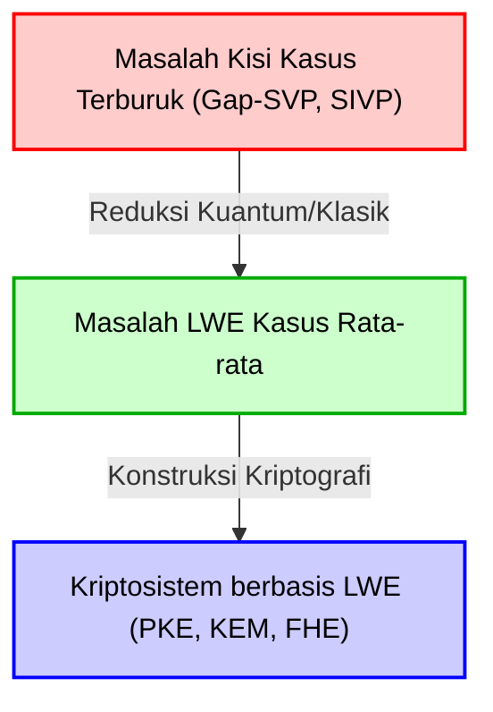
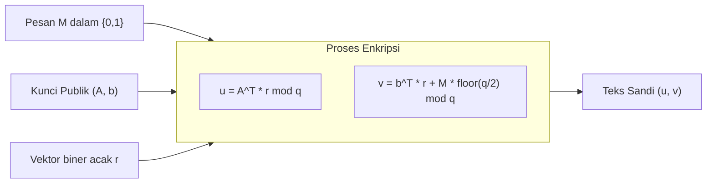
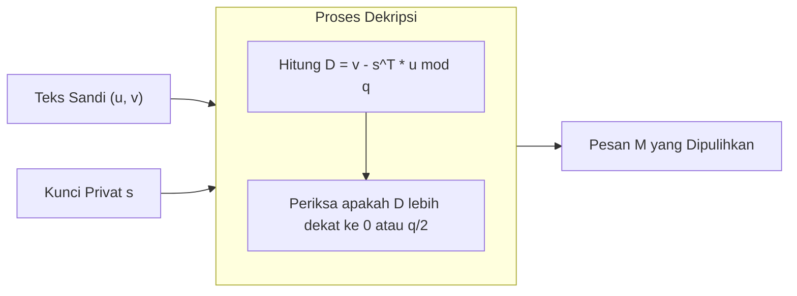

# 1. Pendahuluan: Fajar Kriptografi Pasca-Kuantum (PQC) dan Bangkitnya Kriptografi Berbasis Kisi

Infrastruktur digital masyarakat modern saat ini ditopang oleh teknologi kriptografi kunci publik seperti kriptografi RSA dan kriptografi kurva eliptik (ECC). Metode kriptografi ini mendasarkan keamanannya pada kesulitan matematis seperti "masalah faktorisasi bilangan bulat" dan "masalah logaritma diskrit", yang diyakini tidak dapat dipecahkan secara efisien (membutuhkan waktu eksponensial) oleh komputer klasik konvensional.

Namun, "Algoritma Shor" yang diterbitkan oleh Peter Shor pada tahun 1994, mengirimkan gelombang kejut ke dunia kriptografi. Algoritma ini secara matematis membuktikan bahwa ketika komputer kuantum skala besar terwujud, komputer tersebut akan dapat menyelesaikan masalah faktorisasi bilangan bulat dan masalah logaritma diskrit dalam waktu polinomial. Ini berarti bahwa kriptografi kunci publik yang digunakan secara luas saat ini akan dapat dipecahkan sepenuhnya di masa depan.

Untuk melawan "Ancaman Kuantum (Quantum Threat)" ini, penelitian tentang metode kriptografi baru yang sulit dipecahkan bahkan menggunakan komputer kuantum telah menjadi kebutuhan mendesak. Bidang ini disebut "Kriptografi Pasca-Kuantum (Post-Quantum Cryptography: PQC)".

Ada beberapa kandidat kuat untuk PQC. Kriptografi berbasis hash, kriptografi berbasis kode, kriptografi polinomial multivariat, kriptografi isogeni, dan lain-lain dapat disebutkan, tetapi di antara semuanya, yang paling menarik perhatian saat ini dan menjadi pusat proses standardisasi PQC oleh NIST (Institut Standar dan Teknologi Nasional AS) adalah "Kriptografi berbasis kisi (Lattice-based cryptography)". Dibandingkan dengan metode lain, kriptografi berbasis kisi memiliki fitur luar biasa bahwa kecepatan pemrosesan enkripsi dan dekripsi sangat cepat, dan juga memiliki bukti keamanan yang sangat kuat dalam teori kriptografi, yaitu reduksi dari "kompleksitas kasus terburuk (Worst-case complexity)" ke "kompleksitas kasus rata-rata (Average-case complexity)".

Dalam artikel ini, kita akan memulai dari definisi matematis "Kisi (Lattice)" yang menjadi dasar kriptografi berbasis kisi ini, dan membahas secara mendalam tentang masalah-masalah sulit di atas kisi seperti SVP (Masalah Vektor Terpendek) dan CVP (Masalah Vektor Terdekat), serta "Masalah LWE (Learning With Errors)" yang dapat dikatakan sebagai jantung dari kriptografi berbasis kisi modern, disertai dengan rumus, intuisi geometris, dan contoh numerik konkret.

# 2. Definisi Matematis dan Intuisi Geometris dari Kisi (Lattice)

## 2.1 Ruang Vektor dan Kisi
Dalam matematika, "Kisi (Lattice)" adalah himpunan titik-titik diskrit yang tersusun secara teratur dalam ruang vektor real berdimensi-$n$ $\mathbb{R}^n$. Ini mirip dengan Ruang Vektor (Vector Space) yang dipelajari dalam aljabar linear, tetapi ada perbedaan krusial. Sementara ruang vektor adalah ruang kontinu yang direpresentasikan oleh kombinasi linear dari vektor-vektor basis dengan "koefisien bilangan real", kisi adalah ruang diskrit yang direpresentasikan oleh kombinasi linear dari vektor-vektor basis dengan "koefisien bilangan bulat".

Mari kita berikan definisi matematis yang ketat. Pertimbangkan $n$ buah ($n \le m$) vektor linear independen $\mathbf{b}_1, \mathbf{b}_2, \dots, \mathbf{b}_n$ dalam ruang vektor real berdimensi-$m$ $\mathbb{R}^m$. Misalkan matriks yang memiliki vektor-vektor ini sebagai vektor kolom adalah $B = [\mathbf{b}_1, \mathbf{b}_2, \dots, \mathbf{b}_n] \in \mathbb{R}^{m \times n}$. Kita menyebut $B$ ini sebagai "Basis" dari kisi.

Kisi $\mathcal{L}(B)$ yang dihasilkan oleh basis $B$ ini didefinisikan sebagai berikut:

$$
\mathcal{L}(B) = \left\{ \sum_{i=1}^{n} x_i \mathbf{b}_i \mathrel{\bigg|} x_i \in \mathbb{Z} \right\} = \{ B \mathbf{x} \mid \mathbf{x} \in \mathbb{Z}^n \}
$$

Yang penting di sini adalah bahwa koefisien $x_i$ tidak dibatasi pada bilangan real $\mathbb{R}$, melainkan pada bilangan bulat $\mathbb{Z}$. Dengan ini, alih-alih titik kontinu tak terhingga yang ada di dalam ruang, terbentuklah "himpunan titik-titik diskrit" yang menyerupai persimpangan jaring yang disusun pada interval yang sama.

## 2.2 Citra Geometris
Mari kita pertimbangkan contoh bidang 2 dimensi $\mathbb{R}^2$. Jika kita memilih $\mathbf{b}_1 = \begin{pmatrix} 1 \\ 0 \end{pmatrix}$ dan $\mathbf{b}_2 = \begin{pmatrix} 0 \\ 1 \end{pmatrix}$ sebagai vektor basis, kisi yang dihasilkan oleh keduanya akan menjadi himpunan semua koordinat bilangan bulat $(x, y) \in \mathbb{Z}^2$ pada bidang koordinat. Ini adalah "kisi persegi" yang paling sederhana.

Namun, kisi tidak selalu ortogonal. Misalnya, jika kita mempertimbangkan basis $\mathbf{b}_1 = \begin{pmatrix} 2 \\ 1 \end{pmatrix}$ dan $\mathbf{b}_2 = \begin{pmatrix} 1 \\ 3 \end{pmatrix}$, titik-titik yang dihasilkan akan terlihat seperti persimpangan jaring yang miring.

## 2.3 Ketidakunikan Basis dan Transformasi Unimodular
Terdapat sifat penting yang berkaitan dengan akar keamanan kriptografi berbasis kisi. Yaitu, "ada jumlah tak terhingga basis yang menghasilkan kisi yang sama".

Sebagai contoh, kisi $\mathbb{Z}^2$ yang dihasilkan oleh basis $\mathbf{b}_1 = (1, 0)^T, \mathbf{b}_2 = (0, 1)^T$ sebelumnya akan menghasilkan kisi $\mathbb{Z}^2$ yang sama persis bahkan jika kita menggunakan basis $\mathbf{b}'_1 = (1, 1)^T, \mathbf{b}'_2 = (2, 3)^T$.

Syarat perlu dan cukup agar suatu basis $B$ dan basis lain $B'$ menghasilkan kisi yang sama adalah adanya suatu matriks elemen bilangan bulat $U \in \mathbb{Z}^{n \times n}$, dengan determinan $\det(U) = \pm 1$, sehingga dapat direpresentasikan sebagai
$$ B' = B U $$
Matriks $U$ semacam itu disebut "Matriks unimodular (Unimodular matrix)".

Ide dasar dalam penerapannya pada kriptografi adalah menggunakan "basis yang baik (basis yang mendekati ortogonal dan terdiri dari vektor-vektor pendek)" sebagai kunci privat, dan menggunakan "basis yang buruk (basis yang sangat miring satu sama lain dan terdiri dari vektor-vektor yang sangat panjang)" sebagai kunci publik. Mencari basis yang baik dari basis yang buruk melalui perhitungan menjadi sangat sulit ketika dimensinya tinggi. Inilah intuisi dasar dari kriptografi berbasis kisi.

# 3. Masalah Komputasi yang Sulit pada Kisi

Keamanan kriptografi berbasis kisi bergantung pada kesulitan memecahkan masalah matematis tertentu pada kisi. Di sini, kita akan memperkenalkan dua masalah yang paling mendasar dan terkenal.

## 3.1 Masalah Vektor Terpendek (Shortest Vector Problem: SVP)
SVP adalah masalah yang paling klasik dan terkenal dalam teori kisi.

**Definisi (SVP):**
Diberikan sembarang basis kisi $B$, temukan vektor $\mathbf{v}$ dengan norma Euclidean (panjang) terkecil di antara vektor-vektor bukan nol yang termasuk dalam kisi $\mathcal{L}(B)$ tersebut.

Dinyatakan dalam rumus, ini adalah masalah mencari $\mathbf{v}$ sehingga $\min_{\mathbf{v} \in \mathcal{L}(B) \setminus \{\mathbf{0}\}} \| \mathbf{v} \|$. Panjang minimum ini ditulis sebagai $\lambda_1(\mathcal{L})$ dan disebut "Minimum berurutan pertama (First successive minimum) dari kisi".

Dalam dimensi rendah seperti 2 atau 3 dimensi, jika Anda menggambar sebuah gambar, Anda dapat melihat dan menemukan vektor terpendek dengan mata. Atau, Anda dapat menyelesaikannya secara efisien menggunakan algoritma reduksi kisi Gauss. Namun, ketika dimensi $n$ menjadi dimensi tinggi seperti ratusan hingga ribuan, diketahui bahwa memecahkan SVP secara eksak adalah NP-hard.

Dalam kriptografi dunia nyata, alih-alih vektor terpendek eksak, SVP perkiraan ($\gamma$-SVP) yang menemukan "vektor yang secara perkiraan pendek" digunakan. Jika faktor perkiraan $\gamma$ berukuran polinomial, masalah ini masih dianggap sangat sulit.

## 3.2 Masalah Vektor Terdekat (Closest Vector Problem: CVP)
CVP juga merupakan masalah yang sangat penting dalam kriptografi berbasis kisi.

**Definisi (CVP):**
Diberikan sembarang basis kisi $B$, dan sembarang vektor target $\mathbf{t} \in \mathbb{R}^m$ di dalam ruang (tidak harus titik kisi), temukan titik kisi $\mathbf{v} \in \mathcal{L}(B)$ di antara titik-titik kisi yang paling dekat dengan $\mathbf{t}$.

Dinyatakan dalam rumus, ini adalah masalah mencari titik kisi $\mathbf{v}$ sehingga $\min_{\mathbf{v} \in \mathcal{L}(B)} \| \mathbf{v} - \mathbf{t} \|$.

CVP juga bersifat NP-hard dalam dimensi tinggi, sama seperti SVP. Dari perspektif aplikasi untuk kriptografi, masalah LWE yang dijelaskan di bawah ini berkaitan erat dengan varian khusus dari CVP (Bounded Distance Decoding: BDD).

## 3.3 Mengapa Menjadi Tidak Dapat Dipecahkan Saat Dimensi Tinggi? (Keterbatasan LLL dan BKZ)
Sebagai algoritma terkenal untuk memecahkan masalah kisi berdimensi tinggi, terdapat algoritma LLL (Lenstra-Lenstra-Lovász algorithm). Algoritma LLL beroperasi dalam waktu polinomial dan dapat mereduksi (Reduction) basis kisi menjadi "basis yang baik" sampai tingkat tertentu. Namun, vektor terpendek yang dapat ditemukan oleh algoritma LLL memiliki faktor perkiraan yang eksponensial ($2^{\mathcal{O}(n)}$) terhadap panjang vektor terpendek yang sebenarnya, sehingga tidak mencapai tingkat di mana ia dapat merusak keamanan kriptografi.

Jika kita menggunakan algoritma reduksi basis yang lebih kuat seperti algoritma BKZ (Block Korkine-Zolotarev) yang merupakan peningkatan dari LLL, kita dapat menemukan vektor yang lebih pendek, tetapi kompleksitas komputasinya meningkat secara eksponensial sehubungan dengan ukuran blok. Dalam kriptografi berbasis kisi, parameter yang aman (seperti ukuran dimensi $n$) ditentukan dengan memperkirakan waktu eksekusi dari algoritma BKZ ini. Dalam parameter standar PQC saat ini, nilai 500 hingga 1000 atau lebih dipilih untuk dimensi $n$, dan dikatakan bahwa akan memakan waktu lebih lama daripada umur alam semesta untuk mendekripsinya, bahkan dengan superkomputer atau komputer kuantum di masa depan.

# 4. Formulasi Matematis dari Masalah LWE (Learning With Errors)

Sebagian besar kriptografi berbasis kisi modern didasarkan pada "Masalah LWE (Learning With Errors)" yang diusulkan oleh Oded Regev pada tahun 2005. Keindahan dari masalah LWE terletak pada kesederhanaan formulasinya, dan fakta bahwa ia memiliki bukti matematis yang kuat, yaitu "reduksi dari kompleksitas kasus terburuk ke kompleksitas kasus rata-rata".

## 4.1 Sistem Persamaan Linear Tanpa Noise
Untuk memahami masalah LWE, pertama-tama mari kita pertimbangkan sistem persamaan linear sederhana tanpa noise.
Misalkan ada vektor rahasia yang tidak diketahui $\mathbf{s} \in \mathbb{Z}_q^n$ (setiap komponen adalah bilangan bulat dari $0$ hingga $q-1$). Di sini $q$ adalah bilangan prima.

Kita memilih vektor koefisien acak $\mathbf{a}_1, \mathbf{a}_2, \dots \in \mathbb{Z}_q^n$, dan menghitung hasil kali titik dengan vektor rahasia $\mathbf{s}$ dalam modulo $q$.
$b_1 = \langle \mathbf{a}_1, \mathbf{s} \rangle \pmod q$
$b_2 = \langle \mathbf{a}_2, \mathbf{s} \rangle \pmod q$
$\vdots$

Mengingat jumlah pasangan $(\mathbf{a}_i, b_i)$ yang cukup ($n$ atau lebih), kita dapat dengan mudah memulihkan vektor rahasia $\mathbf{s}$ dengan menggunakan "Eliminasi Gauss (Gaussian elimination)" dalam aljabar linear. Ini adalah masalah yang dapat dengan mudah diselesaikan dalam waktu polinomial.

## 4.2 Definisi Masalah LWE: Menambahkan Noise
Lalu, apa yang terjadi jika kita menambahkan sedikit "noise (kesalahan)" pada masalah ini?
Inilah esensi dari masalah LWE.

Untuk vektor rahasia yang tidak diketahui $\mathbf{s} \in \mathbb{Z}_q^n$, kita menambahkan kesalahan kecil $e_i \in \mathbb{Z}_q$ ke hasil setiap persamaan.
$b_i = \langle \mathbf{a}_i, \mathbf{s} \rangle + e_i \pmod q$

Di sini, $e_i$ adalah nilai bilangan bulat kecil dengan rata-rata 0 dan standar deviasi yang relatif kecil (misalnya, dipilih dari distribusi Gaussian diskrit, seperti distribusi normal).
Informasi yang diberikan adalah daftar pasangan vektor acak $\mathbf{a}_i$ dan $b_i$ yang dihitung dengan menambahkan kesalahan padanya.
$( \mathbf{a}_1, b_1 ), ( \mathbf{a}_2, b_2 ), \dots, ( \mathbf{a}_m, b_m )$

Jika kita merepresentasikan ini dengan matriks, ini menjadi sangat rapi.
Menggunakan matriks acak $A \in \mathbb{Z}_q^{m \times n}$, vektor rahasia $\mathbf{s} \in \mathbb{Z}_q^n$, dan vektor kesalahan $\mathbf{e} \in \mathbb{Z}_q^m$,
$$ \mathbf{b} = A \mathbf{s} + \mathbf{e} \pmod q $$
dapat ditulis seperti di atas. Yang diberikan hanyalah $A$ dan $\mathbf{b}$. Mencari $\mathbf{s}$ dari sini adalah "Masalah pencarian LWE (Search LWE problem)".

Karena terdapat kesalahan $e_i$, jika kita mencoba menggunakan eliminasi Gauss, kesalahan akan diperkuat secara eksponensial dalam proses penambahan dan pengurangan persamaan, sehingga mustahil untuk mencapai jawaban yang benar. Pada pandangan pertama, ini terlihat seperti sistem persamaan linear yang sederhana, tetapi hanya dengan menambahkan noise kecil ini, tingkat kesulitan masalah melompat ke tingkat NP-hard.

## 4.3 Masalah Keputusan LWE (Decision LWE)
Yang sering digunakan dalam pembuktian teori kriptografi adalah variasi dari masalah pencarian LWE, yaitu "Masalah keputusan LWE (Decision LWE problem)".

Masalah keputusan LWE adalah masalah di mana, diberikan daftar sampel yang diperoleh dari salah satu dari dua distribusi berikut, kita harus menentukan dari distribusi mana sampel tersebut berasal.
1. **Distribusi LWE**: Secara sengaja dihitung $(A, \mathbf{b} = A\mathbf{s} + \mathbf{e} \pmod q)$
2. **Distribusi acak seragam**: Sepasang $(A, \mathbf{u})$ yang terdiri dari matriks $A$ dan vektor $\mathbf{u}$ yang dipilih secara acak sepenuhnya.

Hebatnya, jika parameter masalah LWE dipilih dengan tepat, pasangan data yang diperoleh dari distribusi LWE menjadi "secara komputasi tidak dapat dibedakan (Computationally Indistinguishable)" dari pasangan data yang sepenuhnya acak. Sifat inilah yang menjadi dasar bagi kriptografi berbasis LWE untuk dapat menghasilkan "teks sandi (ciphertext) yang tidak dapat dibedakan dari angka acak".

## 4.4 Reduksi dari Kompleksitas Kasus Terburuk ke Kasus Rata-rata (Teorema Regev)
Pencapaian terbesar Oded Regev adalah menghubungkan kesulitan masalah LWE ini secara matematis dengan kesulitan masalah kisi yang disebutkan sebelumnya (SVP dan CVP).

Menggunakan reduksi kuantum (Quantum reduction), ia membuktikan bahwa "Jika ada algoritma waktu polinomial yang dapat menyelesaikan masalah LWE secara rata-rata (untuk $A$ dan $\mathbf{e}$ yang dipilih secara acak), maka ada algoritma kuantum waktu polinomial yang dapat menyelesaikan Gap-SVP kasus terburuk (kasus paling sulit) untuk sembarang kisi". (Belakangan, reduksi klasik juga ditunjukkan oleh Peikert dkk.).

Ini adalah sifat yang diimpikan dalam teori kriptografi. Karena ini menghilangkan kekhawatiran bahwa "kriptografi mungkin dapat dipecahkan karena kita kebetulan memilih kunci yang lemah (bagian dari kasus rata-rata)", dan memberikan jaminan kuat bahwa "jika LWE rata-rata dapat dipecahkan, semua masalah sulit dari kisi dapat dipecahkan (sehingga LWE mutlak sulit)".

# 5. Konstruksi Kriptografi Kunci Publik menggunakan LWE (Kriptografi Regev)

Setelah memahami kesulitan masalah LWE, mari kita lihat skema kriptografi kunci publik dasar yang diusulkan oleh Oded Regev tentang bagaimana menggunakannya untuk enkripsi dan dekripsi. Di sini, kita akan menjelaskan mekanisme paling dasar untuk mengenkripsi pesan 1-bit $M \in \{0, 1\}$.

## 5.1 Pembuatan Kunci (Key Generation)
1. Sebagai parameter sistem, kita tentukan bilangan prima $q$ yang menjadi modulo, dimensi $n$, dan jumlah persamaan $m$ ($m > n \log q$).
2. Sebagai kunci privat, pilih secara acak vektor $\mathbf{s} \in \mathbb{Z}_q^n$.
3. Hasilkan matriks acak $A \in \mathbb{Z}_q^{m \times n}$.
4. Pilih vektor kesalahan kecil $\mathbf{e} \in \mathbb{Z}_q^m$ dari distribusi kesalahan seperti distribusi Gaussian diskrit.
5. Hitung vektor $\mathbf{b} = A \mathbf{s} + \mathbf{e} \pmod q$.
6. Kunci publik (Public Key) adalah $(A, \mathbf{b})$.
7. Kunci privat (Secret Key) adalah $\mathbf{s}$.

Kunci publik persis merupakan "instansiasi dari masalah LWE" itu sendiri. Menemukan kunci privat $\mathbf{s}$ dari kunci publik $(A, \mathbf{b})$ sama dengan memecahkan masalah pencarian LWE, sehingga keamanannya terjamin.

## 5.2 Enkripsi (Encryption)
Alice menggunakan kunci publik Bob $(A, \mathbf{b})$ untuk mengenkripsi pesan 1-bit $M \in \{0, 1\}$.

1. Pilih vektor biner acak (komponennya adalah 0 atau 1) $\mathbf{r} \in \{0, 1\}^m$.
2. Sebagai paruh pertama dari teks sandi, hitung vektor $\mathbf{u} = A^T \mathbf{r} \pmod q$. ($A^T$ adalah matriks transpose dari $A$. Dengan kata lain, ia menjumlahkan baris-baris dari $A$ di mana komponen dari $\mathbf{r}$ adalah 1).
3. Sebagai paruh kedua dari teks sandi, hitung skalar $v = \mathbf{b}^T \mathbf{r} + M \cdot \lfloor \frac{q}{2} \rfloor \pmod q$.
   (Jika pesan $M$ adalah 0, tidak ditambahkan apa-apa, dan jika $1$, ditambahkan persis setengah dari nilai $q$, yaitu $\lfloor \frac{q}{2} \rfloor$).
4. Teks sandi (Ciphertext) adalah $(\mathbf{u}, v)$.

Makna intuitif dari enkripsi adalah mengambil "jumlah subset acak" sehubungan dengan matriks kunci publik $A$ dan vektor $\mathbf{b}$. Karena kesulitan masalah keputusan LWE, teks sandi $(\mathbf{u}, v)$ ini tampak tidak dapat dibedakan dari vektor acak sepenuhnya dan bilangan acak seragam (Keamanan semantik: Semantic Security).

## 5.3 Dekripsi (Decryption)
Bob mendekripsi teks sandi $(\mathbf{u}, v)$ menggunakan kunci privat $\mathbf{s}$.

1. Hitung nilai berikut: $D = v - \mathbf{s}^T \mathbf{u} \pmod q$
2. Jika hasil perhitungan mendekati $0$, keluarkan $M=0$, jika mendekati $\lfloor \frac{q}{2} \rfloor$, keluarkan $M=1$.

Mari kita jabarkan secara matematis mengapa ini dapat didekripsi.
Ingatlah bahwa $\mathbf{b} = A \mathbf{s} + \mathbf{e}$.

$$
\begin{aligned}
v - \mathbf{s}^T \mathbf{u} &= (\mathbf{b}^T \mathbf{r} + M \cdot \lfloor \frac{q}{2} \rfloor) - \mathbf{s}^T (A^T \mathbf{r}) \\
&= ((A \mathbf{s} + \mathbf{e})^T \mathbf{r} + M \cdot \lfloor \frac{q}{2} \rfloor) - \mathbf{s}^T A^T \mathbf{r} \\
&= (\mathbf{s}^T A^T \mathbf{r} + \mathbf{e}^T \mathbf{r} + M \cdot \lfloor \frac{q}{2} \rfloor) - \mathbf{s}^T A^T \mathbf{r} \\
&= \mathbf{e}^T \mathbf{r} + M \cdot \lfloor \frac{q}{2} \rfloor \pmod q
\end{aligned}
$$

Di sini, dari rumus tersebut, $\mathbf{s}^T A^T \mathbf{r}$ saling meniadakan dengan rapi dan menghilang!
Yang tersisa adalah $\mathbf{e}^T \mathbf{r} + M \cdot \lfloor \frac{q}{2} \rfloor$.

$\mathbf{e}$ adalah vektor noise dengan komponen yang sangat kecil, dan $\mathbf{r}$ adalah vektor biner dengan komponen 0 atau 1. Oleh karena itu, hasil kali titik dari keduanya, $\mathbf{e}^T \mathbf{r}$, juga (jika parameter dipilih dengan benar) tetap merupakan nilai yang relatif kecil.

- Jika $M=0$, hasilnya menjadi $\mathbf{e}^T \mathbf{r}$, yang merupakan nilai kecil mendekati $0$.
- Jika $M=1$, hasilnya menjadi $\mathbf{e}^T \mathbf{r} + \lfloor \frac{q}{2} \rfloor$, yang terletak di sekitar nilai setengah dari $q$, yaitu $\lfloor \frac{q}{2} \rfloor$.

Jika parameter dirancang sedemikian rupa sehingga nilai absolut dari kesalahan $\mathbf{e}^T \mathbf{r}$ berada di bawah $\frac{q}{4}$, Bob dapat menentukan (mendekripsi) pesan $M$ secara akurat hanya dengan melihat apakah hasil perhitungan lebih dekat ke $0$ atau ke $\lfloor \frac{q}{2} \rfloor$. Ini adalah mekanisme indah di mana kriptografi berbasis LWE bekerja.

# 6. Contoh Mainan (Toy Example) dari Kriptografi LWE dengan Nilai Numerik Spesifik

Saya pikir sulit untuk merasakan hanya dengan deretan rumus, jadi mari kita benar-benar mengatur parameter numerik yang sangat kecil dan mengikuti perhitungan dari enkripsi hingga dekripsi.
(※ Dalam sistem kriptografi dunia nyata, untuk memastikan keamanan, nilai 500 atau lebih digunakan untuk $n$, dan ribuan atau lebih digunakan untuk $q$)

**[Pengaturan Parameter]**
- Modulo $q = 17$ (Bilangan prima. Oleh karena itu, nilainya berkisar dari $0$ hingga $16$)
- Dimensi $n = 2$
- Jumlah persamaan $m = 4$
- Misalkan kita mengenkripsi pesan $M = 1$.
- Jumlah pergeseran pesan: $\lfloor \frac{q}{2} \rfloor = \lfloor \frac{17}{2} \rfloor = 8$

**[1. Fase Pembuatan Kunci]**
Bob memilih kunci privat $\mathbf{s}$, matriks $A$, dan vektor kesalahan $\mathbf{e}$ secara acak.
$$ \mathbf{s} = \begin{pmatrix} 3 \\ 4 \end{pmatrix} \in \mathbb{Z}_{17}^2 $$
$$ A = \begin{pmatrix} 2 & 15 \\ 1 & 8 \\ 14 & 5 \\ 9 & 10 \end{pmatrix} \in \mathbb{Z}_{17}^{4 \times 2} $$
$$ \mathbf{e} = \begin{pmatrix} 1 \\ -1 \\ 0 \\ 2 \end{pmatrix} \equiv \begin{pmatrix} 1 \\ 16 \\ 0 \\ 2 \end{pmatrix} \pmod{17} $$

Selanjutnya kita hitung kunci publik $\mathbf{b}$.
$$ A \mathbf{s} = \begin{pmatrix} 2 & 15 \\ 1 & 8 \\ 14 & 5 \\ 9 & 10 \end{pmatrix} \begin{pmatrix} 3 \\ 4 \end{pmatrix} = \begin{pmatrix} 2\times 3 + 15\times 4 \\ 1\times 3 + 8\times 4 \\ 14\times 3 + 5\times 4 \\ 9\times 3 + 10\times 4 \end{pmatrix} = \begin{pmatrix} 6 + 60 \\ 3 + 32 \\ 42 + 20 \\ 27 + 40 \end{pmatrix} = \begin{pmatrix} 66 \\ 35 \\ 62 \\ 67 \end{pmatrix} $$
Kita hitung ini dalam modulo 17. ($66 = 17 \times 3 + 15$, dst.)
$$ A \mathbf{s} \pmod{17} = \begin{pmatrix} 15 \\ 1 \\ 11 \\ 16 \end{pmatrix} $$
Tambahkan vektor kesalahan $\mathbf{e}$.
$$ \mathbf{b} = A \mathbf{s} + \mathbf{e} = \begin{pmatrix} 15 \\ 1 \\ 11 \\ 16 \end{pmatrix} + \begin{pmatrix} 1 \\ 16 \\ 0 \\ 2 \end{pmatrix} = \begin{pmatrix} 16 \\ 17 \\ 11 \\ 18 \end{pmatrix} \equiv \begin{pmatrix} 16 \\ 0 \\ 11 \\ 1 \end{pmatrix} \pmod{17} $$

Kunci publiknya adalah $A$ dan $\mathbf{b} = (16, 0, 11, 1)^T$.

**[2. Fase Enkripsi]**
Alice mengenkripsi pesan $M = 1$.
Pilih vektor acak $\mathbf{r}$. Di sini kita tetapkan $\mathbf{r} = (1, 0, 1, 0)^T$.

Hitung $\mathbf{u}$.
$$ \mathbf{u} = A^T \mathbf{r} = \begin{pmatrix} 2 & 1 & 14 & 9 \\ 15 & 8 & 5 & 10 \end{pmatrix} \begin{pmatrix} 1 \\ 0 \\ 1 \\ 0 \end{pmatrix} = \begin{pmatrix} 2 \times 1 + 14 \times 1 \\ 15 \times 1 + 5 \times 1 \end{pmatrix} = \begin{pmatrix} 16 \\ 20 \end{pmatrix} \equiv \begin{pmatrix} 16 \\ 3 \end{pmatrix} \pmod{17} $$

Hitung $v$.
$$ \mathbf{b}^T \mathbf{r} = (16, 0, 11, 1) \begin{pmatrix} 1 \\ 0 \\ 1 \\ 0 \end{pmatrix} = 16 \times 1 + 11 \times 1 = 27 \equiv 10 \pmod{17} $$
Tambahkan nilai $\lfloor 17/2 \rfloor = 8$ yang sesuai dengan pesan $M=1$.
$$ v = \mathbf{b}^T \mathbf{r} + M \cdot 8 = 10 + 1 \times 8 = 18 \equiv 1 \pmod{17} $$

Alice mengirimkan teks sandi $(\mathbf{u}, v) = \left( \begin{pmatrix} 16 \\ 3 \end{pmatrix}, 1 \right)$ kepada Bob.

**[3. Fase Dekripsi]**
Menerima teks sandi, Bob mendekripsinya menggunakan kunci privat $\mathbf{s} = (3, 4)^T$.
Rumus proses dekripsi: Hitung $D = v - \mathbf{s}^T \mathbf{u} \pmod{17}$.

$$ \mathbf{s}^T \mathbf{u} = (3, 4) \begin{pmatrix} 16 \\ 3 \end{pmatrix} = 3 \times 16 + 4 \times 3 = 48 + 12 = 60 \equiv 9 \pmod{17} $$
$$ D = v - \mathbf{s}^T \mathbf{u} = 1 - 9 = -8 \pmod{17} $$

Di sini, di dunia modulo 17, $-8$ sama dengan $9$ ($-8 + 17 = 9$).
Tentukan apakah nilai $D = 9$ yang diperoleh lebih dekat ke $0$ atau $8$ ($\lfloor 17/2 \rfloor$).
Karena $9$ jelas lebih dekat ke $8$ daripada ke $0$, Bob berhasil memulihkan $M = 1$ dengan benar!

Mengapa menjadi $9$? Mari kita ingat kembali pembuktian sebelumnya.
Bagian kesalahan adalah $\mathbf{e}^T \mathbf{r} = (1, -1, 0, 2) (1, 0, 1, 0)^T = 1 \times 1 + 0 \times 1 = 1$.
Oleh karena itu, hasil perhitungannya adalah $\mathbf{e}^T \mathbf{r} + M \cdot 8 = 1 + 8 = 9$, dan dapat dipastikan bahwa nilai sesuai dengan teori telah dihitung.

# 7. Evolusi Menuju Penerapan Praktis: Ring-LWE dan Module-LWE

Masalah LWE standar (Standard LWE) yang dijelaskan sejauh ini memiliki bukti keamanan yang sangat kuat, tetapi memiliki kelemahan fatal dalam penggunaan praktis. Yaitu "ukuran kunci menjadi raksasa" dan "biaya komputasi tinggi".

Dalam Standard LWE, kunci publik berisi matriks raksasa $A \in \mathbb{Z}_q^{m \times n}$. Ketika parameter $n$ menjadi ratusan hingga ribuan, ukuran matriks ini mencapai beberapa megabyte, sehingga terlalu berat untuk dikirim dan diterima setiap saat dalam protokol komunikasi di internet (seperti TLS). Selain itu, perkalian matriks dan vektor membutuhkan kompleksitas komputasi sebesar $\mathcal{O}(n^2)$.

Untuk mengatasi masalah ini, diperkenalkanlah "Ring-LWE (RLWE)" dan "Module-LWE (MLWE)", yang memasukkan struktur aljabar yang disebut cincin polinomial (Polynomial rings) ke dalam kisi.

## 7.1 Intuisi dari Ring-LWE
Dalam Ring-LWE, vektor dan matriks digantikan dengan elemen (polinomial) pada cincin polinomial $\mathcal{R}_q = \mathbb{Z}_q[X]/(X^n + 1)$. (Di sini $n$ dipilih sebagai pangkat 2).

Sementara kunci publik dari Standard LWE adalah matriks $A$, Ring-LWE menggunakan polinomial tunggal $a(x)$. Kunci privat $s(x)$ dan kesalahan $e(x)$ juga menjadi polinomial.
Persamaannya menjadi sebagai berikut:
$$ b(x) = a(x) \cdot s(x) + e(x) \pmod q $$

Karena ini adalah perkalian polinomial, dengan menggunakan "Number Theoretic Transform (NTT)", yang mirip dengan Fast Fourier Transform (FFT), kompleksitas komputasi dapat dikurangi secara dramatis menjadi $\mathcal{O}(n \log n)$. Lebih jauh lagi, karena ukuran kunci publik juga berkurang dari matriks menjadi polinomial tunggal, ukuran data berkurang menjadi $\mathcal{O}(n)$. Ini memberikan keuntungan yang luar biasa dalam bandwidth komunikasi.

Secara matematis, Ring-LWE bukan direduksi menjadi masalah pada kisi umum, melainkan pada kisi dengan simetri khusus yang disebut "Kisi Ideal (Ideal Lattice)".

## 7.2 Module-LWE dan Standardisasi NIST (Kyber / ML-KEM)
Meskipun Ring-LWE efisien, ada sedikit kekhawatiran bahwa struktur aljabar khusus dari kisi ideal dapat menjadi petunjuk untuk serangan di masa depan. Oleh karena itu, "Module-LWE (MLWE)" mengambil "yang terbaik dari kedua dunia" dari keamanan konservatif Standard LWE dan efisiensi Ring-LWE.

Dalam Module-LWE, kita mempertimbangkan matriks kecil dan vektor yang elemennya adalah polinomial. Dengan kata lain, kita menangani modul di atas cincin.
Saat ini, "CRYSTALS-Kyber" (nama standar: ML-KEM), yang dipilih oleh NIST sebagai standar untuk algoritma enkapsulasi kunci (KEM) PQC, dibangun tepat di atas kesulitan masalah Module-LWE ini.

# 8. Mengapa Ini Aman Terhadap Komputer Kuantum?

Terakhir, mari kita sentuh bagian inti dari "Mengapa kriptografi berbasis kisi diyakini tidak dapat dipecahkan bahkan menggunakan komputer kuantum?".

Algoritma Shor, yang digunakan komputer kuantum untuk memecahkan kriptografi RSA dan kriptografi kurva eliptik, pada dasarnya adalah algoritma untuk memecahkan "Masalah Subgrup Tersembunyi (Hidden Subgroup Problem: HSP)". Struktur matematika di balik RSA dan ECC (grup Abelian hingga) memiliki periodisitas, dan dengan menggunakan operasi yang unik untuk algoritma kuantum yang disebut Transformasi Fourier Kuantum (Quantum Fourier Transform: QFT), periode ini (subgrup tersembunyi) dapat diekstraksi sekaligus.

Namun, masalah kisi pada dasarnya berbeda. Meskipun kisi juga memiliki periodisitas, apa yang dicari dalam SVP dan CVP adalah sifat geometris non-linear seperti "jarak terpendek" dan "penghilangan noise". Bahkan jika "transformasi Fourier kuantum pada grup Abelian" seperti algoritma Shor diterapkan secara langsung, informasi berguna yang merupakan jawaban dari masalah kisi tidak dapat diekstraksi secara efisien. Hingga saat ini, tidak ada algoritma kuantum yang dapat memecahkan SVP dan LWE dalam waktu polinomial yang telah ditemukan, dan diyakini secara luas bahwa bahkan dengan kekuatan komputasi paralel dari komputer kuantum, satu-satunya metode yang efektif hanyalah pencarian yang mendekati brute force (percepatan akar kuadrat oleh algoritma Grover).

# 9. Kesimpulan

Dalam artikel ini, kami telah menjelaskan secara rinci tentang intuisi matematis kriptografi berbasis kisi, mulai dari definisi geometris kisi, formulasi masalah LWE, dan menuju konstruksi kriptografi kunci publik.

1. **Kisi (Lattice)** adalah ruang diskrit yang direpresentasikan oleh kombinasi linear koefisien bilangan bulat dari vektor basis, dan dalam dimensi tinggi menjadi sulit untuk menemukan "basis yang baik" yang mendekati ortogonal (SVP).
2. **Masalah LWE (Learning With Errors)** adalah masalah memecahkan sistem persamaan linear dengan noise, dan karena ini terkait dengan kesulitan masalah kasus terburuk pada kisi, ini memberikan bukti keamanan yang kuat.
3. Dengan menggunakan masalah LWE, enkripsi dan dekripsi (**Kriptografi Regev**) direalisasikan oleh mekanisme cerdik yang secara sengaja menambahkan atau menghapus noise.
4. Dalam protokol dunia nyata, untuk meningkatkan efisiensi komunikasi dan kecepatan komputasi, **Ring-LWE** dan **Module-LWE** yang menggunakan cincin polinomial diadopsi, dan ini menjadi fondasi **ML-KEM** yang merupakan standar NIST.

Di tengah pergeseran paradigma komputasi yang belum pernah terjadi sebelumnya yang disebut komputer kuantum, sangatlah romantis bahwa "Kriptografi berbasis kisi", yang lahir dari kedalaman aljabar linear klasik dan teori bilangan, akan memikul fondasi keamanan internet masa depan. Matematika yang menjadi dasar kriptografi berbasis kisi sama sekali tidak terlalu sulit untuk dipahami, dan dengan pengetahuan dasar tentang aljabar linear dan probabilitas, struktur indahnya dapat dipahami dengan baik. Kami berharap artikel ini dapat membantu Anda dalam memahami kriptografi berbasis kisi, yang merupakan inti dari PQC.
