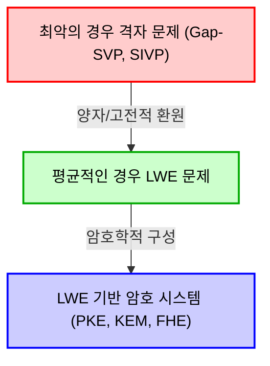
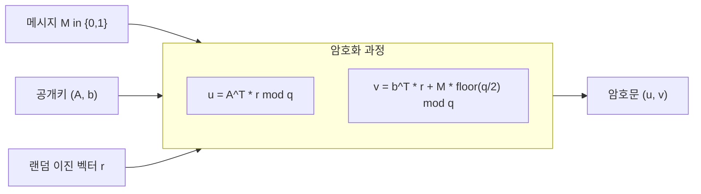
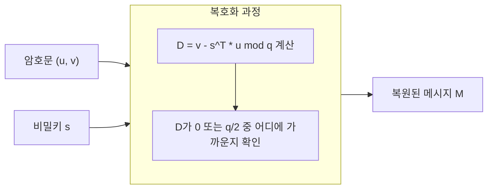

# 1. 도입: 포스트 양자 암호(PQC)의 여명과 격자 암호의 대두

현대 사회의 디지털 인프라를 지탱하고 있는 것은 RSA 암호나 타원곡선암호(ECC)를 비롯한 공개키 암호 기술입니다. 이러한 암호 방식은 '소인수분해 문제'나 '이산대수 문제'와 같은, 기존의 고전 컴퓨터로는 효율적으로 풀 수 없다고(지수 함수적인 시간이 소요된다고) 믿어지는 수학적 난해성에 안전성의 근거를 두고 있습니다.

그러나 1994년 피터 쇼어(Peter Shor)가 발표한 '쇼어 알고리즘(Shor's algorithm)'은 암호계에 큰 충격을 주었습니다. 이 알고리즘은 대규모 양자 컴퓨터가 실현될 경우 소인수분해 문제나 이산대수 문제를 다항식 시간 내에 풀어버린다는 것을 수학적으로 증명한 것입니다. 이는 즉, 현재 널리 이용되고 있는 공개키 암호가 장래에는 완전히 해독 가능해진다는 것을 의미합니다.

이러한 '양자 컴퓨터의 위협(Quantum Threat)'에 대응하기 위해, 양자 컴퓨터를 사용해도 해독이 어려운 새로운 암호 방식의 연구가 시급해졌습니다. 이것이 '포스트 양자 암호(Post-Quantum Cryptography: PQC)' 또는 '양자 내성 암호'라고 불리는 분야입니다.

PQC에는 몇 가지 유력한 후보가 존재합니다. 해시 기반 암호, 코드 기반 암호, 다변수 다항식 암호, 아이소제니 기반 암호 등을 들 수 있지만, 그 중에서도 현재 가장 주목받고 있으며 NIST(미국 국립표준기술연구소)의 PQC 표준화 프로세스의 중심이 되고 있는 것이 바로 '격자 암호(Lattice-based cryptography)'입니다. 격자 암호는 다른 방식과 비교하여 암호화 및 복호화 처리 속도가 매우 빠르며, 또한 '최악의 경우 복잡도(Worst-case complexity)'를 '평균적인 경우 복잡도(Average-case complexity)'로 환원하는, 암호 이론에 있어서 극히 강력한 안전성 증명을 갖는다는 두드러진 특징을 가지고 있습니다.

본 기사에서는 이 격자 암호의 기초가 되는 '격자(Lattice)'의 수학적 정의부터 출발하여, 격자 상의 어려운 문제인 SVP(최단 벡터 문제)나 CVP(최근접 벡터 문제), 그리고 현대 격자 암호의 심장부라고도 할 수 있는 'LWE 문제(Learning With Errors)'에 대해 수식과 기하학적인 직관, 그리고 구체적인 수치 예를 섞어 철저하고 깊이 있게 해설하겠습니다.

# 2. 격자(Lattice)의 수학적 정의와 기하학적 직관

## 2.1 벡터 공간과 격자
수학에서 '격자(Lattice)'란 $n$차원 실수 벡터 공간 $\mathbb{R}^n$ 내에 규칙적으로 늘어선 이산적인 점들의 집합을 말합니다. 선형대수학에서 배우는 벡터 공간(Vector Space)과 비슷하지만 결정적인 차이가 있습니다. 벡터 공간이 기저 벡터의 '실수 계수'를 통한 선형 결합으로 표현되는 연속적인 공간인 반면, 격자는 기저 벡터의 '정수 계수'를 통한 선형 결합으로 표현되는 이산적인 공간입니다.

수학적으로 엄밀한 정의를 내려보겠습니다. $m$차원 실수 벡터 공간 $\mathbb{R}^m$에서의 $n$개($n \le m$)의 선형 독립적인 벡터 $\mathbf{b}_1, \mathbf{b}_2, \dots, \mathbf{b}_n$을 생각해 봅시다. 이들 벡터를 열벡터로 가지는 행렬을 $B = [\mathbf{b}_1, \mathbf{b}_2, \dots, \mathbf{b}_n] \in \mathbb{R}^{m \times n}$이라고 합니다. 이 $B$를 격자의 '기저(Basis)'라고 부릅니다.

이 기저 $B$에 의해 생성되는 격자 $\mathcal{L}(B)$는 다음과 같이 정의됩니다.

$$
\mathcal{L}(B) = \left\{ \sum_{i=1}^{n} x_i \mathbf{b}_i \mathrel{\bigg|} x_i \in \mathbb{Z} \right\} = \{ B \mathbf{x} \mid \mathbf{x} \in \mathbb{Z}^n \}
$$

여기서 중요한 것은 계수 $x_i$가 실수 $\mathbb{R}$이 아니라 정수 $\mathbb{Z}$로 한정되어 있다는 점입니다. 이로 인해 공간 내에 무수히 존재하는 연속적인 점이 아니라, 일정한 간격으로 배치된 교차점과 같은 '이산적인 점들의 집합'이 형성됩니다.

## 2.2 기하학적 이미지
2차원 평면 $\mathbb{R}^2$의 예로 생각해 봅시다. 기저 벡터로서 $\mathbf{b}_1 = \begin{pmatrix} 1 \\ 0 \end{pmatrix}$와 $\mathbf{b}_2 = \begin{pmatrix} 0 \\ 1 \end{pmatrix}$을 선택한 경우, 이들에 의해 생성되는 격자는 좌표평면 상의 모든 정수 좌표 $(x, y) \in \mathbb{Z}^2$의 집합이 됩니다. 이는 가장 단순한 '정방격자'입니다.

그러나 격자가 항상 직교하는 것은 아닙니다. 예를 들어, $\mathbf{b}_1 = \begin{pmatrix} 2 \\ 1 \end{pmatrix}$과 $\mathbf{b}_2 = \begin{pmatrix} 1 \\ 3 \end{pmatrix}$이라는 기저를 생각해보면, 생성되는 점은 비스듬하게 왜곡된 그물망의 교차점처럼 됩니다.

## 2.3 기저의 비유일성과 유니모듈러 변환
격자 암호의 안전성 근간과 관련된 중요한 성질이 있습니다. 그것은 '동일한 격자를 생성하는 기저는 무수히 존재한다'는 것입니다.

예를 들어, 앞서 설명한 $\mathbf{b}_1 = (1, 0)^T, \mathbf{b}_2 = (0, 1)^T$라는 기저가 생성하는 $\mathbb{Z}^2$ 격자는 $\mathbf{b}'_1 = (1, 1)^T, \mathbf{b}'_2 = (2, 3)^T$라는 기저를 사용해도 완전히 같은 격자 $\mathbb{Z}^2$를 생성합니다.

어떤 기저 $B$와 다른 기저 $B'$가 같은 격자를 생성하기 위한 필요충분조건은, 정수 성분을 가진 행렬 $U \in \mathbb{Z}^{n \times n}$이면서 행렬식이 $\det(U) = \pm 1$이 되는 것이 존재하여,
$$ B' = B U $$
로 표현될 수 있다는 것입니다. 이러한 행렬 $U$를 '유니모듈러 행렬(Unimodular matrix)'이라고 부릅니다.

암호에 응용할 때의 기본적인 아이디어는 '좋은 기저(직교에 가깝고 짧은 벡터로 이루어진 기저)'를 비밀키로 하고, '나쁜 기저(서로 극단적으로 비스듬하게 교차하며 매우 긴 벡터로 이루어진 기저)'를 공개키로 사용하는 것입니다. 나쁜 기저로부터 좋은 기저를 계산해내는 것은 차원이 높아질수록 매우 어려워집니다. 이것이 격자 암호의 기본적인 직관입니다.

# 3. 격자에서의 계산이 어려운 문제

격자 암호의 안전성은 격자 상의 특정한 수학적 문제를 푸는 것의 어려움에 의존하고 있습니다. 여기서는 가장 기본적이면서 유명한 두 가지 문제를 소개합니다.

## 3.1 최단 벡터 문제(Shortest Vector Problem: SVP)
SVP는 격자 이론에서 가장 고전적이고 유명한 문제입니다.

**정의 (SVP):**
임의의 격자 기저 $B$가 주어졌을 때, 그 격자 $\mathcal{L}(B)$에 속하는 영(zero)이 아닌 벡터 중에서 유클리드 노름(길이)이 최소가 되는 벡터 $\mathbf{v}$를 찾아라.

수식으로 표현하면, $\min_{\mathbf{v} \in \mathcal{L}(B) \setminus \{\mathbf{0}\}} \| \mathbf{v} \|$가 되는 $\mathbf{v}$를 구하는 문제입니다. 이 최소 길이를 $\lambda_1(\mathcal{L})$로 쓰고, '격자의 제1연속 최소값(First successive minimum)'이라고 부릅니다.

2차원이나 3차원처럼 낮은 차원이라면, 그림을 그려서 눈으로 가장 짧은 벡터를 찾을 수 있습니다. 또는 가우스의 격자 축소 알고리즘(Gauss lattice reduction algorithm) 등을 사용하여 효율적으로 풀 수 있습니다. 그러나 차원 $n$이 수백에서 수천과 같은 고차원이 되면, SVP를 엄밀하게 푸는 것은 NP-hard임이 알려져 있습니다.

실제 암호에서는 엄밀한 최단 벡터가 아니라, '근사적으로 짧은 벡터'를 찾는 근사 SVP($\gamma$-SVP)가 사용됩니다. 근사 계수 $\gamma$가 다항식 크기일 경우, 이 문제는 여전히 매우 어려운 것으로 간주됩니다.

## 3.2 최근접 벡터 문제(Closest Vector Problem: CVP)
CVP 또한 격자 암호에 있어서 매우 중요한 문제입니다.

**정의 (CVP):**
임의의 격자 기저 $B$와, 공간 내의 임의의 타겟 벡터 $\mathbf{t} \in \mathbb{R}^m$ (반드시 격자점일 필요는 없음)이 주어졌을 때, 격자점 중에서 $\mathbf{t}$에 가장 가까운 격자점 $\mathbf{v} \in \mathcal{L}(B)$를 찾아라.

수식으로 표현하면, $\min_{\mathbf{v} \in \mathcal{L}(B)} \| \mathbf{v} - \mathbf{t} \|$가 되는 격자점 $\mathbf{v}$를 찾는 문제입니다.

CVP 역시 SVP와 마찬가지로 고차원에서는 NP-hard입니다. 암호에의 응용이라는 관점에서, 후술할 LWE 문제는 이 CVP의 특수한 변형(Bounded Distance Decoding: BDD)과 밀접한 관계가 있습니다.

## 3.3 왜 고차원이 되면 풀 수 없는가? (LLL과 BKZ의 한계)
고차원의 격자 문제를 풀기 위한 유명한 알고리즘으로 LLL 알고리즘(Lenstra-Lenstra-Lovász algorithm)이 있습니다. LLL 알고리즘은 다항식 시간에 동작하며, 격자 기저를 어느 정도 '좋은 기저'로 축소(Reduction)할 수 있습니다. 그러나 LLL 알고리즘이 찾을 수 있는 최단 벡터는 진정한 최단 벡터의 길이에 대해 지수 함수적인($2^{\mathcal{O}(n)}$) 근사 계수를 가지기 때문에, 암호의 안전성을 깨뜨리기에는 역부족입니다.

LLL을 개량한 BKZ(Block Korkine-Zolotarev) 알고리즘과 같은 더 강력한 기저 축소 알고리즘을 사용하면 더 짧은 벡터를 찾을 수 있지만, 그 계산량은 블록 크기에 대해 지수 함수적으로 증가합니다. 격자 암호에서는 이 BKZ 알고리즘의 실행 시간을 추정함으로써 안전한 파라미터(차원 $n$의 크기 등)를 결정하고 있습니다. 현재 PQC의 표준 파라미터에서는 차원 $n$이 500에서 1000 이상의 값으로 선택되고 있으며, 슈퍼컴퓨터나 미래의 양자 컴퓨터를 사용하더라도 해독하는 데에는 우주의 나이 이상의 시간이 걸릴 것으로 여겨집니다.

# 4. LWE 문제(Learning With Errors)의 수학적 정식화

현대 격자 암호의 대부분은 2005년 오데드 레게브(Oded Regev)가 제안한 'LWE 문제(Learning With Errors)'를 기반으로 하고 있습니다. LWE 문제의 아름다움은 그 정식화의 단순함과 '최악의 경우 복잡도에서 평균적인 경우 복잡도로의 환원'이라는 강력한 수학적 증명을 가지고 있다는 점에 있습니다.

## 4.1 노이즈가 없는 연립 일차 방정식
LWE 문제를 이해하기 위해, 우선 노이즈가 없는 단순한 연립 일차 방정식을 생각해 봅시다.
미지의 비밀 벡터 $\mathbf{s} \in \mathbb{Z}_q^n$ (각 성분은 $0$부터 $q-1$까지의 정수)가 있다고 가정합니다. 여기서 $q$는 소수라고 합니다.

랜덤한 계수 벡터 $\mathbf{a}_1, \mathbf{a}_2, \dots \in \mathbb{Z}_q^n$을 선택하고, 비밀 벡터 $\mathbf{s}$와의 내적을 법 $q$로 계산합니다.
$b_1 = \langle \mathbf{a}_1, \mathbf{s} \rangle \pmod q$
$b_2 = \langle \mathbf{a}_2, \mathbf{s} \rangle \pmod q$
$\vdots$

충분한 수($n$개 이상)의 $(\mathbf{a}_i, b_i)$ 쌍이 주어질 경우, 우리는 선형대수의 '가우스 소거법(Gaussian elimination)'을 사용하여 쉽게 비밀 벡터 $\mathbf{s}$를 복원할 수 있습니다. 이는 다항식 시간 내에 간단히 풀 수 있는 문제입니다.

## 4.2 LWE 문제의 정의: 노이즈를 더하다
그렇다면, 이 문제에 약간의 '노이즈(오차)'를 더하면 어떻게 될까요?
이것이 LWE 문제의 본질입니다.

미지의 비밀 벡터 $\mathbf{s} \in \mathbb{Z}_q^n$에 대하여, 각 방정식의 결과에 작은 오차 $e_i \in \mathbb{Z}_q$를 더합니다.
$b_i = \langle \mathbf{a}_i, \mathbf{s} \rangle + e_i \pmod q$

여기서 $e_i$는 평균이 0이고 표준편차가 비교적 작은(예를 들어 정규분포와 같은, 이산 가우스 분포에서 선택된) 작은 정수값입니다.
주어지는 정보는 랜덤한 벡터 $\mathbf{a}_i$와, 거기에 오차를 더해 계산된 $b_i$ 쌍의 리스트입니다.
$( \mathbf{a}_1, b_1 ), ( \mathbf{a}_2, b_2 ), \dots, ( \mathbf{a}_m, b_m )$

이를 행렬로 표현하면 매우 깔끔해집니다.
랜덤한 행렬 $A \in \mathbb{Z}_q^{m \times n}$, 비밀 벡터 $\mathbf{s} \in \mathbb{Z}_q^n$, 오차 벡터 $\mathbf{e} \in \mathbb{Z}_q^m$을 사용하여,
$$ \mathbf{b} = A \mathbf{s} + \mathbf{e} \pmod q $$
라고 쓸 수 있습니다. 주어지는 것은 $A$와 $\mathbf{b}$뿐입니다. 여기서 $\mathbf{s}$를 구하는 것이 '탐색 LWE 문제(Search LWE problem)'입니다.

오차 $e_i$가 들어있기 때문에, 가우스 소거법을 사용하려고 하면 방정식을 더하고 빼는 과정에서 오차가 지수 함수적으로 증폭되어 올바른 답에 도달할 수 없게 됩니다. 얼핏 보면 단순한 연립 일차 방정식처럼 보이지만, 이 작은 노이즈가 더해지는 것만으로 문제의 난이도가 NP-hard 수준으로 뛰어오르게 됩니다.

## 4.3 결정 LWE 문제(Decision LWE)
암호 이론의 증명에서 빈번하게 사용되는 것은 탐색 LWE 문제의 변형인 '결정 LWE 문제(Decision LWE problem)'입니다.

결정 LWE 문제란, 다음의 2가지 분포에서 얻은 샘플의 리스트가 주어졌을 때, 그것이 어느 분포에서 온 것인지를 판정하는 문제입니다.
1. **LWE 분포**: 의도적으로 계산된 $(A, \mathbf{b} = A\mathbf{s} + \mathbf{e} \pmod q)$
2. **균등 랜덤 분포**: 완전히 랜덤하게 선택된 행렬 $A$와 벡터 $\mathbf{u}$로 이루어진 $(A, \mathbf{u})$

놀랍게도, LWE 문제의 파라미터를 적절히 선택하면, LWE 분포에서 얻은 쌍은 완전히 랜덤한 데이터 쌍과 '계산량적으로 식별 불가능(Computationally Indistinguishable)'해집니다. 이 성질이 LWE 기반 암호가 '난수와 구별할 수 없는 암호문'을 생성할 수 있는 근거가 됩니다.

## 4.4 최악의 경우 복잡도에서 평균적인 경우 복잡도로의 환원(레게브의 정리)
오데드 레게브의 가장 큰 공적은 이 LWE 문제의 어려움을 앞서 언급한 격자 문제(SVP나 CVP)의 어려움에 수학적으로 연결시킨 것입니다.

그는 양자 환원(Quantum reduction)을 사용하여, '만약 LWE 문제를 평균적으로(랜덤하게 선택된 $A$와 $\mathbf{e}$에 대해) 풀 수 있는 다항식 시간 알고리즘이 존재한다면, 임의의 격자의 최악의 경우(가장 어려운 경우)의 Gap-SVP를 풀 수 있는 다항식 시간의 양자 알고리즘이 존재한다'는 것을 증명했습니다. (나중에 페이커트(Peikert) 등에 의해 고전적인 환원도 증명되었습니다.)

이는 암호 이론에 있어 꿈과 같은 성질입니다. 왜냐하면, '암호가 깨지는 것은 우리가 우연히 약한 키(평균적인 경우의 일부)를 선택해 버렸기 때문일지도 모른다'는 우려를 불식시키고, '평균적인 LWE를 풀 수 있다면, 격자의 모든 어려운 문제를 풀 수 있게 된다(그러므로 LWE는 절대적으로 어렵다)'는 강력한 보증을 해주기 때문입니다.

# 5. LWE를 이용한 공개키 암호 방식(레게브 암호)의 구성

LWE 문제의 어려움을 이해했으니, 그것을 사용하여 어떻게 암호화와 복호화를 수행하는지, 오데드 레게브가 제안한 기본적인 공개키 암호 방식을 살펴봅시다. 여기서는 1비트의 메시지 $M \in \{0, 1\}$를 암호화하는 가장 기본적인 메커니즘을 설명합니다.

## 5.1 키 생성(Key Generation)
1. 시스템 파라미터로서 법이 되는 소수 $q$, 차원 $n$, 방정식의 수 $m$($m > n \log q$)을 결정합니다.
2. 비밀키로서 벡터 $\mathbf{s} \in \mathbb{Z}_q^n$를 랜덤하게 선택합니다.
3. 랜덤한 행렬 $A \in \mathbb{Z}_q^{m \times n}$을 생성합니다.
4. 작은 오차 벡터 $\mathbf{e} \in \mathbb{Z}_q^m$를 이산 가우스 분포 등의 오차 분포에서 선택합니다.
5. 벡터 $\mathbf{b} = A \mathbf{s} + \mathbf{e} \pmod q$를 계산합니다.
6. 공개키(Public Key)는 $(A, \mathbf{b})$가 됩니다.
7. 비밀키(Secret Key)는 $\mathbf{s}$가 됩니다.

공개키는 그야말로 'LWE 문제의 인스턴스' 그 자체입니다. 공개키 $(A, \mathbf{b})$로부터 비밀키 $\mathbf{s}$를 구하는 것은 탐색 LWE 문제를 푸는 것과 같기 때문에 안전성이 보장됩니다.

## 5.2 암호화(Encryption)
앨리스는 밥의 공개키 $(A, \mathbf{b})$를 사용하여, 1비트의 메시지 $M \in \{0, 1\}$를 암호화합니다.

1. 랜덤한 이진 벡터(성분이 0 또는 1) $\mathbf{r} \in \{0, 1\}^m$를 선택합니다.
2. 암호문의 전반부로서 벡터 $\mathbf{u} = A^T \mathbf{r} \pmod q$를 계산합니다. ($A^T$는 $A$의 전치 행렬입니다. 즉, $A$의 행 중에서 $\mathbf{r}$의 성분이 1인 행들을 더하는 것입니다).
3. 암호문의 후반부로서 스칼라 $v = \mathbf{b}^T \mathbf{r} + M \cdot \lfloor \frac{q}{2} \rfloor \pmod q$를 계산합니다.
   (메시지 $M$이 0이면 아무것도 더하지 않고, $1$이면 $q$의 정확히 절반 값인 $\lfloor \frac{q}{2} \rfloor$를 더합니다).
4. 암호문(Ciphertext)은 $(\mathbf{u}, v)$가 됩니다.

암호화의 직관적인 의미는 공개키의 행렬 $A$와 벡터 $\mathbf{b}$에 대하여 '랜덤한 부분 집합의 합'을 취하는 것입니다. 결정 LWE 문제의 어려움에 의해 이 암호문 $(\mathbf{u}, v)$는 완전히 랜덤한 벡터 및 균등 난수와 구별이 불가능한 것처럼 보입니다(의미론적 안전성: Semantic Security).

## 5.3 복호화(Decryption)
밥은 비밀키 $\mathbf{s}$를 사용하여 암호문 $(\mathbf{u}, v)$를 복호화합니다.

1. 다음 값을 계산합니다: $D = v - \mathbf{s}^T \mathbf{u} \pmod q$
2. 계산한 결과가 $0$에 가까우면 $M=0$, $\lfloor \frac{q}{2} \rfloor$에 가까우면 $M=1$로 출력합니다.

왜 이렇게 복호화할 수 있는지 수학적으로 전개해 봅시다.
$\mathbf{b} = A \mathbf{s} + \mathbf{e}$ 였음을 상기해 주십시오.

$$
\begin{aligned}
v - \mathbf{s}^T \mathbf{u} &= (\mathbf{b}^T \mathbf{r} + M \cdot \lfloor \frac{q}{2} \rfloor) - \mathbf{s}^T (A^T \mathbf{r}) \\
&= ((A \mathbf{s} + \mathbf{e})^T \mathbf{r} + M \cdot \lfloor \frac{q}{2} \rfloor) - \mathbf{s}^T A^T \mathbf{r} \\
&= (\mathbf{s}^T A^T \mathbf{r} + \mathbf{e}^T \mathbf{r} + M \cdot \lfloor \frac{q}{2} \rfloor) - \mathbf{s}^T A^T \mathbf{r} \\
&= \mathbf{e}^T \mathbf{r} + M \cdot \lfloor \frac{q}{2} \rfloor \pmod q
\end{aligned}
$$

여기서, 식 안에서 $\mathbf{s}^T A^T \mathbf{r}$가 깔끔하게 상쇄되어 사라졌습니다!
남은 것은 $\mathbf{e}^T \mathbf{r} + M \cdot \lfloor \frac{q}{2} \rfloor$ 입니다.

$\mathbf{e}$는 성분이 매우 작은 노이즈 벡터이고, $\mathbf{r}$는 성분이 0 또는 1인 이진 벡터입니다. 따라서 이들의 내적인 $\mathbf{e}^T \mathbf{r}$도 (파라미터를 적절히 선택하면) 비교적 작은 값에 머물게 됩니다.

- 만약 $M=0$이라면 결과는 $\mathbf{e}^T \mathbf{r}$가 되어 $0$에 가까운 작은 값이 됩니다.
- 만약 $M=1$이라면 결과는 $\mathbf{e}^T \mathbf{r} + \lfloor \frac{q}{2} \rfloor$가 되어 $q$의 절반 값인 $\lfloor \frac{q}{2} \rfloor$의 주변에 위치하게 됩니다.

오차 $\mathbf{e}^T \mathbf{r}$의 절댓값이 $\frac{q}{4}$ 미만으로 수렴하도록 파라미터가 설계되어 있다면, 밥은 계산 결과가 $0$과 $\lfloor \frac{q}{2} \rfloor$ 중 어느 쪽에 더 가까운지를 보는 것만으로 메시지 $M$을 정확하게 판정(복호화)할 수 있습니다. 이것이 LWE 기반 암호가 기능하는 아름다운 메커니즘입니다.

# 6. 구체적인 수치를 이용한 LWE 암호의 토이 이그잼플

수식의 나열만으로는 실감하기 어려울 것이라 생각하므로, 실제로 매우 작은 수치 파라미터를 설정하여 암호화부터 복호화까지의 계산을 따라가 보겠습니다.
(※실제 암호 시스템에서는 안전성 확보를 위해 $n$은 500 이상, $q$는 수천 이상의 값이 사용됩니다)

**【파라미터 설정】**
- 법 $q = 17$ (소수. 따라서 값은 $0$부터 $16$까지의 범위를 갖습니다)
- 차원 $n = 2$
- 방정식의 수 $m = 4$
- 메시지 $M = 1$을 암호화한다고 가정합니다.
- 메시지의 시프트 양: $\lfloor \frac{q}{2} \rfloor = \lfloor \frac{17}{2} \rfloor = 8$

**【1. 키 생성 단계】**
밥은 비밀키 $\mathbf{s}$와 행렬 $A$, 오차 벡터 $\mathbf{e}$를 랜덤하게 선택합니다.
$$ \mathbf{s} = \begin{pmatrix} 3 \\ 4 \end{pmatrix} \in \mathbb{Z}_{17}^2 $$
$$ A = \begin{pmatrix} 2 & 15 \\ 1 & 8 \\ 14 & 5 \\ 9 & 10 \end{pmatrix} \in \mathbb{Z}_{17}^{4 \times 2} $$
$$ \mathbf{e} = \begin{pmatrix} 1 \\ -1 \\ 0 \\ 2 \end{pmatrix} \equiv \begin{pmatrix} 1 \\ 16 \\ 0 \\ 2 \end{pmatrix} \pmod{17} $$

다음으로 공개키 $\mathbf{b}$를 계산합니다.
$$ A \mathbf{s} = \begin{pmatrix} 2 & 15 \\ 1 & 8 \\ 14 & 5 \\ 9 & 10 \end{pmatrix} \begin{pmatrix} 3 \\ 4 \end{pmatrix} = \begin{pmatrix} 2\times 3 + 15\times 4 \\ 1\times 3 + 8\times 4 \\ 14\times 3 + 5\times 4 \\ 9\times 3 + 10\times 4 \end{pmatrix} = \begin{pmatrix} 6 + 60 \\ 3 + 32 \\ 42 + 20 \\ 27 + 40 \end{pmatrix} = \begin{pmatrix} 66 \\ 35 \\ 62 \\ 67 \end{pmatrix} $$
이를 법 17로 계산합니다. ($66 = 17 \times 3 + 15$ 등)
$$ A \mathbf{s} \pmod{17} = \begin{pmatrix} 15 \\ 1 \\ 11 \\ 16 \end{pmatrix} $$
오차 벡터 $\mathbf{e}$를 더합니다.
$$ \mathbf{b} = A \mathbf{s} + \mathbf{e} = \begin{pmatrix} 15 \\ 1 \\ 11 \\ 16 \end{pmatrix} + \begin{pmatrix} 1 \\ 16 \\ 0 \\ 2 \end{pmatrix} = \begin{pmatrix} 16 \\ 17 \\ 11 \\ 18 \end{pmatrix} \equiv \begin{pmatrix} 16 \\ 0 \\ 11 \\ 1 \end{pmatrix} \pmod{17} $$

공개키는 $A$와 $\mathbf{b} = (16, 0, 11, 1)^T$가 됩니다.

**【2. 암호화 단계】**
앨리스는 메시지 $M = 1$을 암호화합니다.
랜덤한 벡터 $\mathbf{r}$를 선택합니다. 여기서는 $\mathbf{r} = (1, 0, 1, 0)^T$로 합니다.

$\mathbf{u}$를 계산합니다.
$$ \mathbf{u} = A^T \mathbf{r} = \begin{pmatrix} 2 & 1 & 14 & 9 \\ 15 & 8 & 5 & 10 \end{pmatrix} \begin{pmatrix} 1 \\ 0 \\ 1 \\ 0 \end{pmatrix} = \begin{pmatrix} 2 \times 1 + 14 \times 1 \\ 15 \times 1 + 5 \times 1 \end{pmatrix} = \begin{pmatrix} 16 \\ 20 \end{pmatrix} \equiv \begin{pmatrix} 16 \\ 3 \end{pmatrix} \pmod{17} $$

$v$를 계산합니다.
$$ \mathbf{b}^T \mathbf{r} = (16, 0, 11, 1) \begin{pmatrix} 1 \\ 0 \\ 1 \\ 0 \end{pmatrix} = 16 \times 1 + 11 \times 1 = 27 \equiv 10 \pmod{17} $$
메시지 $M=1$에 해당하는 값 $\lfloor 17/2 \rfloor = 8$을 더합니다.
$$ v = \mathbf{b}^T \mathbf{r} + M \cdot 8 = 10 + 1 \times 8 = 18 \equiv 1 \pmod{17} $$

앨리스는 암호문으로 $(\mathbf{u}, v) = \left( \begin{pmatrix} 16 \\ 3 \end{pmatrix}, 1 \right)$을 밥에게 전송합니다.

**【3. 복호화 단계】**
암호문을 받은 밥은 비밀키 $\mathbf{s} = (3, 4)^T$를 사용하여 복호화합니다.
복호화 처리식: $D = v - \mathbf{s}^T \mathbf{u} \pmod{17}$을 계산합니다.

$$ \mathbf{s}^T \mathbf{u} = (3, 4) \begin{pmatrix} 16 \\ 3 \end{pmatrix} = 3 \times 16 + 4 \times 3 = 48 + 12 = 60 \equiv 9 \pmod{17} $$
$$ D = v - \mathbf{s}^T \mathbf{u} = 1 - 9 = -8 \pmod{17} $$

여기서 법 17의 세계에서는 $-8$이 $9$와 같아집니다($-8 + 17 = 9$).
얻어진 값 $D = 9$를 $0$과 $8$($\lfloor 17/2 \rfloor$) 중 어디에 가까운지 판정합니다.
$9$는 $0$보다 $8$에 명백히 더 가깝기 때문에 밥은 올바르게 $M = 1$을 복원할 수 있었습니다!

왜 $9$가 되었을까요? 앞서 설명한 증명을 상기해 봅시다.
오차 부분은 $\mathbf{e}^T \mathbf{r} = (1, -1, 0, 2) (1, 0, 1, 0)^T = 1 \times 1 + 0 \times 1 = 1$로 되어 있습니다.
따라서 계산 결과는 $\mathbf{e}^T \mathbf{r} + M \cdot 8 = 1 + 8 = 9$가 되어, 이론대로의 값이 계산되었음을 확인할 수 있었습니다.

# 7. 실용화를 향한 진화: Ring-LWE와 Module-LWE

지금까지 설명한 표준적인 LWE 문제(Standard LWE)는 매우 강력한 안전성 증명을 가지고 있지만, 실용상 치명적인 약점이 있습니다. 그것은 '키의 크기가 거대해진다는 것'과 '계산 비용이 높다는 것'입니다.

Standard LWE에서는 공개키에 거대한 행렬 $A \in \mathbb{Z}_q^{m \times n}$이 포함됩니다. 파라미터 $n$이 수백에서 수천이 되면 이 행렬의 크기는 수 메가바이트에 달해, 인터넷 상의 통신 프로토콜(TLS 등)에서 매번 송수신하기에는 너무 무겁습니다. 또한 행렬과 벡터의 곱셈에는 $\mathcal{O}(n^2)$의 계산량이 듭니다.

이 문제를 해결하기 위해 도입된 것이 다항식 환(Polynomial rings)이라는 대수적인 구조를 격자에 결합한 'Ring-LWE(RLWE)'나 'Module-LWE(MLWE)'입니다.

## 7.1 Ring-LWE의 직관
Ring-LWE에서는 벡터나 행렬을 다항식 환 $\mathcal{R}_q = \mathbb{Z}_q[X]/(X^n + 1)$ 상의 요소(다항식)로 대체합니다. (여기서 $n$은 2의 거듭제곱으로 선택됩니다).

Standard LWE의 공개키가 행렬 $A$였던 것에 반해, Ring-LWE에서는 단일 다항식 $a(x)$를 사용합니다. 비밀키 $s(x)$나 오차 $e(x)$도 다항식이 됩니다.
방정식은 다음과 같이 됩니다.
$$ b(x) = a(x) \cdot s(x) + e(x) \pmod q $$

이는 다항식의 곱셈이므로 고속 푸리에 변환(FFT)과 유사한 '수론 변환(Number Theoretic Transform: NTT)'을 사용함으로써 계산량을 $\mathcal{O}(n \log n)$까지 극적으로 줄일 수 있습니다. 게다가 공개키의 크기도 행렬에서 단일 다항식으로 작아지기 때문에 데이터 크기가 $\mathcal{O}(n)$으로 감소합니다. 이는 통신 대역폭에 있어서 압도적인 우위를 가져옵니다.

수학적으로 보면, Ring-LWE는 일반적인 격자가 아니라 '아이디얼 격자(Ideal Lattice)'라고 불리는 특수한 대칭성을 가진 격자 상의 문제로 귀결됩니다.

## 7.2 Module-LWE와 NIST의 표준화 (Kyber / ML-KEM)
Ring-LWE는 효율적이지만, 아이디얼 격자의 특수한 대수적 구조가 장래의 공격 실마리가 되지 않을까 하는 일말의 우려가 있었습니다. 그래서 Standard LWE의 보수적인 안전성과 Ring-LWE의 효율성의 '장점만을 취한' 것이 'Module-LWE(MLWE)'입니다.

Module-LWE에서는 다항식을 요소로 하는 작은 행렬과 벡터를 생각합니다. 즉, 환 상의 모듈(가군)을 다룹니다.
현재 NIST가 PQC의 키 캡슐화 메커니즘(KEM) 표준으로 선정한 'CRYSTALS-Kyber'(표준화 명칭: ML-KEM)는 바로 이 Module-LWE 문제의 어려움에 기반하여 구축되어 있습니다.

# 8. 왜 양자 컴퓨터에 대해 안전한가?

마지막으로, '왜 격자 암호는 양자 컴퓨터를 사용해도 해독되지 않는다고 여겨지는가?'라는 핵심 부분을 짚고 넘어가겠습니다.

양자 컴퓨터가 RSA 암호나 타원곡선암호를 깨는 쇼어 알고리즘은 본질적으로 '은닉 부분군 문제(Hidden Subgroup Problem: HSP)'를 푸는 알고리즘입니다. RSA나 ECC의 배경에 있는 수학적 구조(유한 아벨 군)는 주기성을 가지고 있으며, 양자 푸리에 변환(QFT)이라는 양자 알고리즘 특유의 조작을 사용함으로써 이 주기(숨겨진 부분군)를 단번에 추출할 수 있습니다.

그러나 격자 문제는 근본적으로 다릅니다. 격자에도 주기성은 있지만, SVP나 CVP에서 요구되는 것은 '최단 거리'나 '노이즈 제거'라는 기하학적이고 비선형적인 성질입니다. 쇼어 알고리즘과 같은 '아벨 군 상의 양자 푸리에 변환'을 그대로 적용하더라도 격자 문제의 해답이 되는 유용한 정보를 효율적으로 추출할 수 없습니다. 현재까지 SVP나 LWE에 대해 다항식 시간에 풀 수 있는 양자 알고리즘은 발견되지 않았으며, 양자 컴퓨터의 병렬 계산 능력을 동원하더라도 무차별 대입에 가까운 탐색(그로버 알고리즘에 의한 제곱근 수준의 고속화 정도)만이 유효한 수단이라고 널리 믿어지고 있습니다.

# 9. 요약

본 기사에서는 격자 암호의 수학적 직관에 대해 격자의 기하학적 정의부터 시작하여 LWE 문제의 정식화, 그리고 공개키 암호의 구성에 이르기까지 상세히 해설했습니다.

1. **격자(Lattice)** 는 기저 벡터의 정수 계수 선형 결합으로 표현되는 이산적인 공간이며, 고차원에서는 직교에 가까운 '좋은 기저'를 찾는 것(SVP)이 어려워집니다.
2. **LWE 문제(Learning With Errors)** 는 노이즈가 포함된 연립 일차 방정식을 푸는 문제이며, 이것이 격자의 최악의 경우 문제의 어려움에 연결되어 있기 때문에 강력한 안전성의 근거를 제공합니다.
3. LWE 문제를 이용함으로써 노이즈를 의도적으로 더하거나 소거하는 교묘한 메커니즘을 통해 암호화 및 복호화(**레게브 암호**)가 실현됩니다.
4. 실제 프로토콜에서는 통신 효율과 계산 속도를 높이기 위해 다항식 환을 사용한 **Ring-LWE**나 **Module-LWE**가 채택되고 있으며, NIST 표준인 **ML-KEM**의 기반이 되고 있습니다.

양자 컴퓨터라는 전대미문의 계산 패러다임 시프트가 다가오는 가운데, 고전적인 선형대수와 정수론의 심연에서 탄생한 '격자 암호'가 미래 인터넷 보안의 기반을 담당한다는 것은 매우 낭만적인 이야기입니다. 격자 암호의 기초가 되는 수학은 결코 너무 난해한 것이 아니며, 선형대수와 확률에 대한 기초 지식이 있다면 충분히 그 아름다운 구조를 이해할 수 있습니다. 본 기사가 PQC의 핵심이 되는 격자 암호에 대한 이해에 도움이 되기를 바랍니다.
