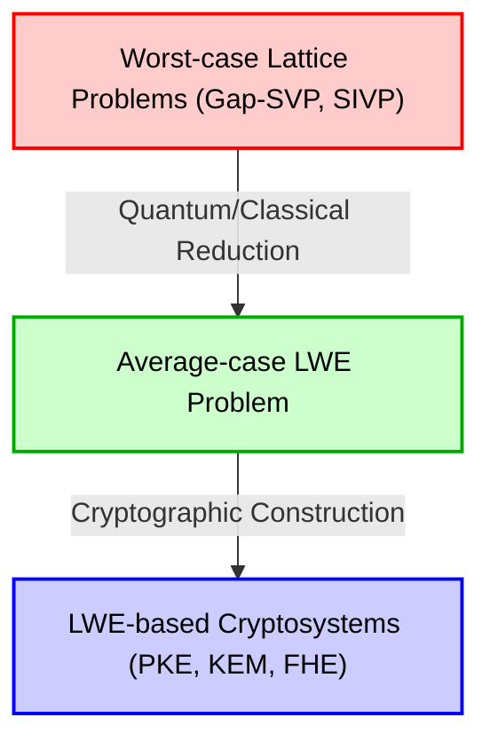
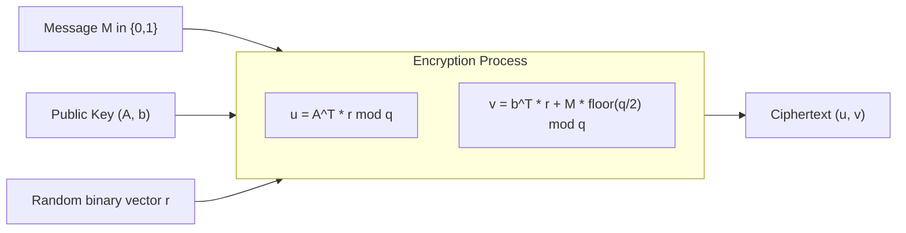
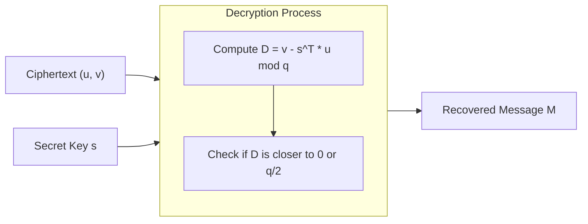

# 1. 導入：ポスト量子暗号（PQC）の夜明けと格子暗号の台頭

現代社会のデジタルインフラを支えているのは、RSA暗号や楕円曲線暗号（ECC）をはじめとする公開鍵暗号技術です。これらの暗号方式は、「素因数分解問題」や「離散対数問題」といった、従来の古典コンピュータでは効率的に解くことができない（指数関数的な時間を要する）と信じられている数学的な困難性に安全性の根拠を置いています。

しかし、1994年にピーター・ショア（Peter Shor）によって発表された「Shorのアルゴリズム」は、暗号界に激震を走らせました。このアルゴリズムは、大規模な量子コンピュータが実現した暁には、素因数分解問題や離散対数問題を多項式時間で解いてしまうことを数学的に証明したのです。これはつまり、現在広く利用されている公開鍵暗号が、将来的に完全に解読可能になってしまうということを意味しています。

このような「量子コンピュータの脅威（Quantum Threat）」に対抗するため、量子コンピュータを用いても解読が困難な新しい暗号方式の研究が急務となりました。これが「ポスト量子暗号（Post-Quantum Cryptography: PQC）」または「耐量子計算機暗号」と呼ばれる分野です。

PQCにはいくつかの有力な候補が存在します。ハッシュベース暗号、符号ベース暗号、多変数多項式暗号、同種写像暗号などが挙げられますが、その中でも現在最も注目を集め、NIST（米国国立標準技術研究所）によるPQC標準化プロセスの中心となっているのが「格子暗号（Lattice-based cryptography）」です。格子暗号は、他の方式と比較して、暗号化・復号の処理速度が非常に高速であり、また「最悪時計算量（Worst-case complexity）」から「平均時計算量（Average-case complexity）」への帰着という、暗号理論において極めて強力な安全性の証明を持つという際立った特徴を持っています。

本記事では、この格子暗号の基礎となる「格子（Lattice）」の数学的定義から出発し、格子上の困難な問題であるSVP（最短ベクトル問題）やCVP（最近接ベクトル問題）、そして現代の格子暗号の心臓部とも言える「LWE問題（Learning With Errors）」について、数式と幾何学的な直観、そして具体的な数値例を交えて、徹底的に深く解説していきます。

# 2. 格子（Lattice）の数学的定義と幾何学的直観

## 2.1 ベクトル空間と格子
数学において、「格子（Lattice）」とは、$n$次元実ベクトル空間 $\mathbb{R}^n$ 内に規則正しく並んだ離散的な点の集合のことです。線形代数学で学ぶベクトル空間（Vector Space）と似ていますが、決定的な違いがあります。ベクトル空間が基底ベクトルの「実数係数」での線形結合で表される連続的な空間であるのに対し、格子は基底ベクトルの「整数係数」での線形結合で表される離散的な空間です。

数学的な厳密な定義を与えましょう。$m$次元実ベクトル空間 $\mathbb{R}^m$ における $n$ 本（$n \le m$）の線形独立なベクトル $\mathbf{b}_1, \mathbf{b}_2, \dots, \mathbf{b}_n$ を考えます。これらのベクトルを列ベクトルとして持つ行列を $B = [\mathbf{b}_1, \mathbf{b}_2, \dots, \mathbf{b}_n] \in \mathbb{R}^{m \times n}$ とします。この $B$ を格子の「基底（Basis）」と呼びます。

この基底 $B$ によって生成される格子 $\mathcal{L}(B)$ は、次のように定義されます。

$$
\mathcal{L}(B) = \left\{ \sum_{i=1}^{n} x_i \mathbf{b}_i \mathrel{\bigg|} x_i \in \mathbb{Z} \right\} = \{ B \mathbf{x} \mid \mathbf{x} \in \mathbb{Z}^n \}
$$

ここで重要なのは、係数 $x_i$ が実数 $\mathbb{R}$ ではなく、整数 $\mathbb{Z}$ に限定されているという点です。これにより、空間内に無数に存在する連続的な点ではなく、等間隔に配置された交差点のような「離散的な点の集合」が形成されます。

## 2.2 幾何学的なイメージ
2次元平面 $\mathbb{R}^2$ の例で考えてみましょう。基底ベクトルとして $\mathbf{b}_1 = \begin{pmatrix} 1 \\ 0 \end{pmatrix}$ と $\mathbf{b}_2 = \begin{pmatrix} 0 \\ 1 \end{pmatrix}$ を選んだ場合、これらによって生成される格子は、座標平面上のすべての整数座標 $(x, y) \in \mathbb{Z}^2$ の集合となります。これは最も単純な「正方格子」です。

しかし、格子は常に直交しているわけではありません。例えば、$\mathbf{b}_1 = \begin{pmatrix} 2 \\ 1 \end{pmatrix}$ と $\mathbf{b}_2 = \begin{pmatrix} 1 \\ 3 \end{pmatrix}$ という基底を考えると、生成される点は斜めに歪んだ網目の交点のようになります。

## 2.3 基底の非一意性とユニモジュラ変換
格子暗号の安全性の根幹に関わる重要な性質があります。それは、「同一の格子を生成する基底は無数に存在する」ということです。

例えば、先ほどの $\mathbf{b}_1 = (1, 0)^T, \mathbf{b}_2 = (0, 1)^T$ という基底が生成する $\mathbb{Z}^2$ 格子は、$\mathbf{b}'_1 = (1, 1)^T, \mathbf{b}'_2 = (2, 3)^T$ という基底を使っても全く同じ格子 $\mathbb{Z}^2$ を生成します。

ある基底 $B$ と別の基底 $B'$ が同じ格子を生成するための必要十分条件は、ある整数成分の行列 $U \in \mathbb{Z}^{n \times n}$ であって、行列式が $\det(U) = \pm 1$ となるものが存在し、
$$ B' = B U $$
と表せることです。このような行列 $U$ を「ユニモジュラ行列（Unimodular matrix）」と呼びます。

暗号への応用における基本的なアイデアは、「良い基底（直交に近く、短いベクトルからなる基底）」を秘密鍵とし、「悪い基底（互いに極端に斜交し、非常に長いベクトルからなる基底）」を公開鍵として用いることです。悪い基底から良い基底を計算で求めることは、次元が高くなると非常に困難になります。これが格子暗号の基本的な直観です。

# 3. 格子における計算困難な問題

格子暗号の安全性は、格子上の特定の数学的問題を解くことの困難性に依存しています。ここでは、最も基本的かつ有名な2つの問題を紹介します。

## 3.1 最短ベクトル問題（Shortest Vector Problem: SVP）
SVPは、格子理論において最も古典的で有名な問題です。

**定義（SVP）:**
任意の格子基底 $B$ が与えられたとき、その格子 $\mathcal{L}(B)$ に属する非ゼロベクトルの中で、ユークリッドノルム（長さ）が最小となるベクトル $\mathbf{v}$ を見つけよ。

数式で表すと、$\min_{\mathbf{v} \in \mathcal{L}(B) \setminus \{\mathbf{0}\}} \| \mathbf{v} \|$ となる $\mathbf{v}$ を求める問題です。この最小の長さを $\lambda_1(\mathcal{L})$ と書き、「格子の第一連続最小値（First successive minimum）」と呼びます。

2次元や3次元の低い次元であれば、図を描けば目で見て一番短いベクトルを見つけることができます。あるいは、ガウスの格子簡約アルゴリズムなどを使って効率的に解くことができます。しかし、次元 $n$ が数百〜数千といった高次元になると、SVPを厳密に解くことはNP困難であることが知られています。

現実の暗号では、厳密な最短ベクトルではなく、「近似的に短いベクトル」を見つける近似SVP（$\gamma$-SVP）が用いられます。近似係数 $\gamma$ が多項式サイズの場合、この問題は依然として非常に難しいと考えられています。

## 3.2 最近接ベクトル問題（Closest Vector Problem: CVP）
CVPもまた、格子暗号において極めて重要な問題です。

**定義（CVP）:**
任意の格子基底 $B$ と、空間内の任意のターゲットベクトル $\mathbf{t} \in \mathbb{R}^m$ （必ずしも格子点ではない）が与えられたとき、格子点の中で $\mathbf{t}$ に最も近い格子点 $\mathbf{v} \in \mathcal{L}(B)$ を見つけよ。

数式で表すと、$\min_{\mathbf{v} \in \mathcal{L}(B)} \| \mathbf{v} - \mathbf{t} \|$ となる格子点 $\mathbf{v}$ を探す問題です。

CVPもSVPと同様に、高次元においてはNP困難です。暗号への応用という観点では、後述するLWE問題は、このCVPの特殊な変種（Bounded Distance Decoding: BDD）と密接な関係があります。

## 3.3 なぜ高次元になると解けないのか？（LLLとBKZの限界）
高次元の格子問題を解くための有名なアルゴリズムとして、LLLアルゴリズム（Lenstra-Lenstra-Lovász algorithm）があります。LLLアルゴリズムは多項式時間で動作し、格子基底をある程度「良い基底」に簡約（Reduction）することができます。しかし、LLLアルゴリズムが見つけることができる最短ベクトルは、真の最短ベクトルの長さに対して指数関数的（$2^{\mathcal{O}(n)}$）な近似係数を持つため、暗号の安全性を破るには至りません。

LLLを改良したBKZ（Block Korkine-Zolotarev）アルゴリズムなどのより強力な基底簡約アルゴリズムを用いれば、より短いベクトルを見つけることができますが、その計算量はブロックサイズに対して指数関数的に増大します。格子暗号では、このBKZアルゴリズムの実行時間を見積もることで、安全なパラメータ（次元 $n$ の大きさなど）を決定しています。現在のPQCの標準パラメータでは、次元 $n$ は500から1000以上の値が選ばれており、スーパーコンピュータや将来の量子コンピュータを用いても解読には宇宙の年齢以上の時間がかかるとされています。

# 4. LWE問題（Learning With Errors）の数学的定式化

現代の格子暗号の大部分は、2005年にOded Regevによって提唱された「LWE問題（Learning With Errors）」をベースにしています。LWE問題の美しさは、その定式化のシンプルさと、「最悪時計算量から平均時計算量への帰着」という強力な数学的証明を持っている点にあります。

## 4.1 ノイズなしの連立一次方程式
LWE問題を理解するために、まずはノイズのない単純な連立一次方程式を考えてみましょう。
未知の秘密ベクトル $\mathbf{s} \in \mathbb{Z}_q^n$ （各成分は $0$ から $q-1$ の整数）があるとします。ここで $q$ は素数とします。

ランダムな係数ベクトル $\mathbf{a}_1, \mathbf{a}_2, \dots \in \mathbb{Z}_q^n$ を選び、秘密ベクトル $\mathbf{s}$ との内積を法 $q$ で計算します。
$b_1 = \langle \mathbf{a}_1, \mathbf{s} \rangle \pmod q$
$b_2 = \langle \mathbf{a}_2, \mathbf{s} \rangle \pmod q$
$\vdots$

十分な数（$n$個以上）の $(\mathbf{a}_i, b_i)$ のペアを与えられた場合、私たちは線形代数における「ガウスの消去法（Gaussian elimination）」を用いることで、容易に秘密ベクトル $\mathbf{s}$ を復元することができます。これは多項式時間で簡単に解ける問題です。

## 4.2 LWE問題の定義：ノイズを加える
では、この問題にわずかな「ノイズ（誤差）」を加えたらどうなるでしょうか？
これがLWE問題の本質です。

未知の秘密ベクトル $\mathbf{s} \in \mathbb{Z}_q^n$ に対して、各方程式の結果に小さな誤差 $e_i \in \mathbb{Z}_q$ を加えます。
$b_i = \langle \mathbf{a}_i, \mathbf{s} \rangle + e_i \pmod q$

ここで、$e_i$ は平均0、標準偏差が比較的小さい（例えば正規分布のような、離散ガウス分布から選ばれた）小さな整数値です。
与えられる情報は、ランダムなベクトル $\mathbf{a}_i$ と、それに誤差を加えて計算された $b_i$ のペアのリストです。
$( \mathbf{a}_1, b_1 ), ( \mathbf{a}_2, b_2 ), \dots, ( \mathbf{a}_m, b_m )$

これを行列で表現すると非常にスッキリします。
ランダムな行列 $A \in \mathbb{Z}_q^{m \times n}$、秘密ベクトル $\mathbf{s} \in \mathbb{Z}_q^n$、誤差ベクトル $\mathbf{e} \in \mathbb{Z}_q^m$ を用いて、
$$ \mathbf{b} = A \mathbf{s} + \mathbf{e} \pmod q $$
と書けます。与えられるのは $A$ と $\mathbf{b}$ のみです。ここから $\mathbf{s}$ を求めるのが「探索LWE問題（Search LWE problem）」です。

誤差 $e_i$ が入っているため、ガウスの消去法を使おうとすると、方程式を足し引きする過程で誤差が指数関数的に増幅してしまい、正しい答えに辿り着くことができなくなります。一見すると単純な連立一次方程式に見えますが、この小さなノイズが加わるだけで、問題の難易度がNP困難なレベルへと跳ね上がるのです。

## 4.3 決定LWE問題（Decision LWE）
暗号理論の証明において頻繁に用いられるのは、探索LWE問題のバリエーションである「決定LWE問題（Decision LWE problem）」です。

決定LWE問題とは、以下の2つの分布から得られたサンプルのリストを与えられたとき、それがどちらの分布から来たものかを判定する問題です。
1. **LWE分布**: 意図的に計算された $(A, \mathbf{b} = A\mathbf{s} + \mathbf{e} \pmod q)$
2. **一様ランダム分布**: 完全にランダムに選ばれた行列 $A$ とベクトル $\mathbf{u}$ からなる $(A, \mathbf{u})$

驚くべきことに、LWE問題のパラメータを適切に選べば、LWE分布から得られたペアは、完全にランダムなデータのペアと「計算量的に識別不可能（Computationally Indistinguishable）」になります。この性質が、LWEベースの暗号が「乱数と区別がつかない暗号文」を生成できる根拠となっています。

## 4.4 最悪時計算量から平均時計算量への帰着（Regevの定理）
Oded Regevの最大の功績は、このLWE問題の難しさを、前述の格子問題（SVPやCVP）の難しさに数学的に結びつけたことです。

彼は量子還元（Quantum reduction）を用いて、「もしLWE問題を平均的に（ランダムに選ばれた $A$ と $\mathbf{e}$ に対して）解くことができる多項式時間のアルゴリズムが存在するならば、任意の格子の最悪ケース（最も難しいケース）のGap-SVPを解くことができる多項式時間の量子アルゴリズムが存在する」ということを証明しました。（後に、Peikertらによって古典的な還元も示されています）。

これは暗号理論において夢のような性質です。なぜなら、「暗号が破られるのは、我々がたまたま弱い鍵（平均的なケースの一部）を選んでしまったからかもしれない」という懸念を払拭し、「平均的なLWEが解けるなら、格子の全ての難しい問題が解けてしまう（だからLWEは絶対に難しい）」という強力な保証を与えてくれるからです。

# 5. LWEを用いた公開鍵暗号方式（Regev暗号）の構築

LWE問題の困難性を理解したところで、それを使ってどのように暗号化と復号を行うのか、Oded Regevが提案した基本的な公開鍵暗号方式を見ていきましょう。ここでは、1ビットのメッセージ $M \in \{0, 1\}$ を暗号化する最も基本的な仕組みを解説します。

## 5.1 鍵生成（Key Generation）
1. システムパラメータとして、法となる素数 $q$、次元 $n$、方程式の数 $m$（$m > n \log q$）を決定します。
2. 秘密鍵として、ベクトル $\mathbf{s} \in \mathbb{Z}_q^n$ をランダムに選びます。
3. ランダムな行列 $A \in \mathbb{Z}_q^{m \times n}$ を生成します。
4. 小さな誤差ベクトル $\mathbf{e} \in \mathbb{Z}_q^m$ を離散ガウス分布などの誤差分布から選びます。
5. ベクトル $\mathbf{b} = A \mathbf{s} + \mathbf{e} \pmod q$ を計算します。
6. 公開鍵（Public Key）は $(A, \mathbf{b})$ となります。
7. 秘密鍵（Secret Key）は $\mathbf{s}$ となります。

公開鍵はまさに「LWE問題のインスタンス」そのものです。公開鍵 $(A, \mathbf{b})$ から秘密鍵 $\mathbf{s}$ を求めることは、探索LWE問題を解くことに等しいため、安全性が保証されます。

## 5.2 暗号化（Encryption）
アリスはボブの公開鍵 $(A, \mathbf{b})$ を用いて、1ビットのメッセージ $M \in \{0, 1\}$ を暗号化します。

1. ランダムなバイナリベクトル（成分が0か1）$\mathbf{r} \in \{0, 1\}^m$ を選びます。
2. 暗号文の前半部分として、ベクトル $\mathbf{u} = A^T \mathbf{r} \pmod q$ を計算します。（$A^T$ は $A$ の転置行列です。つまり、$A$ の行のうち、$\mathbf{r}$ の成分が1である行を足し合わせています）。
3. 暗号文の後半部分として、スカラー $v = \mathbf{b}^T \mathbf{r} + M \cdot \lfloor \frac{q}{2} \rfloor \pmod q$ を計算します。
   （メッセージ $M$ が0なら何も足さず、$1$ なら $q$ のちょうど半分の値 $\lfloor \frac{q}{2} \rfloor$ を足します）。
4. 暗号文（Ciphertext）は $(\mathbf{u}, v)$ となります。

暗号化の直観的な意味合いは、公開鍵の行列 $A$ とベクトル $\mathbf{b}$ に対して、「ランダムな部分集合の和」をとることです。決定LWE問題の困難性により、この暗号文 $(\mathbf{u}, v)$ は、完全にランダムなベクトルと一様乱数と区別がつかないように見えます（意味的安全性：Semantic Security）。

## 5.3 復号（Decryption）
ボブは秘密鍵 $\mathbf{s}$ を用いて暗号文 $(\mathbf{u}, v)$ を復号します。

1. 次の値を計算します： $D = v - \mathbf{s}^T \mathbf{u} \pmod q$
2. 計算した結果が、$0$ に近ければ $M=0$、$\lfloor \frac{q}{2} \rfloor$ に近ければ $M=1$ として出力します。

なぜこれで復号できるのか、数学的に展開してみましょう。
$\mathbf{b} = A \mathbf{s} + \mathbf{e}$ であったことを思い出してください。

$$
\begin{aligned}
v - \mathbf{s}^T \mathbf{u} &= (\mathbf{b}^T \mathbf{r} + M \cdot \lfloor \frac{q}{2} \rfloor) - \mathbf{s}^T (A^T \mathbf{r}) \\
&= ((A \mathbf{s} + \mathbf{e})^T \mathbf{r} + M \cdot \lfloor \frac{q}{2} \rfloor) - \mathbf{s}^T A^T \mathbf{r} \\
&= (\mathbf{s}^T A^T \mathbf{r} + \mathbf{e}^T \mathbf{r} + M \cdot \lfloor \frac{q}{2} \rfloor) - \mathbf{s}^T A^T \mathbf{r} \\
&= \mathbf{e}^T \mathbf{r} + M \cdot \lfloor \frac{q}{2} \rfloor \pmod q
\end{aligned}
$$

ここで、式の中から $\mathbf{s}^T A^T \mathbf{r}$ が綺麗に相殺されて消えました！
残ったのは $\mathbf{e}^T \mathbf{r} + M \cdot \lfloor \frac{q}{2} \rfloor$ です。

$\mathbf{e}$ は成分が非常に小さなノイズベクトルであり、$\mathbf{r}$ は成分が0か1のバイナリベクトルです。したがって、それらの内積である $\mathbf{e}^T \mathbf{r}$ も、（パラメータを適切に選べば）比較的小さな値に留まります。

- もし $M=0$ ならば、結果は $\mathbf{e}^T \mathbf{r}$ となり、$0$ に近い小さな値になります。
- もし $M=1$ ならば、結果は $\mathbf{e}^T \mathbf{r} + \lfloor \frac{q}{2} \rfloor$ となり、$q$ の半分の値 $\lfloor \frac{q}{2} \rfloor$ の周辺に位置することになります。

誤差 $\mathbf{e}^T \mathbf{r}$ の絶対値が $\frac{q}{4}$ 未満に収まるようにパラメータが設計されていれば、ボブは計算結果が $0$ と $\lfloor \frac{q}{2} \rfloor$ のどちらに近いかを見るだけで、メッセージ $M$ を正確に判定（復号）することができます。これがLWEベースの暗号が機能する美しいメカニズムです。

# 6. 具体的な数値を用いたLWE暗号のトイ・エグザンプル

数式の羅列だけでは実感が湧きにくいと思いますので、実際に非常に小さな数値パラメータを設定して、暗号化から復号までの計算を追ってみましょう。
（※現実の暗号システムでは、安全性確保のため $n$ は500以上、$q$ は数千以上の値が使われます）

**【パラメータ設定】**
- 法 $q = 17$ （素数。したがって値は $0$ から $16$ の範囲をとります）
- 次元 $n = 2$
- 方程式の数 $m = 4$
- メッセージ $M = 1$ を暗号化するとします。
- メッセージのシフト量：$\lfloor \frac{q}{2} \rfloor = \lfloor \frac{17}{2} \rfloor = 8$

**【1. 鍵生成フェーズ】**
ボブは秘密鍵 $\mathbf{s}$ と行列 $A$、誤差ベクトル $\mathbf{e}$ をランダムに選びます。
$$ \mathbf{s} = \begin{pmatrix} 3 \\ 4 \end{pmatrix} \in \mathbb{Z}_{17}^2 $$
$$ A = \begin{pmatrix} 2 & 15 \\ 1 & 8 \\ 14 & 5 \\ 9 & 10 \end{pmatrix} \in \mathbb{Z}_{17}^{4 \times 2} $$
$$ \mathbf{e} = \begin{pmatrix} 1 \\ -1 \\ 0 \\ 2 \end{pmatrix} \equiv \begin{pmatrix} 1 \\ 16 \\ 0 \\ 2 \end{pmatrix} \pmod{17} $$

次に公開鍵 $\mathbf{b}$ を計算します。
$$ A \mathbf{s} = \begin{pmatrix} 2 & 15 \\ 1 & 8 \\ 14 & 5 \\ 9 & 10 \end{pmatrix} \begin{pmatrix} 3 \\ 4 \end{pmatrix} = \begin{pmatrix} 2\times 3 + 15\times 4 \\ 1\times 3 + 8\times 4 \\ 14\times 3 + 5\times 4 \\ 9\times 3 + 10\times 4 \end{pmatrix} = \begin{pmatrix} 6 + 60 \\ 3 + 32 \\ 42 + 20 \\ 27 + 40 \end{pmatrix} = \begin{pmatrix} 66 \\ 35 \\ 62 \\ 67 \end{pmatrix} $$
これを法 17 で計算します。($66 = 17 \times 3 + 15$ など)
$$ A \mathbf{s} \pmod{17} = \begin{pmatrix} 15 \\ 1 \\ 11 \\ 16 \end{pmatrix} $$
誤差ベクトル $\mathbf{e}$ を足します。
$$ \mathbf{b} = A \mathbf{s} + \mathbf{e} = \begin{pmatrix} 15 \\ 1 \\ 11 \\ 16 \end{pmatrix} + \begin{pmatrix} 1 \\ 16 \\ 0 \\ 2 \end{pmatrix} = \begin{pmatrix} 16 \\ 17 \\ 11 \\ 18 \end{pmatrix} \equiv \begin{pmatrix} 16 \\ 0 \\ 11 \\ 1 \end{pmatrix} \pmod{17} $$

公開鍵は $A$ と $\mathbf{b} = (16, 0, 11, 1)^T$ となります。

**【2. 暗号化フェーズ】**
アリスはメッセージ $M = 1$ を暗号化します。
ランダムなベクトル $\mathbf{r}$ を選びます。ここでは $\mathbf{r} = (1, 0, 1, 0)^T$ とします。

$\mathbf{u}$ を計算します。
$$ \mathbf{u} = A^T \mathbf{r} = \begin{pmatrix} 2 & 1 & 14 & 9 \\ 15 & 8 & 5 & 10 \end{pmatrix} \begin{pmatrix} 1 \\ 0 \\ 1 \\ 0 \end{pmatrix} = \begin{pmatrix} 2 \times 1 + 14 \times 1 \\ 15 \times 1 + 5 \times 1 \end{pmatrix} = \begin{pmatrix} 16 \\ 20 \end{pmatrix} \equiv \begin{pmatrix} 16 \\ 3 \end{pmatrix} \pmod{17} $$

$v$ を計算します。
$$ \mathbf{b}^T \mathbf{r} = (16, 0, 11, 1) \begin{pmatrix} 1 \\ 0 \\ 1 \\ 0 \end{pmatrix} = 16 \times 1 + 11 \times 1 = 27 \equiv 10 \pmod{17} $$
メッセージ $M=1$ に対応する値 $\lfloor 17/2 \rfloor = 8$ を足します。
$$ v = \mathbf{b}^T \mathbf{r} + M \cdot 8 = 10 + 1 \times 8 = 18 \equiv 1 \pmod{17} $$

アリスは暗号文として $(\mathbf{u}, v) = \left( \begin{pmatrix} 16 \\ 3 \end{pmatrix}, 1 \right)$ をボブに送信します。

**【3. 復号フェーズ】**
暗号文を受け取ったボブは、秘密鍵 $\mathbf{s} = (3, 4)^T$ を用いて復号します。
復号処理式： $D = v - \mathbf{s}^T \mathbf{u} \pmod{17}$ を計算します。

$$ \mathbf{s}^T \mathbf{u} = (3, 4) \begin{pmatrix} 16 \\ 3 \end{pmatrix} = 3 \times 16 + 4 \times 3 = 48 + 12 = 60 \equiv 9 \pmod{17} $$
$$ D = v - \mathbf{s}^T \mathbf{u} = 1 - 9 = -8 \pmod{17} $$

ここで、法17の世界では $-8$ は $9$ に等しくなります（$-8 + 17 = 9$）。
得られた値 $D = 9$ を、$0$ と $8$（$\lfloor 17/2 \rfloor$）のどちらに近いか判定します。
$9$ は $0$ よりも $8$ に明らかに近いため、ボブは正しく $M = 1$ を復元することができました！

なぜ $9$ になったのでしょうか？ 先ほどの証明を思い出しましょう。
誤差部分は $\mathbf{e}^T \mathbf{r} = (1, -1, 0, 2) (1, 0, 1, 0)^T = 1 \times 1 + 0 \times 1 = 1$ となっています。
したがって、計算結果は $\mathbf{e}^T \mathbf{r} + M \cdot 8 = 1 + 8 = 9$ となり、理論通りの値が計算されていることが確認できました。

# 7. 実用化に向けた進化：Ring-LWE と Module-LWE

これまで説明してきた標準的なLWE問題（Standard LWE）は、非常に強力な安全性証明を持っていますが、実用上において致命的な弱点があります。それは「鍵のサイズが巨大になること」と「計算コストが高いこと」です。

Standard LWEでは、公開鍵に巨大な行列 $A \in \mathbb{Z}_q^{m \times n}$ が含まれます。パラメータ $n$ が数百〜数千になると、この行列のサイズは数メガバイトに達してしまい、インターネット上の通信プロトコル（TLSなど）で毎回送受信するには重すぎます。また、行列とベクトルの乗算には $\mathcal{O}(n^2)$ の計算量がかかります。

この問題を解決するために導入されたのが、多項式環（Polynomial rings）という代数的な構造を格子に組み込んだ「Ring-LWE（RLWE）」や「Module-LWE（MLWE）」です。

## 7.1 Ring-LWEの直観
Ring-LWEでは、ベクトルや行列を、多項式環 $\mathcal{R}_q = \mathbb{Z}_q[X]/(X^n + 1)$ 上の要素（多項式）に置き換えます。（ここで $n$ は2の冪乗が選ばれます）。

Standard LWEの公開鍵が行列 $A$ であったのに対し、Ring-LWEでは単一の多項式 $a(x)$ を用います。秘密鍵 $s(x)$ や誤差 $e(x)$ も多項式になります。
方程式は以下のようになります。
$$ b(x) = a(x) \cdot s(x) + e(x) \pmod q $$

これは多項式の掛け算なので、高速フーリエ変換（FFT）に類似した「数論変換（Number Theoretic Transform: NTT）」を用いることで、計算量を $\mathcal{O}(n \log n)$ にまで劇的に削減できます。さらに、公開鍵のサイズも行列から単一の多項式へと小さくなるため、データサイズが $\mathcal{O}(n)$ に削減されます。これは通信帯域において圧倒的な優位性をもたらします。

数学的に見ると、Ring-LWEは一般的な格子ではなく、「イデアル格子（Ideal Lattice）」と呼ばれる特殊な対称性を持った格子上の問題に帰着します。

## 7.2 Module-LWEとNISTの標準化（Kyber / ML-KEM）
Ring-LWEは効率的ですが、イデアル格子の特殊な代数的構造が将来的な攻撃の糸口になるのではないかという一抹の懸念がありました。そこで、Standard LWEの保守的な安全性とRing-LWEの効率性の「いいとこ取り」をしたのが「Module-LWE（MLWE）」です。

Module-LWEでは、多項式を要素とする小さな行列とベクトルを考えます。つまり、環上のモジュール（加群）を扱います。
現在、NISTがPQCの鍵共有アルゴリズム（KEM）の標準として選定した「CRYSTALS-Kyber」（標準化名称：ML-KEM）は、まさにこのModule-LWE問題の困難性に基づいて構築されています。

# 8. なぜ量子コンピュータに対して安全なのか？

最後に、「なぜ格子暗号は量子コンピュータを用いても解読されないと考えられているのか？」という核心部分に触れておきます。

量子コンピュータがRSA暗号や楕円曲線暗号を破るShorのアルゴリズムは、本質的には「隠れ部分群問題（Hidden Subgroup Problem: HSP）」を解くアルゴリズムです。RSAやECCの背景にある数学的構造（有限アーベル群）は周期性を持っており、量子フーリエ変換（QFT）という量子アルゴリズム特Actions:特有の操作を用いることで、この周期（隠れた部分群）を一気に抽出することができます。

しかし、格子問題は根本的に異なります。格子にも周期性はありますが、SVPやCVPで求められているのは「最短の距離」や「ノイズの除去」という幾何学的な非線形な性質です。Shorのアルゴリズムのような「アーベル群上の量子フーリエ変換」をそのまま適用しても、格子問題の解答となる有用な情報を効率的に抽出することができません。現在までに、SVPやLWEに対して多項式時間で解くことができる量子アルゴリズムは発見されておらず、量子コンピュータの並列計算能力をもってしても総当たりに近い探索（グローバーのアルゴリズムによる平方根の高速化程度）しか有効な手段がないと広く信じられています。

# 9. まとめ

本記事では、格子暗号の数学的直観について、格子の幾何学的定義から始まり、LWE問題の定式化、そして公開鍵暗号の構築に至るまで詳細に解説しました。

1. **格子（Lattice）** は、基底ベクトルの整数係数線形結合で表される離散的な空間であり、高次元においては直交に近い「良い基底」を見つけること（SVP）が困難になります。
2. **LWE問題（Learning With Errors）** は、ノイズ付きの連立一次方程式を解く問題であり、これが格子の最悪ケース問題の困難性に結びついているため、強力な安全性の根拠を提供します。
3. LWE問題を利用することで、ノイズを意図的に加えたり消去したりする巧妙な仕組みにより、暗号化と復号（**Regev暗号**）が実現されます。
4. 現実のプロトコルでは、通信効率と計算速度を高めるために多項式環を用いた **Ring-LWE** や **Module-LWE** が採用されており、NIST標準の **ML-KEM** の基盤となっています。

量子コンピュータという未曾有の計算パラダイムシフトが迫る中、古典的な線形代数と整数論の深淵から生まれた「格子暗号」が、未来のインターネットセキュリティの基盤を担うというのは非常にロマンのある話です。格子暗号の基礎となる数学は決して難解すぎるものではなく、線形代数と確率の基礎知識があれば十分にその美しい構造を理解することができます。本記事が、PQCの核となる格子暗号の理解への一助となれば幸いです。
