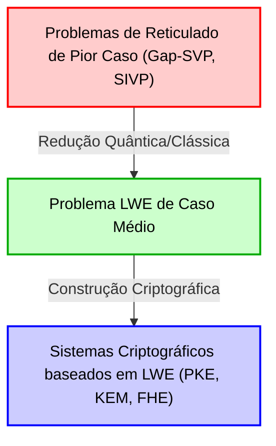
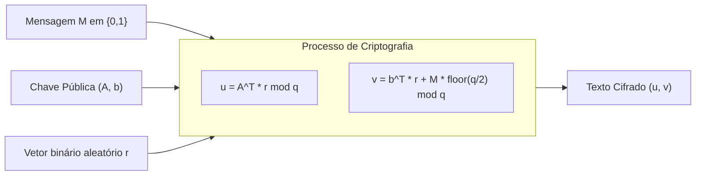
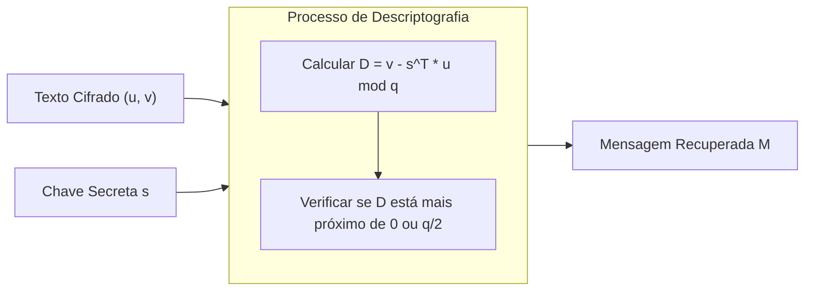

# 1. Introdução: O alvorecer da Criptografia Pós-Quântica (PQC) e a ascensão da criptografia baseada em reticulados

A infraestrutura digital da sociedade moderna é sustentada por tecnologias de criptografia de chave pública, como a criptografia RSA e a Criptografia de Curva Elíptica (ECC). Esses métodos criptográficos baseiam sua segurança na dificuldade matemática de problemas como o "Problema de Fatoração de Inteiros" e o "Problema do Logaritmo Discreto", que se acredita não poderem ser resolvidos eficientemente (exigindo tempo exponencial) pelos computadores clássicos convencionais.

No entanto, o "Algoritmo de Shor", publicado por Peter Shor em 1994, enviou ondas de choque através do mundo da criptografia. Este algoritmo provou matematicamente que, uma vez realizados computadores quânticos de grande escala, problemas de fatoração de inteiros e logaritmos discretos serão resolvidos em tempo polinomial. Isso significa que a criptografia de chave pública amplamente utilizada hoje se tornará completamente decifrável no futuro.

Para combater essa "Ameaça Quântica (Quantum Threat)", a pesquisa em novos métodos criptográficos que sejam difíceis de quebrar, mesmo usando computadores quânticos, tornou-se uma questão urgente. Este é o campo conhecido como "Criptografia Pós-Quântica (Post-Quantum Cryptography: PQC)" ou "Criptografia resistente a quantum".

Existem vários candidatos fortes para PQC. Estes incluem criptografia baseada em hash, criptografia baseada em código, criptografia polinomial multivariada e criptografia baseada em isogenia. Entre eles, o que atualmente atrai mais atenção e é fundamental para o processo de padronização PQC do NIST (Instituto Nacional de Padrões e Tecnologia dos EUA) é a "Criptografia baseada em reticulados (Lattice-based cryptography)". Em comparação com outros métodos, a criptografia baseada em reticulados possui velocidades de criptografia e descriptografia extremamente rápidas e exibe uma característica notável em sua prova de segurança: uma redução da "complexidade do pior caso (Worst-case complexity)" para a "complexidade do caso médio (Average-case complexity)", que é extremamente poderosa na teoria criptográfica.

Neste artigo, começaremos pela definição matemática fundamental de um "Reticulado (Lattice)", que é a base da criptografia baseada em reticulados, e explicaremos profundamente problemas difíceis em reticulados como SVP (Problema do Vetor Mais Curto) e CVP (Problema do Vetor Mais Próximo), e o núcleo da criptografia de reticulados moderna, o "Problema LWE (Learning With Errors)", usando fórmulas, intuição geométrica e exemplos numéricos concretos.

# 2. Definição Matemática e Intuição Geométrica do Reticulado (Lattice)

## 2.1 Espaço Vetorial e Reticulados
Em matemática, um "Reticulado (Lattice)" é um conjunto de pontos discretos dispostos regularmente em um espaço vetorial real de dimensão $n$, $\mathbb{R}^n$. É semelhante a um espaço vetorial (Vector Space) aprendido em álgebra linear, mas há uma diferença crucial. Enquanto um espaço vetorial é um espaço contínuo representado por combinações lineares com "coeficientes reais" dos vetores de base, um reticulado é um espaço discreto representado por combinações lineares com "coeficientes inteiros" dos vetores de base.

Vamos dar uma definição matemática rigorosa. Considere $n$ vetores linearmente independentes ($n \le m$) $\mathbf{b}_1, \mathbf{b}_2, \dots, \mathbf{b}_n$ em um espaço vetorial real de dimensão $m$, $\mathbb{R}^m$. Considere uma matriz cujos vetores coluna são esses vetores: $B = [\mathbf{b}_1, \mathbf{b}_2, \dots, \mathbf{b}_n] \in \mathbb{R}^{m \times n}$. Esta $B$ é chamada de "Base (Basis)" do reticulado.

O reticulado $\mathcal{L}(B)$ gerado por esta base $B$ é definido da seguinte forma:

$$
\mathcal{L}(B) = \left\{ \sum_{i=1}^{n} x_i \mathbf{b}_i \mathrel{\bigg|} x_i \in \mathbb{Z} \right\} = \{ B \mathbf{x} \mid \mathbf{x} \in \mathbb{Z}^n \}
$$

O ponto importante aqui é que os coeficientes $x_i$ são restritos a inteiros $\mathbb{Z}$, e não a números reais $\mathbb{R}$. Isso forma um "conjunto de pontos discretos" semelhante a cruzamentos espaçados uniformemente, em vez dos infinitos pontos contínuos no espaço.

## 2.2 Imagem Geométrica
Vamos considerar um exemplo em um plano bidimensional $\mathbb{R}^2$. Se escolhermos $\mathbf{b}_1 = \begin{pmatrix} 1 \\ 0 \end{pmatrix}$ e $\mathbf{b}_2 = \begin{pmatrix} 0 \\ 1 \end{pmatrix}$ como vetores de base, o reticulado gerado por eles será o conjunto de todas as coordenadas inteiras $(x, y) \in \mathbb{Z}^2$ no plano cartesiano. Este é o "reticulado quadrado" mais simples.

No entanto, reticulados nem sempre são ortogonais. Por exemplo, considerando a base $\mathbf{b}_1 = \begin{pmatrix} 2 \\ 1 \end{pmatrix}$ e $\mathbf{b}_2 = \begin{pmatrix} 1 \\ 3 \end{pmatrix}$, os pontos gerados serão como as interseções de uma malha distorcida diagonalmente.

## 2.3 Não Unicidade da Base e Transformação Unimodular
Há uma propriedade importante relacionada ao núcleo da segurança da criptografia baseada em reticulados. É que "existem infinitas bases que geram o mesmo reticulado".

Por exemplo, a base anterior $\mathbf{b}_1 = (1, 0)^T, \mathbf{b}_2 = (0, 1)^T$ que gera o reticulado $\mathbb{Z}^2$ também gerará exatamente o mesmo reticulado $\mathbb{Z}^2$ se usarmos a base $\mathbf{b}'_1 = (1, 1)^T, \mathbf{b}'_2 = (2, 3)^T$.

A condição necessária e suficiente para uma certa base $B$ e outra base $B'$ gerarem o mesmo reticulado é que exista uma matriz com componentes inteiros $U \in \mathbb{Z}^{n \times n}$ tal que seu determinante seja $\det(U) = \pm 1$, e possa ser expressa como:
$$ B' = B U $$
Tal matriz $U$ é chamada de "matriz unimodular (Unimodular matrix)".

A ideia básica em aplicações criptográficas é usar uma "boa base (uma base próxima de ser ortogonal, consistindo de vetores curtos)" como chave privada, e uma "base ruim (uma base consistindo de vetores extremamente oblíquos entre si e muito longos)" como chave pública. Calcular uma boa base a partir de uma base ruim torna-se extremamente difícil à medida que a dimensão aumenta. Esta é a intuição básica da criptografia baseada em reticulados.

# 3. Problemas Computacionalmente Difíceis em Reticulados

A segurança da criptografia baseada em reticulados depende da dificuldade de resolver certos problemas matemáticos sobre reticulados. Aqui, introduziremos os dois problemas mais fundamentais e famosos.

## 3.1 Problema do Vetor Mais Curto (Shortest Vector Problem: SVP)
SVP é o problema mais clássico e famoso na teoria dos reticulados.

**Definição (SVP):**
Dada qualquer base de reticulado $B$, encontre o vetor não nulo $\mathbf{v}$ pertencente ao reticulado $\mathcal{L}(B)$ cuja norma euclidiana (comprimento) seja mínima.

Expressando em fórmula, é o problema de encontrar $\mathbf{v}$ tal que $\min_{\mathbf{v} \in \mathcal{L}(B) \setminus \{\mathbf{0}\}} \| \mathbf{v} \|$. Este comprimento mínimo é denotado como $\lambda_1(\mathcal{L})$ e é chamado de "Primeiro mínimo sucessivo (First successive minimum)" do reticulado.

Em dimensões baixas, como 2D ou 3D, você pode desenhar uma figura e encontrar visualmente o vetor mais curto. Alternativamente, algoritmos de redução de base de Gauss podem resolvê-lo eficientemente. No entanto, sabe-se que em altas dimensões (por exemplo, dimensão $n$ na casa das centenas a milhares), resolver o SVP de forma exata é NP-difícil.

Em criptografia do mundo real, em vez do vetor mais curto exato, é usado o SVP aproximado ($\gamma$-SVP) para encontrar um "vetor aproximadamente curto". Se o fator de aproximação $\gamma$ for de tamanho polinomial, este problema ainda é considerado extremamente difícil.

## 3.2 Problema do Vetor Mais Próximo (Closest Vector Problem: CVP)
CVP também é um problema extremamente importante na criptografia baseada em reticulados.

**Definição (CVP):**
Dada qualquer base de reticulado $B$ e qualquer vetor alvo no espaço $\mathbf{t} \in \mathbb{R}^m$ (não necessariamente um ponto do reticulado), encontre o ponto do reticulado $\mathbf{v} \in \mathcal{L}(B)$ que seja o mais próximo de $\mathbf{t}$.

Expressando em fórmula, é o problema de procurar o ponto do reticulado $\mathbf{v}$ que resulta em $\min_{\mathbf{v} \in \mathcal{L}(B)} \| \mathbf{v} - \mathbf{t} \|$.

O CVP também é NP-difícil em altas dimensões, semelhante ao SVP. Do ponto de vista das aplicações criptográficas, o problema LWE, descrito posteriormente, está intimamente relacionado a uma variante especial do CVP (Bounded Distance Decoding: BDD).

## 3.3 Por que não pode ser resolvido em altas dimensões? (Os Limites do LLL e BKZ)
Um algoritmo famoso para resolver problemas de reticulados em altas dimensões é o algoritmo LLL (algoritmo de Lenstra-Lenstra-Lovász). O algoritmo LLL opera em tempo polinomial e pode reduzir a base do reticulado a uma "boa base" em certa medida. No entanto, o vetor mais curto encontrado pelo algoritmo LLL tem um fator de aproximação exponencial ($2^{\mathcal{O}(n)}$) em relação ao comprimento do vetor mais curto verdadeiro, portanto, não chega ao ponto de quebrar a segurança criptográfica.

Usar algoritmos de redução de base mais poderosos como o algoritmo BKZ (Block Korkine-Zolotarev), que é uma melhoria do LLL, permite encontrar vetores mais curtos, mas seu tempo de computação aumenta exponencialmente em relação ao tamanho do bloco. Na criptografia baseada em reticulados, parâmetros seguros (como o tamanho da dimensão $n$) são determinados estimando o tempo de execução deste algoritmo BKZ. Nos parâmetros padrão atuais da PQC, são escolhidos valores entre 500 e 1000 ou mais para a dimensão $n$, e estima-se que levaria mais tempo do que a idade do universo para decifrá-los, mesmo com supercomputadores ou computadores quânticos futuros.

# 4. Formulação Matemática do Problema LWE (Learning With Errors)

A maior parte da criptografia moderna baseada em reticulados é baseada no "Problema LWE (Learning With Errors)", proposto por Oded Regev em 2005. A beleza do problema LWE reside na simplicidade de sua formulação e em ter uma prova matemática poderosa: a "redução da complexidade do pior caso para a complexidade do caso médio".

## 4.1 Equações lineares simultâneas sem ruído
Para entender o problema LWE, vamos primeiro considerar equações lineares simultâneas simples sem ruído.
Suponha que haja um vetor secreto desconhecido $\mathbf{s} \in \mathbb{Z}_q^n$ (cada componente é um número inteiro de $0$ a $q-1$). Aqui, $q$ é considerado um número primo.

Escolhemos vetores de coeficientes aleatórios $\mathbf{a}_1, \mathbf{a}_2, \dots \in \mathbb{Z}_q^n$, e calculamos seu produto escalar com o vetor secreto $\mathbf{s}$ módulo $q$.
$b_1 = \langle \mathbf{a}_1, \mathbf{s} \rangle \pmod q$
$b_2 = \langle \mathbf{a}_2, \mathbf{s} \rangle \pmod q$
$\vdots$

Se nos derem um número suficiente (pelo menos $n$) de pares $(\mathbf{a}_i, b_i)$, podemos restaurar facilmente o vetor secreto $\mathbf{s}$ usando a "Eliminação Gaussiana (Gaussian elimination)" em álgebra linear. Este é um problema que pode ser resolvido facilmente em tempo polinomial.

## 4.2 Definição do problema LWE: Adicionando Ruído
Então, o que acontece se adicionarmos um pouco de "ruído (erro)" a este problema?
Esta é a essência do problema LWE.

Para o vetor secreto desconhecido $\mathbf{s} \in \mathbb{Z}_q^n$, adicionamos um pequeno erro $e_i \in \mathbb{Z}_q$ ao resultado de cada equação.
$b_i = \langle \mathbf{a}_i, \mathbf{s} \rangle + e_i \pmod q$

Aqui, $e_i$ é um número inteiro pequeno com média 0 e desvio padrão relativamente pequeno (por exemplo, retirado de uma distribuição Gaussiana discreta, como uma distribuição normal).
A informação fornecida é uma lista de pares do vetor aleatório $\mathbf{a}_i$ e $b_i$ calculado adicionando o erro.
$( \mathbf{a}_1, b_1 ), ( \mathbf{a}_2, b_2 ), \dots, ( \mathbf{a}_m, b_m )$

Expressar isso em forma de matriz o torna muito claro.
Usando uma matriz aleatória $A \in \mathbb{Z}_q^{m \times n}$, um vetor secreto $\mathbf{s} \in \mathbb{Z}_q^n$, e um vetor de erro $\mathbf{e} \in \mathbb{Z}_q^m$,
$$ \mathbf{b} = A \mathbf{s} + \mathbf{e} \pmod q $$
pode ser escrito. Apenas $A$ e $\mathbf{b}$ são fornecidos. Encontrar $\mathbf{s}$ a partir disso é o "Problema de busca LWE (Search LWE problem)".

Como o erro $e_i$ está incluído, ao tentar usar a eliminação gaussiana, o erro será amplificado exponencialmente durante o processo de adição e subtração de equações, tornando impossível chegar à resposta correta. À primeira vista, parecem equações lineares simultâneas simples, mas apenas adicionando esse pequeno ruído, o nível de dificuldade do problema salta para um nível NP-difícil.

## 4.3 Problema LWE de decisão (Decision LWE)
O que é frequentemente usado em provas na teoria criptográfica é uma variação do problema de busca LWE chamado de "Problema LWE de decisão (Decision LWE problem)".

O problema de decisão LWE é o problema de determinar de qual de duas distribuições uma lista de amostras fornecida se origina.
1. **Distribuição LWE**: Intencionalmente calculada $(A, \mathbf{b} = A\mathbf{s} + \mathbf{e} \pmod q)$
2. **Distribuição aleatória uniforme**: $(A, \mathbf{u})$ que consiste em uma matriz completamente escolhida aleatoriamente $A$ e vetor $\mathbf{u}$

Surpreendentemente, se os parâmetros do problema LWE forem escolhidos de forma apropriada, pares de dados da distribuição LWE tornam-se "computacionalmente indistinguíveis (Computationally Indistinguishable)" de pares de dados completamente aleatórios. Esta propriedade é a base pela qual os cifradores baseados em LWE podem gerar "textos cifrados indistinguíveis de números aleatórios".

## 4.4 Redução da complexidade do pior caso para a complexidade do caso médio (Teorema de Regev)
A maior conquista de Oded Regev foi ter vinculado matematicamente a dificuldade deste problema LWE à dificuldade dos problemas de reticulados (SVP e CVP) mencionados acima.

Ele usou a redução quântica (Quantum reduction) para provar que "Se existe um algoritmo de tempo polinomial que pode resolver o problema LWE na média (para $A$ e $\mathbf{e}$ escolhidos aleatoriamente), então existe um algoritmo quântico de tempo polinomial que pode resolver o Gap-SVP no pior caso (o caso mais difícil) para qualquer reticulado". (Mais tarde, Peikert e outros também mostraram a redução clássica).

Esta é uma propriedade dos sonhos na teoria criptográfica. Porque dissipa a preocupação de que "a criptografia possa ser quebrada porque por acaso escolhemos uma chave fraca (uma parte do caso médio)" e nos dá a poderosa garantia de que "Se o LWE médio puder ser resolvido, todos os problemas difíceis do reticulado poderão ser resolvidos (portanto, o LWE é absolutamente difícil)".

# 5. Construção do Cifrador de Chave Pública usando LWE (Cifrador Regev)

Agora que entendemos a dificuldade do problema LWE, vamos ver a criptografia de chave pública básica proposta por Oded Regev para ver como ela é usada para criptografia e descriptografia. Aqui, explicaremos o mecanismo mais básico para criptografar uma mensagem de 1 bit $M \in \{0, 1\}$.

## 5.1 Geração de chaves (Key Generation)
1. Determine o módulo primo $q$, a dimensão $n$, e o número de equações $m$ ($m > n \log q$) como parâmetros do sistema.
2. Como uma chave privada, escolha um vetor $\mathbf{s} \in \mathbb{Z}_q^n$ aleatoriamente.
3. Gere uma matriz aleatória $A \in \mathbb{Z}_q^{m \times n}$.
4. Escolha um vetor de erro pequeno $\mathbf{e} \in \mathbb{Z}_q^m$ a partir de uma distribuição de erro como a distribuição gaussiana discreta.
5. Calcule o vetor $\mathbf{b} = A \mathbf{s} + \mathbf{e} \pmod q$.
6. A chave pública (Public Key) será $(A, \mathbf{b})$.
7. A chave privada (Secret Key) será $\mathbf{s}$.

A chave pública é exatamente a "instância do problema LWE" em si. Uma vez que encontrar a chave privada $\mathbf{s}$ a partir da chave pública $(A, \mathbf{b})$ é equivalente a resolver o problema de busca LWE, a segurança é garantida.

## 5.2 Criptografia (Encryption)
Alice usa a chave pública de Bob $(A, \mathbf{b})$ para criptografar a mensagem de 1 bit $M \in \{0, 1\}$.

1. Escolha um vetor binário aleatório (composto de zeros ou uns) $\mathbf{r} \in \{0, 1\}^m$.
2. Como a primeira metade do texto cifrado, calcule o vetor $\mathbf{u} = A^T \mathbf{r} \pmod q$. ($A^T$ é a matriz transposta de $A$. Em outras palavras, está somando as linhas de $A$ onde os componentes de $\mathbf{r}$ são 1).
3. Como a segunda metade do texto cifrado, calcule o escalar $v = \mathbf{b}^T \mathbf{r} + M \cdot \lfloor \frac{q}{2} \rfloor \pmod q$.
   (Se a mensagem $M$ for 0, nada é adicionado; se for $1$, é adicionado o valor exatamente da metade de $q$, $\lfloor \frac{q}{2} \rfloor$).
4. O texto cifrado (Ciphertext) será $(\mathbf{u}, v)$.

O significado intuitivo da criptografia é pegar a "soma de um subconjunto aleatório" para a matriz de chave pública $A$ e o vetor $\mathbf{b}$. Devido à dificuldade do problema LWE de decisão, esse texto cifrado $(\mathbf{u}, v)$ parece indistinguível de um vetor completamente aleatório e um número aleatório uniforme (Segurança semântica: Semantic Security).

## 5.3 Descriptografia (Decryption)
Bob descriptografa o texto cifrado $(\mathbf{u}, v)$ usando a chave secreta $\mathbf{s}$.

1. Calcule o seguinte valor: $D = v - \mathbf{s}^T \mathbf{u} \pmod q$
2. Se o resultado calculado estiver mais próximo de $0$, a saída é $M=0$; se estiver mais próximo de $\lfloor \frac{q}{2} \rfloor$, a saída é $M=1$.

Vamos expandir matematicamente para ver por que isso permite a descriptografia.
Lembre-se de que $\mathbf{b} = A \mathbf{s} + \mathbf{e}$.

$$
\begin{aligned}
v - \mathbf{s}^T \mathbf{u} &= (\mathbf{b}^T \mathbf{r} + M \cdot \lfloor \frac{q}{2} \rfloor) - \mathbf{s}^T (A^T \mathbf{r}) \\
&= ((A \mathbf{s} + \mathbf{e})^T \mathbf{r} + M \cdot \lfloor \frac{q}{2} \rfloor) - \mathbf{s}^T A^T \mathbf{r} \\
&= (\mathbf{s}^T A^T \mathbf{r} + \mathbf{e}^T \mathbf{r} + M \cdot \lfloor \frac{q}{2} \rfloor) - \mathbf{s}^T A^T \mathbf{r} \\
&= \mathbf{e}^T \mathbf{r} + M \cdot \lfloor \frac{q}{2} \rfloor \pmod q
\end{aligned}
$$

Aqui, $\mathbf{s}^T A^T \mathbf{r}$ foi perfeitamente cancelado e desapareceu da fórmula!
O que restou foi $\mathbf{e}^T \mathbf{r} + M \cdot \lfloor \frac{q}{2} \rfloor$.

$\mathbf{e}$ é um vetor de ruído cujos componentes são extremamente pequenos, e $\mathbf{r}$ é um vetor binário cujos componentes são 0 ou 1. Portanto, o produto escalar deles, $\mathbf{e}^T \mathbf{r}$, também permanece em um valor relativamente pequeno (se os parâmetros forem escolhidos apropriadamente).

- Se $M=0$, o resultado é $\mathbf{e}^T \mathbf{r}$, o que será um valor pequeno próximo de $0$.
- Se $M=1$, o resultado é $\mathbf{e}^T \mathbf{r} + \lfloor \frac{q}{2} \rfloor$, o qual ficará próximo da metade do valor de $q$, $\lfloor \frac{q}{2} \rfloor$.

Se os parâmetros forem desenhados para que o valor absoluto do erro $\mathbf{e}^T \mathbf{r}$ fique abaixo de $\frac{q}{4}$, Bob pode determinar (descriptografar) com precisão a mensagem $M$ apenas olhando se o resultado do cálculo está mais próximo de $0$ ou $\lfloor \frac{q}{2} \rfloor$. Este é o belo mecanismo pelo qual os cifradores baseados em LWE funcionam.

# 6. Exemplo Prático (Toy Example) de Criptografia LWE com Valores Numéricos Específicos

Pode ser difícil ter uma noção apenas listando equações, então vamos tentar definir parâmetros numéricos muito pequenos e seguir o cálculo desde a criptografia até a descriptografia.
(*Em sistemas criptográficos do mundo real, são utilizados valores para $n$ superiores a 500 e $q$ superiores a milhares para garantir a segurança.)

**[Configuração de Parâmetros]**
- Módulo $q = 17$ (Número primo. Assim, os valores variam de $0$ a $16$)
- Dimensão $n = 2$
- Número de equações $m = 4$
- Suponha que vamos criptografar a mensagem $M = 1$.
- Quantidade de deslocamento da mensagem: $\lfloor \frac{q}{2} \rfloor = \lfloor \frac{17}{2} \rfloor = 8$

**[1. Fase de Geração de Chaves]**
Bob seleciona a chave privada $\mathbf{s}$, a matriz $A$ e o vetor de erro $\mathbf{e}$ aleatoriamente.
$$ \mathbf{s} = \begin{pmatrix} 3 \\ 4 \end{pmatrix} \in \mathbb{Z}_{17}^2 $$
$$ A = \begin{pmatrix} 2 & 15 \\ 1 & 8 \\ 14 & 5 \\ 9 & 10 \end{pmatrix} \in \mathbb{Z}_{17}^{4 \times 2} $$
$$ \mathbf{e} = \begin{pmatrix} 1 \\ -1 \\ 0 \\ 2 \end{pmatrix} \equiv \begin{pmatrix} 1 \\ 16 \\ 0 \\ 2 \end{pmatrix} \pmod{17} $$

Em seguida, ele calcula a chave pública $\mathbf{b}$.
$$ A \mathbf{s} = \begin{pmatrix} 2 & 15 \\ 1 & 8 \\ 14 & 5 \\ 9 & 10 \end{pmatrix} \begin{pmatrix} 3 \\ 4 \end{pmatrix} = \begin{pmatrix} 2\times 3 + 15\times 4 \\ 1\times 3 + 8\times 4 \\ 14\times 3 + 5\times 4 \\ 9\times 3 + 10\times 4 \end{pmatrix} = \begin{pmatrix} 6 + 60 \\ 3 + 32 \\ 42 + 20 \\ 27 + 40 \end{pmatrix} = \begin{pmatrix} 66 \\ 35 \\ 62 \\ 67 \end{pmatrix} $$
Calculando isto no módulo 17 (por exemplo, $66 = 17 \times 3 + 15$):
$$ A \mathbf{s} \pmod{17} = \begin{pmatrix} 15 \\ 1 \\ 11 \\ 16 \end{pmatrix} $$
Adicionando o vetor de erro $\mathbf{e}$:
$$ \mathbf{b} = A \mathbf{s} + \mathbf{e} = \begin{pmatrix} 15 \\ 1 \\ 11 \\ 16 \end{pmatrix} + \begin{pmatrix} 1 \\ 16 \\ 0 \\ 2 \end{pmatrix} = \begin{pmatrix} 16 \\ 17 \\ 11 \\ 18 \end{pmatrix} \equiv \begin{pmatrix} 16 \\ 0 \\ 11 \\ 1 \end{pmatrix} \pmod{17} $$

A chave pública será $A$ e $\mathbf{b} = (16, 0, 11, 1)^T$.

**[2. Fase de Criptografia]**
Alice criptografa a mensagem $M = 1$.
Ela escolhe um vetor aleatório $\mathbf{r}$. Aqui, assumiremos $\mathbf{r} = (1, 0, 1, 0)^T$.

Calculando $\mathbf{u}$:
$$ \mathbf{u} = A^T \mathbf{r} = \begin{pmatrix} 2 & 1 & 14 & 9 \\ 15 & 8 & 5 & 10 \end{pmatrix} \begin{pmatrix} 1 \\ 0 \\ 1 \\ 0 \end{pmatrix} = \begin{pmatrix} 2 \times 1 + 14 \times 1 \\ 15 \times 1 + 5 \times 1 \end{pmatrix} = \begin{pmatrix} 16 \\ 20 \end{pmatrix} \equiv \begin{pmatrix} 16 \\ 3 \end{pmatrix} \pmod{17} $$

Calculando $v$:
$$ \mathbf{b}^T \mathbf{r} = (16, 0, 11, 1) \begin{pmatrix} 1 \\ 0 \\ 1 \\ 0 \end{pmatrix} = 16 \times 1 + 11 \times 1 = 27 \equiv 10 \pmod{17} $$
Ela adiciona o valor $\lfloor 17/2 \rfloor = 8$ correspondente à mensagem $M=1$.
$$ v = \mathbf{b}^T \mathbf{r} + M \cdot 8 = 10 + 1 \times 8 = 18 \equiv 1 \pmod{17} $$

Alice envia o texto cifrado $(\mathbf{u}, v) = \left( \begin{pmatrix} 16 \\ 3 \end{pmatrix}, 1 \right)$ para Bob.

**[3. Fase de Descriptografia]**
Ao receber o texto cifrado, Bob descriptografa usando a chave secreta $\mathbf{s} = (3, 4)^T$.
Fórmula do processo de descriptografia: Ele calcula $D = v - \mathbf{s}^T \mathbf{u} \pmod{17}$.

$$ \mathbf{s}^T \mathbf{u} = (3, 4) \begin{pmatrix} 16 \\ 3 \end{pmatrix} = 3 \times 16 + 4 \times 3 = 48 + 12 = 60 \equiv 9 \pmod{17} $$
$$ D = v - \mathbf{s}^T \mathbf{u} = 1 - 9 = -8 \pmod{17} $$

Aqui, no mundo de módulo 17, $-8$ é equivalente a $9$ ($-8 + 17 = 9$).
Ele verifica se o valor obtido $D = 9$ está mais próximo de $0$ ou $8$ ($\lfloor 17/2 \rfloor$).
Uma vez que $9$ é claramente mais próximo de $8$ do que de $0$, Bob conseguiu recuperar corretamente $M = 1$!

Por que se tornou $9$? Lembre-se da prova anterior.
A parte do erro é $\mathbf{e}^T \mathbf{r} = (1, -1, 0, 2) (1, 0, 1, 0)^T = 1 \times 1 + 0 \times 1 = 1$.
Portanto, o resultado do cálculo é $\mathbf{e}^T \mathbf{r} + M \cdot 8 = 1 + 8 = 9$, confirmando que o valor teórico foi calculado.

# 7. Evolução para a Prática: Ring-LWE e Module-LWE

O problema LWE Padrão (Standard LWE) explicado até agora possui provas de segurança muito fortes, mas tem uma fraqueza fatal na prática. Esta é o "tamanho da chave torna-se enorme" e "os custos de computação são elevados".

No Standard LWE, a chave pública contém uma matriz enorme $A \in \mathbb{Z}_q^{m \times n}$. Quando o parâmetro $n$ atinge centenas ou milhares, o tamanho dessa matriz chega a vários megabytes, o que a torna muito pesada para transmissão através de protocolos de comunicação na internet (como TLS) todas as vezes. Além disso, a multiplicação entre matrizes e vetores requer complexidade computacional de $\mathcal{O}(n^2)$.

Para resolver esse problema, "Ring-LWE (RLWE)" e "Module-LWE (MLWE)" foram introduzidos, incorporando a estrutura algébrica dos anéis de polinômios (Polynomial rings) aos reticulados.

## 7.1 A Intuição do Ring-LWE
No Ring-LWE, vetores e matrizes são substituídos por elementos (polinômios) em um anel de polinômios $\mathcal{R}_q = \mathbb{Z}_q[X]/(X^n + 1)$. (Aqui, $n$ é escolhido como uma potência de 2).

Enquanto a chave pública no LWE Padrão era uma matriz $A$, o Ring-LWE usa um único polinômio $a(x)$. A chave privada $s(x)$ e o erro $e(x)$ também se tornam polinômios.
A equação fica assim:
$$ b(x) = a(x) \cdot s(x) + e(x) \pmod q $$

Por ser uma multiplicação polinomial, ao usar a "Transformada Numérica de Teoria (Number Theoretic Transform: NTT)", que é análoga à Transformada Rápida de Fourier (FFT), o custo computacional pode ser drasticamente reduzido para $\mathcal{O}(n \log n)$. Além disso, dado que o tamanho da chave pública é reduzido de uma matriz para um único polinômio, o tamanho dos dados é reduzido para $\mathcal{O}(n)$. Isso traz uma vantagem esmagadora na largura de banda de comunicação.

Matematicamente falando, o Ring-LWE não é sobre reticulados gerais, mas reduz-se a problemas em um reticulado especial simétrico chamado "Reticulado Ideal (Ideal Lattice)".

## 7.2 Module-LWE e a Padronização do NIST (Kyber / ML-KEM)
Embora o Ring-LWE seja eficiente, houve alguma preocupação de que a estrutura algébrica especial dos reticulados ideais pudesse se tornar a base para ataques futuros. Portanto, foi criado o "Module-LWE (MLWE)" para obter "o melhor dos dois mundos", combinando a segurança conservadora do LWE Padrão com a eficiência do Ring-LWE.

No Module-LWE, consideramos pequenos vetores e matrizes cujos elementos são polinômios. Ou seja, lidamos com módulos (modules) sobre um anel.
Atualmente, o "CRYSTALS-Kyber" (nome padronizado: ML-KEM), selecionado pelo NIST como o padrão para algoritmos de compartilhamento de chaves (KEM) da PQC, é construído exatamente sobre a dificuldade desse problema Module-LWE.

# 8. Por que é seguro contra computadores quânticos?

Por fim, tocaremos na questão central: "Por que se acredita que a criptografia baseada em reticulados não pode ser decifrada nem mesmo por computadores quânticos?".

O algoritmo de Shor, que permite aos computadores quânticos quebrar a criptografia RSA ou a criptografia de curvas elípticas, é essencialmente um algoritmo para resolver o "Problema do Subgrupo Oculto (Hidden Subgroup Problem: HSP)". As estruturas matemáticas subjacentes à RSA e à ECC (grupos abelianos finitos) possuem periodicidade, e usando a operação específica de algoritmos quânticos chamada Transformada de Fourier Quântica (QFT), esse período (subgrupo oculto) pode ser extraído de uma vez.

Contudo, os problemas de reticulados são fundamentalmente diferentes. Embora os reticulados também tenham periodicidade, o que é requerido em problemas como SVP e CVP são propriedades geométricas não-lineares, como "a distância mais curta" e "a remoção de ruído". Mesmo que se aplique a "transformada de Fourier quântica sobre grupos abelianos" como no algoritmo de Shor diretamente, informações úteis que poderiam ser a resposta a problemas de reticulados não podem ser extraídas eficientemente. Até o momento, não foram descobertos algoritmos quânticos que resolvam SVP ou LWE em tempo polinomial e acredita-se amplamente que, mesmo com a capacidade de computação paralela dos computadores quânticos, não exista meio eficaz além de uma busca por força bruta (com uma aceleração na raiz quadrada pelo algoritmo de Grover).

# 9. Conclusão

Neste artigo, explicamos em detalhes a intuição matemática da criptografia baseada em reticulados, começando pela definição geométrica de um reticulado, a formulação do problema LWE e culminando na construção da criptografia de chave pública.

1. **Reticulado (Lattice)** é um espaço discreto expresso por uma combinação linear com coeficientes inteiros de vetores de base, e em dimensões altas, torna-se difícil encontrar uma "boa base" quase ortogonal (SVP).
2. O **Problema LWE (Learning With Errors)** é o problema de resolver um sistema de equações lineares com ruído, e por estar vinculado à dificuldade do caso mais difícil dos problemas de reticulados, oferece uma poderosa garantia de segurança.
3. Ao usar o problema LWE, a criptografia e descriptografia (**Cifrador Regev**) são alcançadas através de um mecanismo inteligente de adição e cancelamento intencional de ruídos.
4. Em protocolos do mundo real, o **Ring-LWE** e o **Module-LWE** usando anéis de polinômios são adotados para aumentar a eficiência de comunicação e velocidade computacional, formando a base do padrão NIST **ML-KEM**.

À medida que nos aproximamos de uma mudança de paradigma computacional sem precedentes chamada computador quântico, é uma história muito romântica que a "Criptografia baseada em reticulados", nascida das profundezas da álgebra linear clássica e da teoria dos números, apoiará a fundação da segurança da internet no futuro. A matemática que fundamenta a criptografia de reticulados não é excessivamente complexa, e com conhecimentos básicos de álgebra linear e probabilidade, pode-se entender completamente sua bela estrutura. Esperamos que este artigo ajude na compreensão da criptografia baseada em reticulados, que é o cerne da PQC.
