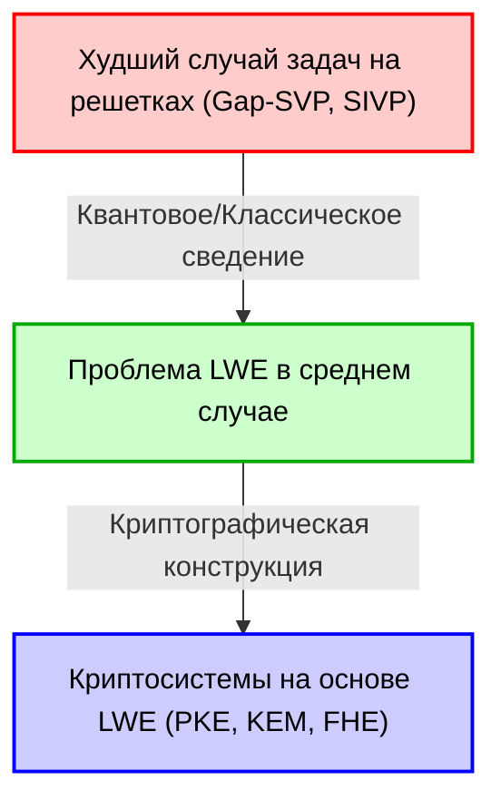
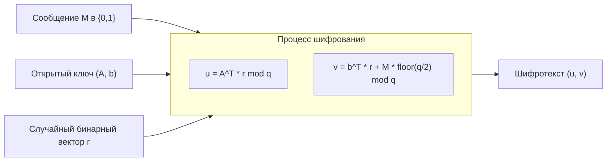
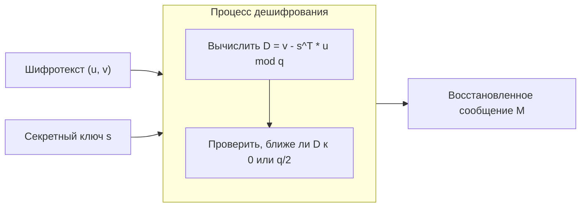

# 1. Введение: Рассвет постквантовой криптографии (PQC) и расцвет криптографии на решетках

Цифровая инфраструктура современного общества опирается на технологии криптографии с открытым ключом, такие как RSA и криптография на эллиптических кривых (ECC). Эти методы шифрования основывают свою безопасность на математической сложности таких задач, как "факторизация целых чисел" и "проблема дискретного логарифма", которые, как считается, не могут быть эффективно решены (требуют экспоненциального времени) классическими компьютерами.

Однако "алгоритм Шора", опубликованный Питером Шором (Peter Shor) в 1994 году, потряс криптографический мир. Этот алгоритм математически доказал, что когда будут созданы крупномасштабные квантовые компьютеры, они смогут решать проблемы факторизации и дискретного логарифма за полиномиальное время. Это означает, что широко используемая сегодня криптография с открытым ключом в будущем станет полностью уязвимой для расшифровки.

Чтобы противостоять этой "квантовой угрозе" (Quantum Threat), возникла острая необходимость в исследовании новых методов шифрования, которые трудно взломать даже с помощью квантовых компьютеров. Эта область называется "постквантовой криптографией" (Post-Quantum Cryptography: PQC).

В PQC существует несколько перспективных кандидатов, таких как криптография на основе хешей, криптография на основе кодов, многомерная полиномиальная криптография и криптография на основе изогений. Однако "криптография на решетках" (Lattice-based cryptography) в настоящее время привлекает наибольшее внимание и является центральным элементом процесса стандартизации PQC Национальным институтом стандартов и технологий США (NIST). По сравнению с другими методами, криптография на решетках обладает чрезвычайно высокой скоростью шифрования и дешифрования, а также выдающейся особенностью: она имеет очень сильное доказательство безопасности в криптографии — сведение от "сложности в худшем случае" (Worst-case complexity) к "сложности в среднем случае" (Average-case complexity).

В этой статье мы подробно рассмотрим криптографию на решетках, начиная с математического определения "решетки" (Lattice), которая является ее основой. Мы обсудим сложные задачи на решетках, такие как SVP (задача поиска кратчайшего вектора) и CVP (задача поиска ближайшего вектора), а также проблему "LWE (Learning With Errors)", которая является сердцем современной криптографии на решетках. Будут представлены математические формулы, геометрическая интуиция и конкретные числовые примеры.

# 2. Математическое определение решетки (Lattice) и геометрическая интуиция

## 2.1 Векторные пространства и решетки
В математике "решетка" (Lattice) — это множество дискретных точек, регулярно расположенных в $n$-мерном действительном векторном пространстве $\mathbb{R}^n$. Оно похоже на векторное пространство (Vector Space), изучаемое в линейной алгебре, но есть одно решающее отличие. В то время как векторное пространство — это непрерывное пространство, представленное линейными комбинациями базисных векторов с "действительными коэффициентами", решетка — это дискретное пространство, представленное линейными комбинациями базисных векторов с "целыми коэффициентами".

Дадим строгое математическое определение. Рассмотрим $n$ ($n \le m$) линейно независимых векторов $\mathbf{b}_1, \mathbf{b}_2, \dots, \mathbf{b}_n$ в $m$-мерном действительном векторном пространстве $\mathbb{R}^m$. Пусть матрица, содержащая эти векторы в качестве столбцов, будет $B = [\mathbf{b}_1, \mathbf{b}_2, \dots, \mathbf{b}_n] \in \mathbb{R}^{m \times n}$. Эта матрица $B$ называется "базисом" (Basis) решетки.

Решетка $\mathcal{L}(B)$, порожденная этим базисом $B$, определяется следующим образом:

$$
\mathcal{L}(B) = \left\{ \sum_{i=1}^{n} x_i \mathbf{b}_i \mathrel{\bigg|} x_i \in \mathbb{Z} \right\} = \{ B \mathbf{x} \mid \mathbf{x} \in \mathbb{Z}^n \}
$$

Важно отметить, что коэффициенты $x_i$ ограничены целыми числами $\mathbb{Z}$, а не действительными числами $\mathbb{R}$. В результате образуется "множество дискретных точек", подобных равномерно расположенным перекресткам, а не непрерывное пространство с бесконечным множеством точек.

## 2.2 Геометрический образ
Рассмотрим пример в двумерной плоскости $\mathbb{R}^2$. Если мы выберем в качестве базисных векторов $\mathbf{b}_1 = \begin{pmatrix} 1 \\ 0 \end{pmatrix}$ и $\mathbf{b}_2 = \begin{pmatrix} 0 \\ 1 \end{pmatrix}$, то порожденная ими решетка будет представлять собой множество всех целочисленных координат $(x, y) \in \mathbb{Z}^2$ на координатной плоскости. Это самая простая "квадратная решетка".

Однако решетки не всегда ортогональны. Например, если мы рассмотрим базис $\mathbf{b}_1 = \begin{pmatrix} 2 \\ 1 \end{pmatrix}$ и $\mathbf{b}_2 = \begin{pmatrix} 1 \\ 3 \end{pmatrix}$, то порожденные точки будут напоминать пересечения диагонально искаженной сетки.

## 2.3 Неоднозначность базиса и унимодулярные преобразования
Существует важное свойство, касающееся основы безопасности криптографии на решетках: "Существует бесконечное количество базисов, порождающих одну и ту же решетку".

Например, базис $\mathbf{b}_1 = (1, 0)^T, \mathbf{b}_2 = (0, 1)^T$, упомянутый ранее, порождает решетку $\mathbb{Z}^2$. Базис $\mathbf{b}'_1 = (1, 1)^T, \mathbf{b}'_2 = (2, 3)^T$ порождает абсолютно ту же самую решетку $\mathbb{Z}^2$.

Необходимым и достаточным условием того, что базис $B$ и другой базис $B'$ порождают одну и ту же решетку, является существование матрицы с целочисленными элементами $U \in \mathbb{Z}^{n \times n}$, определитель которой $\det(U) = \pm 1$, так что:
$$ B' = B U $$
Такая матрица $U$ называется "унимодулярной матрицей" (Unimodular matrix).

Основная идея применения в криптографии состоит в том, чтобы использовать "хороший базис" (почти ортогональный, состоящий из коротких векторов) в качестве секретного ключа, и "плохой базис" (состоящий из очень длинных векторов, сильно скошенных друг относительно друга) в качестве открытого ключа. Вычислить хороший базис из плохого становится крайне сложно по мере увеличения размерности. В этом заключается базовая интуиция криптографии на решетках.

# 3. Вычислительно сложные задачи на решетках

Безопасность криптографии на решетках зависит от сложности решения определенных математических задач на решетках. Здесь мы представим две самые фундаментальные и известные проблемы.

## 3.1 Задача поиска кратчайшего вектора (Shortest Vector Problem: SVP)
SVP — это самая классическая и известная задача в теории решеток.

**Определение (SVP):**
Дан произвольный базис решетки $B$. Найдите в решетке $\mathcal{L}(B)$ ненулевой вектор $\mathbf{v}$, евклидова норма (длина) которого минимальна.

Математически это задача поиска вектора $\mathbf{v}$, такого что достигается минимум $\min_{\mathbf{v} \in \mathcal{L}(B) \setminus \{\mathbf{0}\}} \| \mathbf{v} \|$. Эта минимальная длина обозначается как $\lambda_1(\mathcal{L})$ и называется "первым последовательным минимумом решетки".

В низких измерениях, таких как 2D или 3D, можно нарисовать график и визуально найти самый короткий вектор, или эффективно решить задачу с помощью алгоритма редукции решетки Гаусса. Однако известно, что когда размерность $n$ достигает сотен или тысяч, точное решение SVP является NP-трудным.

В реальной криптографии используется приближенная SVP ($\gamma$-SVP), которая находит "приближенно короткий вектор", а не строго кратчайший вектор. Когда коэффициент аппроксимации $\gamma$ полиномиального размера, эта проблема все еще считается чрезвычайно сложной.

## 3.2 Задача поиска ближайшего вектора (Closest Vector Problem: CVP)
CVP также является чрезвычайно важной задачей в криптографии на решетках.

**Определение (CVP):**
Дан произвольный базис решетки $B$ и любой целевой вектор $\mathbf{t} \in \mathbb{R}^m$ в пространстве (не обязательно являющийся точкой решетки). Найдите точку решетки $\mathbf{v} \in \mathcal{L}(B)$, ближайшую к $\mathbf{t}$.

Математически это задача поиска точки решетки $\mathbf{v}$, такой что достигается минимум $\min_{\mathbf{v} \in \mathcal{L}(B)} \| \mathbf{v} - \mathbf{t} \|$.

Как и SVP, CVP является NP-трудной в высоких измерениях. С точки зрения применения в криптографии, проблема LWE, которая будет обсуждаться позже, тесно связана с особым вариантом этой CVP (Bounded Distance Decoding: BDD).

## 3.3 Почему это не решается в высоких размерностях? (Пределы LLL и BKZ)
Известным алгоритмом для решения задач на решетках высокой размерности является алгоритм LLL (алгоритм Ленстры-Ленстры-Ловаса). Алгоритм LLL работает за полиномиальное время и может в некоторой степени "редуцировать" базис решетки до "хорошего базиса". Однако кратчайший вектор, который может найти алгоритм LLL, имеет коэффициент аппроксимации, который экспоненциально зависит от размерности ($2^{\mathcal{O}(n)}$) по сравнению с истинным кратчайшим вектором, что недостаточно для нарушения безопасности криптографии.

С помощью более мощных алгоритмов редукции базиса, таких как алгоритм BKZ (Block Korkine-Zolotarev), который является улучшением LLL, можно найти более короткие векторы, но вычислительная сложность возрастает экспоненциально в зависимости от размера блока. В криптографии на решетках безопасные параметры (например, значение размерности $n$) определяются путем оценки времени выполнения этого алгоритма BKZ. В текущих стандартных параметрах PQC размерность $n$ выбирается от 500 до 1000 и более, и считается, что для взлома потребуется время, превышающее возраст Вселенной, даже при использовании суперкомпьютеров или будущих квантовых компьютеров.

# 4. Математическая формулировка проблемы LWE (Learning With Errors)

Большая часть современной криптографии на решетках основана на проблеме "LWE (Learning With Errors)", предложенной Одедом Регевом (Oded Regev) в 2005 году. Красота проблемы LWE заключается в простоте ее формулировки и мощном математическом доказательстве "сведения от сложности в худшем случае к сложности в среднем случае".

## 4.1 Система линейных уравнений без шума
Чтобы понять проблему LWE, давайте сначала рассмотрим простую систему линейных уравнений без шума.
Предположим, у нас есть неизвестный секретный вектор $\mathbf{s} \in \mathbb{Z}_q^n$ (где каждая компонента - целое число от $0$ до $q-1$). Здесь $q$ - простое число.

Мы выбираем случайные векторы коэффициентов $\mathbf{a}_1, \mathbf{a}_2, \dots \in \mathbb{Z}_q^n$ и вычисляем их скалярное произведение с секретным вектором $\mathbf{s}$ по модулю $q$.
$b_1 = \langle \mathbf{a}_1, \mathbf{s} \rangle \pmod q$
$b_2 = \langle \mathbf{a}_2, \mathbf{s} \rangle \pmod q$
$\vdots$

Учитывая достаточное количество (не менее $n$) пар $(\mathbf{a}_i, b_i)$, мы можем легко восстановить секретный вектор $\mathbf{s}$, используя "метод исключения Гаусса" из линейной алгебры. Эту задачу легко решить за полиномиальное время.

## 4.2 Определение проблемы LWE: Добавление шума
Что произойдет, если мы добавим немного "шума (ошибки)" в эту задачу?
В этом суть проблемы LWE.

Для неизвестного секретного вектора $\mathbf{s} \in \mathbb{Z}_q^n$, мы добавляем небольшую ошибку $e_i \in \mathbb{Z}_q$ к результату каждого уравнения.
$b_i = \langle \mathbf{a}_i, \mathbf{s} \rangle + e_i \pmod q$

Здесь $e_i$ - небольшое целое число со средним значением 0 и относительно небольшим стандартным отклонением (например, выбранное из дискретного распределения Гаусса).
Предоставляемая информация представляет собой список пар случайных векторов $\mathbf{a}_i$ и $b_i$, вычисленных с добавлением этой ошибки.
$( \mathbf{a}_1, b_1 ), ( \mathbf{a}_2, b_2 ), \dots, ( \mathbf{a}_m, b_m )$

Это можно очень элегантно выразить в матричной форме.
Используя случайную матрицу $A \in \mathbb{Z}_q^{m \times n}$, секретный вектор $\mathbf{s} \in \mathbb{Z}_q^n$ и вектор ошибки $\mathbf{e} \in \mathbb{Z}_q^m$, мы можем записать:
$$ \mathbf{b} = A \mathbf{s} + \mathbf{e} \pmod q $$
Нам даны только $A$ и $\mathbf{b}$. Процесс поиска $\mathbf{s}$ на их основе называется "проблемой поиска LWE" (Search LWE problem).

Поскольку в ней присутствует ошибка $e_i$, попытка использовать метод исключения Гаусса приведет к экспоненциальному росту ошибки в процессе сложения и вычитания уравнений, делая невозможным получение правильного ответа. На первый взгляд это выглядит как простая система линейных уравнений, но добавление этого небольшого шума повышает уровень сложности задачи до NP-трудной.

## 4.3 Проблема решения LWE (Decision LWE)
В криптографических доказательствах часто используется вариация задачи поиска LWE, называемая "проблемой решения LWE" (Decision LWE problem).

Задача решения LWE состоит в том, чтобы, получив список образцов из следующих двух распределений, определить, из какого распределения они получены:
1. **Распределение LWE**: Намеренно вычисленное $(A, \mathbf{b} = A\mathbf{s} + \mathbf{e} \pmod q)$
2. **Равномерное случайное распределение**: $(A, \mathbf{u})$, состоящее из совершенно случайно выбранной матрицы $A$ и вектора $\mathbf{u}$

Удивительно, но если параметры проблемы LWE выбраны правильно, пары, полученные из распределения LWE, становятся "вычислительно неразличимыми" (Computationally Indistinguishable) от полностью случайных пар данных. Это свойство является основой того, что криптография на базе LWE может генерировать "шифротексты, неотличимые от случайных чисел".

## 4.4 Сведение от сложности в худшем случае к сложности в среднем случае (Теорема Регева)
Величайшим достижением Одеда Регева было математическое связывание сложности этой проблемы LWE со сложностью вышеупомянутых задач на решетках (SVP и CVP).

Используя квантовое сведение (Quantum reduction), он доказал, что: "Если существует алгоритм полиномиального времени, который может решить проблему LWE в среднем (для случайно выбранных $A$ и $\mathbf{e}$), то существует квантовый алгоритм полиномиального времени, который может решить Gap-SVP в худшем случае (самый сложный случай) для любой решетки". (Позже Пейкерт (Peikert) и другие также продемонстрировали классическое сведение).

Это свойство, похожее на мечту в криптографии. Причина в том, что оно устраняет опасение: "Шифр может быть взломан, потому что мы случайно выбрали слабый ключ (часть среднего случая)", и дает сильную гарантию: "Если мы можем решить LWE в среднем, то мы можем решить все сложные задачи на решетках (поэтому LWE абсолютно сложна)".

# 5. Построение криптографии с открытым ключом с использованием LWE (Криптосистема Регева)

Поняв сложность проблемы LWE, давайте посмотрим на базовую криптосистему с открытым ключом, предложенную Одедом Регевом, чтобы увидеть, как с ее помощью выполняются шифрование и дешифрование. Здесь мы объясним самый основной механизм шифрования 1-битного сообщения $M \in \{0, 1\}$.

## 5.1 Генерация ключей (Key Generation)
1. Определяются системные параметры: простое число $q$, размерность $n$ и количество уравнений $m$ ($m > n \log q$).
2. В качестве секретного ключа случайно выбирается вектор $\mathbf{s} \in \mathbb{Z}_q^n$.
3. Генерируется случайная матрица $A \in \mathbb{Z}_q^{m \times n}$.
4. Малый вектор ошибки $\mathbf{e} \in \mathbb{Z}_q^m$ выбирается из распределения ошибок, например, дискретного гауссовского.
5. Вычисляется вектор $\mathbf{b} = A \mathbf{s} + \mathbf{e} \pmod q$.
6. Открытый ключ (Public Key) — это $(A, \mathbf{b})$.
7. Секретный ключ (Secret Key) — это $\mathbf{s}$.

Открытый ключ - это буквально "экземпляр проблемы LWE". Поиск секретного ключа $\mathbf{s}$ по открытому ключу $(A, \mathbf{b})$ эквивалентен решению задачи поиска LWE, поэтому безопасность гарантирована.

## 5.2 Шифрование (Encryption)
Алиса использует открытый ключ Боба $(A, \mathbf{b})$ для шифрования 1-битного сообщения $M \in \{0, 1\}$.

1. Выбирается случайный бинарный вектор (с компонентами 0 или 1) $\mathbf{r} \in \{0, 1\}^m$.
2. В качестве первой части шифротекста вычисляется вектор $\mathbf{u} = A^T \mathbf{r} \pmod q$. ($A^T$ - транспонированная матрица $A$. Это означает, что мы суммируем те строки $A$, для которых компоненты $\mathbf{r}$ равны 1).
3. В качестве второй части шифротекста вычисляется скаляр $v = \mathbf{b}^T \mathbf{r} + M \cdot \lfloor \frac{q}{2} \rfloor \pmod q$.
   (Если сообщение $M$ равно 0, ничего не добавляется; если $1$, добавляется ровно половина значения $q$, то есть $\lfloor \frac{q}{2} \rfloor$).
4. Шифротекст (Ciphertext) представляет собой $(\mathbf{u}, v)$.

Интуитивный смысл шифрования заключается во взятии "суммы случайного подмножества" для матрицы открытого ключа $A$ и вектора $\mathbf{b}$. Из-за сложности проблемы решения LWE этот шифротекст $(\mathbf{u}, v)$ выглядит неотличимым от полностью случайного вектора и равномерного случайного числа (семантическая безопасность: Semantic Security).

## 5.3 Дешифрование (Decryption)
Боб расшифровывает шифротекст $(\mathbf{u}, v)$, используя свой секретный ключ $\mathbf{s}$.

1. Он вычисляет следующее значение: $D = v - \mathbf{s}^T \mathbf{u} \pmod q$
2. Если вычисленный результат ближе к $0$, выводится $M=0$; если он ближе к $\lfloor \frac{q}{2} \rfloor$, выводится $M=1$.

Давайте математически раскроем это, чтобы понять, почему оно может быть расшифровано.
Вспомните, что $\mathbf{b} = A \mathbf{s} + \mathbf{e}$.

$$
\begin{aligned}
v - \mathbf{s}^T \mathbf{u} &= (\mathbf{b}^T \mathbf{r} + M \cdot \lfloor \frac{q}{2} \rfloor) - \mathbf{s}^T (A^T \mathbf{r}) \\
&= ((A \mathbf{s} + \mathbf{e})^T \mathbf{r} + M \cdot \lfloor \frac{q}{2} \rfloor) - \mathbf{s}^T A^T \mathbf{r} \\
&= (\mathbf{s}^T A^T \mathbf{r} + \mathbf{e}^T \mathbf{r} + M \cdot \lfloor \frac{q}{2} \rfloor) - \mathbf{s}^T A^T \mathbf{r} \\
&= \mathbf{e}^T \mathbf{r} + M \cdot \lfloor \frac{q}{2} \rfloor \pmod q
\end{aligned}
$$

Здесь $\mathbf{s}^T A^T \mathbf{r}$ аккуратно компенсируется и исчезает из уравнения!
Остается только $\mathbf{e}^T \mathbf{r} + M \cdot \lfloor \frac{q}{2} \rfloor$.

$\mathbf{e}$ - это вектор шума с очень маленькими компонентами, а $\mathbf{r}$ - бинарный вектор с компонентами 0 или 1. Следовательно, их скалярное произведение $\mathbf{e}^T \mathbf{r}$ также останется относительно небольшим значением (если параметры выбраны правильно).

- Если $M=0$, то результат будет равен $\mathbf{e}^T \mathbf{r}$, что является малым значением, близким к $0$.
- Если $M=1$, то результат будет равен $\mathbf{e}^T \mathbf{r} + \lfloor \frac{q}{2} \rfloor$, что будет расположено вокруг половины значения $q$, то есть $\lfloor \frac{q}{2} \rfloor$.

Если параметры спроектированы так, что абсолютное значение ошибки $\mathbf{e}^T \mathbf{r}$ находится в пределах $\frac{q}{4}$, Боб может точно определить (расшифровать) сообщение $M$, просто посмотрев, к чему ближе результат вычислений: к $0$ или к $\lfloor \frac{q}{2} \rfloor$. Это прекрасный механизм, благодаря которому работает криптография на базе LWE.

# 6. Игрушечный пример LWE-шифрования с конкретными числами

Я думаю, что трудно прочувствовать это только с помощью ряда формул, поэтому давайте фактически проследим вычисления от шифрования до дешифрования, установив очень маленькие числовые параметры.
(*В реальных криптографических системах для обеспечения безопасности используются значения $n$ от 500 и выше, и $q$ от нескольких тысяч и выше*)

**[Установка параметров]**
- Модуль $q = 17$ (Простое число. Таким образом, значения принимаются в диапазоне от $0$ до $16$)
- Размерность $n = 2$
- Количество уравнений $m = 4$
- Предположим, мы шифруем сообщение $M = 1$.
- Величина сдвига сообщения: $\lfloor \frac{q}{2} \rfloor = \lfloor \frac{17}{2} \rfloor = 8$

**[1. Фаза генерации ключей]**
Боб случайным образом выбирает секретный ключ $\mathbf{s}$, матрицу $A$ и вектор ошибки $\mathbf{e}$.
$$ \mathbf{s} = \begin{pmatrix} 3 \\ 4 \end{pmatrix} \in \mathbb{Z}_{17}^2 $$
$$ A = \begin{pmatrix} 2 & 15 \\ 1 & 8 \\ 14 & 5 \\ 9 & 10 \end{pmatrix} \in \mathbb{Z}_{17}^{4 \times 2} $$
$$ \mathbf{e} = \begin{pmatrix} 1 \\ -1 \\ 0 \\ 2 \end{pmatrix} \equiv \begin{pmatrix} 1 \\ 16 \\ 0 \\ 2 \end{pmatrix} \pmod{17} $$

Далее вычисляется открытый ключ $\mathbf{b}$.
$$ A \mathbf{s} = \begin{pmatrix} 2 & 15 \\ 1 & 8 \\ 14 & 5 \\ 9 & 10 \end{pmatrix} \begin{pmatrix} 3 \\ 4 \end{pmatrix} = \begin{pmatrix} 2\times 3 + 15\times 4 \\ 1\times 3 + 8\times 4 \\ 14\times 3 + 5\times 4 \\ 9\times 3 + 10\times 4 \end{pmatrix} = \begin{pmatrix} 6 + 60 \\ 3 + 32 \\ 42 + 20 \\ 27 + 40 \end{pmatrix} = \begin{pmatrix} 66 \\ 35 \\ 62 \\ 67 \end{pmatrix} $$
Мы вычисляем это по модулю 17. (Например, $66 = 17 \times 3 + 15$)
$$ A \mathbf{s} \pmod{17} = \begin{pmatrix} 15 \\ 1 \\ 11 \\ 16 \end{pmatrix} $$
Мы прибавляем вектор ошибки $\mathbf{e}$.
$$ \mathbf{b} = A \mathbf{s} + \mathbf{e} = \begin{pmatrix} 15 \\ 1 \\ 11 \\ 16 \end{pmatrix} + \begin{pmatrix} 1 \\ 16 \\ 0 \\ 2 \end{pmatrix} = \begin{pmatrix} 16 \\ 17 \\ 11 \\ 18 \end{pmatrix} \equiv \begin{pmatrix} 16 \\ 0 \\ 11 \\ 1 \end{pmatrix} \pmod{17} $$

Открытый ключ состоит из $A$ и $\mathbf{b} = (16, 0, 11, 1)^T$.

**[2. Фаза шифрования]**
Алиса шифрует сообщение $M = 1$.
Она выбирает случайный вектор $\mathbf{r}$. Пусть $\mathbf{r} = (1, 0, 1, 0)^T$.

Вычисляется $\mathbf{u}$.
$$ \mathbf{u} = A^T \mathbf{r} = \begin{pmatrix} 2 & 1 & 14 & 9 \\ 15 & 8 & 5 & 10 \end{pmatrix} \begin{pmatrix} 1 \\ 0 \\ 1 \\ 0 \end{pmatrix} = \begin{pmatrix} 2 \times 1 + 14 \times 1 \\ 15 \times 1 + 5 \times 1 \end{pmatrix} = \begin{pmatrix} 16 \\ 20 \end{pmatrix} \equiv \begin{pmatrix} 16 \\ 3 \end{pmatrix} \pmod{17} $$

Вычисляется $v$.
$$ \mathbf{b}^T \mathbf{r} = (16, 0, 11, 1) \begin{pmatrix} 1 \\ 0 \\ 1 \\ 0 \end{pmatrix} = 16 \times 1 + 11 \times 1 = 27 \equiv 10 \pmod{17} $$
Прибавляется значение, соответствующее сообщению $M=1$: $\lfloor 17/2 \rfloor = 8$.
$$ v = \mathbf{b}^T \mathbf{r} + M \cdot 8 = 10 + 1 \times 8 = 18 \equiv 1 \pmod{17} $$

Алиса отправляет Бобу шифротекст $(\mathbf{u}, v) = \left( \begin{pmatrix} 16 \\ 3 \end{pmatrix}, 1 \right)$.

**[3. Фаза дешифрования]**
Боб, получивший шифротекст, расшифровывает его с помощью секретного ключа $\mathbf{s} = (3, 4)^T$.
Он вычисляет формулу процесса дешифрования: $D = v - \mathbf{s}^T \mathbf{u} \pmod{17}$.

$$ \mathbf{s}^T \mathbf{u} = (3, 4) \begin{pmatrix} 16 \\ 3 \end{pmatrix} = 3 \times 16 + 4 \times 3 = 48 + 12 = 60 \equiv 9 \pmod{17} $$
$$ D = v - \mathbf{s}^T \mathbf{u} = 1 - 9 = -8 \pmod{17} $$

Здесь, в мире по модулю 17, $-8$ равно $9$ ($-8 + 17 = 9$).
Полученное значение $D = 9$ проверяется, к чему оно ближе: к $0$ или к $8$ ($\lfloor 17/2 \rfloor$).
Поскольку $9$ явно ближе к $8$, чем к $0$, Боб смог правильно восстановить $M = 1$!

Почему получилось $9$? Давайте вспомним доказательство, приведенное ранее.
Часть ошибки равна $\mathbf{e}^T \mathbf{r} = (1, -1, 0, 2) (1, 0, 1, 0)^T = 1 \times 1 + 0 \times 1 = 1$.
Следовательно, результат вычислений равен $\mathbf{e}^T \mathbf{r} + M \cdot 8 = 1 + 8 = 9$, и мы убедились, что теоретическое значение было вычислено правильно.

# 7. Эволюция к практическому применению: Ring-LWE и Module-LWE

Стандартная проблема LWE (Standard LWE), которую мы объясняли до сих пор, имеет очень сильное доказательство безопасности, но на практике у нее есть фатальные недостатки: "огромный размер ключа" и "высокая вычислительная стоимость".

В Standard LWE открытый ключ включает огромную матрицу $A \in \mathbb{Z}_q^{m \times n}$. Когда параметр $n$ достигает сотен или тысяч, размер этой матрицы достигает нескольких мегабайт, что слишком тяжело для передачи и приема каждый раз в интернет-протоколах связи (таких как TLS). Кроме того, умножение матрицы на вектор требует сложности вычислений $\mathcal{O}(n^2)$.

Для решения этой проблемы были внедрены "Ring-LWE (RLWE)" и "Module-LWE (MLWE)", которые включают алгебраическую структуру, называемую кольцами многочленов (Polynomial rings), в решетку.

## 7.1 Интуиция Ring-LWE
В Ring-LWE векторы и матрицы заменяются на элементы (многочлены) над кольцом многочленов $\mathcal{R}_q = \mathbb{Z}_q[X]/(X^n + 1)$. (Здесь $n$ выбирается как степень двойки).

В то время как открытым ключом в Standard LWE была матрица $A$, Ring-LWE использует один многочлен $a(x)$. Секретный ключ $s(x)$ и ошибка $e(x)$ также становятся многочленами.
Уравнение выглядит следующим образом:
$$ b(x) = a(x) \cdot s(x) + e(x) \pmod q $$

Поскольку это умножение многочленов, за счет использования "теоретико-числового преобразования (Number Theoretic Transform: NTT)", аналогичного быстрому преобразованию Фурье (FFT), вычислительная сложность может быть резко снижена до $\mathcal{O}(n \log n)$. Кроме того, поскольку размер открытого ключа уменьшается с матрицы до одного многочлена, размер данных сокращается до $\mathcal{O}(n)$. Это дает подавляющее преимущество в пропускной способности связи.

С математической точки зрения Ring-LWE сводится к задаче на решетке с особой симметрией, называемой "идеальной решеткой" (Ideal Lattice), а не на общей решетке.

## 7.2 Module-LWE и стандартизация NIST (Kyber / ML-KEM)
Хотя Ring-LWE эффективен, существовало некоторое опасение, что специальная алгебраическая структура идеальных решеток может стать отправной точкой для будущих атак. Поэтому "Module-LWE (MLWE)" был создан, чтобы взять "лучшее из обоих миров": консервативную безопасность Standard LWE и эффективность Ring-LWE.

В Module-LWE мы рассматриваем небольшие матрицы и векторы, элементами которых являются многочлены. Другими словами, мы работаем с модулями над кольцом.
В настоящее время "CRYSTALS-Kyber" (название стандарта: ML-KEM), выбранный NIST в качестве стандарта алгоритма инкапсуляции ключей (KEM) для PQC, построен именно на сложности этой проблемы Module-LWE.

# 8. Почему это безопасно против квантовых компьютеров?

Наконец, мы коснемся сути вопроса: "Почему считается, что криптография на решетках не может быть взломана даже с помощью квантовых компьютеров?"

Алгоритм Шора, с помощью которого квантовые компьютеры взламывают шифрование RSA и криптографию на эллиптических кривых, по сути, является алгоритмом для решения "проблемы скрытой подгруппы (Hidden Subgroup Problem: HSP)". Математическая структура (конечные абелевы группы), лежащая в основе RSA и ECC, обладает периодичностью, и эта периодичность (скрытая подгруппа) может быть извлечена за один шаг путем использования специальной операции квантового алгоритма, называемой квантовым преобразованием Фурье (QFT).

Однако задачи на решетках в корне отличаются. Решетки также имеют периодичность, но то, что ищется в SVP и CVP, — это геометрические нелинейные свойства, такие как "кратчайшее расстояние" и "удаление шума". Даже если применить "квантовое преобразование Фурье на абелевой группе", подобно алгоритму Шора, непосредственно к задачам на решетках, полезную информацию для их решения нельзя эффективно извлечь. На сегодняшний день не было найдено квантовых алгоритмов, способных решить SVP или LWE за полиномиальное время. Широко распространено мнение, что даже с мощью параллельных вычислений квантовых компьютеров единственным эффективным средством является поиск, близкий к полному перебору (ускорение в виде квадратного корня с помощью алгоритма Гровера).

# 9. Заключение

В этой статье мы подробно рассмотрели математическую интуицию криптографии на решетках, начиная с геометрического определения решеток, переходя к формулировке проблемы LWE и заканчивая построением криптографии с открытым ключом.

1. **Решетка (Lattice)** — это дискретное пространство, представленное линейными комбинациями базисных векторов с целыми коэффициентами, и в высоких измерениях становится трудно найти "хороший базис", близкий к ортогональному (SVP).
2. **Проблема LWE (Learning With Errors)** — это проблема решения систем линейных уравнений с шумом. Поскольку она связана со сложностью задач на решетках в худшем случае, это обеспечивает сильное доказательство безопасности.
3. Используя проблему LWE, шифрование и дешифрование (**Криптосистема Регева**) реализуются с помощью хитроумного механизма намеренного добавления или удаления шума.
4. В реальных протоколах для повышения эффективности связи и скорости вычислений используются **Ring-LWE** и **Module-LWE** с кольцами многочленов, которые служат основой для стандарта NIST **ML-KEM**.

В условиях надвигающегося беспрецедентного сдвига вычислительной парадигмы в виде квантовых компьютеров весьма романтично думать, что "криптография на решетках", родившаяся из глубин классической линейной алгебры и теории чисел, сформирует основу будущей интернет-безопасности. Математика, лежащая в основе криптографии на решетках, не является чрезмерно сложной, и ее красивую структуру можно полностью понять, обладая базовыми знаниями в области линейной алгебры и теории вероятностей. Мы надеемся, что эта статья поможет вам понять криптографию на решетках, которая является ядром PQC.
