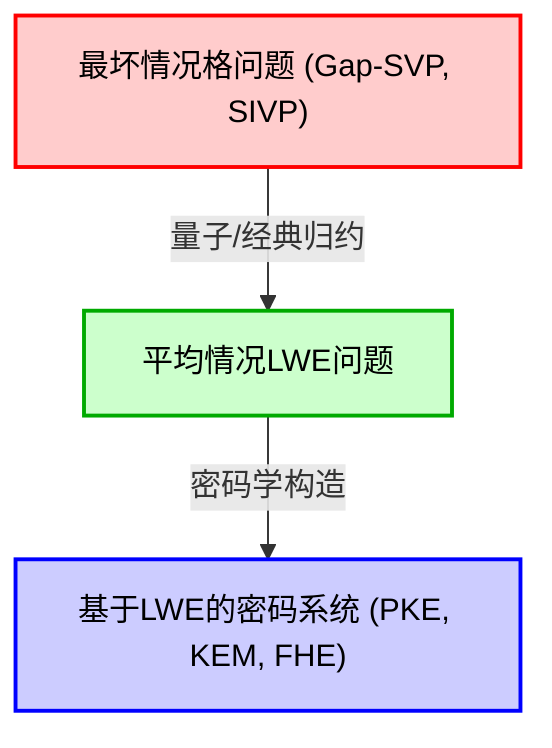
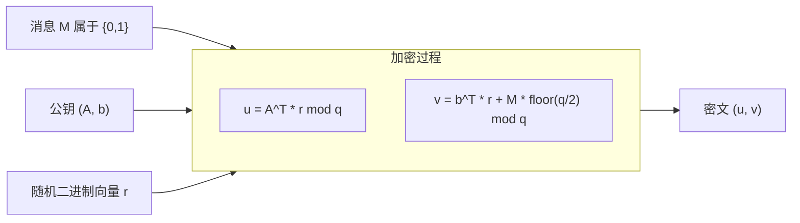
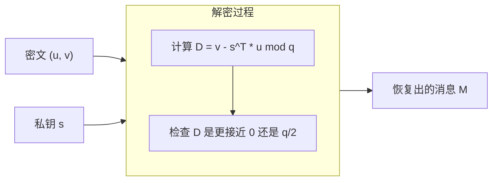

# 1. 引言：后量子密码（PQC）的黎明与格密码的崛起

支撑现代社会数字基础设施的是以RSA密码和椭圆曲线密码（ECC）为首的公钥密码技术。这些密码方案的安全性建立在“整数分解问题”或“离散对数问题”等被认为使用传统经典计算机无法高效求解（需要指数级时间）的数学难题之上。

然而，彼得·秀尔（Peter Shor）在1994年提出的“Shor算法”在密码学界引起了轩然大波。该算法在数学上证明了，一旦大规模量子计算机问世，便能在多项式时间内解决整数分解问题和离散对数问题。这意味着目前被广泛使用的公钥密码在未来将变得完全可以被破解。

为了应对这种“量子计算机的威胁（Quantum Threat）”，亟需研究即使使用量子计算机也难以破解的新型密码方案。这就是被称为“后量子密码（Post-Quantum Cryptography: PQC）”或“抗量子计算密码”的领域。

PQC有几种有力的候选方案。包括基于哈希的密码、基于编码的密码、多变量多项式密码、同源密码等，其中目前最受瞩目、也是NIST（美国国家标准与技术研究院）PQC标准化进程核心的便是“格密码（Lattice-based cryptography）”。与其他方案相比，格密码的加解密处理速度非常快，而且具有被称为“从最坏情况复杂度（Worst-case complexity）归约到平均情况复杂度（Average-case complexity）”的特性，在密码学理论中拥有极强的安全性证明。

本文将从格密码的基础——“格（Lattice）”的数学定义出发，深入剖析格上的困难问题：SVP（最短向量问题）和CVP（最近向量问题），以及作为现代格密码心脏的“LWE问题（Learning With Errors）”，并结合数学公式、几何直觉以及具体的数值计算例子，进行透彻的讲解。

# 2. 格（Lattice）的数学定义与几何直觉

## 2.1 向量空间与格
在数学中，“格（Lattice）”是指在$n$维实向量空间 $\mathbb{R}^n$ 内规则排列的离散点的集合。它与线性代数中学习的向量空间（Vector Space）相似，但存在决定性的区别。向量空间是由基向量通过“实数系数”的线性组合表示的连续空间，而格则是通过基向量的“整数系数”的线性组合表示的离散空间。

让我们给出严谨的数学定义。考虑在$m$维实向量空间 $\mathbb{R}^m$ 中的 $n$ 个（$n \le m$）线性无关向量 $\mathbf{b}_1, \mathbf{b}_2, \dots, \mathbf{b}_n$。将这些向量作为列向量构成的矩阵记为 $B = [\mathbf{b}_1, \mathbf{b}_2, \dots, \mathbf{b}_n] \in \mathbb{R}^{m \times n}$。这个 $B$ 被称为格的“基（Basis）”。

由这个基 $B$ 生成的格 $\mathcal{L}(B)$ 定义如下：

$$
\mathcal{L}(B) = \left\{ \sum_{i=1}^{n} x_i \mathbf{b}_i \mathrel{\bigg|} x_i \in \mathbb{Z} \right\} = \{ B \mathbf{x} \mid \mathbf{x} \in \mathbb{Z}^n \}
$$

这里的重点是，系数 $x_i$ 被限定为整数 $\mathbb{Z}$，而不是实数 $\mathbb{R}$。因此，它并不是空间中无限存在的连续点，而是形成了像等距排列的交叉点一样的“离散点集”。

## 2.2 几何学意象
以二维平面 $\mathbb{R}^2$ 为例。如果我们选择基向量 $\mathbf{b}_1 = \begin{pmatrix} 1 \\ 0 \end{pmatrix}$ 和 $\mathbf{b}_2 = \begin{pmatrix} 0 \\ 1 \end{pmatrix}$，由它们生成的格就是坐标平面上所有整数坐标 $(x, y) \in \mathbb{Z}^2$ 的集合。这是最简单的“方格”。

然而，格并不总是正交的。例如，考虑基向量 $\mathbf{b}_1 = \begin{pmatrix} 2 \\ 1 \end{pmatrix}$ 和 $\mathbf{b}_2 = \begin{pmatrix} 1 \\ 3 \end{pmatrix}$，它们生成的点就像是倾斜扭曲的网格的交点。

## 2.3 基的非唯一性与幺模变换
有一个涉及格密码安全性根基的重要性质。那就是“生成同一个格的基有无数个”。

例如，刚才由 $\mathbf{b}_1 = (1, 0)^T, \mathbf{b}_2 = (0, 1)^T$ 生成的 $\mathbb{Z}^2$ 格，即使使用 $\mathbf{b}'_1 = (1, 1)^T, \mathbf{b}'_2 = (2, 3)^T$ 这组基，也会生成完全相同的格 $\mathbb{Z}^2$。

某个基 $B$ 和另一个基 $B'$ 生成相同格的充要条件是，存在一个整数元素构成的矩阵 $U \in \mathbb{Z}^{n \times n}$，其行列式为 $\det(U) = \pm 1$，并且可以表示为：
$$ B' = B U $$
这样的矩阵 $U$ 被称为“幺模矩阵（Unimodular matrix）”。

在密码学应用中，基本思路是使用“好基（接近正交且由短向量组成的基）”作为私钥，而使用“坏基（相互极度倾斜且由非常长的向量组成的基）”作为公钥。当维度较高时，从坏基计算出好基将变得非常困难。这就是格密码的基本直觉。

# 3. 格上的计算困难问题

格密码的安全性依赖于求解格上特定数学问题的困难性。这里介绍最基本也是最著名的两个问题。

## 3.1 最短向量问题（Shortest Vector Problem: SVP）
SVP是格理论中最经典且最著名的问题。

**定义（SVP）:**
给定任意一个格的基 $B$，找到该格 $\mathcal{L}(B)$ 中除零向量以外欧几里得范数（长度）最小的向量 $\mathbf{v}$。

用数学公式表示，即寻找使 $\min_{\mathbf{v} \in \mathcal{L}(B) \setminus \{\mathbf{0}\}} \| \mathbf{v} \|$ 成立的 $\mathbf{v}$。这个最小长度记作 $\lambda_1(\mathcal{L})$，被称为“格的第一连续极小值（First successive minimum）”。

在二维或三维的低维度下，我们可以通过画图用肉眼找到最短向量。或者可以使用高斯格基约化算法等高效地求解。但是，当维度 $n$ 达到数百至数千这样的高维时，已知严格求解SVP是NP困难的。

在实际密码中，通常不寻找严格的最短向量，而是寻找“近似短的向量”，即近似SVP（$\gamma$-SVP）。当近似系数 $\gamma$ 为多项式大小时，这个问题仍然被认为是非常困难的。

## 3.2 最近向量问题（Closest Vector Problem: CVP）
CVP在格密码中也是极其重要的问题。

**定义（CVP）:**
给定任意格基 $B$ 和空间内任意目标向量 $\mathbf{t} \in \mathbb{R}^m$（不一定是格点），在格点中找到距离 $\mathbf{t}$ 最近的格点 $\mathbf{v} \in \mathcal{L}(B)$。

用数学公式表示，即寻找使 $\min_{\mathbf{v} \in \mathcal{L}(B)} \| \mathbf{v} - \mathbf{t} \|$ 成立的格点 $\mathbf{v}$。

与SVP一样，CVP在高维空间中也是NP困难的。从密码学应用的角度来看，后文将提到的LWE问题与CVP的特殊变种（Bounded Distance Decoding: BDD）有着密切的关系。

## 3.3 为什么高维情况下无法求解？（LLL与BKZ的极限）
作为求解高维格问题的著名算法，有LLL算法（Lenstra-Lenstra-Lovász algorithm）。LLL算法能在多项式时间内运行，可以将格基约化（Reduction）到某种程度上的“好基”。然而，LLL算法所能找到的最短向量，其长度与真实最短向量相比，具有指数级（$2^{\mathcal{O}(n)}$）的近似系数，因此不足以破解密码的安全性。

如果使用基于LLL改进的更强力的基约化算法（如BKZ，Block Korkine-Zolotarev算法），可以找到更短的向量，但其计算量会随着块大小呈指数级增长。在格密码中，就是通过估算这种BKZ算法的运行时间来决定安全参数（例如维度 $n$ 的大小）。在目前的PQC标准参数中，维度 $n$ 通常选择在500到1000以上的值，据称即使使用超级计算机或未来的量子计算机，破解所需的时间也将超过宇宙的年龄。

# 4. LWE问题（Learning With Errors）的数学公式化

大部分现代格密码都基于Oded Regev在2005年提出的“LWE问题（Learning With Errors）”。LWE问题的美妙之处在于其公式化的简洁性，以及它拥有“从最坏情况复杂度到平均情况复杂度的归约”这一强大的数学证明。

## 4.1 无噪声的线性方程组
为了理解LWE问题，我们先来考虑一个没有噪声的简单线性方程组。
假设有一个未知的秘密向量 $\mathbf{s} \in \mathbb{Z}_q^n$（各个分量是 $0$ 到 $q-1$ 的整数）。这里 $q$ 是一个素数。

选择随机的系数向量 $\mathbf{a}_1, \mathbf{a}_2, \dots \in \mathbb{Z}_q^n$，并计算它们与秘密向量 $\mathbf{s}$ 的内积对 $q$ 取模的结果：
$b_1 = \langle \mathbf{a}_1, \mathbf{s} \rangle \pmod q$
$b_2 = \langle \mathbf{a}_2, \mathbf{s} \rangle \pmod q$
$\vdots$

如果给出足够数量（$n$个以上）的 $(\mathbf{a}_i, b_i)$ 数对，我们就可以使用线性代数中的“高斯消元法（Gaussian elimination）”轻松恢复出秘密向量 $\mathbf{s}$。这是一个可以在多项式时间内轻松求解的问题。

## 4.2 LWE问题的定义：加入噪声
那么，如果在该问题中加入微小的“噪声（误差）”会怎样呢？
这就是LWE问题的本质。

对于未知的秘密向量 $\mathbf{s} \in \mathbb{Z}_q^n$，我们在每个方程的结果中加入一个小的误差 $e_i \in \mathbb{Z}_q$。
$b_i = \langle \mathbf{a}_i, \mathbf{s} \rangle + e_i \pmod q$

在这里，$e_i$ 是均值为0，标准差相对较小（例如从类似正态分布的离散高斯分布中选取）的小整数值。
我们所得到的信息是随机向量 $\mathbf{a}_i$ 与加上误差计算得出的 $b_i$ 组成的数对列表：
$( \mathbf{a}_1, b_1 ), ( \mathbf{a}_2, b_2 ), \dots, ( \mathbf{a}_m, b_m )$

用矩阵表示这个过程会非常简洁。
使用随机矩阵 $A \in \mathbb{Z}_q^{m \times n}$、秘密向量 $\mathbf{s} \in \mathbb{Z}_q^n$、误差向量 $\mathbf{e} \in \mathbb{Z}_q^m$，可以写成：
$$ \mathbf{b} = A \mathbf{s} + \mathbf{e} \pmod q $$
提供给我们的只有 $A$ 和 $\mathbf{b}$。从中求解 $\mathbf{s}$ 的问题就是“搜索LWE问题（Search LWE problem）”。

由于混入了误差 $e_i$，如果尝试使用高斯消元法，在方程加减的过程中误差会呈指数级放大，从而无法得到正确的答案。乍一看只是简单的线性方程组，但仅仅加入了这种微小的噪声，问题的难度就骤升至NP困难级别。

## 4.3 判定LWE问题（Decision LWE）
在密码学理论的证明中，频繁使用的是搜索LWE问题的一个变种——“判定LWE问题（Decision LWE problem）”。

判定LWE问题是指，给定从以下两个分布中获取的样本列表，判定它们来自哪一个分布的问题：
1. **LWE分布**: 刻意计算出的 $(A, \mathbf{b} = A\mathbf{s} + \mathbf{e} \pmod q)$
2. **均匀随机分布**: 由完全随机选择的矩阵 $A$ 和向量 $\mathbf{u}$ 构成的 $(A, \mathbf{u})$

令人惊讶的是，如果恰当地选择LWE问题的参数，从LWE分布中获得的样本数对，与完全随机的数据对之间将变得“计算上不可区分（Computationally Indistinguishable）”。这个性质成为了基于LWE的密码能够生成“与随机数无法区分的密文”的理论依据。

## 4.4 从最坏情况复杂度到平均情况复杂度的归约（Regev定理）
Oded Regev最大的贡献，就是通过数学证明将LWE问题的难度与前文所述格问题（SVP和CVP）的难度联系在了一起。

他使用量子归约（Quantum reduction）证明了：“如果存在能在平均情况下（对于随机选择的 $A$ 和 $\mathbf{e}$）在多项式时间内求解LWE问题的算法，那么就存在能在多项式时间内求解任意格的最坏情况（最困难的情况）Gap-SVP的量子算法”。（后来Peikert等人也证明了经典归约）。

这在密码学理论中是一个梦幻般的性质。因为它消除了“密码被破解，可能只是因为我们恰好选择了一个弱密钥（平均情况的一部分）”的担忧，并提供了强有力的保证：“如果平均的LWE能被解决，那么格上所有最困难的问题都能被解决（所以LWE绝对是困难的）”。

# 5. 使用LWE构建公钥密码方案（Regev密码）

理解了LWE问题的困难性之后，我们来看看Oded Regev提出的基本公钥密码方案，了解如何利用它进行加解密。这里我们将讲解加密1比特消息 $M \in \{0, 1\}$ 的最基本机制。

## 5.1 密钥生成（Key Generation）
1. 作为系统参数，确定作为模数的素数 $q$、维度 $n$ 以及方程数量 $m$（$m > n \log q$）。
2. 作为私钥，随机选择向量 $\mathbf{s} \in \mathbb{Z}_q^n$。
3. 生成随机矩阵 $A \in \mathbb{Z}_q^{m \times n}$。
4. 从离散高斯分布等误差分布中选择一个小的误差向量 $\mathbf{e} \in \mathbb{Z}_q^m$。
5. 计算向量 $\mathbf{b} = A \mathbf{s} + \mathbf{e} \pmod q$。
6. 公钥（Public Key）为 $(A, \mathbf{b})$。
7. 私钥（Secret Key）为 $\mathbf{s}$。

公钥本身正是“LWE问题的一个实例”。由于从公钥 $(A, \mathbf{b})$ 求出私钥 $\mathbf{s}$ 等同于求解搜索LWE问题，因此其安全性得到了保障。

## 5.2 加密（Encryption）
爱丽丝使用鲍勃的公钥 $(A, \mathbf{b})$，对1比特的消息 $M \in \{0, 1\}$ 进行加密。

1. 选择一个随机的二进制向量（分量为0或1）$\mathbf{r} \in \{0, 1\}^m$。
2. 作为密文的前半部分，计算向量 $\mathbf{u} = A^T \mathbf{r} \pmod q$。（$A^T$ 是 $A$ 的转置矩阵。也就是说，将 $A$ 中对应 $\mathbf{r}$ 分量为1的行进行相加）。
3. 作为密文的后半部分，计算标量 $v = \mathbf{b}^T \mathbf{r} + M \cdot \lfloor \frac{q}{2} \rfloor \pmod q$。
   （如果消息 $M$ 为0，则什么都不加；如果为 $1$，则加上正好是 $q$ 一半的值 $\lfloor \frac{q}{2} \rfloor$）。
4. 密文（Ciphertext）即为 $(\mathbf{u}, v)$。

加密直观的含义是，对于公钥矩阵 $A$ 和向量 $\mathbf{b}$，取其“随机子集的和”。由于判定LWE问题的困难性，该密文 $(\mathbf{u}, v)$ 看起来与完全随机的向量和均匀随机数不可区分（语义安全性：Semantic Security）。

## 5.3 解密（Decryption）
鲍勃使用私钥 $\mathbf{s}$ 对密文 $(\mathbf{u}, v)$ 进行解密。

1. 计算以下值： $D = v - \mathbf{s}^T \mathbf{u} \pmod q$
2. 如果计算结果接近 $0$，则输出 $M=0$；如果接近 $\lfloor \frac{q}{2} \rfloor$，则输出 $M=1$。

为什么这样就能解密呢？让我们从数学上展开来看。
回想一下 $\mathbf{b} = A \mathbf{s} + \mathbf{e}$。

$$
\begin{aligned}
v - \mathbf{s}^T \mathbf{u} &= (\mathbf{b}^T \mathbf{r} + M \cdot \lfloor \frac{q}{2} \rfloor) - \mathbf{s}^T (A^T \mathbf{r}) \\
&= ((A \mathbf{s} + \mathbf{e})^T \mathbf{r} + M \cdot \lfloor \frac{q}{2} \rfloor) - \mathbf{s}^T A^T \mathbf{r} \\
&= (\mathbf{s}^T A^T \mathbf{r} + \mathbf{e}^T \mathbf{r} + M \cdot \lfloor \frac{q}{2} \rfloor) - \mathbf{s}^T A^T \mathbf{r} \\
&= \mathbf{e}^T \mathbf{r} + M \cdot \lfloor \frac{q}{2} \rfloor \pmod q
\end{aligned}
$$

在这里，公式中的 $\mathbf{s}^T A^T \mathbf{r}$ 被完美地抵消消失了！
剩下的只有 $\mathbf{e}^T \mathbf{r} + M \cdot \lfloor \frac{q}{2} \rfloor$。

$\mathbf{e}$ 是分量极小的噪声向量，而 $\mathbf{r}$ 是分量为0或1的二进制向量。因此，它们的内积 $\mathbf{e}^T \mathbf{r}$（如果参数选择得当）也会保持在一个相对较小的值。

- 如果 $M=0$，结果变为 $\mathbf{e}^T \mathbf{r}$，这是一个接近 $0$ 的小值。
- 如果 $M=1$，结果变为 $\mathbf{e}^T \mathbf{r} + \lfloor \frac{q}{2} \rfloor$，它将位于 $q$ 的一半值 $\lfloor \frac{q}{2} \rfloor$ 的附近。

如果参数设计使得误差 $\mathbf{e}^T \mathbf{r}$ 的绝对值能够控制在 $\frac{q}{4}$ 以内，鲍勃只需观察计算结果是更接近 $0$ 还是 $\lfloor \frac{q}{2} \rfloor$，就能准确地判定（恢复）消息 $M$。这就是基于LWE的密码能够正常运作的精妙机制。

# 6. 使用具体数值的LWE密码玩具示例

仅仅罗列公式可能很难有切实的感受，所以让我们实际设定非常小的数值参数，来追踪一下从加密到解密的计算过程。
（※在现实的密码系统中，为了确保安全性，通常会使用 $n$ 为500以上、$q$ 为数千以上的值）

**【参数设定】**
- 模数 $q = 17$ （素数。因此取值范围在 $0$ 到 $16$ 之间）
- 维度 $n = 2$
- 方程数量 $m = 4$
- 假设要加密消息 $M = 1$。
- 消息的偏移量：$\lfloor \frac{q}{2} \rfloor = \lfloor \frac{17}{2} \rfloor = 8$

**【1. 密钥生成阶段】**
鲍勃随机选择私钥 $\mathbf{s}$、矩阵 $A$ 以及误差向量 $\mathbf{e}$。
$$ \mathbf{s} = \begin{pmatrix} 3 \\ 4 \end{pmatrix} \in \mathbb{Z}_{17}^2 $$
$$ A = \begin{pmatrix} 2 & 15 \\ 1 & 8 \\ 14 & 5 \\ 9 & 10 \end{pmatrix} \in \mathbb{Z}_{17}^{4 \times 2} $$
$$ \mathbf{e} = \begin{pmatrix} 1 \\ -1 \\ 0 \\ 2 \end{pmatrix} \equiv \begin{pmatrix} 1 \\ 16 \\ 0 \\ 2 \end{pmatrix} \pmod{17} $$

接着计算公钥 $\mathbf{b}$。
$$ A \mathbf{s} = \begin{pmatrix} 2 & 15 \\ 1 & 8 \\ 14 & 5 \\ 9 & 10 \end{pmatrix} \begin{pmatrix} 3 \\ 4 \end{pmatrix} = \begin{pmatrix} 2\times 3 + 15\times 4 \\ 1\times 3 + 8\times 4 \\ 14\times 3 + 5\times 4 \\ 9\times 3 + 10\times 4 \end{pmatrix} = \begin{pmatrix} 6 + 60 \\ 3 + 32 \\ 42 + 20 \\ 27 + 40 \end{pmatrix} = \begin{pmatrix} 66 \\ 35 \\ 62 \\ 67 \end{pmatrix} $$
将其对 17 取模。($66 = 17 \times 3 + 15$ 等)
$$ A \mathbf{s} \pmod{17} = \begin{pmatrix} 15 \\ 1 \\ 11 \\ 16 \end{pmatrix} $$
加上误差向量 $\mathbf{e}$。
$$ \mathbf{b} = A \mathbf{s} + \mathbf{e} = \begin{pmatrix} 15 \\ 1 \\ 11 \\ 16 \end{pmatrix} + \begin{pmatrix} 1 \\ 16 \\ 0 \\ 2 \end{pmatrix} = \begin{pmatrix} 16 \\ 17 \\ 11 \\ 18 \end{pmatrix} \equiv \begin{pmatrix} 16 \\ 0 \\ 11 \\ 1 \end{pmatrix} \pmod{17} $$

公钥为 $A$ 和 $\mathbf{b} = (16, 0, 11, 1)^T$。

**【2. 加密阶段】**
爱丽丝加密消息 $M = 1$。
选择随机向量 $\mathbf{r}$。这里设 $\mathbf{r} = (1, 0, 1, 0)^T$。

计算 $\mathbf{u}$。
$$ \mathbf{u} = A^T \mathbf{r} = \begin{pmatrix} 2 & 1 & 14 & 9 \\ 15 & 8 & 5 & 10 \end{pmatrix} \begin{pmatrix} 1 \\ 0 \\ 1 \\ 0 \end{pmatrix} = \begin{pmatrix} 2 \times 1 + 14 \times 1 \\ 15 \times 1 + 5 \times 1 \end{pmatrix} = \begin{pmatrix} 16 \\ 20 \end{pmatrix} \equiv \begin{pmatrix} 16 \\ 3 \end{pmatrix} \pmod{17} $$

计算 $v$。
$$ \mathbf{b}^T \mathbf{r} = (16, 0, 11, 1) \begin{pmatrix} 1 \\ 0 \\ 1 \\ 0 \end{pmatrix} = 16 \times 1 + 11 \times 1 = 27 \equiv 10 \pmod{17} $$
加上对应消息 $M=1$ 的值 $\lfloor 17/2 \rfloor = 8$。
$$ v = \mathbf{b}^T \mathbf{r} + M \cdot 8 = 10 + 1 \times 8 = 18 \equiv 1 \pmod{17} $$

爱丽丝将密文 $(\mathbf{u}, v) = \left( \begin{pmatrix} 16 \\ 3 \end{pmatrix}, 1 \right)$ 发送给鲍勃。

**【3. 解密阶段】**
鲍勃收到密文后，使用私钥 $\mathbf{s} = (3, 4)^T$ 进行解密。
解密处理公式：计算 $D = v - \mathbf{s}^T \mathbf{u} \pmod{17}$。

$$ \mathbf{s}^T \mathbf{u} = (3, 4) \begin{pmatrix} 16 \\ 3 \end{pmatrix} = 3 \times 16 + 4 \times 3 = 48 + 12 = 60 \equiv 9 \pmod{17} $$
$$ D = v - \mathbf{s}^T \mathbf{u} = 1 - 9 = -8 \pmod{17} $$

在这里，在模17的世界里，$-8$ 等于 $9$（$-8 + 17 = 9$）。
判定得到的值 $D = 9$ 是更接近 $0$ 还是 $8$（$\lfloor 17/2 \rfloor$）。
由于 $9$ 显然比 $0$ 更接近 $8$，所以鲍勃成功地正确恢复出了 $M = 1$！

为什么会变成 $9$ 呢？回想一下刚才的证明。
误差部分为 $\mathbf{e}^T \mathbf{r} = (1, -1, 0, 2) (1, 0, 1, 0)^T = 1 \times 1 + 0 \times 1 = 1$。
因此，计算结果变为 $\mathbf{e}^T \mathbf{r} + M \cdot 8 = 1 + 8 = 9$，我们确认了计算得出了与理论一致的值。

# 7. 走向实用化的演进：Ring-LWE 与 Module-LWE

到目前为止我们所解释的标准LWE问题（Standard LWE）拥有极其强大的安全性证明，但在实际应用中却有一个致命的弱点。那就是“密钥尺寸巨大”和“计算成本高昂”。

在Standard LWE中，公钥包含一个巨大的矩阵 $A \in \mathbb{Z}_q^{m \times n}$。当参数 $n$ 达到数百至数千时，这个矩阵的尺寸会达到几兆字节，每次在互联网通信协议（如TLS）中传输都会显得过于沉重。另外，矩阵与向量的乘法需要 $\mathcal{O}(n^2)$ 的计算量。

为了解决这个问题，人们引入了将多项式环（Polynomial rings）这种代数结构融入格中的“Ring-LWE（RLWE）”和“Module-LWE（MLWE）”。

## 7.1 Ring-LWE 的直觉
在Ring-LWE中，将向量和矩阵替换为多项式环 $\mathcal{R}_q = \mathbb{Z}_q[X]/(X^n + 1)$ 上的元素（多项式）。（这里的 $n$ 通常选择为2的幂）。

Standard LWE的公钥是一个矩阵 $A$，而在Ring-LWE中则使用单一的多项式 $a(x)$。私钥 $s(x)$ 和误差 $e(x)$ 也变成了多项式。
方程如下所示：
$$ b(x) = a(x) \cdot s(x) + e(x) \pmod q $$

因为这是多项式的乘法，所以通过使用类似于快速傅里叶变换（FFT）的“数论变换（Number Theoretic Transform: NTT）”，可以将计算量急剧削减到 $\mathcal{O}(n \log n)$。此外，由于公钥的尺寸也从矩阵缩小到了单一的多项式，数据尺寸减少到了 $\mathcal{O}(n)$。这在通信带宽上带来了压倒性的优势。

从数学上看，Ring-LWE并不是一般的格，而是归结为被称为“理想格（Ideal Lattice）”的具有特殊对称性的格上的问题。

## 7.2 Module-LWE 与 NIST 的标准化（Kyber / ML-KEM）
Ring-LWE虽然高效，但也存在着一些担忧，即理想格特殊的代数结构未来可能会成为被攻击的突破口。因此，结合了Standard LWE的保守安全性与Ring-LWE的高效性，做到了“两全其美”的，便是“Module-LWE（MLWE）”。

在Module-LWE中，考虑的是以多项式为元素的小型矩阵和向量。也就是说，处理的是环上的模（Module）。
目前，NIST选定作为PQC密钥封装机制（KEM）标准的“CRYSTALS-Kyber”（标准化名称：ML-KEM），正是基于这个Module-LWE问题的困难性所构建的。

# 8. 为什么对量子计算机也是安全的？

最后，我们来探讨一下核心问题：“为什么人们认为格密码即使使用量子计算机也无法被破解？”。

量子计算机能够破解RSA密码和椭圆曲线密码的Shor算法，其本质是一个求解“隐藏子群问题（Hidden Subgroup Problem: HSP）”的算法。RSA和ECC背后的数学结构（有限阿贝尔群）具有周期性，通过使用被称为量子傅里叶变换（QFT）的量子算法特有操作，可以一口气提取出这个周期（隐藏的子群）。

然而，格问题有着根本的不同。尽管格也具有周期性，但在SVP和CVP中需要求解的是“最短距离”或“去除噪声”这种几何上的非线性性质。即使直接套用像Shor算法中那样的“阿贝尔群上的量子傅里叶变换”，也无法高效地提取出成为格问题解答的有用信息。迄今为止，尚未发现能够在多项式时间内求解SVP或LWE的量子算法，人们普遍相信，即便拥有量子计算机的并行计算能力，也只有近乎穷举的搜索（如利用Grover算法带来的平方根加速程度）才是有效的手段。

# 9. 总结

本文从格密码的数学直觉出发，详细讲解了从格的几何学定义，到LWE问题的公式化，再到构建公钥密码的全过程。

1. **格（Lattice）** 是由基向量的整数系数线性组合表示的离散空间，在高维空间中，寻找接近正交的“好基”（SVP）是非常困难的。
2. **LWE问题（Learning With Errors）** 是求解带噪声的线性方程组的问题，由于它被归约到格的最坏情况问题的困难性，从而提供了强大的安全性依据。
3. 利用LWE问题，通过刻意添加或消除噪声的巧妙机制，实现了加解密（**Regev密码**）。
4. 在现实的协议中，为了提高通信效率和计算速度，采用了使用多项式环的 **Ring-LWE** 和 **Module-LWE**，这成为了NIST标准 **ML-KEM** 的基础。

在量子计算机这一前所未有的计算范式转变日益逼近的背景下，脱胎于经典线性代数和数论深渊的“格密码”，将承担起未来互联网安全基石的重任，这着实是一个充满浪漫色彩的故事。作为格密码基础的数学绝非高不可攀，只要具备线性代数和概率的基础知识，就足以理解其美妙的结构。希望本文能为您理解作为PQC核心的格密码提供一些帮助。
