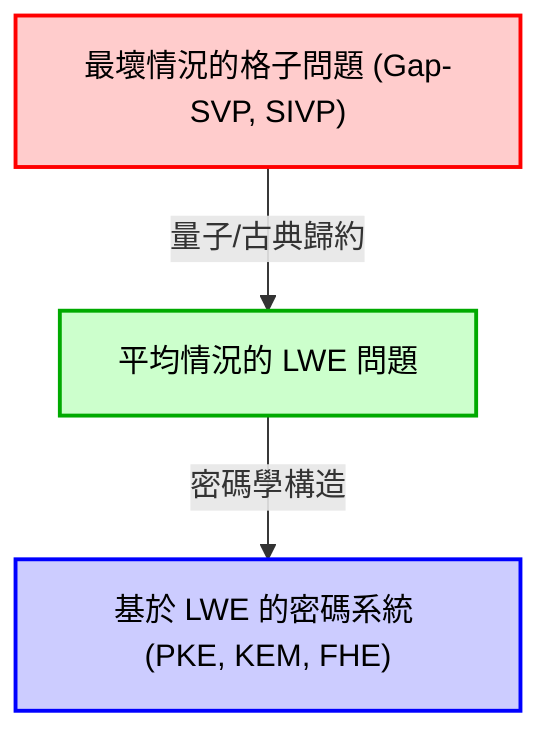
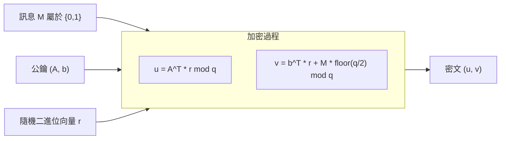
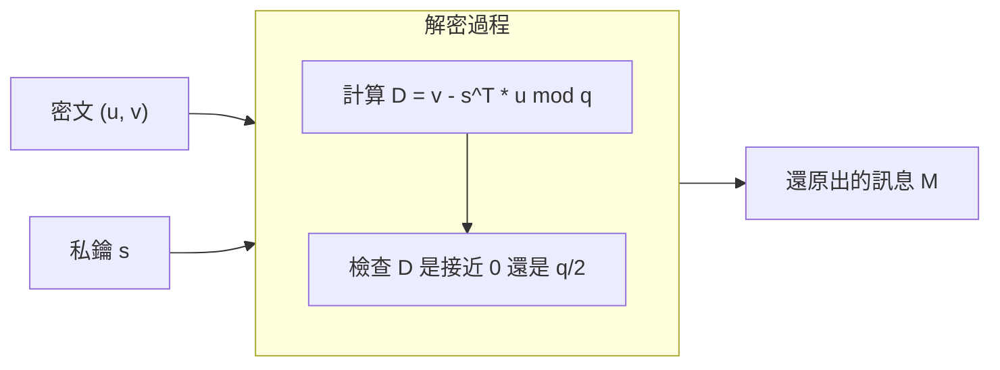

# 1. 導入：後量子密碼學（PQC）的黎明與格子密碼學的崛起

支撐現代社會數位基礎設施的是以 RSA 密碼和橢圓曲線密碼（ECC）為首的公鑰密碼技術。這些密碼系統是將安全性的基礎建立在「質因數分解問題」與「離散對數問題」等數學難題上，人們相信傳統古典電腦無法有效率地解決這些問題（需要指數級時間）。

然而，彼得·秀爾（Peter Shor）於1994年發表的「秀爾演算法（Shor's algorithm）」在密碼學界引發了震撼。該演算法在數學上證明了，一旦大規模的量子電腦問世，就能在多項式時間內解決質因數分解問題與離散對數問題。這意味著目前被廣泛使用的公鑰密碼學，在未來將完全可能被破解。

為了對抗這種「量子威脅（Quantum Threat）」，迫切需要研究即使使用量子電腦也難以破解的新型密碼系統。這就是被稱為「後量子密碼學（Post-Quantum Cryptography: PQC）」或「抗量子計算密碼學」的領域。

PQC 有幾個有力的候選方案。包括基於雜湊的密碼學、基於編碼的密碼學、多變數多項式密碼學以及同源密碼學等，但其中目前最受矚目，且處於 NIST（美國國家標準暨技術研究院）PQC 標準化流程核心的，就是「格子密碼學（Lattice-based cryptography）」。與其他方法相比，格子密碼學具有極快的加密和解密處理速度，並具備一個在密碼理論中極為強大的安全性證明：將「最壞情況複雜度（Worst-case complexity）」歸約至「平均情況複雜度（Average-case complexity）」。

本文將從作為格子密碼學基礎的「格子（Lattice）」的數學定義出發，深入淺出地解說格子上的困難問題，如 SVP（最短向量問題）和 CVP（最近點向量問題），以及可說是現代格子密碼學心臟的「LWE 問題（Learning With Errors，容錯學習問題）」。文中將結合數學公式、幾何直觀，以及具體的數值範例來進行徹底且深入的解說。

# 2. 格子（Lattice）的數學定義與幾何直觀

## 2.1 向量空間與格子
在數學中，「格子（Lattice）」是指在 $n$ 維實數向量空間 $\mathbb{R}^n$ 內，有規則地排列的離散點的集合。雖然它與線性代數中學到的向量空間（Vector Space）相似，但有著決定性的差異。向量空間是由基底向量以「實數係數」的線性組合所表示的連續空間，而格子則是由基底向量以「整數係數」的線性組合所表示的離散空間。

讓我們給出數學上嚴格的定義。考慮在 $m$ 維實數向量空間 $\mathbb{R}^m$ 中的 $n$ 個（$n \le m$）線性獨立的向量 $\mathbf{b}_1, \mathbf{b}_2, \dots, \mathbf{b}_n$。將這些向量作為行向量構成的矩陣設為 $B = [\mathbf{b}_1, \mathbf{b}_2, \dots, \mathbf{b}_n] \in \mathbb{R}^{m \times n}$。我們將這個 $B$ 稱為格子的「基底（Basis）」。

由這個基底 $B$ 所生成的格子 $\mathcal{L}(B)$ 定義如下：

$$
\mathcal{L}(B) = \left\{ \sum_{i=1}^{n} x_i \mathbf{b}_i \mathrel{\bigg|} x_i \in \mathbb{Z} \right\} = \{ B \mathbf{x} \mid \mathbf{x} \in \mathbb{Z}^n \}
$$

這裡的重點在於，係數 $x_i$ 僅限於整數 $\mathbb{Z}$，而非實數 $\mathbb{R}$。這使得空間內形成的不是無數連續的點，而是像等間距排列的十字路口般的「離散點的集合」。

## 2.2 幾何直觀
讓我們以二維平面 $\mathbb{R}^2$ 為例來思考。如果選擇基底向量為 $\mathbf{b}_1 = \begin{pmatrix} 1 \\ 0 \end{pmatrix}$ 與 $\mathbf{b}_2 = \begin{pmatrix} 0 \\ 1 \end{pmatrix}$，由它們生成的格子，將會是座標平面上所有整數座標 $(x, y) \in \mathbb{Z}^2$ 的集合。這是最簡單的「正方格子」。

然而，格子並不總是正交的。例如，如果我們考慮基底 $\mathbf{b}_1 = \begin{pmatrix} 2 \\ 1 \end{pmatrix}$ 與 $\mathbf{b}_2 = \begin{pmatrix} 1 \\ 3 \end{pmatrix}$，所生成的點將會像傾斜扭曲的網格交點。

## 2.3 基底的非唯一性與么模變換
這裡有一個攸關格子密碼學安全性根本的重要性質。那就是「能生成相同格子的基底有無數個」。

例如，前面提到的由基底 $\mathbf{b}_1 = (1, 0)^T, \mathbf{b}_2 = (0, 1)^T$ 生成的 $\mathbb{Z}^2$ 格子，如果使用 $\mathbf{b}'_1 = (1, 1)^T, \mathbf{b}'_2 = (2, 3)^T$ 這個基底，也會生成完全相同的格子 $\mathbb{Z}^2$。

某個基底 $B$ 和另一個基底 $B'$ 能生成相同格子的充分必要條件是：存在一個元素均為整數的矩陣 $U \in \mathbb{Z}^{n \times n}$，其行列式為 $\det(U) = \pm 1$，並且可以表示為：
$$ B' = B U $$
這樣的矩陣 $U$ 被稱為「么模矩陣（Unimodular matrix）」。

在密碼學應用上的基本概念是：將「好的基底（接近正交、由較短向量組成的基底）」作為私鑰，並將「壞的基底（互相極度斜交、由非常長的向量組成的基底）」作為公鑰。隨著維度的增加，要透過計算從壞的基底求出好的基底將會變得非常困難。這就是格子密碼學的基本直觀。

# 3. 格子中的計算困難問題

格子密碼學的安全性仰賴於解決格子上特定數學問題的困難度。在這裡，我們介紹最基本且最著名的兩個問題。

## 3.1 最短向量問題（Shortest Vector Problem: SVP）
SVP 是格子理論中最經典且著名的問題。

**定義（SVP）：**
給定任意格子基底 $B$，在該格子 $\mathcal{L}(B)$ 所屬的非零向量中，找出歐幾里得範數（長度）最小的向量 $\mathbf{v}$。

用數學公式表示，就是求出使得 $\min_{\mathbf{v} \in \mathcal{L}(B) \setminus \{\mathbf{0}\}} \| \mathbf{v} \|$ 成立的 $\mathbf{v}$ 的問題。這個最小的長度記為 $\lambda_1(\mathcal{L})$，被稱為「格子的第一連續最小值（First successive minimum）」。

如果是在二維或三維的低維度空間，只要畫個圖就能用肉眼找到最短的向量。或者，也可以使用高斯（Gauss）的格子基底歸約演算法等來有效率地解決。然而，當維度 $n$ 達到數百至數千這類高維度時，已知嚴格解出 SVP 是 NP 困難的。

在現實的密碼學中，使用的是尋找「近似較短向量」的近似 SVP（$\gamma$-SVP），而不是嚴格的最短向量。當近似係數 $\gamma$ 為多項式大小時，該問題仍然被認為是非常困難的。

## 3.2 最近點向量問題（Closest Vector Problem: CVP）
CVP 也是格子密碼學中極為重要的問題。

**定義（CVP）：**
給定任意格子基底 $B$ 以及空間內任意的目標向量 $\mathbf{t} \in \mathbb{R}^m$（不一定是格子點），找出所有格子點中距離 $\mathbf{t}$ 最近的格子點 $\mathbf{v} \in \mathcal{L}(B)$。

用數學公式表示，就是尋找使得 $\min_{\mathbf{v} \in \mathcal{L}(B)} \| \mathbf{v} - \mathbf{t} \|$ 成立的格子點 $\mathbf{v}$ 的問題。

與 SVP 一樣，CVP 在高維度中也是 NP 困難的。從密碼學應用的角度來看，稍後將提到的 LWE 問題，與這個 CVP 的特殊變體（Bounded Distance Decoding: BDD，有界距離解碼）有著密切的關係。

## 3.3 為什麼高維度時會解不出來？（LLL 與 BKZ 的極限）
作為解決高維度格子問題的著名演算法，有 LLL 演算法（Lenstra-Lenstra-Lovász algorithm）。LLL 演算法可以在多項式時間內運作，並將格子基底在某種程度上歸約（Reduction）為「好的基底」。然而，LLL 演算法所能找到的最短向量，其長度相對於真正的最短向量有一個呈指數級（$2^{\mathcal{O}(n)}$）增長的近似係數，因此並不足以破解密碼的安全性。

如果使用對 LLL 進行改良的 BKZ（Block Korkine-Zolotarev）演算法等更強大的基底歸約演算法，就能找到更短的向量，但其計算量會相對於區塊大小（Block size）呈指數級增長。在格子密碼學中，正是透過估算這個 BKZ 演算法的執行時間來決定安全的參數（例如維度 $n$ 的大小等）。在目前 PQC 的標準參數中，維度 $n$ 被設定為 500 到 1000 以上的值，據說即使使用超級電腦或未來的量子電腦，破解所需的時間也會超過宇宙的年齡。

# 4. LWE 問題（Learning With Errors）的數學形式化

現代大部分的格子密碼學都基於 2005 年由 Oded Regev 所提出的「LWE 問題（Learning With Errors，容錯學習問題）」。LWE 問題的絕妙之處在於其形式化的簡單性，以及擁有「將最壞情況複雜度歸約為平均情況複雜度」這項強大的數學證明。

## 4.1 無雜訊的線性方程組
為了理解 LWE 問題，首先讓我們先考慮一個沒有雜訊的簡單線性方程組。
假設有一個未知的秘密向量 $\mathbf{s} \in \mathbb{Z}_q^n$（各個分量為 $0$ 到 $q-1$ 的整數）。這裡我們假設 $q$ 是質數。

隨機選取係數向量 $\mathbf{a}_1, \mathbf{a}_2, \dots \in \mathbb{Z}_q^n$，並計算與秘密向量 $\mathbf{s}$ 的內積（對 $q$ 取模）：
$b_1 = \langle \mathbf{a}_1, \mathbf{s} \rangle \pmod q$
$b_2 = \langle \mathbf{a}_2, \mathbf{s} \rangle \pmod q$
$\vdots$

只要給定足夠數量（$n$ 個以上）的 $(\mathbf{a}_i, b_i)$ 數對，我們就可以利用線性代數中的「高斯消去法（Gaussian elimination）」，輕鬆地還原出秘密向量 $\mathbf{s}$。這是一個在多項式時間內可以輕易解出的問題。

## 4.2 LWE 問題的定義：加入雜訊
那麼，如果在這個問題中加入微小的「雜訊（誤差）」，會發生什麼事呢？
這就是 LWE 問題的本質。

對未知的秘密向量 $\mathbf{s} \in \mathbb{Z}_q^n$，在各個方程式的結果中加入微小的誤差 $e_i \in \mathbb{Z}_q$：
$b_i = \langle \mathbf{a}_i, \mathbf{s} \rangle + e_i \pmod q$

這裡的 $e_i$ 是一個平均值為 0、標準差相對較小（例如從常態分佈那樣的離散高斯分佈中選取）的微小整數值。
給定的資訊是隨機向量 $\mathbf{a}_i$ 與加上誤差後計算出的 $b_i$ 所構成的數對列表：
$( \mathbf{a}_1, b_1 ), ( \mathbf{a}_2, b_2 ), \dots, ( \mathbf{a}_m, b_m )$

用矩陣來表示會非常簡潔：
使用隨機矩陣 $A \in \mathbb{Z}_q^{m \times n}$、秘密向量 $\mathbf{s} \in \mathbb{Z}_q^n$、誤差向量 $\mathbf{e} \in \mathbb{Z}_q^m$，可以寫成：
$$ \mathbf{b} = A \mathbf{s} + \mathbf{e} \pmod q $$
我們只會被給予 $A$ 和 $\mathbf{b}$。從中求出 $\mathbf{s}$ 的問題就是「搜尋 LWE 問題（Search LWE problem）」。

因為加入了誤差 $e_i$，如果試圖使用高斯消去法，在方程式加減的過程中誤差會呈指數級放大，最終將無法推導出正確的答案。乍看之下這只是一個簡單的線性方程組，但僅僅因為加入了這個微小的雜訊，問題的難度就躍升至 NP 困難的層級。

## 4.3 判定 LWE 問題（Decision LWE）
在密碼理論的證明中頻繁使用的，是搜尋 LWE 問題的變體——「判定 LWE 問題（Decision LWE problem）」。

判定 LWE 問題是指，給定一個從以下兩種分佈中取得樣本的列表時，判定它來自哪一種分佈的問題：
1. **LWE 分佈**：刻意計算出的 $(A, \mathbf{b} = A\mathbf{s} + \mathbf{e} \pmod q)$
2. **均勻隨機分佈**：由完全隨機選取的矩陣 $A$ 與向量 $\mathbf{u}$ 所構成的 $(A, \mathbf{u})$

令人驚訝的是，只要適當地選擇 LWE 問題的參數，從 LWE 分佈取得的數對，將與完全隨機資料的數對「在計算上不可區分（Computationally Indistinguishable）」。這個性質正是基於 LWE 的密碼能夠生成「與隨機數無法區分的密文」的根據。

## 4.4 從最壞情況複雜度到平均情況複雜度的歸約（Regev 定理）
Oded Regev 最大的貢獻，就是將這個 LWE 問題的困難度，在數學上與前述的格子問題（SVP 與 CVP）的困難度連結了起來。

他運用了量子歸約（Quantum reduction），證明了「如果存在能在平均情況下（對於隨機選取的 $A$ 和 $\mathbf{e}$）在多項式時間內解決 LWE 問題的演算法，那麼就存在能在多項式時間內解決任何格子在最壞情況下（最難的情況）的 Gap-SVP 的量子演算法」。（後來，Peikert 等人也提出了古典歸約的證明）。

這在密碼理論中是一個夢寐以求的性質。因為它消除了「密碼被破解，可能只是因為我們碰巧選到了弱的密鑰（平均情況中的一小部分）」這種疑慮，並提供了「如果能解決平均情況的 LWE，就能解決格子中所有最難的問題（因此 LWE 絕對是困難的）」這樣強大的保證。

# 5. 基於 LWE 的公鑰密碼系統（Regev 密碼）的建構

了解了 LWE 問題的困難度之後，我們來看看如何使用它進行加密和解密，也就是 Oded Regev 所提出的基本公鑰密碼系統。這裡將解說對 1 位元訊息 $M \in \{0, 1\}$ 進行加密的最基本機制。

## 5.1 金鑰生成（Key Generation）
1. 作為系統參數，決定模數質數 $q$、維度 $n$、方程式數量 $m$（$m > n \log q$）。
2. 隨機選取向量 $\mathbf{s} \in \mathbb{Z}_q^n$ 作為私鑰。
3. 生成隨機矩陣 $A \in \mathbb{Z}_q^{m \times n}$。
4. 從離散高斯分佈等誤差分佈中選取微小的誤差向量 $\mathbf{e} \in \mathbb{Z}_q^m$。
5. 計算向量 $\mathbf{b} = A \mathbf{s} + \mathbf{e} \pmod q$。
6. 公鑰（Public Key）為 $(A, \mathbf{b})$。
7. 私鑰（Secret Key）為 $\mathbf{s}$。

公鑰本身簡直就是「LWE 問題的實例」。由於從公鑰 $(A, \mathbf{b})$ 求出私鑰 $\mathbf{s}$ 等同於解決搜尋 LWE 問題，因此保證了其安全性。

## 5.2 加密（Encryption）
愛麗絲使用鮑伯的公鑰 $(A, \mathbf{b})$，對 1 位元訊息 $M \in \{0, 1\}$ 進行加密。

1. 隨機選取一個二進位向量（各分量為 0 或 1）$\mathbf{r} \in \{0, 1\}^m$。
2. 計算向量 $\mathbf{u} = A^T \mathbf{r} \pmod q$，作為密文的前半部。（$A^T$ 是 $A$ 的轉置矩陣。也就是說，這是在將 $A$ 的列中與 $\mathbf{r}$ 分量為 1 對應的那些列加總起來）。
3. 計算純量 $v = \mathbf{b}^T \mathbf{r} + M \cdot \lfloor \frac{q}{2} \rfloor \pmod q$，作為密文的後半部。
   （如果訊息 $M$ 為 0，則不加任何東西；如果為 1，則加上正好是 $q$ 一半的值 $\lfloor \frac{q}{2} \rfloor$）。
4. 密文（Ciphertext）為 $(\mathbf{u}, v)$。

加密直觀上的意義，是針對公鑰的矩陣 $A$ 和向量 $\mathbf{b}$ 取「隨機子集的和」。由於判定 LWE 問題的困難度，這個密文 $(\mathbf{u}, v)$ 看起來將與完全隨機的向量和均勻隨機數無法區分（語意安全性：Semantic Security）。

## 5.3 解密（Decryption）
鮑伯使用私鑰 $\mathbf{s}$ 來解密密文 $(\mathbf{u}, v)$。

1. 計算以下的值： $D = v - \mathbf{s}^T \mathbf{u} \pmod q$
2. 如果計算結果接近 $0$，則輸出 $M=0$；如果接近 $\lfloor \frac{q}{2} \rfloor$，則輸出 $M=1$。

為什麼這樣就能解密呢？讓我們在數學上展開來看看。
請回憶一下 $\mathbf{b} = A \mathbf{s} + \mathbf{e}$。

$$
\begin{aligned}
v - \mathbf{s}^T \mathbf{u} &= (\mathbf{b}^T \mathbf{r} + M \cdot \lfloor \frac{q}{2} \rfloor) - \mathbf{s}^T (A^T \mathbf{r}) \\
&= ((A \mathbf{s} + \mathbf{e})^T \mathbf{r} + M \cdot \lfloor \frac{q}{2} \rfloor) - \mathbf{s}^T A^T \mathbf{r} \\
&= (\mathbf{s}^T A^T \mathbf{r} + \mathbf{e}^T \mathbf{r} + M \cdot \lfloor \frac{q}{2} \rfloor) - \mathbf{s}^T A^T \mathbf{r} \\
&= \mathbf{e}^T \mathbf{r} + M \cdot \lfloor \frac{q}{2} \rfloor \pmod q
\end{aligned}
$$

在這裡，公式中的 $\mathbf{s}^T A^T \mathbf{r}$ 被完美地抵消掉了！
剩下的部分是 $\mathbf{e}^T \mathbf{r} + M \cdot \lfloor \frac{q}{2} \rfloor$。

$\mathbf{e}$ 是分量非常小的雜訊向量，而 $\mathbf{r}$ 是分量為 0 或 1 的二進位向量。因此，它們的內積 $\mathbf{e}^T \mathbf{r}$ 也會（只要參數設定得當）保持在一個相對較小的值。

- 如果 $M=0$，結果會是 $\mathbf{e}^T \mathbf{r}$，這是一個接近 $0$ 的小數值。
- 如果 $M=1$，結果會是 $\mathbf{e}^T \mathbf{r} + \lfloor \frac{q}{2} \rfloor$，這會位於 $q$ 的一半即 $\lfloor \frac{q}{2} \rfloor$ 附近。

只要參數的設計能讓誤差 $\mathbf{e}^T \mathbf{r}$ 的絕對值收斂在 $\frac{q}{4}$ 以內，鮑伯只需要看計算結果是比較接近 $0$ 還是 $\lfloor \frac{q}{2} \rfloor$，就能正確地判定（解密）訊息 $M$。這就是基於 LWE 的密碼能夠運作的美妙機制。

# 6. 使用具體數值的 LWE 密碼玩具範例

只看一堆數學公式可能很難有真實感，所以我們實際設定極小的數值參數，來追蹤一次從加密到解密的計算過程。
（※在現實的密碼系統中，為了確保安全性，$n$ 會設定在 500 以上，$q$ 則是使用數千以上的值）

**【參數設定】**
- 模數 $q = 17$ （質數。因此值會落在 $0$ 到 $16$ 的範圍內）
- 維度 $n = 2$
- 方程式數量 $m = 4$
- 假設要加密的訊息為 $M = 1$。
- 訊息的位移量：$\lfloor \frac{q}{2} \rfloor = \lfloor \frac{17}{2} \rfloor = 8$

**【1. 金鑰生成階段】**
鮑伯隨機選取私鑰 $\mathbf{s}$、矩陣 $A$ 以及誤差向量 $\mathbf{e}$。
$$ \mathbf{s} = \begin{pmatrix} 3 \\ 4 \end{pmatrix} \in \mathbb{Z}_{17}^2 $$
$$ A = \begin{pmatrix} 2 & 15 \\ 1 & 8 \\ 14 & 5 \\ 9 & 10 \end{pmatrix} \in \mathbb{Z}_{17}^{4 \times 2} $$
$$ \mathbf{e} = \begin{pmatrix} 1 \\ -1 \\ 0 \\ 2 \end{pmatrix} \equiv \begin{pmatrix} 1 \\ 16 \\ 0 \\ 2 \end{pmatrix} \pmod{17} $$

接著計算公鑰 $\mathbf{b}$。
$$ A \mathbf{s} = \begin{pmatrix} 2 & 15 \\ 1 & 8 \\ 14 & 5 \\ 9 & 10 \end{pmatrix} \begin{pmatrix} 3 \\ 4 \end{pmatrix} = \begin{pmatrix} 2\times 3 + 15\times 4 \\ 1\times 3 + 8\times 4 \\ 14\times 3 + 5\times 4 \\ 9\times 3 + 10\times 4 \end{pmatrix} = \begin{pmatrix} 6 + 60 \\ 3 + 32 \\ 42 + 20 \\ 27 + 40 \end{pmatrix} = \begin{pmatrix} 66 \\ 35 \\ 62 \\ 67 \end{pmatrix} $$
將其對 17 取模。($66 = 17 \times 3 + 15$ 等)
$$ A \mathbf{s} \pmod{17} = \begin{pmatrix} 15 \\ 1 \\ 11 \\ 16 \end{pmatrix} $$
加上誤差向量 $\mathbf{e}$。
$$ \mathbf{b} = A \mathbf{s} + \mathbf{e} = \begin{pmatrix} 15 \\ 1 \\ 11 \\ 16 \end{pmatrix} + \begin{pmatrix} 1 \\ 16 \\ 0 \\ 2 \end{pmatrix} = \begin{pmatrix} 16 \\ 17 \\ 11 \\ 18 \end{pmatrix} \equiv \begin{pmatrix} 16 \\ 0 \\ 11 \\ 1 \end{pmatrix} \pmod{17} $$

公鑰為 $A$ 與 $\mathbf{b} = (16, 0, 11, 1)^T$。

**【2. 加密階段】**
愛麗絲加密訊息 $M = 1$。
選取一個隨機向量 $\mathbf{r}$。這裡假設 $\mathbf{r} = (1, 0, 1, 0)^T$。

計算 $\mathbf{u}$。
$$ \mathbf{u} = A^T \mathbf{r} = \begin{pmatrix} 2 & 1 & 14 & 9 \\ 15 & 8 & 5 & 10 \end{pmatrix} \begin{pmatrix} 1 \\ 0 \\ 1 \\ 0 \end{pmatrix} = \begin{pmatrix} 2 \times 1 + 14 \times 1 \\ 15 \times 1 + 5 \times 1 \end{pmatrix} = \begin{pmatrix} 16 \\ 20 \end{pmatrix} \equiv \begin{pmatrix} 16 \\ 3 \end{pmatrix} \pmod{17} $$

計算 $v$。
$$ \mathbf{b}^T \mathbf{r} = (16, 0, 11, 1) \begin{pmatrix} 1 \\ 0 \\ 1 \\ 0 \end{pmatrix} = 16 \times 1 + 11 \times 1 = 27 \equiv 10 \pmod{17} $$
加上對應於訊息 $M=1$ 的值 $\lfloor 17/2 \rfloor = 8$。
$$ v = \mathbf{b}^T \mathbf{r} + M \cdot 8 = 10 + 1 \times 8 = 18 \equiv 1 \pmod{17} $$

愛麗絲將密文 $(\mathbf{u}, v) = \left( \begin{pmatrix} 16 \\ 3 \end{pmatrix}, 1 \right)$ 傳送給鮑伯。

**【3. 解密階段】**
收到密文的鮑伯，使用私鑰 $\mathbf{s} = (3, 4)^T$ 進行解密。
計算解密處理公式： $D = v - \mathbf{s}^T \mathbf{u} \pmod{17}$。

$$ \mathbf{s}^T \mathbf{u} = (3, 4) \begin{pmatrix} 16 \\ 3 \end{pmatrix} = 3 \times 16 + 4 \times 3 = 48 + 12 = 60 \equiv 9 \pmod{17} $$
$$ D = v - \mathbf{s}^T \mathbf{u} = 1 - 9 = -8 \pmod{17} $$

在這裡，在模 17 的世界中，$-8$ 等於 $9$（$-8 + 17 = 9$）。
判斷得到的值 $D = 9$ 是比較接近 $0$ 還是 $8$（$\lfloor 17/2 \rfloor$）。
因為 $9$ 明顯比接近 $0$ 更接近 $8$，所以鮑伯正確地還原出了 $M = 1$！

為什麼會變成 $9$ 呢？讓我們回想一下先前的證明。
誤差部分為 $\mathbf{e}^T \mathbf{r} = (1, -1, 0, 2) (1, 0, 1, 0)^T = 1 \times 1 + 0 \times 1 = 1$。
因此，計算結果會是 $\mathbf{e}^T \mathbf{r} + M \cdot 8 = 1 + 8 = 9$，證實了算出來的值符合理論預期。

# 7. 邁向實用化的演進：Ring-LWE 與 Module-LWE

我們到目前為止所說明的標準 LWE 問題（Standard LWE），雖然擁有非常強大的安全性證明，但在實際應用上卻有一個致命的弱點。那就是「金鑰的容量會變得十分巨大」以及「計算成本過高」。

在 Standard LWE 中，公鑰包含了一個巨大的矩陣 $A \in \mathbb{Z}_q^{m \times n}$。當參數 $n$ 達到數百至數千時，這個矩陣的容量會達到數百萬位元組（MB）之多，要在網際網路通訊協定（如 TLS）中每次傳送和接收的話，負擔會太重。此外，矩陣與向量的乘法運算會花費 $\mathcal{O}(n^2)$ 的計算量。

為了解決這個問題而導入的，是將名為多項式環（Polynomial rings）的代數結構結合到格子上的「Ring-LWE（RLWE）」以及「Module-LWE（MLWE）」。

## 7.1 Ring-LWE 的直觀
在 Ring-LWE 中，我們將向量與矩陣替換成多項式環 $\mathcal{R}_q = \mathbb{Z}_q[X]/(X^n + 1)$ 上的元素（多項式）。（這裡的 $n$ 會選擇 2 的次方數）。

相對於 Standard LWE 的公鑰是矩陣 $A$，Ring-LWE 則是使用單一的多項式 $a(x)$。私鑰 $s(x)$ 與誤差 $e(x)$ 也都會變成多項式。
方程式會變成如下所示：
$$ b(x) = a(x) \cdot s(x) + e(x) \pmod q $$

因為這是多項式的乘法，所以可以透過使用類似於快速傅立葉變換（FFT）的「數論轉換（Number Theoretic Transform: NTT）」，將計算量大幅縮減至 $\mathcal{O}(n \log n)$。此外，因為公鑰的容量也從矩陣縮減成了單一多項式，所以資料大小減少到了 $\mathcal{O}(n)$。這在通訊頻寬上帶來了壓倒性的優勢。

從數學角度來看，Ring-LWE 解決的不再是一般的格子，而是歸約到具有特殊對稱性，被稱為「理想格子（Ideal Lattice）」上的問題。

## 7.2 Module-LWE 與 NIST 的標準化（Kyber / ML-KEM）
Ring-LWE 雖然效率很高，但卻也令人擔心理想格子特殊的代數結構會不會成為未來攻擊的突破口。因此，擷取 Standard LWE 的保守安全性以及 Ring-LWE 效率的「兩全其美」方案，就是「Module-LWE（MLWE）」。

在 Module-LWE 中，我們考慮的是以多項式為元素所構成的小型矩陣和向量。也就是說，處理的是環上的模組（Module，加群）。
目前，被 NIST 選定作為 PQC 金鑰交換演算法（KEM）標準的「CRYSTALS-Kyber」（標準化名稱：ML-KEM），正是建構在這個 Module-LWE 問題的困難度之上。

# 8. 為什麼對量子電腦是安全的？

最後，我們來探討一個核心問題：「為什麼格子密碼學被認為即使使用量子電腦也無法破解？」

量子電腦用來破解 RSA 密碼與橢圓曲線密碼的秀爾演算法，本質上是一個用於解決「隱含子群問題（Hidden Subgroup Problem: HSP）」的演算法。RSA 或 ECC 背後的數學結構（有限阿貝爾群）具有週期性，透過使用名為量子傅立葉變換（QFT）的量子演算法特有操作，可以一次萃取出這個週期（隱含的子群）。

然而，格子問題卻截然不同。格子雖然也有週期性，但在 SVP 或 CVP 中要求出的是「最短距離」或「消除雜訊」這種幾何學上的非線性性質。即使直接套用像秀爾演算法這種「阿貝爾群上的量子傅立葉變換」，也無法有效率地萃取出對解答格子問題有用的資訊。截至目前為止，尚未發現能在多項式時間內解決 SVP 或 LWE 的量子演算法，學界普遍相信，即使擁有量子電腦的平行計算能力，也只有類似於暴力破解的搜尋方式（透過葛羅夫演算法（Grover's algorithm）達成的平方根加速程度）才是有效的手段。

# 9. 總結

本文中，我們從格子的幾何定義開始，詳細地解說了格子密碼學的數學直觀，包括 LWE 問題的形式化，一直到公鑰密碼系統的建構。

1. **格子（Lattice）** 是一個由基底向量以整數係數進行線性組合所表示的離散空間，在高維度下，要找到接近正交的「好基底」（SVP）將會變得困難。
2. **LWE 問題（Learning With Errors）** 是一個求解帶有雜訊的線性方程組的問題，因為這與格子在最壞情況下問題的困難度息息相關，所以能提供強大的安全性基礎。
3. 透過利用 LWE 問題，藉由刻意加入或消除雜訊的精妙機制，實現了加密與解密（**Regev 密碼**）。
4. 在現實的協定中，為了提升通訊效率和計算速度，採用了使用多項式環的 **Ring-LWE** 與 **Module-LWE**，並成為了 NIST 標準 **ML-KEM** 的基礎。

在量子電腦帶來前所未有的計算典範轉移之際，誕生於古典線性代數與數論深淵之中的「格子密碼學」，將肩負起未來網際網路安全基礎的重任，這是一件非常浪漫的事情。格子密碼學基礎的數學絕非過於艱澀難懂，只要具備線性代數與機率的基礎知識，就能充分理解其優美的結構。希望本文能幫助您理解作為 PQC 核心的格子密碼學。
