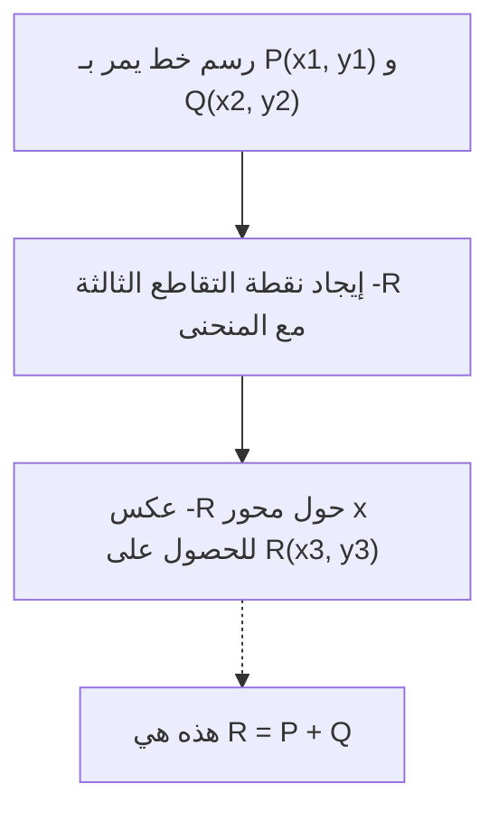
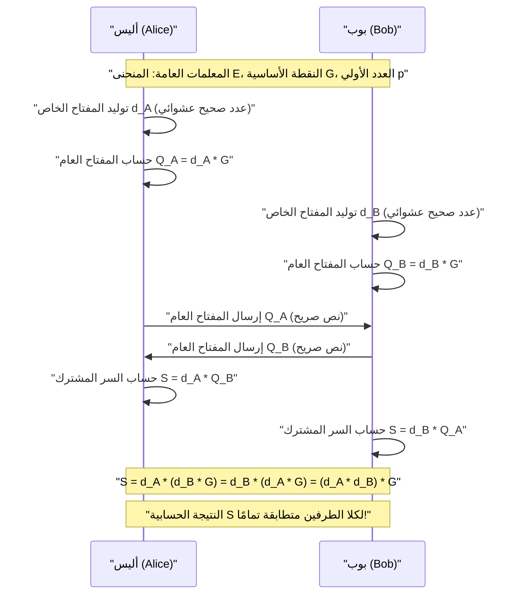
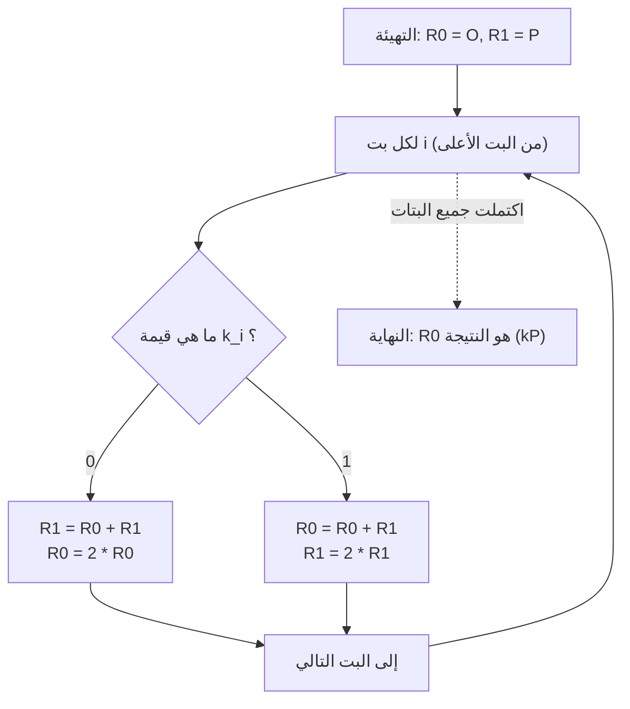

# الأسس الرياضية لتشفير المنحنيات الإهليلجية (ECC) وتنفيذه بلغة C++

في تقنيات التشفير الحديثة، يلعب **تشفير المنحنيات الإهليلجية (Elliptic Curve Cryptography: ECC)** دورًا بالغ الأهمية. ليس من المبالغة القول إن أساس الثقة في مجتمعنا الرقمي الحديث يعتمد على ECC، بدءًا من اتصالات الإنترنت اليومية (HTTPS/TLS)، والجيوب الآمنة (Secure Enclaves) في الهواتف الذكية، ومصادقة الخوادم عبر SSH، والمصادقة بدون كلمات مرور مثل FIDO، وصولاً إلى الأصول المشفرة مثل بيتكوين وإيثريوم.

في هذا المقال، سنشرح بشكل شامل وكثيف كيف يعمل تشفير المنحنيات الإهليلجية، بدءًا من النظرية الرياضية الجميلة والمعقدة التي تكمن وراءه (الهندسة الجبرية على الحقول المنتهية)، مرورًا بطريقة تنفيذه الفعلي باستخدام لغة C++، وصولاً إلى تقنيات البرمجة الآمنة لمنع هجمات القنوات الجانبية (مثل هجمات التوقيت).

---

## 1. لماذا تشفير المنحنيات الإهليلجية؟ (مقارنة مع RSA)

لطالما كان **تشفير RSA** هو المرادف لتشفير المفتاح العام. يعتمد تشفير RSA في أمانه على "صعوبة تحليل الأعداد المركبة الضخمة إلى عواملها الأولية". ومع ذلك، مع تحسن القوة الحسابية لأجهزة الكمبيوتر، أصبح من الضروري زيادة طول مفتاح RSA (عدد بتات المعامل) باستمرار للحفاظ على الأمان. حاليًا، يُوصى باستخدام مفاتيح بطول 2048 بت كحد أدنى، ولأمان أكبر يُفضل استخدام 3072 بت أو 4096 بت.

في المقابل، يعتمد تشفير المنحنيات الإهليلجية (ECC) على صعوبة رياضية مختلفة وهي **"مشكلة اللوغاريتم المتقطع على المنحنيات الإهليلجية (ECDLP)"**. حتى الآن، لم يتم اكتشاف خوارزمية فعالة (مثل خوارزميات الوقت شبه الأسّي) لحل ECDLP، وحتى أكثر طرق الهجوم الفعالة المعروفة تتطلب وقتًا أسّيًا.

بسبب هذه الخاصية، يتمتع ECC بميزة حاسمة وهي **القدرة على تحقيق مستوى أمان مكافئ لـ RSA باستخدام مفاتيح أقصر بكثير**.

| قوة الأمان (بت) | طول مفتاح RSA (بت) | طول مفتاح ECC (بت) | نسبة طول المفتاح |
| :---: | :---: | :---: | :---: |
| 80 | 1024 | 160 | 1:6 |
| 112 | 2048 | 224 | 1:9 |
| 128 | 3072 | 256 | 1:12 |
| 192 | 7680 | 384 | 1:20 |
| 256 | 15360 | 512 | 1:30 |

كما يوضح الجدول أعلاه، للحصول على قوة أمان تبلغ 128 بت (القوة القياسية الحالية)، يتطلب RSA مفتاحًا بطول 3072 بت، بينما يكفي 256 بت فقط في حالة ECC. هذا يتيح تقليل العمليات الحسابية، وخفض استهلاك الذاكرة، وتوفير النطاق الترددي للشبكة، مما يمنحه تفوقًا ساحقًا خاصة في بيئات إنترنت الأشياء (IoT) والبطاقات الذكية ذات الموارد المحدودة.

---

## 2. التحضير الرياضي: نظرية الزمر وعالم الحقول المنتهية

لفهم تشفير المنحنيات الإهليلجية حقًا، من الضروري استيعاب المفاهيم الأساسية في الجبر المجرد (نظرية الزمر ونظرية الحقول). نلخص هنا المعرفة الأساسية اللازمة لبناء ECC.

### 2.1. الزمرة (Group) والزمرة الأبيلية
**الزمرة (Group)** هي مجموعة $G$ مقترنة بعملية ثنائية (سنفترض هنا أنها الجمع $+$) يُرمز لها بـ $(G, +)$، والتي تحقق البديهيات الأربع التالية:

1. **الانغلاق (Closure)**: لأي $a, b \in G$، يكون $a + b \in G$.
2. **الدمج (Associativity)**: لأي $a, b \in G$، يتحقق $(a + b) + c = a + (b + c)$.
3. **وجود العنصر المحايد (Identity element)**: يوجد عنصر $e \in G$ بحيث لأي $a \in G$ يكون $a + e = e + a = a$. في حالة زمرة الجمع، يُشار إلى هذا العنصر المحايد عادةً بـ $0$ أو $\mathcal{O}$.
4. **وجود المعكوس (Inverse element)**: لأي $a \in G$، يوجد عنصر $b \in G$ بحيث يكون $a + b = b + a = e$. يُشار إلى هذا الـ $b$ بـ $-a$.

بالإضافة إلى ذلك، إذا كانت الزمرة تحقق الشرط التالي (أي أن تغيير ترتيب العملية لا يغير النتيجة)، فإنها تُسمى **زمرة أبيلية (Abelian Group)** أو زمرة إبدالية.

5. **الإبدال (Commutativity)**: لأي $a, b \in G$، يتحقق $a + b = b + a$.

تشكل مجموعة النقاط على المنحنى الإهليلجي هذه **الزمرة الأبيلية** من خلال تعريف قاعدة جمع محددة.

### 2.2. الحقل المنتهي (Finite Field)
في نظرية التشفير، لا نستخدم حقولاً مستمرة ذات عناصر لا نهائية مثل الأعداد الحقيقية أو المركبة، بل نستخدم **الحقول المنتهية (Finite Fields)** أو حقول غالوا (Galois Fields) التي تحتوي على عدد محدود من العناصر.

الحقل المنتهي الأساسي هو **الحقل الأولي $\mathbb{F}_p$** باستخدام عدد أولي $p$. وهو عبارة عن مجموعة الأعداد الصحيحة $\{0, 1, 2, \dots, p-1\}$ مع تعريف العمليات الحسابية الأربع (الجمع، الطرح، الضرب، القسمة) باستخدام المعامل $p$ (الباقي من القسمة على $p$).

- **الجمع**: $(a + b) \pmod p$
- **الطرح**: $(a - b) \pmod p$
- **الضرب**: $(a \times b) \pmod p$
- **القسمة**: $a \times b^{-1} \pmod p$ (حيث $b^{-1}$ هو المعكوس الضربي لـ $b$ في المعامل $p$)

يعتبر حساب **المعكوس الضربي (Modular Multiplicative Inverse)** بالغ الأهمية في تنفيذ التشفير. لإيجاد $b^{-1}$ الذي يحقق $b \times b^{-1} \equiv 1 \pmod p$، تُستخدم أساسًا الخوارزميتان التاليتان:

1. **خوارزمية إقليدس الممتدة (Extended Euclidean Algorithm)**: سريعة، لكن في بعض التنفيذات يعتمد وقت المعالجة على قيم الإدخال، مما يشكل خطر التعرض لهجمات التوقيت.
2. **مبرهنة فيرما الصغرى (Fermat's Little Theorem)**: عندما يكون $p$ عددًا أوليًا و $b \neq 0$، يتحقق $b^{p-1} \equiv 1 \pmod p$. بقسمة الطرفين على $b$، نحصل على $b^{p-2} \equiv b^{-1} \pmod p$. أي أن حساب القوة $p-2$ لـ $b$ يعطينا المعكوس. نظرًا لسهولة تنفيذ عمليات الرفع للأس في وقت ثابت (Constant-Time)، يُفضل استخدام هذه الطريقة في تنفيذ التشفير.

---

## 3. معادلة المنحنى الإهليلجي والهندسة

### 3.1. شكل فايرشتراس القياسي
**المنحنى الإهليلجي (Elliptic Curve)** هو بشكل عام منحنى مستوٍ يُعرّف بالمعادلة التالية التي تُعرف بـ **شكل فايرشتراس القياسي (Weierstrass normal form)**:

$$ y^2 = x^3 + ax + b $$

حيث $a$ و $b$ ثوابت، ولضمان عدم احتواء المنحنى على نقاط شاذة (مثل التقاطعات الذاتية أو النقاط المدببة) أي ليكون منحنى أملس (smooth)، يُشترط ألا يكون **المميز (Discriminant) $\Delta$** التالي مساويًا للصفر:

$$ \Delta = -16(4a^3 + 27b^2) \neq 0 $$

نظرًا لأن المنحنيات ذات النقاط الشاذة تُضعف الأمان التشفيري، يتم دائمًا اختيار معاملات $a, b$ تحقق هذا الشرط.

### 3.2. نقطة في اللانهاية (Point at Infinity)
لجعل المنحنى الإهليلجي زمرة رياضية مكتملة، نُدخل نقطة افتراضية تُسمى **"نقطة في اللانهاية (Point at Infinity)"** بالإضافة إلى النقاط على المستوى. يُرمز لها بـ $\mathcal{O}$.

تُعرّف النقطة في اللانهاية $\mathcal{O}$ على أنها النقطة التي تتقاطع عندها جميع الخطوط الرأسية في اللانهاية. في نظرية الزمر، تعمل هذه النقطة $\mathcal{O}$ كـ **عنصر محايد في الجمع** (صفر).

أي أنه لأي نقطة $P$ على المنحنى، يتحقق ما يلي:
$$ P + \mathcal{O} = \mathcal{O} + P = P $$

كما أن المعكوس $-P$ للنقطة $P = (x, y)$ يُعرّف على أنه النقطة المتناظرة بالنسبة لمحور x وهي $(x, -y)$. وبالتالي:
$$ P + (-P) = \mathcal{O} $$

---

## 4. عمليات الزمرة على المنحنى الإهليلجي (جمع النقاط والمضاعفة)

العملية الأساسية في تشفير المنحنيات الإهليلجية هي **"الجمع (Addition)"** بين النقاط على المنحنى. وهذا يختلف عن الجمع العادي للأعداد الصحيحة، حيث يتم تعريفه بناءً على عمليات هندسية.

### 4.1. الجمع الهندسي (Tangent and Chord Method)
لإيجاد نقطة جديدة $R$ ($R = P + Q$) بجمع نقطتين مختلفتين $P$ و $Q$ على المنحنى، نتبع الخطوات التالية:

1. نرسم خطًا مستقيمًا (وترًا) يمر بالنقطتين $P$ و $Q$.
2. سيتقاطع هذا الخط دائمًا مع المنحنى الإهليلجي في نقطة ثالثة (سنسميها $-R$). (※بناءً على نظرية في الهندسة الجبرية)
3. النقطة الناتجة عن عكس $-R$ بشكل متناظر حول محور x (بعكس إشارة الإحداثي y) هي النقطة المطلوبة $R$.



### 4.2. مضاعفة النقطة (Point Doubling)
عند جمع النقطة $P$ مع نفسها ($P + P = 2P$)، لا يمكننا رسم خط يمر بنقطتين. في هذه الحالة، نرسم **مماس المنحنى (Tangent) عند النقطة $P$**.

1. نرسم المماس للمنحنى عند النقطة $P$.
2. يتقاطع هذا المماس مع المنحنى في نقطة أخرى $-R$.
3. النقطة المعكوسة متناظرًا حول محور x لنقطة التقاطع هي النقطة المطلوبة $R = 2P$.

### 4.3. المعادلات الجبرية للحساب
يتم تحويل العمليات الهندسية إلى معادلات جبرية يمكن للكمبيوتر حسابها.
تتم جميع العمليات **فوق الحقل المنتهي $\mathbb{F}_p$ (بالمعامل $p$)**.

لنفترض أن النقطة $P = (x_1, y_1)$ والنقطة $Q = (x_2, y_2)$.
ونقطة النتيجة هي $R = P + Q = (x_3, y_3)$.

ليكن ميل الخط $\lambda$ (لامدا).

**【الحالة 1: عندما $P \neq Q$ (جمع النقاط)】**
الميل $\lambda$ هو معدل التغير بين النقطتين.
$$ \lambda \equiv \frac{y_2 - y_1}{x_2 - x_1} \pmod p $$
$$ \lambda \equiv (y_2 - y_1) \cdot (x_2 - x_1)^{-1} \pmod p $$

باستخدام هذا $\lambda$، يمكن حساب $x_3, y_3$ كما يلي:
$$ x_3 \equiv \lambda^2 - x_1 - x_2 \pmod p $$
$$ y_3 \equiv \lambda(x_1 - x_3) - y_1 \pmod p $$

**【الحالة 2: عندما $P = Q$ (مضاعفة النقطة)】**
الميل $\lambda$ سيكون ميل المماس المحسوب بواسطة الاشتقاق. (نشتق المعادلة $y^2 = x^3 + ax + b$ ضمنيًا)
$$ 2y \cdot y' = 3x^2 + a \implies y' = \frac{3x^2 + a}{2y} $$
لذلك،
$$ \lambda \equiv (3x_1^2 + a) \cdot (2y_1)^{-1} \pmod p $$

صيغتا $x_3, y_3$ هما نفس صيغتي الجمع، ولكن بما أن $x_2 = x_1$ تصبحان كالتالي:
$$ x_3 \equiv \lambda^2 - 2x_1 \pmod p $$
$$ y_3 \equiv \lambda(x_1 - x_3) - y_1 \pmod p $$

> [!IMPORTANT]
> تتضمن هذه المعادلات **عمليات قسمة (حساب المعكوس النمطي)** مثل $(x_2 - x_1)^{-1}$ و $(2y_1)^{-1}$. نظرًا لأن تكلفة حساب المعكوس النمطي عالية جدًا، تُستخدم في التنفيذ الفعلي عادةً أنظمة الإحداثيات الإسقاطية مثل **"إحداثيات جاكوبي (Jacobian Coordinates)"** لتأخير عملية القسمة.

---

## 5. الضرب القياسي ومشكلة اللوغاريتم المتقطع على المنحنيات الإهليلجية (ECDLP)

العملية التي تتطلب أكبر قدر من الحسابات وتُشكل جوهر الأمان في تشفير المنحنيات الإهليلجية هي **الضرب القياسي (Scalar Multiplication)**.

### 5.1. ما هو الضرب القياسي
يُسمى جمع النقطة $P$ مع نفسها عدد $k$ من المرات بالضرب القياسي، ويُكتب $kP$.
$$ kP = \underbrace{P + P + \dots + P}_{k \text{ من المرات}} $$

حيث $k$ هو عدد صحيح كبير جدًا (مثلاً عدد صحيح من 256 بت).

### 5.2. مشكلة اللوغاريتم المتقطع على المنحنيات الإهليلجية (ECDLP)
يعتمد أمان تشفير المنحنيات الإهليلجية على صعوبة المشكلة التالية.

> **مشكلة اللوغاريتم المتقطع على المنحنيات الإهليلجية (Elliptic Curve Discrete Logarithm Problem: ECDLP)**
> عند إعطاء النقطة المعروفة $P$ (النقطة الأساسية) والنقطة المحسوبة $Q$، أوجد المُعامل القياسي $k$ الذي يحقق $Q = kP$.

حساب $Q$ من $k$ و $P$ (الاتجاه الأمامي) أمر سهل (وقت متعدد الحدود) باستخدام الخوارزمية الموضحة أدناه، لكن العكس (الاتجاه المعكس) لاستنتاج $k$ من $P$ و $Q$ أمر مستحيل عمليًا، حيث لا توجد طريقة فعالة لحله سوى البحث الشامل (دالة وحيدة الاتجاه).
في بروتوكولات التشفير، يتوافق **$k$ مع "المفتاح الخاص" و $Q$ مع "المفتاح العام"**.

### 5.3. خوارزمية المضاعفة والجمع (Double-and-Add)
عندما يكون $k$ رقمًا ضخمًا (مثال: $2^{256}$)، فإن جمع $P$ بشكل مباشر $k$ مرة لن ينتهي حتى لو انتهى عمر الكون. لذلك، لإجراء الضرب القياسي بسرعة، تُستخدم **طريقة المضاعفة والجمع (الطريقة الثنائية)**.

هذه هي النسخة الخاصة بالمنحنيات الإهليلجية من "طريقة التربيع المتكرر" المُستخدمة لحساب قوى الأعداد الصحيحة بسرعة. يتم تمثيل المُعامل $k$ بالنظام الثنائي، وتتم معالجته بدءًا من البت الأكثر أهمية (MSB).

1. تهيئة النقطة $R$ التي ستحتفظ بالنتيجة بـ $\mathcal{O}$.
2. من البت الأكثر أهمية في $k$ إلى البت الأقل أهمية، كرر ما يلي:
   - ضاعف $R$ (مضاعفة النقطة: $R = 2R$)
   - إذا كان البت الحالي `1`، أضف $P$ إلى $R$ (جمع النقاط: $R = R + P$)

بفضل هذه الخوارزمية، ينخفض التعقيد الحسابي بشكل كبير من $O(k)$ إلى $O(\log_2 k)$، مما يجعل الحساب ممكنًا في وقت واقعي (بأجزاء من الثانية).

---

## 6. تبادل مفاتيح ديفي-هيلمان على المنحنيات الإهليلجية (ECDH)

نشرح هنا آلية بروتوكول **تبادل مفاتيح ECDH (Elliptic Curve Diffie-Hellman)**، وهو التطبيق الأكثر تمثيلاً لـ ECC. ECDH هي آلية تتيح لأليس وبوب إنشاء ومشاركة مفتاح سري مشترك (مفتاح الجلسة) بأمان عبر قناة اتصال عرضة للتنصت (وهي جوهر عملية مصافحة TLS).

**【المعلمات المسبقة (معلمات المجال)】**
يتشارك الطرفان مسبقًا في المنحنى الإهليلجي المُستخدم $E$، العدد الأولي $p$، والنقطة الأساسية $G$. (على سبيل المثال، NIST P-256 أو secp256k1)



يمكن للمتنصت (إيف) اعتراض $G$ و $Q_A$ و $Q_B$ أثناء انتقالها عبر قناة الاتصال، ولكن نظرًا لصعوبة ECDLP، لا يمكن استنتاج المفتاح الخاص لأليس $d_A$ من $Q_A = d_A \cdot G$. علاوة على ذلك، فإن ضرب $Q_A$ في $Q_B$ لا ينتج المفتاح المشترك $S$، لذلك لا يستطيع المتنصت حساب $S$.

---

## 7. فخاخ التنفيذ: هجمات القنوات الجانبية وطرق الوقاية منها

حتى لو كانت خوارزمية التشفير مثالية نظريًا، فقد تنشأ نقاط ضعف أثناء عملية تحويلها إلى برنامج. هذا ما يُعرف بـ **"هجوم القناة الجانبية (Side-Channel Attack)"**.

### 7.1. هجوم التوقيت (Timing Attack)
دعونا نراجع خوارزمية المضاعفة والجمع المذكورة أعلاه.

```cpp
// الكود الزائف لـ Double-and-Add الضعيف
Point R = Point::Infinity;
for (int i = 255; i >= 0; i--) {
    R = PointDoubling(R);         // يتم تنفيذه دائمًا
    if (bit(k, i) == 1) {
        R = PointAddition(R, P);  // يتم تنفيذه فقط عندما يكون البت 1!
    }
}
```

هذا التنفيذ يحتوي على خلل قاتل. نظرًا لأن Point Addition يتم تنفيذه عندما يكون البت `1`، فإن **وقت الحساب سيكون أطول قليلاً** مما لو كان البت `0`. كما يتغير سلوك التنبؤ بالتفرعات في المعالج (Branch Prediction) وذاكرة التخزين المؤقت (Cache).
من خلال مراقبة هذه الفروق الدقيقة في وقت الحساب (أو استهلاك الطاقة) إحصائيًا لآلاف المرات، يمكن للمهاجم **استعادة سلسلة بتات المفتاح الخاص $k$ بتًا بتًا بالكامل**. هذا هو هجوم التوقيت.

### 7.2. تنفيذ الوقت الثابت (Constant-Time): سُلَّم مونتغمري (Montgomery Ladder)
لمنع هجمات التوقيت، من الضروري اعتماد خوارزمية تكون فيها **سلسلة الأوامر المنفذة ووقت الحساب ثابتين دائمًا (Constant-Time) بغض النظر عن قيمة بتات المفتاح الخاص**.

المثال الأبرز على ذلك هو **سُلَّم مونتغمري (Montgomery Ladder)**.



يكمن جمال Montgomery Ladder في أنه، سواء كان البت `0` أو `1`، يتم **"دائمًا تنفيذ عملية Point Addition واحدة وعملية Point Doubling واحدة"**. هذا يقضي تمامًا على اعتماد وقت الحساب على البيانات.

ومع ذلك، إذا كان هناك تفرع (Branch) نفسه (`if (k_i == 0)`)، يظل هناك خطر تغير وقت التنفيذ بسبب تحسينات المترجم (Compiler Optimizations) أو التنبؤ بالتفرعات في وحدة المعالجة المركزية. لذلك، في تنفيذ الوقت الثابت الفعلي، يتم استبعاد الشروط (جملة `if`)، ويُستخدم **التبديل الشرطي (Conditional Swap) باستخدام العمليات على مستوى البتات (Bitwise Operations)**.

---

## 8. تنفيذ تشفير المنحنيات الإهليلجية بلغة C++

من هنا، سنقوم بتطبيق النظرية في كود C++. على الرغم من أن مكتبات التشفير العملية (مثل OpenSSL أو libsodium) تستخدم تحسينات تجميع (Assembly) متقدمة وأنظمة إحداثيات جاكوبي، إلا أننا سنعرض هنا الهيكل الأساسي لـ **تنفيذ واضح بوقت ثابت (Constant-Time) باستخدام نظام الإحداثيات الأفينية (Affine Coordinates)** لتعميق الفهم الرياضي.

سنفترض استخدام `boost::multiprecision::cpp_int` للعمليات على الأعداد الصحيحة الضخمة.

### 8.1. العمليات النمطية والمعكوس
أولاً، سنعرّف دوال مساعدة للعمليات على الحقول المنتهية. سننفذ حساب المعكوس باستخدام مبرهنة فيرما الصغرى.

```cpp
#include <iostream>
#include <vector>
#include <stdexcept>
#include <boost/multiprecision/cpp_int.hpp>

using namespace boost::multiprecision;

// مثال: العدد الأولي p ومعلمات secp256k1
const cpp_int p("0xFFFFFFFFFFFFFFFFFFFFFFFFFFFFFFFFFFFFFFFFFFFFFFFFFFFFFFFEFFFFFC2F");
const cpp_int a = 0;
const cpp_int b = 7;

// عملية المعامل للحصول على باقي موجب
cpp_int mod(cpp_int x, cpp_int m) {
    cpp_int r = x % m;
    return r < 0 ? r + m : r;
}

// حساب قوة المعامل (x^y mod m)
cpp_int powerMod(cpp_int base, cpp_int exp, cpp_int m) {
    cpp_int res = 1;
    base = mod(base, m);
    while (exp > 0) {
        if (exp % 2 == 1) res = mod(res * base, m);
        base = mod(base * base, m);
        exp /= 2;
    }
    return res;
}

// المعكوس النمطي باستخدام مبرهنة فيرما الصغرى
cpp_int modInverse(cpp_int n, cpp_int m) {
    // بافتراض أن m عدد أولي: n^(m-2) ≡ n^(-1) mod m
    return powerMod(n, m - 2, m);
}
```

### 8.2. تمثيل النقاط وعمليات الزمرة (الجمع والمضاعفة)
سننفذ بنية `Point` التي تدير النقطة في اللانهاية بواسطة علامة (Flag)، بالإضافة إلى معادلات الجمع.

```cpp
struct Point {
    cpp_int x;
    cpp_int y;
    bool isInfinity;

    // إنشاء نقطة في اللانهاية
    Point() : x(0), y(0), isInfinity(true) {}
    
    // إنشاء نقطة عادية
    Point(cpp_int x, cpp_int y) : x(x), y(y), isInfinity(false) {}
};

// جمع النقاط على المنحنى الإهليلجي (R = P + Q)
Point pointAdd(const Point& P, const Point& Q) {
    if (P.isInfinity) return Q;
    if (Q.isInfinity) return P;

    if (P.x == Q.x && mod(P.y + Q.y, p) == 0) {
        return Point(); // P + (-P) = النقطة في اللانهاية
    }

    cpp_int lambda;
    if (P.x == Q.x && P.y == Q.y) {
        // مضاعفة النقطة (عندما P = Q)
        // lambda = (3x^2 + a) / 2y
        cpp_int num = mod(3 * P.x * P.x + a, p);
        cpp_int den = modInverse(mod(2 * P.y, p), p);
        lambda = mod(num * den, p);
    } else {
        // جمع النقاط (عندما P != Q)
        // lambda = (y2 - y1) / (x2 - x1)
        cpp_int num = mod(Q.y - P.y, p);
        cpp_int den = modInverse(mod(Q.x - P.x, p), p);
        lambda = mod(num * den, p);
    }

    cpp_int x3 = mod(lambda * lambda - P.x - Q.x, p);
    cpp_int y3 = mod(lambda * (P.x - x3) - P.y, p);

    return Point(x3, y3);
}
```

### 8.3. تنفيذ التبديل الشرطي بوقت ثابت (Constant-Time Conditional Swap)
عند تبديل محتويات المتغيرات بناءً على قيمة بت المفتاح الخاص، سنقوم بالتبديل باستخدام العمليات على البتات (Mask) فقط بدون استخدام جمل `if`. هذا يضمن أن يكون مسار التنفيذ ثابتًا تمامًا.

> [!TIP]
> في التنفيذ الفعلي، لا تعد فئات الأعداد الصحيحة الكبيرة ذات التخصيص الديناميكي مثل `cpp_int` مناسبة لمعالجة الوقت الثابت (Constant-Time). يرجع ذلك إلى تسريب معلومات التوقيت عبر تخصيص الذاكرة وتغييرات حجم المصفوفة. في المكتبات العملية، يتم تمثيل الأعداد بحجم ثابت (مثلاً مصفوفة من 4 عناصر من نوع uint64_t)، وتُنفذ عمليات التقنيع (Masking) على مستوى البتات. فيما يلي مثال مفاهيمي.

```cpp
// التبديل الشرطي بوقت ثابت (بافتراض استخدام أعداد صحيحة ثابتة الطول)
// إذا كان البت 1 بَدِّل بين P1 و P2، وإذا كان 0 لا تبدل
void cswap(Point& P1, Point& P2, uint8_t bit) {
    // البت إما 0 أو 1. القناع (Mask) يكون كله 1 (0xFF..) إذا كان البت 1، وكله 0 إذا كان البت 0.
    // (نفترض هنا للتوضيح أن كل كلمة في فئة BigInt ثابتة الطول هي w)
    /*
    uint64_t mask = 0 - (uint64_t)bit;
    for (int i = 0; i < NUM_WORDS; i++) {
        uint64_t dummy = mask & (P1.x.words[i] ^ P2.x.words[i]);
        P1.x.words[i] ^= dummy;
        P2.x.words[i] ^= dummy;
        // يتم معالجة الإحداثي y وعلامة isInfinity بنفس الطريقة
    }
    */
    
    // ※ من الصعب تنفيذ تبديل وقت ثابت مثالي باستخدام boost::multiprecision،
    // لكننا نقتصر هنا على محاكاته باستخدام التفرع لفهم المنطق.
    if (bit == 1) {
        std::swap(P1, P2);
    }
}
```

### 8.4. الضرب القياسي باستخدام سُلَّم مونتغمري (Montgomery Ladder)
سنجمع بين `pointAdd` و `cswap` المذكورتين أعلاه لتنفيذ ضرب قياسي آمن.

```cpp
// الضرب القياسي k * P (باستخدام طريقة سُلَّم مونتغمري)
Point scalarMultiply(const Point& P, cpp_int k) {
    Point R0 = Point(); // نقطة في اللانهاية
    Point R1 = P;

    // الحصول على طول بتات k (في secp256k1 هو 256 بت)
    int numBits = 256; 
    
    for (int i = numBits - 1; i >= 0; i--) {
        // الحصول على قيمة البت i (0 أو 1)
        uint8_t bit = static_cast<uint8_t>(bit_test(k, i) ? 1 : 0);

        // إذا كان bit == 1، يتم التبديل بين R0 و R1
        cswap(R0, R1, bit);

        // تنفيذ نفس العمليات دائمًا (Point Addition و Point Doubling)
        R1 = pointAdd(R0, R1);
        R0 = pointAdd(R0, R0);

        // إذا كان bit == 1، يتم التبديل مرة أخرى لإعادة الحالة
        cswap(R0, R1, bit);
    }

    return R0;
}
```

بفضل منطق التنفيذ هذا، سواء كان كل بت من المُعامل $k$ هو `0` أو `1`، فإن العمليات المُنفذة داخل كل تكرار للحلقة (`cswap` $\to$ `pointAdd` $\to$ `pointAdd` $\to$ `cswap`) ستكون لها نفس المسار تمامًا، مما يوفر حماية قوية ضد تسريب المعلومات السرية من خلال فروق التوقيت أو أنماط الوصول إلى الذاكرة المخبئية (Cache).

---

## 9. الخاتمة

قد يبدو تشفير المنحنيات الإهليلجية (ECC) للوهلة الأولى غريبًا متسائلاً "لماذا تشكل عملية هندسية مثل رسم خط وعكس نقطة التقاطع نظام تشفير؟". لكنه نتاج دمج مذهل بين الرياضيات وعلم التشفير، حيث يمكن بناء دالة وحيدة الاتجاه ممتازة (مشكلة اللوغاريتم المتقطع) من خلال التعيين إلى عالم منفصل وهو الحقول المنتهية.

في هذا المقال، شرحنا النقاط الهامة التالية:

1. **التفوق على RSA**: يوفر أمانًا قويًا بمفاتيح قصيرة جدًا، مما يجعله مثاليًا لعصر الأجهزة المحمولة وإنترنت الأشياء (IoT) الحديث.
2. **أساسيات نظرية الزمر والحقول المنتهية**: البنية الرياضية التي تشكل أساس ECC.
3. **صيغ الجمع والمضاعفة**: طريقة تنفيذ عمليات الزمرة الجبرية باستخدام معادلة فايرشتراس.
4. **تهديدات هجمات القنوات الجانبية**: كيف أن التفرعات الشرطية المعتمدة على بتات المفتاح الخاص تخلق ثغرات قاتلة.
5. **تنفيذ الوقت الثابت (Constant-Time)**: تقنيات برمجة C++ لمنع الهجمات عن طريق توحيد السلوك على مستوى العتاد باستخدام Montgomery Ladder و Conditional Swap.

في الواقع، يُعتبر بناء مكتبة تشفير مخصصة للعمل في بيئة إنتاجية أمرًا غير مستحسن بسبب المخاطر الأمنية العالية جدًا (قاعدة "لا تصنع تشفيرك الخاص" أو "Don't roll your own crypto"). ومع ذلك، فإن الفهم العميق للخوارزمية والخلفية الرياضية التي تعمل بداخلها، سيكون بمثابة سلاح قوي لا يقدر بثمن للمهندسين الذين يصممون ويديرون أنظمة أكثر أمانًا وعالية الأداء.

في المقال القادم، نود التعمق أكثر في آلية **ECDSA (خوارزمية التوقيع الرقمي للمنحنيات الإهليلجية)** التي تستخدم هذه المنحنيات، وكذلك **توقيع شنور (Schnorr Signature)** المُستخدم في بيتكوين.

