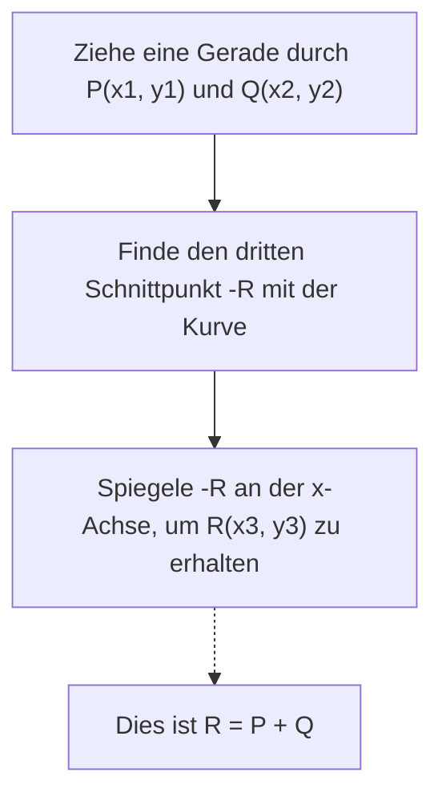
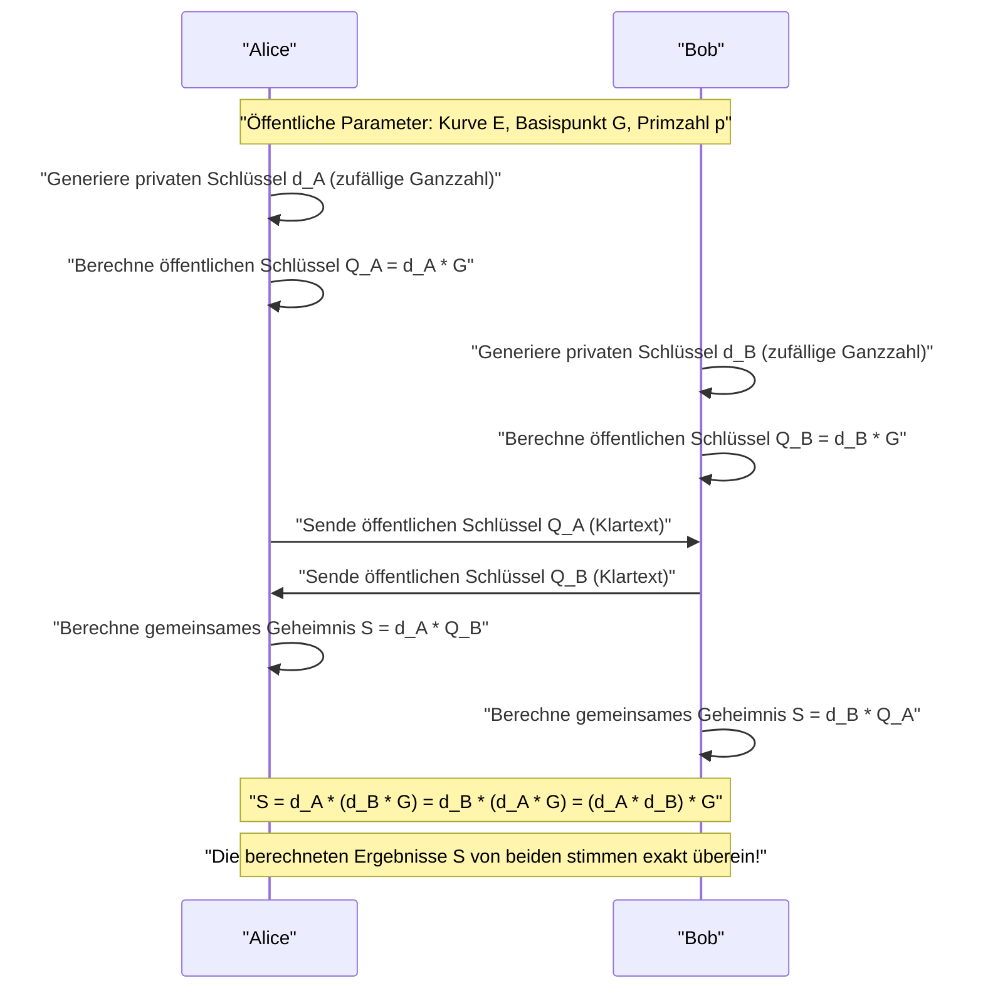
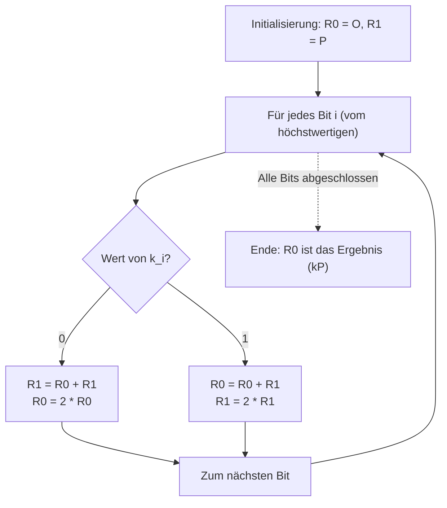

# Mathematische Grundlagen der Elliptischen-Kurven-Kryptographie (ECC) und ihre Implementierung in C++

In der modernen Kryptographie spielt die **Elliptische-Kurven-Kryptographie (Elliptic Curve Cryptography: ECC)** eine äußerst wichtige Rolle. Von unserer täglichen Internetkommunikation (HTTPS/TLS) über die Secure Enclaves von Smartphones, Serverauthentifizierung via SSH, passwortlose Authentifizierung wie FIDO bis hin zu Krypto-Assets wie Bitcoin und Ethereum – man kann ohne Übertreibung sagen, dass die Vertrauensbasis unserer modernen digitalen Gesellschaft durch ECC gestützt wird.

In diesem Artikel werden wir ausführlich erläutern, wie diese elliptische Kurven-Kryptographie funktioniert. Wir beginnen mit der schönen, aber komplexen mathematischen Theorie dahinter (algebraische Geometrie über endlichen Körpern), gehen dann zur tatsächlichen Implementierung in C++ über und behandeln schließlich sichere Codierungstechniken zur Verhinderung von Seitenkanalangriffen (Timing-Angriffen) – alles in einem überwältigenden Detailreichtum.

---

## 1. Warum Elliptische-Kurven-Kryptographie? (Vergleich mit RSA)

Lange Zeit war **RSA** das Synonym für Public-Key-Kryptographie. Die Sicherheit von RSA basiert auf der "Schwierigkeit der Primfaktorzerlegung riesiger zusammengesetzter Zahlen". Mit der steigenden Rechenleistung von Computern wurde es jedoch notwendig, die Schlüssellänge von RSA (die Bitlänge des Moduls) kontinuierlich zu erhöhen, um die Sicherheit aufrechtzuerhalten. Heutzutage wird eine Schlüssellänge von mindestens 2048 Bit empfohlen, für noch mehr Sicherheit sogar 3072 oder 4096 Bit.

Im Gegensatz dazu basiert die Elliptische-Kurven-Kryptographie (ECC) auf einer anderen mathematischen Schwierigkeit: dem **"Diskreten Logarithmusproblem auf elliptischen Kurven (ECDLP)"**. Bis heute wurde kein effizienter Algorithmus (wie z. B. ein Subexponentialzeit-Algorithmus) zur Lösung des ECDLP gefunden, und selbst die effizientesten bekannten Angriffsmethoden benötigen exponentielle Zeit.

Aufgrund dieser Eigenschaft hat ECC den entscheidenden Vorteil, **dass es mit sehr kurzen Schlüssellängen die gleiche Sicherheitsstärke wie RSA erreichen kann**.

| Sicherheitsstärke (Bit) | RSA-Schlüssellänge (Bit) | ECC-Schlüssellänge (Bit) | Längenverhältnis |
| :---: | :---: | :---: | :---: |
| 80 | 1024 | 160 | 1:6 |
| 112 | 2048 | 224 | 1:9 |
| 128 | 3072 | 256 | 1:12 |
| 192 | 7680 | 384 | 1:20 |
| 256 | 15360 | 512 | 1:30 |

Wie die obige Tabelle zeigt, benötigt RSA für eine Sicherheitsstärke von 128 Bit (die aktuelle Standardstärke) einen 3072-Bit-Schlüssel, während ECC mit nur 256 Bit auskommt. Dies ermöglicht eine Reduzierung des Rechenaufwands, einen geringeren Speicherverbrauch und die Einsparung von Netzwerkbandbreite. Dadurch ist ECC besonders in ressourcenbeschränkten Umgebungen wie IoT-Geräten und Smartcards überlegen.

---

## 2. Mathematische Vorbereitung: Gruppentheorie und endliche Körper

Um die Elliptische-Kurven-Kryptographie wirklich zu verstehen, ist es notwendig, die grundlegenden Konzepte der abstrakten Algebra (Gruppen- und Körpertheorie) zu beherrschen. Hier fassen wir das Vorwissen zur Konstruktion von ECC kurz zusammen.

### 2.1. Gruppen (Group) und abelsche Gruppen
Eine **Gruppe (Group)** ist ein Paar $(G, +)$, bestehend aus einer Menge $G$ und einer binären Operation auf dieser Menge (hier als Addition $+$ bezeichnet), das die folgenden vier Axiome erfüllt:

1. **Abgeschlossenheit (Closure)**: Für beliebige $a, b \in G$ gilt $a + b \in G$.
2. **Assoziativgesetz (Associativity)**: Für beliebige $a, b, c \in G$ gilt $(a + b) + c = a + (b + c)$.
3. **Existenz eines neutralen Elements (Identity element)**: Es existiert ein Element $e \in G$, sodass für jedes $a \in G$ gilt: $a + e = e + a = a$. Bei additiven Gruppen wird dieses neutrale Element meist als $0$ oder $\mathcal{O}$ geschrieben.
4. **Existenz inverser Elemente (Inverse element)**: Zu jedem $a \in G$ existiert ein Element $b \in G$, sodass $a + b = b + a = e$. Dieses $b$ wird als $-a$ bezeichnet.

Eine Gruppe, in der die Reihenfolge der Operanden das Ergebnis nicht verändert, d. h. die folgende Bedingung erfüllt ist, wird als **abelsche Gruppe (kommutative Gruppe)** bezeichnet:

5. **Kommutativgesetz (Commutativity)**: Für beliebige $a, b \in G$ gilt $a + b = b + a$.

Die Menge der Punkte auf einer elliptischen Kurve bildet eine solche **abelsche Gruppe**, wenn wir eine spezifische Additionsregel definieren.

### 2.2. Endliche Körper (Finite Field)
In der Kryptographietheorie verwenden wir keine Körper mit kontinuierlichen und unendlich vielen Elementen wie die reellen oder komplexen Zahlen, sondern **endliche Körper (Finite Fields)** oder Galois-Körper (Galois Fields), deren Elementanzahl endlich ist.

Der grundlegendste endliche Körper ist der **Primkörper $\mathbb{F}_p$** unter Verwendung einer Primzahl $p$. Dies ist die Menge der ganzen Zahlen $\{0, 1, 2, \dots, p-1\}$ versehen mit den vier Grundrechenarten (Addition, Subtraktion, Multiplikation, Division) modulo $p$ (dem Rest bei Division durch $p$).

- **Addition**: $(a + b) \pmod p$
- **Subtraktion**: $(a - b) \pmod p$
- **Multiplikation**: $(a \times b) \pmod p$
- **Division**: $a \times b^{-1} \pmod p$ (wobei $b^{-1}$ das multiplikative Inverse von $b$ modulo $p$ ist)

Die Berechnung des **multiplikativen Inversen (Modular Multiplicative Inverse)** ist in der kryptographischen Implementierung extrem wichtig. Um ein $b^{-1}$ zu finden, das $b \times b^{-1} \equiv 1 \pmod p$ erfüllt, werden hauptsächlich die folgenden zwei Algorithmen verwendet:

1. **Erweiterter euklidischer Algorithmus (Extended Euclidean Algorithm)**: Er ist schnell, aber je nach Implementierung ist die Ausführungszeit vom Eingabewert abhängig, was das Risiko von Timing-Angriffen birgt.
2. **Kleiner fermatscher Satz (Fermat's Little Theorem)**: Wenn $p$ eine Primzahl ist und $b \neq 0$, gilt $b^{p-1} \equiv 1 \pmod p$. Teilt man beide Seiten durch $b$, erhält man $b^{p-2} \equiv b^{-1} \pmod p$. Das heißt, durch Berechnung von $b$ hoch $p-2$ erhält man das Inverse. Da modulare Potenzierung leicht in konstanter Zeit (Constant-Time) implementiert werden kann, wird dies bei kryptographischen Implementierungen bevorzugt.

---

## 3. Die Gleichung und Geometrie der elliptischen Kurve

### 3.1. Die Weierstraß-Normalform
Eine **elliptische Kurve (Elliptic Curve)** ist im Allgemeinen eine ebene Kurve, die durch die folgende Gleichung definiert wird, bekannt als **Weierstraß-Normalform (Weierstrass normal form)**:

$$ y^2 = x^3 + ax + b $$

Hierbei sind $a$ und $b$ Konstanten. Als Bedingung dafür, dass die Kurve keine Singularitäten (Selbstüberschneidungen oder Spitzen) aufweist (d. h. eine glatte Kurve ist), darf die folgende **Diskriminante (Discriminant) $\Delta$** nicht null sein:

$$ \Delta = -16(4a^3 + 27b^2) \neq 0 $$

Da Kurven mit Singularitäten die kryptographische Sicherheit beeinträchtigen, werden immer Koeffizienten $a, b$ gewählt, die diese Bedingung erfüllen.

### 3.2. Der Punkt im Unendlichen (Point at Infinity)
Um die elliptische Kurve mathematisch zu einer vollständigen Gruppe zu machen, führen wir neben den Punkten auf der Ebene einen virtuellen Punkt ein, den **"Punkt im Unendlichen" (Point at Infinity)**. Dieser wird mit $\mathcal{O}$ bezeichnet.

Der Punkt im Unendlichen $\mathcal{O}$ ist definiert als der Punkt, an dem sich alle vertikalen Linien in der unendlichen Ferne schneiden. In der Gruppentheorie fungiert dieser Punkt im Unendlichen $\mathcal{O}$ als **neutrales Element** (die Null) der Addition.

Das heißt, für jeden beliebigen Punkt $P$ auf der Kurve gilt:
$$ P + \mathcal{O} = \mathcal{O} + P = P $$

Zudem ist das Inverse $-P$ eines Punktes $P = (x, y)$ definiert als der an der x-Achse gespiegelte Punkt $(x, -y)$. Daher gilt:
$$ P + (-P) = \mathcal{O} $$

---

## 4. Gruppenoperationen auf elliptischen Kurven (Punktaddition und -verdopplung)

Die Grundlage der Elliptischen-Kurven-Kryptographie ist die **"Addition"** von Punkten auf der Kurve. Diese unterscheidet sich von der gewöhnlichen Addition von Ganzzahlen und wird basierend auf geometrischen Operationen definiert.

### 4.1. Geometrische Addition (Tangent and Chord Method)
Das Verfahren, um zwei verschiedene Punkte $P$ und $Q$ auf der Kurve zu addieren, um einen neuen Punkt $R$ ($R = P + Q$) zu finden, ist wie folgt:

1. Ziehe eine Gerade (Sekante) durch den Punkt $P$ und den Punkt $Q$.
2. Diese Gerade schneidet die elliptische Kurve garantiert in einem dritten Punkt (nennen wir ihn $-R$). (※ Gemäß den Sätzen der algebraischen Geometrie)
3. Der Punkt, den man erhält, wenn man den Schnittpunkt $-R$ an der x-Achse spiegelt (also das Vorzeichen der y-Koordinate umkehrt), ist der gesuchte Punkt $R$.



### 4.2. Punktverdopplung (Point Doubling)
Wenn man denselben Punkt $P$ zu sich selbst addiert ($P + P = 2P$), kann man keine Gerade durch zwei Punkte ziehen. In diesem Fall zieht man **die Tangente an die Kurve im Punkt $P$**.

1. Ziehe die Tangente an die Kurve im Punkt $P$.
2. Diese Tangente schneidet die Kurve in einem weiteren Punkt $-R$.
3. Der an der x-Achse gespiegelte Schnittpunkt ist der gesuchte Punkt $R = 2P$.

### 4.3. Algebraische Berechnungsformeln
Wir übersetzen die geometrischen Operationen in algebraische Formeln, die von einem Computer berechnet werden können.
Alle Operationen werden über dem **endlichen Körper $\mathbb{F}_p$ (modulo $p$)** durchgeführt.

Seien die Punkte $P = (x_1, y_1)$ und $Q = (x_2, y_2)$.
Zudem sei der berechnete Ergebnispunkt $R = P + Q = (x_3, y_3)$.

Die Steigung der Geraden nennen wir $\lambda$ (Lambda).

**[Fall 1: Wenn $P \neq Q$ (Punktaddition)]**
Die Steigung $\lambda$ ist die Änderungsrate zwischen den beiden Punkten.
$$ \lambda \equiv \frac{y_2 - y_1}{x_2 - x_1} \pmod p $$
$$ \lambda \equiv (y_2 - y_1) \cdot (x_2 - x_1)^{-1} \pmod p $$

Mit diesem $\lambda$ können $x_3, y_3$ wie folgt berechnet werden:
$$ x_3 \equiv \lambda^2 - x_1 - x_2 \pmod p $$
$$ y_3 \equiv \lambda(x_1 - x_3) - y_1 \pmod p $$

**[Fall 2: Wenn $P = Q$ (Punktverdopplung)]**
Die Steigung $\lambda$ ist die Steigung der Tangente, die durch Ableitung ermittelt wird. (Wir leiten $y^2 = x^3 + ax + b$ implizit ab)
$$ 2y \cdot y' = 3x^2 + a \implies y' = \frac{3x^2 + a}{2y} $$
Daher gilt:
$$ \lambda \equiv (3x_1^2 + a) \cdot (2y_1)^{-1} \pmod p $$

Die Formeln für $x_3, y_3$ haben die gleiche Form wie bei der Addition, aber da $x_2 = x_1$, ergibt sich:
$$ x_3 \equiv \lambda^2 - 2x_1 \pmod p $$
$$ y_3 \equiv \lambda(x_1 - x_3) - y_1 \pmod p $$

> [!IMPORTANT]
> Diese Formeln enthalten **Divisionen (Berechnung des modularen Inversen)** wie $(x_2 - x_1)^{-1}$ und $(2y_1)^{-1}$. Da die Berechnung des modularen Inversen sehr rechenintensiv ist, werden in tatsächlichen Implementierungen allgemein projektive Koordinatensysteme wie die **"Jacobi-Koordinaten (Jacobian Coordinates)"** verwendet, die die Division verzögern.

---

## 5. Skalarmultiplikation und das Diskrete Logarithmusproblem (ECDLP)

Die rechenintensivste Operation in der Elliptischen-Kurven-Kryptographie, die gleichzeitig den Kern der Sicherheit bildet, ist die **Skalarmultiplikation (Scalar Multiplication)**.

### 5.1. Was ist Skalarmultiplikation?
Die Operation, einen Punkt $P$ $k$-mal zu addieren, wird als Skalarmultiplikation bezeichnet und als $kP$ geschrieben.
$$ kP = \underbrace{P + P + \dots + P}_{k\text{ Mal}} $$

Hierbei ist $k$ eine sehr große Ganzzahl (zum Beispiel eine 256-Bit-Ganzzahl).

### 5.2. Diskretes Logarithmusproblem auf elliptischen Kurven (ECDLP)
Die Sicherheit der Elliptischen-Kurven-Kryptographie beruht auf der Schwierigkeit des folgenden Problems:

> **Diskretes Logarithmusproblem auf elliptischen Kurven (Elliptic Curve Discrete Logarithm Problem: ECDLP)**
> Gegeben sei ein bekannter Punkt $P$ (Basispunkt) und ein berechneter Punkt $Q$. Finde den Skalar $k$, der $Q = kP$ erfüllt.

Es ist mit dem unten beschriebenen Algorithmus einfach (in polynomieller Zeit machbar), $Q$ aus $k$ und $P$ zu berechnen (Vorwärtsrichtung), aber es ist praktisch unmöglich, $k$ aus $P$ und $Q$ zurückzurechnen (Rückwärtsrichtung), da es außer Brute-Force-Suchen keine effiziente Lösungsmethode gibt (Einwegfunktion).
In kryptographischen Protokollen entspricht **$k$ dem "privaten Schlüssel" und $Q$ dem "öffentlichen Schlüssel"**.

### 5.3. Double-and-Add-Algorithmus
Wenn $k$ eine riesige Zahl ist (z. B. $2^{256}$), würde die naive Addition von $P$ um $k$-mal das Ende der Lebensdauer des Universums überdauern. Daher wird die **Double-and-Add-Methode (binäre Methode)** verwendet, um die Skalarmultiplikation schnell durchzuführen.

Dies ist die elliptische Kurvenversion der "binären Exponentiation", mit der die Potenzierung von Ganzzahlen schnell berechnet wird. Der Skalar $k$ wird binär dargestellt und vom höchstwertigen Bit an verarbeitet.

1. Initialisiere den Punkt $R$, der das Ergebnis hält, mit $\mathcal{O}$.
2. Wiederhole für jedes Bit von $k$, vom höchstwertigen bis zum niederwertigsten:
   - Verdopple $R$ (Point Doubling: $R = 2R$)
   - Wenn das aktuelle Bit `1` ist, addiere $P$ zu $R$ (Point Addition: $R = R + P$)

Durch diesen Algorithmus wird der Rechenaufwand drastisch von $O(k)$ auf $O(\log_2 k)$ reduziert, was die Berechnung in realistischer Zeit (im Millisekundenbereich) ermöglicht.

---

## 6. Elliptic Curve Diffie-Hellman (ECDH) Schlüsselaustausch

Hier erklären wir den Mechanismus des **ECDH (Elliptic Curve Diffie-Hellman) Schlüsselaustauschprotokolls**, welches das repräsentativste Anwendungsbeispiel für ECC ist. ECDH ist ein Mechanismus, mit dem Alice und Bob sicher einen gemeinsamen geheimen Schlüssel (Sitzungsschlüssel) über einen abhörbaren Kommunikationskanal generieren und austauschen können (dies ist der Kern des TLS-Handshakes).

**[Vorab-Parameter (Domain Parameters)]**
Beide Parteien haben sich im Voraus auf die zu verwendende elliptische Kurve $E$, die Primzahl $p$ und den Basispunkt $G$ geeinigt. (Beispiele sind NIST P-256 oder secp256k1)



Ein Lauscher (Eve) kann $G$, $Q_A$ und $Q_B$, die über den Kommunikationsweg fließen, abfangen, aber aufgrund der Schwierigkeit des ECDLP kann er Alices privaten Schlüssel $d_A$ nicht aus $Q_A = d_A \cdot G$ ermitteln. Außerdem ergibt die Multiplikation von $Q_A$ und $Q_B$ nicht den gemeinsamen Schlüssel $S$, sodass der Lauscher $S$ nicht berechnen kann.

---

## 7. Fallstricke bei der Implementierung: Seitenkanalangriffe und Gegenmaßnahmen

Selbst ein theoretisch perfekter kryptographischer Algorithmus kann im Prozess seiner Implementierung als Programm Schwachstellen aufweisen. Das sind die sogenannten **"Seitenkanalangriffe" (Side-Channel Attacks)**.

### 7.1. Timing-Angriffe (Timing Attack)
Schauen wir uns den zuvor erwähnten Double-and-Add-Algorithmus noch einmal an.

```cpp
// Pseudocode eines anfälligen Double-and-Add
Point R = Point::Infinity;
for (int i = 255; i >= 0; i--) {
    R = PointDoubling(R);         // Wird immer ausgeführt
    if (bit(k, i) == 1) {
        R = PointAddition(R, P);  // Wird nur ausgeführt, wenn das Bit 1 ist!
    }
}
```

Diese Implementierung hat einen fatalen Fehler. Da Point Addition ausgeführt wird, wenn das Bit `1` ist, ist **die Berechnungszeit geringfügig länger**, als wenn das Bit `0` ist. Darüber hinaus ändern sich auch die Sprungvorhersage (Branch Prediction) des Prozessors und das Verhalten des Cache-Speichers.
Indem ein Angreifer diesen winzigen Unterschied in der Berechnungszeit (oder dem Stromverbrauch) tausendfach statistisch beobachtet, **kann er die Bitfolge des privaten Schlüssels $k$ Bit für Bit vollständig rekonstruieren**. Das ist ein Timing-Angriff.

### 7.2. Constant-Time-Implementierung: Montgomery Ladder
Um Timing-Angriffe zu verhindern, muss man einen Algorithmus wählen, bei dem **die Abfolge der ausgeführten Befehle und die Berechnungszeit unabhängig vom Bitwert des privaten Schlüssels immer konstant (Constant-Time) sind**.

Das typischste Beispiel dafür ist die **Montgomery Ladder (Montgomery-Leiter)**.



Das Schöne an der Montgomery Ladder ist, dass unabhängig davon, ob das Bit `0` oder `1` ist, **"immer genau eine Point Addition und eine Point Doubling"** ausgeführt werden. Dadurch wird die Datenabhängigkeit der Berechnungszeit vollständig eliminiert.

Wenn jedoch die Verzweigung (`if (k_i == 0)`) selbst vorhanden ist, bleibt das Risiko bestehen, dass die Ausführungszeit durch Compileroptimierungen oder die Sprungvorhersage der CPU schwankt. Aus diesem Grund werden in tatsächlichen Constant-Time-Implementierungen bedingte Verzweigungen (`if`-Anweisungen) vermieden und stattdessen **bedingtes Vertauschen (Conditional Swap) mit bitweisen Operationen** verwendet.

---

## 8. Implementierung der Elliptischen-Kurven-Kryptographie in C++

Von nun an werden wir die Theorie in C++-Code umsetzen. Praktische Krypto-Bibliotheken (wie OpenSSL oder libsodium) verwenden hochentwickelte Assembler-Optimierungen und Jacobi-Koordinaten, aber um das mathematische Verständnis zu vertiefen, zeigen wir hier das Gerüst einer **leicht verständlichen Constant-Time-Implementierung mit affinen Koordinaten**.

Wir gehen davon aus, dass wir `boost::multiprecision::cpp_int` für die Berechnungen mit großen Zahlen verwenden.

### 8.1. Modulo-Arithmetik und Inversen
Zunächst definieren wir Hilfsfunktionen für Operationen auf endlichen Körpern. Wir implementieren die Inversen-Berechnung mit dem kleinen fermatschen Satz.

```cpp
#include <iostream>
#include <vector>
#include <stdexcept>
#include <boost/multiprecision/cpp_int.hpp>

using namespace boost::multiprecision;

// Beispiel: Parameter und Primzahl p für secp256k1
const cpp_int p("0xFFFFFFFFFFFFFFFFFFFFFFFFFFFFFFFFFFFFFFFFFFFFFFFFFFFFFFFEFFFFFC2F");
const cpp_int a = 0;
const cpp_int b = 7;

// Modulo-Operation, die einen positiven Rest zurückgibt
cpp_int mod(cpp_int x, cpp_int m) {
    cpp_int r = x % m;
    return r < 0 ? r + m : r;
}

// Modulare Exponentiation (x^y mod m)
cpp_int powerMod(cpp_int base, cpp_int exp, cpp_int m) {
    cpp_int res = 1;
    base = mod(base, m);
    while (exp > 0) {
        if (exp % 2 == 1) res = mod(res * base, m);
        base = mod(base * base, m);
        exp /= 2;
    }
    return res;
}

// Modulares Inverses mit dem kleinen fermatschen Satz
cpp_int modInverse(cpp_int n, cpp_int m) {
    // Annahme, dass m eine Primzahl ist: n^(m-2) ≡ n^(-1) mod m
    return powerMod(n, m - 2, m);
}
```

### 8.2. Darstellung von Punkten und Gruppenoperationen (Addition/Verdopplung)
Wir definieren eine `Point`-Struktur, die den Punkt im Unendlichen durch ein Flag verwaltet, und implementieren die Additionsformeln.

```cpp
struct Point {
    cpp_int x;
    cpp_int y;
    bool isInfinity;

    // Erzeugung des Punktes im Unendlichen
    Point() : x(0), y(0), isInfinity(true) {}
    
    // Erzeugung eines normalen Punktes
    Point(cpp_int x, cpp_int y) : x(x), y(y), isInfinity(false) {}
};

// Punktaddition auf der elliptischen Kurve (R = P + Q)
Point pointAdd(const Point& P, const Point& Q) {
    if (P.isInfinity) return Q;
    if (Q.isInfinity) return P;

    if (P.x == Q.x && mod(P.y + Q.y, p) == 0) {
        return Point(); // P + (-P) = Punkt im Unendlichen
    }

    cpp_int lambda;
    if (P.x == Q.x && P.y == Q.y) {
        // Point Doubling (Wenn P = Q)
        // lambda = (3x^2 + a) / 2y
        cpp_int num = mod(3 * P.x * P.x + a, p);
        cpp_int den = modInverse(mod(2 * P.y, p), p);
        lambda = mod(num * den, p);
    } else {
        // Point Addition (Wenn P != Q)
        // lambda = (y2 - y1) / (x2 - x1)
        cpp_int num = mod(Q.y - P.y, p);
        cpp_int den = modInverse(mod(Q.x - P.x, p), p);
        lambda = mod(num * den, p);
    }

    cpp_int x3 = mod(lambda * lambda - P.x - Q.x, p);
    cpp_int y3 = mod(lambda * (P.x - x3) - P.y, p);

    return Point(x3, y3);
}
```

### 8.3. Implementierung des Constant-Time Conditional Swap
Wenn der Inhalt von Variablen basierend auf dem Bitwert des privaten Schlüssels vertauscht wird, erfolgt das Vertauschen ausschließlich durch Bitoperationen (Maskierung) ohne die Verwendung von `if`-Anweisungen. Dadurch wird der Ausführungspfad völlig konstant.

> [!TIP]
> In der Praxis sind Klassen für Ganzzahlen mit mehrfacher Genauigkeit, die dynamisch allokiert werden (wie `cpp_int`), nicht für Constant-Time-Verarbeitung geeignet. Das liegt daran, dass durch Speicherzuweisung und sich ändernde Array-Größen Timing-Informationen durchsickern. In praktischen Bibliotheken werden stattdessen feste Längen (z. B. ein Array mit 4 Elementen von uint64_t) verwendet, und Maskierungsoperationen auf Bitebene implementiert. Das Folgende ist ein konzeptionelles Beispiel.

```cpp
// Konzeptioneller Constant-Time Swap (ausgehend von Ganzzahlen fester Länge)
// Wenn das Bit 1 ist, tausche P1 und P2; wenn es 0 ist, nicht.
void cswap(Point& P1, Point& P2, uint8_t bit) {
    // bit ist 0 oder 1. Die Maske ist alle Bits 1 (0xFF..), wenn bit=1, und alle Bits 0, wenn bit=0.
    // (Hier wird zur Erklärung angenommen, dass w jedes Wort der BigInt-Klasse fester Länge ist)
    /*
    uint64_t mask = 0 - (uint64_t)bit;
    for (int i = 0; i < NUM_WORDS; i++) {
        uint64_t dummy = mask & (P1.x.words[i] ^ P2.x.words[i]);
        P1.x.words[i] ^= dummy;
        P2.x.words[i] ^= dummy;
        // Die y-Koordinate und das isInfinity-Flag werden auf ähnliche Weise verarbeitet
    }
    */
    
    // ※ Ein vollständiger Constant-Time-Swap mit boost::multiprecision ist schwierig,
    // daher beschränken wir uns hier auf die Simulation durch Verzweigung zum Verständnis der Logik.
    if (bit == 1) {
        std::swap(P1, P2);
    }
}
```

### 8.4. Skalarmultiplikation durch Montgomery Ladder
Wir kombinieren das zuvor beschriebene `pointAdd` und `cswap`, um eine sichere Skalarmultiplikation zu implementieren.

```cpp
// Skalarmultiplikation k * P (Montgomery Ladder Methode)
Point scalarMultiply(const Point& P, cpp_int k) {
    Point R0 = Point(); // Punkt im Unendlichen
    Point R1 = P;

    // Hole die Bitlänge von k (256 Bit für secp256k1)
    int numBits = 256; 
    
    for (int i = numBits - 1; i >= 0; i--) {
        // Hole den Wert des i-ten Bits (0 oder 1)
        uint8_t bit = static_cast<uint8_t>(bit_test(k, i) ? 1 : 0);

        // Wenn bit == 1, tausche R0 und R1
        cswap(R0, R1, bit);

        // Führe immer die gleichen Operationen aus (Point Addition und Point Doubling)
        R1 = pointAdd(R0, R1);
        R0 = pointAdd(R0, R0);

        // Wenn bit == 1 war, tausche erneut, um den Zustand wiederherzustellen
        cswap(R0, R1, bit);
    }

    return R0;
}
```

Durch diese Implementierungslogik wird – unabhängig davon, ob jedes Bit des Skalars $k$ eine `0` oder `1` ist – der in jeder Schleifeniteration ausgeführte Ablauf (`cswap` $\to$ `pointAdd` $\to$ `pointAdd` $\to$ `cswap`) völlig identisch. Dies verhindert effektiv das Durchsickern von Geheiminformationen durch Timing- oder Cache-Zugriffsmusterunterschiede.

---

## 9. Zusammenfassung

Die Elliptische-Kurven-Kryptographie (ECC) mag auf den ersten Blick seltsam erscheinen: "Warum wird aus einer geometrischen Operation wie dem Ziehen einer Gerade und dem Spiegeln eines Schnittpunkts eine Kryptographie?" Wenn man diese Operationen jedoch auf die diskrete Welt endlicher Körper abbildet, entsteht als Produkt der wundersamen Verschmelzung von Mathematik und Kryptographie eine hervorragende Einwegfunktion (das Diskrete Logarithmusproblem).

Dieser Artikel hat die folgenden wichtigen Punkte behandelt:

1. **Vorteile gegenüber RSA**: Es bietet starke Sicherheit mit sehr kurzen Schlüssellängen und ist ideal für das moderne Mobile- und IoT-Zeitalter.
2. **Grundlagen der Gruppentheorie und endlicher Körper**: Die inneren mathematischen Strukturen, die das Fundament von ECC bilden.
3. **Formeln für Addition und Verdopplung**: Wie algebraische Gruppenoperationen mit der Weierstraß-Gleichung implementiert werden.
4. **Bedrohung durch Seitenkanalangriffe**: Wie bedingte Verzweigungen, die von den Bits eines privaten Schlüssels abhängen, fatale Schwachstellen schaffen.
5. **Constant-Time-Implementierung**: C++-Codierungstechniken, die Montgomery Ladder und Conditional Swap verwenden, um das Verhalten auf Hardwareebene zu homogenisieren und Angriffe zu verhindern.

In einer Produktionsumgebung eine eigene Krypto-Bibliothek zu schreiben, birgt ein extrem hohes Sicherheitsrisiko und wird daher nicht empfohlen ("Don't roll your own crypto"). Die tiefgreifende Kenntnis der intern ablaufenden Algorithmen und mathematischen Hintergründe wird jedoch zu einer unschätzbaren und mächtigen Waffe für Ingenieure, die sicherere und leistungsfähigere Systeme entwerfen und betreiben wollen.

Im nächsten Artikel werden wir noch tiefer auf den **ECDSA (Elliptic Curve Digital Signature Algorithm)**, einen digitalen Signaturalgorithmus auf Basis elliptischer Kurven, sowie auf die in Bitcoin verwendeten **Schnorr-Signaturen** eingehen.

