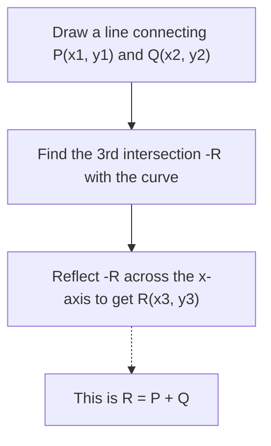
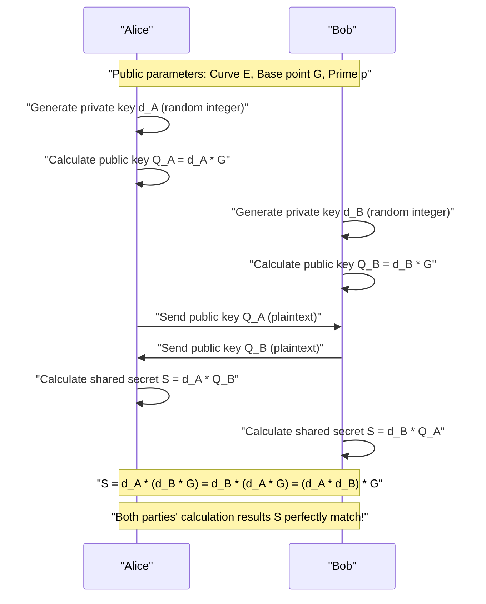
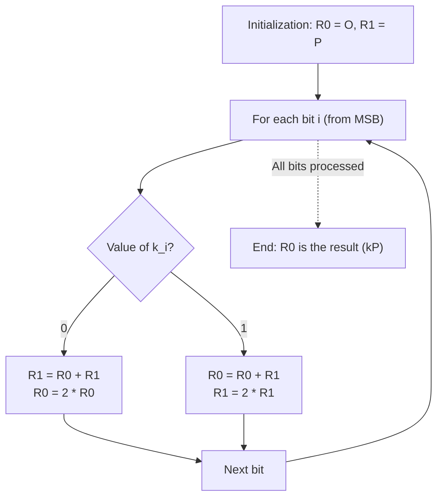

# Mathematical Foundations of Elliptic Curve Cryptography (ECC) and Implementation in C++

In modern cryptographic technology, **Elliptic Curve Cryptography (ECC)** plays a tremendously important role. It is no exaggeration to say that the foundation of trust in our modern digital society—from everyday Internet communications (HTTPS/TLS) and smartphone secure enclaves, to server authentication via SSH, passwordless authentication like FIDO, and even crypto assets like Bitcoin and Ethereum—is supported by ECC.

In this article, we will thoroughly explain how elliptic curve cryptography works, starting from the beautiful yet complex mathematical theory behind it (algebraic geometry over finite fields), to actual implementation methods in C++, and even secure coding techniques to prevent side-channel attacks (timing attacks), with an overwhelming volume of detail.

---

## 1. Why Elliptic Curve Cryptography? (Comparison with RSA)

For a long time, **RSA cryptography** was synonymous with public-key cryptography. The security of RSA relies on the "difficulty of factoring large composite numbers." However, as the computational power of computers has increased, it has become necessary to continuously lengthen the RSA key size (number of modulus bits) to maintain security. Currently, a key size of at least 2048 bits is recommended, and 3072 or 4096 bits if greater security is desired.

In contrast, Elliptic Curve Cryptography (ECC) bases its security on a different mathematical difficulty: the **"Elliptic Curve Discrete Logarithm Problem (ECDLP)"**. To this day, no efficient algorithms (such as sub-exponential time algorithms) for solving the ECDLP have been discovered, and even the most efficient known attack methods require exponential time.

Because of this property, ECC has the decisive advantage of being able to **achieve security strength equivalent to RSA with significantly shorter key lengths**.

| Security Strength (bits) | RSA Key Length (bits) | ECC Key Length (bits) | Key Length Ratio |
| :---: | :---: | :---: | :---: |
| 80 | 1024 | 160 | 1:6 |
| 112 | 2048 | 224 | 1:9 |
| 128 | 3072 | 256 | 1:12 |
| 192 | 7680 | 384 | 1:20 |
| 256 | 15360 | 512 | 1:30 |

As shown in the table above, to achieve a security strength of 128 bits (currently a standard strength), RSA requires a 3072-bit key, whereas ECC requires only 256 bits. This reduces computational complexity, lowers memory usage, and saves network bandwidth, making ECC overwhelmingly superior, especially in resource-constrained IoT devices and smart card environments.

---

## 2. Mathematical Preparation: The World of Group Theory and Finite Fields

To truly understand elliptic curve cryptography, it is necessary to grasp the basic concepts of abstract algebra (group theory and field theory). Here, we briefly summarize the prerequisite knowledge for constructing ECC.

### 2.1. Groups and Abelian Groups
A **Group** is a pair consisting of a set $G$ and a binary operation on that set (here we'll use addition $+$), denoted as $(G, +)$, which satisfies the following four axioms:

1. **Closure**: For any $a, b \in G$, $a + b \in G$.
2. **Associativity**: For any $a, b, c \in G$, $(a + b) + c = a + (b + c)$.
3. **Identity element**: There exists an element $e \in G$ such that for any $a \in G$, $a + e = e + a = a$. For additive groups, this identity element is usually denoted as $0$ or $\mathcal{O}$.
4. **Inverse element**: For any $a \in G$, there exists an element $b \in G$ such that $a + b = b + a = e$. This $b$ is denoted as $-a$.

Furthermore, a group that satisfies the following condition, where the result does not change even if the order of the operation is swapped, is called an **Abelian group (commutative group)**.

5. **Commutativity**: For any $a, b \in G$, $a + b = b + a$.

The set of points on an elliptic curve, by defining a specific addition rule, constitutes this **Abelian group**.

### 2.2. Finite Fields
In cryptography, we do not use fields with continuous and infinite elements like real or complex numbers, but rather **Finite Fields** (or Galois Fields), which have a finite number of elements.

The most basic finite field is the **prime field $\mathbb{F}_p$** using a prime number $p$. This defines the four basic arithmetic operations (addition, subtraction, multiplication, division) modulo $p$ (the remainder when divided by $p$) on the set of integers $\{0, 1, 2, \dots, p-1\}$.

- **Addition**: $(a + b) \pmod p$
- **Subtraction**: $(a - b) \pmod p$
- **Multiplication**: $(a \times b) \pmod p$
- **Division**: $a \times b^{-1} \pmod p$ (where $b^{-1}$ is the modular multiplicative inverse of $b$ modulo $p$)

Calculating the **Modular Multiplicative Inverse** is extremely important in cryptographic implementations. To find $b^{-1}$ satisfying $b \times b^{-1} \equiv 1 \pmod p$, the following two main algorithms are used:

1. **Extended Euclidean Algorithm**: Fast, but depending on the implementation, the processing time can depend on the input values, leading to a risk of timing attacks.
2. **Fermat's Little Theorem**: When $p$ is prime and $b \neq 0$, $b^{p-1} \equiv 1 \pmod p$ holds. Dividing both sides by $b$ yields $b^{p-2} \equiv b^{-1} \pmod p$. That is, the inverse is found by raising $b$ to the power of $p-2$. Exponentiation is easier to implement in constant time, so this method is preferred in cryptographic implementations.

---

## 3. Elliptic Curve Equations and Geometry

### 3.1. Weierstrass Normal Form
An **Elliptic Curve** is generally a plane curve defined by the following equation, known as the **Weierstrass normal form**.

$$ y^2 = x^3 + ax + b $$

Here, $a$ and $b$ are constants, and as a condition for the curve to have no singular points (self-intersections or cusps) (i.e., to be a smooth curve), the following **Discriminant $\Delta$** must not be zero.

$$ \Delta = -16(4a^3 + 27b^2) \neq 0 $$

Since curves with singular points compromise cryptographic security, coefficients $a, b$ that satisfy this condition are always chosen.

### 3.2. Point at Infinity
To make an elliptic curve a mathematically complete group, a virtual point called the **"Point at Infinity"** is introduced in addition to the points on the plane. This is denoted as $\mathcal{O}$.

The point at infinity $\mathcal{O}$ is defined as the point where all vertical lines intersect infinitely far away. In group theory, this point at infinity $\mathcal{O}$ functions as the **identity element** (zero) for addition.

In other words, for any point $P$ on the curve, the following holds:
$$ P + \mathcal{O} = \mathcal{O} + P = P $$

Also, the inverse $-P$ of point $P = (x, y)$ is defined as the point symmetrical with respect to the x-axis, $(x, -y)$. Therefore:
$$ P + (-P) = \mathcal{O} $$
holds.

---

## 4. Group Operations on Elliptic Curves (Point Addition and Point Doubling)

The core of elliptic curve cryptography is the operation called **"Addition"** between points on the curve. This is different from the addition of ordinary integers and is defined based on geometric operations.

### 4.1. Geometric Addition (Tangent and Chord Method)
The procedure for finding a new point $R$ ($R = P + Q$) by adding two distinct points $P$ and $Q$ on the curve is as follows:

1. Draw a straight line (chord) connecting point $P$ and point $Q$.
2. This straight line will definitely intersect the elliptic curve at a third point (let's call it $-R$). (*Based on a theorem in algebraic geometry)
3. The point $R$ we are looking for is the point obtained by reflecting the intersection point $-R$ symmetrically across the x-axis (the point with the inverted sign of the y-coordinate).



### 4.2. Point Doubling
When adding the same point $P$ to point $P$ ($P + P = 2P$), we cannot draw a line connecting two points. In this case, we draw the **tangent line to the curve at point $P$**.

1. Draw the tangent line to the curve at point $P$.
2. This tangent line intersects the curve at another point $-R$.
3. The point $R = 2P$ we are looking for is obtained by reflecting the intersection symmetrically across the x-axis.

### 4.3. Algebraic Calculation Formulas
We translate the geometric operations into algebraic formulas so they can be computed by a computer.
All operations are performed **over the finite field $\mathbb{F}_p$ (modulo $p$)**.

Let point $P = (x_1, y_1)$ and point $Q = (x_2, y_2)$.
Also, let the resulting point be $R = P + Q = (x_3, y_3)$.

Let the slope of the line be $\lambda$ (lambda).

**[Case 1: When $P \neq Q$ (Point Addition)]**
The slope $\lambda$ is the rate of change between the two points.
$$ \lambda \equiv \frac{y_2 - y_1}{x_2 - x_1} \pmod p $$
$$ \lambda \equiv (y_2 - y_1) \cdot (x_2 - x_1)^{-1} \pmod p $$

Using this $\lambda$, $x_3, y_3$ are found as follows:
$$ x_3 \equiv \lambda^2 - x_1 - x_2 \pmod p $$
$$ y_3 \equiv \lambda(x_1 - x_3) - y_1 \pmod p $$

**[Case 2: When $P = Q$ (Point Doubling)]**
The slope $\lambda$ becomes the slope of the tangent line obtained by differentiation. (We implicitly differentiate $y^2 = x^3 + ax + b$)
$$ 2y \cdot y' = 3x^2 + a \implies y' = \frac{3x^2 + a}{2y} $$
Therefore,
$$ \lambda \equiv (3x_1^2 + a) \cdot (2y_1)^{-1} \pmod p $$

The formulas for $x_3, y_3$ take the same form as addition, but since $x_2 = x_1$, they are as follows:
$$ x_3 \equiv \lambda^2 - 2x_1 \pmod p $$
$$ y_3 \equiv \lambda(x_1 - x_3) - y_1 \pmod p $$

> [!IMPORTANT]
> These formulas include **division (calculation of modular inverses)**, such as $(x_2 - x_1)^{-1}$ and $(2y_1)^{-1}$. Since calculating modular inverses incurs a very high computational cost, practical implementations generally use projective coordinate systems like **"Jacobian Coordinates"**, which delay division.

---

## 5. Scalar Multiplication and the Elliptic Curve Discrete Logarithm Problem (ECDLP)

In elliptic curve cryptography, the operation that requires the most computation and forms the core of its security is **Scalar Multiplication**.

### 5.1. What is Scalar Multiplication?
The operation of adding a point $P$ to itself $k$ times is called scalar multiplication, denoted as $kP$.
$$ kP = \underbrace{P + P + \dots + P}_{k \text{ times}} $$

Here, $k$ is a very large integer (for example, a 256-bit integer).

### 5.2. Elliptic Curve Discrete Logarithm Problem (ECDLP)
The security of elliptic curve cryptography depends on the difficulty of the following problem.

> **Elliptic Curve Discrete Logarithm Problem (ECDLP)**
> Given a known point $P$ (base point) and the resulting point $Q$, find the scalar $k$ that satisfies $Q = kP$.

Calculating $Q$ from $k$ and $P$ (forward direction) is easy (polynomial time) using the algorithm described below, but inversely calculating $k$ from $P$ and $Q$ (reverse direction) is practically impossible as there is no efficient solution other than exhaustive search (a one-way function).
In cryptographic protocols, **$k$ corresponds to the "private key" and $Q$ to the "public key"**.

### 5.3. Double-and-Add Algorithm
When $k$ is a huge number (e.g., $2^{256}$), naively adding $P$ for $k$ times will not finish even if the life of the universe ends. Therefore, to perform scalar multiplication quickly, the **Double-and-Add method (binary method)** is used.

This is the elliptic curve version of the "exponentiation by squaring" method used for rapid calculation of integer powers. The scalar $k$ is represented in binary, and processed sequentially starting from the most significant bit.

1. Initialize the point $R$ holding the result to $\mathcal{O}$.
2. Repeat the following from the most significant bit to the least significant bit of $k$:
   - Double $R$ (Point Doubling: $R = 2R$)
   - If the current bit is `1`, add $P$ to $R$ (Point Addition: $R = R + P$)

With this algorithm, the computational complexity is dramatically reduced from $O(k)$ to $O(\log_2 k)$, enabling calculation in a realistic amount of time (milliseconds).

---

## 6. Elliptic Curve Diffie-Hellman (ECDH) Key Exchange

Here, we explain the mechanics of the **ECDH (Elliptic Curve Diffie-Hellman) key exchange protocol**, which is the most representative application of ECC. ECDH is a mechanism for Alice and Bob to securely generate and share a common secret key (session key) over a communication channel that could be wiretapped (it is the core of the TLS handshake).

**[Prerequisite Parameters (Domain Parameters)]**
Both parties share the elliptic curve $E$, a prime number $p$, and a base point $G$ to be used beforehand. (e.g., NIST P-256 or secp256k1)



An eavesdropper (Eve) can intercept $G$, $Q_A$, and $Q_B$ flowing over the communication path, but due to the difficulty of the ECDLP, she cannot determine Alice's private key $d_A$ from $Q_A = d_A \cdot G$. Also, even if she multiplies $Q_A$ and $Q_B$, it will not result in the shared key $S$, so the eavesdropper cannot calculate $S$.

---

## 7. Implementation Pitfalls: Side-Channel Attacks and Countermeasures

Even a theoretically perfect cryptographic algorithm can harbor vulnerabilities introduced during the process of implementing it as a program. This is known as a **"Side-Channel Attack"**.

### 7.1. Timing Attack
Let's look back at the Double-and-Add algorithm mentioned earlier.

```cpp
// Vulnerable pseudo-code for Double-and-Add
Point R = Point::Infinity;
for (int i = 255; i >= 0; i--) {
    R = PointDoubling(R);         // Always executed
    if (bit(k, i) == 1) {
        R = PointAddition(R, P);  // Executed ONLY when bit is 1!
    }
}
```

This implementation has a fatal flaw. Because Point Addition is executed when the bit is `1`, the calculation time is **slightly longer** than when the bit is `0`. Also, the behavior of the processor's branch prediction and cache memory will change.
By statistically observing this minute difference in calculation time (or power consumption) thousands of times, an attacker can **completely recover the bit sequence of the private key $k$, one bit at a time**. This is a timing attack.

### 7.2. Constant-Time Implementation: Montgomery Ladder
To prevent timing attacks, it is necessary to adopt algorithms where **the sequence of executed instructions and the calculation time are always constant (Constant-Time), regardless of the bit values of the private key**.

A representative example of this is the **Montgomery Ladder**.



The beauty of the Montgomery Ladder is that whether the bit is `0` or `1`, **"exactly one Point Addition and one Point Doubling"** are always executed. This completely eliminates the data dependency of the computation time.

However, if a branch (`if (k_i == 0)`) itself exists, the risk of execution time fluctuating due to compiler optimization and CPU branch prediction remains. Therefore, in actual Constant-Time implementations, conditional branches (`if` statements) are eliminated, and a **Conditional Swap using bitwise operations** is utilized.

---

## 8. Implementation of Elliptic Curve Cryptography in C++

From here, we will translate the theory into C++ code. While practical cryptographic libraries (like OpenSSL or libsodium) use highly advanced assembly optimizations and Jacobian coordinates, we present the skeleton of an **easy-to-understand Constant-Time implementation using affine coordinates** to deepen mathematical understanding.

We assume the use of `boost::multiprecision::cpp_int` for operations on huge integers.

### 8.1. Modular Arithmetic and Inverses
First, we define helper functions for operations over finite fields. We implement inverse calculation using Fermat's Little Theorem.

```cpp
#include <iostream>
#include <vector>
#include <stdexcept>
#include <boost/multiprecision/cpp_int.hpp>

using namespace boost::multiprecision;

// Prime p and parameters for secp256k1 as an example
const cpp_int p("0xFFFFFFFFFFFFFFFFFFFFFFFFFFFFFFFFFFFFFFFFFFFFFFFFFFFFFFFEFFFFFC2F");
const cpp_int a = 0;
const cpp_int b = 7;

// Modulo operation returning a positive remainder
cpp_int mod(cpp_int x, cpp_int m) {
    cpp_int r = x % m;
    return r < 0 ? r + m : r;
}

// Modular exponentiation (x^y mod m)
cpp_int powerMod(cpp_int base, cpp_int exp, cpp_int m) {
    cpp_int res = 1;
    base = mod(base, m);
    while (exp > 0) {
        if (exp % 2 == 1) res = mod(res * base, m);
        base = mod(base * base, m);
        exp /= 2;
    }
    return res;
}

// Modular inverse using Fermat's Little Theorem
cpp_int modInverse(cpp_int n, cpp_int m) {
    // Assuming m is prime: n^(m-2) ≡ n^(-1) mod m
    return powerMod(n, m - 2, m);
}
```

### 8.2. Point Representation and Group Operations (Addition/Doubling)
We implement the `Point` structure, which manages the point at infinity with a flag, and the addition formulas.

```cpp
struct Point {
    cpp_int x;
    cpp_int y;
    bool isInfinity;

    // Creation of the point at infinity
    Point() : x(0), y(0), isInfinity(true) {}
    
    // Creation of a normal point
    Point(cpp_int x, cpp_int y) : x(x), y(y), isInfinity(false) {}
};

// Addition of points on the elliptic curve (R = P + Q)
Point pointAdd(const Point& P, const Point& Q) {
    if (P.isInfinity) return Q;
    if (Q.isInfinity) return P;

    if (P.x == Q.x && mod(P.y + Q.y, p) == 0) {
        return Point(); // P + (-P) = Point at infinity
    }

    cpp_int lambda;
    if (P.x == Q.x && P.y == Q.y) {
        // Point Doubling (when P = Q)
        // lambda = (3x^2 + a) / 2y
        cpp_int num = mod(3 * P.x * P.x + a, p);
        cpp_int den = modInverse(mod(2 * P.y, p), p);
        lambda = mod(num * den, p);
    } else {
        // Point Addition (when P != Q)
        // lambda = (y2 - y1) / (x2 - x1)
        cpp_int num = mod(Q.y - P.y, p);
        cpp_int den = modInverse(mod(Q.x - P.x, p), p);
        lambda = mod(num * den, p);
    }

    cpp_int x3 = mod(lambda * lambda - P.x - Q.x, p);
    cpp_int y3 = mod(lambda * (P.x - x3) - P.y, p);

    return Point(x3, y3);
}
```

### 8.3. Implementation of Constant-Time Conditional Swap
When swapping the contents of variables based on the bit value of the private key, we use only bitwise operations (masks) without using an `if` statement. This ensures the execution path is completely constant.

> [!TIP]
> In an actual implementation, dynamically allocated multiple-precision integer classes like `cpp_int` are not suitable for Constant-Time processing. This is because timing information leaks due to variations in memory allocation and array sizes. Practical libraries represent them with fixed lengths (for example, an array of 4 uint64_t elements) and implement bit-level masking. The following is a conceptual example.

```cpp
// Conceptual Constant-Time Swap (assuming fixed-length integers)
// If bit is 1, swap P1 and P2; if 0, do not swap
void cswap(Point& P1, Point& P2, uint8_t bit) {
    // bit is 0 or 1. Mask is all 1s (0xFF..) if bit=1, all 0s if 0.
    // (Here we assume each word of a fixed-length BigInt class is w for explanation)
    /*
    uint64_t mask = 0 - (uint64_t)bit;
    for (int i = 0; i < NUM_WORDS; i++) {
        uint64_t dummy = mask & (P1.x.words[i] ^ P2.x.words[i]);
        P1.x.words[i] ^= dummy;
        P2.x.words[i] ^= dummy;
        // Process y-coordinate and isInfinity flag similarly
    }
    */
    
    // * Perfect constant-time swapping is difficult with boost::multiprecision,
    // so here we limit it to simulating with a branch for the sake of understanding the logic.
    if (bit == 1) {
        std::swap(P1, P2);
    }
}
```

### 8.4. Scalar Multiplication using the Montgomery Ladder
We combine the aforementioned `pointAdd` and `cswap` to implement secure scalar multiplication.

```cpp
// Scalar multiplication k * P (Montgomery Ladder method)
Point scalarMultiply(const Point& P, cpp_int k) {
    Point R0 = Point(); // Point at infinity
    Point R1 = P;

    // Get the bit length of k (256 bits for secp256k1)
    int numBits = 256; 
    
    for (int i = numBits - 1; i >= 0; i--) {
        // Get the value of the i-th bit (0 or 1)
        uint8_t bit = static_cast<uint8_t>(bit_test(k, i) ? 1 : 0);

        // Swap R0 and R1 if bit == 1
        cswap(R0, R1, bit);

        // Always execute the same operations (Point Addition and Point Doubling)
        R1 = pointAdd(R0, R1);
        R0 = pointAdd(R0, R0);

        // Swap back to restore state if bit == 1
        cswap(R0, R1, bit);
    }

    return R0;
}
```

With this implementation logic, whether each bit of the scalar $k$ is `0` or `1`, the operations executed within each loop iteration (`cswap` $\to$ `pointAdd` $\to$ `pointAdd` $\to$ `cswap`) follow the exact same flow. This powerfully prevents the leakage of secret information through differences in timing or cache access patterns.

---

## 9. Conclusion

At first glance, Elliptic Curve Cryptography (ECC) might seem puzzling: "Why does a geometric operation like drawing a line and reflecting the intersection point become cryptography?" However, by mapping it to the discrete world of finite fields, an excellent one-way function (the discrete logarithm problem) can be constructed, making it a product of the miraculous fusion of mathematics and cryptography.

In this article, we covered the following key points:

1. **Superiority over RSA**: Provides strong security with very short key lengths, making it ideal for the modern mobile and IoT era.
2. **Basics of Group Theory and Finite Fields**: The mathematical structure that forms the foundation of ECC.
3. **Addition and Doubling Formulas**: Implementation methods of algebraic group operations using Weierstrass equations.
4. **Threat of Side-Channel Attacks**: Conditional branches dependent on private key bits create fatal vulnerabilities.
5. **Constant-Time Implementation**: C++ coding techniques that uniformize hardware-level behavior using the Montgomery Ladder and Conditional Swap to prevent attacks.

Writing your own cryptographic library to run in a production environment is highly discouraged ("Don't roll your own crypto") because the security risks are extremely high. However, deeply understanding the underlying algorithms and mathematical background should serve as an invaluable and powerful weapon for engineers designing and operating more secure and performant systems.

In the next article, we would like to dig even deeper into the mechanics of the **ECDSA (Elliptic Curve Digital Signature Algorithm)**, which is a digital signature algorithm using these elliptic curves, as well as **Schnorr signatures**, which are adopted in Bitcoin.

