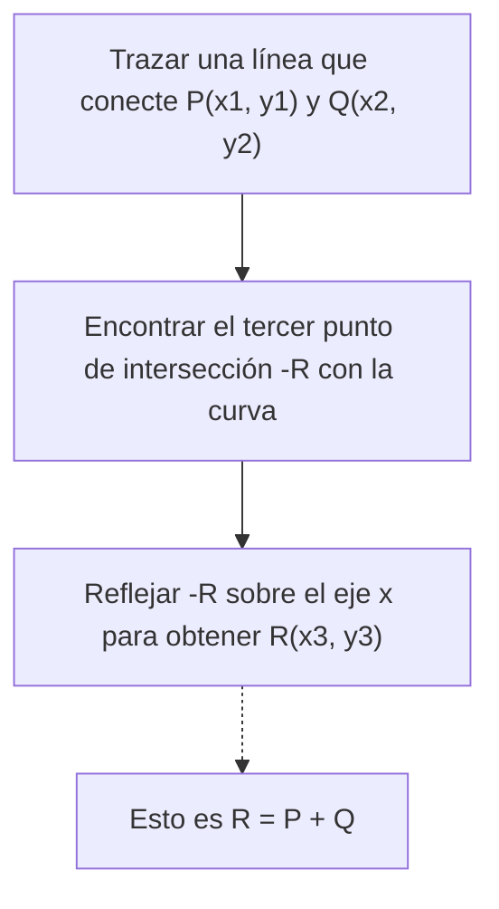
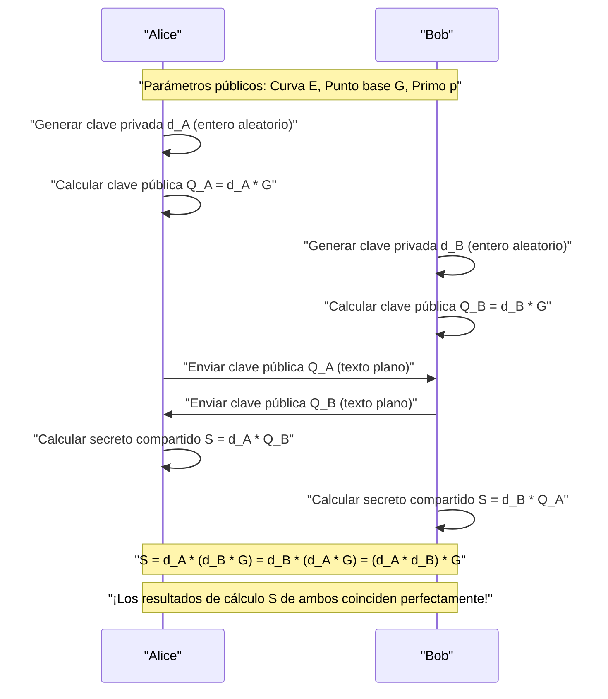
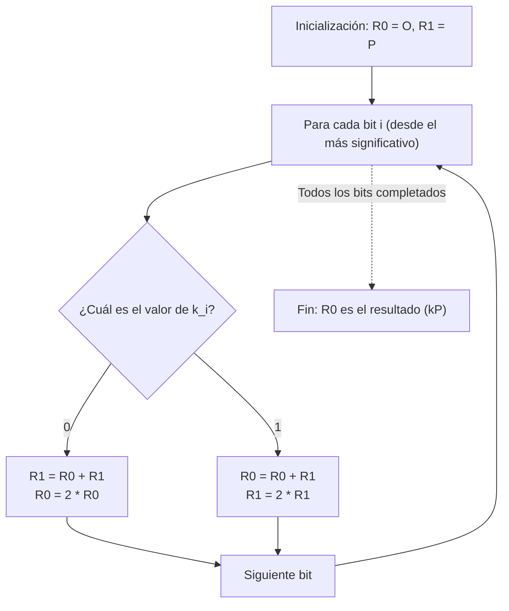

# Fundamentos matemáticos de la criptografía de curva elíptica (ECC) e implementación en C++

En la tecnología criptográfica moderna, la **criptografía de curva elíptica (Elliptic Curve Cryptography: ECC)** juega un papel extremadamente importante. Desde nuestras comunicaciones diarias en Internet (HTTPS/TLS), los enclaves seguros de los teléfonos inteligentes, la autenticación de servidores mediante SSH, la autenticación sin contraseña como FIDO, e incluso en criptomonedas como Bitcoin y Ethereum, no es una exageración decir que la base de confianza de la sociedad digital moderna está respaldada por ECC.

En este artículo, explicaremos exhaustivamente con un volumen abrumador cómo funciona esta criptografía de curva elíptica, partiendo de la hermosa pero compleja teoría matemática detrás de ella (geometría algebraica sobre campos finitos), los métodos de implementación prácticos usando C++, y además, técnicas de codificación seguras para prevenir ataques de canal lateral (ataques de tiempo).

---

## 1. ¿Por qué la criptografía de curva elíptica? (Comparación con RSA)

Cuando se hablaba de criptografía de clave pública, durante mucho tiempo el sinónimo era **RSA**. RSA basa su seguridad en la "dificultad de factorizar números compuestos enormes". Sin embargo, con el aumento de la capacidad computacional de los ordenadores, para mantener la seguridad ha surgido la necesidad de alargar continuamente el tamaño de la clave RSA (el número de bits del módulo). Hoy en día, se recomienda una longitud de clave de al menos 2048 bits, o 3072 y 4096 bits para mayor seguridad.

Por otro lado, la criptografía de curva elíptica (ECC) fundamenta su seguridad en una dificultad matemática diferente: el **"problema del logaritmo discreto en curvas elípticas (ECDLP)"**. Hasta la fecha, no se ha descubierto ningún algoritmo eficiente (como algoritmos de tiempo subexponencial) para resolver el ECDLP, e incluso los métodos de ataque más eficientes conocidos requieren un tiempo exponencial.

Debido a esta propiedad, ECC tiene la ventaja decisiva de **poder lograr el mismo nivel de seguridad que RSA con una longitud de clave mucho más corta**.

| Nivel de seguridad (bits) | Longitud de clave RSA (bits) | Longitud de clave ECC (bits) | Proporción de longitud de clave |
| :---: | :---: | :---: | :---: |
| 80 | 1024 | 160 | 1:6 |
| 112 | 2048 | 224 | 1:9 |
| 128 | 3072 | 256 | 1:12 |
| 192 | 7680 | 384 | 1:20 |
| 256 | 15360 | 512 | 1:30 |

Como muestra la tabla anterior, para obtener una seguridad de 128 bits (el estándar actual), RSA requiere una clave de 3072 bits, pero con ECC solo se necesitan 256 bits. Esto permite una reducción en la cantidad de cálculos, un menor uso de memoria y un ahorro de ancho de banda en la red, presumiendo de una ventaja abrumadora, especialmente en entornos con recursos limitados como dispositivos IoT y tarjetas inteligentes.

---

## 2. Preparación matemática: Teoría de grupos y el mundo de los campos finitos

Para comprender verdaderamente la criptografía de curva elíptica, es necesario dominar los conceptos básicos del álgebra abstracta (teoría de grupos y teoría de campos). Aquí resumiremos de manera concisa los conocimientos previos para construir ECC.

### 2.1. Grupo (Group) y grupo abeliano
Un **grupo (Group)** es un conjunto $G$ junto con una operación binaria (aquí la asumiremos como adición $+$) en ese conjunto, denotado como $(G, +)$, que satisface los siguientes 4 axiomas:

1. **Clausura (Closure)**: Para cualesquiera $a, b \in G$, se cumple que $a + b \in G$.
2. **Asociatividad (Associativity)**: Para cualesquiera $a, b, c \in G$, se cumple que $(a + b) + c = a + (b + c)$.
3. **Existencia del elemento neutro (Identity element)**: Existe un elemento $e \in G$ tal que para cualquier $a \in G$, $a + e = e + a = a$. En el caso de un grupo aditivo, este elemento neutro generalmente se denota como $0$ o $\mathcal{O}$.
4. **Existencia del elemento inverso (Inverse element)**: Para cualquier $a \in G$, existe un elemento $b \in G$ tal que $a + b = b + a = e$. Este $b$ se denota como $-a$.

Además, si el resultado no cambia al invertir el orden de la operación, es decir, si satisface la siguiente condición, el grupo se denomina **grupo abeliano (grupo conmutativo)**.

5. **Conmutatividad (Commutativity)**: Para cualesquiera $a, b \in G$, se cumple que $a + b = b + a$.

El conjunto de puntos en una curva elíptica, al definir una regla de adición específica, forma este **grupo abeliano**.

### 2.2. Campo finito (Finite Field)
En la teoría criptográfica, no se utilizan campos con un número infinito de elementos continuos como los números reales o complejos, sino un **campo finito (Finite Field)** o campo de Galois (Galois Field), donde el número de elementos es finito.

El campo finito más básico es el **campo primo $\mathbb{F}_p$** utilizando un número primo $p$. Esto es el conjunto de enteros $\{0, 1, 2, \dots, p-1\}$ en el que se definen las cuatro operaciones aritméticas (suma, resta, multiplicación, división) módulo $p$ (el resto de dividir por $p$).

- **Suma**: $(a + b) \pmod p$
- **Resta**: $(a - b) \pmod p$
- **Multiplicación**: $(a \times b) \pmod p$
- **División**: $a \times b^{-1} \pmod p$ (donde $b^{-1}$ es el inverso multiplicativo de $b$ módulo $p$)

El cálculo del **inverso multiplicativo modular (Modular Multiplicative Inverse)** es extremadamente importante en las implementaciones criptográficas. Para encontrar $b^{-1}$ que satisfaga $b \times b^{-1} \equiv 1 \pmod p$, se utilizan principalmente los dos siguientes algoritmos:

1. **Algoritmo de Euclides extendido (Extended Euclidean Algorithm)**: Es rápido, pero dependiendo de la implementación, el tiempo de procesamiento puede depender de los valores de entrada, por lo que existe el riesgo de ataques de tiempo.
2. **Pequeño teorema de Fermat (Fermat's Little Theorem)**: Cuando $p$ es primo y $b \neq 0$, se cumple que $b^{p-1} \equiv 1 \pmod p$. Dividiendo ambos lados por $b$, obtenemos $b^{p-2} \equiv b^{-1} \pmod p$. En otras palabras, calculando la potencia $p-2$ de $b$, se obtiene el inverso. Dado que las operaciones de exponenciación son fáciles de implementar en tiempo constante, esta es la preferida en implementaciones criptográficas.

---

## 3. Ecuación de la curva elíptica y geometría

### 3.1. Forma normal de Weierstrass
Una **curva elíptica (Elliptic Curve)** es una curva plana generalmente definida por la siguiente ecuación, llamada **forma normal de Weierstrass (Weierstrass normal form)**.

$$ y^2 = x^3 + ax + b $$

Aquí, $a$ y $b$ son constantes, y como condición para que la curva no tenga puntos singulares (auto-intersecciones o cúspides), es decir, para que sea una curva suave, se requiere que el siguiente **discriminante (Discriminant) $\Delta$** no sea cero.

$$ \Delta = -16(4a^3 + 27b^2) \neq 0 $$

Dado que una curva con puntos singulares compromete la seguridad criptográfica, siempre se eligen coeficientes $a, b$ que satisfagan esta condición.

### 3.2. Punto en el infinito (Point at Infinity)
Para convertir matemáticamente la curva elíptica en un grupo completo, además de los puntos en el plano, introducimos un punto virtual llamado **"punto en el infinito (Point at Infinity)"**. Lo denotamos como $\mathcal{O}$.

El punto en el infinito $\mathcal{O}$ se define como el punto donde todas las líneas verticales se cruzan en el infinito infinito. En la teoría de grupos, este punto en el infinito $\mathcal{O}$ funciona como el **elemento neutro en la adición** (cero).

Es decir, para cualquier punto $P$ en la curva, se cumple lo siguiente:
$$ P + \mathcal{O} = \mathcal{O} + P = P $$

Además, el inverso $-P$ del punto $P = (x, y)$ se define como el punto simétrico con respecto al eje x, $(x, -y)$. Por lo tanto:
$$ P + (-P) = \mathcal{O} $$

---

## 4. Operaciones de grupo en la curva elíptica (Suma de puntos y duplicación)

El núcleo de la criptografía de curva elíptica es la operación de **"suma (Addition)"** entre puntos de la curva. Esta difiere de la suma habitual de números enteros y se define basándose en operaciones geométricas.

### 4.1. Suma geométrica (Tangent and Chord Method)
El procedimiento para sumar dos puntos diferentes $P$ y $Q$ en la curva para obtener un nuevo punto $R$ ($R = P + Q$) es el siguiente:

1. Se traza una línea recta (cuerda) que pasa por los puntos $P$ y $Q$.
2. Esta línea recta siempre interceptará la curva elíptica en un tercer punto (a este lo llamaremos $-R$). (*Según un teorema de la geometría algebraica)
3. El punto obtenido al reflejar el punto de intersección $-R$ simétricamente sobre el eje x (invirtiendo el signo de la coordenada y) será el punto $R$ buscado.



### 4.2. Duplicación de puntos (Point Doubling)
Al sumar el mismo punto $P$ a sí mismo ($P + P = 2P$), no se puede trazar una línea que pase por dos puntos. En este caso, se traza la **línea tangente (Tangent) a la curva en el punto $P$**.

1. Se traza la línea tangente a la curva en el punto $P$.
2. Esta línea tangente interceptará la curva en un segundo punto $-R$.
3. El punto reflejado simétricamente sobre el eje x será el punto buscado $R = 2P$.

### 4.3. Fórmulas de cálculo algebraico
Las operaciones geométricas se traducen a fórmulas algebraicas para que puedan ser calculadas por un ordenador.
Todas las operaciones se realizan **sobre el campo finito $\mathbb{F}_p$ (módulo $p$)**.

Sean el punto $P = (x_1, y_1)$ y el punto $Q = (x_2, y_2)$.
Además, el punto resultante del cálculo será $R = P + Q = (x_3, y_3)$.

Sea $\lambda$ (lambda) la pendiente de la recta.

**[Caso 1: Cuando $P \neq Q$ (Suma de puntos)]**
La pendiente $\lambda$ es la tasa de cambio entre los dos puntos.
$$ \lambda \equiv \frac{y_2 - y_1}{x_2 - x_1} \pmod p $$
$$ \lambda \equiv (y_2 - y_1) \cdot (x_2 - x_1)^{-1} \pmod p $$

Usando este $\lambda$, $x_3, y_3$ se calculan de la siguiente manera:
$$ x_3 \equiv \lambda^2 - x_1 - x_2 \pmod p $$
$$ y_3 \equiv \lambda(x_1 - x_3) - y_1 \pmod p $$

**[Caso 2: Cuando $P = Q$ (Duplicación de puntos)]**
La pendiente $\lambda$ es la pendiente de la recta tangente obtenida por diferenciación. (Se deriva implícitamente $y^2 = x^3 + ax + b$)
$$ 2y \cdot y' = 3x^2 + a \implies y' = \frac{3x^2 + a}{2y} $$
Por lo tanto,
$$ \lambda \equiv (3x_1^2 + a) \cdot (2y_1)^{-1} \pmod p $$

Las fórmulas para $x_3, y_3$ tienen la misma forma que en la suma, pero como $x_2 = x_1$, se convierten en:
$$ x_3 \equiv \lambda^2 - 2x_1 \pmod p $$
$$ y_3 \equiv \lambda(x_1 - x_3) - y_1 \pmod p $$

> [!IMPORTANT]
> Estas fórmulas incluyen **divisiones (cálculo del inverso modular)**, como $(x_2 - x_1)^{-1}$ y $(2y_1)^{-1}$. Dado que el cálculo del inverso modular tiene un costo computacional muy alto, en las implementaciones reales generalmente se utilizan sistemas de coordenadas proyectivas que retrasan la división, como las **"Coordenadas Jacobianas (Jacobian Coordinates)"**.

---

## 5. Multiplicación escalar y el problema del logaritmo discreto en curvas elípticas (ECDLP)

En la criptografía de curva elíptica, la operación con mayor costo computacional y que forma el núcleo de la seguridad es la **multiplicación escalar (Scalar Multiplication)**.

### 5.1. ¿Qué es la multiplicación escalar?
La operación de sumar un punto $P$ un número $k$ de veces se llama multiplicación escalar y se denota como $kP$.
$$ kP = \underbrace{P + P + \dots + P}_{k\text{ veces}} $$

Aquí, $k$ es un número entero muy grande (por ejemplo, un entero de 256 bits).

### 5.2. Problema del logaritmo discreto en curvas elípticas (ECDLP)
La seguridad de la criptografía de curva elíptica depende de la dificultad del siguiente problema.

> **Problema del logaritmo discreto en curvas elípticas (Elliptic Curve Discrete Logarithm Problem: ECDLP)**
> Dado un punto conocido $P$ (punto base) y el punto resultante $Q$, encontrar el escalar $k$ que satisfaga $Q = kP$.

Calcular $Q$ a partir de $k$ y $P$ (dirección directa) es fácil (tiempo polinomial) utilizando el algoritmo descrito a continuación, pero calcular $k$ inversamente a partir de $P$ y $Q$ (dirección inversa) no tiene una solución eficiente aparte de una búsqueda exhaustiva (fuerza bruta), lo que lo hace virtualmente imposible (función unidireccional).
En los protocolos criptográficos, **$k$ corresponde a la "clave privada" y $Q$ a la "clave pública"**.

### 5.3. Algoritmo Double-and-Add (Doble y Suma)
Cuando $k$ es un número enorme (por ejemplo: $2^{256}$), sumar ingenuamente $P$ un total de $k$ veces no terminaría ni siquiera si se agotara la vida del universo. Por lo tanto, para realizar la multiplicación escalar a alta velocidad, se utiliza el **método Double-and-Add (método binario)**.

Esta es la versión de curva elíptica del método de "cuadratura repetida" para calcular potencias de enteros de manera rápida. Expresa el escalar $k$ en formato binario y lo procesa secuencialmente desde el bit más significativo.

1. Inicializar el punto $R$ que mantiene el resultado con $\mathcal{O}$.
2. Repetir lo siguiente desde el bit más significativo de $k$ hasta el menos significativo:
   - Duplicar $R$ (Point Doubling: $R = 2R$)
   - Si el bit actual es `1`, sumar $P$ a $R$ (Point Addition: $R = R + P$)

Gracias a este algoritmo, la complejidad computacional se reduce drásticamente de $O(k)$ a $O(\log_2 k)$, permitiendo cálculos en un tiempo realista (cuestión de milisegundos).

---

## 6. Intercambio de claves de curva elíptica Diffie-Hellman (ECDH)

Aquí explicaremos el funcionamiento del **protocolo de intercambio de claves ECDH (Elliptic Curve Diffie-Hellman)**, que es el ejemplo de aplicación más representativo de ECC. ECDH es un mecanismo que permite a Alice y Bob generar y compartir de forma segura una clave secreta compartida (clave de sesión) sobre un canal de comunicación que podría ser espiado (es el núcleo del apretón de manos TLS).

**[Parámetros preestablecidos (Parámetros de dominio)]**
Ambas partes comparten de antemano la curva elíptica $E$ a utilizar, el número primo $p$ y el punto base $G$. (Por ejemplo, NIST P-256 o secp256k1)



Un atacante (Eve) que intercepte la comunicación puede obtener $G$, $Q_A$ y $Q_B$ que fluyen por la red, pero debido a la dificultad del ECDLP, no puede deducir la clave privada $d_A$ de Alice a partir de $Q_A = d_A \cdot G$. Además, multiplicar $Q_A$ y $Q_B$ no produce la clave compartida $S$, por lo que el espía no puede calcular $S$.

---

## 7. Dificultades en la implementación: Ataques de canal lateral y contramedidas

Incluso si un algoritmo criptográfico es teóricamente perfecto, pueden surgir vulnerabilidades en el proceso de implementarlo como programa. Esto se conoce como **"ataque de canal lateral (Side-Channel Attack)"**.

### 7.1. Ataque de tiempo (Timing Attack)
Revisemos el algoritmo Double-and-Add mencionado anteriormente.

```cpp
// Pseudocódigo vulnerable de Double-and-Add
Point R = Point::Infinity;
for (int i = 255; i >= 0; i--) {
    R = PointDoubling(R);         // Siempre se ejecuta
    if (bit(k, i) == 1) {
        R = PointAddition(R, P);  // ¡Solo se ejecuta cuando el bit es 1!
    }
}
```

Esta implementación tiene una falla fatal. Dado que la suma de puntos (Point Addition) se ejecuta cuando el bit es `1`, el **tiempo de cálculo será ligeramente mayor** que cuando el bit es `0`. Además, el comportamiento de predicción de bifurcaciones del procesador y la memoria caché también cambiará.
Si un atacante observa estadísticamente esta diminuta diferencia en el tiempo de cálculo (o el consumo de energía) miles de veces, **podría recuperar completamente la secuencia de bits de la clave privada $k$ bit por bit**. Este es el ataque de tiempo.

### 7.2. Implementación de tiempo constante (Constant-Time): Escalera de Montgomery (Montgomery Ladder)
Para prevenir los ataques de tiempo, es necesario adoptar un algoritmo en el que **la secuencia de instrucciones ejecutadas y el tiempo de cálculo sean siempre constantes (Constant-Time), independientemente del valor de los bits de la clave privada**.

El ejemplo representativo de esto es la **Escalera de Montgomery (Montgomery Ladder)**.



Lo hermoso de la Escalera de Montgomery es que, sin importar si el bit es `0` o `1`, **"siempre se ejecuta una suma de puntos (Point Addition) y una duplicación de puntos (Point Doubling)"**. Esto elimina por completo la dependencia de los datos en el tiempo de cálculo.

Sin embargo, si la bifurcación misma (`if (k_i == 0)`) sigue existiendo, aún persiste el riesgo de que el tiempo de ejecución varíe debido a las optimizaciones del compilador o la predicción de saltos de la CPU. Por lo tanto, en una implementación real de Constant-Time, las bifurcaciones condicionales (instrucciones `if`) se eliminan y se utiliza un **intercambio condicional (Conditional Swap) empleando operaciones a nivel de bits**.

---

## 8. Implementación de criptografía de curva elíptica en C++

A partir de aquí, plasmaremos la teoría en código C++. Las bibliotecas criptográficas prácticas (como OpenSSL o libsodium) utilizan optimizaciones avanzadas en ensamblador o el sistema de coordenadas jacobianas, pero aquí, para profundizar en la comprensión matemática, mostraremos la estructura de una **implementación Constant-Time fácil de entender usando coordenadas afines**.

Asumiremos el uso de `boost::multiprecision::cpp_int` para las operaciones con enteros gigantes.

### 8.1. Aritmética modular y el inverso
Primero, definiremos funciones de ayuda para operaciones en campos finitos. Implementaremos el cálculo del inverso modular utilizando el pequeño teorema de Fermat.

```cpp
#include <iostream>
#include <vector>
#include <stdexcept>
#include <boost/multiprecision/cpp_int.hpp>

using namespace boost::multiprecision;

// Ejemplo usando el número primo p y parámetros de secp256k1
const cpp_int p("0xFFFFFFFFFFFFFFFFFFFFFFFFFFFFFFFFFFFFFFFFFFFFFFFFFFFFFFFEFFFFFC2F");
const cpp_int a = 0;
const cpp_int b = 7;

// Operación modular que devuelve un residuo positivo
cpp_int mod(cpp_int x, cpp_int m) {
    cpp_int r = x % m;
    return r < 0 ? r + m : r;
}

// Exponenciación modular (x^y mod m)
cpp_int powerMod(cpp_int base, cpp_int exp, cpp_int m) {
    cpp_int res = 1;
    base = mod(base, m);
    while (exp > 0) {
        if (exp % 2 == 1) res = mod(res * base, m);
        base = mod(base * base, m);
        exp /= 2;
    }
    return res;
}

// Inverso modular usando el pequeño teorema de Fermat
cpp_int modInverse(cpp_int n, cpp_int m) {
    // Asumiendo que m es primo: n^(m-2) ≡ n^(-1) mod m
    return powerMod(n, m - 2, m);
}
```

### 8.2. Representación de puntos y operaciones de grupo (Suma y Duplicación)
Implementamos la estructura `Point` que maneja el punto en el infinito con una bandera, y las fórmulas de suma.

```cpp
struct Point {
    cpp_int x;
    cpp_int y;
    bool isInfinity;

    // Crear el punto en el infinito
    Point() : x(0), y(0), isInfinity(true) {}
    
    // Crear un punto normal
    Point(cpp_int x, cpp_int y) : x(x), y(y), isInfinity(false) {}
};

// Suma de puntos en la curva elíptica (R = P + Q)
Point pointAdd(const Point& P, const Point& Q) {
    if (P.isInfinity) return Q;
    if (Q.isInfinity) return P;

    if (P.x == Q.x && mod(P.y + Q.y, p) == 0) {
        return Point(); // P + (-P) = punto en el infinito
    }

    cpp_int lambda;
    if (P.x == Q.x && P.y == Q.y) {
        // Point Doubling (Caso P = Q)
        // lambda = (3x^2 + a) / 2y
        cpp_int num = mod(3 * P.x * P.x + a, p);
        cpp_int den = modInverse(mod(2 * P.y, p), p);
        lambda = mod(num * den, p);
    } else {
        // Point Addition (Caso P != Q)
        // lambda = (y2 - y1) / (x2 - x1)
        cpp_int num = mod(Q.y - P.y, p);
        cpp_int den = modInverse(mod(Q.x - P.x, p), p);
        lambda = mod(num * den, p);
    }

    cpp_int x3 = mod(lambda * lambda - P.x - Q.x, p);
    cpp_int y3 = mod(lambda * (P.x - x3) - P.y, p);

    return Point(x3, y3);
}
```

### 8.3. Implementación de intercambio condicional en tiempo constante (Constant-Time Conditional Swap)
Al intercambiar el contenido de variables basado en el valor de un bit de la clave privada, realizamos el intercambio únicamente mediante operaciones a nivel de bits (máscaras) sin utilizar sentencias `if`. Esto asegura que la ruta de ejecución sea completamente constante.

> [!TIP]
> En implementaciones reales, las clases de enteros de precisión múltiple con asignación dinámica como `cpp_int` no son adecuadas para procesamientos de tiempo constante, ya que se filtra información de temporización mediante la asignación de memoria o variaciones en el tamaño de los arreglos. Las bibliotecas prácticas los representan con una longitud fija (por ejemplo, arreglos de 4 elementos uint64_t) e implementan el enmascaramiento a nivel de bits. El siguiente es un ejemplo conceptual.

```cpp
// Constant-Time Swap conceptual (asumiendo enteros de longitud fija)
// Si el bit es 1, intercambia P1 y P2; si es 0, no los intercambia
void cswap(Point& P1, Point& P2, uint8_t bit) {
    // bit es 0 o 1. La máscara es todo 1s (0xFF..) si bit=1, y todo 0s si es 0.
    // (Aquí asumimos que cada palabra de la clase BigInt de longitud fija es w para la explicación)
    /*
    uint64_t mask = 0 - (uint64_t)bit;
    for (int i = 0; i < NUM_WORDS; i++) {
        uint64_t dummy = mask & (P1.x.words[i] ^ P2.x.words[i]);
        P1.x.words[i] ^= dummy;
        P2.x.words[i] ^= dummy;
        // Procesar de igual manera la coordenada y, así como la bandera isInfinity
    }
    */
    
    // * Un intercambio perfecto de tiempo constante en boost::multiprecision es difícil,
    // pero aquí lo limitaremos a simularlo mediante ramificación para comprender la lógica.
    if (bit == 1) {
        std::swap(P1, P2);
    }
}
```

### 8.4. Multiplicación escalar mediante la Escalera de Montgomery
Combinamos `pointAdd` y `cswap` previamente descritos para implementar una multiplicación escalar segura.

```cpp
// Multiplicación escalar k * P (Método de Escalera de Montgomery)
Point scalarMultiply(const Point& P, cpp_int k) {
    Point R0 = Point(); // Punto en el infinito
    Point R1 = P;

    // Obtener la longitud de bits de k (256 bits para secp256k1)
    int numBits = 256; 
    
    for (int i = numBits - 1; i >= 0; i--) {
        // Obtener el valor del i-ésimo bit (0 o 1)
        uint8_t bit = static_cast<uint8_t>(bit_test(k, i) ? 1 : 0);

        // Si bit == 1, intercambiar R0 y R1
        cswap(R0, R1, bit);

        // Siempre se ejecuta la misma operación (Point Addition y Point Doubling)
        R1 = pointAdd(R0, R1);
        R0 = pointAdd(R0, R0);

        // Si bit == 1, volver a intercambiar para restaurar el estado original
        cswap(R0, R1, bit);
    }

    return R0;
}
```

Con esta lógica de implementación, sin importar si cada bit del escalar $k$ es `0` o `1`, las operaciones ejecutadas dentro de la iteración de cada bucle (`cswap` $\to$ `pointAdd` $\to$ `pointAdd` $\to$ `cswap`) seguirán un flujo exactamente igual, previniendo fuertemente la fuga de información confidencial a través de variaciones en la temporización o los patrones de acceso a la caché.

---

## 9. Conclusión

A primera vista, la criptografía de curva elíptica (ECC) puede parecer un misterio y hacernos preguntar, "¿Cómo pueden las operaciones geométricas como trazar una línea recta y reflejar intersecciones convertirse en criptografía?". Sin embargo, al mapearlo al mundo discreto de los campos finitos, es el producto de una fusión milagrosa entre las matemáticas y la criptografía que nos permite construir espléndidas funciones unidireccionales (problema del logaritmo discreto).

En este artículo explicamos los siguientes puntos clave:

1. **Ventaja sobre RSA**: Ofrece una seguridad robusta con longitudes de clave muy cortas, ideal para la era actual móvil e IoT.
2. **Fundamentos de teoría de grupos y campos finitos**: La estructura matemática que sirve como base para ECC.
3. **Fórmulas de suma y duplicación**: Métodos de implementación de operaciones de grupo algebraicas usando la ecuación de Weierstrass.
4. **La amenaza de los ataques de canal lateral**: Cómo las bifurcaciones condicionales que dependen de los bits de la clave privada crean vulnerabilidades fatales.
5. **Implementación de tiempo constante (Constant-Time)**: Técnicas de codificación en C++ usando la Escalera de Montgomery y el Intercambio Condicional para igualar el comportamiento a nivel de hardware y prevenir ataques.

Crear por tu cuenta una biblioteca criptográfica para entornos de producción generalmente no se recomienda ("Don't roll your own crypto") debido a los riesgos de seguridad extremadamente altos. Sin embargo, comprender profundamente los algoritmos subyacentes y el contexto matemático puede ser una herramienta invaluable y poderosa para los ingenieros que diseñan y operan sistemas más seguros y eficientes.

En el próximo artículo, nos gustaría profundizar más en el mecanismo de **ECDSA (Elliptic Curve Digital Signature Algorithm)**, un algoritmo de firma digital que utiliza esta curva elíptica, y en las **firmas de Schnorr** adoptadas en Bitcoin.
