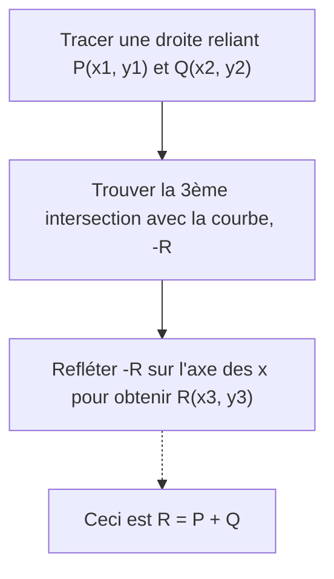
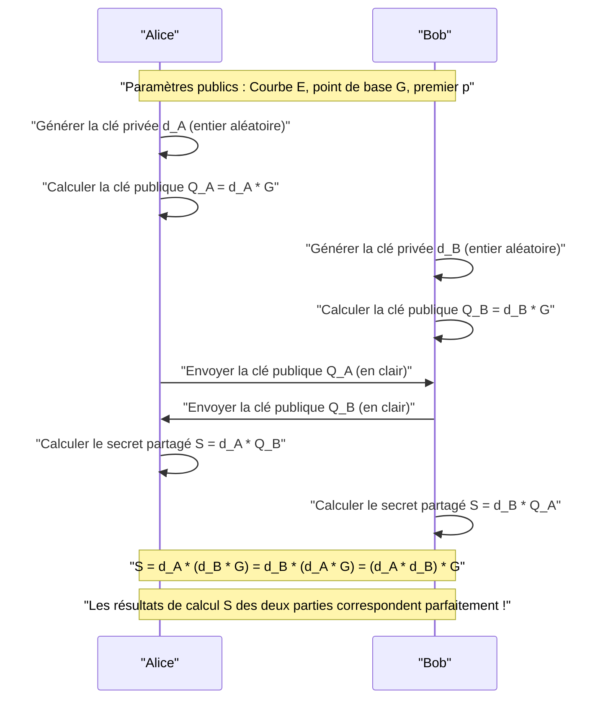
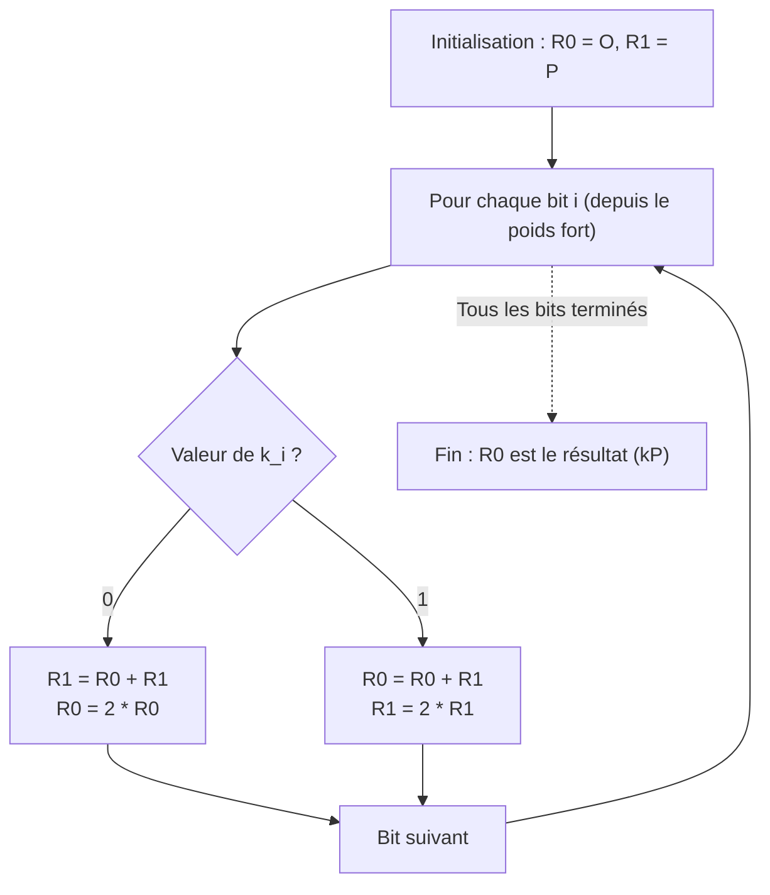

# Fondements mathématiques de la cryptographie sur les courbes elliptiques (ECC) et implémentation en C++

Dans les technologies de cryptographie modernes, la **cryptographie sur les courbes elliptiques (Elliptic Curve Cryptography : ECC)** joue un rôle extrêmement important. De nos communications Internet quotidiennes (HTTPS/TLS) aux enclaves sécurisées des smartphones, en passant par l'authentification des serveurs via SSH, l'authentification sans mot de passe comme FIDO, et même les crypto-actifs tels que Bitcoin et Ethereum, on peut dire sans exagérer que la base de confiance de la société numérique moderne est soutenue par l'ECC.

Dans cet article, nous expliquerons en profondeur, avec un volume de contenu impressionnant, le fonctionnement de cette cryptographie sur les courbes elliptiques. Nous partirons de la théorie mathématique sous-jacente, belle mais complexe (géométrie algébrique sur les corps finis), pour aller jusqu'à la méthode d'implémentation réelle en C++, et enfin aux techniques de codage sécurisé pour prévenir les attaques par canaux auxiliaires (attaques temporelles).

---

## 1. Pourquoi la cryptographie sur les courbes elliptiques ? (Comparaison avec RSA)

Pendant longtemps, le synonyme de cryptographie à clé publique a été la **cryptographie RSA**. La sécurité de RSA repose sur la "difficulté de la factorisation en nombres premiers de très grands nombres composés". Cependant, avec l'amélioration de la puissance de calcul des ordinateurs, il a été nécessaire d'allonger continuellement la taille des clés RSA (le nombre de bits du module) pour maintenir la sécurité. Aujourd'hui, une taille de clé d'au moins 2048 bits est recommandée, voire 3072 bits ou 4096 bits pour plus de sécurité.

En revanche, la cryptographie sur les courbes elliptiques (ECC) repose sur une autre difficulté mathématique appelée le **"problème du logarithme discret sur les courbes elliptiques (ECDLP)"**. Jusqu'à présent, aucun algorithme efficace (comme les algorithmes en temps sous-exponentiel) pour résoudre l'ECDLP n'a été découvert, et même les méthodes d'attaque les plus efficaces connues nécessitent un temps exponentiel.

Grâce à cette propriété, l'ECC possède l'avantage décisif de **pouvoir atteindre un niveau de sécurité équivalent à celui de RSA avec une taille de clé beaucoup plus courte**.

| Niveau de sécurité (bits) | Taille de clé RSA (bits) | Taille de clé ECC (bits) | Ratio des tailles de clé |
| :---: | :---: | :---: | :---: |
| 80 | 1024 | 160 | 1:6 |
| 112 | 2048 | 224 | 1:9 |
| 128 | 3072 | 256 | 1:12 |
| 192 | 7680 | 384 | 1:20 |
| 256 | 15360 | 512 | 1:30 |

Comme le montre le tableau ci-dessus, pour obtenir un niveau de sécurité de 128 bits (le standard actuel), RSA nécessite une clé de 3072 bits, alors que l'ECC ne nécessite que 256 bits. Cela permet de réduire la quantité de calculs, l'utilisation de la mémoire et d'économiser la bande passante du réseau. L'ECC présente ainsi une supériorité écrasante, en particulier dans les environnements aux ressources limitées comme les appareils IoT et les cartes à puce.

---

## 2. Prérequis mathématiques : La théorie des groupes et le monde des corps finis

Pour véritablement comprendre la cryptographie sur les courbes elliptiques, il est nécessaire de maîtriser les concepts de base de l'algèbre abstraite (théorie des groupes et théorie des corps). Nous résumons ici brièvement les connaissances préalables pour construire l'ECC.

### 2.1. Groupes (Group) et Groupes abéliens
Un **groupe (Group)** est défini par un ensemble $G$ et une opération binaire sur cet ensemble (nous utiliserons ici l'addition $+$) formant une paire $(G, +)$ qui satisfait aux 4 axiomes suivants :

1. **Clôture (Closure)** : Pour tous $a, b \in G$, $a + b \in G$.
2. **Associativité (Associativity)** : Pour tous $a, b, c \in G$, $(a + b) + c = a + (b + c)$.
3. **Existence de l'élément neutre (Identity element)** : Il existe un élément $e \in G$ tel que pour tout $a \in G$, $a + e = e + a = a$. Dans le cas d'un groupe additif, cet élément neutre est généralement noté $0$ ou $\mathcal{O}$.
4. **Existence de l'inverse (Inverse element)** : Pour tout $a \in G$, il existe un élément $b \in G$ tel que $a + b = b + a = e$. Ce $b$ est noté $-a$.

De plus, un groupe qui satisfait la condition suivante, où l'ordre des opérations ne change pas le résultat, est appelé un **groupe abélien (ou groupe commutatif)** :

5. **Commutativité (Commutativity)** : Pour tous $a, b \in G$, $a + b = b + a$.

L'ensemble des points sur une courbe elliptique forme ce **groupe abélien** en définissant une règle d'addition spécifique.

### 2.2. Corps finis (Finite Field)
Dans la théorie cryptographique, nous n'utilisons pas des corps ayant un nombre infini et continu d'éléments comme les nombres réels ou complexes, mais plutôt des **corps finis (Finite Field)** ou corps de Galois (Galois Field), dont le nombre d'éléments est fini.

Le corps fini le plus fondamental est le **corps premier $\mathbb{F}_p$** utilisant un nombre premier $p$. Il s'agit de l'ensemble des entiers $\{0, 1, 2, \dots, p-1\}$ muni des quatre opérations arithmétiques (addition, soustraction, multiplication, division) définies modulo $p$ (le reste de la division par $p$).

- **Addition** : $(a + b) \pmod p$
- **Soustraction** : $(a - b) \pmod p$
- **Multiplication** : $(a \times b) \pmod p$
- **Division** : $a \times b^{-1} \pmod p$ (où $b^{-1}$ est l'inverse multiplicatif de $b$ modulo $p$)

Le calcul de l'**inverse multiplicatif (Modular Multiplicative Inverse)** est extrêmement important dans l'implémentation cryptographique. Pour trouver $b^{-1}$ satisfaisant $b \times b^{-1} \equiv 1 \pmod p$, les deux algorithmes suivants sont principalement utilisés :

1. **Algorithme d'Euclide étendu (Extended Euclidean Algorithm)** : Il est rapide, mais selon l'implémentation, le temps de traitement dépend des valeurs d'entrée, ce qui présente un risque d'attaque temporelle.
2. **Petit théorème de Fermat (Fermat's Little Theorem)** : Lorsque $p$ est un nombre premier et $b \neq 0$, $b^{p-1} \equiv 1 \pmod p$ est vrai. En divisant les deux côtés par $b$, on obtient $b^{p-2} \equiv b^{-1} \pmod p$. Autrement dit, l'inverse peut être trouvé en calculant $b$ à la puissance $p-2$. Comme l'opération d'exponentiation est plus facile à implémenter en temps constant, elle est préférée dans les implémentations cryptographiques.

---

## 3. L'équation de la courbe elliptique et géométrie

### 3.1. Forme normale de Weierstrass
Une **courbe elliptique (Elliptic Curve)** est une courbe plane généralement définie par l'équation suivante, appelée **forme normale de Weierstrass (Weierstrass normal form)** :

$$ y^2 = x^3 + ax + b $$

Ici, $a$ et $b$ sont des constantes, et pour que la courbe n'ait pas de points singuliers (auto-intersections ou points de rebroussement) (pour qu'elle soit une courbe lisse), la condition est que le **discriminant (Discriminant) $\Delta$** suivant ne soit pas nul :

$$ \Delta = -16(4a^3 + 27b^2) \neq 0 $$

Les courbes avec des points singuliers compromettent la sécurité cryptographique, c'est pourquoi on choisit toujours des coefficients $a, b$ qui satisfont à cette condition.

### 3.2. Le point à l'infini (Point at Infinity)
Pour faire de la courbe elliptique un groupe mathématiquement complet, en plus des points sur le plan, un point virtuel appelé **"point à l'infini (Point at Infinity)"** est introduit. Il est noté $\mathcal{O}$ (O majuscule).

Le point à l'infini $\mathcal{O}$ est défini comme le point où toutes les lignes verticales se croisent à l'infini. Dans la théorie des groupes, ce point à l'infini $\mathcal{O}$ fonctionne comme **l'élément neutre de l'addition** (zéro).

Autrement dit, pour tout point $P$ sur la courbe :
$$ P + \mathcal{O} = \mathcal{O} + P = P $$

De plus, l'inverse $-P$ du point $P = (x, y)$ est défini comme le point symétrique par rapport à l'axe des x, soit $(x, -y)$. Par conséquent :
$$ P + (-P) = \mathcal{O} $$

---

## 4. Opérations de groupe sur la courbe elliptique (Addition de points et doublement)

Le fondement de la cryptographie sur les courbes elliptiques est l'opération d'**"addition (Addition)"** de points sur la courbe. Ceci est différent de l'addition d'entiers ordinaires et est défini sur la base d'opérations géométriques.

### 4.1. Addition géométrique (Méthode de la tangente et de la sécante)
La procédure pour ajouter deux points distincts $P$ et $Q$ sur la courbe pour obtenir un nouveau point $R$ ($R = P + Q$) est la suivante :

1. Tracez une ligne droite (sécante) passant par les points $P$ et $Q$.
2. Cette droite coupera toujours la courbe elliptique en un autre point (que nous appellerons $-R$). (*Selon un théorème de la géométrie algébrique)
3. Le point symétrique de l'intersection $-R$ par rapport à l'axe des x (le point avec le signe de la coordonnée y inversé) est le point recherché $R$.



### 4.2. Doublement de point (Point Doubling)
Lorsque l'on ajoute le même point $P$ à $P$ ($P + P = 2P$), on ne peut pas tracer une ligne passant par deux points. Dans ce cas, nous tracons **la tangente (Tangent) à la courbe au point $P$**.

1. Tracez la tangente à la courbe au point $P$.
2. Cette tangente coupera la courbe en un autre point $-R$.
3. Le point symétrique de cette intersection par rapport à l'axe des x est le point recherché $R = 2P$.

### 4.3. Formules de calcul algébrique
Nous transposons les opérations géométriques en formules algébriques afin qu'elles puissent être calculées par un ordinateur.
Tous les calculs sont effectués **sur le corps fini $\mathbb{F}_p$ (modulo $p$)**.

Soient le point $P = (x_1, y_1)$ et le point $Q = (x_2, y_2)$.
Et soit le point de résultat calculé $R = P + Q = (x_3, y_3)$.

Soit $\lambda$ (lambda) la pente de la droite.

**[Cas 1 : Lorsque $P \neq Q$ (Addition de points)]**
La pente $\lambda$ est le taux de variation entre les deux points.
$$ \lambda \equiv \frac{y_2 - y_1}{x_2 - x_1} \pmod p $$
$$ \lambda \equiv (y_2 - y_1) \cdot (x_2 - x_1)^{-1} \pmod p $$

En utilisant ce $\lambda$, $x_3, y_3$ sont calculés comme suit :
$$ x_3 \equiv \lambda^2 - x_1 - x_2 \pmod p $$
$$ y_3 \equiv \lambda(x_1 - x_3) - y_1 \pmod p $$

**[Cas 2 : Lorsque $P = Q$ (Doublement de point)]**
La pente $\lambda$ est la pente de la tangente obtenue par dérivation. (On dérive implicitement $y^2 = x^3 + ax + b$)
$$ 2y \cdot y' = 3x^2 + a \implies y' = \frac{3x^2 + a}{2y} $$
Par conséquent,
$$ \lambda \equiv (3x_1^2 + a) \cdot (2y_1)^{-1} \pmod p $$

Les équations pour $x_3, y_3$ ont la même forme que l'addition, mais puisque $x_2 = x_1$, elles deviennent :
$$ x_3 \equiv \lambda^2 - 2x_1 \pmod p $$
$$ y_3 \equiv \lambda(x_1 - x_3) - y_1 \pmod p $$

> [!IMPORTANT]
> Ces formules contiennent des **divisions (calcul de l'inverse modulo)** telles que $(x_2 - x_1)^{-1}$ et $(2y_1)^{-1}$. Le calcul de l'inverse modulo ayant un coût de calcul très élevé, les implémentations réelles utilisent généralement des systèmes de coordonnées projectives comme les **"coordonnées jacobiennes (Jacobian Coordinates)"** pour retarder la division.

---

## 5. Multiplication scalaire et problème du logarithme discret sur les courbes elliptiques (ECDLP)

Dans la cryptographie sur les courbes elliptiques, l'opération qui demande le plus de calculs et qui constitue le cœur de la sécurité est la **multiplication scalaire (Scalar Multiplication)**.

### 5.1. Qu'est-ce que la multiplication scalaire ?
L'opération consistant à additionner un certain point $P$, $k$ fois est appelée multiplication scalaire, notée $kP$.
$$ kP = \underbrace{P + P + \dots + P}_{k\text{ fois}} $$

Ici, $k$ est un très grand nombre entier (par exemple, un entier de 256 bits).

### 5.2. Problème du logarithme discret sur les courbes elliptiques (ECDLP)
La sécurité de l'ECC dépend de la difficulté du problème suivant :

> **Problème du logarithme discret sur les courbes elliptiques (Elliptic Curve Discrete Logarithm Problem : ECDLP)**
> Étant donné un point connu $P$ (point de base) et un point calculé $Q$, trouver le scalaire $k$ tel que $Q = kP$.

Il est facile (en temps polynomial) de calculer $Q$ à partir de $k$ et $P$ (sens direct) en utilisant l'algorithme décrit plus loin, mais il est pratiquement impossible de calculer à l'envers $k$ à partir de $P$ et $Q$ (sens inverse), car il n'existe pas de méthode efficace autre que la recherche exhaustive (fonction à sens unique).
Dans les protocoles cryptographiques, **$k$ correspond à la "clé privée" et $Q$ à la "clé publique"**.

### 5.3. L'algorithme Double-and-Add
Lorsque $k$ est un nombre énorme (par exemple, $2^{256}$), l'addition naïve de $P$ $k$ fois ne se terminerait pas avant la fin de l'univers. Par conséquent, pour effectuer rapidement la multiplication scalaire, on utilise la méthode **Double-and-Add (méthode binaire)**.

C'est la version courbe elliptique de l'"exponentiation rapide" utilisée pour calculer rapidement les puissances entières. Le scalaire $k$ est représenté en binaire, et traité dans l'ordre, du bit de poids fort au bit de poids faible.

1. Initialiser le point de résultat $R$ avec $\mathcal{O}$.
2. Répéter ce qui suit du bit de poids fort de $k$ jusqu'au bit de poids faible :
   - Doubler $R$ (Point Doubling : $R = 2R$)
   - Si le bit actuel est `1`, ajouter $P$ à $R$ (Point Addition : $R = R + P$)

Grâce à cet algorithme, la complexité passe de $O(k)$ à $O(\log_2 k)$ de façon drastique, permettant des calculs dans un temps réaliste (de l'ordre de la milliseconde).

---

## 6. L'échange de clés Diffie-Hellman sur courbes elliptiques (ECDH)

Nous expliquons ici le fonctionnement du **protocole d'échange de clés ECDH (Elliptic Curve Diffie-Hellman)**, qui est l'application la plus représentative de l'ECC. L'ECDH est un mécanisme permettant à Alice et Bob de générer et de partager en toute sécurité une clé secrète commune (clé de session) sur un canal de communication vulnérable à l'écoute (c'est le cœur du handshake TLS).

**[Paramètres préalables (Paramètres de domaine)]**
Les deux parties partagent au préalable la courbe elliptique $E$ à utiliser, le nombre premier $p$ et le point de base $G$. (Par exemple NIST P-256 ou secp256k1)



Un attaquant (Eve) peut intercepter $G$, $Q_A$ et $Q_B$ circulant sur le canal de communication, mais en raison de la difficulté de l'ECDLP, il ne peut pas déduire la clé privée d'Alice $d_A$ à partir de $Q_A = d_A \cdot G$. De plus, multiplier $Q_A$ et $Q_B$ ne donne pas la clé partagée $S$, donc un attaquant ne peut pas calculer $S$.

---

## 7. Pièges d'implémentation : Attaques par canaux auxiliaires et contre-mesures

Même avec un algorithme cryptographique théoriquement parfait, des vulnérabilités peuvent apparaître lors du processus d'implémentation du programme. C'est ce qu'on appelle les **"attaques par canaux auxiliaires (Side-Channel Attack)"**.

### 7.1. Attaque temporelle (Timing Attack)
Revenons sur l'algorithme Double-and-Add mentionné précédemment.

```cpp
// Pseudo-code vulnérable du Double-and-Add
Point R = Point::Infinity;
for (int i = 255; i >= 0; i--) {
    R = PointDoubling(R);         // Toujours exécuté
    if (bit(k, i) == 1) {
        R = PointAddition(R, P);  // Exécuté uniquement quand le bit est à 1 !
    }
}
```

Cette implémentation présente un défaut fatal. Comme la Point Addition est exécutée lorsque le bit est `1`, le temps de calcul est **légèrement plus long** que lorsque le bit est `0`. De plus, la prédiction de branchement du processeur et le comportement de la mémoire cache changent.
En observant statistiquement cette infime différence de temps de calcul (ou de consommation d'énergie) des milliers de fois, un attaquant peut **récupérer complètement la séquence de bits de la clé privée $k$ un par un**. C'est une attaque temporelle.

### 7.2. Implémentation en temps constant (Constant-Time) : L'échelle de Montgomery (Montgomery Ladder)
Pour empêcher les attaques temporelles, il est nécessaire d'adopter un algorithme dont **la séquence d'instructions exécutées et le temps de calcul sont toujours constants (Constant-Time), quelle que soit la valeur des bits de la clé privée**.

L'exemple le plus représentatif est l'**échelle de Montgomery (Montgomery Ladder)**.



La beauté de l'échelle de Montgomery réside dans le fait que, que le bit soit `0` ou `1`, **"exactement 1 Point Addition et 1 Point Doubling"** sont toujours exécutés. Cela élimine complètement la dépendance des données sur le temps de calcul.

Cependant, si le branchement conditionnel (`if (k_i == 0)`) lui-même existe, il reste un risque que le temps d'exécution fluctue en raison des optimisations du compilateur ou de la prédiction de branchement du processeur. Par conséquent, dans les implémentations réelles en temps constant, les branchements conditionnels (instructions `if`) sont éliminés, et un **échange conditionnel utilisant des opérations bit à bit (Conditional Swap)** est utilisé.

---

## 8. Implémentation de la cryptographie sur les courbes elliptiques en C++

À partir de là, nous allons traduire la théorie en code C++. Les bibliothèques cryptographiques pratiques (telles que OpenSSL ou libsodium) utilisent des optimisations avancées en assembleur et des systèmes de coordonnées jacobiennes, mais ici, pour approfondir la compréhension mathématique, nous présenterons le squelette d'une **implémentation claire en temps constant utilisant des coordonnées affines**.

Nous supposerons l'utilisation de `boost::multiprecision::cpp_int` pour les opérations sur les très grands entiers.

### 8.1. Arithmétique modulaire et inverse
Tout d'abord, nous définissons des fonctions d'aide pour les opérations sur les corps finis. Nous implémentons le calcul de l'inverse en utilisant le petit théorème de Fermat.

```cpp
#include <iostream>
#include <vector>
#include <stdexcept>
#include <boost/multiprecision/cpp_int.hpp>

using namespace boost::multiprecision;

// Exemple avec le premier p et les paramètres de secp256k1
const cpp_int p("0xFFFFFFFFFFFFFFFFFFFFFFFFFFFFFFFFFFFFFFFFFFFFFFFFFFFFFFFEFFFFFC2F");
const cpp_int a = 0;
const cpp_int b = 7;

// Opération modulo retournant un reste positif
cpp_int mod(cpp_int x, cpp_int m) {
    cpp_int r = x % m;
    return r < 0 ? r + m : r;
}

// Calcul de l'exponentiation modulaire (x^y mod m)
cpp_int powerMod(cpp_int base, cpp_int exp, cpp_int m) {
    cpp_int res = 1;
    base = mod(base, m);
    while (exp > 0) {
        if (exp % 2 == 1) res = mod(res * base, m);
        base = mod(base * base, m);
        exp /= 2;
    }
    return res;
}

// Inverse modulo utilisant le petit théorème de Fermat
cpp_int modInverse(cpp_int n, cpp_int m) {
    // Prémisse que m est premier : n^(m-2) ≡ n^(-1) mod m
    return powerMod(n, m - 2, m);
}
```

### 8.2. Représentation des points et opérations de groupe (Addition, Doublement)
Nous définissons une structure `Point` qui gère le point à l'infini avec un drapeau, et nous implémentons les formules d'addition.

```cpp
struct Point {
    cpp_int x;
    cpp_int y;
    bool isInfinity;

    // Création d'un point à l'infini
    Point() : x(0), y(0), isInfinity(true) {}
    
    // Création d'un point normal
    Point(cpp_int x, cpp_int y) : x(x), y(y), isInfinity(false) {}
};

// Addition de points sur la courbe elliptique (R = P + Q)
Point pointAdd(const Point& P, const Point& Q) {
    if (P.isInfinity) return Q;
    if (Q.isInfinity) return P;

    if (P.x == Q.x && mod(P.y + Q.y, p) == 0) {
        return Point(); // P + (-P) = Point à l'infini
    }

    cpp_int lambda;
    if (P.x == Q.x && P.y == Q.y) {
        // Point Doubling (Cas où P = Q)
        // lambda = (3x^2 + a) / 2y
        cpp_int num = mod(3 * P.x * P.x + a, p);
        cpp_int den = modInverse(mod(2 * P.y, p), p);
        lambda = mod(num * den, p);
    } else {
        // Point Addition (Cas où P != Q)
        // lambda = (y2 - y1) / (x2 - x1)
        cpp_int num = mod(Q.y - P.y, p);
        cpp_int den = modInverse(mod(Q.x - P.x, p), p);
        lambda = mod(num * den, p);
    }

    cpp_int x3 = mod(lambda * lambda - P.x - Q.x, p);
    cpp_int y3 = mod(lambda * (P.x - x3) - P.y, p);

    return Point(x3, y3);
}
```

### 8.3. Implémentation du Conditional Swap en temps constant
Lors de l'échange du contenu des variables basé sur la valeur du bit de la clé privée, nous effectuons l'échange uniquement avec des opérations bit à bit (masque) sans utiliser l'instruction `if`. Cela garantit que le chemin d'exécution reste parfaitement constant.

> [!TIP]
> Dans une implémentation réelle, une classe d'entiers à précision multiple allouée dynamiquement comme `cpp_int` ne convient pas au traitement en temps constant. En effet, des informations temporelles fuient en raison des allocations de mémoire et des variations de taille des tableaux. Les bibliothèques pratiques les représentent sous forme de taille fixe (par exemple, un tableau de uint64_t × 4 éléments) et implémentent le traitement des masques au niveau du bit. Voici un exemple conceptuel.

```cpp
// Conditional Swap conceptuel en temps constant (supposant des entiers de taille fixe)
// Si le bit est 1, échanger P1 et P2, sinon ne pas échanger
void cswap(Point& P1, Point& P2, uint8_t bit) {
    // bit vaut 0 ou 1. Le masque est tout à 1 (0xFF..) si bit=1, et tout à 0 si bit=0.
    // (Ici pour l'explication, nous supposons que chaque mot de la classe BigInt de taille fixe est w)
    /*
    uint64_t mask = 0 - (uint64_t)bit;
    for (int i = 0; i < NUM_WORDS; i++) {
        uint64_t dummy = mask & (P1.x.words[i] ^ P2.x.words[i]);
        P1.x.words[i] ^= dummy;
        P2.x.words[i] ^= dummy;
        // Traiter les coordonnées y et le drapeau isInfinity de la même manière
    }
    */
    
    // * Un échange parfait en temps constant est difficile avec boost::multiprecision,
    // donc nous nous limitons ici à une simulation par branchement pour la compréhension de la logique.
    if (bit == 1) {
        std::swap(P1, P2);
    }
}
```

### 8.4. Multiplication scalaire avec l'échelle de Montgomery
En combinant les `pointAdd` et `cswap` précédents, nous implémentons une multiplication scalaire sécurisée.

```cpp
// Multiplication scalaire k * P (Méthode Montgomery Ladder)
Point scalarMultiply(const Point& P, cpp_int k) {
    Point R0 = Point(); // Point à l'infini
    Point R1 = P;

    // Obtenir la longueur en bits de k (256 bits pour secp256k1)
    int numBits = 256; 
    
    for (int i = numBits - 1; i >= 0; i--) {
        // Obtenir la valeur du i-ème bit (0 ou 1)
        uint8_t bit = static_cast<uint8_t>(bit_test(k, i) ? 1 : 0);

        // Si bit == 1, échanger R0 et R1
        cswap(R0, R1, bit);

        // Toujours exécuter les mêmes opérations (Point Addition et Point Doubling)
        R1 = pointAdd(R0, R1);
        R0 = pointAdd(R0, R0);

        // Si bit == 1, échanger à nouveau pour restaurer l'état
        cswap(R0, R1, bit);
    }

    return R0;
}
```

Avec cette logique d'implémentation, que chaque bit du scalaire $k$ soit `0` ou `1`, les opérations exécutées dans chaque itération de la boucle (`cswap` $\to$ `pointAdd` $\to$ `pointAdd` $\to$ `cswap`) suivent exactement le même flux. Cela empêche efficacement la fuite d'informations secrètes via des différences de timing ou de modèles d'accès au cache.

---

## 9. Conclusion

La cryptographie sur les courbes elliptiques (ECC) peut sembler mystérieuse à première vue : "Comment une opération géométrique consistant à tracer une droite et refléter son intersection peut-elle devenir une cryptographie ?". Cependant, en la mappant sur le monde discret des corps finis, on peut construire une magnifique fonction à sens unique (problème du logarithme discret), fruit d'une fusion miraculeuse entre les mathématiques et la cryptographie.

Cet article a expliqué les points importants suivants :

1. **Supériorité par rapport à RSA** : Offre une sécurité forte avec une taille de clé très courte, ce qui est optimal pour l'ère moderne du mobile et de l'IoT.
2. **Fondements de la théorie des groupes et des corps finis** : Les structures mathématiques sur lesquelles repose l'ECC.
3. **Formules d'addition et de doublement** : Méthode d'implémentation des opérations algébriques de groupe à l'aide de l'équation de Weierstrass.
4. **Menace des attaques par canaux auxiliaires** : Le fait que les branchements conditionnels dépendants des bits de la clé privée créent une vulnérabilité fatale.
5. **Implémentation en temps constant (Constant-Time)** : Technique de codage en C++ pour homogénéiser le comportement au niveau matériel et prévenir les attaques à l'aide du Montgomery Ladder et du Conditional Swap.

Écrire soi-même une bibliothèque cryptographique fonctionnant en environnement de production est fortement déconseillé ("Don't roll your own crypto") car les risques de sécurité sont extrêmement élevés. Cependant, comprendre en profondeur les algorithmes et le contexte mathématique qui fonctionnent en son sein devrait être une arme incroyablement puissante pour les ingénieurs concevant et exploitant des systèmes plus sécurisés et plus performants.

Dans le prochain article, nous approfondirons le mécanisme de l'**ECDSA (Elliptic Curve Digital Signature Algorithm)**, un algorithme de signature numérique utilisant ces courbes elliptiques, ainsi que les **signatures de Schnorr** adoptées par Bitcoin.

