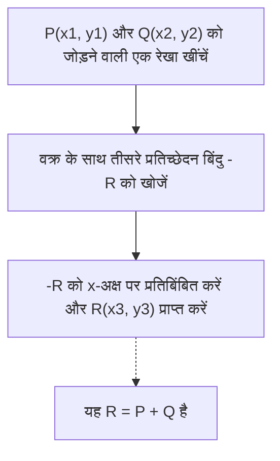
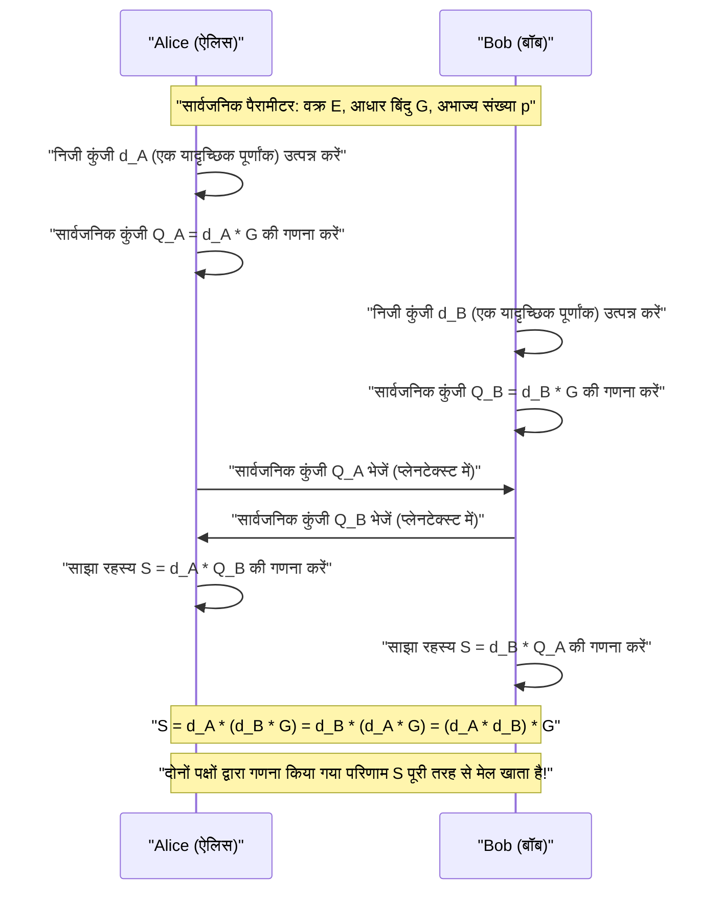
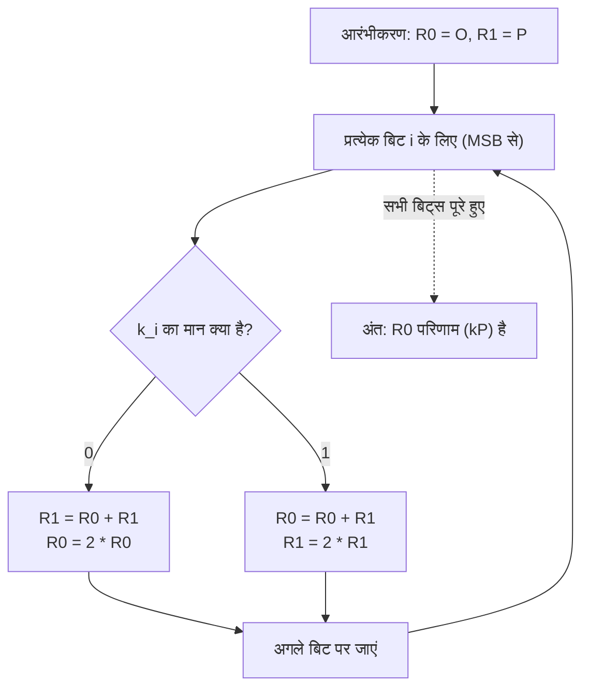

# एलिप्टिक कर्व क्रिप्टोग्राफी (ECC) का गणितीय आधार और C++ में इसका कार्यान्वयन

आधुनिक क्रिप्टोग्राफी में, **एलिप्टिक कर्व क्रिप्टोग्राफी (Elliptic Curve Cryptography: ECC)** अत्यंत महत्वपूर्ण भूमिका निभाती है। हमारे दैनिक इंटरनेट संचार (HTTPS/TLS) से लेकर, स्मार्टफोन के सुरक्षित एन्क्लेव, SSH के माध्यम से सर्वर प्रमाणीकरण, FIDO जैसे पासवर्ड रहित प्रमाणीकरण, और यहाँ तक कि बिटकॉइन और एथेरियम जैसी क्रिप्टो संपत्तियों तक, यह कहना अतिशयोक्ति नहीं होगी कि आधुनिक डिजिटल समाज का विश्वास आधार ECC द्वारा समर्थित है।

इस लेख में, हम विस्तार से समझाएंगे कि एलिप्टिक कर्व क्रिप्टोग्राफी कैसे काम करती है, इसके पीछे के सुंदर लेकिन जटिल गणितीय सिद्धांत (परिमित क्षेत्र पर बीजगणितीय ज्यामिति) से शुरू करते हुए, वास्तविक C++ का उपयोग करके कार्यान्वयन विधि, और यहां तक कि साइड-चैनल हमलों (टाइमिंग हमलों) को रोकने के लिए सुरक्षित कोडिंग तकनीक तक।

---

## 1. एलिप्टिक कर्व क्रिप्टोग्राफी क्यों? (RSA के साथ तुलना)

पब्लिक-की क्रिप्टोग्राफी का पर्याय लंबे समय से **RSA एन्क्रिप्शन** रहा है। RSA एन्क्रिप्शन अपनी सुरक्षा के आधार के रूप में "बड़े समग्र संख्याओं के अभाज्य गुणनखंडन की कठिनाई" पर निर्भर करता है। हालांकि, कंप्यूटर की गणना क्षमता में सुधार के साथ, सुरक्षा बनाए रखने के लिए RSA की कुंजी की लंबाई (मोडुलस के बिट्स की संख्या) को लगातार बढ़ाने की आवश्यकता उत्पन्न हुई है। वर्तमान में, कम से कम 2048 बिट्स, और अधिक सुरक्षित होने के लिए 3072 बिट्स या 4096 बिट्स की कुंजी की लंबाई की सिफारिश की जाती है।

इसके विपरीत, एलिप्टिक कर्व क्रिप्टोग्राफी (ECC) अपनी सुरक्षा के लिए **"एलिप्टिक कर्व पर असतत लघुगणक समस्या (Discrete Logarithm Problem on Elliptic Curves - ECDLP)"** नामक एक अलग गणितीय कठिनाई पर निर्भर करता है। ECDLP को हल करने के लिए आज तक कोई कुशल एल्गोरिदम (जैसे सब-एक्सपोनेंशियल टाइम एल्गोरिदम) नहीं खोजा जा सका है, और यहां तक कि ज्ञात सबसे कुशल हमले के तरीके भी घातांकीय (exponential) समय लेते हैं।

इस गुण के कारण, ECC का यह निर्णायक लाभ है कि यह **बहुत छोटी कुंजी की लंबाई के साथ RSA के समान सुरक्षा शक्ति प्राप्त कर सकता है**।

| सुरक्षा शक्ति (बिट्स) | RSA एन्क्रिप्शन कुंजी की लंबाई (बिट्स) | एलिप्टिक कर्व क्रिप्टोग्राफी कुंजी की लंबाई (बिट्स) | कुंजी की लंबाई का अनुपात |
| :---: | :---: | :---: | :---: |
| 80 | 1024 | 160 | 1:6 |
| 112 | 2048 | 224 | 1:9 |
| 128 | 3072 | 256 | 1:12 |
| 192 | 7680 | 384 | 1:20 |
| 256 | 15360 | 512 | 1:30 |

जैसा कि ऊपर दी गई तालिका दिखाती है, 128-बिट सुरक्षा शक्ति (वर्तमान मानक शक्ति) प्राप्त करने के लिए, RSA को 3072-बिट कुंजी की आवश्यकता होती है, लेकिन ECC के साथ केवल 256 बिट्स की आवश्यकता होती है। इससे गणना को कम करना, मेमोरी के उपयोग को कम करना और नेटवर्क बैंडविड्थ को सहेजना संभव हो जाता है, जिससे यह विशेष रूप से सीमित संसाधनों वाले IoT उपकरणों और स्मार्ट कार्ड वातावरण में अत्यधिक फायदेमंद हो जाता है।

---

## 2. गणितीय तैयारी: समूह सिद्धांत (Group Theory) और परिमित क्षेत्र (Finite Fields) की दुनिया

एलिप्टिक कर्व क्रिप्टोग्राफी को वास्तव में समझने के लिए, सार बीजगणित (समूह सिद्धांत और क्षेत्र सिद्धांत) की बुनियादी अवधारणाओं को समझना आवश्यक है। यहाँ हम ECC के निर्माण के लिए आवश्यक पूर्वज्ञान का संक्षेप में सारांश दे रहे हैं।

### 2.1. समूह (Group) और एबेलियन समूह (Abelian Group)
**समूह (Group)** एक सेट $G$ और उस सेट पर एक बाइनरी ऑपरेशन (यहाँ हम जोड़ $+$ मानेंगे) का संयोजन $(G, +)$ है, जो निम्नलिखित 4 स्वयंसिद्धों (axioms) को पूरा करता है।

1. **संवृतता (Closure)**: किन्हीं $a, b \in G$ के लिए, $a + b \in G$ होता है।
2. **साहचर्य (Associativity)**: किन्हीं $a, b, c \in G$ के लिए, $(a + b) + c = a + (b + c)$ लागू होता है।
3. **तत्समक अवयव का अस्तित्व (Identity element)**: किसी भी $a \in G$ के लिए, एक ऐसा अवयव $e \in G$ मौजूद होता है कि $a + e = e + a = a$। एक योगात्मक समूह (additive group) के मामले में, इस तत्समक अवयव को आमतौर पर $0$ या $\mathcal{O}$ के रूप में दर्शाया जाता है।
4. **प्रतिलोम अवयव का अस्तित्व (Inverse element)**: किसी भी $a \in G$ के लिए, एक ऐसा अवयव $b \in G$ मौजूद होता है कि $a + b = b + a = e$। इस $b$ को $-a$ के रूप में दर्शाया जाता है।

इसके अलावा, एक समूह जिसमें संक्रियाओं के क्रम को बदलने से परिणाम नहीं बदलता है, अर्थात जो निम्नलिखित शर्त को पूरा करता है, उसे **एबेलियन समूह (Abelian group या क्रमविनिमेय समूह)** कहा जाता है।

5. **क्रमविनिमेयता (Commutativity)**: किन्हीं $a, b \in G$ के लिए, $a + b = b + a$ लागू होता है।

एलिप्टिक कर्व पर बिंदुओं का सेट, एक विशिष्ट जोड़ नियम को परिभाषित करके, इस **एबेलियन समूह** का निर्माण करता है।

### 2.2. परिमित क्षेत्र (Finite Field)
क्रिप्टोग्राफी में, हम वास्तविक या सम्मिश्र संख्याओं जैसे निरंतर और असीम अवयवों वाले क्षेत्रों के बजाय **परिमित क्षेत्र (Finite Field)** या गैलवा क्षेत्र (Galois Field) का उपयोग करते हैं, जिनमें अवयवों की संख्या परिमित होती है।

सबसे बुनियादी परिमित क्षेत्र अभाज्य संख्या $p$ का उपयोग करने वाला **अभाज्य क्षेत्र (Prime Field) $\mathbb{F}_p$** है। यह पूर्णांकों के सेट $\{0, 1, 2, \dots, p-1\}$ पर मॉड्यूलो $p$ (अर्थात $p$ से विभाजित करने पर शेषफल) के अंतर्गत चार बुनियादी अंकगणितीय संक्रियाओं (जोड़, घटाव, गुणा, भाग) को परिभाषित करता है।

- **जोड़**: $(a + b) \pmod p$
- **घटाव**: $(a - b) \pmod p$
- **गुणा**: $(a \times b) \pmod p$
- **भाग**: $a \times b^{-1} \pmod p$ (जहाँ $b^{-1}$ मॉड्यूलो $p$ के तहत $b$ का गुणनात्मक प्रतिलोम है)

**गुणनात्मक प्रतिलोम (Modular Multiplicative Inverse)** की गणना क्रिप्टोग्राफ़िक कार्यान्वयन में बहुत महत्वपूर्ण है। $b \times b^{-1} \equiv 1 \pmod p$ को संतुष्ट करने वाले $b^{-1}$ को खोजने के लिए मुख्य रूप से निम्नलिखित दो एल्गोरिदम का उपयोग किया जाता है।

1. **विस्तारित यूक्लिडियन एल्गोरिदम (Extended Euclidean Algorithm)**: यह तेज़ है, लेकिन कार्यान्वयन के आधार पर, प्रसंस्करण समय इनपुट मान पर निर्भर कर सकता है, जिससे टाइमिंग हमलों का जोखिम होता है।
2. **फ़र्मेट का छोटा प्रमेय (Fermat's Little Theorem)**: जब $p$ एक अभाज्य संख्या है और $b \neq 0$ है, तो $b^{p-1} \equiv 1 \pmod p$ लागू होता है। दोनों पक्षों को $b$ से विभाजित करने पर, हमें $b^{p-2} \equiv b^{-1} \pmod p$ मिलता है। दूसरे शब्दों में, $b$ की घात $p-2$ की गणना करके प्रतिलोम पाया जा सकता है। चूंकि घातांकीकरण (exponentiation) को निरंतर समय (constant time) में लागू करना आसान होता है, इसलिए क्रिप्टोग्राफ़िक कार्यान्वयन में इसे प्राथमिकता दी जाती है।

---

## 3. एलिप्टिक कर्व के समीकरण और ज्यामिति

### 3.1. वियरस्ट्रास का सामान्य रूप (Weierstrass Normal Form)
**एलिप्टिक कर्व (Elliptic Curve)** आम तौर पर एक समतलीय वक्र (plane curve) होता है जिसे निम्नलिखित **वियरस्ट्रास के सामान्य रूप (Weierstrass normal form)** नामक समीकरण द्वारा परिभाषित किया जाता है।

$$ y^2 = x^3 + ax + b $$

यहाँ, $a$ और $b$ स्थिरांक हैं, और इस शर्त के रूप में कि वक्र में कोई एकवचन बिंदु (singular points जैसे स्व-प्रतिच्छेदन या कस्प) न हो (अर्थात यह एक चिकना वक्र हो), यह आवश्यक है कि निम्नलिखित **विविक्तकर (Discriminant) $\Delta$** शून्य न हो।

$$ \Delta = -16(4a^3 + 27b^2) \neq 0 $$

चूंकि एकवचन बिंदुओं वाले वक्र क्रिप्टोग्राफ़िक सुरक्षा से समझौता करते हैं, इसलिए गुणांक $a, b$ को हमेशा इस शर्त को पूरा करने के लिए चुना जाता है।

### 3.2. अनंत पर बिंदु (Point at Infinity)
एलिप्टिक कर्व को गणितीय रूप से पूर्ण समूह बनाने के लिए, हम समतल के बिंदुओं के अलावा **"अनंत पर बिंदु (Point at Infinity)"** नामक एक आभासी बिंदु पेश करते हैं। इसे $\mathcal{O}$ (ओ) के रूप में दर्शाया जाता है।

अनंत पर बिंदु $\mathcal{O}$ को उस बिंदु के रूप में परिभाषित किया गया है जहाँ सभी ऊर्ध्वाधर रेखाएँ अनंत में प्रतिच्छेद करती हैं। समूह सिद्धांत में, यह अनंत पर बिंदु $\mathcal{O}$ **जोड़ के तहत तत्समक अवयव** (शून्य) के रूप में कार्य करता है।

अर्थात, वक्र पर किसी भी बिंदु $P$ के लिए, निम्नलिखित लागू होता है।
$$ P + \mathcal{O} = \mathcal{O} + P = P $$

इसके अलावा, बिंदु $P = (x, y)$ का प्रतिलोम $-P$, x-अक्ष के सममित बिंदु $(x, -y)$ के रूप में परिभाषित किया गया है। इसलिए:
$$ P + (-P) = \mathcal{O} $$
होता है।

---

## 4. एलिप्टिक कर्व पर समूह संचालन (बिंदु जोड़ और दोहरीकरण)

एलिप्टिक कर्व क्रिप्टोग्राफी का मूल वक्र पर बिंदुओं के बीच **"जोड़ (Addition)"** का संचालन है। यह सामान्य पूर्णांकों के जोड़ से अलग है और ज्यामितीय संचालन के आधार पर परिभाषित किया गया है।

### 4.1. ज्यामितीय जोड़ (Tangent and Chord Method)
वक्र पर दो अलग-अलग बिंदुओं $P$ और $Q$ को जोड़कर एक नया बिंदु $R$ ($R = P + Q$) खोजने की प्रक्रिया इस प्रकार है।

1. बिंदु $P$ और बिंदु $Q$ से गुजरने वाली एक रेखा (जीवा/chord) खींचें।
2. यह रेखा हमेशा एलिप्टिक कर्व को एक और बिंदु पर प्रतिच्छेद करेगी (आइए इसे $-R$ कहें)। (*बीजगणितीय ज्यामिति के एक प्रमेय के अनुसार)
3. प्रतिच्छेदन बिंदु $-R$ को x-अक्ष पर प्रतिबिंबित करने (y-निर्देशांक के चिह्न को उलटने) से प्राप्त बिंदु, वांछित बिंदु $R$ है।



### 4.2. बिंदु का दोहरीकरण (Point Doubling)
जब एक ही बिंदु $P$ को बिंदु $P$ में जोड़ा जाता है ($P + P = 2P$), तो दो बिंदुओं से गुजरने वाली रेखा खींचना संभव नहीं है। इस मामले में, हम **बिंदु $P$ पर वक्र की स्पर्शरेखा (Tangent)** खींचते हैं।

1. बिंदु $P$ पर वक्र की स्पर्शरेखा खींचें।
2. यह स्पर्शरेखा वक्र को एक अन्य बिंदु $-R$ पर प्रतिच्छेद करती है।
3. प्रतिच्छेदन बिंदु को x-अक्ष पर प्रतिबिंबित करने से प्राप्त बिंदु वांछित बिंदु $R = 2P$ है।

### 4.3. बीजगणितीय गणना सूत्र
ज्यामितीय संक्रियाओं को बीजगणितीय सूत्रों में बदला जाता है ताकि कंप्यूटर द्वारा उनकी गणना की जा सके।
सभी गणनाएँ **परिमित क्षेत्र $\mathbb{F}_p$ (मॉड्यूलो $p$) पर** की जाती हैं।

मान लें कि बिंदु $P = (x_1, y_1)$ और बिंदु $Q = (x_2, y_2)$ हैं।
यह भी मान लें कि गणना के परिणाम का बिंदु $R = P + Q = (x_3, y_3)$ है।

मान लें कि रेखा का ढलान $\lambda$ (लैम्ब्डा) है।

**【स्थिति 1: $P \neq Q$ होने पर (बिंदु जोड़)】**
ढलान $\lambda$ दो बिंदुओं के बीच परिवर्तन की दर है।
$$ \lambda \equiv \frac{y_2 - y_1}{x_2 - x_1} \pmod p $$
$$ \lambda \equiv (y_2 - y_1) \cdot (x_2 - x_1)^{-1} \pmod p $$

इस $\lambda$ का उपयोग करके, $x_3, y_3$ निम्न प्रकार से ज्ञात किए जा सकते हैं।
$$ x_3 \equiv \lambda^2 - x_1 - x_2 \pmod p $$
$$ y_3 \equiv \lambda(x_1 - x_3) - y_1 \pmod p $$

**【स्थिति 2: $P = Q$ होने पर (बिंदु का दोहरीकरण)】**
ढलान $\lambda$ स्पर्शरेखा का ढलान है जिसे अवकलन (differentiation) द्वारा पाया जाता है। (हम $y^2 = x^3 + ax + b$ का अंतर्निहित अवकलन करते हैं)
$$ 2y \cdot y' = 3x^2 + a \implies y' = \frac{3x^2 + a}{2y} $$
इसलिए,
$$ \lambda \equiv (3x_1^2 + a) \cdot (2y_1)^{-1} \pmod p $$

$x_3, y_3$ के समीकरण जोड़ के समान रूप में हैं, लेकिन चूँकि $x_2 = x_1$ है, इसलिए वे निम्न प्रकार हो जाते हैं।
$$ x_3 \equiv \lambda^2 - 2x_1 \pmod p $$
$$ y_3 \equiv \lambda(x_1 - x_3) - y_1 \pmod p $$

> [!IMPORTANT]
> इन सूत्रों में $(x_2 - x_1)^{-1}$ और $(2y_1)^{-1}$ जैसे **विभाजन (मॉड्यूलर प्रतिलोम की गणना)** शामिल हैं। मॉड्यूलर प्रतिलोम की गणना की कम्प्यूटेशनल लागत बहुत अधिक होती है, इसलिए वास्तविक कार्यान्वयन में, **"जैकोबियन कोऑर्डिनेट्स (Jacobian Coordinates)"** जैसी प्रक्षेपीय समन्वय प्रणालियों (projective coordinate systems) का आमतौर पर उपयोग किया जाता है जो विभाजन को विलंबित करते हैं।

---

## 5. अदिश गुणन (Scalar Multiplication) और एलिप्टिक कर्व असतत लघुगणक समस्या (ECDLP)

एलिप्टिक कर्व क्रिप्टोग्राफी में, वह संक्रिया जिसमें सबसे अधिक गणना की आवश्यकता होती है और जो सुरक्षा का मूल है, वह **अदिश गुणन (Scalar Multiplication)** है।

### 5.1. अदिश गुणन क्या है?
किसी बिंदु $P$ को $k$ बार जोड़ने की क्रिया को अदिश गुणन कहा जाता है, और इसे $kP$ के रूप में दर्शाया जाता है।
$$ kP = \underbrace{P + P + \dots + P}_{k\text{ बार}} $$

यहाँ, $k$ एक बहुत बड़ा पूर्णांक है (उदाहरण के लिए, 256-बिट पूर्णांक)।

### 5.2. एलिप्टिक कर्व असतत लघुगणक समस्या (ECDLP)
एलिप्टिक कर्व क्रिप्टोग्राफी की सुरक्षा निम्नलिखित समस्या की कठिनाई पर निर्भर करती है।

> **एलिप्टिक कर्व असतत लघुगणक समस्या (Elliptic Curve Discrete Logarithm Problem: ECDLP)**
> एक ज्ञात बिंदु $P$ (आधार बिंदु) और एक गणना किए गए परिणामी बिंदु $Q$ को देखते हुए, अदिश (scalar) $k$ खोजें जो $Q = kP$ को संतुष्ट करता हो।

$k$ और $P$ से $Q$ की गणना करना (आगे की दिशा) बाद में वर्णित एल्गोरिदम का उपयोग करके आसान (बहुपद समय) है, लेकिन $P$ और $Q$ से $k$ की उल्टी गणना (विपरीत दिशा) करना लगभग असंभव है (यह एक वन-वे फ़ंक्शन है), सिवाय ब्रूट-फोर्स खोज के इसके लिए कोई कुशल समाधान नहीं है।
क्रिप्टोग्राफ़िक प्रोटोकॉल में, **$k$ "निजी कुंजी (Private Key)" से मेल खाता है, और $Q$ "सार्वजनिक कुंजी (Public Key)"** से मेल खाता है।

### 5.3. डबल-एंड-ऐड (Double-and-Add) एल्गोरिदम
यदि $k$ एक विशाल संख्या है (उदा: $2^{256}$), तो $P$ को सीधे $k$ बार जोड़ना ब्रह्मांड के जीवनकाल में भी पूरा नहीं होगा। इसलिए, अदिश गुणन को तेज़ी से करने के लिए **डबल-एंड-ऐड विधि (Double-and-Add method या बाइनरी विधि)** का उपयोग किया जाता है।

यह पूर्णांकों के घातांकीकरण को तेज़ी से गणना करने के लिए "स्क्वेयर-एंड-मल्टीप्लाई (square-and-multiply)" विधि का एलिप्टिक कर्व संस्करण है। यह अदिश $k$ को बाइनरी में दर्शाता है और सबसे महत्वपूर्ण बिट (MSB) से शुरू करके क्रमिक रूप से संसाधित करता है।

1. परिणाम को संग्रहीत करने के लिए बिंदु $R$ को $\mathcal{O}$ से प्रारंभ करें।
2. $k$ के सबसे महत्वपूर्ण बिट (MSB) से सबसे कम महत्वपूर्ण बिट (LSB) तक निम्न को दोहराएं:
   - $R$ को दोगुना करें (Point Doubling: $R = 2R$)
   - यदि वर्तमान बिट `1` है, तो $R$ में $P$ जोड़ें (Point Addition: $R = R + P$)

इस एल्गोरिदम के माध्यम से, कम्प्यूटेशनल जटिलता $O(k)$ से $O(\log_2 k)$ तक नाटकीय रूप से कम हो जाती है, जिससे यथार्थवादी समय (मिलीसेकंड में) में गणना संभव हो जाती है।

---

## 6. एलिप्टिक कर्व डिफी-हेलमैन (ECDH) कुंजी विनिमय (Key Exchange)

यहाँ हम **ECDH (Elliptic Curve Diffie-Hellman) कुंजी विनिमय प्रोटोकॉल** के तंत्र की व्याख्या करेंगे, जो ECC का सबसे विशिष्ट अनुप्रयोग है। ECDH ऐलिस और बॉब को एक असुरक्षित संचार चैनल पर सुरक्षित रूप से एक सामान्य गुप्त कुंजी (सत्र कुंजी/session key) उत्पन्न करने और साझा करने की अनुमति देता है (यह TLS हैंडशेक का मूल है)।

**【पूर्वापेक्षित पैरामीटर (डोमेन पैरामीटर)】**
दोनों पक्ष पहले से उपयोग किए जाने वाले एलिप्टिक कर्व $E$, अभाज्य संख्या $p$, और आधार बिंदु $G$ को साझा करते हैं। (उदाहरण के लिए NIST P-256 या secp256k1 आदि)



एक छिपकर बातें सुनने वाला (ईव) संचार चैनल पर प्रवाहित होने वाले $G$, $Q_A$, $Q_B$ को रोक सकता है, लेकिन ECDLP की कठिनाई के कारण, वह $Q_A = d_A \cdot G$ से ऐलिस की निजी कुंजी $d_A$ का पता नहीं लगा सकता है। इसके अलावा, $Q_A$ और $Q_B$ को गुणा करने से साझा कुंजी $S$ नहीं मिलती है, इसलिए छिपकर बातें सुनने वाला $S$ की गणना नहीं कर सकता।

---

## 7. कार्यान्वयन की कमियां: साइड-चैनल हमले और उपाय

भले ही एक क्रिप्टोग्राफ़िक एल्गोरिदम सैद्धांतिक रूप से परिपूर्ण हो, लेकिन इसे एक प्रोग्राम के रूप में लागू करने की प्रक्रिया में कमियां उत्पन्न हो सकती हैं। इसे **"साइड-चैनल अटैक (Side-Channel Attack)"** कहा जाता है।

### 7.1. टाइमिंग अटैक (Timing Attack)
आइए पहले बताए गए डबल-एंड-ऐड (Double-and-Add) एल्गोरिदम को फिर से देखें।

```cpp
// असुरक्षित डबल-एंड-ऐड का छद्म कोड (pseudocode)
Point R = Point::Infinity;
for (int i = 255; i >= 0; i--) {
    R = PointDoubling(R);         // हमेशा निष्पादित होता है
    if (bit(k, i) == 1) {
        R = PointAddition(R, P);  // केवल तभी निष्पादित होता है जब बिट 1 हो!
    }
}
```

इस कार्यान्वयन में एक घातक खामी है। जब बिट `1` होता है, तो पॉइंट एडिशन निष्पादित होता है, इसलिए गणना का समय **थोड़ा लंबा हो जाता है** तुलना में जब बिट `0` होता है। इसके अतिरिक्त, प्रोसेसर की शाखा भविष्यवाणी (branch prediction) और कैश मेमोरी व्यवहार भी बदल जाते हैं।
हमलावर इस गणना समय (या बिजली की खपत) में मिनट के अंतर को हजारों बार सांख्यिकीय रूप से देखकर **निजी कुंजी $k$ के बिट अनुक्रम को बिट दर बिट पूरी तरह से पुनर्प्राप्त** कर सकता है। यही टाइमिंग अटैक है।

### 7.2. निरंतर-समय (Constant-Time) कार्यान्वयन: मोंटगोमेरी लैडर (Montgomery Ladder)
टाइमिंग हमलों को रोकने के लिए, ऐसे एल्गोरिदम को अपनाना आवश्यक है जहाँ **निष्पादित निर्देशों का अनुक्रम और गणना का समय हमेशा स्थिर (Constant-Time) होता है, चाहे निजी कुंजी का बिट मान कुछ भी हो**।

इसका एक प्रमुख उदाहरण **मोंटगोमेरी लैडर (Montgomery Ladder)** है।



मोंटगोमेरी लैडर की सुंदरता इस बात में है कि चाहे बिट `0` हो या `1`, **"हमेशा एक पॉइंट एडिशन और एक पॉइंट डबलिंग"** निष्पादित की जाती है। यह गणना समय की डेटा निर्भरता को पूरी तरह से समाप्त कर देता है।

हालाँकि, यदि कोई शाखा (branch) (`if (k_i == 0)`) स्वयं मौजूद है, तो यह जोखिम रहता है कि निष्पादन समय कंपाइलर अनुकूलन और CPU की शाखा भविष्यवाणी के कारण भिन्न हो सकता है। इसलिए, वास्तविक निरंतर-समय के कार्यान्वयन में, सशर्त शाखाओं (`if` कथन) को समाप्त कर दिया जाता है और **बिटवाइज़ संचालन (bitwise operations) का उपयोग करके एक सशर्त स्वैप (Conditional Swap)** का उपयोग किया जाता है।

---

## 8. C++ का उपयोग करके एलिप्टिक कर्व क्रिप्टोग्राफी का कार्यान्वयन

यहाँ से, हम सिद्धांत को C++ कोड में बदलेंगे। व्यावहारिक क्रिप्टोग्राफ़िक लाइब्रेरी (जैसे OpenSSL या libsodium) उन्नत असेंबली अनुकूलन और जैकोबियन निर्देशांक का उपयोग करती हैं, लेकिन यहाँ, गणितीय समझ को गहरा करने के लिए, हम **एफाइन निर्देशांक (Affine Coordinates) का उपयोग करके आसानी से समझे जाने वाले निरंतर-समय कार्यान्वयन** की रूपरेखा दिखाएंगे।

हम यह मानेंगे कि बड़े पूर्णांक संचालन के लिए `boost::multiprecision::cpp_int` का उपयोग किया जाता है।

### 8.1. मॉड्यूलर अंकगणित और प्रतिलोम
सबसे पहले, हम परिमित क्षेत्र पर संचालन के लिए सहायक कार्यों को परिभाषित करते हैं। हम फ़र्मेट के छोटे प्रमेय (Fermat's Little Theorem) का उपयोग करके प्रतिलोम गणना को लागू करेंगे।

```cpp
#include <iostream>
#include <vector>
#include <stdexcept>
#include <boost/multiprecision/cpp_int.hpp>

using namespace boost::multiprecision;

// उदाहरण के रूप में secp256k1 की अभाज्य संख्या p और पैरामीटर
const cpp_int p("0xFFFFFFFFFFFFFFFFFFFFFFFFFFFFFFFFFFFFFFFFFFFFFFFFFFFFFFFEFFFFFC2F");
const cpp_int a = 0;
const cpp_int b = 7;

// धनात्मक शेषफल लौटाने वाला मॉड्यूलो ऑपरेशन
cpp_int mod(cpp_int x, cpp_int m) {
    cpp_int r = x % m;
    return r < 0 ? r + m : r;
}

// मॉड्यूलर घातांकीकरण (x^y mod m)
cpp_int powerMod(cpp_int base, cpp_int exp, cpp_int m) {
    cpp_int res = 1;
    base = mod(base, m);
    while (exp > 0) {
        if (exp % 2 == 1) res = mod(res * base, m);
        base = mod(base * base, m);
        exp /= 2;
    }
    return res;
}

// फ़र्मेट के छोटे प्रमेय का उपयोग करके मॉड्यूलर प्रतिलोम
cpp_int modInverse(cpp_int n, cpp_int m) {
    // यह मानकर कि m एक अभाज्य संख्या है: n^(m-2) ≡ n^(-1) mod m
    return powerMod(n, m - 2, m);
}
```

### 8.2. बिंदु प्रतिनिधित्व और समूह संचालन (जोड़ / दोहरीकरण)
हम अनंत पर बिंदु को प्रबंधित करने के लिए एक ध्वज (flag) के साथ एक `Point` संरचना, और जोड़ सूत्र को लागू करेंगे।

```cpp
struct Point {
    cpp_int x;
    cpp_int y;
    bool isInfinity;

    // अनंत पर बिंदु का निर्माण
    Point() : x(0), y(0), isInfinity(true) {}
    
    // सामान्य बिंदु का निर्माण
    Point(cpp_int x, cpp_int y) : x(x), y(y), isInfinity(false) {}
};

// एलिप्टिक कर्व पर बिंदु जोड़ (R = P + Q)
Point pointAdd(const Point& P, const Point& Q) {
    if (P.isInfinity) return Q;
    if (Q.isInfinity) return P;

    if (P.x == Q.x && mod(P.y + Q.y, p) == 0) {
        return Point(); // P + (-P) = अनंत पर बिंदु
    }

    cpp_int lambda;
    if (P.x == Q.x && P.y == Q.y) {
        // Point Doubling (P = Q होने पर)
        // lambda = (3x^2 + a) / 2y
        cpp_int num = mod(3 * P.x * P.x + a, p);
        cpp_int den = modInverse(mod(2 * P.y, p), p);
        lambda = mod(num * den, p);
    } else {
        // Point Addition (P != Q होने पर)
        // lambda = (y2 - y1) / (x2 - x1)
        cpp_int num = mod(Q.y - P.y, p);
        cpp_int den = modInverse(mod(Q.x - P.x, p), p);
        lambda = mod(num * den, p);
    }

    cpp_int x3 = mod(lambda * lambda - P.x - Q.x, p);
    cpp_int y3 = mod(lambda * (P.x - x3) - P.y, p);

    return Point(x3, y3);
}
```

### 8.3. निरंतर-समय (Constant-Time) सशर्त स्वैप (Conditional Swap) का कार्यान्वयन
निजी कुंजी के बिट मान के आधार पर चर (variables) की सामग्री की अदला-बदली करते समय, हम `if` कथन का उपयोग किए बिना केवल बिटवाइज़ संचालन (मास्क) का उपयोग करके स्वैप करते हैं। यह सुनिश्चित करता है कि निष्पादन पथ (execution path) पूरी तरह से स्थिर रहे।

> [!TIP]
> वास्तविक कार्यान्वयन में, `cpp_int` जैसे गतिशील रूप से आवंटित बहु-सटीक (multi-precision) पूर्णांक वर्ग निरंतर-समय प्रसंस्करण के लिए उपयुक्त नहीं हैं। ऐसा इसलिए है क्योंकि मेमोरी आवंटन और सरणी आकार में भिन्नता के कारण टाइमिंग जानकारी लीक होती है। व्यावहारिक पुस्तकालयों में, उन्हें एक निश्चित लंबाई (उदाहरण के लिए, uint64_t का 4-तत्व सरणी) के साथ दर्शाया जाता है, और बिट-स्तरीय मास्किंग लागू की जाती है। निम्नलिखित एक वैचारिक उदाहरण है।

```cpp
// वैचारिक निरंतर-समय स्वैप (निश्चित लंबाई के पूर्णांक मानकर)
// यदि bit 1 है, तो P1 और P2 को स्वैप करें; यदि 0 है, तो स्वैप न करें
void cswap(Point& P1, Point& P2, uint8_t bit) {
    // bit 0 या 1 है। यदि bit=1 है तो मास्क सभी 1 (0xFF..) है, और यदि 0 है तो सभी 0 है।
    // (स्पष्टीकरण के लिए, मान लें कि एक निश्चित लंबाई वाले BigInt वर्ग का प्रत्येक शब्द w है)
    /*
    uint64_t mask = 0 - (uint64_t)bit;
    for (int i = 0; i < NUM_WORDS; i++) {
        uint64_t dummy = mask & (P1.x.words[i] ^ P2.x.words[i]);
        P1.x.words[i] ^= dummy;
        P2.x.words[i] ^= dummy;
        // y-निर्देशांक और isInfinity ध्वज को भी इसी तरह संसाधित करें
    }
    */
    
    // * boost::multiprecision के साथ पूर्ण निरंतर-समय स्वैप मुश्किल है, 
    // इसलिए यहाँ तर्क को समझने के लिए हम केवल शाखाओं (branches) द्वारा इसका अनुकरण करते हैं।
    if (bit == 1) {
        std::swap(P1, P2);
    }
}
```

### 8.4. मोंटगोमेरी लैडर (Montgomery Ladder) का उपयोग करके अदिश गुणन
सुरक्षित अदिश गुणन को लागू करने के लिए हम पहले बताए गए `pointAdd` और `cswap` को जोड़ते हैं।

```cpp
// अदिश गुणन k * P (मोंटगोमेरी लैडर विधि)
Point scalarMultiply(const Point& P, cpp_int k) {
    Point R0 = Point(); // अनंत पर बिंदु
    Point R1 = P;

    // k की बिट लंबाई प्राप्त करें (secp256k1 के लिए 256 बिट्स)
    int numBits = 256; 
    
    for (int i = numBits - 1; i >= 0; i--) {
        // i-वें बिट का मान प्राप्त करें (0 या 1)
        uint8_t bit = static_cast<uint8_t>(bit_test(k, i) ? 1 : 0);

        // यदि bit == 1, तो R0 और R1 को स्वैप करें
        cswap(R0, R1, bit);

        // हमेशा समान संक्रिया निष्पादित करें (पॉइंट एडिशन और पॉइंट डबलिंग)
        R1 = pointAdd(R0, R1);
        R0 = pointAdd(R0, R0);

        // यदि bit == 1 था, तो स्थिति को पुनर्स्थापित करने के लिए फिर से स्वैप करें
        cswap(R0, R1, bit);
    }

    return R0;
}
```

इस कार्यान्वयन तर्क के साथ, चाहे अदिश $k$ का प्रत्येक बिट `0` हो या `1`, प्रत्येक लूप पुनरावृत्ति (iteration) के भीतर निष्पादित संक्रियाएँ (`cswap` $\to$ `pointAdd` $\to$ `pointAdd` $\to$ `cswap`) बिल्कुल एक ही प्रवाह का पालन करती हैं, जो समय या कैश एक्सेस पैटर्न में अंतर के माध्यम से गुप्त जानकारी के रिसाव को दृढ़ता से रोकता है।

---

## 9. निष्कर्ष

एलिप्टिक कर्व क्रिप्टोग्राफी (ECC), पहली नज़र में अजीब लग सकती है कि "क्यों रेखाएँ खींचने और प्रतिच्छेदनों को प्रतिबिंबित करने जैसी ज्यामितीय संक्रियाएँ एन्क्रिप्शन बन जाती हैं?"। हालाँकि, यह गणित और क्रिप्टोग्राफी के एक चमत्कारी संलयन का परिणाम है जो इसे परिमित क्षेत्र के असतत (discrete) दुनिया में मैप करके एक शानदार वन-वे फ़ंक्शन (असतत लघुगणक समस्या) बनाने की अनुमति देता है।

इस लेख में हमने निम्नलिखित महत्वपूर्ण बिंदुओं की व्याख्या की है:

1. **RSA पर लाभ**: बहुत छोटी कुंजी की लंबाई के साथ मजबूत सुरक्षा प्रदान करता है, जो इसे आधुनिक मोबाइल और IoT युग के लिए आदर्श बनाता है।
2. **समूह सिद्धांत और परिमित क्षेत्रों की मूल बातें**: गणितीय संरचना जो ECC की नींव बनाती है।
3. **जोड़ और दोहरीकरण सूत्र**: वियरस्ट्रास समीकरण का उपयोग करके बीजगणितीय समूह संचालन को लागू करने के तरीके।
4. **साइड-चैनल हमलों का खतरा**: कैसे निजी कुंजी के बिट्स पर निर्भर सशर्त शाखाएं (conditional branches) घातक कमियां पैदा करती हैं।
5. **निरंतर-समय (Constant-Time) कार्यान्वयन**: मोंटगोमेरी लैडर और सशर्त स्वैप (Conditional Swap) का उपयोग करके हार्डवेयर-स्तरीय व्यवहार को सुसंगत बनाने और हमलों को रोकने के लिए C++ कोडिंग तकनीक।

उत्पादन वातावरण (production environment) में काम करने वाली अपनी खुद की क्रिप्टोग्राफ़िक लाइब्रेरी बनाने को सुरक्षा जोखिमों के कारण अत्यधिक हतोत्साहित किया जाता है ("अपना खुद का क्रिप्टो न बनाएं")। हालाँकि, हुड के नीचे काम करने वाले एल्गोरिदम और गणितीय पृष्ठभूमि की गहरी समझ होना, अधिक सुरक्षित और उच्च-प्रदर्शन प्रणाली को डिजाइन और संचालित करने वाले इंजीनियरों के लिए एक अमूल्य और शक्तिशाली हथियार होगा।

अगले लेख में, हम इस एलिप्टिक कर्व का उपयोग करने वाले डिजिटल हस्ताक्षर एल्गोरिदम **ECDSA (Elliptic Curve Digital Signature Algorithm)** के तंत्र, और बिटकॉइन में प्रयुक्त **स्क्नोर (Schnorr) हस्ताक्षर** के बारे में और गहराई से जानेंगे।

