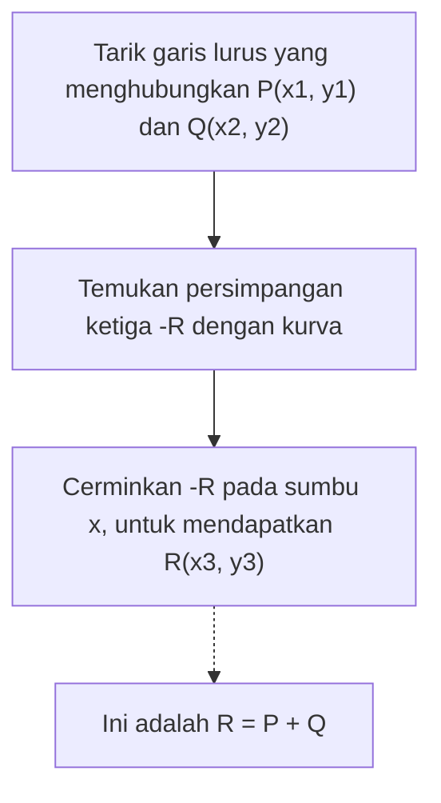
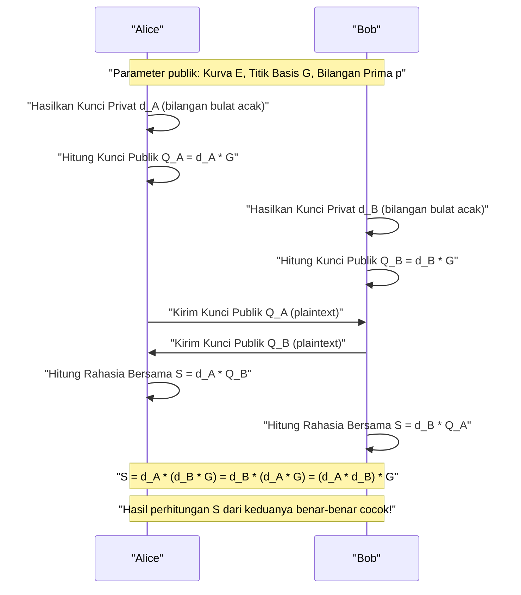
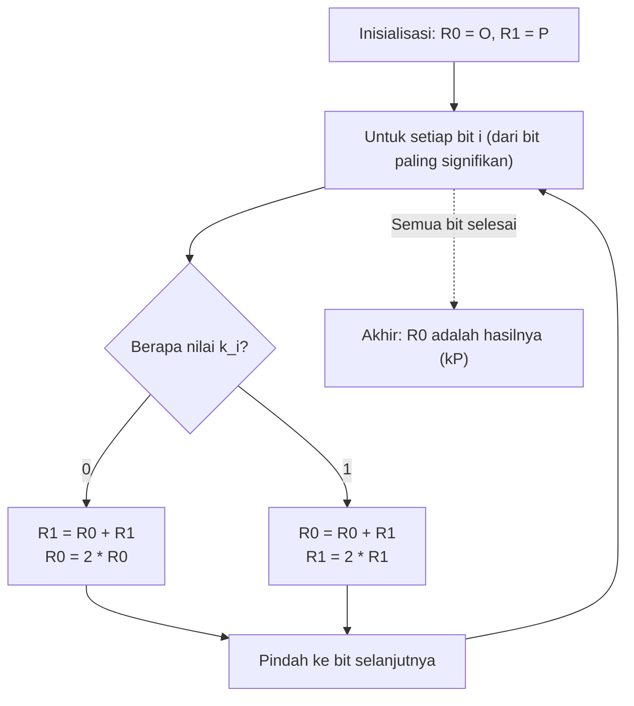

# Dasar Matematika Kriptografi Kurva Eliptik (ECC) dan Implementasinya dalam C++

Dalam teknologi kriptografi modern, **Kriptografi Kurva Eliptik (Elliptic Curve Cryptography: ECC)** memainkan peran yang sangat penting. Dari komunikasi internet harian kita (HTTPS/TLS), secure enclave di smartphone, autentikasi server melalui SSH, autentikasi tanpa kata sandi seperti FIDO, hingga aset kripto seperti Bitcoin dan Ethereum, tidak berlebihan untuk mengatakan bahwa fondasi kepercayaan masyarakat digital saat ini didukung oleh ECC.

Dalam artikel ini, kami akan menjelaskan secara menyeluruh dengan detail yang luar biasa tentang bagaimana kriptografi kurva eliptik ini berfungsi, mulai dari teori matematika yang indah namun rumit di baliknya (geometri aljabar di atas lapangan berhingga), metode implementasi aktual menggunakan C++, hingga teknik pengkodean yang aman untuk mencegah serangan saluran samping (serangan waktu).

---

## 1. Mengapa Kriptografi Kurva Eliptik? (Perbandingan dengan RSA)

Sinonim dari kriptografi kunci publik telah lama adalah **kriptografi RSA**. RSA mendasarkan keamanannya pada "kesulitan faktorisasi prima dari bilangan komposit yang sangat besar". Namun, seiring dengan peningkatan kemampuan komputasi komputer, ada kebutuhan untuk terus memperpanjang panjang kunci (jumlah bit modulus) RSA untuk mempertahankan keamanannya. Saat ini, direkomendasikan setidaknya panjang kunci 2048 bit, atau 3072 bit hingga 4096 bit untuk keamanan yang lebih baik.

Sebaliknya, kriptografi kurva eliptik (ECC) mendasarkan keamanannya pada kesulitan matematika yang berbeda, yaitu **"Masalah Logaritma Diskret Kurva Eliptik (ECDLP)"**. Algoritma yang efisien untuk memecahkan ECDLP (seperti algoritma waktu sub-eksponensial) belum ditemukan hingga saat ini, dan bahkan metode serangan paling efisien yang diketahui memerlukan waktu eksponensial.

Karena sifat ini, ECC memiliki keuntungan krusial yaitu **dapat mencapai tingkat keamanan yang setara dengan RSA namun dengan panjang kunci yang jauh lebih pendek**.

| Kekuatan Keamanan (bit) | Panjang Kunci RSA (bit) | Panjang Kunci Kriptografi Kurva Eliptik (bit) | Rasio Panjang Kunci |
| :---: | :---: | :---: | :---: |
| 80 | 1024 | 160 | 1:6 |
| 112 | 2048 | 224 | 1:9 |
| 128 | 3072 | 256 | 1:12 |
| 192 | 7680 | 384 | 1:20 |
| 256 | 15360 | 512 | 1:30 |

Seperti yang ditunjukkan pada tabel di atas, untuk mendapatkan kekuatan keamanan 128 bit (kekuatan standar saat ini), RSA memerlukan kunci 3072 bit, sedangkan ECC hanya membutuhkan 256 bit. Hal ini memungkinkan pengurangan komputasi, penggunaan memori yang lebih rendah, dan penghematan bandwidth jaringan, yang memberikan keunggulan luar biasa terutama pada perangkat IoT dan lingkungan smart card dengan sumber daya terbatas.

---

## 2. Persiapan Matematika: Teori Grup dan Dunia Lapangan Berhingga

Untuk benar-benar memahami kriptografi kurva eliptik, penting untuk memahami konsep dasar aljabar abstrak (teori grup dan teori lapangan). Di sini, kami merangkum pengetahuan prasyarat untuk mengonstruksi ECC secara ringkas.

### 2.1. Grup (Group) dan Grup Abelian
**Grup (Group)** adalah himpunan $G$ yang dilengkapi dengan operasi biner (di sini kita gunakan penjumlahan $+$), disimbolkan dengan $(G, +)$, yang memenuhi 4 aksioma berikut:

1. **Sifat Tertutup (Closure)**: Untuk setiap $a, b \in G$, maka $a + b \in G$.
2. **Sifat Asosiatif (Associativity)**: Untuk setiap $a, b, c \in G$, berlaku $(a + b) + c = a + (b + c)$.
3. **Eksistensi Elemen Identitas (Identity element)**: Terdapat elemen $e \in G$ sehingga untuk setiap $a \in G$, berlaku $a + e = e + a = a$. Dalam kasus grup aditif, elemen identitas ini biasanya dilambangkan dengan $0$ atau $\mathcal{O}$.
4. **Eksistensi Elemen Invers (Inverse element)**: Untuk setiap $a \in G$, terdapat elemen $b \in G$ sehingga $a + b = b + a = e$. $b$ ini dilambangkan sebagai $-a$.

Lebih lanjut, jika urutan operasi diubah dan hasilnya tetap sama, yaitu memenuhi kondisi di bawah ini, grup tersebut disebut **Grup Abelian (Grup Komutatif)**.

5. **Sifat Komutatif (Commutativity)**: Untuk setiap $a, b \in G$, berlaku $a + b = b + a$.

Himpunan titik-titik pada kurva eliptik membentuk **grup Abelian** ini dengan mendefinisikan aturan penjumlahan tertentu.

### 2.2. Lapangan Berhingga (Finite Field)
Dalam teori kriptografi, kita tidak menggunakan lapangan dengan elemen yang kontinu dan tak terhingga seperti bilangan real atau bilangan kompleks, melainkan menggunakan **Lapangan Berhingga (Finite Field)** atau Lapangan Galois (Galois Field) yang jumlah elemennya terbatas.

Lapangan berhingga yang paling dasar adalah **lapangan prima $\mathbb{F}_p$** menggunakan bilangan prima $p$. Ini adalah himpunan bilangan bulat $\{0, 1, 2, \dots, p-1\}$ yang dilengkapi dengan empat operasi aritmetika (penjumlahan, pengurangan, perkalian, pembagian) dengan modulo $p$ (sisa pembagian dengan $p$).

- **Penjumlahan**: $(a + b) \pmod p$
- **Pengurangan**: $(a - b) \pmod p$
- **Perkalian**: $(a \times b) \pmod p$
- **Pembagian**: $a \times b^{-1} \pmod p$ (di mana $b^{-1}$ adalah invers perkalian modulo $p$ dari $b$)

Penghitungan **Invers Perkalian Modulo (Modular Multiplicative Inverse)** sangat penting dalam implementasi kriptografi. Untuk menemukan $b^{-1}$ yang memenuhi $b \times b^{-1} \equiv 1 \pmod p$, dua algoritma berikut ini terutama digunakan:

1. **Algoritma Euclidean Diperluas (Extended Euclidean Algorithm)**: Cepat, tetapi tergantung pada implementasinya, waktu pemrosesan dapat bergantung pada nilai input sehingga memiliki risiko serangan waktu.
2. **Teorema Kecil Fermat (Fermat's Little Theorem)**: Ketika $p$ adalah bilangan prima dan $b \neq 0$, berlaku $b^{p-1} \equiv 1 \pmod p$. Jika kedua sisi dibagi dengan $b$, maka diperoleh $b^{p-2} \equiv b^{-1} \pmod p$. Artinya, invers dapat dicari dengan menghitung pangkat $p-2$ dari $b$. Karena operasi pemangkatan mudah diimplementasikan dalam waktu konstan (constant time), metode ini lebih disukai dalam implementasi kriptografi.

---

## 3. Persamaan Kurva Eliptik dan Geometri

### 3.1. Bentuk Normal Weierstrass
**Kurva Eliptik (Elliptic Curve)** pada umumnya adalah kurva pada bidang datar yang didefinisikan oleh persamaan berikut, yang disebut **bentuk normal Weierstrass (Weierstrass normal form)**.

$$ y^2 = x^3 + ax + b $$

Di sini, $a$ dan $b$ adalah konstanta, dan agar kurva tidak memiliki titik singular (seperti persimpangan mandiri atau titik puncak) (yakni, kurvanya mulus), nilai **Diskriminan (Discriminant) $\Delta$** berikut disyaratkan tidak boleh nol.

$$ \Delta = -16(4a^3 + 27b^2) \neq 0 $$

Karena kurva yang memiliki titik singular dapat merusak keamanan kriptografi, koefisien $a, b$ yang memenuhi kondisi ini selalu dipilih.

### 3.2. Titik di Tak Terhingga (Point at Infinity)
Untuk menjadikan kurva eliptik sebagai grup yang sempurna secara matematis, titik virtual yang disebut **"Titik di Tak Terhingga (Point at Infinity)"** diperkenalkan selain titik-titik pada bidang datar. Titik ini dilambangkan sebagai $\mathcal{O}$ (O besar).

Titik di tak terhingga $\mathcal{O}$ didefinisikan sebagai titik tempat semua garis vertikal bertemu di tempat yang tak terhingga. Dalam teori grup, titik di tak terhingga $\mathcal{O}$ ini berfungsi sebagai **elemen identitas (nol) dalam operasi penjumlahan**.

Artinya, untuk setiap titik $P$ pada kurva, berlaku:
$$ P + \mathcal{O} = \mathcal{O} + P = P $$

Selain itu, invers $-P$ dari titik $P = (x, y)$ didefinisikan sebagai titik $(x, -y)$ yang simetris terhadap sumbu x. Oleh karena itu:
$$ P + (-P) = \mathcal{O} $$
berlaku.

---

## 4. Operasi Grup pada Kurva Eliptik (Penambahan Titik dan Penggandaan Titik)

Inti dari kriptografi kurva eliptik adalah operasi **"Penambahan (Addition)"** antara titik-titik pada kurva. Berbeda dengan penambahan bilangan bulat biasa, ini didefinisikan berdasarkan operasi geometris.

### 4.1. Penambahan Geometris (Metode Garis Singgung dan Tali Busur / Tangent and Chord Method)
Prosedur untuk menambahkan dua titik berbeda $P$ dan $Q$ pada kurva untuk mendapatkan titik baru $R$ ($R = P + Q$) adalah sebagai berikut:

1. Tarik garis lurus (tali busur) yang melewati titik $P$ dan titik $Q$.
2. Garis lurus ini pasti akan memotong kurva eliptik di satu titik lain (mari sebut ini $-R$). (※ Berdasarkan teorema geometri aljabar)
3. Titik $R$ yang dicari adalah hasil pencerminan titik potong $-R$ secara simetris terhadap sumbu x (titik dengan tanda koordinat y dibalik).



### 4.2. Penggandaan Titik (Point Doubling)
Ketika menambahkan titik $P$ dengan titik $P$ yang sama ($P + P = 2P$), kita tidak dapat menarik garis yang melewati dua titik. Dalam kasus ini, kita menarik **garis singgung (Tangent) pada kurva di titik $P$**.

1. Tarik garis singgung pada kurva di titik $P$.
2. Garis singgung ini memotong kurva di satu titik lain yaitu $-R$.
3. Titik $R = 2P$ yang dicari adalah hasil pencerminan titik potong tersebut secara simetris terhadap sumbu x.

### 4.3. Rumus Komputasi Aljabar
Operasi geometris diubah ke dalam rumus aljabar sehingga dapat dihitung oleh komputer.
Semua operasi dilakukan **di atas lapangan berhingga $\mathbb{F}_p$ (modulo $p$)**.

Misalkan Titik $P = (x_1, y_1)$ dan Titik $Q = (x_2, y_2)$.
Dan biarkan titik hasil perhitungannya adalah $R = P + Q = (x_3, y_3)$.

Biarkan kemiringan garis menjadi $\lambda$ (lambda).

**【Kasus 1: Ketika $P \neq Q$ (Penambahan Titik)】**
Kemiringan $\lambda$ adalah rasio perubahan antara dua titik.
$$ \lambda \equiv \frac{y_2 - y_1}{x_2 - x_1} \pmod p $$
$$ \lambda \equiv (y_2 - y_1) \cdot (x_2 - x_1)^{-1} \pmod p $$

Menggunakan $\lambda$ ini, $x_3, y_3$ dihitung sebagai berikut.
$$ x_3 \equiv \lambda^2 - x_1 - x_2 \pmod p $$
$$ y_3 \equiv \lambda(x_1 - x_3) - y_1 \pmod p $$

**【Kasus 2: Ketika $P = Q$ (Penggandaan Titik)】**
Kemiringan $\lambda$ adalah kemiringan garis singgung yang diperoleh melalui diferensiasi. ($y^2 = x^3 + ax + b$ didiferensiasikan secara implisit)
$$ 2y \cdot y' = 3x^2 + a \implies y' = \frac{3x^2 + a}{2y} $$
Oleh karena itu,
$$ \lambda \equiv (3x_1^2 + a) \cdot (2y_1)^{-1} \pmod p $$

Rumus untuk $x_3, y_3$ memiliki bentuk yang sama dengan penambahan, tetapi karena $x_2 = x_1$, menjadi seperti berikut:
$$ x_3 \equiv \lambda^2 - 2x_1 \pmod p $$
$$ y_3 \equiv \lambda(x_1 - x_3) - y_1 \pmod p $$

> [!IMPORTANT]
> Rumus-rumus ini melibatkan **pembagian (perhitungan invers modulo)** seperti $(x_2 - x_1)^{-1}$ dan $(2y_1)^{-1}$. Karena perhitungan invers modulo memiliki biaya komputasi yang sangat tinggi, dalam implementasi praktis, sistem koordinat proyektif seperti **"Sistem Koordinat Jacobian (Jacobian Coordinates)"** umumnya digunakan untuk menunda pembagian.

---

## 5. Perkalian Skalar dan Masalah Logaritma Diskret Kurva Eliptik (ECDLP)

Dalam kriptografi kurva eliptik, operasi yang paling padat komputasi dan membentuk inti keamanan adalah **Perkalian Skalar (Scalar Multiplication)**.

### 5.1. Apa itu Perkalian Skalar?
Menambahkan titik $P$ sebanyak $k$ kali disebut perkalian skalar, dan dilambangkan sebagai $kP$.
$$ kP = \underbrace{P + P + \dots + P}_{k \text{ kali}} $$

Di sini, $k$ adalah bilangan bulat yang sangat besar (misalnya bilangan bulat 256-bit).

### 5.2. Masalah Logaritma Diskret Kurva Eliptik (ECDLP)
Keamanan kriptografi kurva eliptik bergantung pada kesulitan masalah berikut.

> **Masalah Logaritma Diskret Kurva Eliptik (Elliptic Curve Discrete Logarithm Problem: ECDLP)**
> Diberikan sebuah titik $P$ (base point) yang diketahui, dan sebuah titik hasil $Q$, temukan skalar $k$ sedemikian rupa sehingga memenuhi $Q = kP$.

Menghitung $Q$ dari $k$ dan $P$ (arah maju) adalah mudah (waktu polinomial) menggunakan algoritma yang dijelaskan di bawah ini, tetapi menghitung balik $k$ dari $P$ dan $Q$ (arah mundur) hampir tidak mungkin tanpa pencarian brute-force (fungsi satu arah).
Dalam protokol kriptografi, **$k$ berkorespondensi dengan "kunci privat" dan $Q$ dengan "kunci publik"**.

### 5.3. Algoritma Double-and-Add
Ketika $k$ adalah angka yang sangat besar (misalnya: $2^{256}$), menjumlahkan $P$ secara naif sebanyak $k$ kali tidak akan selesai bahkan jika umur alam semesta telah habis. Oleh karena itu, metode **Double-and-Add (Metode Biner)** digunakan untuk melakukan perkalian skalar dengan kecepatan tinggi.

Ini adalah versi kurva eliptik dari "exponentiation by squaring" yang dengan cepat menghitung pangkat bilangan bulat. Skalar $k$ direpresentasikan dalam biner, dan diproses secara berurutan mulai dari bit paling signifikan.

1. Inisialisasi titik $R$ yang menyimpan hasil dengan $\mathcal{O}$.
2. Ulangi yang berikut ini dari bit paling signifikan hingga bit paling tidak signifikan dari $k$:
   - Gandakan $R$ (Point Doubling: $R = 2R$)
   - Jika bit saat ini adalah `1`, tambahkan $P$ ke $R$ (Point Addition: $R = R + P$)

Dengan algoritma ini, kompleksitas waktu berkurang secara drastis dari $O(k)$ menjadi $O(\log_2 k)$, dan memungkinkan perhitungan dalam waktu yang realistis (dalam hitungan milidetik).

---

## 6. Pertukaran Kunci Elliptic Curve Diffie-Hellman (ECDH)

Di sini, kami akan menjelaskan cara kerja **protokol pertukaran kunci ECDH (Elliptic Curve Diffie-Hellman)**, yang merupakan contoh aplikasi ECC paling representatif. ECDH adalah mekanisme bagi Alice dan Bob untuk dengan aman menghasilkan dan membagikan kunci rahasia bersama (kunci sesi) melalui saluran komunikasi yang rentan penyadapan (ini adalah inti dari TLS handshake).

**【Parameter Prasyarat (Parameter Domain)】**
Keduanya berbagi terlebih dahulu kurva eliptik $E$, bilangan prima $p$, dan titik basis $G$ yang akan digunakan. (Misalnya NIST P-256 atau secp256k1)



Penyadap (Eve) dapat mencegat $G$, $Q_A$, dan $Q_B$ yang mengalir di jalur komunikasi, namun karena kesulitan ECDLP, tidak mungkin menemukan kunci privat $d_A$ milik Alice dari $Q_A = d_A \cdot G$. Selain itu, mengalikan $Q_A$ dan $Q_B$ tidak akan menghasilkan kunci bersama $S$, sehingga penyadap tidak dapat menghitung $S$.

---

## 7. Jebakan Implementasi: Serangan Saluran Samping (Side-Channel Attack) dan Penanggulangannya

Bahkan algoritma kriptografi yang sempurna secara teoritis dapat memiliki kerentanan yang muncul dalam proses implementasinya sebagai program. Itulah yang disebut **"Serangan Saluran Samping (Side-Channel Attack)"**.

### 7.1. Serangan Waktu (Timing Attack)
Mari kita lihat kembali algoritma Double-and-Add yang telah dijelaskan sebelumnya.

```cpp
// Pseudocode dari Double-and-Add yang rentan
Point R = Point::Infinity;
for (int i = 255; i >= 0; i--) {
    R = PointDoubling(R);         // Selalu dieksekusi
    if (bit(k, i) == 1) {
        R = PointAddition(R, P);  // Hanya dieksekusi ketika bit adalah 1!
    }
}
```

Implementasi ini memiliki cacat yang fatal. Karena Point Addition dieksekusi saat bit adalah `1`, **waktu komputasi menjadi sedikit lebih lama** daripada saat bit adalah `0`. Selain itu, prediski percabangan prosesor dan perilaku memori cache juga berubah.
Dengan mengamati perbedaan kecil dalam waktu komputasi (atau konsumsi daya) ribuan kali secara statistik, penyerang dapat **sepenuhnya memulihkan rangkaian bit kunci privat $k$ bit demi bit**. Inilah yang disebut serangan waktu (timing attack).

### 7.2. Implementasi Constant-Time: Montgomery Ladder
Untuk mencegah serangan waktu, perlu mengadopsi algoritma yang memiliki **urutan instruksi yang dieksekusi dan waktu komputasi yang selalu konstan (Constant-Time), terlepas dari nilai bit kunci privat**.

Contoh utamanya adalah **Montgomery Ladder**.



Keindahan dari Montgomery Ladder adalah, terlepas dari bit yang bernilai `0` atau `1`, **"selalu 1 kali Point Addition dan 1 kali Point Doubling"** yang dieksekusi. Hal ini sepenuhnya menghilangkan ketergantungan data dari waktu komputasi.

Namun, jika percabangan (`if (k_i == 0)`) itu sendiri ada, masih ada risiko bahwa waktu eksekusi berfluktuasi karena optimasi compiler dan prediksi percabangan CPU. Oleh karena itu, dalam implementasi Constant-Time yang sebenarnya, percabangan kondisional (pernyataan `if`) dihilangkan, dan **pertukaran bersyarat (Conditional Swap) menggunakan operasi bit** digunakan.

---

## 8. Implementasi Kriptografi Kurva Eliptik dalam C++

Mulai dari sini, kita akan mengubah teori menjadi kode C++. Pustaka kriptografi praktis (seperti OpenSSL dan libsodium) menggunakan optimasi assembly tingkat lanjut dan sistem koordinat Jacobian, tetapi di sini untuk memperdalam pemahaman matematika, kami menunjukkan kerangka dari **implementasi Constant-Time yang mudah dipahami menggunakan sistem koordinat afinitas**.

Kami asumsikan penggunaan `boost::multiprecision::cpp_int` untuk perhitungan bilangan bulat raksasa.

### 8.1. Operasi Modulo dan Invers
Pertama, kita definisikan fungsi bantuan untuk operasi pada lapangan berhingga. Kita akan mengimplementasikan perhitungan invers menggunakan Teorema Kecil Fermat.

```cpp
#include <iostream>
#include <vector>
#include <stdexcept>
#include <boost/multiprecision/cpp_int.hpp>

using namespace boost::multiprecision;

// Sebagai contoh p dan parameter secp256k1
const cpp_int p("0xFFFFFFFFFFFFFFFFFFFFFFFFFFFFFFFFFFFFFFFFFFFFFFFFFFFFFFFEFFFFFC2F");
const cpp_int a = 0;
const cpp_int b = 7;

// Operasi modulo yang mengembalikan sisa positif
cpp_int mod(cpp_int x, cpp_int m) {
    cpp_int r = x % m;
    return r < 0 ? r + m : r;
}

// Perhitungan eksponensial modulo (x^y mod m)
cpp_int powerMod(cpp_int base, cpp_int exp, cpp_int m) {
    cpp_int res = 1;
    base = mod(base, m);
    while (exp > 0) {
        if (exp % 2 == 1) res = mod(res * base, m);
        base = mod(base * base, m);
        exp /= 2;
    }
    return res;
}

// Invers modulo menggunakan Teorema Kecil Fermat
cpp_int modInverse(cpp_int n, cpp_int m) {
    // Asumsikan bahwa m adalah bilangan prima: n^(m-2) ≡ n^(-1) mod m
    return powerMod(n, m - 2, m);
}
```

### 8.2. Representasi Titik dan Operasi Grup (Penambahan dan Penggandaan)
Kita definisikan struktur `Point` yang mengelola titik di tak terhingga dengan sebuah flag, beserta implementasi rumus penambahan.

```cpp
struct Point {
    cpp_int x;
    cpp_int y;
    bool isInfinity;

    // Menghasilkan titik di tak terhingga
    Point() : x(0), y(0), isInfinity(true) {}
    
    // Menghasilkan titik biasa
    Point(cpp_int x, cpp_int y) : x(x), y(y), isInfinity(false) {}
};

// Penambahan titik pada kurva eliptik (R = P + Q)
Point pointAdd(const Point& P, const Point& Q) {
    if (P.isInfinity) return Q;
    if (Q.isInfinity) return P;

    if (P.x == Q.x && mod(P.y + Q.y, p) == 0) {
        return Point(); // P + (-P) = Titik di tak terhingga
    }

    cpp_int lambda;
    if (P.x == Q.x && P.y == Q.y) {
        // Point Doubling (Kasus P = Q)
        // lambda = (3x^2 + a) / 2y
        cpp_int num = mod(3 * P.x * P.x + a, p);
        cpp_int den = modInverse(mod(2 * P.y, p), p);
        lambda = mod(num * den, p);
    } else {
        // Point Addition (Kasus P != Q)
        // lambda = (y2 - y1) / (x2 - x1)
        cpp_int num = mod(Q.y - P.y, p);
        cpp_int den = modInverse(mod(Q.x - P.x, p), p);
        lambda = mod(num * den, p);
    }

    cpp_int x3 = mod(lambda * lambda - P.x - Q.x, p);
    cpp_int y3 = mod(lambda * (P.x - x3) - P.y, p);

    return Point(x3, y3);
}
```

### 8.3. Implementasi Conditional Swap Constant-Time
Saat menukar isi variabel berdasarkan nilai bit dari kunci privat, penukaran dilakukan hanya dengan operasi bit (masking) tanpa menggunakan pernyataan `if`. Hal ini membuat alur eksekusi menjadi benar-benar konstan.

> [!TIP]
> Pada implementasi aslinya, kelas integer multipresisi yang dialokasikan secara dinamis seperti `cpp_int` tidak cocok untuk pemrosesan Constant-Time. Pasalnya, informasi waktu bocor karena fluktuasi alokasi memori dan ukuran array. Di perpustakaan praktis, algoritma direpresentasikan dalam panjang tetap (misal array uint64_t × 4 elemen), dan memproses masking pada level bit. Berikut adalah contoh konseptual.

```cpp
// Konseptual Constant-Time Swap (Asumsikan panjang bilangan bulat tetap)
// Jika bit adalah 1 maka P1 dan P2 akan ditukar, dan jika 0 maka tidak ditukar
void cswap(Point& P1, Point& P2, uint8_t bit) {
    // bit adalah 0 atau 1. Masker bit=1 adalah semua bit 1(0xFF..), bit 0 adalah semua bit 0.
    // (Di sini untuk penjelasan, mari kita asumsikan setiap kata dari kelas BigInt panjang tetap sebagai w)
    /*
    uint64_t mask = 0 - (uint64_t)bit;
    for (int i = 0; i < NUM_WORDS; i++) {
        uint64_t dummy = mask & (P1.x.words[i] ^ P2.x.words[i]);
        P1.x.words[i] ^= dummy;
        P2.x.words[i] ^= dummy;
        // Koordinat y dan flag isInfinity juga diproses dengan cara yang sama
    }
    */
    
    // ※ Swap constant-time yang sempurna dengan boost::multiprecision sulit dilakukan,
    // Di sini kita batasi pada simulasi dengan percabangan demi memahami logikanya.
    if (bit == 1) {
        std::swap(P1, P2);
    }
}
```

### 8.4. Perkalian Skalar dengan Montgomery Ladder
Menggabungkan `pointAdd` dan `cswap` di atas, kita mengimplementasikan perkalian skalar yang aman.

```cpp
// Perkalian skalar k * P (Metode Montgomery Ladder)
Point scalarMultiply(const Point& P, cpp_int k) {
    Point R0 = Point(); // Titik di tak terhingga
    Point R1 = P;

    // Dapatkan panjang bit k (untuk secp256k1 adalah 256 bit)
    int numBits = 256; 
    
    for (int i = numBits - 1; i >= 0; i--) {
        // Dapatkan nilai bit ke-i (0 atau 1)
        uint8_t bit = static_cast<uint8_t>(bit_test(k, i) ? 1 : 0);

        // Jika bit == 1, tukar R0 dan R1
        cswap(R0, R1, bit);

        // Selalu eksekusi operasi yang sama (Point Addition dan Point Doubling)
        R1 = pointAdd(R0, R1);
        R0 = pointAdd(R0, R0);

        // Jika bit == 1, tukar lagi untuk mengembalikan keadaan seperti semula
        cswap(R0, R1, bit);
    }

    return R0;
}
```

Dengan logika implementasi ini, terlepas dari apakah masing-masing bit skalar $k$ adalah `0` atau `1`, operasi yang dieksekusi dalam setiap iterasi perulangan (`cswap` $\to$ `pointAdd` $\to$ `pointAdd` $\to$ `cswap`) akan memiliki alur yang persis sama, dengan kuat mencegah kebocoran informasi rahasia melalui waktu atau perbedaan dalam pola akses cache.

---

## 9. Kesimpulan

Kriptografi kurva eliptik (ECC) mungkin tampak aneh pada pandangan pertama dengan bertanya-tanya, "Mengapa operasi geometris seperti menggambar garis lurus dan memantulkan titik persimpangan dapat menjadi kriptografi?". Namun, dengan memetakannya ke dunia diskrit dari lapangan berhingga, ini adalah produk perpaduan yang ajaib antara matematika dan kriptografi, yang memungkinkan kita membangun fungsi satu arah yang mengesankan (masalah logaritma diskret).

Dalam artikel ini, kami menjelaskan poin-poin penting berikut:

1. **Keunggulan terhadap RSA**: Memberikan keamanan kuat dengan panjang kunci yang jauh lebih pendek, sangat cocok untuk era perangkat seluler dan IoT modern.
2. **Dasar-dasar Teori Grup dan Lapangan Berhingga**: Struktur matematika yang mendasari ECC.
3. **Rumus Penambahan dan Penggandaan**: Metode untuk mengimplementasikan operasi grup aljabar menggunakan persamaan Weierstrass.
4. **Ancaman Serangan Saluran Samping (Side-Channel Attack)**: Bagaimana percabangan kondisional yang bergantung pada bit kunci privat menghasilkan kerentanan yang fatal.
5. **Implementasi Constant-Time**: Teknik pengkodean C++ yang menggunakan Montgomery Ladder dan Conditional Swap untuk menyeragamkan perilaku tingkat perangkat keras dan mencegah serangan.

Membuat perpustakaan kriptografi Anda sendiri yang sebenarnya berjalan di lingkungan produksi sangat tidak disarankan ("Don't roll your own crypto") karena risiko keamanannya sangat tinggi. Namun, pemahaman mendalam tentang algoritma dan latar belakang matematika yang beroperasi di dalamnya harus menjadi senjata yang sangat berharga bagi insinyur yang merancang dan mengoperasikan sistem yang lebih aman dan berkinerja tinggi.

Pada artikel berikutnya, kami ingin menggali lebih dalam tentang mekanisme **ECDSA (Elliptic Curve Digital Signature Algorithm)**, yaitu algoritma tanda tangan digital menggunakan kurva eliptik ini, serta **Tanda Tangan Schnorr** yang diadopsi pada Bitcoin.
