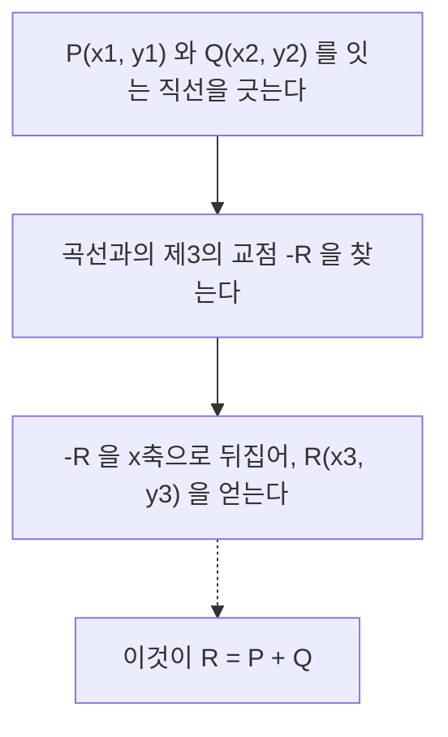
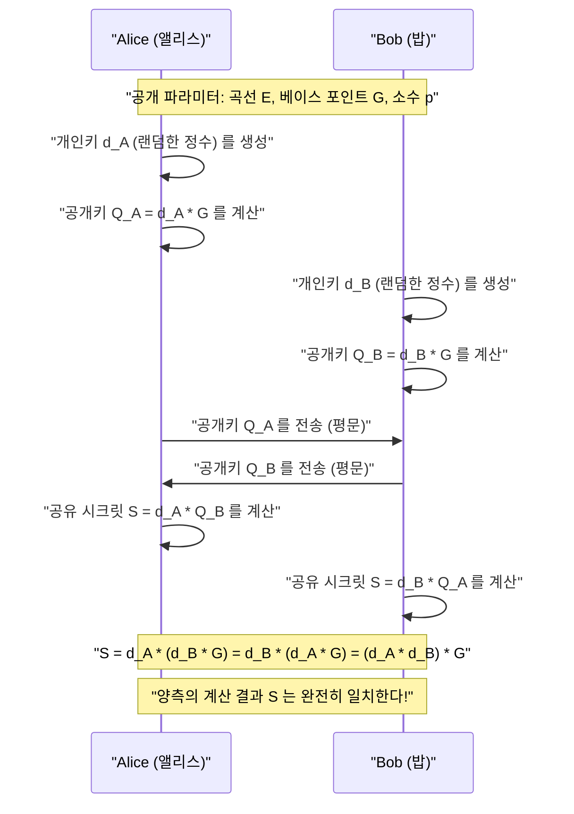
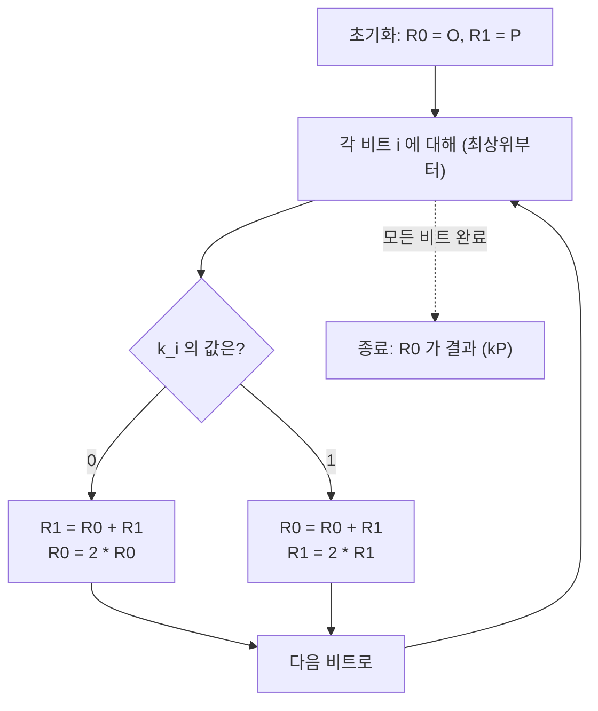

# 타원곡선 암호(ECC)의 수학적 기초와 C++에서의 구현

현대 암호 기술에서 **타원곡선 암호(Elliptic Curve Cryptography: ECC)**는 매우 중요한 역할을 담당하고 있습니다. 우리의 일상적인 인터넷 통신(HTTPS/TLS)부터 스마트폰의 보안 엔클레이브(Secure Enclave), SSH를 통한 서버 인증, FIDO와 같은 패스워드리스 인증, 심지어 비트코인이나 이더리움과 같은 암호화폐에 이르기까지 현대 디지털 사회의 신뢰 기반은 ECC에 의해 지탱되고 있다고 해도 과언이 아닙니다.

본 기사에서는 이 타원곡선 암호가 어떻게 기능하는지, 그 이면에 있는 아름답고도 난해한 수학적 이론(유한체 상의 대수기하학)에서 출발하여 실제 C++를 이용한 구현 방법, 나아가 부채널 공격(타이밍 공격)을 방지하기 위한 안전한 코딩 기법까지 압도적인 분량으로 철저하게 해설합니다.

---

## 1. 왜 타원곡선 암호인가? (RSA와의 비교)

공개키 암호 방식의 대명사라고 하면 오랫동안 **RSA 암호**를 떠올렸습니다. RSA 암호는 '거대한 합성수의 소인수분해의 어려움'을 안전성의 근거로 삼고 있습니다. 하지만 컴퓨터의 계산 능력이 향상됨에 따라 안전성을 유지하기 위해서는 RSA의 키 길이(모듈러스의 비트 수)를 지속적으로 늘려야 할 필요성이 생겼습니다. 현재는 최소 2048비트, 더 안전을 기한다면 3072비트나 4096비트의 키 길이가 권장되고 있습니다.

이에 반해, 타원곡선 암호(ECC)는 **'타원곡선 상의 이산대수 문제(ECDLP)'**라는 또 다른 수학적 어려움을 안전성의 근거로 삼고 있습니다. ECDLP를 풀기 위한 효율적인 알고리즘(준지수 시간 알고리즘 등)은 현재까지 발견되지 않았으며, 알려진 가장 효율적인 공격 기법조차도 지수 함수적인 시간을 필요로 합니다.

이러한 성질로 인해 ECC는 **매우 짧은 키 길이로 RSA와 동등한 보안 강도를 구현할 수 있다**는 결정적인 장점을 가집니다.

| 보안 강도(비트) | RSA 암호의 키 길이(비트) | 타원곡선 암호의 키 길이(비트) | 키 길이 비율 |
| :---: | :---: | :---: | :---: |
| 80 | 1024 | 160 | 1:6 |
| 112 | 2048 | 224 | 1:9 |
| 128 | 3072 | 256 | 1:12 |
| 192 | 7680 | 384 | 1:20 |
| 256 | 15360 | 512 | 1:30 |

위의 표에서 알 수 있듯이, 128비트의 보안 강도(현재 표준적인 강도)를 얻기 위해 RSA에서는 3072비트의 키가 필요하지만, ECC라면 단 256비트면 충분합니다. 이를 통해 계산량 감소, 메모리 사용량 절감, 네트워크 대역폭 절약이 가능해지며, 특히 리소스가 제한된 IoT 기기나 스마트카드 환경에서 압도적인 우위를 자랑합니다.

---

## 2. 수학적 준비: 군론과 유한체의 세계

타원곡선 암호를 진정으로 이해하기 위해서는 추상대수학(군론 및 체론)의 기본 개념을 파악해 둘 필요가 있습니다. 여기서는 ECC를 구성하기 위한 사전 지식을 간결하게 정리합니다.

### 2.1. 군(Group)과 아벨 군
**군(Group)**이란 어떤 집합 $G$와 그 집합 상의 이항 연산(여기서는 덧셈 $+$로 합니다)의 쌍 $(G, +)$이며, 다음의 4가지 공리를 만족하는 것을 말합니다.

1. **닫힘(Closure)**: 임의의 $a, b \in G$에 대해 $a + b \in G$이다.
2. **결합 법칙(Associativity)**: 임의의 $a, b, c \in G$에 대해 $(a + b) + c = a + (b + c)$가 성립한다.
3. **항등원의 존재(Identity element)**: 임의의 $a \in G$에 대해 $a + e = e + a = a$가 되는 원소 $e \in G$가 존재한다. 덧셈군의 경우, 이 항등원을 보통 $0$ 또는 $\mathcal{O}$로 표기합니다.
4. **역원의 존재(Inverse element)**: 임의의 $a \in G$에 대해 $a + b = b + a = e$가 되는 원소 $b \in G$가 존재한다. 이 $b$를 $-a$로 표기합니다.

더 나아가 연산의 순서를 바꾸어도 결과가 변하지 않는, 즉 다음 조건을 만족하는 군을 **아벨 군(가환군)**이라고 부릅니다.

5. **교환 법칙(Commutativity)**: 임의의 $a, b \in G$에 대해 $a + b = b + a$가 성립한다.

타원곡선 상의 점들의 집합은 특정한 덧셈 규칙을 정의함으로써 이 **아벨 군**을 구성합니다.

### 2.2. 유한체(Finite Field)
암호 이론에서는 실수나 복소수처럼 연속적이고 무한한 요소를 가진 체가 아니라, 원소의 개수가 유한한 **유한체(Finite Field)** 또는 갈루아 체(Galois Field)를 사용합니다.

가장 기본적인 유한체는 소수 $p$를 사용한 **소체 $\mathbb{F}_p$**입니다. 이는 $\{0, 1, 2, \dots, p-1\}$의 정수 집합에 모듈로 $p$($p$로 나눈 나머지)에서의 사칙연산(덧셈, 뺄셈, 곱셈, 나눗셈)을 정의한 것입니다.

- **덧셈**: $(a + b) \pmod p$
- **뺄셈**: $(a - b) \pmod p$
- **곱셈**: $(a \times b) \pmod p$
- **나눗셈**: $a \times b^{-1} \pmod p$ (여기서 $b^{-1}$은 모듈로 $p$에서의 $b$의 곱셈 역원)

**곱셈 역원(Modular Multiplicative Inverse)**의 계산은 암호 구현에서 매우 중요합니다. $b \times b^{-1} \equiv 1 \pmod p$를 만족하는 $b^{-1}$을 구하기 위해서는 주로 다음 두 가지 알고리즘이 사용됩니다.

1. **확장 유클리드 호제법(Extended Euclidean Algorithm)**: 빠르지만, 구현에 따라 처리 시간이 입력값에 의존하기 때문에 타이밍 공격의 위험이 있습니다.
2. **페르마의 소정리(Fermat's Little Theorem)**: $p$가 소수이고 $b \neq 0$일 때, $b^{p-1} \equiv 1 \pmod p$가 성립합니다. 양변을 $b$로 나누면 $b^{p-2} \equiv b^{-1} \pmod p$가 됩니다. 즉, $b$의 $p-2$ 제곱을 계산함으로써 역원을 구할 수 있습니다. 거듭제곱 연산은 상수 시간(Constant-Time)으로 구현하기 쉽기 때문에, 암호 구현에서는 이 방법을 선호합니다.

---

## 3. 타원곡선의 방정식과 기하학

### 3.1. 바이어슈트라스의 표준형
**타원곡선(Elliptic Curve)**은 일반적으로 다음의 **바이어슈트라스 표준형(Weierstrass normal form)**이라고 불리는 방정식으로 정의되는 평면 곡선입니다.

$$ y^2 = x^3 + ax + b $$

여기서 $a$와 $b$는 상수이며, 곡선이 특이점(자기 교차점이나 뾰족점)을 가지지 않기(매끄러운 곡선이기) 위한 조건으로 다음의 **판별식(Discriminant) $\Delta$**가 0이 아니어야 합니다.

$$ \Delta = -16(4a^3 + 27b^2) \neq 0 $$

특이점을 가진 곡선은 암호학적 안전성을 손상시키기 때문에, 반드시 이 조건을 만족하는 계수 $a, b$가 선택됩니다.

### 3.2. 무한원점(Point at Infinity)
타원곡선을 수학적으로 완전한 군으로 만들기 위해, 평면 상의 점에 더해 **'무한원점(Point at Infinity)'**이라고 불리는 가상의 점을 도입합니다. 이를 $\mathcal{O}$(오)라고 표기합니다.

무한원점 $\mathcal{O}$는 모든 수직선이 무한히 먼 곳에서 만나는 점으로 정의됩니다. 군론에서 이 무한원점 $\mathcal{O}$는 **덧셈에 대한 항등원**(0)으로 기능합니다.

즉, 곡선 상의 임의의 점 $P$에 대해 다음이 성립합니다.
$$ P + \mathcal{O} = \mathcal{O} + P = P $$

또한, 점 $P = (x, y)$의 역원 $-P$는 x축에 대해 대칭인 점 $(x, -y)$로 정의됩니다. 따라서:
$$ P + (-P) = \mathcal{O} $$
가 됩니다.

---

## 4. 타원곡선 상의 군 연산(점의 덧셈과 2배 연산)

타원곡선 암호의 근간을 이루는 것이 바로 곡선 상의 점들 간의 **'덧셈(Addition)'**이라는 연산입니다. 이는 일반적인 정수의 덧셈과는 다르며 기하학적인 조작을 바탕으로 정의되어 있습니다.

### 4.1. 기하학적 덧셈(Tangent and Chord Method)
곡선 상의 서로 다른 두 점 $P$와 $Q$를 더하여 새로운 점 $R$ ($R = P + Q$)을 구하는 절차는 다음과 같습니다.

1. 점 $P$와 점 $Q$를 지나는 직선(현)을 긋습니다.
2. 이 직선은 타원곡선과 반드시 또 다른 한 점(이를 $-R$이라 합니다)에서 만납니다. (※ 대수기하학의 정리에 따름)
3. 교점 $-R$을 x축에 대해 대칭으로 뒤집은 점(y좌표의 부호를 반전시킨 점)이 구하고자 하는 점 $R$이 됩니다.



### 4.2. 점의 2배 연산(Point Doubling)
점 $P$에 같은 점 $P$를 더하는 경우($P + P = 2P$), 두 점을 지나는 직선을 그을 수 없습니다. 이 경우에는 **점 $P$에서의 곡선의 접선(Tangent)**을 긋습니다.

1. 점 $P$에서의 곡선의 접선을 긋습니다.
2. 이 접선은 곡선과 또 다른 한 점 $-R$에서 만납니다.
3. 교점을 x축에 대해 대칭으로 뒤집은 점이 구하고자 하는 점 $R = 2P$가 됩니다.

### 4.3. 대수적인 계산 공식
기하학적인 조작을 컴퓨터로 계산할 수 있도록 대수적인 공식으로 옮겨냅니다.
연산은 모두 **유한체 $\mathbb{F}_p$ 상(모듈로 $p$)**에서 이루어집니다.

점 $P = (x_1, y_1)$, 점 $Q = (x_2, y_2)$라고 합시다.
또한 계산 결과인 점을 $R = P + Q = (x_3, y_3)$이라 합시다.

직선의 기울기를 $\lambda$(람다)라고 합니다.

**【케이스 1: $P \neq Q$ 인 경우 (점의 덧셈)】**
기울기 $\lambda$는 두 점 사이의 변화율입니다.
$$ \lambda \equiv \frac{y_2 - y_1}{x_2 - x_1} \pmod p $$
$$ \lambda \equiv (y_2 - y_1) \cdot (x_2 - x_1)^{-1} \pmod p $$

이 $\lambda$를 사용하여 $x_3, y_3$은 다음과 같이 구합니다.
$$ x_3 \equiv \lambda^2 - x_1 - x_2 \pmod p $$
$$ y_3 \equiv \lambda(x_1 - x_3) - y_1 \pmod p $$

**【케이스 2: $P = Q$ 인 경우 (점의 2배 연산)】**
기울기 $\lambda$는 미분을 통해 구한 접선의 기울기가 됩니다. ($y^2 = x^3 + ax + b$를 암묵적으로 미분합니다)
$$ 2y \cdot y' = 3x^2 + a \implies y' = \frac{3x^2 + a}{2y} $$
따라서,
$$ \lambda \equiv (3x_1^2 + a) \cdot (2y_1)^{-1} \pmod p $$

$x_3, y_3$의 식은 덧셈과 같은 형태이지만, $x_2 = x_1$이므로 다음과 같이 됩니다.
$$ x_3 \equiv \lambda^2 - 2x_1 \pmod p $$
$$ y_3 \equiv \lambda(x_1 - x_3) - y_1 \pmod p $$

> [!IMPORTANT]
> 이러한 공식에는 $(x_2 - x_1)^{-1}$이나 $(2y_1)^{-1}$과 같은 **나눗셈(모듈로 역원의 계산)**이 포함되어 있습니다. 모듈로 역원의 계산은 계산 비용이 매우 높기 때문에, 실제 구현에서는 나눗셈을 지연시키는 **'야코비 좌표계(Jacobian Coordinates)'** 등의 사영 좌표계가 일반적으로 사용됩니다.

---

## 5. 스칼라 곱셈과 타원곡선 이산대수 문제(ECDLP)

타원곡선 암호에서 가장 계산량이 많고, 동시에 보안의 핵심을 이루는 연산이 바로 **스칼라 곱셈(Scalar Multiplication)**입니다.

### 5.1. 스칼라 곱셈이란
어떤 점 $P$를 $k$번 더하는 조작을 스칼라 곱셈이라 부르며, $kP$라고 표기합니다.
$$ kP = \underbrace{P + P + \dots + P}_{k\text{번}} $$

여기서 $k$는 매우 큰 정수(예를 들어 256비트의 정수)입니다.

### 5.2. 타원곡선 이산대수 문제(ECDLP)
타원곡선 암호의 안전성은 다음 문제의 어려움에 의존하고 있습니다.

> **타원곡선 이산대수 문제(Elliptic Curve Discrete Logarithm Problem: ECDLP)**
> 알려진 점 $P$(베이스 포인트)와 계산 결과인 점 $Q$가 주어졌을 때, $Q = kP$를 만족하는 스칼라 $k$를 구하시오.

$k$와 $P$로부터 $Q$를 계산하는 것(정방향)은 후술할 알고리즘을 사용하면 쉽지만(다항식 시간), $P$와 $Q$로부터 $k$를 역산하는 것(역방향)은 전수조사와 같은 무차별 대입 이외에는 효율적인 해법이 없어 사실상 불가능합니다(일방향 함수).
암호 프로토콜에서는 **$k$가 '개인키', $Q$가 '공개키'**에 해당합니다.

### 5.3. Double-and-Add 알고리즘
$k$가 거대한 수(예: $2^{256}$)일 경우, $P$를 우직하게 $k$번 더하는 것은 우주의 수명이 다해도 끝나지 않습니다. 그래서 고속으로 스칼라 곱셈을 수행하기 위해 **Double-and-Add 방법(바이너리 방법)**이 사용됩니다.

이는 정수의 거듭제곱을 고속으로 계산하는 '반복 제곱법'의 타원곡선 버전입니다. 스칼라 $k$를 2진수로 표현하고, 최상위 비트부터 차례대로 처리합니다.

1. 결과를 유지할 점 $R$을 $\mathcal{O}$로 초기화한다.
2. $k$의 최상위 비트부터 최하위 비트까지 다음을 반복한다:
   - $R$을 2배로 한다 (Point Doubling: $R = 2R$)
   - 만약 현재 비트가 `1`이라면, $R$에 $P$를 더한다 (Point Addition: $R = R + P$)

이 알고리즘을 통해 계산량은 $O(k)$에서 $O(\log_2 k)$로 극적으로 감소하며, 현실적인 시간(밀리초 단위) 내에 계산이 가능해집니다.

---

## 6. 타원곡선 디피-헬먼(ECDH) 키 교환

여기서는 ECC의 가장 대표적인 응용 사례인 **ECDH(Elliptic Curve Diffie-Hellman) 키 교환 프로토콜**의 작동 원리를 해설합니다. ECDH는 도청이 가능한 통신 채널 상에서 앨리스와 밥이 안전하게 공통의 비밀키(세션 키)를 생성 및 공유하기 위한 메커니즘입니다(TLS 핸드셰이크의 핵심입니다).

**【전제 파라미터(도메인 파라미터)】**
양측은 미리 사용할 타원곡선 $E$, 소수 $p$, 그리고 베이스 포인트 $G$를 공유하고 있습니다. (예: NIST P-256이나 secp256k1 등)



도청자(이브)는 통신 경로 상에 흐르는 $G$, $Q_A$, $Q_B$를 가로챌 수 있지만, ECDLP의 어려움으로 인해 $Q_A = d_A \cdot G$로부터 앨리스의 개인키 $d_A$를 알아낼 수는 없습니다. 또한, $Q_A$와 $Q_B$를 곱해도 공유키 $S$가 되지 않으므로 도청자는 $S$를 계산할 수 없습니다.

---

## 7. 구현의 함정: 부채널 공격과 대책

이론적으로 완벽한 암호 알고리즘이라 하더라도 그것을 프로그램으로 구현하는 과정에서 취약점이 발생할 수 있습니다. 그것이 바로 **'부채널 공격(Side-Channel Attack)'**입니다.

### 7.1. 타이밍 공격(Timing Attack)
앞서 언급한 Double-and-Add 알고리즘을 되돌아봅시다.

```cpp
// 취약한 Double-and-Add 의 의사 코드
Point R = Point::Infinity;
for (int i = 255; i >= 0; i--) {
    R = PointDoubling(R);         // 항상 실행됨
    if (bit(k, i) == 1) {
        R = PointAddition(R, P);  // 비트가 1일 때만 실행됨!
    }
}
```

이 구현에는 치명적인 결함이 있습니다. 비트가 `1`일 때는 Point Addition이 실행되기 때문에 비트가 `0`일 때보다 **계산 시간이 약간 더 길어집니다**. 또한 프로세서의 분기 예측이나 캐시 메모리의 동작도 변하게 됩니다.
공격자가 이 계산 시간(혹은 소비 전력)의 미세한 차이를 수천 번 통계적으로 관측함으로써, **개인키 $k$의 비트열을 1비트씩 완전히 복원**해 낼 수 있습니다. 이것이 타이밍 공격입니다.

### 7.2. Constant-Time 구현: Montgomery Ladder
타이밍 공격을 방지하기 위해서는, **개인키의 비트 값과 관계없이 실행되는 명령어의 시퀀스와 계산 시간이 항상 일정한(Constant-Time)** 알고리즘을 채택해야 합니다.

그 대표적인 예가 **Montgomery Ladder(몽고메리 사다리)**입니다.



Montgomery Ladder의 아름다운 점은 비트가 `0`이든 `1`이든, **"항상 1번의 Point Addition과 1번의 Point Doubling"**이 실행된다는 것입니다. 이를 통해 계산 시간의 데이터 의존성이 완전히 배제됩니다.

단, 분기(`if (k_i == 0)`) 자체가 존재하면 컴파일러의 최적화나 CPU의 분기 예측에 의해 실행 시간이 변동할 위험이 남아 있습니다. 따라서 실제 Constant-Time 구현에서는 조건 분기(`if`문)를 배제하고, **비트 연산을 이용한 조건부 스왑(Conditional Swap)**을 활용합니다.

---

## 8. C++를 이용한 타원곡선 암호의 구현

이제부터는 이론을 C++ 코드로 구현해 보겠습니다. 실용적인 암호 라이브러리(OpenSSL이나 libsodium 등)는 고도화된 어셈블리 최적화나 야코비 좌표계를 사용하지만, 여기서는 수학적 이해를 돕기 위해 **아핀(Affine) 좌표계를 이용한 알기 쉬운 Constant-Time 구현**의 뼈대를 제시합니다.

거대한 정수의 연산에는 `boost::multiprecision::cpp_int`를 사용한다고 가정합니다.

### 8.1. 모듈로 연산과 역원
먼저 유한체 상의 연산 헬퍼 함수를 정의합니다. 페르마의 소정리에 의한 역원 계산을 구현합니다.

```cpp
#include <iostream>
#include <vector>
#include <stdexcept>
#include <boost/multiprecision/cpp_int.hpp>

using namespace boost::multiprecision;

// 예시로 secp256k1 의 소수 p 와 파라미터
const cpp_int p("0xFFFFFFFFFFFFFFFFFFFFFFFFFFFFFFFFFFFFFFFFFFFFFFFFFFFFFFFEFFFFFC2F");
const cpp_int a = 0;
const cpp_int b = 7;

// 양의 나머지를 반환하는 모듈로 연산
cpp_int mod(cpp_int x, cpp_int m) {
    cpp_int r = x % m;
    return r < 0 ? r + m : r;
}

// 거듭제곱 나머지 계산 (x^y mod m)
cpp_int powerMod(cpp_int base, cpp_int exp, cpp_int m) {
    cpp_int res = 1;
    base = mod(base, m);
    while (exp > 0) {
        if (exp % 2 == 1) res = mod(res * base, m);
        base = mod(base * base, m);
        exp /= 2;
    }
    return res;
}

// 페르마의 소정리를 이용한 모듈로 역원
cpp_int modInverse(cpp_int n, cpp_int m) {
    // m이 소수라는 전제: n^(m-2) ≡ n^(-1) mod m
    return powerMod(n, m - 2, m);
}
```

### 8.2. 점의 표현과 군 연산(덧셈·2배 연산)
무한원점을 플래그로 관리하는 `Point` 구조체와 덧셈 공식을 구현합니다.

```cpp
struct Point {
    cpp_int x;
    cpp_int y;
    bool isInfinity;

    // 무한원점의 생성
    Point() : x(0), y(0), isInfinity(true) {}
    
    // 일반적인 점의 생성
    Point(cpp_int x, cpp_int y) : x(x), y(y), isInfinity(false) {}
};

// 타원곡선 상의 점의 덧셈 (R = P + Q)
Point pointAdd(const Point& P, const Point& Q) {
    if (P.isInfinity) return Q;
    if (Q.isInfinity) return P;

    if (P.x == Q.x && mod(P.y + Q.y, p) == 0) {
        return Point(); // P + (-P) = 무한원점
    }

    cpp_int lambda;
    if (P.x == Q.x && P.y == Q.y) {
        // Point Doubling (P = Q 인 경우)
        // lambda = (3x^2 + a) / 2y
        cpp_int num = mod(3 * P.x * P.x + a, p);
        cpp_int den = modInverse(mod(2 * P.y, p), p);
        lambda = mod(num * den, p);
    } else {
        // Point Addition (P != Q 인 경우)
        // lambda = (y2 - y1) / (x2 - x1)
        cpp_int num = mod(Q.y - P.y, p);
        cpp_int den = modInverse(mod(Q.x - P.x, p), p);
        lambda = mod(num * den, p);
    }

    cpp_int x3 = mod(lambda * lambda - P.x - Q.x, p);
    cpp_int y3 = mod(lambda * (P.x - x3) - P.y, p);

    return Point(x3, y3);
}
```

### 8.3. Constant-Time Conditional Swap 의 구현
개인키의 비트 값에 따라 변수의 내용을 교환할 때, `if`문을 사용하지 않고 비트 연산(마스크)만으로 교환을 수행합니다. 이를 통해 실행 경로가 완전히 일정해집니다.

> [!TIP]
> 실제 구현에서는 `cpp_int`와 같이 동적으로 할당되는 다정밀도 정수 클래스는 Constant-Time 처리에 적합하지 않습니다. 메모리 할당이나 배열 크기의 변동에 따라 타이밍 정보가 유출되기 때문입니다. 실용적인 라이브러리에서는 고정 길이(예: uint64_t × 4요소 배열)로 표현하고, 비트 단위의 마스크 처리를 구현합니다. 다음은 개념적인 예시입니다.

```cpp
// 개념적인 Constant-Time Swap (고정 길이 정수를 가정한 경우)
// bit 가 1 이면 P1 과 P2 를 교환하고, 0 이면 교환하지 않음
void cswap(Point& P1, Point& P2, uint8_t bit) {
    // bit 는 0 또는 1. 마스크는 bit=1 이면 모든 비트가 1(0xFF..), 0이면 모든 비트가 0.
    // (여기서는 설명을 위해 고정 길이 BigInt 클래스의 각 워드를 w라 가정)
    /*
    uint64_t mask = 0 - (uint64_t)bit;
    for (int i = 0; i < NUM_WORDS; i++) {
        uint64_t dummy = mask & (P1.x.words[i] ^ P2.x.words[i]);
        P1.x.words[i] ^= dummy;
        P2.x.words[i] ^= dummy;
        // y좌표나 isInfinity 플래그도 동일하게 처리
    }
    */
    
    // ※ boost::multiprecision 에서 완벽한 상수 시간 스왑은 어렵지만,
    // 여기서는 로직의 이해를 위해 분기를 통한 시뮬레이션에 그칩니다.
    if (bit == 1) {
        std::swap(P1, P2);
    }
}
```

### 8.4. Montgomery Ladder 에 의한 스칼라 곱셈
앞서 설명한 `pointAdd`와 `cswap`을 결합하여 안전한 스칼라 곱셈을 구현합니다.

```cpp
// 스칼라 곱셈 k * P (Montgomery Ladder 방식)
Point scalarMultiply(const Point& P, cpp_int k) {
    Point R0 = Point(); // 무한원점
    Point R1 = P;

    // k 의 비트 길이를 가져옴 (secp256k1 이라면 256 비트)
    int numBits = 256; 
    
    for (int i = numBits - 1; i >= 0; i--) {
        // i번째 비트의 값을 가져옴 (0 또는 1)
        uint8_t bit = static_cast<uint8_t>(bit_test(k, i) ? 1 : 0);

        // bit == 1 이라면 R0 와 R1 을 스왑
        cswap(R0, R1, bit);

        // 항상 같은 연산을 실행 (Point Addition 과 Point Doubling)
        R1 = pointAdd(R0, R1);
        R0 = pointAdd(R0, R0);

        // bit == 1 이었던 경우, 상태를 원래대로 되돌리기 위해 다시 스왑
        cswap(R0, R1, bit);
    }

    return R0;
}
```

이 구현 로직을 통해, 스칼라 $k$의 각 비트가 `0`이든 `1`이든, 각 루프 이터레이션 내에서 실행되는 연산(`cswap` $\to$ `pointAdd` $\to$ `pointAdd` $\to$ `cswap`)은 완전히 동일한 흐름이 되어, 타이밍이나 캐시 액세스 패턴의 차이를 통한 비밀 정보의 유출을 강력하게 방지할 수 있습니다.

---

## 9. 요약

타원곡선 암호(ECC)는 처음 보았을 때는 "어째서 직선을 긋고 교점을 뒤집는 기하학적인 조작이 암호가 되는 걸까?" 하고 신기하게 느껴질 수도 있습니다. 하지만 유한체라는 이산적인 세계로 매핑함으로써 훌륭한 일방향 함수(이산대수 문제)를 구축할 수 있다는, 수학과 암호학의 기적적인 융합의 산물입니다.

본 기사에서는 다음의 중요한 요점들을 해설했습니다.

1. **RSA 대비 우위성**: 매우 짧은 키 길이로 강력한 보안을 제공하며, 현대의 모바일·IoT 시대에 최적화되어 있습니다.
2. **군론과 유한체의 기초**: ECC의 토대가 되는 수학적 구조.
3. **덧셈과 2배 연산의 공식**: 바이어슈트라스 방정식을 이용한 대수적인 군 연산의 구현 방법.
4. **부채널 공격의 위협**: 개인키의 비트에 의존하는 조건 분기가 치명적인 취약점을 발생시킨다는 점.
5. **Constant-Time 구현**: Montgomery Ladder와 Conditional Swap을 이용해 하드웨어 수준의 동작을 균일화하여 공격을 방지하는 C++ 코딩 기법.

실제 프로덕션 환경에서 동작하는 암호 라이브러리를 직접 만드는 것은 보안상 위험이 매우 높기 때문에 권장되지 않습니다("Don't roll your own crypto"). 하지만 그 내부에서 동작하고 있는 알고리즘과 수학적 배경을 깊이 이해하는 것은 더 안전하고 퍼포먼스가 높은 시스템을 설계 및 운영하는 엔지니어에게 둘도 없이 강력한 무기가 될 것입니다.

다음 기사에서는 이 타원곡선을 이용한 디지털 서명 알고리즘인 **ECDSA(Elliptic Curve Digital Signature Algorithm)**의 메커니즘이나, 비트코인에서 채택된 **Schnorr 서명(슈노르 서명)**에 대해 한층 더 깊이 파고들어 보고자 합니다.
