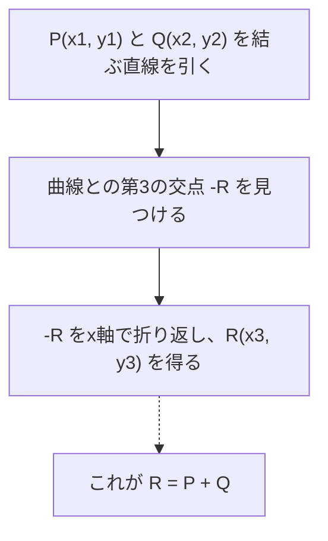
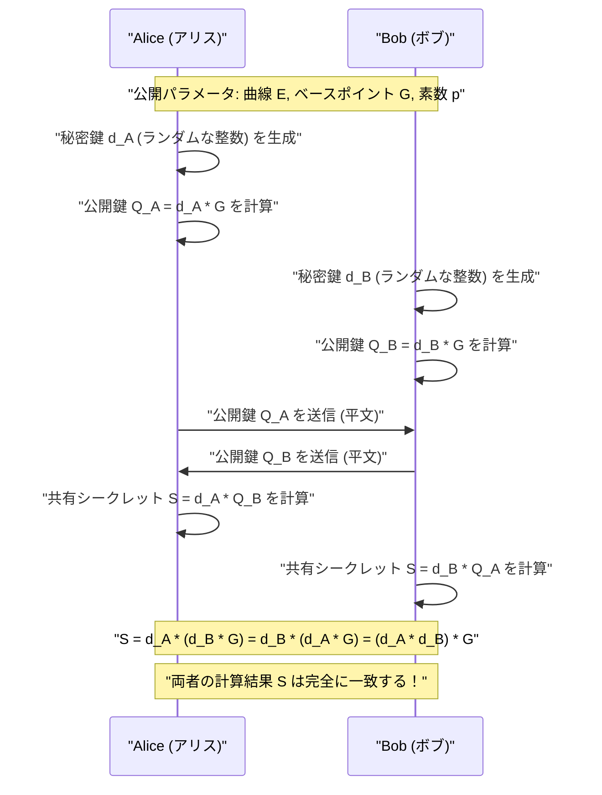
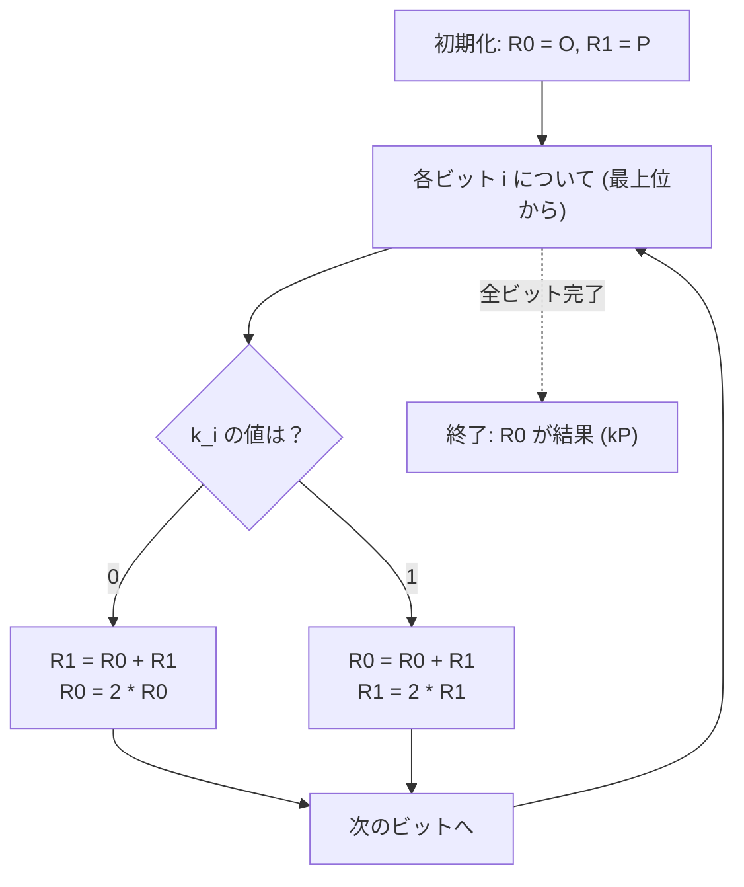

# 楕円曲線暗号（ECC）の数学的基礎とC++での実装

現代の暗号技術において、**楕円曲線暗号（Elliptic Curve Cryptography: ECC）**は極めて重要な役割を果たしています。私たちの日常的なインターネット通信（HTTPS/TLS）から、スマートフォンのセキュアエンクレーブ、SSHによるサーバー認証、FIDOなどのパスワードレス認証、さらにはビットコインやイーサリアムなどの暗号資産に至るまで、現代のデジタル社会の信頼基盤はECCによって支えられていると言っても過言ではありません。

本記事では、この楕円曲線暗号がいかにして機能しているのか、その背後にある美しくも難解な数学的理論（有限体上の代数幾何学）から出発し、実際のC++を用いた実装方法、さらにはサイドチャネル攻撃（タイミング攻撃）を防ぐためのセキュアなコーディング手法まで、圧倒的なボリュームで徹底的に解説します。

---

## 1. なぜ楕円曲線暗号なのか？（RSAとの比較）

公開鍵暗号方式の代名詞といえば、長らく**RSA暗号**でした。RSA暗号は「巨大な合成数の素因数分解の困難性」を安全性の根拠としています。しかし、コンピューターの計算能力の向上に伴い、安全性を維持するためにはRSAの鍵長（モジュラスのビット数）を継続的に長くする必要が生じました。現在では、最低でも2048ビット、より安全を期すなら3072ビットや4096ビットの鍵長が推奨されています。

これに対して、楕円曲線暗号（ECC）は**「楕円曲線上の離散対数問題（ECDLP）」**という別の数学的困難性を安全性の根拠としています。ECDLPを解くための効率的なアルゴリズム（準指数関数時間アルゴリズムなど）は現在に至るまで発見されておらず、既知の最も効率的な攻撃手法であっても指数関数的な時間を要します。

この性質により、ECCは**非常に短い鍵長でRSAと同等のセキュリティ強度を実現できる**という決定的な利点を持ちます。

| セキュリティ強度（ビット） | RSA暗号の鍵長（ビット） | 楕円曲線暗号の鍵長（ビット） | 鍵長の比率 |
| :---: | :---: | :---: | :---: |
| 80 | 1024 | 160 | 1:6 |
| 112 | 2048 | 224 | 1:9 |
| 128 | 3072 | 256 | 1:12 |
| 192 | 7680 | 384 | 1:20 |
| 256 | 15360 | 512 | 1:30 |

上記の表が示すように、128ビットのセキュリティ強度（現在標準的な強度）を得るために、RSAでは3072ビットの鍵が必要ですが、ECCであればわずか256ビットで済みます。これにより、計算量の削減、メモリ使用量の低減、ネットワーク帯域の節約が可能となり、特にリソースが限られたIoTデバイスやスマートカード環境において圧倒的な優位性を誇ります。

---

## 2. 数学的準備：群論と有限体の世界

楕円曲線暗号を真に理解するためには、抽象代数学（群論および体論）の基本的な概念を押さえておく必要があります。ここでは、ECCを構成するための前提知識を簡潔にまとめます。

### 2.1. 群（Group）とアーベル群
**群（Group）**とは、ある集合 $G$ と、その集合上の二項演算（ここでは加法 $+$ とします）の組 $(G, +)$ であり、以下の4つの公理を満たすものです。

1. **閉性（Closure）**: 任意の $a, b \in G$ について、$a + b \in G$ である。
2. **結合法則（Associativity）**: 任意の $a, b, c \in G$ について、$(a + b) + c = a + (b + c)$ が成り立つ。
3. **単位元の存在（Identity element）**: 任意の $a \in G$ について、$a + e = e + a = a$ となる要素 $e \in G$ が存在する。加法群の場合、この単位元を通常 $0$ または $\mathcal{O}$ と表記します。
4. **逆元の存在（Inverse element）**: 任意の $a \in G$ に対して、$a + b = b + a = e$ となる要素 $b \in G$ が存在する。この $b$ を $-a$ と表記します。

さらに、演算の順序を入れ替えても結果が変わらない、すなわち以下の条件を満たす群を**アーベル群（可換群）**と呼びます。

5. **交換法則（Commutativity）**: 任意の $a, b \in G$ について、$a + b = b + a$ が成り立つ。

楕円曲線上の点の集合は、特定の加法ルールを定義することで、この**アーベル群**を構成します。

### 2.2. 有限体（Finite Field）
暗号理論においては、実数や複素数のような連続的で無限の要素を持つ体ではなく、要素の数が有限である**有限体（Finite Field）**またはガロア体（Galois Field）を使用します。

最も基本的な有限体は、素数 $p$ を用いた**素体 $\mathbb{F}_p$** です。これは、$\{0, 1, 2, \dots, p-1\}$ の整数の集合に、モジュロ $p$ （$p$ で割った余り）での四則演算（加算、減算、乗算、除算）を定義したものです。

- **加算**: $(a + b) \pmod p$
- **減算**: $(a - b) \pmod p$
- **乗算**: $(a \times b) \pmod p$
- **除算**: $a \times b^{-1} \pmod p$ （ここで $b^{-1}$ はモジュロ $p$ における $b$ の乗法逆元）

**乗法逆元（Modular Multiplicative Inverse）**の計算は暗号実装において非常に重要です。$b \times b^{-1} \equiv 1 \pmod p$ を満たす $b^{-1}$ を求めるには、主に以下の2つのアルゴリズムが用いられます。

1. **拡張ユークリッドの互除法（Extended Euclidean Algorithm）**: 高速ですが、実装によっては処理時間が入力値に依存するためタイミング攻撃のリスクがあります。
2. **フェルマーの小定理（Fermat's Little Theorem）**: $p$ が素数で $b \neq 0$ のとき、$b^{p-1} \equiv 1 \pmod p$ が成り立ちます。両辺を $b$ で割ると、$b^{p-2} \equiv b^{-1} \pmod p$ となります。つまり、$b$ の $p-2$ 乗を計算することで逆元が求まります。べき乗演算は定数時間で実装しやすいため、暗号実装ではこちらが好まれます。

---

## 3. 楕円曲線の方程式と幾何学

### 3.1. ワイエルシュトラスの標準形
**楕円曲線（Elliptic Curve）**は、一般に以下の**ワイエルシュトラスの標準形（Weierstrass normal form）**と呼ばれる方程式で定義される平面曲線です。

$$ y^2 = x^3 + ax + b $$

ここで、$a$ と $b$ は定数であり、曲線が特異点（自己交差や尖点）を持たない（滑らかな曲線である）ための条件として、以下の**判別式（Discriminant） $\Delta$** がゼロでないことが求められます。

$$ \Delta = -16(4a^3 + 27b^2) \neq 0 $$

特異点を持つ曲線は暗号学的な安全性を損なうため、必ずこの条件を満たす係数 $a, b$ が選ばれます。

### 3.2. 無限遠点（Point at Infinity）
楕円曲線を数学的に完全な群にするために、平面上の点に加えて**「無限遠点（Point at Infinity）」**と呼ばれる仮想的な点を導入します。これを $\mathcal{O}$ （オー）と表記します。

無限遠点 $\mathcal{O}$ は、すべての垂直線が無限の彼方で交わる点として定義されます。群論において、この無限遠点 $\mathcal{O}$ は**加法における単位元**（ゼロ）として機能します。

すなわち、曲線上の任意の点 $P$ に対して、以下が成り立ちます。
$$ P + \mathcal{O} = \mathcal{O} + P = P $$

また、点 $P = (x, y)$ の逆元 $-P$ は、x軸に対して対称な点 $(x, -y)$ と定義されます。したがって：
$$ P + (-P) = \mathcal{O} $$
となります。

---

## 4. 楕円曲線上の群演算（点の加算と2倍算）

楕円曲線暗号の根幹をなすのが、曲線上の点同士の**「加算（Addition）」**という演算です。これは通常の整数の足し算とは異なり、幾何学的な操作に基づいて定義されています。

### 4.1. 幾何学的な加算（Tangent and Chord Method）
曲線上の異なる2点 $P$ と $Q$ を足して新しい点 $R$ ($R = P + Q$) を求める手順は以下の通りです。

1. 点 $P$ と点 $Q$ を通る直線（弦）を引きます。
2. この直線は、楕円曲線と必ずもう一つの点（これを $-R$ とします）で交わります。（※代数幾何学の定理によります）
3. 交点 $-R$ をx軸に対して対称に折り返した点（y座標の符号を反転させた点）が、求める点 $R$ となります。



### 4.2. 点の2倍算（Point Doubling）
点 $P$ に同じ点 $P$ を足す場合（$P + P = 2P$）、2点を通る直線を引くことができません。この場合は、**点 $P$ における曲線の接線（Tangent）**を引きます。

1. 点 $P$ における曲線の接線を引きます。
2. この接線は曲線ともう一つの点 $-R$ で交わります。
3. 交点をx軸で対称に折り返した点が、求める点 $R = 2P$ となります。

### 4.3. 代数的な計算公式
幾何学的な操作を、コンピューターで計算できるように代数的な公式に落とし込みます。
演算はすべて**有限体 $\mathbb{F}_p$ 上（モジュロ $p$）**で行われます。

点 $P = (x_1, y_1)$、点 $Q = (x_2, y_2)$ とします。
また、計算結果の点を $R = P + Q = (x_3, y_3)$ とします。

直線の傾きを $\lambda$（ラムダ）とします。

**【ケース1： $P \neq Q$ の場合（点の加算）】**
傾き $\lambda$ は、2点間の変化の割合です。
$$ \lambda \equiv \frac{y_2 - y_1}{x_2 - x_1} \pmod p $$
$$ \lambda \equiv (y_2 - y_1) \cdot (x_2 - x_1)^{-1} \pmod p $$

この $\lambda$ を用いて、$x_3, y_3$ は次のように求まります。
$$ x_3 \equiv \lambda^2 - x_1 - x_2 \pmod p $$
$$ y_3 \equiv \lambda(x_1 - x_3) - y_1 \pmod p $$

**【ケース2： $P = Q$ の場合（点の2倍算）】**
傾き $\lambda$ は、微分によって求められる接線の傾きになります。（$y^2 = x^3 + ax + b$ を暗黙に微分します）
$$ 2y \cdot y' = 3x^2 + a \implies y' = \frac{3x^2 + a}{2y} $$
したがって、
$$ \lambda \equiv (3x_1^2 + a) \cdot (2y_1)^{-1} \pmod p $$

$x_3, y_3$ の式は加算と同じ形ですが、$x_2 = x_1$ であるため以下のようになります。
$$ x_3 \equiv \lambda^2 - 2x_1 \pmod p $$
$$ y_3 \equiv \lambda(x_1 - x_3) - y_1 \pmod p $$

> [!IMPORTANT]
> これらの公式には $(x_2 - x_1)^{-1}$ や $(2y_1)^{-1}$ といった**除算（モジュロ逆元の計算）**が含まれています。モジュロ逆元の計算は計算コストが非常に高いため、実際の実装では除算を遅延させる**「ヤコビ座標系（Jacobian Coordinates）」**などの射影座標系が一般的に用いられます。

---

## 5. スカラー倍算と楕円曲線離散対数問題（ECDLP）

楕円曲線暗号において、最も計算量が多く、かつセキュリティの中核をなす演算が**スカラー倍算（Scalar Multiplication）**です。

### 5.1. スカラー倍算とは
ある点 $P$ を $k$ 回足し合わせる操作をスカラー倍算と呼び、$kP$ と表記します。
$$ kP = \underbrace{P + P + \dots + P}_{k\text{回}} $$

ここで、$k$ は非常に大きな整数（例えば256ビットの整数）です。

### 5.2. 楕円曲線離散対数問題（ECDLP）
楕円曲線暗号の安全性は、以下の問題の困難性に依存しています。

> **楕円曲線離散対数問題 (Elliptic Curve Discrete Logarithm Problem: ECDLP)**
> 既知の点 $P$（ベースポイント）と、計算結果の点 $Q$ が与えられたとき、$Q = kP$ を満たすスカラー $k$ を求めよ。

$k$ と $P$ から $Q$ を計算する（順方向）のは後述のアルゴリズムを用いれば簡単（多項式時間）ですが、$P$ と $Q$ から $k$ を逆算する（逆方向）ことは、総当たり的な探索以外に効率的な解法がなく、事実上不可能です（一方向性関数）。
暗号プロトコルにおいては、**$k$ が「秘密鍵」、$Q$ が「公開鍵」**に対応します。

### 5.3. Double-and-Add アルゴリズム
$k$ が巨大な数（例：$2^{256}$）の場合、$P$ を愚直に $k$ 回足し合わせることは宇宙の寿命が尽きても終わりません。そこで、高速にスカラー倍算を行うために**Double-and-Add法（バイナリ法）**が用いられます。

これは、整数のべき乗を高速に計算する「繰り返し二乗法」の楕円曲線版です。スカラー $k$ を2進数表現し、上位ビットから順に処理します。

1. 結果を保持する点 $R$ を $\mathcal{O}$ で初期化する。
2. $k$ の最上位ビットから最下位ビットまで以下を繰り返す：
   - $R$ を2倍する（Point Doubling: $R = 2R$）
   - もし現在のビットが `1` なら、$R$ に $P$ を足す（Point Addition: $R = R + P$）

このアルゴリズムにより、計算量は $O(k)$ から $O(\log_2 k)$ に劇的に削減され、現実的な時間（ミリ秒単位）で計算が可能になります。

---

## 6. 楕円曲線ディフィー・ヘルマン（ECDH）鍵共有

ここでは、ECCの最も代表的な応用例である**ECDH（Elliptic Curve Diffie-Hellman）鍵共有プロトコル**の仕組みを解説します。ECDHは、盗聴可能な通信路上で、アリスとボブが安全に共通の秘密鍵（セッションキー）を生成・共有するための仕組みです（TLSハンドシェイクの中核です）。

**【前提パラメータ（ドメインパラメータ）】**
両者はあらかじめ、使用する楕円曲線 $E$、素数 $p$、およびベースポイント $G$ を共有しています。（例としてNIST P-256やsecp256k1など）



盗聴者（イヴ）は通信経路上を流れる $G$、$Q_A$、$Q_B$ を傍受できますが、ECDLPの困難性により、$Q_A = d_A \cdot G$ からアリスの秘密鍵 $d_A$ を割り出すことはできません。また、$Q_A$ と $Q_B$ を掛け合わせても共有鍵 $S$ にはならないため、盗聴者は $S$ を計算することができません。

---

## 7. 実装の落とし穴：サイドチャネル攻撃と対策

理論的に完璧な暗号アルゴリズムであっても、それをプログラムとして実装する過程で脆弱性が生まれ得ます。それが**「サイドチャネル攻撃（Side-Channel Attack）」**です。

### 7.1. タイミング攻撃（Timing Attack）
前述の Double-and-Add アルゴリズムを振り返ってみましょう。

```cpp
// 脆弱な Double-and-Add の疑似コード
Point R = Point::Infinity;
for (int i = 255; i >= 0; i--) {
    R = PointDoubling(R);         // 常に実行される
    if (bit(k, i) == 1) {
        R = PointAddition(R, P);  // ビットが1のときだけ実行される！
    }
}
```

この実装には致命的な欠陥があります。ビットが `1` のときは Point Addition が実行されるため、ビットが `0` のときよりも**計算時間がわずかに長く**なります。また、プロセッサの分岐予測やキャッシュメモリの挙動も変化します。
攻撃者がこの計算時間（あるいは消費電力）の微小な差異を何千回も統計的に観測することで、**秘密鍵 $k$ のビット列を1ビットずつ完全に復元**されてしまいます。これがタイミング攻撃です。

### 7.2. Constant-Time 実装：Montgomery Ladder
タイミング攻撃を防ぐためには、**秘密鍵のビット値にかかわらず、実行される命令のシーケンスと計算時間が常に一定（Constant-Time）**であるアルゴリズムを採用する必要があります。

その代表例が**Montgomery Ladder（モンゴメリのラダー）**です。



Montgomery Ladderの美しい点は、ビットが `0` であっても `1` であっても、**「常に1回のPoint Additionと1回のPoint Doubling」**が実行されることです。これにより、計算時間のデータ依存性が完全に排除されます。

ただし、分岐（`if (k_i == 0)`）自体が存在すると、コンパイラの最適化やCPUの分岐予測によって実行時間が変動するリスクが残ります。そのため、実際のConstant-Time実装では、条件分岐（`if`文）を排除し、**ビット演算を用いた条件付きスワップ（Conditional Swap）**を利用します。

---

## 8. C++による楕円曲線暗号の実装

ここからは、理論をC++のコードに落とし込んでいきます。実用的な暗号ライブラリ（OpenSSLやlibsodiumなど）は高度なアセンブリ最適化やヤコビ座標系を使用していますが、ここでは数学的理解を深めるために、**アフィン座標系を用いたわかりやすいConstant-Time実装**の骨組みを示します。

巨大な整数の演算には `boost::multiprecision::cpp_int` を用いると仮定します。

### 8.1. モジュロ演算と逆元
まず、有限体上の演算ヘルパー関数を定義します。フェルマーの小定理による逆元計算を実装します。

```cpp
#include <iostream>
#include <vector>
#include <stdexcept>
#include <boost/multiprecision/cpp_int.hpp>

using namespace boost::multiprecision;

// 例として secp256k1 の素数 p とパラメータ
const cpp_int p("0xFFFFFFFFFFFFFFFFFFFFFFFFFFFFFFFFFFFFFFFFFFFFFFFFFFFFFFFEFFFFFC2F");
const cpp_int a = 0;
const cpp_int b = 7;

// 正の剰余を返すモジュロ演算
cpp_int mod(cpp_int x, cpp_int m) {
    cpp_int r = x % m;
    return r < 0 ? r + m : r;
}

// べき乗剰余計算 (x^y mod m)
cpp_int powerMod(cpp_int base, cpp_int exp, cpp_int m) {
    cpp_int res = 1;
    base = mod(base, m);
    while (exp > 0) {
        if (exp % 2 == 1) res = mod(res * base, m);
        base = mod(base * base, m);
        exp /= 2;
    }
    return res;
}

// フェルマーの小定理を用いたモジュロ逆元
cpp_int modInverse(cpp_int n, cpp_int m) {
    // mが素数である前提: n^(m-2) ≡ n^(-1) mod m
    return powerMod(n, m - 2, m);
}
```

### 8.2. 点の表現と群演算（加算・2倍算）
無限遠点をフラグで管理する `Point` 構造体と、加算の公式を実装します。

```cpp
struct Point {
    cpp_int x;
    cpp_int y;
    bool isInfinity;

    // 無限遠点の生成
    Point() : x(0), y(0), isInfinity(true) {}
    
    // 通常の点の生成
    Point(cpp_int x, cpp_int y) : x(x), y(y), isInfinity(false) {}
};

// 楕円曲線上の点の加算 (R = P + Q)
Point pointAdd(const Point& P, const Point& Q) {
    if (P.isInfinity) return Q;
    if (Q.isInfinity) return P;

    if (P.x == Q.x && mod(P.y + Q.y, p) == 0) {
        return Point(); // P + (-P) = 無限遠点
    }

    cpp_int lambda;
    if (P.x == Q.x && P.y == Q.y) {
        // Point Doubling (P = Q の場合)
        // lambda = (3x^2 + a) / 2y
        cpp_int num = mod(3 * P.x * P.x + a, p);
        cpp_int den = modInverse(mod(2 * P.y, p), p);
        lambda = mod(num * den, p);
    } else {
        // Point Addition (P != Q の場合)
        // lambda = (y2 - y1) / (x2 - x1)
        cpp_int num = mod(Q.y - P.y, p);
        cpp_int den = modInverse(mod(Q.x - P.x, p), p);
        lambda = mod(num * den, p);
    }

    cpp_int x3 = mod(lambda * lambda - P.x - Q.x, p);
    cpp_int y3 = mod(lambda * (P.x - x3) - P.y, p);

    return Point(x3, y3);
}
```

### 8.3. Constant-Time Conditional Swap の実装
秘密鍵のビット値に基づいて変数の中身を入れ替える際、`if` 文を使わずにビット演算（マスク）のみで入れ替えを行います。これにより実行経路が完全に一定になります。

> [!TIP]
> 実際の実装では、`cpp_int` のような動的確保される多倍長整数クラスは Constant-Time 処理には適していません。メモリ割り当てや配列サイズの変動によってタイミング情報が漏洩するためです。実用ライブラリでは、固定長（例えば uint64_t × 4要素 の配列）で表現し、ビット単位でのマスク処理を実装します。以下は概念的な例です。

```cpp
// 概念的な Constant-Time Swap (固定長整数の場合を想定)
// bit が 1 なら P1 と P2 を交換し、0 なら交換しない
void cswap(Point& P1, Point& P2, uint8_t bit) {
    // bit は 0 または 1。マスクは bit=1 なら全ビット1(0xFF..)、0なら全ビット0。
    // (ここでは説明のため、固定長の BigInt クラスの各ワードを w と仮定)
    /*
    uint64_t mask = 0 - (uint64_t)bit;
    for (int i = 0; i < NUM_WORDS; i++) {
        uint64_t dummy = mask & (P1.x.words[i] ^ P2.x.words[i]);
        P1.x.words[i] ^= dummy;
        P2.x.words[i] ^= dummy;
        // y座標や isInfinity フラグも同様に処理
    }
    */
    
    // ※ boost::multiprecision での完全な定数時間スワップは困難ですが、
    // ここではロジックの理解のために分岐によるシミュレートにとどめます。
    if (bit == 1) {
        std::swap(P1, P2);
    }
}
```

### 8.4. Montgomery Ladder によるスカラー倍算
前述の `pointAdd` と `cswap` を組み合わせて、セキュアなスカラー倍算を実装します。

```cpp
// スカラー倍算 k * P (Montgomery Ladder 方式)
Point scalarMultiply(const Point& P, cpp_int k) {
    Point R0 = Point(); // 無限遠点
    Point R1 = P;

    // k のビット長を取得 (secp256k1 なら 256 ビット)
    int numBits = 256; 
    
    for (int i = numBits - 1; i >= 0; i--) {
        // iビット目の値を取得 (0 または 1)
        uint8_t bit = static_cast<uint8_t>(bit_test(k, i) ? 1 : 0);

        // bit == 1 なら R0 と R1 をスワップ
        cswap(R0, R1, bit);

        // 常に同じ演算を実行 (Point Addition と Point Doubling)
        R1 = pointAdd(R0, R1);
        R0 = pointAdd(R0, R0);

        // bit == 1 だった場合、状態を元に戻すために再度スワップ
        cswap(R0, R1, bit);
    }

    return R0;
}
```

この実装ロジックにより、スカラー $k$ の各ビットが `0` であっても `1` であっても、各ループイテレーション内で実行される演算（`cswap` $\to$ `pointAdd` $\to$ `pointAdd` $\to$ `cswap`）は全く同じフローとなり、タイミングやキャッシュアクセスパターンの差異を通じた秘密情報の漏洩を強力に防ぐことができます。

---

## 9. まとめ

楕円曲線暗号（ECC）は、初見では「なぜ直線を引いて交点を折り返すという幾何学的な操作が暗号になるのか？」と不思議に思えるかもしれません。しかし、有限体という離散的な世界にマッピングすることで、見事な一方向性関数（離散対数問題）を構築できるという、数学と暗号学の奇跡的な融合の産物です。

本記事では以下の重要なポイントを解説しました。

1. **RSAに対する優位性**: 非常に短い鍵長で強力なセキュリティを提供し、現代のモバイル・IoT時代に最適であること。
2. **群論と有限体の基礎**: ECCの土台となる数学的構造。
3. **加算と2倍算の公式**: ワイエルシュトラス方程式を用いた代数的な群演算の実装方法。
4. **サイドチャネル攻撃の脅威**: 秘密鍵のビットに依存した条件分岐が致命的な脆弱性を生むこと。
5. **Constant-Time 実装**: Montgomery Ladder と Conditional Swap を用いて、ハードウェアレベルの挙動を均一化し攻撃を防ぐC++コーディング技法。

実際にプロダクション環境で動作する暗号ライブラリを自作することは、セキュリティ上のリスクが極めて高いため非推奨（"Don't roll your own crypto"）とされています。しかし、その内部で動いているアルゴリズムと数学的背景を深く理解することは、よりセキュアでパフォーマンスの高いシステムを設計・運用するエンジニアにとって、かけがえのない強力な武器となるはずです。

次回の記事では、この楕円曲線を用いたデジタル署名アルゴリズムである **ECDSA (Elliptic Curve Digital Signature Algorithm)** のメカニズムや、ビットコインで採用されている **Schnorr署名** についてさらに深く掘り下げていきたいと思います。
