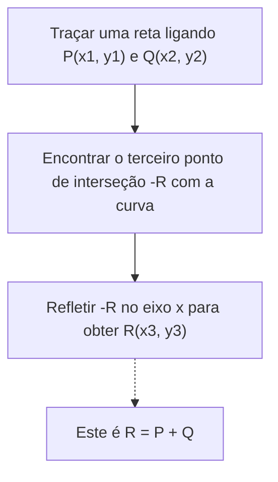
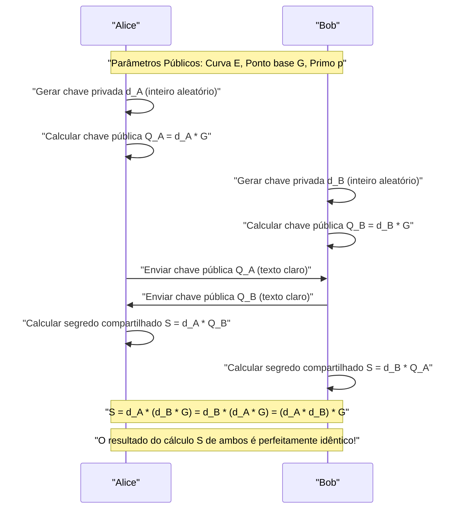
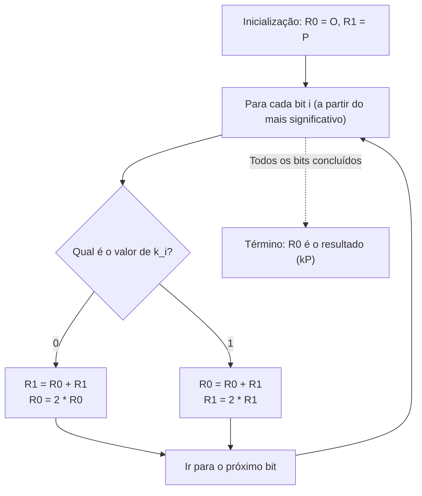

# Fundamentos Matemáticos da Criptografia de Curva Elíptica (ECC) e sua Implementação em C++

Na tecnologia criptográfica moderna, a **Criptografia de Curva Elíptica (Elliptic Curve Cryptography: ECC)** desempenha um papel extremamente importante. Desde nossas comunicações diárias na internet (HTTPS/TLS), até o enclave seguro dos smartphones, autenticação de servidores via SSH, autenticação sem senha como FIDO e, além disso, criptoativos como Bitcoin e Ethereum, não é exagero dizer que a base de confiança da sociedade digital moderna é sustentada pela ECC.

Neste artigo, explicaremos de forma exaustiva e com um volume impressionante como essa criptografia de curva elíptica funciona, partindo da teoria matemática bela e complexa por trás dela (geometria algébrica em corpos finitos), passando pelo método de implementação real usando C++, até as técnicas de codificação segura para evitar ataques de canal lateral (ataques de tempo).

---

## 1. Por que a Criptografia de Curva Elíptica? (Comparação com RSA)

Por muito tempo, o sinônimo de criptografia de chave pública foi a **Criptografia RSA**. A criptografia RSA baseia a sua segurança na "dificuldade de fatoração de números compostos gigantes". No entanto, com o aumento da capacidade de cálculo dos computadores, surgiu a necessidade de aumentar continuamente o tamanho da chave RSA (o número de bits do módulo) para manter a segurança. Atualmente, recomenda-se um tamanho de chave de no mínimo 2048 bits, ou 3072 bits e 4096 bits para maior segurança.

Por outro lado, a criptografia de curva elíptica (ECC) baseia a sua segurança em outra dificuldade matemática chamada **"Problema do Logaritmo Discreto em Curvas Elípticas (ECDLP)"**. Até o momento, nenhum algoritmo eficiente (como algoritmos de tempo subexponencial) foi descoberto para resolver o ECDLP, e mesmo os métodos de ataque mais eficientes conhecidos requerem tempo exponencial.

Devido a essa propriedade, a ECC possui a vantagem decisiva de **alcançar uma força de segurança equivalente à do RSA com um tamanho de chave muito menor**.

| Força de Segurança (bits) | Tamanho da Chave RSA (bits) | Tamanho da Chave de Curva Elíptica (bits) | Proporção do Tamanho da Chave |
| :---: | :---: | :---: | :---: |
| 80 | 1024 | 160 | 1:6 |
| 112 | 2048 | 224 | 1:9 |
| 128 | 3072 | 256 | 1:12 |
| 192 | 7680 | 384 | 1:20 |
| 256 | 15360 | 512 | 1:30 |

Como a tabela acima mostra, para obter uma força de segurança de 128 bits (o padrão atual), o RSA requer uma chave de 3072 bits, mas a ECC requer apenas 256 bits. Isso permite a redução da quantidade de cálculos, a diminuição do uso de memória e a economia de largura de banda de rede, apresentando uma vantagem esmagadora, especialmente em ambientes com recursos limitados como dispositivos IoT e cartões inteligentes.

---

## 2. Preparação Matemática: Teoria dos Grupos e Corpos Finitos

Para entender verdadeiramente a criptografia de curva elíptica, é necessário compreender os conceitos básicos de álgebra abstrata (teoria dos grupos e teoria dos corpos). Aqui, resumiremos os conhecimentos prévios para construir a ECC.

### 2.1. Grupos (Group) e Grupos Abelianos
Um **Grupo (Group)** é um conjunto de um dado conjunto $G$ com uma operação binária nesse conjunto (aqui será a adição $+$), $(G, +)$, que satisfaz os 4 axiomas a seguir.

1. **Fechamento (Closure)**: Para quaisquer $a, b \in G$, $a + b \in G$.
2. **Associatividade (Associativity)**: Para quaisquer $a, b, c \in G$, $(a + b) + c = a + (b + c)$ é válido.
3. **Existência do Elemento Neutro (Identity element)**: Existe um elemento $e \in G$ tal que para qualquer $a \in G$, $a + e = e + a = a$. No caso de grupos aditivos, este elemento neutro é normalmente denotado como $0$ ou $\mathcal{O}$.
4. **Existência do Elemento Inverso (Inverse element)**: Para qualquer $a \in G$, existe um elemento $b \in G$ tal que $a + b = b + a = e$. Esse $b$ é denotado como $-a$.

Além disso, um grupo que não altera o resultado mesmo mudando a ordem da operação, ou seja, que satisfaz a seguinte condição, é chamado de **Grupo Abeliano (Grupo Comutativo)**.

5. **Comutatividade (Commutativity)**: Para quaisquer $a, b \in G$, $a + b = b + a$ é válido.

O conjunto de pontos em uma curva elíptica forma este **grupo abeliano** pela definição de uma regra de adição específica.

### 2.2. Corpos Finitos (Finite Field)
Na teoria criptográfica, em vez de corpos contínuos com infinitos elementos como os números reais ou complexos, usamos **Corpos Finitos (Finite Field)** ou Corpos de Galois, onde o número de elementos é finito.

O corpo finito mais básico é o **corpo primo $\mathbb{F}_p$** que usa o número primo $p$. Ele é a definição das quatro operações aritméticas (adição, subtração, multiplicação e divisão) em módulo $p$ (resto da divisão por $p$) no conjunto de inteiros $\{0, 1, 2, \dots, p-1\}$.

- **Adição**: $(a + b) \pmod p$
- **Subtração**: $(a - b) \pmod p$
- **Multiplicação**: $(a \times b) \pmod p$
- **Divisão**: $a \times b^{-1} \pmod p$ (onde $b^{-1}$ é o inverso multiplicativo de $b$ módulo $p$)

O cálculo do **Inverso Multiplicativo Modular (Modular Multiplicative Inverse)** é extremamente importante nas implementações criptográficas. Para encontrar o $b^{-1}$ que satisfaz $b \times b^{-1} \equiv 1 \pmod p$, são utilizados principalmente os 2 algoritmos a seguir.

1. **Algoritmo de Euclides Estendido (Extended Euclidean Algorithm)**: Rápido, mas dependendo da implementação, o tempo de processamento depende do valor de entrada, o que representa um risco de ataques de tempo.
2. **Pequeno Teorema de Fermat (Fermat's Little Theorem)**: Quando $p$ é um número primo e $b \neq 0$, $b^{p-1} \equiv 1 \pmod p$ é válido. Dividindo ambos os lados por $b$, obtemos $b^{p-2} \equiv b^{-1} \pmod p$. Em outras palavras, o inverso é encontrado calculando $b$ elevado a $p-2$. A operação de exponenciação é fácil de implementar em tempo constante, por isso é a preferida em implementações criptográficas.

---

## 3. Equação da Curva Elíptica e Geometria

### 3.1. Forma Normal de Weierstrass
Uma **Curva Elíptica (Elliptic Curve)** é geralmente uma curva plana definida pela equação chamada de **Forma normal de Weierstrass (Weierstrass normal form)** a seguir.

$$ y^2 = x^3 + ax + b $$

Aqui, $a$ e $b$ são constantes, e como condição para que a curva não possua singularidades (autointerseção ou cúspides) (para que seja uma curva suave), exige-se que o **Discriminante (Discriminant) $\Delta$** a seguir não seja zero.

$$ \Delta = -16(4a^3 + 27b^2) \neq 0 $$

Como as curvas com singularidades comprometem a segurança criptográfica, coeficientes $a, b$ que satisfaçam essa condição são sempre escolhidos.

### 3.2. Ponto no Infinito (Point at Infinity)
Para transformar a curva elíptica em um grupo matematicamente perfeito, além dos pontos no plano, introduzimos um ponto virtual chamado **"Ponto no Infinito (Point at Infinity)"**. Ele é denotado como $\mathcal{O}$ (O).

O ponto no infinito $\mathcal{O}$ é definido como o ponto onde todas as linhas verticais se cruzam no infinito. Na teoria dos grupos, este ponto no infinito $\mathcal{O}$ funciona como o **elemento neutro na adição** (zero).

Ou seja, para qualquer ponto $P$ na curva, vale o seguinte:
$$ P + \mathcal{O} = \mathcal{O} + P = P $$

Além disso, o inverso $-P$ do ponto $P = (x, y)$ é definido como o ponto simétrico em relação ao eixo x $(x, -y)$. Portanto:
$$ P + (-P) = \mathcal{O} $$
é obtido.

---

## 4. Operações de Grupo em Curvas Elípticas (Adição de Pontos e Dobro)

O núcleo da criptografia de curva elíptica é a operação de **"Adição (Addition)"** entre pontos na curva. Diferente da adição normal de inteiros, ela é baseada em operações geométricas.

### 4.1. Adição Geométrica (Tangent and Chord Method)
O procedimento para somar 2 pontos diferentes $P$ e $Q$ na curva para encontrar um novo ponto $R$ ($R = P + Q$) é o seguinte.

1. Trace uma reta (corda) passando pelo ponto $P$ e pelo ponto $Q$.
2. Esta reta sempre cruzará a curva elíptica em um terceiro ponto (vamos chamá-lo de $-R$). (*Pelo teorema da geometria algébrica)
3. O ponto simétrico de $-R$ em relação ao eixo x (o ponto com o sinal da coordenada y invertido) será o ponto $R$ desejado.



### 4.2. Dobro de um Ponto (Point Doubling)
Quando somamos o ponto $P$ ao próprio ponto $P$ ($P + P = 2P$), não podemos traçar uma reta que passe por 2 pontos. Neste caso, traçamos a **tangente (Tangent) à curva no ponto $P$**.

1. Trace a tangente à curva no ponto $P$.
2. Esta tangente cruzará a curva em outro ponto $-R$.
3. O ponto simétrico desse cruzamento em relação ao eixo x será o ponto $R = 2P$ desejado.

### 4.3. Fórmulas de Cálculo Algébrico
As operações geométricas são convertidas em fórmulas algébricas para que possam ser calculadas por computadores.
As operações são todas feitas no **corpo finito $\mathbb{F}_p$ (módulo $p$)**.

Sejam os pontos $P = (x_1, y_1)$ e $Q = (x_2, y_2)$.
Além disso, seja o ponto do resultado do cálculo $R = P + Q = (x_3, y_3)$.

Seja $\lambda$ (lambda) a inclinação da reta.

**[Caso 1: Quando $P \neq Q$ (Adição de Pontos)]**
A inclinação $\lambda$ é a taxa de variação entre os 2 pontos.
$$ \lambda \equiv \frac{y_2 - y_1}{x_2 - x_1} \pmod p $$
$$ \lambda \equiv (y_2 - y_1) \cdot (x_2 - x_1)^{-1} \pmod p $$

Usando esse $\lambda$, $x_3, y_3$ são calculados da seguinte forma.
$$ x_3 \equiv \lambda^2 - x_1 - x_2 \pmod p $$
$$ y_3 \equiv \lambda(x_1 - x_3) - y_1 \pmod p $$

**[Caso 2: Quando $P = Q$ (Dobro de Ponto)]**
A inclinação $\lambda$ será a inclinação da tangente, encontrada pela derivada. (Diferenciação implícita de $y^2 = x^3 + ax + b$)
$$ 2y \cdot y' = 3x^2 + a \implies y' = \frac{3x^2 + a}{2y} $$
Portanto,
$$ \lambda \equiv (3x_1^2 + a) \cdot (2y_1)^{-1} \pmod p $$

As equações de $x_3, y_3$ têm o mesmo formato da adição, mas como $x_2 = x_1$, ficam assim:
$$ x_3 \equiv \lambda^2 - 2x_1 \pmod p $$
$$ y_3 \equiv \lambda(x_1 - x_3) - y_1 \pmod p $$

> [!IMPORTANT]
> Estas fórmulas contêm **divisões (cálculo do inverso modular)** como $(x_2 - x_1)^{-1}$ e $(2y_1)^{-1}$. O cálculo do inverso modular tem um custo computacional muito alto, então em implementações reais, geralmente se usa um sistema de coordenadas projetivas, como o **"Sistema de Coordenadas Jacobiano (Jacobian Coordinates)"**, que adia a divisão.

---

## 5. Multiplicação Escalar e o Problema do Logaritmo Discreto em Curvas Elípticas (ECDLP)

Na criptografia de curva elíptica, a operação de maior complexidade computacional e que forma o núcleo da segurança é a **Multiplicação Escalar (Scalar Multiplication)**.

### 5.1. O que é a Multiplicação Escalar
A operação de somar um ponto $P$ a ele mesmo $k$ vezes é chamada de multiplicação escalar e denotada como $kP$.
$$ kP = \underbrace{P + P + \dots + P}_{k\text{ vezes}} $$

Aqui, $k$ é um inteiro muito grande (por exemplo, um número inteiro de 256 bits).

### 5.2. Problema do Logaritmo Discreto em Curvas Elípticas (ECDLP)
A segurança da criptografia de curva elíptica depende da dificuldade do seguinte problema.

> **Problema do Logaritmo Discreto em Curvas Elípticas (Elliptic Curve Discrete Logarithm Problem: ECDLP)**
> Dado um ponto conhecido $P$ (ponto base) e um ponto de resultado do cálculo $Q$, encontre o escalar $k$ que satisfaz $Q = kP$.

É fácil (em tempo polinomial) calcular $Q$ a partir de $k$ e $P$ (direção direta) usando os algoritmos que serão mencionados depois, mas calcular inversamente $k$ a partir de $P$ e $Q$ (direção inversa) é virtualmente impossível sem usar uma busca exaustiva (força bruta), tornando-a uma função de via única.
Nos protocolos criptográficos, **$k$ corresponde à "chave privada" e $Q$ corresponde à "chave pública"**.

### 5.3. Algoritmo Double-and-Add
Quando $k$ é um número gigante (ex: $2^{256}$), a adição direta de $P$ por $k$ vezes não terminaria nem com o fim da vida do universo. Assim, para realizar a multiplicação escalar rapidamente, usa-se o **método Double-and-Add (Método Binário)**.

Esta é a versão em curva elíptica da "exponenciação modular rápida" para calcular rapidamente potências de números inteiros. Ele expressa o escalar $k$ em binário e o processa a partir do bit mais significativo.

1. Inicialize o ponto $R$, que guardará o resultado, como $\mathcal{O}$.
2. Repita do bit mais significativo até o bit menos significativo de $k$:
   - Dobre $R$ (Point Doubling: $R = 2R$)
   - Se o bit atual for `1`, adicione $P$ a $R$ (Point Addition: $R = R + P$)

Com este algoritmo, a complexidade computacional é drasticamente reduzida de $O(k)$ para $O(\log_2 k)$, tornando o cálculo possível em tempo realista (na ordem de milissegundos).

---

## 6. Troca de Chaves Diffie-Hellman em Curva Elíptica (ECDH)

Aqui explicaremos o funcionamento do protocolo mais representativo de aplicação da ECC, o **protocolo de troca de chaves ECDH (Elliptic Curve Diffie-Hellman)**. O ECDH é um mecanismo que permite que Alice e Bob gerem e compartilhem de forma segura uma chave secreta comum (chave de sessão) sobre um canal de comunicação sujeito a interceptação (é o núcleo do handshake TLS).

**[Parâmetros Prévios (Parâmetros de Domínio)]**
As duas partes compartilham com antecedência a curva elíptica $E$ a ser usada, um número primo $p$, e um ponto base $G$. (Exemplos incluem NIST P-256 e secp256k1)



Um interceptador (Eve) pode capturar $G$, $Q_A$ e $Q_B$ que fluem na via de comunicação, mas devido à dificuldade do ECDLP, não pode deduzir a chave privada $d_A$ de Alice a partir de $Q_A = d_A \cdot G$. Além disso, multiplicar $Q_A$ e $Q_B$ não resulta na chave compartilhada $S$, de forma que o interceptador não pode calcular $S$.

---

## 7. Armadilhas de Implementação: Ataques de Canal Lateral e Contramedidas

Mesmo que seja um algoritmo de criptografia teoricamente perfeito, vulnerabilidades podem surgir no processo de implementá-lo como um programa. Isso é conhecido como **"Ataque de Canal Lateral (Side-Channel Attack)"**.

### 7.1. Ataques de Tempo (Timing Attack)
Vamos rever o algoritmo Double-and-Add mencionado anteriormente.

```cpp
// Pseudocódigo vulnerável de Double-and-Add
Point R = Point::Infinity;
for (int i = 255; i >= 0; i--) {
    R = PointDoubling(R);         // Sempre executado
    if (bit(k, i) == 1) {
        R = PointAddition(R, P);  // Executado apenas quando o bit é 1!
    }
}
```

Esta implementação tem uma falha fatal. Como a Adição de Pontos (Point Addition) é executada quando o bit é `1`, o **tempo de cálculo é ligeiramente maior** do que quando o bit é `0`. Além disso, o comportamento da previsão de ramificação do processador e da memória cache também muda.
Observando estatisticamente essas diferenças microscópicas no tempo de computação (ou consumo de energia) milhares de vezes, um atacante pode **restaurar a sequência de bits da chave secreta $k$ completamente, bit a bit**. Esse é o ataque de tempo.

### 7.2. Implementação em Tempo Constante (Constant-Time): Montgomery Ladder
Para prevenir ataques de tempo, é necessário adotar um algoritmo em que **a sequência de instruções executadas e o tempo de computação sejam sempre constantes (Constant-Time), independentemente do valor do bit da chave secreta**.

Um exemplo representativo disso é a **Escada de Montgomery (Montgomery Ladder)**.



A beleza da Montgomery Ladder é que, seja o bit `0` ou `1`, **"sempre 1 Point Addition e 1 Point Doubling"** são executados. Isto elimina completamente a dependência de dados no tempo de computação.

No entanto, se a própria ramificação (`if (k_i == 0)`) existir, haverá um risco de variação no tempo de execução devido à otimização do compilador e à previsão de ramificação da CPU. Portanto, nas implementações em Tempo Constante reais, as ramificações condicionais (comandos `if`) são eliminadas e usa-se a **troca condicional (Conditional Swap) usando operações de bit**.

---

## 8. Implementação da Criptografia de Curva Elíptica em C++

A partir daqui, transformaremos a teoria em código C++. Bibliotecas de criptografia práticas (como OpenSSL e libsodium) usam otimizações avançadas em Assembly e o sistema de coordenadas jacobiano, mas aqui mostraremos a estrutura de uma **implementação de tempo constante simples usando coordenadas afins**, para aprofundar a compreensão matemática.

Supõe-se que será usado `boost::multiprecision::cpp_int` para operações com números inteiros enormes.

### 8.1. Aritmética Modular e Inverso
Primeiro, vamos definir as funções auxiliares de cálculo sobre o corpo finito. Vamos implementar o cálculo do inverso com base no pequeno teorema de Fermat.

```cpp
#include <iostream>
#include <vector>
#include <stdexcept>
#include <boost/multiprecision/cpp_int.hpp>

using namespace boost::multiprecision;

// Exemplo: primo p e parâmetros da secp256k1
const cpp_int p("0xFFFFFFFFFFFFFFFFFFFFFFFFFFFFFFFFFFFFFFFFFFFFFFFFFFFFFFFEFFFFFC2F");
const cpp_int a = 0;
const cpp_int b = 7;

// Aritmética modular retornando resto positivo
cpp_int mod(cpp_int x, cpp_int m) {
    cpp_int r = x % m;
    return r < 0 ? r + m : r;
}

// Cálculo de exponenciação modular (x^y mod m)
cpp_int powerMod(cpp_int base, cpp_int exp, cpp_int m) {
    cpp_int res = 1;
    base = mod(base, m);
    while (exp > 0) {
        if (exp % 2 == 1) res = mod(res * base, m);
        base = mod(base * base, m);
        exp /= 2;
    }
    return res;
}

// Inverso modular usando o Pequeno Teorema de Fermat
cpp_int modInverse(cpp_int n, cpp_int m) {
    // Pressupondo que m seja primo: n^(m-2) ≡ n^(-1) mod m
    return powerMod(n, m - 2, m);
}
```

### 8.2. Representação dos Pontos e Operações de Grupo (Adição e Dobro)
Vamos implementar a estrutura `Point` para gerenciar o ponto no infinito por meio de uma flag e a fórmula de adição.

```cpp
struct Point {
    cpp_int x;
    cpp_int y;
    bool isInfinity;

    // Geração do ponto no infinito
    Point() : x(0), y(0), isInfinity(true) {}
    
    // Geração de um ponto normal
    Point(cpp_int x, cpp_int y) : x(x), y(y), isInfinity(false) {}
};

// Adição de pontos em uma curva elíptica (R = P + Q)
Point pointAdd(const Point& P, const Point& Q) {
    if (P.isInfinity) return Q;
    if (Q.isInfinity) return P;

    if (P.x == Q.x && mod(P.y + Q.y, p) == 0) {
        return Point(); // P + (-P) = ponto no infinito
    }

    cpp_int lambda;
    if (P.x == Q.x && P.y == Q.y) {
        // Point Doubling (Quando P = Q)
        // lambda = (3x^2 + a) / 2y
        cpp_int num = mod(3 * P.x * P.x + a, p);
        cpp_int den = modInverse(mod(2 * P.y, p), p);
        lambda = mod(num * den, p);
    } else {
        // Point Addition (Quando P != Q)
        // lambda = (y2 - y1) / (x2 - x1)
        cpp_int num = mod(Q.y - P.y, p);
        cpp_int den = modInverse(mod(Q.x - P.x, p), p);
        lambda = mod(num * den, p);
    }

    cpp_int x3 = mod(lambda * lambda - P.x - Q.x, p);
    cpp_int y3 = mod(lambda * (P.x - x3) - P.y, p);

    return Point(x3, y3);
}
```

### 8.3. Implementação da Troca Condicional em Tempo Constante (Constant-Time Conditional Swap)
Ao trocar o conteúdo de variáveis com base no valor do bit da chave privada, efetuamos a troca apenas com operações de bit (máscaras) sem usar o comando `if`. Deste modo, o caminho de execução se torna estritamente constante.

> [!TIP]
> Em implementações reais, classes de números inteiros de múltipla precisão dinamicamente alocadas, como `cpp_int`, não são adequadas para processamento em Tempo Constante (Constant-Time). Isso ocorre porque informações de temporização vazam por causa de alocações de memória e mudanças de tamanho de vetor. Em bibliotecas de produção, representamos números inteiros de tamanho fixo (por exemplo, arrays de 4 elementos uint64_t) e implementamos processamento de máscara a nível de bit. A seguir, está um exemplo conceitual.

```cpp
// Constant-Time Swap Conceitual (assumindo números inteiros de tamanho fixo)
// Se bit for 1, troca P1 e P2; se for 0, não troca
void cswap(Point& P1, Point& P2, uint8_t bit) {
    // bit é 0 ou 1. A máscara é todos os bits 1 (0xFF..) se bit=1 e todos 0 se for 0.
    // (Aqui, para explicação, assumimos cada palavra da classe BigInt de tamanho fixo como w)
    /*
    uint64_t mask = 0 - (uint64_t)bit;
    for (int i = 0; i < NUM_WORDS; i++) {
        uint64_t dummy = mask & (P1.x.words[i] ^ P2.x.words[i]);
        P1.x.words[i] ^= dummy;
        P2.x.words[i] ^= dummy;
        // As coordenadas y e as flags isInfinity também são processadas da mesma forma
    }
    */
    
    // ※ É difícil realizar uma troca de tempo constante perfeita usando boost::multiprecision,
    // então, aqui nos limitaremos a simular a ramificação para entender a lógica.
    if (bit == 1) {
        std::swap(P1, P2);
    }
}
```

### 8.4. Multiplicação Escalar pela Escada de Montgomery (Montgomery Ladder)
Combinando os comandos `pointAdd` e `cswap` acima mencionados, implementaremos uma multiplicação escalar segura.

```cpp
// Multiplicação escalar k * P (método Montgomery Ladder)
Point scalarMultiply(const Point& P, cpp_int k) {
    Point R0 = Point(); // Ponto no infinito
    Point R1 = P;

    // Obtém o comprimento em bits de k (256 bits se secp256k1)
    int numBits = 256; 
    
    for (int i = numBits - 1; i >= 0; i--) {
        // Obtém o valor do bit i (0 ou 1)
        uint8_t bit = static_cast<uint8_t>(bit_test(k, i) ? 1 : 0);

        // Se bit == 1, faz swap entre R0 e R1
        cswap(R0, R1, bit);

        // Executa sempre a mesma operação (Point Addition e Point Doubling)
        R1 = pointAdd(R0, R1);
        R0 = pointAdd(R0, R0);

        // Se bit == 1, faz o swap novamente para retornar ao estado original
        cswap(R0, R1, bit);
    }

    return R0;
}
```

Por essa lógica de implementação, se cada bit do escalar $k$ é `0` ou `1`, as operações executadas em cada iteração de loop (`cswap` $\to$ `pointAdd` $\to$ `pointAdd` $\to$ `cswap`) seguem exatamente o mesmo fluxo, e é possível prevenir vigorosamente o vazamento de informações secretas através das diferenças de temporização ou padrões de acesso ao cache.

---

## 9. Conclusão

À primeira vista, a criptografia de curva elíptica (ECC) pode parecer estranha: "Por que uma operação geométrica de traçar retas e dobrar interseções resulta em criptografia?". No entanto, é o produto da fusão milagrosa da matemática e da criptografia que permite que uma brilhante função de via única (o problema do logaritmo discreto) seja estruturada por meio do mapeamento do mundo discreto dos corpos finitos.

Este artigo abordou os seguintes pontos cruciais.

1. **Superioridade em relação ao RSA**: Fornece segurança poderosa com comprimentos de chave muito curtos, sendo a mais adequada para as eras móveis e IoT contemporâneas.
2. **Bases da Teoria dos Grupos e Corpos Finitos**: As estruturas matemáticas subjacentes da ECC.
3. **Fórmulas de Adição e Dobro**: O método para implementar operações algébricas de grupo usando equações de Weierstrass.
4. **Ameaça de Ataques de Canal Lateral**: As ramificações condicionais dependentes de bit da chave privada causam vulnerabilidades fatais.
5. **Implementação de Tempo Constante (Constant-Time)**: Técnicas de codificação em C++ para evitar ataques através de comportamentos unificados de nível de hardware usando Escada de Montgomery (Montgomery Ladder) e Troca Condicional (Conditional Swap).

Não é recomendado ("Don't roll your own crypto") criar suas próprias bibliotecas criptográficas que operem efetivamente no ambiente de produção, uma vez que o risco de segurança é extremamente alto. No entanto, compreender a fundo o seu algoritmo interno e o contexto matemático que operem lá dentro deveria ser uma arma indubitavelmente forte para qualquer engenheiro que queira criar e operar um sistema ainda mais seguro e com maior desempenho.

No próximo artigo, aprofundaremos um pouco mais sobre o mecanismo do **ECDSA (Elliptic Curve Digital Signature Algorithm)**, um algoritmo de assinatura digital que usa essas curvas elípticas, bem como a **Assinatura de Schnorr** usada no Bitcoin.

