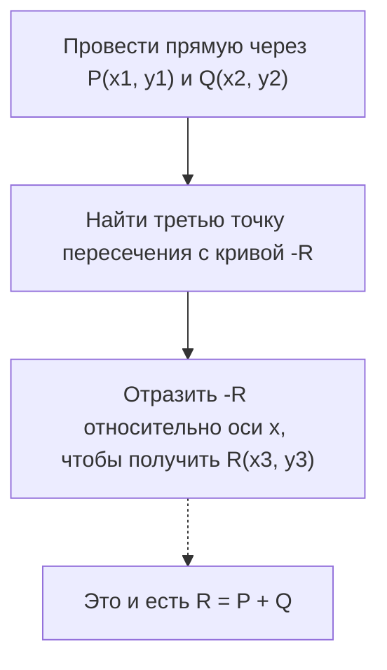
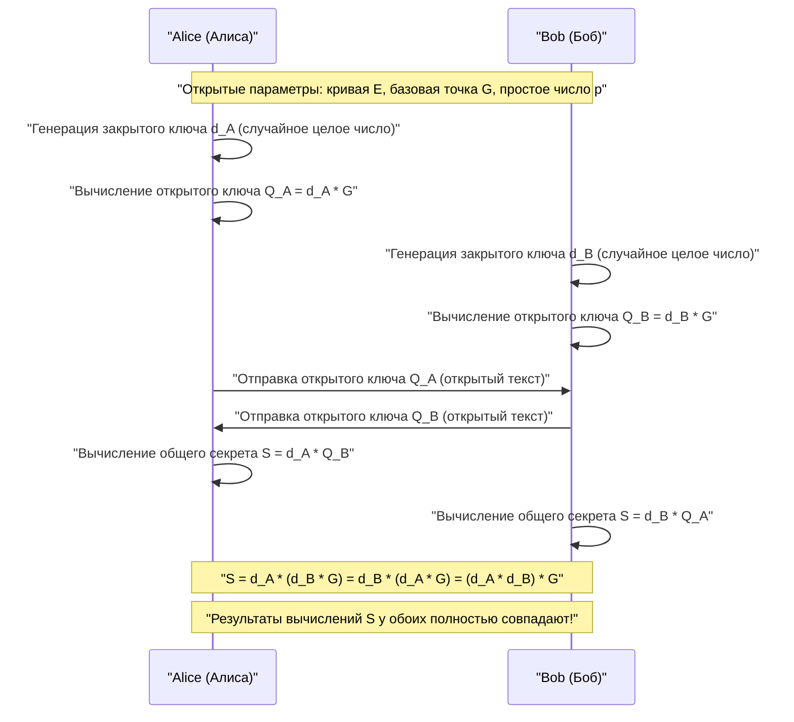
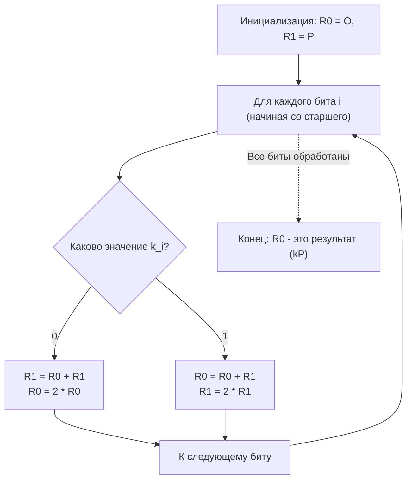

# Математические основы эллиптической криптографии (ECC) и её реализация на C++

В современной криптографии **криптография на эллиптических кривых (Elliptic Curve Cryptography: ECC)** играет исключительно важную роль. От наших повседневных интернет-коммуникаций (HTTPS/TLS) до безопасных анклавов смартфонов, аутентификации серверов через SSH, беспарольной аутентификации, такой как FIDO, и даже криптоактивов, таких как биткойн и Ethereum — не будет преувеличением сказать, что основа доверия в современном цифровом обществе держится на ECC.

В этой статье мы подробно и объемно разберем, как работает криптография на эллиптических кривых. Мы начнем с прекрасной, но сложной математической теории, лежащей в её основе (алгебраическая геометрия над конечными полями), перейдем к практическим методам реализации на C++, а также рассмотрим методы безопасного написания кода для предотвращения атак по сторонним каналам (тайминг-атак).

---

## 1. Почему именно криптография на эллиптических кривых? (Сравнение с RSA)

Долгое время синонимом криптографии с открытым ключом был алгоритм **RSA**. Безопасность RSA основана на «сложности факторизации огромных составных чисел». Однако по мере роста вычислительных мощностей компьютеров, для поддержания уровня безопасности возникла необходимость постоянно увеличивать длину ключа RSA (количество бит модуля). В настоящее время рекомендуется использовать длину ключа как минимум 2048 бит, а для большей безопасности — 3072 или 4096 бит.

С другой стороны, безопасность криптографии на эллиптических кривых (ECC) основана на совершенно иной математической сложности — **«задаче дискретного логарифмирования на эллиптической кривой (ECDLP)»**. До сих пор не найдено эффективного алгоритма (например, субэкспоненциального алгоритма) для решения ECDLP, и даже самые эффективные известные методы атаки требуют экспоненциального времени.

Благодаря этому свойству, решающим преимуществом ECC является то, что она **может обеспечить уровень безопасности, эквивалентный RSA, при значительно меньшей длине ключа**.

| Уровень безопасности (бит) | Длина ключа RSA (бит) | Длина ключа ECC (бит) | Соотношение длин ключей |
| :---: | :---: | :---: | :---: |
| 80 | 1024 | 160 | 1:6 |
| 112 | 2048 | 224 | 1:9 |
| 128 | 3072 | 256 | 1:12 |
| 192 | 7680 | 384 | 1:20 |
| 256 | 15360 | 512 | 1:30 |

Как показывает таблица выше, для достижения уровня безопасности в 128 бит (стандартный уровень на сегодняшний день) алгоритму RSA требуется ключ в 3072 бита, в то время как ECC достаточно всего 256 бит. Это позволяет сократить объем вычислений, уменьшить использование памяти и сэкономить пропускную способность сети, что дает подавляющее преимущество, особенно в средах с ограниченными ресурсами, таких как устройства IoT и смарт-карты.

---

## 2. Математическая подготовка: Теория групп и конечные поля

Чтобы по-настоящему понять криптографию на эллиптических кривых, необходимо усвоить базовые концепции абстрактной алгебры (теории групп и теории полей). Здесь мы кратко резюмируем базовые знания, необходимые для построения ECC.

### 2.1. Группа (Group) и Абелева группа
**Группа (Group)** — это множество $G$ в паре с бинарной операцией (здесь мы будем использовать сложение $+$) на этом множестве, то есть пара $(G, +)$, которая удовлетворяет следующим четырем аксиомам:

1. **Замкнутость (Closure)**: Для любых $a, b \in G$ выполняется $a + b \in G$.
2. **Ассоциативность (Associativity)**: Для любых $a, b, c \in G$ выполняется $(a + b) + c = a + (b + c)$.
3. **Существование нейтрального элемента (Identity element)**: Существует такой элемент $e \in G$, что для любого $a \in G$ выполняется $a + e = e + a = a$. В случае аддитивной группы этот нейтральный элемент обычно обозначается как $0$ или $\mathcal{O}$.
4. **Существование обратного элемента (Inverse element)**: Для любого $a \in G$ существует элемент $b \in G$, такой что $a + b = b + a = e$. Этот элемент $b$ обозначается как $-a$.

Кроме того, если порядок выполнения операции не влияет на результат, то есть выполняется следующее условие, группа называется **абелевой (коммутативной) группой**.

5. **Коммутативность (Commutativity)**: Для любых $a, b \in G$ выполняется $a + b = b + a$.

Множество точек на эллиптической кривой образует эту **абелеву группу**, если задать определенное правило сложения.

### 2.2. Конечное поле (Finite Field)
В криптографии используются не поля с непрерывным и бесконечным числом элементов, такие как действительные или комплексные числа, а **конечные поля (Finite Fields)** или поля Галуа (Galois Fields), количество элементов в которых конечно.

Самым базовым конечным полем является **простое поле $\mathbb{F}_p$**, использующее простое число $p$. Оно представляет собой множество целых чисел $\{0, 1, 2, \dots, p-1\}$ с определенными на нем четырьмя арифметическими операциями (сложение, вычитание, умножение, деление) по модулю $p$ (остаток от деления на $p$).

- **Сложение**: $(a + b) \pmod p$
- **Вычитание**: $(a - b) \pmod p$
- **Умножение**: $(a \times b) \pmod p$
- **Деление**: $a \times b^{-1} \pmod p$ (где $b^{-1}$ — мультипликативный обратный элемент к $b$ по модулю $p$)

Вычисление **мультипликативного обратного элемента (Modular Multiplicative Inverse)** имеет решающее значение при реализации криптографии. Для нахождения $b^{-1}$, удовлетворяющего условию $b \times b^{-1} \equiv 1 \pmod p$, в основном используются следующие два алгоритма:

1. **Расширенный алгоритм Евклида (Extended Euclidean Algorithm)**: Он быстр, но в зависимости от реализации время обработки может зависеть от входных значений, что создает риск тайминг-атак.
2. **Малая теорема Ферма (Fermat's Little Theorem)**: Если $p$ — простое число и $b \neq 0$, то справедливо $b^{p-1} \equiv 1 \pmod p$. Разделив обе части на $b$, получим $b^{p-2} \equiv b^{-1} \pmod p$. То есть, возведя $b$ в степень $p-2$, можно найти обратный элемент. Поскольку операцию возведения в степень легко реализовать за постоянное время, в криптографии предпочитают именно этот метод.

---

## 3. Уравнение эллиптической кривой и геометрия

### 3.1. Нормальная форма Вейерштрасса
**Эллиптическая кривая (Elliptic Curve)** — это плоская кривая, обычно определяемая уравнением, известным как **нормальная форма Вейерштрасса (Weierstrass normal form)**:

$$ y^2 = x^3 + ax + b $$

Здесь $a$ и $b$ — константы. Условием того, что кривая не имеет особых точек (самопересечений или точек возврата) — то есть является гладкой кривой — является то, что следующий **дискриминант (Discriminant) $\Delta$** не равен нулю:

$$ \Delta = -16(4a^3 + 27b^2) \neq 0 $$

Поскольку кривые с особыми точек снижают криптографическую безопасность, коэффициенты $a$ и $b$ всегда выбираются так, чтобы удовлетворять этому условию.

### 3.2. Бесконечно удаленная точка (Point at Infinity)
Для того чтобы эллиптическая кривая математически образовывала полную группу, в дополнение к точкам на плоскости вводится виртуальная точка, называемая **«бесконечно удаленной точкой (Point at Infinity)»**. Она обозначается как $\mathcal{O}$.

Бесконечно удаленная точка $\mathcal{O}$ определяется как точка, в которой пересекаются все вертикальные линии на бесконечности. В теории групп эта бесконечно удаленная точка $\mathcal{O}$ выступает в качестве **нейтрального элемента при сложении** (нуля).

То есть для любой точки $P$ на кривой справедливо следующее:
$$ P + \mathcal{O} = \mathcal{O} + P = P $$

Кроме того, обратный элемент $-P$ для точки $P = (x, y)$ определяется как точка, симметричная относительно оси x: $(x, -y)$. Таким образом:
$$ P + (-P) = \mathcal{O} $$

---

## 4. Групповые операции на эллиптической кривой (сложение точек и удвоение)

Основой криптографии на эллиптических кривых является операция **«сложения (Addition)»** точек на кривой. Она отличается от обычного сложения целых чисел и определяется на основе геометрических операций.

### 4.1. Геометрическое сложение (Метод касательных и секущих)
Процедура нахождения новой точки $R$ ($R = P + Q$) путем сложения двух разных точек $P$ и $Q$ на кривой выглядит следующим образом:

1. Проведите прямую линию (секущую) через точки $P$ и $Q$.
2. Эта линия обязательно пересечет эллиптическую кривую в третьей точке (назовем её $-R$). (※Согласно теореме алгебраической геометрии)
3. Отразив точку пересечения $-R$ симметрично относительно оси x (инвертировав знак координаты y), мы получим искомую точку $R$.



### 4.2. Удвоение точки (Point Doubling)
Если прибавить точку $P$ к самой себе ($P + P = 2P$), провести прямую через две точки невозможно. В этом случае проводится **касательная (Tangent) к кривой в точке $P$**.

1. Проведите касательную к кривой в точке $P$.
2. Эта касательная пересечет кривую в еще одной точке $-R$.
3. Отразив точку пересечения симметрично относительно оси x, мы получим искомую точку $R = 2P$.

### 4.3. Алгебраические формулы для вычислений
Геометрические операции можно преобразовать в алгебраические формулы для вычисления на компьютере.
Все операции выполняются **над конечным полем $\mathbb{F}_p$ (по модулю $p$)**.

Пусть точка $P = (x_1, y_1)$, а точка $Q = (x_2, y_2)$.
Также пусть результирующая точка $R = P + Q = (x_3, y_3)$.

Обозначим наклон прямой через $\lambda$ (лямбда).

**[Случай 1: $P \neq Q$ (Сложение точек)]**
Наклон $\lambda$ — это скорость изменения между двумя точками.
$$ \lambda \equiv \frac{y_2 - y_1}{x_2 - x_1} \pmod p $$
$$ \lambda \equiv (y_2 - y_1) \cdot (x_2 - x_1)^{-1} \pmod p $$

Используя этот $\lambda$, можно найти $x_3$ и $y_3$ следующим образом:
$$ x_3 \equiv \lambda^2 - x_1 - x_2 \pmod p $$
$$ y_3 \equiv \lambda(x_1 - x_3) - y_1 \pmod p $$

**[Случай 2: $P = Q$ (Удвоение точки)]**
Наклон $\lambda$ будет равен наклону касательной, который находится с помощью дифференцирования. (Неявно дифференцируем $y^2 = x^3 + ax + b$)
$$ 2y \cdot y' = 3x^2 + a \implies y' = \frac{3x^2 + a}{2y} $$
Следовательно:
$$ \lambda \equiv (3x_1^2 + a) \cdot (2y_1)^{-1} \pmod p $$

Формулы для $x_3, y_3$ имеют ту же форму, что и при сложении, но поскольку $x_2 = x_1$, они выглядят так:
$$ x_3 \equiv \lambda^2 - 2x_1 \pmod p $$
$$ y_3 \equiv \lambda(x_1 - x_3) - y_1 \pmod p $$

> [!IMPORTANT]
> Эти формулы включают **деление (вычисление обратного элемента по модулю)**, такое как $(x_2 - x_1)^{-1}$ или $(2y_1)^{-1}$. Поскольку вычисление обратного элемента по модулю требует больших вычислительных затрат, на практике обычно используются проективные системы координат, такие как **«координаты Якоби (Jacobian Coordinates)»**, которые позволяют отложить выполнение деления.

---

## 5. Скалярное умножение и задача дискретного логарифмирования на эллиптической кривой (ECDLP)

Операция, требующая наибольшего объема вычислений и являющаяся ядром безопасности в криптографии на эллиптических кривых, — это **скалярное умножение (Scalar Multiplication)**.

### 5.1. Что такое скалярное умножение
Операция сложения точки $P$ с самой собой $k$ раз называется скалярным умножением и обозначается как $kP$.
$$ kP = \underbrace{P + P + \dots + P}_{k\text{ раз}} $$

Здесь $k$ — это очень большое целое число (например, 256-битное число).

### 5.2. Задача дискретного логарифмирования на эллиптической кривой (ECDLP)
Безопасность криптографии на эллиптических кривых зависит от сложности следующей задачи.

> **Задача дискретного логарифмирования на эллиптической кривой (Elliptic Curve Discrete Logarithm Problem: ECDLP)**
> Даны известная точка $P$ (базовая точка) и результирующая точка $Q$. Найдите скаляр $k$, удовлетворяющий уравнению $Q = kP$.

Вычислить $Q$ из $k$ и $P$ (в прямом направлении) легко (выполняется за полиномиальное время) с использованием алгоритма, описанного ниже. Однако вычислить $k$ из $P$ и $Q$ в обратном направлении практически невозможно (односторонняя функция) без полного перебора, для чего не существует эффективных методов.
В криптографических протоколах **$k$ соответствует «закрытому ключу», а $Q$ — «открытому ключу»**.

### 5.3. Алгоритм Double-and-Add (Удвоение и сложение)
Если $k$ — огромное число (например, $2^{256}$), простое сложение точки $P$ $k$ раз не завершится даже за время жизни Вселенной. Поэтому для быстрого скалярного умножения используется **алгоритм Double-and-Add (бинарный метод)**.

Это эллиптический эквивалент метода возведения в степень (метода повторного возведения в квадрат) для целых чисел. Скаляр $k$ представляется в двоичном виде, и обработка идет от старшего бита к младшему.

1. Инициализируем точку $R$, хранящую результат, значением $\mathcal{O}$.
2. Для каждого бита $k$ от самого старшего до самого младшего повторяем следующее:
   - Удваиваем $R$ (Point Doubling: $R = 2R$)
   - Если текущий бит равен `1`, прибавляем $P$ к $R$ (Point Addition: $R = R + P$)

Благодаря этому алгоритму объем вычислений кардинально сокращается с $O(k)$ до $O(\log_2 k)$, и вычисление становится возможным за реальное время (в миллисекундах).

---

## 6. Обмен ключами Диффи-Хеллмана на эллиптических кривых (ECDH)

Здесь мы объясним, как работает **протокол обмена ключами ECDH (Elliptic Curve Diffie-Hellman)**, который является наиболее типичным примером применения ECC. ECDH — это механизм, позволяющий Алисе и Бобу безопасно сгенерировать и использовать общий секретный ключ (сеансовый ключ) в канале связи, который может прослушиваться (это ядро рукопожатия TLS).

**[Предварительные параметры (Параметры домена)]**
Обе стороны заранее договариваются о используемой эллиптической кривой $E$, простом числе $p$ и базовой точке $G$. (Например, NIST P-256 или secp256k1)



Злоумышленник (Ева) может перехватить передаваемые по сети $G$, $Q_A$ и $Q_B$, но из-за сложности ECDLP он не сможет вычислить закрытый ключ Алисы $d_A$ из $Q_A = d_A \cdot G$. Кроме того, перемножение $Q_A$ и $Q_B$ не дает общий ключ $S$, поэтому злоумышленник не может вычислить $S$.

---

## 7. Ловушки при реализации: Атаки по сторонним каналам и защита от них

Даже теоретически совершенный криптографический алгоритм может иметь уязвимости, возникающие в процессе его реализации в виде программы. Это и есть **«атака по сторонним каналам (Side-Channel Attack)»**.

### 7.1. Тайминг-атака (Timing Attack)
Давайте вспомним описанный ранее алгоритм Double-and-Add.

```cpp
// Псевдокод уязвимого алгоритма Double-and-Add
Point R = Point::Infinity;
for (int i = 255; i >= 0; i--) {
    R = PointDoubling(R);         // Выполняется всегда
    if (bit(k, i) == 1) {
        R = PointAddition(R, P);  // Выполняется только если бит равен 1!
    }
}
```

Эта реализация имеет фатальный недостаток. Поскольку операция сложения точек (Point Addition) выполняется, когда бит равен `1`, **время вычислений немного увеличивается** по сравнению с ситуацией, когда бит равен `0`. Кроме того, меняется поведение предсказателя переходов процессора и кэш-памяти.
Злоумышленник, статистически проанализировав эти крошечные различия во времени вычисления (или энергопотреблении) тысячи раз, может **полностью восстановить последовательность битов закрытого ключа $k$ по одному биту**. Это называется тайминг-атакой.

### 7.2. Реализация с постоянным временем (Constant-Time): Лестница Монтгомери (Montgomery Ladder)
Чтобы предотвратить тайминг-атаки, необходимо использовать алгоритмы, в которых **последовательность выполняемых инструкций и время вычислений всегда остаются постоянными (Constant-Time) независимо от значения битов закрытого ключа**.

Типичным примером такого алгоритма является **Лестница Монтгомери (Montgomery Ladder)**.



Прелесть лестницы Монтгомери заключается в том, что независимо от того, равен бит `0` или `1`, **«всегда выполняется одно сложение точек и одно удвоение точки»**. Это полностью устраняет зависимость времени вычисления от данных.

Однако если существует само ветвление (`if (k_i == 0)`), остается риск того, что время выполнения будет варьироваться из-за оптимизаций компилятора или предсказания переходов ЦП. Поэтому в реальных Constant-Time реализациях устраняют условные переходы (операторы `if`) и используют **условный обмен (Conditional Swap), основанный на побитовых операциях**.

---

## 8. Реализация криптографии на эллиптических кривых на C++

Теперь переведем теорию в код на C++. Практические криптографические библиотеки (такие как OpenSSL или libsodium) используют сложные ассемблерные оптимизации и координаты Якоби, но здесь мы покажем структуру **понятной Constant-Time реализации с использованием аффинных координат** для лучшего понимания математики.

Предположим, что для работы с большими целыми числами используется `boost::multiprecision::cpp_int`.

### 8.1. Модульная арифметика и обратный элемент
Сначала определим вспомогательные функции для операций в конечном поле. Мы реализуем вычисление обратного элемента с использованием Малой теоремы Ферма.

```cpp
#include <iostream>
#include <vector>
#include <stdexcept>
#include <boost/multiprecision/cpp_int.hpp>

using namespace boost::multiprecision;

// Пример простого числа p и параметров для secp256k1
const cpp_int p("0xFFFFFFFFFFFFFFFFFFFFFFFFFFFFFFFFFFFFFFFFFFFFFFFFFFFFFFFEFFFFFC2F");
const cpp_int a = 0;
const cpp_int b = 7;

// Операция по модулю, возвращающая положительный остаток
cpp_int mod(cpp_int x, cpp_int m) {
    cpp_int r = x % m;
    return r < 0 ? r + m : r;
}

// Вычисление степени по модулю (x^y mod m)
cpp_int powerMod(cpp_int base, cpp_int exp, cpp_int m) {
    cpp_int res = 1;
    base = mod(base, m);
    while (exp > 0) {
        if (exp % 2 == 1) res = mod(res * base, m);
        base = mod(base * base, m);
        exp /= 2;
    }
    return res;
}

// Обратный элемент по модулю с использованием малой теоремы Ферма
cpp_int modInverse(cpp_int n, cpp_int m) {
    // Предполагается, что m - простое число: n^(m-2) ≡ n^(-1) mod m
    return powerMod(n, m - 2, m);
}
```

### 8.2. Представление точек и групповые операции (сложение, удвоение)
Определим структуру `Point`, где бесконечно удаленная точка управляется с помощью флага, и реализуем формулы сложения.

```cpp
struct Point {
    cpp_int x;
    cpp_int y;
    bool isInfinity;

    // Создание бесконечно удаленной точки
    Point() : x(0), y(0), isInfinity(true) {}
    
    // Создание обычной точки
    Point(cpp_int x, cpp_int y) : x(x), y(y), isInfinity(false) {}
};

// Сложение точек на эллиптической кривой (R = P + Q)
Point pointAdd(const Point& P, const Point& Q) {
    if (P.isInfinity) return Q;
    if (Q.isInfinity) return P;

    if (P.x == Q.x && mod(P.y + Q.y, p) == 0) {
        return Point(); // P + (-P) = бесконечно удаленная точка
    }

    cpp_int lambda;
    if (P.x == Q.x && P.y == Q.y) {
        // Удвоение точки (Point Doubling) (Если P = Q)
        // lambda = (3x^2 + a) / 2y
        cpp_int num = mod(3 * P.x * P.x + a, p);
        cpp_int den = modInverse(mod(2 * P.y, p), p);
        lambda = mod(num * den, p);
    } else {
        // Сложение точек (Point Addition) (Если P != Q)
        // lambda = (y2 - y1) / (x2 - x1)
        cpp_int num = mod(Q.y - P.y, p);
        cpp_int den = modInverse(mod(Q.x - P.x, p), p);
        lambda = mod(num * den, p);
    }

    cpp_int x3 = mod(lambda * lambda - P.x - Q.x, p);
    cpp_int y3 = mod(lambda * (P.x - x3) - P.y, p);

    return Point(x3, y3);
}
```

### 8.3. Реализация условного обмена с постоянным временем (Constant-Time Conditional Swap)
При обмене содержимым переменных на основе битового значения секретного ключа, мы выполняем обмен, используя только побитовые операции (маскирование) без операторов `if`. Это обеспечивает неизменность пути выполнения.

> [!TIP]
> На практике классы для работы с длинной арифметикой, динамически выделяющие память, такие как `cpp_int`, не подходят для операций с постоянным временем. Это связано с тем, что информация о тайминге утекает через выделение памяти и изменение размеров массивов. Практические библиотеки используют представления фиксированной длины (например, массив из 4 элементов uint64_t) и реализуют операции маскирования на битовом уровне. Ниже приведен концептуальный пример.

```cpp
// Концептуальный обмен с постоянным временем (предполагается целое число фиксированной длины)
// Если bit равен 1, то меняет P1 и P2 местами, если 0 - не меняет
void cswap(Point& P1, Point& P2, uint8_t bit) {
    // bit равен 0 или 1. Если bit=1, маска состоит из всех единиц (0xFF..), если 0 - из всех нулей.
    // (Здесь для пояснения предполагается, что каждое слово класса BigInt фиксированной длины - это w)
    /*
    uint64_t mask = 0 - (uint64_t)bit;
    for (int i = 0; i < NUM_WORDS; i++) {
        uint64_t dummy = mask & (P1.x.words[i] ^ P2.x.words[i]);
        P1.x.words[i] ^= dummy;
        P2.x.words[i] ^= dummy;
        // Координата y и флаг isInfinity обрабатываются аналогично
    }
    */
    
    // ※ Полный swap за постоянное время в boost::multiprecision затруднителен,
    // но здесь мы ограничиваемся симуляцией с использованием ветвления для понимания логики.
    if (bit == 1) {
        std::swap(P1, P2);
    }
}
```

### 8.4. Скалярное умножение с использованием лестницы Монтгомери
Объединив ранее описанные `pointAdd` и `cswap`, реализуем безопасное скалярное умножение.

```cpp
// Скалярное умножение k * P (Метод лестницы Монтгомери)
Point scalarMultiply(const Point& P, cpp_int k) {
    Point R0 = Point(); // Бесконечно удаленная точка
    Point R1 = P;

    // Получение длины k в битах (256 бит для secp256k1)
    int numBits = 256; 
    
    for (int i = numBits - 1; i >= 0; i--) {
        // Получение значения i-го бита (0 или 1)
        uint8_t bit = static_cast<uint8_t>(bit_test(k, i) ? 1 : 0);

        // Если bit == 1, меняем местами R0 и R1
        cswap(R0, R1, bit);

        // Всегда выполняются одни и те же операции (Сложение точек и Удвоение точки)
        R1 = pointAdd(R0, R1);
        R0 = pointAdd(R0, R0);

        // Если bit == 1, меняем местами снова, чтобы восстановить состояние
        cswap(R0, R1, bit);
    }

    return R0;
}
```

Благодаря этой логике реализации, независимо от того, равен ли каждый бит скаляра $k$ `0` или `1`, операции, выполняемые в каждой итерации цикла (`cswap` $\to$ `pointAdd` $\to$ `pointAdd` $\to$ `cswap`), имеют абсолютно идентичный поток выполнения. Это обеспечивает надежную защиту от утечек секретной информации через различия во времени или шаблоны доступа к кэшу.

---

## 9. Заключение

Криптография на эллиптических кривых (ECC) на первый взгляд может показаться загадкой: «Каким образом геометрическая операция проведения прямой линии и отражения точки пересечения становится криптографией?» Однако, отобразив это в дискретный мир конечных полей, можно построить превосходную одностороннюю функцию (задачу дискретного логарифмирования), что является плодом чудесного слияния математики и криптографии.

В этой статье мы объяснили следующие важные моменты:

1. **Преимущество перед RSA**: Обеспечивает высокий уровень безопасности при очень малой длине ключа, что идеально подходит для современной эры мобильных устройств и IoT.
2. **Основы теории групп и конечных полей**: Математическая структура, являющаяся фундаментом ECC.
3. **Формулы сложения и удвоения**: Метод реализации алгебраических групповых операций с использованием уравнения Вейерштрасса.
4. **Угроза атак по сторонним каналам**: То, что условные переходы, зависящие от битов секретного ключа, создают фатальные уязвимости.
5. **Реализация с постоянным временем (Constant-Time)**: Техника кодирования на C++ для унификации поведения на аппаратном уровне и предотвращения атак с использованием Лестницы Монтгомери (Montgomery Ladder) и Условного обмена (Conditional Swap).

Создание собственной криптографической библиотеки для работы в продакшен-среде настоятельно не рекомендуется («Don't roll your own crypto») из-за чрезвычайно высоких рисков безопасности. Тем не менее, глубокое понимание алгоритмов и математической основы, стоящей за ними, безусловно, станет мощным оружием для инженеров, проектирующих и эксплуатирующих более безопасные и производительные системы.

В следующей статье мы планируем глубже погрузиться в механизмы **алгоритма цифровой подписи на эллиптических кривых (ECDSA - Elliptic Curve Digital Signature Algorithm)** и **подписей Шнорра (Schnorr)**, которые используются в Биткойне.

