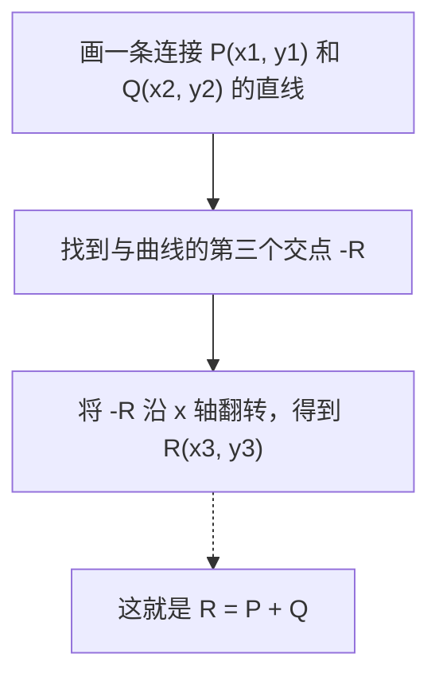
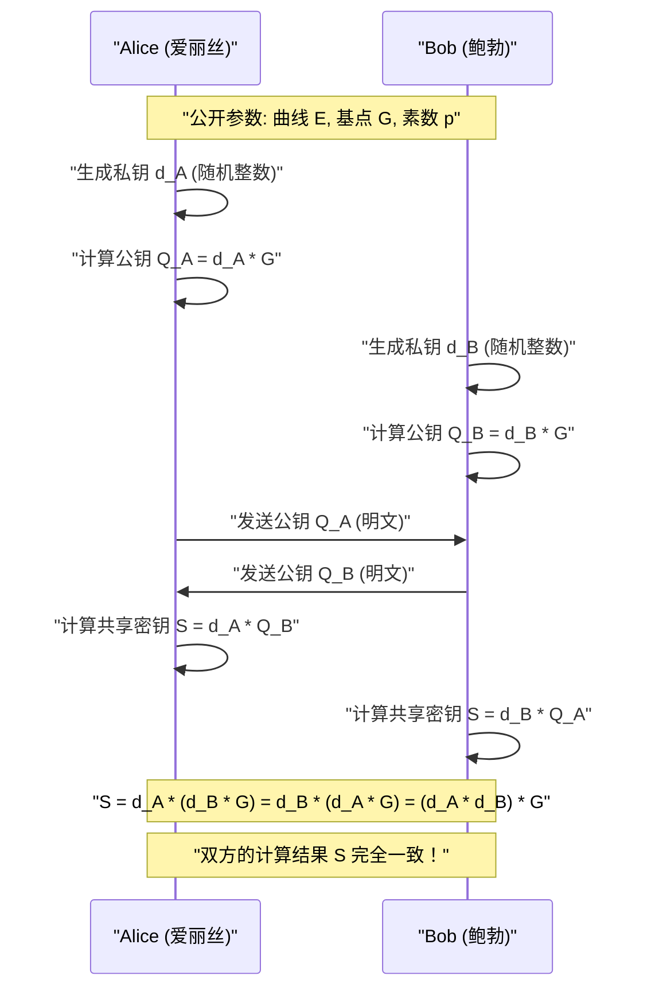
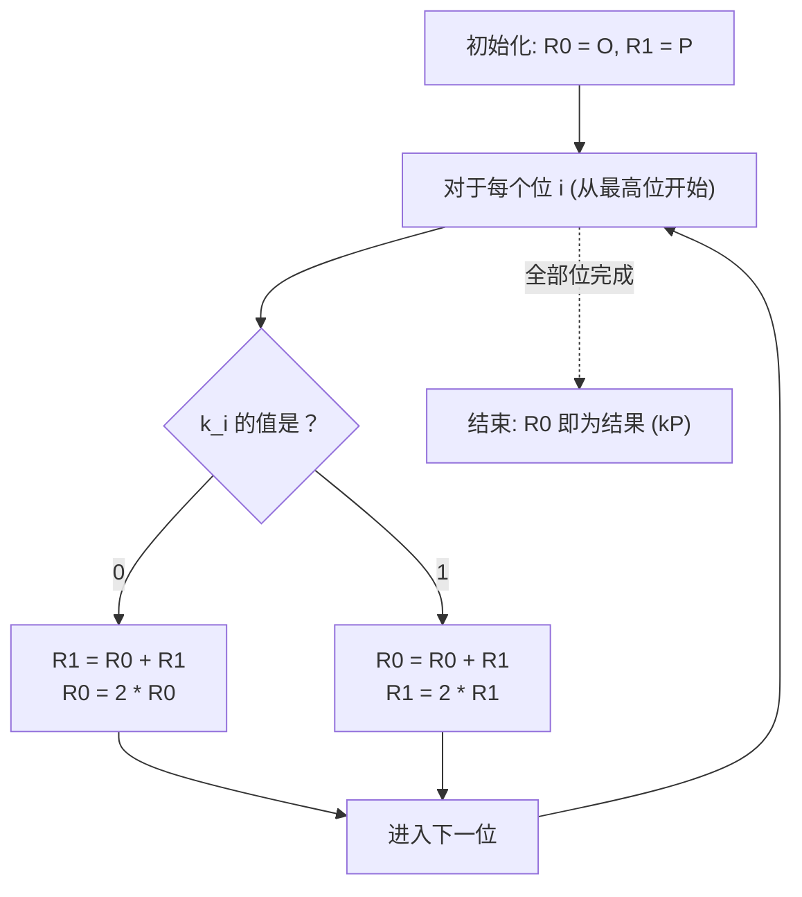

# 椭圆曲线密码学（ECC）的数学基础与C++实现

在现代密码技术中，**椭圆曲线密码学（Elliptic Curve Cryptography: ECC）**发挥着极其重要的作用。从我们日常的互联网通信（HTTPS/TLS）、智能手机的安全隔离区（Secure Enclave）、通过SSH进行的服务器身份验证、FIDO等无密码认证，甚至到比特币和以太坊等加密资产，可以说现代数字社会的信任基础正是由ECC支撑的。

本文将从其背后的优美且深奥的数学理论（有限体上的代数几何学）出发，深入探讨椭圆曲线密码学是如何运作的，并结合C++的实际实现方法，乃至防止侧信道攻击（计时攻击）的安全编码技巧，以压倒性的篇幅为您进行彻底的讲解。

---

## 1. 为什么选择椭圆曲线密码学？（与RSA的比较）

说到公钥密码体制的代名词，长期以来一直非**RSA密码**莫属。RSA密码的安全性基于“大分解合成数的质因数分解的困难性”。然而，随着计算机计算能力的提高，为了维持安全性，必须不断增加RSA的密钥长度（模数的位数）。目前，建议的密钥长度至少为2048位，如果要求更安全，则推荐使用3072位或4096位。

相比之下，椭圆曲线密码学（ECC）的安全基础是另一种数学困难性，即**“椭圆曲线上的离散对数问题（ECDLP）”**。直到现在，尚未发现能够有效解决ECDLP的算法（如亚指数时间算法），即使是已知最有效的攻击方法也需要指数级的时间。

正是因为这一特性，ECC具有一个决定性的优势：**能够在极短的密钥长度下实现与RSA同等的安全强度**。

| 安全强度（位） | RSA密码的密钥长度（位） | 椭圆曲线密码的密钥长度（位） | 密钥长度比率 |
| :---: | :---: | :---: | :---: |
| 80 | 1024 | 160 | 1:6 |
| 112 | 2048 | 224 | 1:9 |
| 128 | 3072 | 256 | 1:12 |
| 192 | 7680 | 384 | 1:20 |
| 256 | 15360 | 512 | 1:30 |

如上表所示，为了获得128位的安全强度（目前的标准强度），RSA需要3072位的密钥，而ECC仅需256位。这使得减少计算量、降低内存使用量和节约网络带宽成为可能，特别是在资源有限的物联网设备和智能卡环境中，ECC拥有压倒性的优势。

---

## 2. 数学准备：群论与有限体世界

为了真正理解椭圆曲线密码学，必须掌握抽象代数（群论和域论）的基本概念。在此，我们简要总结构建ECC所需的前提知识。

### 2.1. 群（Group）与阿贝尔群
**群（Group）**是指由一个集合 $G$ 及其上的二元运算（此处假设为加法 $+$）组成的集合 $(G, +)$，且满足以下四个公理：

1. **封闭性（Closure）**: 对于任意的 $a, b \in G$，$a + b \in G$ 成立。
2. **结合律（Associativity）**: 对于任意的 $a, b, c \in G$，$(a + b) + c = a + (b + c)$ 成立。
3. **单位元的存在性（Identity element）**: 存在元素 $e \in G$，使得对于任意的 $a \in G$，$a + e = e + a = a$ 成立。在加法群中，该单位元通常记为 $0$ 或 $\mathcal{O}$。
4. **逆元的存在性（Inverse element）**: 对于任意的 $a \in G$，存在元素 $b \in G$，使得 $a + b = b + a = e$。该 $b$ 记作 $-a$。

此外，如果改变运算顺序结果不变，即满足以下条件的群被称为**阿贝尔群（交换群）**：

5. **交换律（Commutativity）**: 对于任意的 $a, b \in G$，$a + b = b + a$ 成立。

椭圆曲线上的点集，通过定义特定的加法规则，构成了这种**阿贝尔群**。

### 2.2. 有限体（Finite Field）
在密码学理论中，我们使用的不是像实数或复数那样具有连续且无限元素的域，而是元素数量有限的**有限体（Finite Field）**或称伽罗瓦域（Galois Field）。

最基本的有限体是使用素数 $p$ 构成的**素体 $\mathbb{F}_p$**。它是在整数集合 $\{0, 1, 2, \dots, p-1\}$ 上，定义了模 $p$（除以 $p$ 的余数）的四则运算（加法、减法、乘法、除法）。

- **加法**: $(a + b) \pmod p$
- **减法**: $(a - b) \pmod p$
- **乘法**: $(a \times b) \pmod p$
- **除法**: $a \times b^{-1} \pmod p$ （这里 $b^{-1}$ 是模 $p$ 下 $b$ 的乘法逆元）

**乘法逆元（Modular Multiplicative Inverse）**的计算在密码学实现中极为重要。为了求出满足 $b \times b^{-1} \equiv 1 \pmod p$ 的 $b^{-1}$，主要使用以下两种算法：

1. **扩展欧几里得算法（Extended Euclidean Algorithm）**: 速度快，但根据实现的不同，处理时间可能依赖于输入值，从而存在计时攻击的风险。
2. **费马小定理（Fermat's Little Theorem）**: 当 $p$ 为素数且 $b \neq 0$ 时，$b^{p-1} \equiv 1 \pmod p$ 成立。两边同除以 $b$，可得 $b^{p-2} \equiv b^{-1} \pmod p$。也就是说，通过计算 $b$ 的 $p-2$ 次方即可求得逆元。因为幂运算容易实现为常数时间操作，所以密码学实现中通常更倾向于使用这种方法。

---

## 3. 椭圆曲线的方程与几何学

### 3.1. 魏尔斯特拉斯标准型
**椭圆曲线（Elliptic Curve）**通常由以下被称为**魏尔斯特拉斯标准型（Weierstrass normal form）**的方程所定义的平面曲线：

$$ y^2 = x^3 + ax + b $$

在这里，$a$ 和 $b$ 是常数。为了确保曲线没有奇异点（自交点或尖点）（即这是一条平滑曲线），要求以下**判别式（Discriminant） $\Delta$** 不为零：

$$ \Delta = -16(4a^3 + 27b^2) \neq 0 $$

带有奇异点的曲线会破坏密码学的安全性，因此必须选择满足该条件的系数 $a, b$。

### 3.2. 无穷远点（Point at Infinity）
为了使椭圆曲线在数学上构成一个完备的群，除了平面上的点之外，我们引入了一个称为**“无穷远点（Point at Infinity）”**的虚拟点。记作 $\mathcal{O}$（字母 O）。

无穷远点 $\mathcal{O}$ 被定义为所有垂直线在无穷远处的交点。在群论中，这个无穷远点 $\mathcal{O}$ 作为**加法中的单位元**（零）发挥作用。

也就是说，对于曲线上的任意点 $P$，以下等式成立：
$$ P + \mathcal{O} = \mathcal{O} + P = P $$

另外，点 $P = (x, y)$ 的逆元 $-P$，定义为关于 x 轴对称的点 $(x, -y)$。因此：
$$ P + (-P) = \mathcal{O} $$
成立。

---

## 4. 椭圆曲线上的群运算（点的加法与二倍算）

椭圆曲线密码学的核心在于曲线上点与点之间的**“加法（Addition）”**运算。这不同于普通整数的加法，它是基于几何操作来定义的。

### 4.1. 几何加法（切线与割线法 / Tangent and Chord Method）
将曲线上不同的两点 $P$ 和 $Q$ 相加，求得新点 $R$ ($R = P + Q$) 的步骤如下：

1. 画一条穿过点 $P$ 和点 $Q$ 的直线（割线）。
2. 根据代数几何学的定理，这条直线必然与椭圆曲线相交于第三个点（我们称之为 $-R$）。
3. 将交点 $-R$ 关于 x 轴对称翻转（即 y 坐标的符号反转）得到的点，就是我们所求的点 $R$。



### 4.2. 点的二倍算（Point Doubling）
如果要在点 $P$ 上加上相同的点 $P$（$P + P = 2P$），我们无法画出穿过两点的直线。在这种情况下，我们要画出**曲线在点 $P$ 处的切线（Tangent）**。

1. 画出曲线在点 $P$ 处的切线。
2. 该切线将与曲线相交于另一个点 $-R$。
3. 将交点关于 x 轴对称翻转得到的点，就是所求的点 $R = 2P$。

### 4.3. 代数计算公式
我们需要将几何操作转化为代数公式，以便计算机可以进行计算。
所有的运算都在**有限体 $\mathbb{F}_p$ 上（模 $p$）**进行。

设点 $P = (x_1, y_1)$，点 $Q = (x_2, y_2)$。
并且设计算结果的点为 $R = P + Q = (x_3, y_3)$。

设直线的斜率为 $\lambda$（Lambda）。

**【情况1：当 $P \neq Q$ 时（点的加法）】**
斜率 $\lambda$ 是两点间的变化率。
$$ \lambda \equiv \frac{y_2 - y_1}{x_2 - x_1} \pmod p $$
$$ \lambda \equiv (y_2 - y_1) \cdot (x_2 - x_1)^{-1} \pmod p $$

利用这个 $\lambda$，$x_3, y_3$ 可以如下求出：
$$ x_3 \equiv \lambda^2 - x_1 - x_2 \pmod p $$
$$ y_3 \equiv \lambda(x_1 - x_3) - y_1 \pmod p $$

**【情况2：当 $P = Q$ 时（点的二倍算）】**
斜率 $\lambda$ 即通过求导得到的切线斜率。（隐式对 $y^2 = x^3 + ax + b$ 求导）
$$ 2y \cdot y' = 3x^2 + a \implies y' = \frac{3x^2 + a}{2y} $$
因此，
$$ \lambda \equiv (3x_1^2 + a) \cdot (2y_1)^{-1} \pmod p $$

$x_3, y_3$ 的公式形式与加法相同，但由于 $x_2 = x_1$，结果如下：
$$ x_3 \equiv \lambda^2 - 2x_1 \pmod p $$
$$ y_3 \equiv \lambda(x_1 - x_3) - y_1 \pmod p $$

> [!IMPORTANT]
> 这些公式包含了形如 $(x_2 - x_1)^{-1}$ 或 $(2y_1)^{-1}$ 的**除法（模逆元的计算）**。模逆元的计算成本非常高，因此在实际实现中，通常会使用诸如**“雅可比坐标系（Jacobian Coordinates）”**等射影坐标系来延迟除法运算。

---

## 5. 标量乘法与椭圆曲线离散对数问题（ECDLP）

在椭圆曲线密码学中，计算量最大且构成安全核心的运算是**标量乘法（Scalar Multiplication）**。

### 5.1. 什么是标量乘法
将某一点 $P$ 相加 $k$ 次的操作称为标量乘法，记作 $kP$。
$$ kP = \underbrace{P + P + \dots + P}_{k\text{次}} $$

在这里，$k$ 是一个非常大的整数（例如 256 位的整数）。

### 5.2. 椭圆曲线离散对数问题（ECDLP）
椭圆曲线密码学的安全性取决于以下问题的困难性：

> **椭圆曲线离散对数问题 (Elliptic Curve Discrete Logarithm Problem: ECDLP)**
> 给定已知点 $P$（基点）和计算结果点 $Q$，求满足 $Q = kP$ 的标量 $k$。

利用后文所述的算法，由 $k$ 和 $P$ 计算 $Q$（正向）是很简单的（多项式时间），但由 $P$ 和 $Q$ 逆推 $k$（反向）除了暴力穷举外没有有效的解法，实际上是不可能的（单向函数）。
在密码协议中，**$k$ 对应“私钥”，$Q$ 对应“公钥”**。

### 5.3. Double-and-Add 算法
如果 $k$ 是一个巨大的数（例如 $2^{256}$），那么就算宇宙寿命耗尽，也无法完成将 $P$ 愚直地相加 $k$ 次的操作。因此，为了快速执行标量乘法，我们使用了**Double-and-Add 方法（二进制法）**。

这是计算整数快速幂的“重复平方求幂法”的椭圆曲线版本。将标量 $k$ 表示为二进制数，然后从高位到低位依次处理。

1. 将保存结果的点 $R$ 初始化为 $\mathcal{O}$。
2. 从 $k$ 的最高位到最低位重复以下操作：
   - 将 $R$ 翻倍（Point Doubling: $R = 2R$）
   - 如果当前位为 `1`，则在 $R$ 上加上 $P$（Point Addition: $R = R + P$）

通过该算法，计算量从 $O(k)$ 剧烈减少到 $O(\log_2 k)$，从而使得在现实时间（毫秒级）内完成计算成为可能。

---

## 6. 椭圆曲线迪菲-赫尔曼（ECDH）密钥交换

在此，我们将讲解 ECC 最典型的应用案例——**ECDH（Elliptic Curve Diffie-Hellman）密钥交换协议**的机制。ECDH 是爱丽丝和鲍勃在可能被窃听的通信信道上，安全地生成并共享共同私钥（会话密钥）的机制（这也是 TLS 握手的核心）。

**【前提参数（域参数）】**
双方预先共享了所使用的椭圆曲线 $E$、素数 $p$ 以及基点 $G$。（例如 NIST P-256 或 secp256k1 等）



窃听者（伊芙）可以截获通信路径上流动的 $G$、$Q_A$、$Q_B$，但由于 ECDLP 的困难性，无法从 $Q_A = d_A \cdot G$ 推导得出爱丽丝的私钥 $d_A$。此外，即使将 $Q_A$ 和 $Q_B$ 相乘也不会得到共享密钥 $S$，因此窃听者无法计算出 $S$。

---

## 7. 实现中的陷阱：侧信道攻击及其对策

即使在理论上是完美的密码算法，在将其实现为程序的过程中，也有可能产生漏洞。这就是**“侧信道攻击（Side-Channel Attack）”**。

### 7.1. 计时攻击（Timing Attack）
让我们回顾一下前面提到的 Double-and-Add 算法。

```cpp
// 脆弱的 Double-and-Add 伪代码
Point R = Point::Infinity;
for (int i = 255; i >= 0; i--) {
    R = PointDoubling(R);         // 总是执行
    if (bit(k, i) == 1) {
        R = PointAddition(R, P);  // 只有当位为 1 时才执行！
    }
}
```

这个实现存在一个致命的缺陷。由于只有当位为 `1` 时才会执行 Point Addition，所以当位为 `1` 时所需的**计算时间会比位为 `0` 时稍微长一些**。此外，处理器的分支预测和缓存内存的行为也会发生变化。
攻击者通过对这微小的计算时间（或功耗）差异进行数千次的统计观测，就可以**逐位完全还原出私钥 $k$ 的二进制序列**。这就是计时攻击。

### 7.2. Constant-Time（恒定时间）实现：Montgomery Ladder
为了防止计时攻击，我们需要采用一种无论**私钥的位值如何，执行的指令序列和计算时间始终保持不变（Constant-Time）**的算法。

其代表性的例子就是**蒙哥马利阶梯（Montgomery Ladder）**。



Montgomery Ladder 的优美之处在于，无论位是 `0` 还是 `1`，都会**“始终执行一次 Point Addition 和一次 Point Doubling”**。这样就完全排除了计算时间对数据的依赖性。

然而，如果代码中存在分支（`if (k_i == 0)`）本身，那么由于编译器的优化或CPU的分支预测，执行时间仍然有波动的风险。因此，在实际的恒定时间实现中，我们会消除条件分支（`if`语句），转而使用**基于位运算的条件交换（Conditional Swap）**。

---

## 8. 使用 C++ 实现椭圆曲线密码学

从这里开始，我们将把理论转化为 C++ 代码。虽然实际实用的密码学库（如 OpenSSL 或 libsodium 等）使用了高度的汇编优化和雅可比坐标系，但在这里为了加深对数学的理解，我们将展示一个**使用仿射坐标系且易于理解的 Constant-Time 实现**的基础框架。

假设大整数运算使用 `boost::multiprecision::cpp_int`。

### 8.1. 模运算与逆元
首先，定义有限体上的运算辅助函数。实现基于费马小定理的逆元计算。

```cpp
#include <iostream>
#include <vector>
#include <stdexcept>
#include <boost/multiprecision/cpp_int.hpp>

using namespace boost::multiprecision;

// 以 secp256k1 的素数 p 和参数为例
const cpp_int p("0xFFFFFFFFFFFFFFFFFFFFFFFFFFFFFFFFFFFFFFFFFFFFFFFFFFFFFFFEFFFFFC2F");
const cpp_int a = 0;
const cpp_int b = 7;

// 返回正余数的模运算
cpp_int mod(cpp_int x, cpp_int m) {
    cpp_int r = x % m;
    return r < 0 ? r + m : r;
}

// 模幂运算 (x^y mod m)
cpp_int powerMod(cpp_int base, cpp_int exp, cpp_int m) {
    cpp_int res = 1;
    base = mod(base, m);
    while (exp > 0) {
        if (exp % 2 == 1) res = mod(res * base, m);
        base = mod(base * base, m);
        exp /= 2;
    }
    return res;
}

// 使用费马小定理的模逆元
cpp_int modInverse(cpp_int n, cpp_int m) {
    // 前提 m 是素数: n^(m-2) ≡ n^(-1) mod m
    return powerMod(n, m - 2, m);
}
```

### 8.2. 点的表示与群运算（加法・二倍算）
通过标志位管理无穷远点的 `Point` 结构体，并实现加法公式。

```cpp
struct Point {
    cpp_int x;
    cpp_int y;
    bool isInfinity;

    // 生成无穷远点
    Point() : x(0), y(0), isInfinity(true) {}
    
    // 生成普通点
    Point(cpp_int x, cpp_int y) : x(x), y(y), isInfinity(false) {}
};

// 椭圆曲线上点的加法 (R = P + Q)
Point pointAdd(const Point& P, const Point& Q) {
    if (P.isInfinity) return Q;
    if (Q.isInfinity) return P;

    if (P.x == Q.x && mod(P.y + Q.y, p) == 0) {
        return Point(); // P + (-P) = 无穷远点
    }

    cpp_int lambda;
    if (P.x == Q.x && P.y == Q.y) {
        // Point Doubling (当 P = Q 时)
        // lambda = (3x^2 + a) / 2y
        cpp_int num = mod(3 * P.x * P.x + a, p);
        cpp_int den = modInverse(mod(2 * P.y, p), p);
        lambda = mod(num * den, p);
    } else {
        // Point Addition (当 P != Q 时)
        // lambda = (y2 - y1) / (x2 - x1)
        cpp_int num = mod(Q.y - P.y, p);
        cpp_int den = modInverse(mod(Q.x - P.x, p), p);
        lambda = mod(num * den, p);
    }

    cpp_int x3 = mod(lambda * lambda - P.x - Q.x, p);
    cpp_int y3 = mod(lambda * (P.x - x3) - P.y, p);

    return Point(x3, y3);
}
```

### 8.3. Constant-Time 条件交换（Conditional Swap）的实现
当根据私钥的位值交换变量内容时，不使用 `if` 语句，而是仅使用位运算（掩码）来进行交换。这样执行路径就会完全保持一致。

> [!TIP]
> 在实际实现中，像 `cpp_int` 这样动态分配的多精度整数类并不适合 Constant-Time 处理。因为内存分配和数组大小的变化会泄露计时信息。在实用库中，使用固定长度（例如 uint64_t × 4 个元素的数组）来表示，并实现位级别的掩码处理。以下是概念性示例。

```cpp
// 概念性的 Constant-Time Swap (假设使用定长整数)
// 如果 bit 为 1，则交换 P1 和 P2；如果为 0，则不交换
void cswap(Point& P1, Point& P2, uint8_t bit) {
    // bit 为 0 或 1。如果 bit=1，则掩码全为 1 (0xFF..)；为 0，则全为 0。
    // (为了便于说明，这里假设定长 BigInt 类的每个字为 w)
    /*
    uint64_t mask = 0 - (uint64_t)bit;
    for (int i = 0; i < NUM_WORDS; i++) {
        uint64_t dummy = mask & (P1.x.words[i] ^ P2.x.words[i]);
        P1.x.words[i] ^= dummy;
        P2.x.words[i] ^= dummy;
        // y 坐标和 isInfinity 标志位也进行相同处理
    }
    */
    
    // ※ 尽管使用 boost::multiprecision 实现完全的恒定时间交换很困难，
    // 但在这里，为了理解逻辑，我们仅通过分支语句进行模拟。
    if (bit == 1) {
        std::swap(P1, P2);
    }
}
```

### 8.4. 使用 Montgomery Ladder 的标量乘法
结合前文所述的 `pointAdd` 和 `cswap`，实现安全的标量乘法。

```cpp
// 标量乘法 k * P (Montgomery Ladder 方式)
Point scalarMultiply(const Point& P, cpp_int k) {
    Point R0 = Point(); // 无穷远点
    Point R1 = P;

    // 获取 k 的位长 (若是 secp256k1 则为 256 位)
    int numBits = 256; 
    
    for (int i = numBits - 1; i >= 0; i--) {
        // 获取第 i 位的值 (0 或 1)
        uint8_t bit = static_cast<uint8_t>(bit_test(k, i) ? 1 : 0);

        // 如果 bit == 1，则交换 R0 和 R1
        cswap(R0, R1, bit);

        // 总是执行相同的运算 (Point Addition 和 Point Doubling)
        R1 = pointAdd(R0, R1);
        R0 = pointAdd(R0, R0);

        // 如果 bit == 1，为了恢复状态，再次进行交换
        cswap(R0, R1, bit);
    }

    return R0;
}
```

通过这一实现逻辑，无论标量 $k$ 的每一位是 `0` 还是 `1`，在每次循环迭代内执行的运算（`cswap` $\to$ `pointAdd` $\to$ `pointAdd` $\to$ `cswap`）流程完全相同，可以有效防止通过计时和缓存访问模式差异而导致的机密信息泄露。

---

## 9. 总结

初看椭圆曲线密码学（ECC），可能会让人感到奇怪：“为什么画条直线并翻转交点这种几何操作能成为密码呢？”然而，将其映射到有限体这一离散世界中，就可以构建出极佳的单向函数（离散对数问题），这正是数学与密码学奇迹般融合的产物。

本文讲解了以下几个要点：

1. **相对 RSA 的优势**: 能在非常短的密钥长度下提供强大的安全性，是现代移动互联网和物联网时代的最佳选择。
2. **群论与有限体基础**: 构成 ECC 基础的数学结构。
3. **加法和二倍算公式**: 使用魏尔斯特拉斯方程实现代数群运算的方法。
4. **侧信道攻击的威胁**: 依赖于私钥位值的条件分支会导致致命漏洞。
5. **Constant-Time（恒定时间）实现**: 使用 Montgomery Ladder 和 Conditional Swap 来均衡硬件级别的行为，从而防范攻击的 C++ 编码技术。

实际上，因为极高的安全风险，业界不建议（"Don't roll your own crypto"）自行编写用于生产环境的密码学库。然而，深入理解其内部运行的算法和数学背景，对于设计和运维更安全、高性能系统的工程师来说，必定是一件不可或缺的强大武器。

在下一篇文章中，我们将进一步深入探讨使用这种椭圆曲线的数字签名算法——**ECDSA（Elliptic Curve Digital Signature Algorithm）** 的机制，以及比特币中所采用的 **Schnorr 签名**。

