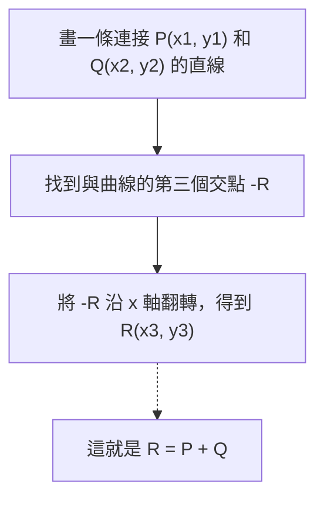
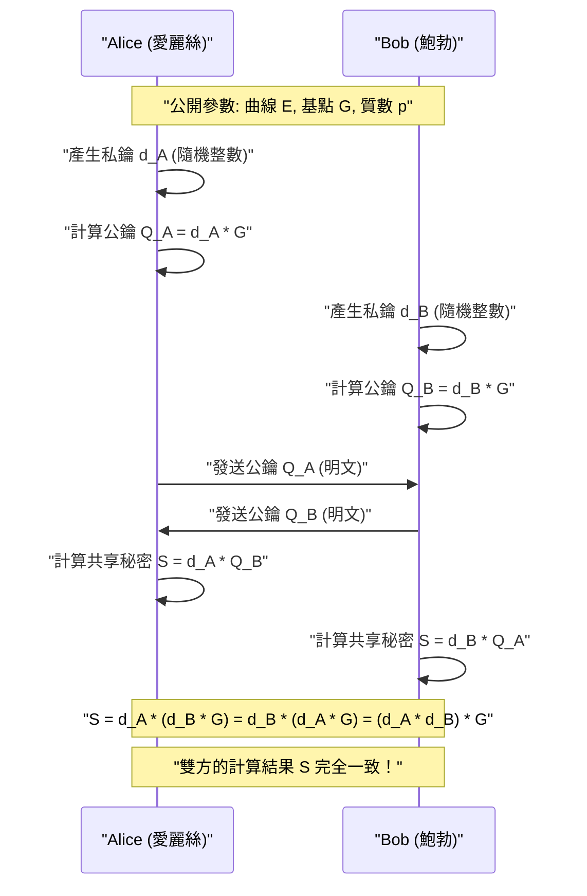
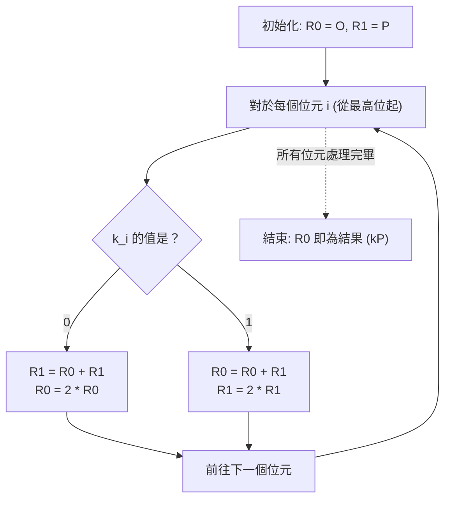

# 橢圓曲線密碼學（ECC）的數學基礎與C++實作

在現代密碼學中，**橢圓曲線密碼學（Elliptic Curve Cryptography: ECC）**扮演著極其重要的角色。從我們日常的網際網路通訊（HTTPS/TLS），到智慧型手機的安全隔離區（Secure Enclave）、SSH伺服器認證、FIDO等無密碼認證，甚至是比特幣和以太坊等加密資產，可以說現代數位社會的信任基礎都是由ECC所支撐的。

本文將從橢圓曲線密碼學如何運作出發，深入探討其背後優美卻深奧的數學理論（有限體上的代數幾何），並介紹如何使用C++進行實際實作，甚至涵蓋如何防範旁路攻擊（計時攻擊）的安全程式設計方法，以壓倒性的篇幅為您徹底解析。

---

## 1. 為什麼選擇橢圓曲線密碼學？（與RSA的比較）

長期以來，公鑰密碼學的代名詞一直是**RSA密碼**。RSA密碼的安全性建立在「大整數質因數分解的困難度」之上。然而，隨著電腦運算能力的提升，為了維持安全性，必須不斷增加RSA的金鑰長度（模數的位元數）。如今，建議的最低金鑰長度為2048位元，若要追求更高的安全性，則建議使用3072位元或4096位元。

相對地，橢圓曲線密碼學（ECC）則以另一種數學難題——**「橢圓曲線上的離散對數問題（ECDLP）」**作為其安全性的基礎。直到現在，尚未發現能有效解決ECDLP的演算法（如次指數時間演算法），即使是目前已知最有效的攻擊方法，也需要指數級的時間。

這個特性讓ECC擁有了一個決定性的優勢：**能以非常短的金鑰長度實現與RSA同等的安全強度**。

| 安全強度（位元） | RSA密碼金鑰長度（位元） | 橢圓曲線密碼金鑰長度（位元） | 金鑰長度比例 |
| :---: | :---: | :---: | :---: |
| 80 | 1024 | 160 | 1:6 |
| 112 | 2048 | 224 | 1:9 |
| 128 | 3072 | 256 | 1:12 |
| 192 | 7680 | 384 | 1:20 |
| 256 | 15360 | 512 | 1:30 |

如上表所示，為了達到128位元的安全強度（目前標準的強度），RSA需要3072位元的金鑰，而ECC只需要短短的256位元。這使得減少計算量、降低記憶體使用量、節省網路頻寬成為可能，特別是在資源受限的物聯網（IoT）設備或智慧卡環境中，展現出壓倒性的優勢。

---

## 2. 數學準備：群論與有限體的世界

要真正理解橢圓曲線密碼學，必須掌握抽象代數（群論與體論）的基本概念。在這裡，我們簡明扼要地總結建構ECC所需的預備知識。

### 2.1. 群（Group）與阿貝爾群
**群（Group）**是指一個集合 $G$ 及其上的一種二元運算（此處以加法 $+$ 表示）所組成的結構 $(G, +)$，並且滿足以下四個公理：

1. **封閉性（Closure）**: 對於任意 $a, b \in G$，$a + b \in G$。
2. **結合律（Associativity）**: 對於任意 $a, b, c \in G$，$(a + b) + c = a + (b + c)$ 成立。
3. **單位元素的存在性（Identity element）**: 存在一個元素 $e \in G$，使得對任意 $a \in G$，$a + e = e + a = a$。在加法群中，這個單位元素通常記為 $0$ 或 $\mathcal{O}$。
4. **反元素的存在性（Inverse element）**: 對於任意 $a \in G$，存在一個元素 $b \in G$ 使得 $a + b = b + a = e$。這個 $b$ 記為 $-a$。

此外，如果運算的順序對調也不會改變結果，也就是滿足以下條件的群，我們稱之為**阿貝爾群（交換群）**：

5. **交換律（Commutativity）**: 對於任意 $a, b \in G$，$a + b = b + a$ 成立。

橢圓曲線上的點的集合，透過定義特定的加法規則，便構成了一個**阿貝爾群**。

### 2.2. 有限體（Finite Field）
在密碼學中，我們不使用像實數或複數那樣連續且具有無限元素的體，而是使用元素數量有限的**有限體（Finite Field）**或稱伽羅瓦體（Galois Field）。

最基本的有限體是使用質數 $p$ 建構的**質數體 $\mathbb{F}_p$**。這是在整數集合 $\{0, 1, 2, \dots, p-1\}$ 上定義模 $p$（除以 $p$ 的餘數）的四則運算（加、減、乘、除）。

- **加法**: $(a + b) \pmod p$
- **減法**: $(a - b) \pmod p$
- **乘法**: $(a \times b) \pmod p$
- **除法**: $a \times b^{-1} \pmod p$ （這裡 $b^{-1}$ 是 $b$ 在模 $p$ 下的乘法反元素）

**乘法反元素（Modular Multiplicative Inverse）**的計算在密碼學實作中非常重要。要找到滿足 $b \times b^{-1} \equiv 1 \pmod p$ 的 $b^{-1}$，主要使用以下兩種演算法：

1. **擴展歐幾里得演算法（Extended Euclidean Algorithm）**: 速度快，但根據實作方式，處理時間可能會依賴於輸入值，從而存在計時攻擊的風險。
2. **費馬小定理（Fermat's Little Theorem）**: 當 $p$ 為質數且 $b \neq 0$ 時，$b^{p-1} \equiv 1 \pmod p$ 成立。兩邊同除以 $b$，可得 $b^{p-2} \equiv b^{-1} \pmod p$。也就是說，透過計算 $b$ 的 $p-2$ 次方即可求得反元素。因為指數運算較容易以常數時間（Constant-time）實作，密碼學實作中通常偏好此方法。

---

## 3. 橢圓曲線方程式與幾何學

### 3.1. 魏爾斯特拉斯標準式
**橢圓曲線（Elliptic Curve）**通常是指由以下被稱為**魏爾斯特拉斯標準式（Weierstrass normal form）**的方程式所定義的平面曲線：

$$ y^2 = x^3 + ax + b $$

其中，$a$ 和 $b$ 為常數，為了讓曲線不具有奇異點（自我交叉或尖點），也就是維持曲線的光滑性，必須滿足以下**判別式（Discriminant） $\Delta$** 不為零的條件：

$$ \Delta = -16(4a^3 + 27b^2) \neq 0 $$

具有奇異點的曲線會損害密碼學上的安全性，因此務必選擇滿足此條件的係數 $a, b$。

### 3.2. 無窮遠點（Point at Infinity）
為了讓橢圓曲線在數學上成為一個完美的群，除了平面上的點之外，還引入了一個虛擬的點，稱為**「無窮遠點（Point at Infinity）」**。我們將其記為 $\mathcal{O}$。

無窮遠點 $\mathcal{O}$ 被定義為所有垂直線在無限遠處相交的點。在群論中，這個無窮遠點 $\mathcal{O}$ 扮演著**加法單位元素**（零）的角色。

也就是說，對於曲線上的任意點 $P$，以下等式成立：
$$ P + \mathcal{O} = \mathcal{O} + P = P $$

此外，點 $P = (x, y)$ 的反元素 $-P$ 被定義為與x軸對稱的點 $(x, -y)$。因此：
$$ P + (-P) = \mathcal{O} $$
成立。

---

## 4. 橢圓曲線上的群運算（點的加法與二倍運算）

構成橢圓曲線密碼學核心的，是曲線上點與點之間的**「加法（Addition）」**運算。這與一般的整數加法不同，它是基於幾何操作所定義的。

### 4.1. 幾何加法（Tangent and Chord Method）
將曲線上兩個不同的點 $P$ 和 $Q$ 相加，求得新點 $R$ ($R = P + Q$) 的步驟如下：

1. 畫一條連接點 $P$ 和點 $Q$ 的直線（割線）。
2. 這條直線必然會與橢圓曲線交於另一個點（我們稱之為 $-R$）。（※根據代數幾何定理）
3. 將交點 $-R$ 沿x軸對稱翻轉（即改變y座標的符號），得到的點即為所求的 $R$ 點。



### 4.2. 點的二倍運算（Point Doubling）
當我們要將點 $P$ 加上其自身（$P + P = 2P$）時，無法畫出一條穿過兩個相異點的直線。此時，我們改為畫出**曲線在點 $P$ 處的切線（Tangent）**。

1. 畫出曲線在點 $P$ 處的切線。
2. 這條切線會與曲線交於另一個點 $-R$。
3. 將此交點沿x軸對稱翻轉，得到的點即為所求的 $R = 2P$。

### 4.3. 代數計算公式
我們可以將上述的幾何操作轉換為代數公式，以便讓電腦進行計算。
所有的運算都是在**有限體 $\mathbb{F}_p$ 上（模 $p$）**進行的。

設點 $P = (x_1, y_1)$，點 $Q = (x_2, y_2)$。
並設計算結果的點為 $R = P + Q = (x_3, y_3)$。

設直線的斜率為 $\lambda$（Lambda）。

**【情況1：當 $P \neq Q$ 時（點的加法）】**
斜率 $\lambda$ 是兩點間的變化率。
$$ \lambda \equiv \frac{y_2 - y_1}{x_2 - x_1} \pmod p $$
$$ \lambda \equiv (y_2 - y_1) \cdot (x_2 - x_1)^{-1} \pmod p $$

使用這個 $\lambda$，我們可以如下求出 $x_3, y_3$：
$$ x_3 \equiv \lambda^2 - x_1 - x_2 \pmod p $$
$$ y_3 \equiv \lambda(x_1 - x_3) - y_1 \pmod p $$

**【情況2：當 $P = Q$ 時（點的二倍運算）】**
斜率 $\lambda$ 會變成透過微分求得的切線斜率。（隱函數微分 $y^2 = x^3 + ax + b$）
$$ 2y \cdot y' = 3x^2 + a \implies y' = \frac{3x^2 + a}{2y} $$
因此，
$$ \lambda \equiv (3x_1^2 + a) \cdot (2y_1)^{-1} \pmod p $$

$x_3, y_3$ 的公式與加法的形式相同，但因為 $x_2 = x_1$，所以變成如下形式：
$$ x_3 \equiv \lambda^2 - 2x_1 \pmod p $$
$$ y_3 \equiv \lambda(x_1 - x_3) - y_1 \pmod p $$

> [!IMPORTANT]
> 這些公式包含了 $(x_2 - x_1)^{-1}$ 和 $(2y_1)^{-1}$ 等**除法（計算模反元素）**。因為模反元素的計算成本極高，所以在實際實作中，通常會使用**「雅可比座標系（Jacobian Coordinates）」**等射影座標系來延遲除法的運算。

---

## 5. 純量乘法與橢圓曲線離散對數問題（ECDLP）

在橢圓曲線密碼學中，計算量最大且構成安全核心的運算是**純量乘法（Scalar Multiplication）**。

### 5.1. 什麼是純量乘法
將某個點 $P$ 連續相加 $k$ 次的操作稱為純量乘法，記為 $kP$。
$$ kP = \underbrace{P + P + \dots + P}_{k\text{次}} $$

這裡的 $k$ 是一個非常大的整數（例如256位元的整數）。

### 5.2. 橢圓曲線離散對數問題（ECDLP）
橢圓曲線密碼學的安全性仰賴於以下問題的困難度：

> **橢圓曲線離散對數問題 (Elliptic Curve Discrete Logarithm Problem: ECDLP)**
> 給定已知的點 $P$（基點）以及計算結果的點 $Q$，請求出滿足 $Q = kP$ 的純量 $k$。

從 $k$ 和 $P$ 計算出 $Q$（順向）利用後述的演算法非常簡單（多項式時間），但是從 $P$ 和 $Q$ 反推 $k$（逆向），除了暴力破解外，目前沒有高效的解法，實際上是不可能的（單向函數）。
在密碼協定中，**$k$ 對應「私鑰」，而 $Q$ 對應「公鑰」**。

### 5.3. Double-and-Add 演算法
當 $k$ 是一個巨大數字（例如：$2^{256}$）時，單純將 $P$ 相加 $k$ 次，就算到了宇宙的盡頭也算不完。因此，為了快速進行純量乘法，我們會使用**Double-and-Add方法（二進位法）**。

這是快速計算整數冪的「重複平方法」的橢圓曲線版本。我們將純量 $k$ 表示為二進位數，並從最高位元開始依序處理。

1. 將保存結果的點 $R$ 初始化為 $\mathcal{O}$。
2. 從 $k$ 的最高位元到最低位元重複以下步驟：
   - 將 $R$ 乘以 2（Point Doubling: $R = 2R$）
   - 如果當前位元為 `1`，則將 $R$ 加上 $P$（Point Addition: $R = R + P$）

透過這個演算法，計算量從 $O(k)$ 劇烈減少到 $O(\log_2 k)$，使得在現實時間（毫秒級別）內完成計算成為可能。

---

## 6. 橢圓曲線迪菲-赫爾曼（ECDH）金鑰交換

在此，我們將解說ECC最具代表性的應用例子——**ECDH（Elliptic Curve Diffie-Hellman）金鑰交換協定**的運作原理。ECDH 是一種讓 Alice 和 Bob 在可能被竊聽的通訊通道上，安全地產生並共享共通私鑰（會話金鑰）的機制（這是TLS交握的核心）。

**【前提參數（領域參數）】**
雙方預先共享要使用的橢圓曲線 $E$、質數 $p$ 以及基點 $G$。（例如 NIST P-256 或 secp256k1 等）



竊聽者（Eve）雖然能攔截通訊路徑上的 $G$、$Q_A$、$Q_B$，但由於 ECDLP 的困難性，無法從 $Q_A = d_A \cdot G$ 推導出 Alice 的私鑰 $d_A$。此外，即使將 $Q_A$ 和 $Q_B$ 相乘，也不會得到共享金鑰 $S$，因此竊聽者無法計算出 $S$。

---

## 7. 實作的陷阱：旁路攻擊與對策

即使是理論上完美的密碼演算法，在將其編寫為程式的過程中，也可能產生漏洞。這就是**「旁路攻擊（Side-Channel Attack）」**。

### 7.1. 計時攻擊（Timing Attack）
讓我們回顧一下前面提到的 Double-and-Add 演算法。

```cpp
// 脆弱的 Double-and-Add 虛擬碼
Point R = Point::Infinity;
for (int i = 255; i >= 0; i--) {
    R = PointDoubling(R);         // 總是會執行
    if (bit(k, i) == 1) {
        R = PointAddition(R, P);  // 只有當位元為1時才會執行！
    }
}
```

這個實作有一個致命的缺陷。因為當位元為 `1` 時會執行 Point Addition，所以計算時間會比位元為 `0` 時**稍微長一點**。此外，處理器的分支預測和快取記憶體的行為也會改變。
攻擊者藉由統計觀察這微小的計算時間（或耗電量）差異數千次，就能**將私鑰 $k$ 的位元序列逐位元完全還原**。這就是計時攻擊。

### 7.2. 常數時間（Constant-Time）實作：Montgomery Ladder
為了防範計時攻擊，我們必須採用**無論私鑰位元值為何，執行的指令序列和計算時間都始終保持恆定（Constant-Time）**的演算法。

最具代表性的例子就是**Montgomery Ladder（蒙哥馬利階梯）**。



Montgomery Ladder的優美之處在於，無論位元是 `0` 還是 `1`，都**「始終會執行1次 Point Addition 和1次 Point Doubling」**。這徹底消除了計算時間的資料依賴性。

然而，只要分支（`if (k_i == 0)`）本身存在，編譯器的最佳化或 CPU 的分支預測仍可能帶來執行時間波動的風險。因此，在實際的常數時間實作中，我們會消除條件分支（`if` 敘述），並使用**位元運算來進行條件式交換（Conditional Swap）**。

---

## 8. 使用C++實作橢圓曲線密碼學

從這裡開始，我們將把理論轉化為C++程式碼。實用的密碼學函式庫（如 OpenSSL 或 libsodium 等）採用了高度的組合語言最佳化和雅可比座標系，但在這裡，為了加深對數學的理解，我們將展示一個**使用仿射座標系（Affine Coordinates）、容易理解的常數時間實作**架構。

我們假設使用 `boost::multiprecision::cpp_int` 來處理大整數運算。

### 8.1. 模運算與反元素
首先，定義有限體上運算的輔助函式。我們實作利用費馬小定理計算反元素的方法。

```cpp
#include <iostream>
#include <vector>
#include <stdexcept>
#include <boost/multiprecision/cpp_int.hpp>

using namespace boost::multiprecision;

// 以 secp256k1 的質數 p 與參數為例
const cpp_int p("0xFFFFFFFFFFFFFFFFFFFFFFFFFFFFFFFFFFFFFFFFFFFFFFFFFFFFFFFEFFFFFC2F");
const cpp_int a = 0;
const cpp_int b = 7;

// 回傳正餘數的模運算
cpp_int mod(cpp_int x, cpp_int m) {
    cpp_int r = x % m;
    return r < 0 ? r + m : r;
}

// 模冪運算 (x^y mod m)
cpp_int powerMod(cpp_int base, cpp_int exp, cpp_int m) {
    cpp_int res = 1;
    base = mod(base, m);
    while (exp > 0) {
        if (exp % 2 == 1) res = mod(res * base, m);
        base = mod(base * base, m);
        exp /= 2;
    }
    return res;
}

// 使用費馬小定理計算模反元素
cpp_int modInverse(cpp_int n, cpp_int m) {
    // 假設 m 是質數: n^(m-2) ≡ n^(-1) mod m
    return powerMod(n, m - 2, m);
}
```

### 8.2. 點的表示與群運算（加法、二倍運算）
我們將無窮遠點以旗標（flag）來管理，建立 `Point` 結構體，並實作加法公式。

```cpp
struct Point {
    cpp_int x;
    cpp_int y;
    bool isInfinity;

    // 產生無窮遠點
    Point() : x(0), y(0), isInfinity(true) {}
    
    // 產生一般的點
    Point(cpp_int x, cpp_int y) : x(x), y(y), isInfinity(false) {}
};

// 橢圓曲線上的點加法 (R = P + Q)
Point pointAdd(const Point& P, const Point& Q) {
    if (P.isInfinity) return Q;
    if (Q.isInfinity) return P;

    if (P.x == Q.x && mod(P.y + Q.y, p) == 0) {
        return Point(); // P + (-P) = 無窮遠點
    }

    cpp_int lambda;
    if (P.x == Q.x && P.y == Q.y) {
        // Point Doubling (當 P = Q 時)
        // lambda = (3x^2 + a) / 2y
        cpp_int num = mod(3 * P.x * P.x + a, p);
        cpp_int den = modInverse(mod(2 * P.y, p), p);
        lambda = mod(num * den, p);
    } else {
        // Point Addition (當 P != Q 時)
        // lambda = (y2 - y1) / (x2 - x1)
        cpp_int num = mod(Q.y - P.y, p);
        cpp_int den = modInverse(mod(Q.x - P.x, p), p);
        lambda = mod(num * den, p);
    }

    cpp_int x3 = mod(lambda * lambda - P.x - Q.x, p);
    cpp_int y3 = mod(lambda * (P.x - x3) - P.y, p);

    return Point(x3, y3);
}
```

### 8.3. Constant-Time Conditional Swap 的實作
在根據私鑰位元值來交換變數內容時，我們不使用 `if` 敘述，而是僅透過位元運算（遮罩）來進行交換。如此一來，執行路徑將保持絕對一致。

> [!TIP]
> 在實際的實作中，像 `cpp_int` 這種動態配置記憶體的多倍長整數類別並不適合常數時間處理。因為記憶體配置或陣列大小的變動可能會洩漏時間資訊。在實用的函式庫中，通常會以固定長度（例如 uint64_t × 4個元素的陣列）來表示，並實作位元層級的遮罩處理。以下僅為概念性的範例。

```cpp
// 概念性的常數時間交換 (假設為固定長度整數)
// 如果 bit 為 1 則交換 P1 和 P2，若為 0 則不交換
void cswap(Point& P1, Point& P2, uint8_t bit) {
    // bit 為 0 或 1。遮罩在 bit=1 時全為1 (0xFF..)，在 0 時全為0。
    // (這裡為了說明，假設固定長度的 BigInt 類別每個 word 為 w)
    /*
    uint64_t mask = 0 - (uint64_t)bit;
    for (int i = 0; i < NUM_WORDS; i++) {
        uint64_t dummy = mask & (P1.x.words[i] ^ P2.x.words[i]);
        P1.x.words[i] ^= dummy;
        P2.x.words[i] ^= dummy;
        // y座標與 isInfinity 旗標也同樣處理
    }
    */
    
    // ※ 在 boost::multiprecision 中很難實現完美的常數時間交換，
    // 在此僅以分支條件來模擬，幫助理解邏輯。
    if (bit == 1) {
        std::swap(P1, P2);
    }
}
```

### 8.4. 使用 Montgomery Ladder 進行純量乘法
結合前面的 `pointAdd` 和 `cswap`，我們來實作安全的純量乘法。

```cpp
// 純量乘法 k * P (Montgomery Ladder 方式)
Point scalarMultiply(const Point& P, cpp_int k) {
    Point R0 = Point(); // 無窮遠點
    Point R1 = P;

    // 取得 k 的位元長度 (secp256k1 為 256 位元)
    int numBits = 256; 
    
    for (int i = numBits - 1; i >= 0; i--) {
        // 取得第 i 個位元的值 (0 或 1)
        uint8_t bit = static_cast<uint8_t>(bit_test(k, i) ? 1 : 0);

        // 如果 bit == 1，則交換 R0 和 R1
        cswap(R0, R1, bit);

        // 始終執行相同的運算 (Point Addition 和 Point Doubling)
        R1 = pointAdd(R0, R1);
        R0 = pointAdd(R0, R0);

        // 如果 bit == 1，為了將狀態復原，再次進行交換
        cswap(R0, R1, bit);
    }

    return R0;
}
```

透過這樣的實作邏輯，無論純量 $k$ 的各個位元是 `0` 還是 `1`，在每次迴圈疊代中執行的運算（`cswap` $\to$ `pointAdd` $\to$ `pointAdd` $\to$ `cswap`）都會完全相同，從而有效防止攻擊者透過計時或快取存取模式的差異來竊取機密資訊。

---

## 9. 總結

初次接觸橢圓曲線密碼學（ECC）時，可能會對「為什麼畫一條直線並將交點翻轉這種幾何操作能成為密碼？」感到不可思議。然而，這正是將其映射到有限體這個離散世界後，所建構出完美的單向函數（離散對數問題），可說是數學與密碼學奇蹟般融合的產物。

本文解說了以下幾個重點：

1. **對 RSA 的優勢**: 能以極短的金鑰長度提供強大的安全性，是現代行動裝置與物聯網（IoT）時代的最佳選擇。
2. **群論與有限體基礎**: 構成 ECC 基礎的數學結構。
3. **加法與二倍運算公式**: 使用魏爾斯特拉斯方程式的代數群運算實作方法。
4. **旁路攻擊的威脅**: 依賴於私鑰位元的條件分支會造成致命的漏洞。
5. **常數時間（Constant-Time）實作**: 採用 Montgomery Ladder 和 Conditional Swap，使硬體層級的行為均勻化以防止攻擊的 C++ 程式設計技巧。

一般極不建議自行編寫應用於正式生產環境的密碼學函式庫（"Don't roll your own crypto"），因為這伴隨著極高的安全風險。然而，對於設計和維護高安全性、高效能系統的工程師來說，深入了解其內部運作的演算法及數學背景，無疑是一項極其寶貴且強大的武器。

在下一篇文章中，我們將進一步探討利用這條橢圓曲線所建立的數位簽章演算法——**ECDSA (Elliptic Curve Digital Signature Algorithm)** 的機制，以及比特幣所採用的 **Schnorr 簽章**。
