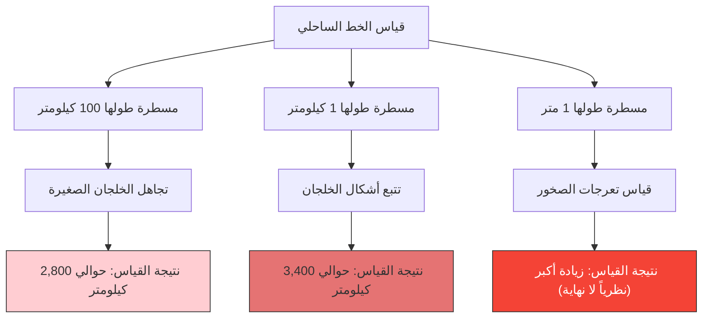

كم كيلومتراً يبلغ طول ساحل بريطانيا يا تُرى؟
قد تعتقد أن الإجابة موجودة إذا بحثت في الموسوعات أو كتب الجغرافيا. ولكن في الواقع، توجد حقيقة غريبة وهي أن **"الإجابة تتغير بناءً على طريقة القياس، ونظرياً يصبح الطول لا نهائياً"**.

هذه هي **مفارقة الساحل (Coastline Paradox)**. وكان هذا الاكتشاف حافزاً لظهور مجال جديد تماماً في الرياضيات عُرف لاحقاً باسم "الهندسة الكسيرية" (Fractal Geometry).

## كلما قصرت المسطرة، زادت المسافة

الخط الساحلي ليس خطاً مستقيماً، بل يتكون من عدد لا يحصى من الخلجان والرؤوس والتعرجات الصخرية.

لنفترض أنك قمت بقياس ساحل بريطانيا باستخدام مسطرة عملاقة (خط مستقيم) يبلغ طولها 100 كيلومتر. باستخدام هذه المسطرة، سيتم تجاهل الخلجان الصغيرة المتعرجة وأشباه الجزر التي يقل طولها عن 100 كيلومتر، وسيتم اختصارها.

بعد ذلك، لنجرب إعادة القياس باستخدام مسطرة طولها 1 كيلومتر. عندئذٍ، ستقوم بالقياس على طول ملامح الخلجان والرؤوس الصغيرة التي تم تجاهلها سابقاً، مما يؤدي بالتأكيد إلى زيادة الطول الإجمالي.

علاوة على ذلك، ماذا سيحدث لو قمنا بقياس كل تعرج من تعرجات الصخور باستخدام مسطرة طولها 1 متر، وقياس أسطح الحصى بمسطرة طولها 1 سنتيمتر، وقياس ملامح حبيبات الرمل بمسطرة طولها 1 مليمتر؟

اكتشف لويس فراي ريتشاردسون هذه الظاهرة تجريبياً في عام 1951. فكلما صغرت وحدة القياس (طول المسطرة)، زاد طول الساحل المُقاس بشكل لا نهائي.

## البعد الكسيري: بين البعد الأول والبعد الثاني

قدم عالم الرياضيات بينويت ماندلبروت تفسيراً رياضياً لهذه المفارقة. فقد نشر في عام 1967 ورقة بحثية شهيرة في مجلة "ساينس" بعنوان "كم يبلغ طول ساحل بريطانيا؟ التشابه الذاتي والبعد الكسيري".

أشار ماندلبروت إلى أن الأشكال الطبيعية مثل خط الساحل تمتلك خاصية **التشابه الذاتي (الفركتل)**، حيث "تظهر نفس البنية المعقدة مهما زادت نسبة التكبير".

في حالة الخط المستقيم الرياضي البحت (أحادي البعد)، فإن تنصيف المسطرة لا يغير من الطول. لكن الخط الساحلي شديد التعرج لدرجة أنه أكثر تعقيداً من خط أحادي البعد، وفي الوقت نفسه ليس مستوى ثنائي الأبعاد يمتلك مساحة.

للتعبير عن مدى تعقيد مثل هذه الأشكال، قدم ماندلبروت مفهوم **"البعد الكسيري" (Hausdorff dimension)**.
يُقدر البعد الكسيري لساحل بريطانيا بحوالي $D \approx 1.25$. أي أن الخط الساحلي لبريطانيا هو كينونة عجيبة "بعدها أعلى من الخط أحادي البعد، وأقل من المستوى ثنائي الأبعاد".

إذا كان طول المسطرة هو $s$، وطول الساحل المُقاس هو $L(s)$، فإن العلاقة التالية تنطبق مع البعد الكسيري $D$:

$$ L(s) \propto s^{1-D} $$

في حالة ساحل بريطانيا، $D = 1.25$، وبالتالي $1 - D = -0.25$.
$$ L(s) \propto s^{-0.25} $$
هذا يوضح رياضياً أنه كلما اقترب طول المسطرة $s$ من الصفر، فإن نتيجة القياس $L(s)$ تتجه نحو المالانهاية $\infty$.

## الاستنتاج النهائي: لا يمكن تعريف الطول

مفهوم "الطول" الذي نستخدمه يومياً يصلح فقط للخطوط المستقيمة أو المنحنيات الملساء. أما بالنسبة للأشكال الكسيرية الموجودة في الطبيعة (مثل السواحل، السحب، السلاسل الجبلية، وتفرعات الأوعية الدموية)، فإن السؤال عن "الطول المطلق" في حد ذاته لا يحمل معنى من الناحية الرياضية.

"كم يبلغ طول ساحل بريطانيا؟"
الإجابة الصحيحة هي: "يعتمد ذلك على طول المسطرة المستخدمة في القياس"، ونظرياً هو "لانهائي". حقيقة أن هناك طولاً لانهائياً مطوياً داخل مساحة صغيرة محدودة، يمكن اعتبارها مفارقة جميلة تتحدى إدراكنا للمكان.
