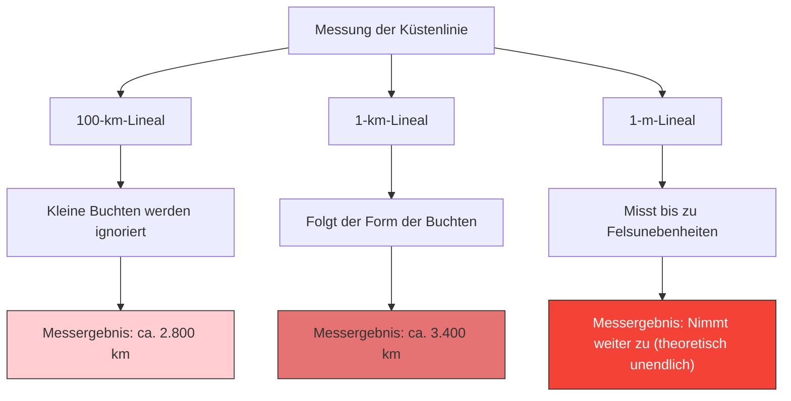

Wie viele Kilometer lang ist die Küstenlinie Großbritanniens?
Man könnte meinen, dass man die Antwort findet, wenn man in einer Enzyklopädie oder einem Geografiebuch nachschlägt. In der Realität gibt es jedoch die merkwürdige Tatsache, dass **"die Antwort von der Messmethode abhängt und theoretisch unendlich ist"**.

Das ist das **Küstenlinien-Paradoxon (Coastline Paradox)**. Diese Entdeckung führte später zur Entstehung eines völlig neuen mathematischen Bereichs, der "fraktalen Geometrie".

## Je kürzer das Lineal, desto länger die Strecke

Eine Küstenlinie ist keine gerade Linie, sondern besteht aus unzähligen Buchten, Kaps und felsigen Unebenheiten.

Angenommen, wir messen die Küstenlinie Großbritanniens mit einem gigantischen Lineal (einer geraden Linie) von 100 km Länge. Bei diesem Lineal werden die kleinen Buchten und Halbinseln von weniger als 100 km ignoriert und abgeschnitten.

Lassen Sie uns als Nächstes mit einem 1 km langen Lineal erneut messen. Da wir nun entlang der Konturen kleinerer Buchten und Kaps messen, die zuvor ignoriert wurden, wird die Gesamtlänge definitiv größer.

Was passiert, wenn wir die Unebenheiten jedes Felsens mit einem 1 m langen Lineal messen, die Oberfläche von Kieselsteinen mit einem 1 cm langen Lineal und die Konturen von Sandkörnern mit einem 1 mm langen Lineal?

Lewis Fry Richardson entdeckte dieses Phänomen 1951 empirisch. Wenn die Maßeinheit (die Länge des Lineals) kleiner wird, nimmt die gemessene Länge der Küstenlinie endlos zu.

## Fraktale Dimension: Zwischen 1D und 2D

Der Mathematiker Benoît Mandelbrot lieferte eine mathematische Erklärung für dieses Paradoxon. Im Jahr 1967 veröffentlichte er in der Zeitschrift Science seinen berühmten Artikel „How Long Is the Coast of Britain? Statistical Self-Similarity and Fractional Dimension“.

Mandelbrot wies darauf hin, dass natürliche Formen wie Küstenlinien eine **Selbstähnlichkeit (Fraktal)** besitzen, bei der "egal wie stark man vergrößert, ähnlich komplexe Strukturen erscheinen".

Wenn es sich um eine reine mathematische Linie (eindimensional) handelt, ändert sich ihre Länge nicht, auch wenn man das Lineal halbiert. Die Küstenlinie ist jedoch so gezackt, dass sie komplexer als eine eindimensionale Linie ist, aber auch keine zweidimensionale Fläche mit einem Flächeninhalt darstellt.

Mandelbrot führte das Konzept der **"fraktalen Dimension (Hausdorff-Dimension)"** ein, um die Komplexität solcher Figuren auszudrücken.
Die fraktale Dimension der Küste Großbritanniens wird auf $D \approx 1.25$ geschätzt. Das bedeutet, dass die britische Küstenlinie ein mysteriöses Gebilde ist, das "eine höhere Dimension als eine 1D-Linie und eine niedrigere Dimension als eine 2D-Fläche" aufweist.

Wenn wir die Länge des Lineals mit $s$ und die gemessene Länge der Küstenlinie mit $L(s)$ bezeichnen, besteht die folgende Beziehung zur fraktalen Dimension $D$:

$$ L(s) \propto s^{1-D} $$

Im Fall der britischen Küstenlinie ist $D = 1.25$, was bedeutet, dass $1 - D = -0.25$ ist.
$$ L(s) \propto s^{-0.25} $$
Dies zeigt mathematisch, dass das Messergebnis $L(s)$ gegen Unendlich $\infty$ divergiert, wenn sich die Länge des Lineals $s$ der 0 nähert.

## Letzte Schlussfolgerung: Länge kann nicht definiert werden

Das Konzept der "Länge", das wir im Alltag verwenden, funktioniert nur für glatte gerade Linien und Kurven. Für fraktale Formen in der Natur (Küstenlinien, Wolken, Gebirgszüge, Verzweigungen von Blutgefäßen usw.) ist die Frage nach einer "absoluten Länge" im Grunde mathematisch bedeutungslos.

"Wie lang ist die Küstenlinie Großbritanniens?"
Die richtige Antwort darauf lautet: "Das hängt von der Länge des Lineals ab, mit dem man misst", und theoretisch ist sie "unendlich". Die Tatsache, dass sich eine unendliche Länge in einem begrenzten, kleinen Raum zusammenfaltet, kann man als ein schönes Paradoxon unserer Raumwahrnehmung bezeichnen.
