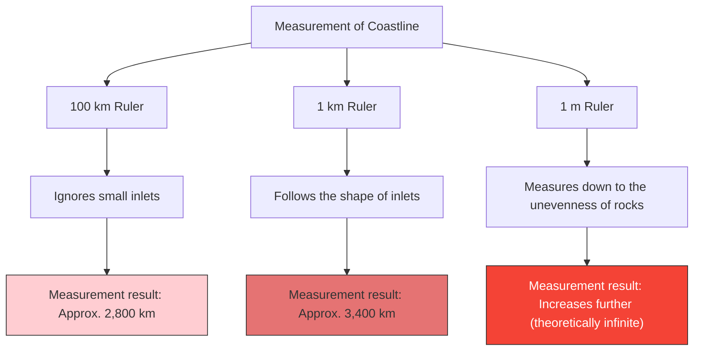

How many kilometers long is the coastline of Britain?
You might think the answer can be found in an encyclopedia or a geography textbook. However, in reality, there exists a strange fact: **"the answer changes depending on how you measure it, and theoretically becomes infinite."**

This is the **Coastline Paradox**. This discovery later sparked the creation of an entirely new field of mathematics called "fractal geometry."

## The Shorter the Ruler, the Longer the Distance

A coastline is not a straight line, but is composed of countless inlets, capes, and irregularities in the rocky surface.

Suppose you measured the coastline of Britain with a giant 100 km ruler (a straight line). With this ruler, the jagged edges of small inlets and peninsulas under 100 km are ignored and shortcut.

Next, let's measure it again with a 1 km ruler. Since you are now measuring along the contours of the small bays and capes that were ignored earlier, the total length will inevitably be longer.

Furthermore, what would happen if you measured the unevenness of every single rock with a 1 m ruler, the surface of pebbles with a 1 cm ruler, and the contours of grains of sand with a 1 mm ruler?

Lewis Fry Richardson discovered this phenomenon empirically in 1951. As the unit of measurement (the length of the ruler) gets smaller, the measured length of the coastline increases endlessly.

## Fractal Dimension: Between 1D and 2D

The mathematician Benoit Mandelbrot provided a mathematical explanation for this paradox. In 1967, he published a famous paper in the journal *Science* titled "How Long Is the Coast of Britain? Statistical Self-Similarity and Fractional Dimension".

Mandelbrot pointed out that natural shapes like coastlines possess **self-similarity (fractals)**, meaning that "no matter how much you zoom in, the same kind of complex structure appears."

If it were a pure mathematical straight line (1 dimension), the length would not change even if you halved the ruler. However, a coastline is so jagged that it is more complex than a 1D line, yet it is not a 2D surface with area either.

Mandelbrot introduced the concept of **"fractal dimension (Hausdorff dimension)"** to represent the complexity of such figures.
The fractal dimension of the coastline of Britain is estimated to be $D \approx 1.25$. In other words, the coastline of Britain is a mysterious entity with a "dimension higher than a 1D line, but lower than a 2D surface."

If the length of the ruler is $s$ and the measured length of the coastline is $L(s)$, the following relationship exists with the fractal dimension $D$:

$$ L(s) \propto s^{1-D} $$

In the case of Britain's coastline, $D = 1.25$, so $1 - D = -0.25$.
$$ L(s) \propto s^{-0.25} $$
This shows mathematically that as the ruler length $s$ approaches 0, the measurement result $L(s)$ diverges to infinity $\infty$.

## Ultimate Conclusion: Length Cannot Be Defined

The concept of "length" that we use in everyday life works only for smooth straight lines and curves. Asking for the "absolute length" of a fractal figure existing in nature (coastlines, clouds, mountain ranges, branching of blood vessels, etc.) actually makes no mathematical sense.

"How long is the coast of Britain?"
The correct answer is, "It depends on the length of the ruler used to measure it," and theoretically, it is "infinite." The fact that infinite length is folded into a limited small space can be said to be a beautiful paradox regarding our spatial perception.
