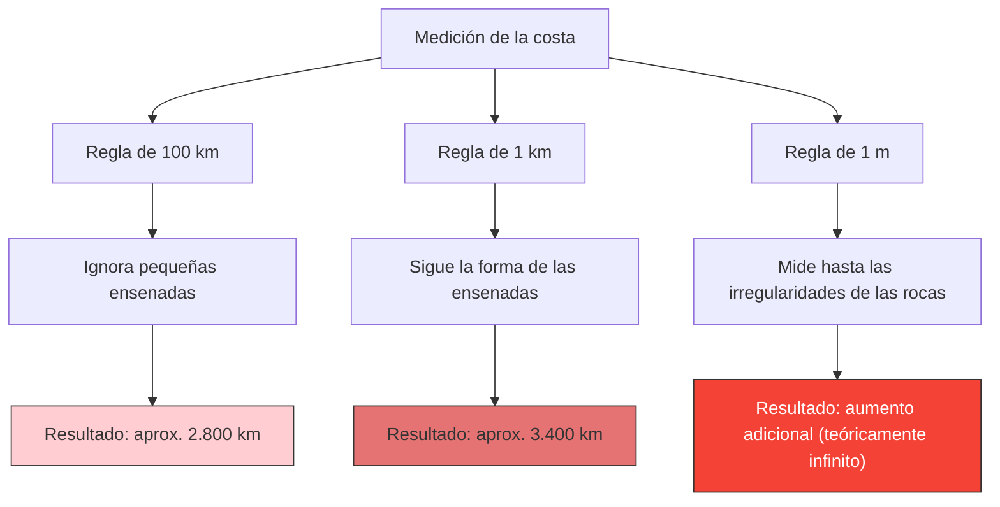

---
title: "¿Qué tan larga es la costa de Gran Bretaña?: La paradoja de la costa"
description: "Cuanto más corta es la regla con la que se mide, más larga se vuelve la costa, tendiendo al infinito. Es la famosa paradoja que abrió las puertas a la geometría fractal."
date: 2026-09-10T21:00:00+09:00
draft: false
slug: "coastline-paradox"
image: "img/coastline_paradox.jpg"
math: true
mermaid: true
categories: ["Paradojas matemáticas", "Geometría"]
tags: ["Paradoja", "Fractal", "Mandelbrot", "Infinito"]
---

¿Cuántos kilómetros de longitud tiene la costa de Gran Bretaña?
Podrías pensar que la respuesta se encuentra buscando en una enciclopedia o en un libro de texto de geografía. Sin embargo, en la realidad existe el extraño hecho de que **"la respuesta cambia dependiendo de cómo se mida, y teóricamente es infinita"**.

Esta es **la paradoja de la costa (Coastline Paradox)**. Este descubrimiento fue el catalizador que más tarde dio origen a una rama de las matemáticas completamente nueva llamada "geometría fractal".

## Cuanto más corta es la regla, más aumenta la distancia

Una costa no es una línea perfectamente recta, sino que está compuesta por innumerables ensenadas, cabos e irregularidades en la superficie de las rocas.

Supongamos que medimos la costa de Gran Bretaña con una regla gigante (una línea recta) de 100 km de longitud. Con esta regla, las pequeñas ensenadas y los contornos irregulares de las penínsulas de menos de 100 km son ignorados, creándose atajos.

A continuación, intentemos medir de nuevo con una regla de 1 km de longitud. Entonces, como ahora estaremos midiendo a lo largo de los contornos de pequeñas bahías y cabos que antes fueron ignorados, la longitud total indudablemente aumentará.

Además, ¿qué pasaría si midiéramos cada una de las irregularidades de las rocas con una regla de 1 m, la superficie de las piedras con una regla de 1 cm, y el contorno de los granos de arena con una regla de 1 mm?

Lewis Fry Richardson descubrió empíricamente este fenómeno en 1951. A medida que la unidad de medida (la longitud de la regla) se hace más pequeña, la longitud de la costa medida aumenta sin fin.

## Dimensión fractal: Entre una y dos dimensiones

Quien dio una explicación matemática a esta paradoja fue el matemático Benoît Mandelbrot. En 1967, publicó en la revista Science un famoso artículo titulado "¿Cuánto mide la costa de Gran Bretaña? Autosimilitud estadística y dimensión fractal".

Mandelbrot señaló que las formas de la naturaleza, como las costas, poseen **autosimilitud (fractales)**, lo que significa que "no importa cuánto se amplíen, aparece la misma estructura compleja".

Si fuera una línea matemática pura (unidimensional), su longitud no cambiaría aunque la regla se redujera a la mitad. Sin embargo, como una costa es tan irregular, es más compleja que una línea unidimensional, pero tampoco es una superficie bidimensional con área.

Mandelbrot introdujo el concepto de **"dimensión fractal (dimensión de Hausdorff)"** para expresar la complejidad de este tipo de figuras.
Se estima que la dimensión fractal de la costa de Gran Bretaña es $D \approx 1.25$. Es decir, la costa de Gran Bretaña es una existencia misteriosa cuya dimensión es "mayor que la de una línea unidimensional, y menor que la de una superficie bidimensional".

Si la longitud de la regla es $s$ y la longitud medida de la costa es $L(s)$, se establece la siguiente relación con la dimensión fractal $D$:

$$ L(s) \propto s^{1-D} $$

En el caso de la costa de Gran Bretaña, como $D = 1.25$, entonces $1 - D = -0.25$.
$$ L(s) \propto s^{-0.25} $$
Esto demuestra matemáticamente que a medida que la longitud de la regla $s$ se acerca a 0, el resultado de la medición $L(s)$ diverge hacia el infinito $\infty$.

## Conclusión final: La longitud no se puede definir

El concepto de "longitud" que utilizamos cotidianamente solo funciona para líneas rectas y curvas suaves. Para las figuras fractales que existen en la naturaleza (costas, nubes, cordilleras, ramificaciones de vasos sanguíneos, etc.), preguntar por una "longitud absoluta" en realidad carece de sentido matemático.

"¿Qué tan larga es la costa de Gran Bretaña?"
La respuesta correcta a esto es que "depende de la longitud de la regla con la que se mida", y teóricamente es "infinita". El hecho de que una longitud infinita esté plegada dentro de un espacio pequeño y limitado puede decirse que es una hermosa paradoja para nuestra percepción del espacio.
