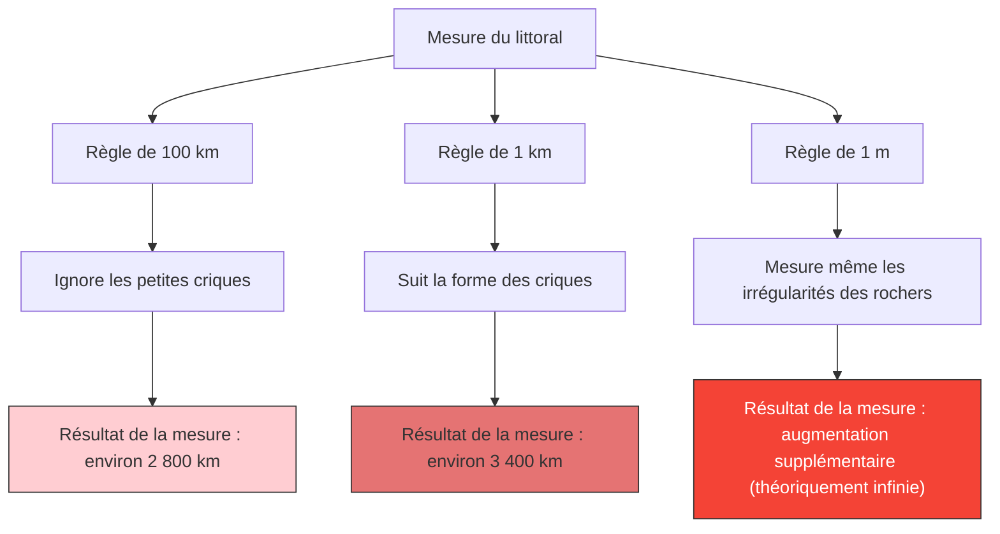

---
title: "Quelle est la longueur de la côte britannique ? : Le paradoxe du littoral"
description: "Plus la règle de mesure est courte, plus le littoral devient infiniment long. Il s'agit d'un célèbre paradoxe qui a ouvert la porte à la géométrie fractale."
date: 2026-09-10T21:00:00+09:00
draft: false
slug: "coastline-paradox"
image: "img/coastline_paradox.jpg"
math: true
mermaid: true
categories: ["Paradoxe Mathématique", "Géométrie"]
tags: ["Paradoxe", "Fractale", "Mandelbrot", "Infini"]
---

Quelle est la longueur de la côte de la Grande-Bretagne en kilomètres ?
Vous pourriez penser que si vous cherchez dans une encyclopédie ou un manuel de géographie, vous trouverez la réponse. Cependant, en réalité, il existe un fait étrange : **"la réponse change selon la façon dont on la mesure, et en théorie, elle devient infinie"**.

C'est ce qu'on appelle le **paradoxe du littoral (Coastline Paradox)**. Cette découverte a ensuite conduit à la création d'un tout nouveau domaine des mathématiques appelé la « géométrie fractale ».

## Plus la règle est courte, plus la distance s'allonge

Un littoral n'est pas une ligne droite, mais est composé d'une myriade de criques, de caps et d'irrégularités rocheuses.

Supposons que nous mesurions la côte britannique avec une énorme règle (ligne droite) de 100 km de long. Avec cette règle, les dentelures des petites criques et des péninsules de moins de 100 km sont ignorées et raccourcies.

Ensuite, remesurons-la avec une règle de 1 km de long. Alors, parce que nous mesurons le long des contours des petites baies et des caps qui étaient ignorés auparavant, la longueur totale sera certainement plus longue.

De plus, que se passerait-il si nous mesurions les irrégularités de chaque rocher avec une règle de 1 m de long, la surface d'un caillou avec une règle de 1 cm de long, et les contours d'un grain de sable avec une règle de 1 mm de long ?

Lewis Fry Richardson a découvert ce phénomène empiriquement en 1951. Au fur et à mesure que l'unité de mesure (la longueur de la règle) devient plus petite, la longueur mesurée du littoral augmente sans fin.

## Dimension fractale : Entre 1 dimension et 2 dimensions

C'est le mathématicien Benoît Mandelbrot qui a donné une explication mathématique à ce paradoxe. En 1967, il a publié un célèbre article dans la revue Science intitulé « Quelle est la longueur de la côte britannique ? Auto-similarité statistique et dimension fractionnaire ».

Mandelbrot a souligné que les formes naturelles comme les littoraux ont une **auto-similarité (fractale)**, ce qui signifie que « peu importe à quel point vous les agrandissez, des structures complexes similaires apparaissent ».

S'il s'agit d'une pure ligne droite mathématique (1 dimension), la longueur ne changera pas même si la règle est divisée par deux. Cependant, le littoral est si dentelé qu'il est plus complexe qu'une ligne en 1 dimension, et pourtant ce n'est pas non plus une surface en 2 dimensions avec une aire.

Mandelbrot a introduit le concept de **« dimension fractale (Dimension de Hausdorff) »** pour exprimer la complexité de telles figures.
La dimension fractale de la côte britannique est estimée à $D \approx 1.25$. En d'autres termes, la côte britannique est une entité mystérieuse qui a « une dimension supérieure à une ligne en 1 dimension, et une dimension inférieure à une surface en 2 dimensions ».

Soit $s$ la longueur de la règle et $L(s)$ la longueur mesurée du littoral, la relation suivante s'établit avec la dimension fractale $D$.

$$ L(s) \propto s^{1-D} $$

Dans le cas de la côte britannique, puisque $D = 1.25$, nous avons $1 - D = -0.25$.
$$ L(s) \propto s^{-0.25} $$
Cela montre mathématiquement qu'à mesure que la longueur de la règle $s$ s'approche de 0, le résultat de la mesure $L(s)$ diverge vers l'infini $\infty$.

## La conclusion ultime : La longueur ne peut être définie

Le concept de « longueur » que nous utilisons quotidiennement ne fonctionne que pour les lignes droites et les courbes lisses. Demander la « longueur absolue » de figures fractales existant dans le monde naturel (littoraux, nuages, chaînes de montagnes, ramifications des vaisseaux sanguins, etc.) n'a en fait aucun sens mathématique.

« Quelle est la longueur de la côte britannique ? »
La réponse correcte est : « Cela dépend de la longueur de la règle de mesure », et en théorie, c'est « infini ». Le fait qu'une longueur infinie soit repliée dans un petit espace limité peut être considéré comme un beau paradoxe pour notre perception de l'espace.
