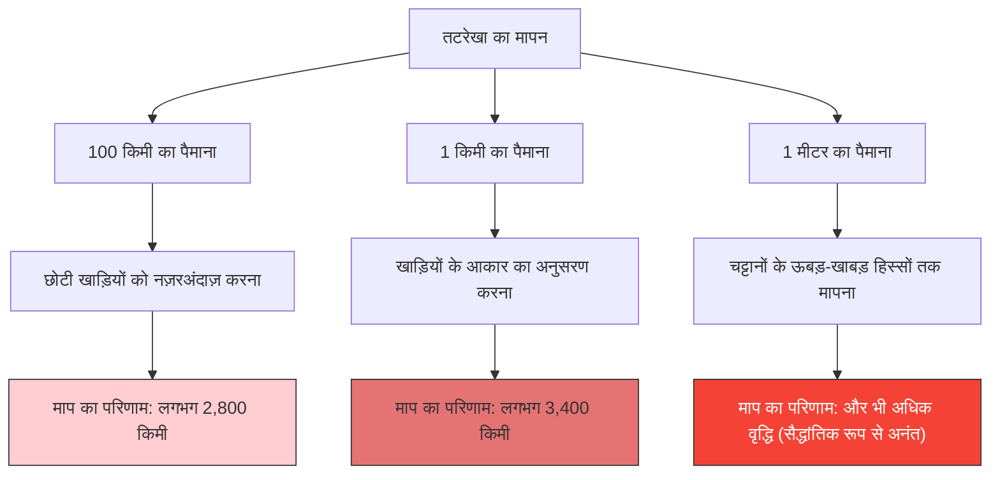

---
title: "ब्रिटेन की तटरेखा कितनी लंबी है?: तटरेखा का विरोधाभास"
description: "जितना छोटा पैमाना आप मापने के लिए इस्तेमाल करेंगे, तटरेखा उतनी ही लंबी होती जाएगी। यह एक प्रसिद्ध विरोधाभास है जिसने फ्रैक्टल ज्यामिति के द्वार खोले।"
date: 2026-09-10T21:00:00+09:00
draft: false
slug: "coastline-paradox"
image: "img/coastline_paradox.jpg"
math: true
mermaid: true
categories: ["गणितीय विरोधाभास", "ज्यामिति"]
tags: ["विरोधाभास", "फ्रैक्टल", "मैंडलब्रॉट", "अनंत"]
---

ब्रिटेन की तटरेखा की लंबाई आखिर कितने किलोमीटर है?
आपको लग सकता है कि अगर आप किसी विश्वकोश या भूगोल की पाठ्यपुस्तक में देखेंगे तो आपको इसका जवाब मिल जाएगा। लेकिन, असलियत में एक अजीब तथ्य यह है कि **"आप इसे कैसे मापते हैं, इस पर निर्भर करते हुए इसका उत्तर बदल जाता है, और सैद्धांतिक रूप से यह अनंत हो जाता है।"**

यही **तटरेखा का विरोधाभास (Coastline Paradox)** है। इसी खोज ने बाद में "फ्रैक्टल ज्यामिति" नामक गणित के एक बिल्कुल नए क्षेत्र को जन्म दिया।

## पैमाना जितना छोटा होगा, दूरी उतनी ही बढ़ेगी

तटरेखा कोई सीधी रेखा नहीं होती, बल्कि यह अनगिनत खाड़ियों, अंतरीपों और चट्टानी सतहों के ऊबड़-खाबड़ हिस्सों से बनी होती है।

मान लीजिए कि आप ब्रिटेन की तटरेखा को 100 किमी लंबे एक विशाल पैमाने (सीधी रेखा) से मापते हैं। इस पैमाने के साथ, 100 किमी से छोटी छोटी खाड़ियाँ और प्रायद्वीपों के टेढ़े-मेढ़े हिस्से नज़रअंदाज़ हो जाएंगे, और उन्हें दरकिनार कर दिया जाएगा।

अब, चलिए 1 किमी लंबे पैमाने से फिर से मापते हैं। तब, आप उन छोटी खाड़ियों और अंतरीपों के किनारों के साथ माप रहे होंगे जिन्हें पहले नज़रअंदाज़ कर दिया गया था, इसलिए कुल लंबाई निश्चित रूप से लंबी हो जाएगी।

इसके अलावा, क्या होगा अगर आप 1 मीटर लंबे पैमाने से हर एक चट्टान के ऊबड़-खाबड़ हिस्सों को मापें, 1 सेंटीमीटर लंबे पैमाने से कंकड़ की सतह को मापें, और 1 मिलीमीटर लंबे पैमाने से रेत के कणों की रूपरेखा को मापें?

लुईस फ्राई रिचर्डसन ने 1951 में अनुभवजन्य रूप से इस घटना की खोज की थी। जैसे-जैसे माप की इकाई (पैमाने की लंबाई) छोटी होती जाती है, मापी जाने वाली तटरेखा की लंबाई असीम रूप से बढ़ती जाती है।

## फ्रैक्टल आयाम: 1-आयाम और 2-आयाम के बीच

गणितज्ञ बेनोइट मैंडलब्रॉट ने इस विरोधाभास का गणितीय स्पष्टीकरण दिया। 1967 में, उन्होंने विज्ञान (Science) पत्रिका में एक प्रसिद्ध पेपर प्रकाशित किया जिसका नाम था: "ब्रिटेन की तटरेखा कितनी लंबी है? सांख्यिकीय स्व-समानता और भिन्नात्मक आयाम (Statistical Self-Similarity and Fractional Dimension)"।

मैंडलब्रॉट ने बताया कि तटरेखाओं जैसी प्राकृतिक आकृतियों में **स्व-समानता (फ्रैक्टल)** होती है, जिसका अर्थ है कि "चाहे आप इसे कितना भी बड़ा (ज़ूम इन) कर लें, एक ही प्रकार की जटिल संरचना दिखाई देती है।"

यदि यह शुद्ध गणितीय सीधी रेखा (1-आयामी) होती, तो पैमाने को आधा करने पर भी लंबाई नहीं बदलती। हालांकि, तटरेखा इतनी टेढ़ी-मेढ़ी होती है कि यह 1-आयामी रेखा से कहीं अधिक जटिल होती है, लेकिन यह कोई 2-आयामी सतह भी नहीं है जिसमें क्षेत्रफल होता है।

मैंडलब्रॉट ने ऐसी आकृतियों की जटिलता को व्यक्त करने के लिए **"फ्रैक्टल आयाम (Hausdorff dimension)"** की अवधारणा पेश की।
ब्रिटेन की तटरेखा का फ्रैक्टल आयाम $D \approx 1.25$ अनुमानित है। दूसरे शब्दों में, ब्रिटेन की तटरेखा एक रहस्यमयी इकाई है जिसका आयाम "1-आयामी रेखा से अधिक और 2-आयामी सतह से कम" है।

यदि पैमाने की लंबाई $s$ है और मापी गई तटरेखा की लंबाई $L(s)$ है, तो फ्रैक्टल आयाम $D$ के साथ निम्नलिखित संबंध स्थापित होता है:

$$ L(s) \propto s^{1-D} $$

ब्रिटेन की तटरेखा के मामले में, चूंकि $D = 1.25$ है, इसलिए $1 - D = -0.25$ होगा।

$$ L(s) \propto s^{-0.25} $$

यह गणितीय रूप से दर्शाता है कि जैसे-जैसे पैमाने की लंबाई $s$, 0 के करीब पहुंचती है, माप का परिणाम $L(s)$ अनंत $\infty$ की ओर बढ़ता जाता है।

## अंतिम निष्कर्ष: लंबाई को परिभाषित नहीं किया जा सकता

"लंबाई" की जिस अवधारणा का हम हर रोज़ इस्तेमाल करते हैं, वह केवल चिकनी सीधी रेखाओं या वक्रों (curves) के लिए ही काम करती है। प्रकृति में मौजूद फ्रैक्टल आकृतियों (जैसे तटरेखाएँ, बादल, पर्वत श्रृंखलाएं, रक्त वाहिकाओं की शाखाएं आदि) के लिए "पूर्ण लंबाई" पूछना, वास्तव में गणितीय रूप से कोई अर्थ नहीं रखता।

"ब्रिटेन की तटरेखा कितनी लंबी है?"

इसका सही उत्तर है, "यह मापने वाले पैमाने की लंबाई पर निर्भर करता है," और सैद्धांतिक रूप से यह "अनंत" है। यह तथ्य कि एक सीमित छोटी सी जगह के भीतर अनंत लंबाई छिपी हुई है, हमारी अंतरिक्ष की समझ के बारे में एक सुंदर विरोधाभास कहा जा सकता है。
