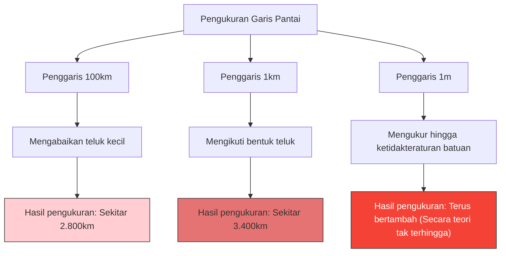

Berapa kilometerkah sebenarnya panjang garis pantai Inggris?
Anda mungkin berpikir bahwa jawabannya dapat ditemukan dengan memeriksa ensiklopedia atau buku teks geografi. Namun, kenyataannya ada fakta aneh bahwa **"jawabannya berubah tergantung pada cara pengukuran, dan secara teori menjadi tak terhingga"**.

Inilah **Paradoks Garis Pantai (Coastline Paradox)**. Penemuan ini kemudian menjadi pemicu lahirnya cabang matematika yang sama sekali baru, yaitu "geometri fraktal".

## Semakin Pendek Penggarisnya, Jaraknya Semakin Bertambah

Garis pantai bukanlah garis lurus, melainkan terdiri dari teluk, tanjung, dan ketidakteraturan permukaan berbatu yang tak terhitung jumlahnya.

Misalkan kita mengukur garis pantai Inggris dengan penggaris raksasa (garis lurus) sepanjang 100 km. Dengan penggaris ini, lekukan-lekukan kecil dari teluk dan semenanjung yang kurang dari 100 km akan diabaikan dan terpotong begitu saja.

Selanjutnya, mari kita ukur ulang dengan penggaris sepanjang 1 km. Dengan begitu, kita akan mengukur sepanjang kontur teluk dan tanjung kecil yang sebelumnya diabaikan, sehingga total panjangnya pasti akan meningkat.

Terlebih lagi, apa yang akan terjadi jika kita mengukur setiap ketidakteraturan batuan dengan penggaris sepanjang 1 m, mengukur permukaan kerikil dengan penggaris 1 cm, dan mengukur kontur butiran pasir dengan penggaris 1 mm?

Lewis Fry Richardson menemukan fenomena ini secara empiris pada tahun 1951. Seiring dengan semakin kecilnya satuan ukur (panjang penggaris), panjang garis pantai yang diukur akan bertambah tanpa batas.

## Dimensi Fraktal: Di Antara 1 Dimensi dan 2 Dimensi

Matematikawan Benoit Mandelbrot adalah orang yang memberikan penjelasan matematis terhadap paradoks ini. Pada tahun 1967, ia menerbitkan sebuah makalah terkenal di jurnal Science yang berjudul "Seberapa Panjang Garis Pantai Inggris? Kemiripan Diri dan Dimensi Fraktal".

Mandelbrot menunjukkan bahwa bentuk-bentuk di alam seperti garis pantai memiliki **kemiripan diri (fraktal)**, yaitu "struktur kompleks yang serupa akan muncul seberapa banyak pun kita memperbesarnya".

Jika itu adalah garis lurus matematika murni (1 dimensi), membagi dua penggaris tidak akan mengubah panjangnya. Namun, karena garis pantai sangat tidak beraturan, ia lebih kompleks daripada garis 1 dimensi, tetapi juga bukanlah bidang 2 dimensi yang memiliki luas.

Mandelbrot memperkenalkan konsep **"Dimensi Fraktal (Hausdorff dimension)"** untuk menyatakan kompleksitas bentuk-bentuk seperti ini.
Dimensi fraktal garis pantai Inggris diperkirakan sekitar $D \approx 1.25$. Dengan kata lain, garis pantai Inggris adalah entitas aneh yang "dimensinya lebih tinggi dari garis 1 dimensi, dan lebih rendah dari bidang 2 dimensi".

Jika panjang penggaris adalah $s$, dan panjang garis pantai yang diukur adalah $L(s)$, maka terdapat hubungan dengan dimensi fraktal $D$ sebagai berikut:

$$ L(s) \propto s^{1-D} $$

Dalam kasus garis pantai Inggris, karena $D = 1.25$, maka $1 - D = -0.25$.
$$ L(s) \propto s^{-0.25} $$
Ini menunjukkan secara matematis bahwa saat panjang penggaris $s$ mendekati 0, hasil pengukuran $L(s)$ akan divergen menuju tak terhingga $\infty$.

## Kesimpulan Utama: Panjang Tidak Dapat Didefinisikan

Konsep "panjang" yang kita gunakan sehari-hari hanya berlaku untuk garis atau kurva yang mulus. Untuk bentuk fraktal yang ada di alam (garis pantai, awan, pegunungan, percabangan pembuluh darah, dll.), menanyakan "panjang absolut" pada dasarnya tidak memiliki makna secara matematis.

"Seberapa panjang garis pantai Inggris?"
Jawaban yang benar untuk pertanyaan ini adalah, "Tergantung pada panjang penggaris yang digunakan untuk mengukur", dan secara teori adalah "tak terhingga". Fakta bahwa panjang yang tak terhingga terlipat di dalam ruang kecil yang terbatas dapat dikatakan sebagai paradoks yang indah terhadap persepsi ruang kita.
