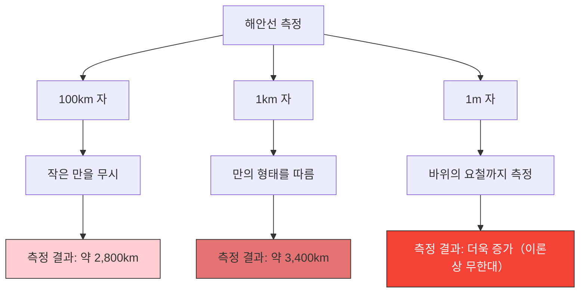

영국의 해안선 길이는 도대체 몇 km일까요?
백과사전이나 지리 교과서를 찾아보면 정답이 나와 있을 것이라고 생각할지도 모릅니다. 하지만 현실에는 **"측정 방법에 따라 답이 달라지며, 이론상으로는 무한대가 된다"**는 기묘한 사실이 존재합니다.

이것이 **해안선 역설(Coastline Paradox)**입니다. 이 발견은 훗날 '프랙탈 기하학'이라는 전혀 새로운 수학 분야를 탄생시키는 계기가 되었습니다.

## 자가 짧아질수록 길이는 늘어난다

해안선은 곧은 직선이 아니라, 무수히 많은 만과 곶, 바위 표면의 요철로 이루어져 있습니다.

만약 길이가 100km인 거대한 자(직선)로 영국의 해안선을 측정했다고 가정해 봅시다. 이 자로는 100km 미만의 작은 만이나 반도의 구불구불한 부분은 무시되고 직선으로 가로질러 측정이 됩니다.

다음으로, 길이가 1km인 자로 다시 측정해 봅시다. 그러면 앞서 무시되었던 작은 만과 곶의 윤곽을 따라 측정하게 되므로 총 길이는 확실히 길어집니다.

더 나아가 길이가 1m인 자로 바위 하나하나의 요철을 측정하고, 1cm인 자로 조약돌의 표면을 측정하며, 1mm인 자로 모래알의 윤곽을 측정해 나간다면 어떻게 될까요?

루이스 프라이 리처드슨은 1951년에 이 현상을 실증적으로 발견했습니다. 측정 단위(자의 길이)가 작아질수록 측정되는 해안선의 길이는 끝없이 증가하게 됩니다.

## 프랙탈 차원: 1차원과 2차원 사이

이 역설에 수학적 설명을 제시한 사람이 바로 수학자 브누아 만델브로입니다. 그는 1967년 사이언스지에 "영국의 해안선은 얼마나 긴가? 자기 유사성과 프랙탈 차원"이라는 유명한 논문을 발표했습니다.

만델브로는 해안선과 같은 자연계의 형태가 "아무리 확대해도 비슷한 복잡한 구조가 나타난다"는 **자기 유사성(프랙탈)**을 가지고 있다고 지적했습니다.

순수한 수학적 직선(1차원)이라면 자를 반으로 줄여도 길이는 변하지 않습니다. 하지만 해안선은 너무나도 구불구불하기 때문에 1차원의 선보다는 복잡하고, 그렇다고 면적을 가지는 2차원의 면도 아닙니다.

만델브로는 이러한 도형의 복잡성을 나타내기 위해 **'프랙탈 차원(Hausdorff dimension)'**이라는 개념을 도입했습니다.
영국 해안선의 프랙탈 차원은 $D \approx 1.25$ 로 추정됩니다. 즉, 영국의 해안선은 "1차원의 선보다는 차원이 높고, 2차원의 면보다는 차원이 낮은" 신기한 존재인 것입니다.

자의 길이를 $s$, 측정되는 해안선의 길이를 $L(s)$ 라고 하면, 프랙탈 차원 $D$ 와의 사이에는 다음과 같은 관계가 성립합니다.

$$ L(s) \propto s^{1-D} $$

영국 해안선의 경우 $D = 1.25$ 이므로, $1 - D = -0.25$ 가 됩니다.
$$ L(s) \propto s^{-0.25} $$
이는 자의 길이 $s$ 가 0에 가까워질수록 측정 결과 $L(s)$ 가 무한대 $\infty$ 로 발산한다는 것을 수학적으로 보여줍니다.

## 궁극적인 결론: 길이는 정의할 수 없다

우리가 일상적으로 사용하는 '길이'라는 개념은 매끄러운 직선이나 곡선에 대해서만 기능하는 것입니다. 자연계에 존재하는 프랙탈 도형(해안선, 구름, 산맥, 혈관의 분기 등)에 대해 '절대적인 길이'를 묻는 단어 자체가 사실 수학적으로는 아무런 의미가 없습니다.

"영국의 해안선 길이는 얼마나 될까?"
그 올바른 대답은 "측정하는 자의 길이에 의존한다"이며, 이론상으로는 "무한대"입니다. 제한된 작은 공간 안에 무한한 길이가 접혀 있다는 사실은 우리의 공간 인식에 대한 아름다운 역설이라고 할 수 있을 것입니다.
