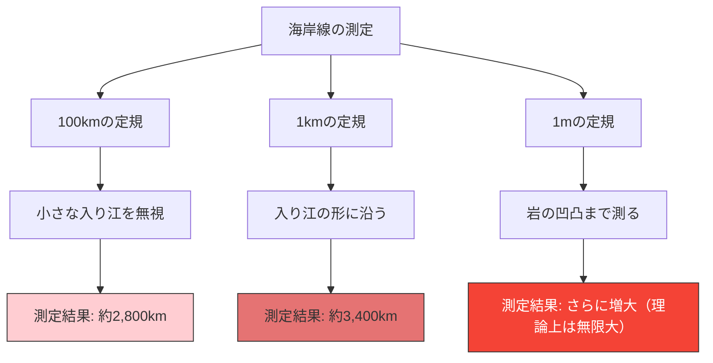

イギリスの海岸線の長さは、いったい何kmでしょうか？
百科事典や地理の教科書を調べれば、答えが載っていると思うかもしれません。しかし、現実には**「測り方によって答えが変わり、理論上は無限大になる」**という奇妙な事実が存在します。

これが**海岸線のパラドックス（Coastline Paradox）**です。この発見は、後に「フラクタル幾何学」という全く新しい数学の分野を生み出すきっかけとなりました。

## 定規が短くなるほど、距離は伸びる

海岸線は、まっすぐな直線ではなく、無数の入り江や岬、岩肌の凹凸で構成されています。

もし長さ100kmの巨大な定規（直線）でイギリスの海岸線を測ったとします。この定規では、100km未満の小さな入り江や半島のギザギザは無視され、ショートカットされてしまいます。

次に、長さ1kmの定規で測り直してみましょう。すると、先ほどは無視されていた小さな湾や岬の輪郭に沿って測ることになるため、総延長は確実に長くなります。

さらに、長さ1mの定規で岩の一つ一つの凹凸を測り、長さ1cmの定規で石ころの表面を測り、長さ1mmの定規で砂粒の輪郭を測っていったらどうなるでしょうか？

ルイス・フライ・リチャードソンは1951年にこの現象を実証的に発見しました。測定単位（定規の長さ）が小さくなるにつれて、測定される海岸線の長さは果てしなく増加していくのです。

## フラクタル次元：1次元と2次元の間

このパラドックスに数学的な説明を与えたのが、数学者ブノワ・マンデルブロです。彼は1967年にサイエンス誌に「イギリスの海岸線の長さはどれくらいか？自己相似性とフラクタル次元」という有名な論文を発表しました。

マンデルブロは、海岸線のような自然界の形は「どんなに拡大しても同じような複雑な構造が現れる」という**自己相似性（フラクタル）**を持っていると指摘しました。

純粋な数学の直線（1次元）であれば、定規を半分にしても長さは変わりません。しかし、海岸線はあまりにもギザギザしているため、1次元の線よりも複雑で、かといって面積を持つ2次元の面でもありません。

マンデルブロは、このような図形の複雑さを表すために**「フラクタル次元（Hausdorff dimension）」**という概念を導入しました。
イギリスの海岸線のフラクタル次元は $D \approx 1.25$ と推定されています。つまり、イギリスの海岸線は「1次元の線よりは次元が高く、2次元の面よりは次元が低い」不思議な存在なのです。

定規の長さを $s$、測定される海岸線の長さを $L(s)$ とすると、フラクタル次元 $D$ との間には次のような関係が成り立ちます。

$$ L(s) \propto s^{1-D} $$

イギリスの海岸線の場合 $D = 1.25$ なので、$1 - D = -0.25$ となります。
$$ L(s) \propto s^{-0.25} $$
これは、定規の長さ $s$ が 0 に近づくにつれて、測定結果 $L(s)$ が無限大 $\infty$ に発散することを数学的に示しています。

## 究極の結論：長さは定義できない

私たちが日常的に使っている「長さ」という概念は、滑らかな直線や曲線に対してのみ機能するものです。自然界に存在するフラクタルな図形（海岸線、雲、山脈、血管の分岐など）に対して、「絶対的な長さ」を尋ねること自体が、実は数学的に意味をなさないのです。

「イギリスの海岸線はどれくらい長いか？」
その正しい答えは、「測る定規の長さに依存する」であり、理論上は「無限大」なのです。限られた小さな空間の中に、無限の長さが折りたたまれているという事実は、私たちの空間認識に対する美しいパラドックスと言えるでしょう。
