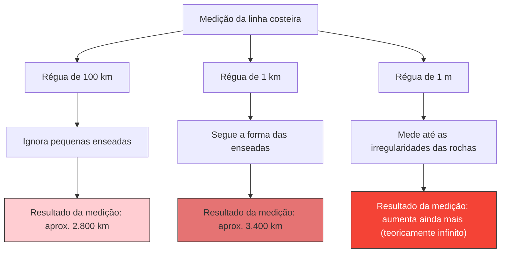

---
title: "Qual é o comprimento da costa da Grã-Bretanha?: O Paradoxo da Linha Costeira"
description: "Quanto menor a régua que você usa para medir, infinitamente mais longa a linha costeira se torna. É o famoso paradoxo que abriu as portas para a geometria fractal."
date: 2026-09-10T21:00:00+09:00
draft: false
slug: "coastline-paradox"
image: "img/coastline_paradox.jpg"
math: true
mermaid: true
categories: ["Paradoxos Matemáticos", "Geometria"]
tags: ["Paradoxo", "Fractal", "Mandelbrot", "Infinito"]
---

Qual é exatamente o comprimento da costa da Grã-Bretanha em quilômetros?
Você pode pensar que se procurar em uma enciclopédia ou livro de geografia, encontrará a resposta. No entanto, na realidade, existe um fato bizarro de que **"a resposta muda dependendo de como você a mede, e teoricamente se torna infinita"**.

Este é o **Paradoxo da Linha Costeira (Coastline Paradox)**. Essa descoberta posteriormente serviu como catalisador para a criação de um campo da matemática inteiramente novo chamado "geometria fractal".

## Quanto mais curta a régua, maior a distância

Uma linha costeira não é uma linha reta, mas é composta por inúmeras enseadas, penínsulas e irregularidades rochosas.

Suponha que medimos a costa da Grã-Bretanha com uma régua gigantesca (reta) de 100 km de comprimento. Com esta régua, as pequenas enseadas e os recortes das penínsulas com menos de 100 km são ignorados e cortados por atalhos.

Em seguida, vamos medir novamente com uma régua de 1 km de comprimento. Então, como você estará medindo ao longo dos contornos das pequenas baías e cabos que foram ignorados anteriormente, o comprimento total certamente será maior.

Além disso, o que aconteceria se medíssemos cada irregularidade das rochas com uma régua de 1 m de comprimento, a superfície dos seixos com uma régua de 1 cm, e o contorno dos grãos de areia com uma régua de 1 mm?

Lewis Fry Richardson descobriu esse fenômeno empiricamente em 1951. À medida que a unidade de medida (o comprimento da régua) se torna menor, o comprimento medido da linha costeira aumenta infinitamente.

## Dimensão Fractal: Entre 1D e 2D

Foi o matemático Benoît Mandelbrot quem deu uma explicação matemática a este paradoxo. Em 1967, ele publicou um artigo famoso na revista Science intitulado "How Long Is the Coast of Britain? Statistical Self-Similarity and Fractional Dimension".

Mandelbrot apontou que formas no mundo natural, como linhas costeiras, possuem **autossimilaridade (fractal)**, o que significa que "não importa o quanto você as amplie, estruturas complexas semelhantes aparecem".

Se fosse uma reta matemática pura (1 dimensão), o comprimento não mudaria mesmo se você reduzisse a régua pela metade. No entanto, porque uma linha costeira é tão recortada, é mais complexa do que uma linha unidimensional, mas também não é uma superfície bidimensional que tem área.

Mandelbrot introduziu o conceito de **"dimensão fractal (dimensão de Hausdorff)"** para representar a complexidade de tais formas.
Estima-se que a dimensão fractal da costa da Grã-Bretanha seja $D \approx 1.25$. Em outras palavras, a costa da Grã-Bretanha é uma existência misteriosa que tem "uma dimensão superior a uma linha unidimensional e inferior a uma superfície bidimensional".

Assumindo o comprimento da régua como $s$ e o comprimento medido da linha costeira como $L(s)$, a seguinte relação se estabelece com a dimensão fractal $D$:

$$ L(s) \propto s^{1-D} $$

No caso da costa da Grã-Bretanha, já que $D = 1.25$, então $1 - D = -0.25$.
$$ L(s) \propto s^{-0.25} $$
Isso demonstra matematicamente que à medida que o comprimento da régua $s$ se aproxima de 0, o resultado da medição $L(s)$ diverge para o infinito $\infty$.

## A Conclusão Final: O comprimento não pode ser definido

O conceito de "comprimento" que usamos diariamente só funciona para retas ou curvas suaves. Para formas fractais existentes no mundo natural (linhas costeiras, nuvens, cadeias de montanhas, ramificações de vasos sanguíneos, etc.), perguntar o seu "comprimento absoluto" na verdade não faz sentido matematicamente.

"Qual é o comprimento da costa da Grã-Bretanha?"
A resposta correta é "depende do comprimento da régua usada para medi-la", e teoricamente é "infinito". O fato de que um comprimento infinito é dobrado dentro de um espaço pequeno e limitado pode ser considerado um belo paradoxo em nossa percepção do espaço.
