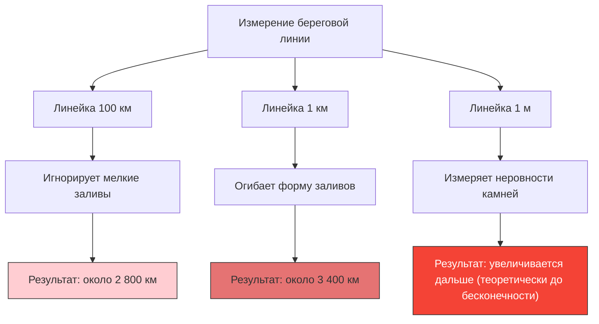

---
title: "Какой длины береговая линия Великобритании?: Парадокс береговой линии"
description: "Чем короче линейка для измерения, тем длиннее становится береговая линия, стремясь к бесконечности. Это знаменитый парадокс, открывший дверь во фрактальную геометрию."
date: 2026-09-10T21:00:00+09:00
draft: false
slug: "coastline-paradox"
image: "img/coastline_paradox.jpg"
math: true
mermaid: true
categories: ["Математический парадокс", "Геометрия"]
tags: ["Парадокс", "Фрактал", "Мандельброт", "Бесконечность"]
---

Какой именно длины береговая линия Великобритании в километрах?
Вы можете подумать, что найдете ответ, заглянув в энциклопедию или учебник по географии. Однако в реальности существует странный факт: **«ответ меняется в зависимости от способа измерения, и теоретически он равен бесконечности»**.

Это и есть **Парадокс береговой линии (Coastline Paradox)**. Это открытие позже послужило толчком к созданию совершенно новой области математики под названием «фрактальная геометрия».

## Чем короче линейка, тем больше расстояние

Береговая линия — это не прямая линия, она состоит из бесчисленных заливов, мысов и неровностей скалистых берегов.

Предположим, мы измеряем береговую линию Великобритании с помощью гигантской линейки (прямой) длиной 100 км. При использовании такой линейки небольшие заливы и зигзаги полуостровов размером менее 100 км будут проигнорированы и «срезаны».

Теперь давайте перемеряем её с помощью линейки длиной 1 км. При этом мы будем следовать контурам небольших заливов и мысов, которые ранее были проигнорированы, поэтому общая длина определенно станет больше.

Что же произойдет, если мы будем измерять каждую неровность камня линейкой в 1 м, поверхность гальки линейкой в 1 см, а контур песчинки линейкой в 1 мм?

Льюис Фрай Ричардсон эмпирически обнаружил это явление в 1951 году. По мере уменьшения единицы измерения (длины линейки) измеряемая длина береговой линии бесконечно увеличивается.

## Фрактальная размерность: между 1 и 2 измерениями

Математическое объяснение этому парадоксу дал математик Бенуа Мандельброт. В 1967 году он опубликовал в журнале Science знаменитую статью под названием «Какой длины побережье Великобритании? Статистическое самоподобие и дробная размерность».

Мандельброт отметил, что природные формы, такие как береговые линии, обладают **самоподобием (фрактальностью)**, когда «независимо от того, насколько сильно вы их увеличиваете, появляются схожие сложные структуры».

В случае чистой математической прямой линии (1 измерение), даже если вы уменьшите линейку вдвое, длина не изменится. Однако из-за того, что береговая линия настолько зубчатая, она сложнее, чем одномерная линия, но в то же время она не является двумерной поверхностью, имеющей площадь.

Чтобы выразить сложность таких фигур, Мандельброт ввел понятие **«фрактальной размерности (размерности Хаусдорфа)»**.
Фрактальная размерность береговой линии Великобритании оценивается как $D \approx 1.25$. Иными словами, береговая линия Великобритании — это загадочная сущность, «размерность которой выше одномерной линии, но ниже двумерной плоскости».

Если мы обозначим длину линейки как $s$, а измеряемую длину береговой линии как $L(s)$, то между ними и фрактальной размерностью $D$ существует следующее соотношение:

$$ L(s) \propto s^{1-D} $$

В случае береговой линии Великобритании $D = 1.25$, поэтому $1 - D = -0.25$.
$$ L(s) \propto s^{-0.25} $$
Это математически показывает, что по мере того как длина линейки $s$ приближается к 0, результат измерения $L(s)$ стремится к бесконечности $\infty$.

## Окончательный вывод: длина не может быть определена

Понятие «длины», которое мы используем в повседневной жизни, применимо только к гладким прямым или кривым линиям. Поиск «абсолютной длины» для существующих в природе фрактальных форм (береговые линии, облака, горные цепи, разветвления кровеносных сосудов и т. д.) на самом деле не имеет математического смысла.

«Какой длины береговая линия Великобритании?»
Правильный ответ: «Зависит от длины линейки, которой измеряют», и теоретически она «бесконечна». Тот факт, что в ограниченном небольшом пространстве скрыта бесконечная длина, является поистине прекрасным парадоксом для нашего восприятия пространства.
