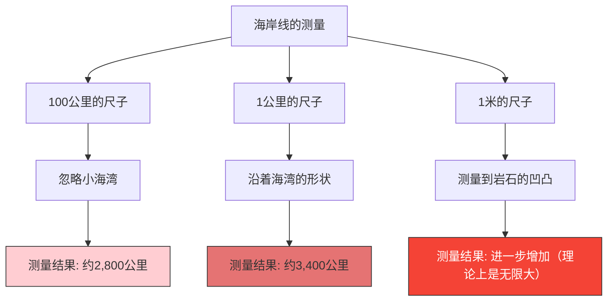

英国的海岸线到底有多少公里长？
你可能觉得查阅百科全书或地理教科书就能找到答案。然而，现实中存在着一个奇妙的事实：**“答案会根据测量方式而改变，理论上是无限大的”**。

这就是**海岸线悖论（Coastline Paradox）**。这一发现后来成为了催生出“分形几何学”这一全新数学领域的契机。

## 尺子越短，距离越长

海岸线并不是笔直的直线，而是由无数个海湾、海角和岩石表面的凹凸不平所组成的。

假设我们用一把长100公里的巨大的尺子（直线）来测量英国的海岸线。使用这把尺子，小于100公里的细小海湾和半岛的锯齿状边缘将被忽略，并被抄近路直接跳过。

接下来，我们用一把长1公里的尺子重新测量。这时，测量将沿着刚才被忽略的小海湾和海角的轮廓进行，因此总长度肯定会增加。

如果进一步用1米长的尺子测量每一块岩石的凹凸，用1厘米长的尺子测量石子的表面，甚至用1毫米长的尺子测量沙粒的轮廓，结果会怎样呢？

路易斯·弗莱·理查森在1951年通过实证发现了这一现象。随着测量单位（尺子的长度）变得越来越小，测量出来的海岸线长度将会无止境地增加。

## 分形维度：介于一维与二维之间

给这个悖论提供数学解释的是数学家本华·曼德博。1967年，他在《科学》杂志上发表了一篇著名的论文，名为《英国的海岸线有多长？自相似性与分形维度》。

曼德博指出，像海岸线这种自然界的形状，具有**自相似性（分形）**，也就是说，“无论怎么放大，都会出现相似的复杂结构”。

如果是纯粹的数学直线（一维），即使把尺子折半，长度也不会改变。但是，由于海岸线过于锯齿状，它比一维的线更复杂，但又不是拥有面积的二维的面。

曼德博为了表达这种图形的复杂性，引入了**“分形维度（Hausdorff dimension）”**这一概念。
英国海岸线的分形维度估计约为 $D \approx 1.25$。也就是说，英国海岸线是一个“维度高于一维的线，低于二维的面”的不可思议的存在。

假设尺子的长度为 $s$，测量出的海岸线长度为 $L(s)$，那么它与分形维度 $D$ 之间存在如下关系：

$$ L(s) \propto s^{1-D} $$

就英国的海岸线而言，因为 $D = 1.25$，所以 $1 - D = -0.25$。
$$ L(s) \propto s^{-0.25} $$
这在数学上表明，随着尺子的长度 $s$ 接近 0，测量结果 $L(s)$ 将发散至无限大 $\infty$。

## 终极结论：长度无法定义

我们日常生活中使用的“长度”这一概念，只对平滑的直线或曲线起作用。对于自然界中存在的分形图形（海岸线、云朵、山脉、血管的分支等），探究其“绝对长度”本身，在数学上其实是毫无意义的。

“英国的海岸线有多长？”
其正确答案是：“取决于测量所用尺子的长度”，并且在理论上是“无限大”的。在有限的狭小空间中折叠着无限的长度，这一事实可以说是对于我们空间认知的一个美丽悖论。
