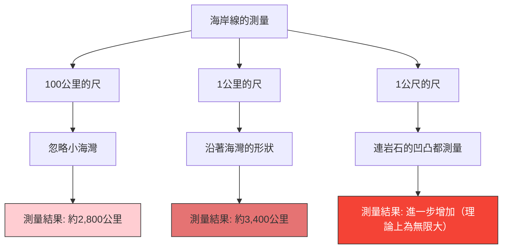

英國的海岸線長度，究竟有多少公里呢？
你或許會覺得，只要查閱百科全書或地理教科書就能找到答案。然而，現實中存在著一個奇妙的事實：**「答案會根據測量方式而改變，理論上甚至是無限大」**。

這就是**海岸線悖論（Coastline Paradox）**。這個發現後來促成了「碎形幾何學」這個全新數學領域的誕生。

## 尺越短，距離越長

海岸線並不是筆直的直線，而是由無數的海灣、海角以及岩石表面的凹凸不平所組成的。

如果我們用一把長達 100 公里的巨大尺（直線）來測量英國的海岸線，這把尺會忽略那些小於 100 公里的小海灣和半島的鋸齒狀邊緣，直接抄捷徑。

接著，我們試著改用 1 公里長的尺重新測量。如此一來，就會沿著剛才被忽略的小海灣和海角的輪廓進行測量，因此總長度必定會增加。

如果進一步用 1 公尺長的尺去測量每一塊岩石的凹凸，用 1 公分長的尺去測量石頭表面的起伏，再用 1 毫米長的尺去測量沙粒的輪廓，結果又會如何呢？

路易斯·弗萊·理查森（Lewis Fry Richardson）在 1951 年從實證中發現了這個現象。隨著測量單位（尺的長度）變小，測量出的海岸線長度將會無止盡地增加。

## 碎形維度：介於一維與二維之間

為這個悖論提供數學解釋的，是數學家本華·曼德博（Benoît Mandelbrot）。他在 1967 年於《科學》雜誌上發表了一篇著名的論文，題為〈英國的海岸線有多長？自我相似性與碎形維度〉。

曼德博指出，像海岸線這種自然界的形狀，具有**自我相似性（碎形）**的特徵，亦即「無論放大多少倍，都會呈現出相似的複雜結構」。

如果是純數學上的直線（一維），即使把尺縮短一半，長度也不會改變。然而，因為海岸線過於參差不齊，其複雜度超過了一維的線，但又不是具有面積的二維平面。

為了表示這種圖形的複雜程度，曼德博引入了**「碎形維度（Hausdorff dimension）」**的概念。
英國海岸線的碎形維度估計約為 $D \approx 1.25$。換句話說，英國的海岸線是一個「維度高於一維的線，但低於二維的面」的奇妙存在。

假設尺的長度為 $s$，測量出的海岸線長度為 $L(s)$，那麼它與碎形維度 $D$ 之間存在以下關係：

$$ L(s) \propto s^{1-D} $$

就英國海岸線而言，$D = 1.25$，因此 $1 - D = -0.25$。
$$ L(s) \propto s^{-0.25} $$
這在數學上表明了，當尺的長度 $s$ 趨近於 0 時，測量結果 $L(s)$ 會發散至無限大 $\infty$。

## 終極結論：長度是無法定義的

我們日常使用的「長度」概念，僅適用於平滑的直線或曲線。對於自然界中存在的碎形圖形（如海岸線、雲朵、山脈、血管分支等）去尋求「絕對的長度」，在數學上其實是毫無意義的。

「英國的海岸線有多長？」
其正確答案是「取決於測量尺的長度」，而在理論上則是「無限大」。在有限的狹小空間裡，卻摺疊著無限的長度，這個事實可以說是我們對於空間認知的一個美麗悖論。
