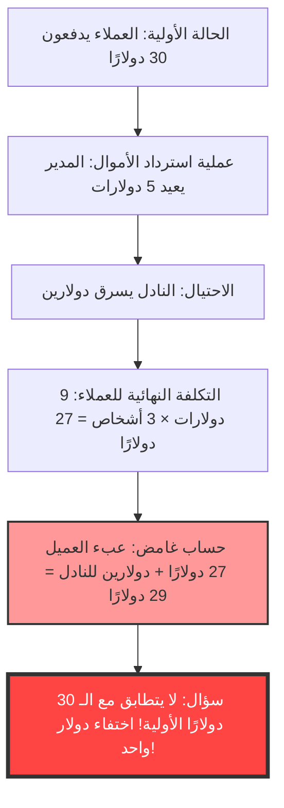
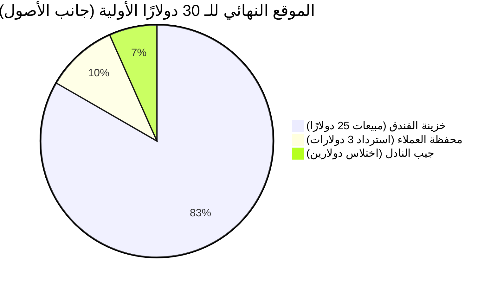

## 1. مقدمة: لماذا ننخدع بعملية جمع بسيطة؟

يوجد في عالمنا مسائل غريبة قادرة على إحداث خلل كامل في عقول البشر باستخدام "الجمع" و"الطرح" على مستوى المدرسة الابتدائية فقط، دون الحاجة إلى استخدام حساب التفاضل والتكامل المتقدم أو الطوبولوجيا المعقدة. ومن بين هذه المسائل، الأشهر عالميًا والتي حيرت الكثيرين هي **"لغز الدولار المفقود (The Missing Dollar Riddle)"**.

للوهلة الأولى، يبدو الأمر وكأنه مشهد يومي عادي، قصة عن مشكلة حسابية في مطعم. ومع ذلك، بمجرد تتبع الحسابات قليلًا، يختفي "دولار واحد" من العالم فجأة.

في هذا المقال، سنتناول هذه المفارقة الرياضية الشهيرة (أو بالأحرى، المسألة المخادعة التي تشبه المفارقة)، وسنقوم بتحليل شامل لسبب انخداع حدسنا ومكان الفخ المنطقي من ثلاثة مناظير: الرياضيات، وعلم النفس المعرفي، ومسك الدفاتر المزدوج (المحاسبة).

---

## 2. طرح المشكلة: لغز الدولار المفقود

أولاً، يرجى قراءة القصة التالية. وإذا كان لديك ورقة وقلم، فحاول تتبع الحسابات معًا.

> [!QUESTION] لغز الدولار المفقود (القصة)
> في أحد الأيام، وصل 3 مسافرين إلى فندق صغير.
> أخبرهم موظف الاستقبال: "غرفة لثلاثة أشخاص تكلف إجمالاً 30 دولارًا لليلة الواحدة".
> أخرج كل من المسافرين الثلاثة 10 دولارات من محفظته، ودفعوا إجمالي 30 دولارًا لموظف الاستقبال وتوجهوا إلى غرفتهم.
> 
> بعد فترة، جاء مدير الفندق وقال لموظف الاستقبال:
> "اليوم لدينا عرض ترويجي، لذا تكلفة تلك الغرفة هي 25 دولارًا فقط. اذهب وأعد لهم 5 دولارات فورًا".
> 
> أخذ موظف الاستقبال ورقة نقدية بقيمة 5 دولارات وتوجه إلى غرفة العملاء. لكنه فكر في طريقه:
> "من الصعب تقسيم 5 دولارات بالتساوي على 3 أشخاص. سأحتفظ بدولارين لنفسي سرًا، وأعيد لهم 3 دولارات، وبذلك يحصل كل شخص على دولار واحد وتتطابق الحسابات تمامًا".
> 
> لذلك، خبأ موظف الاستقبال دولارين في جيبه، وكذب على المسافرين قائلاً: "بسبب العرض الترويجي، تم استرداد 3 دولارات"، وأعاد لكل منهم دولارًا واحدًا.
> 
> **الآن، هنا تكمن المشكلة.**
> 
> 1. دفع المسافرون في البداية 10 دولارات لكل منهم، ثم استردوا دولارًا واحدًا لاحقًا، لذا فإن المبلغ الذي دفعوه فعليًا هو **10 دولارات - دولار واحد = 9 دولارات**.
> 2. إجمالي المبلغ الذي دفعه المسافرون الثلاثة هو **9 دولارات × 3 أشخاص = 27 دولارًا**.
> 3. من ناحية أخرى، يوجد في جيب موظف الاستقبال **دولاران** اختلسهما سرًا.
> 4. إذا جمعنا الـ **27 دولارًا** التي دفعها المسافرون مع الـ **دولارين** اللذين يمتلكهما موظف الاستقبال، يصبح المجموع **27 + 2 = 29 دولارًا**.
> 
> في البداية، دفع المسافرون بالتأكيد "30 دولارًا".
> ولكن، بناءً على الحسابات الحالية، لا يوجد سوى "29 دولارًا".
> 
> **أين ذهب الدولار المتبقي؟**

ما رأيك؟
كلما قرأت أكثر، قد يرتبك عقلك قائلاً: "بالتأكيد ينقص دولار واحد!". المعادلات الحسابية نفسها بسيطة للغاية ويمكن حتى لطالب في المدرسة الابتدائية فهمها: `9 × 3 = 27` و `27 + 2 = 29`. ومع ذلك، لسبب ما، لا تتطابق مع الـ 30 دولارًا الأولية.

في الفصول التالية، دعونا نكشف عن سر هذه الظاهرة الغريبة.

---

## 3. الفجوة بين الحدس والإجابة الصحيحة: لماذا يحدث خلل في الدماغ؟

عند سماع هذه المشكلة، تكون سلسلة التفكير التي يقع فيها الكثيرون كالتالي:

حقيقة هذه المفارقة تكمن في **خدعة لغوية (تأثير التأطير: Framing Effect)** بارعة تتمثل في "جمع أشياء لا ينبغي جمعها".

### جوهر المغالطة: الحساب الذي لا معنى له "27 + 2"
ألقِ نظرة فاحصة مرة أخرى على الجزء التالي في نهاية المشكلة:

> إذا جمعنا الـ **27 دولارًا** التي دفعها المسافرون مع الـ **دولارين** اللذين يمتلكهما موظف الاستقبال، يصبح المجموع **27 + 2 = 29 دولارًا**.

في الواقع، عملية الحساب "27 + 2" بحد ذاتها لا معنى لها منطقيًا على الإطلاق.
والسبب هو أن **"المبلغ النهائي الذي دفعه المسافرون (27 دولارًا)" يتضمن بالفعل "المبلغ الذي اختلسه موظف الاستقبال (دولاران)"**.

تفصيل الـ 27 دولارًا التي دفعها المسافرون هو كالتالي:
*   **المبلغ الموجود في خزينة الفندق**: 25 دولارًا
*   **المبلغ الذي اختلسه موظف الاستقبال**: دولاران
*   المجموع: 27 دولارًا

بمعنى آخر، إن إضافة دولارين لموظف الاستقبال إلى 27 دولارًا يعني أنك تقوم بـ **"الحساب المزدوج (Double Counting)"** لدولاري موظف الاستقبال.

إذا أردت مطابقة الحساب بشكل صحيح مع "الـ 30 دولارًا" الأولية، يجب عليك جمع "المبلغ الذي دفعه العملاء" و"المبلغ الذي عاد إلى العملاء".
*   المبلغ النهائي الذي دفعه العملاء: 27 دولارًا (25 دولارًا للخزينة + دولارين لموظف الاستقبال)
*   المبلغ الذي عاد إلى أيدي العملاء: 3 دولارات
*   المجموع: 27 + 3 = 30 دولارًا

بالحساب بهذه الطريقة، يتضح تمامًا أنه لم يختفِ أي دولار.

---

## 4. التوضيح الرياضي: إثبات صارم بالمعادلات

بالنسبة لأولئك الذين لا يقتنعون بالتفسيرات اللفظية وحدها، دعونا نثبت التدفق النقدي باستخدام معادلات رياضية دقيقة.

نحدد حركة الأموال الإجمالية بمتغيرات:

*   $ P_{initial} $ : إجمالي المبلغ الذي دفعه العملاء في البداية (30)
*   $ C_{hotel} $ : المبلغ الذي استلمه الفندق (المدير) في النهاية (25)
*   $ R_{total} $ : مبلغ الاسترداد الذي سلمه المدير لموظف الاستقبال (5)
*   $ R_{guest} $ : مبلغ الاسترداد الذي استلمه العملاء في النهاية (3)
*   $ S_{waiter} $ : المبلغ الذي اختلسه موظف الاستقبال (2)

من التدفق النقدي الأولي، نحصل على المعادلة التالية:
$$ P_{initial} = C_{hotel} + R_{total} \quad \cdots (1) $$
(30 دولارًا = 25 دولارًا + 5 دولارات)

يتم تقسيم الـ 5 دولارات التي أعادها المدير بين أيدي العملاء وجيب موظف الاستقبال:
$$ R_{total} = R_{guest} + S_{waiter} \quad \cdots (2) $$
(5 دولارات = 3 دولارات + دولارين)

نعوض بالمعادلة (2) في المعادلة (1):
$$ P_{initial} = C_{hotel} + (R_{guest} + S_{waiter}) \quad \cdots (3) $$
(30 دولارًا = 25 دولارًا + 3 دولارات + دولارين)

هنا، نعرّف "المبلغ النهائي الذي دفعه العملاء" المذكور في المشكلة كـ $ P_{final} $. هذا هو المبلغ الأولي المدفوع ناقص المبلغ الذي عاد إلى أيدي العملاء.
$$ P_{final} = P_{initial} - R_{guest} \quad \cdots (4) $$
(27 دولارًا = 30 دولارًا - 3 دولارات)

دعونا ننقل $ R_{guest} $ إلى الجانب الأيسر من المعادلة (3):
$$ P_{initial} - R_{guest} = C_{hotel} + S_{waiter} \quad \cdots (5) $$

من المعادلة (4) والمعادلة (5)، يتم استنتاج الحقيقة التالية:
$$ P_{final} = C_{hotel} + S_{waiter} \quad \cdots (6) $$
(إجمالي المدفوعات النهائية للعملاء 27 دولارًا = مبيعات الفندق 25 دولارًا + سرقة موظف الاستقبال دولارين)

تكمن الحيلة في المشكلة في أنها **تحاول إضافة $ S_{waiter} $ (دولاران)، والذي من المفترض أن يكون مدرجًا في الجانب الأيمن، مرة أخرى إلى $ P_{final} $ (27 دولارًا) في الجانب الأيسر**.
أي أن المعادلة التي قادتنا إليها المشكلة تبدو كالتالي:
$$ P_{final} + S_{waiter} = (C_{hotel} + S_{waiter}) + S_{waiter} $$
$$ 27 + 2 = (25 + 2) + 2 = 29 $$

هذا الرقم "29" هو ببساطة "مبيعات الفندق + سرقة موظف الاستقبال × 2"، وهو رقم وهمي ليس له أي معنى فيزيائي أو اقتصادي. هذه هي الحقيقة الرياضية للوهم الذي يجعل الأمر يبدو وكأن "دولارًا واحدًا قد اختفى".

---

## 5. منظور المحاسبة: تحطيم المفارقة بمسك الدفاتر المزدوج

بالنسبة لأولئك الذين لا يزالون غير مقتنعين (أو يشعرون بضبابية بديهية) حتى باستخدام المعادلات الرياضية، يمكننا تصور هذا اللغز بشكل مثالي باستخدام مفهوم **"مسك الدفاتر المزدوج (Double-Entry Bookkeeping)"**، والذي تم استخدامه في عالم الأعمال لأكثر من 500 عام.

المبدأ الأساسي لمسك الدفاتر المزدوج هو أن "المدين (Debit)" و"الدائن (Credit)" يجب أن يتطابقا دائمًا. دعونا نستخدم هذا لعمل قيد يومية (Journal Entry) لحركة الأموال.

### المعاملة 1: العملاء يدفعون 30 دولارًا
هذه هي الحالة الأولية من منظور الفندق.

| المدين (زيادة الأصول) | الدائن (زيادة الالتزامات/حقوق الملكية) |
| :--- | :--- |
| النقدية (Cash): 30 دولارًا | الودائع (أو المبيعات): 30 دولارًا |

### المعاملة 2: المدير يسلم 5 دولارات لموظف الاستقبال، ويسجل 25 دولارًا كمبيعات
نظرًا لتغيير سعر الغرفة إلى 25 دولارًا، يتم إعطاء 5 دولارات لموظف الاستقبال لغرض "الاسترداد".

| المدين | الدائن |
| :--- | :--- |
| الودائع: 30 دولارًا | المبيعات (Sales): 25 دولارًا موظف الاستقبال (نقدية): 5 دولارات |

### المعاملة 3: تصرف موظف الاستقبال (استرداد 3 دولارات واختلاس دولارين)
هذا هو الجزء الأهم. سنسجل أين ذهبت الـ 5 دولارات النقدية التي يمتلكها موظف الاستقبال.

| المدين | الدائن |
| :--- | :--- |
| استرداد للعملاء: 3 دولارات خسارة اختلاس (Loss): دولارين | موظف الاستقبال (نقدية): 5 دولارات |

### الحالة المدمجة النهائية للميزانية العمومية (B/S) والأرباح والخسائر (P/L)
كنتيجة للعملية بأكملها، سنلخص أين يوجد النقد وتحت أي مسمى.

**【تأكيد الحالة النهائية】**
*   **مصدر الأموال (نفقات العملاء)**: 30 دولارًا
*   **موقع الأموال (النتيجة)**: 
    *   في خزينة الفندق 25 دولارًا
    *   في جيب النادل دولارين
    *   في أيدي العملاء 3 دولارات
    *   المجموع = 25 + 2 + 3 = 30 دولارًا

بالنظر إليها من خلال "مبدأ مطابقة الأرصدة (حسابات T)" في المحاسبة، فإن "المبلغ الذي دفعه العملاء البالغ 27 دولارًا (النفقات)" يمثل "نقصانًا في جانب الأصول"، وعملية إضافة "الدولارين اللذين سرقهما النادل (حركة في جانب الأصول)" إليه هي ببساطة **خطأ مستحيل يتمثل في "الخلط بين المدين والدائن وجمعهما"** في المعايير المحاسبية.
في عالم الأعمال، إذا أبلغ المحاسب الإدارة بحساب "27 + 2 = 29"، فهذا انهيار منطقي بمستوى قد يؤدي إلى طرده الفوري أو الاشتباه في تزويره للبيانات المالية.

---

## 6. منظور علم النفس المعرفي: لماذا نتقبل أن "27+2=29"؟

لماذا يتقبل الكثير من الناس لا شعوريًا وبقناعة صيغة حسابية خاطئة رياضيًا ومحاسبيًا؟ يرجع ذلك إلى **التحيزات المعرفية** القوية المدمجة في أدمغتنا.

### 1. خلل المحاسبة الذهنية (Mental Accounting)
اقترح الخبير الاقتصادي السلوكي ريتشارد ثالر (الحائز على جائزة نوبل في الاقتصاد) أن البشر يقومون دون وعي بـ "تصنيف الأموال (المحاسبة الذهنية)" في عقولهم.
في نهاية المشكلة، يتم تقديم "نفقات العميل (27 دولارًا)" و"المال الذي حصل عليه النادل (دولاران)" تحت نفس فئة "المال". يقوم الدماغ باقتطاع "أرقام المبالغ (27 و 2)" فقط، ويتجاهل اتجاه المتجه سواء كان "أموالاً مدفوعة (سالبة)" أو "أموالاً ممتلكة (موجبة)"، وينفذ عملية الجمع ببساطة.

### 2. تأثير التأطير (Framing Effect)
إنه تأثير حيث تتغير قرارات وأحكام الناس اعتمادًا على كيفية تقديم المعلومات.
الجزء الماكر في المشكلة هو **"تحديد الرقم الأولي 30 دولارًا كهدف"**.
بعد عرض الحساب "27 + 2 = 29 دولارًا"، يحاول الدماغ لا شعوريًا ربطه بالهدف (الإرساء - Anchoring) بأنه "يجب أن يكون الـ 30 دولارًا الأصلية". لقد تم تصميمها لإجبار المقارنة بين أرقام لا ينبغي مقارنتها أصلاً، والتسبب في تنافر معرفي قوي (انزعاج أو ارتباك) عند حدوث خطأ بمقدار "1".

### 3. سحر سرد القصص (Storytelling)
يتفوق البشر في فهم "القصص" أكثر من المعادلات الرياضية. أثناء محاكاة تحركات الشخصيات (العملاء، المدير، النادل) في أذهاننا، تمتلئ الذاكرة العاملة (الذاكرة قصيرة المدى)، مما يستنزف الموارد المعرفية اللازمة للتحقق من الصحة المنطقية للمعادلة النهائية. إنها تستخدم نفس أسلوب "التوجيه الخاطئ (Misdirection)" الذي يستخدمه الساحر لتوجيه أنظار الجمهور وإنجاح حيلته.

---

## 7. تاريخ "لغز الدولار المفقود" والمسائل المشابهة

كان هذا النوع من المفارقات موجودًا منذ العصور القديمة وتم تناقله بأشكال مختلفة عبر العصور والحدود.

### أصل المفارقة
على الرغم من أن الأصل الدقيق لهذه المشكلة غير معروف، إلا أنها أصبحت معروفة على نطاق واسع في الولايات المتحدة في ثلاثينيات القرن العشرين. في ذلك الوقت كانت تُعرف باسم "مفارقة خادم الفندق (Bellboy paradox)"، وكانت المبالغ تختلف أيضًا. يُقال إنها تعكس سيكولوجية الجماهير خلال فترة الكساد الكبير في أمريكا، حيث كان مصير مجرد "دولار واحد" مسألة ذات أهمية كبيرة.

### مسألة مشابهة: لغز الـ 10 ينات المفقودة
في اليابان، هناك نسخة شهيرة تُستبدل فيها المبالغ بالين، على شكل "دفع 3 أشخاص 100 ين لكل منهم لشراء منتج بقيمة 300 ين، وكان الباقي 50 ينًا...". غالبًا ما يتم تداولها كنسخة كلاسيكية منسوخة وملصقة على منتديات الإنترنت أو في كتب الألغاز للأطفال.

### مشتق أكثر تقدمًا: لغز المربع المفقود
إن تطبيق "الخداع اللفظي" هذا على "الأشكال (الهندسة)" هو **"لغز المربع المفقود (Missing square puzzle)"**، والذي يتم تقديمه أيضًا في مقال آخر في هذه المدونة.
إنه خلل بديهي حيث يختفي ثقب (مساحة) بحجم مربع واحد لسبب ما عند إعادة ترتيب أجزاء الأشكال التي يفترض أن يكون لها نفس المساحة. ويستغل هذا أيضًا حدود الإدراك بأن "العين البشرية لا يمكنها اكتشاف التشوهات الخطية الطفيفة (الاختلافات في الميل)".

---

## 8. دروس للعالم الحقيقي: ماذا يجب أن نتعلم من المفارقات؟

يحتوي "لغز الدولار المفقود" على دروس عميقة، ومن المؤسف أن ينتهي به الأمر كمجرد نكتة في الحفلات أو لغز لخداع الأطفال.

1. **القدرة على الشك في "الإطار (الافتراضات) المعطى"**
   عند اتخاذ قرارات في الأعمال اليومية أو الاستثمار، هل نتقبل دون تفكير العروض التقديمية أو محادثات المبيعات التي يقدمها شخص ما والتي تقول "إذا جمعت هذا الرقم وهذا الرقم، ستحصل على هذا"؟
   حتى لو كانت نتيجة الحساب صحيحة (27 + 2 تساوي بالفعل 29)، فإن التفكير النقدي الذي يتساءل **"هل هناك معنى منطقي لإعداد هذه المعادلة في المقام الأول؟"** أمر ضروري.
2. **مطلقية التدفق النقدي**
   يمكن القول إن تزوير البيانات المالية في محاسبة الشركات، أو إخفاء الخسائر في المشتقات المالية المعقدة، هي نسخ متطورة للغاية من "لغز الدولار المفقود". حتى لو أضفت أو طرحت أرقامًا غير موجودة لجعلها تبدو وكأنك تحقق ربحًا، فإن التناقضات ستنكشف دائمًا إذا تتبعت "حركة النقد (التدفق النقدي)" من جذورها. عندما تشعر أن الأمور معقدة، فمن الضروري العودة إلى الأساسيات المتمثلة في "من أين جاءت الأموال وإلى أين ذهبت".

---

## 9. الخلاصة: الدولار لم يكن مفقودًا منذ البداية

في الختام، أود أن أقدم الإجابة الأكثر إيجازًا وقوة لهذه المفارقة.

> **"دفع العملاء إجمالي 27 دولارًا، وذهب 25 دولارًا إلى خزينة الفندق، ودولاران إلى جيب النادل. الحسابات متطابقة تمامًا. المعادلة التي تحاول إجبار الحساب للعودة إلى الـ 30 دولارًا الأولية هي أصل كل هذا الارتباك."**

بغض النظر عن مدى تطور أدمغتنا، يمكن خداعنا بسهولة بالغة بمزيج من "القصص المعقولة" و"عمليات الجمع البسيطة".
ومع ذلك، باستخدام أدوات قوية مثل الرياضيات والمنطق (المعادلات ومسك الدفاتر المزدوج)، يمكننا كسر هذا الوهم ورؤية الحقيقة.

في المرة القادمة، إذا طرح عليك صديق "لغز الدولار المفقود" بابتسامة نصر، يرجى الرد ببرود مدعومًا بهذه المعرفة العميقة: "اتجاه الأرقام التي يجب إضافتها والأرقام التي يجب طرحها خاطئ!"
